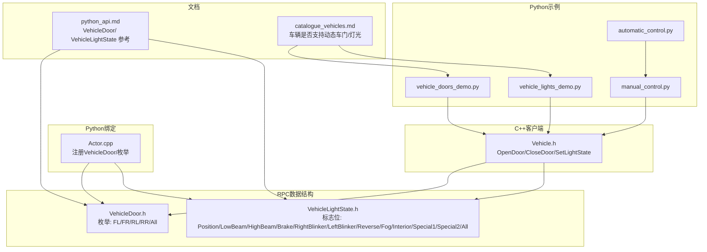
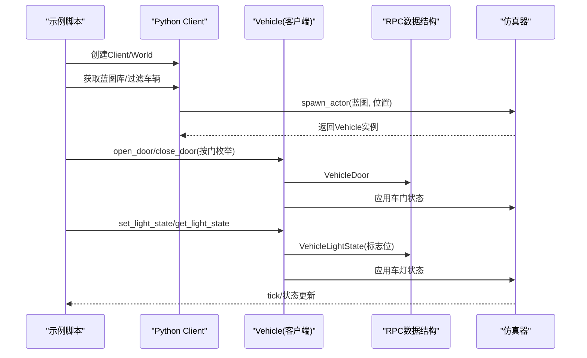
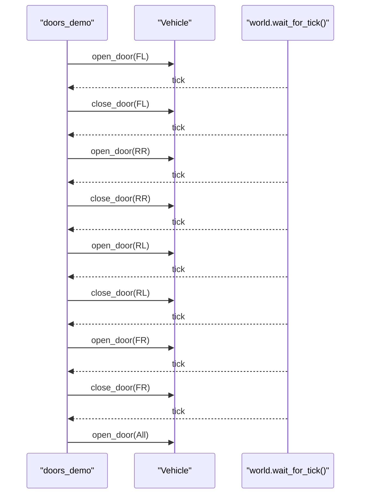
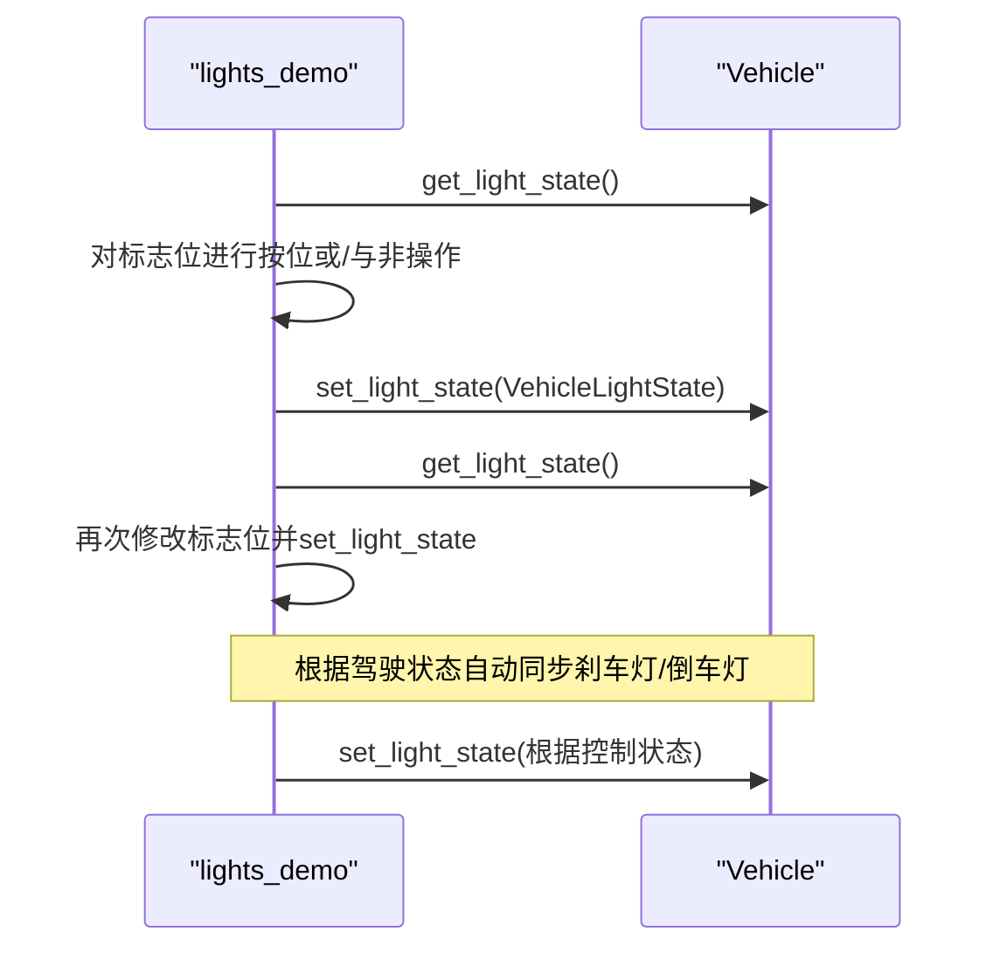
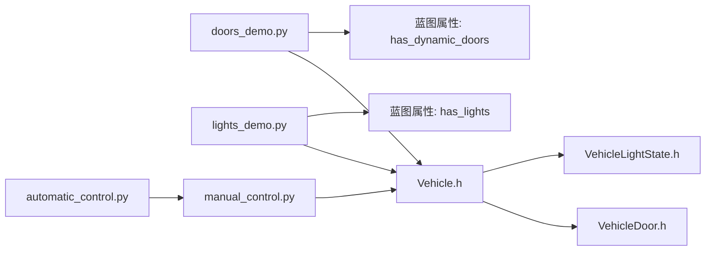

# 车辆高级控制

**本文引用的文件**
- [vehicle_doors_demo.py](https://github.com/carla-simulator/carla/blob/ue5-dev/PythonAPI/examples/vehicle_doors_demo.py)
- [vehicle_lights_demo.py](https://github.com/carla-simulator/carla/blob/ue5-dev/PythonAPI/examples/vehicle_lights_demo.py)
- [Vehicle.h](https://github.com/carla-simulator/carla/blob/ue5-dev/LibCarla/source/carla/client/Vehicle.h)
- [VehicleDoor.h](https://github.com/carla-simulator/carla/blob/ue5-dev/LibCarla/source/carla/rpc/VehicleDoor.h)
- [VehicleLightState.h](https://github.com/carla-simulator/carla/blob/ue5-dev/LibCarla/source/carla/rpc/VehicleLightState.h)
- [Actor.cpp](https://github.com/carla-simulator/carla/blob/ue5-dev/PythonAPI/carla/src/Actor.cpp)
- [python_api.md](https://github.com/carla-simulator/carla/blob/ue5-dev/Docs/python_api.md)
- [catalogue_vehicles.md](https://github.com/carla-simulator/carla/blob/ue5-dev/Docs/catalogue_vehicles.md)
- [manual_control.py](https://github.com/carla-simulator/carla/blob/ue5-dev/PythonAPI/examples/manual_control.py)
- [automatic_control.py](https://github.com/carla-simulator/carla/blob/ue5-dev/PythonAPI/examples/automatic_control.py)

## 目录
1. [简介](#简介)
2. [项目结构](#项目结构)
3. [核心组件](#核心组件)
4. [架构总览](#架构总览)
5. [详细组件分析](#详细组件分析)
6. [依赖关系分析](#依赖关系分析)
7. [性能考量](#性能考量)
8. [故障排查指南](#故障排查指南)
9. [结论](#结论)
10. [附录](#附录)

## 简介
本文件围绕CARLA中对车辆进行“高级控制”的方法展开，重点基于两个示例脚本：vehicle_doors_demo.py（车门演示）与vehicle_lights_demo.py（车灯演示）。我们将系统讲解如何通过Python客户端API控制车辆的车门（打开/关闭）与车灯状态（前大灯、转向灯、刹车灯等），并结合实际示例展示API调用方式、数据结构与标志位操作。同时，我们还将探讨这些功能在仿真场景中的应用，例如乘客上下车、故障模拟，并给出将基础驾驶控制与高级功能结合的最佳实践路径。

## 项目结构
与“车辆高级控制”直接相关的代码分布在以下位置：
- Python示例：PythonAPI/examples/vehicle_doors_demo.py、PythonAPI/examples/vehicle_lights_demo.py
- C++客户端接口：LibCarla/source/carla/client/Vehicle.h
- RPC数据结构：LibCarla/source/carla/rpc/VehicleDoor.h、LibCarla/source/carla/rpc/VehicleLightState.h
- Python绑定：PythonAPI/carla/src/Actor.cpp
- 文档与参考：Docs/python_api.md、Docs/catalogue_vehicles.md
- 集成示例：PythonAPI/examples/manual_control.py（包含灯光状态与驾驶控制联动）、PythonAPI/examples/automatic_control.py（自动控制框架）

图表来源
- [vehicle_doors_demo.py](https://github.com/carla-simulator/carla/blob/ue5-dev/PythonAPI/examples/vehicle_doors_demo.py#L1-L113)
- [vehicle_lights_demo.py](https://github.com/carla-simulator/carla/blob/ue5-dev/PythonAPI/examples/vehicle_lights_demo.py#L1-L124)
- [Vehicle.h](https://github.com/carla-simulator/carla/blob/ue5-dev/LibCarla/source/carla/client/Vehicle.h#L68-L100)
- [VehicleDoor.h](https://github.com/carla-simulator/carla/blob/ue5-dev/LibCarla/source/carla/rpc/VehicleDoor.h#L16-L24)
- [VehicleLightState.h](https://github.com/carla-simulator/carla/blob/ue5-dev/LibCarla/source/carla/rpc/VehicleLightState.h#L31-L46)
- [Actor.cpp](https://github.com/carla-simulator/carla/blob/ue5-dev/PythonAPI/carla/src/Actor.cpp#L170-L176)
- [python_api.md](https://github.com/carla-simulator/carla/blob/ue5-dev/Docs/python_api.md#L2581-L2634)
- [catalogue_vehicles.md](https://github.com/carla-simulator/carla/blob/ue5-dev/Docs/catalogue_vehicles.md#L171-L240)

章节来源
- [vehicle_doors_demo.py](https://github.com/carla-simulator/carla/blob/ue5-dev/PythonAPI/examples/vehicle_doors_demo.py#L1-L113)
- [vehicle_lights_demo.py](https://github.com/carla-simulator/carla/blob/ue5-dev/PythonAPI/examples/vehicle_lights_demo.py#L1-L124)
- [Vehicle.h](https://github.com/carla-simulator/carla/blob/ue5-dev/LibCarla/source/carla/client/Vehicle.h#L68-L100)
- [VehicleDoor.h](https://github.com/carla-simulator/carla/blob/ue5-dev/LibCarla/source/carla/rpc/VehicleDoor.h#L16-L24)
- [VehicleLightState.h](https://github.com/carla-simulator/carla/blob/ue5-dev/LibCarla/source/carla/rpc/VehicleLightState.h#L31-L46)
- [Actor.cpp](https://github.com/carla-simulator/carla/blob/ue5-dev/PythonAPI/carla/src/Actor.cpp#L170-L176)
- [python_api.md](https://github.com/carla-simulator/carla/blob/ue5-dev/Docs/python_api.md#L2581-L2634)
- [catalogue_vehicles.md](https://github.com/carla-simulator/carla/blob/ue5-dev/Docs/catalogue_vehicles.md#L171-L240)

## 核心组件
- 车门控制
  - API：Vehicle.OpenDoor(VehicleDoor)、Vehicle.CloseDoor(VehicleDoor)
  - 枚举：VehicleDoor（FL/FR/RL/RR/All）
  - 示例：vehicle_doors_demo.py中按顺序打开/关闭前后左右车门，并在最后统一打开所有车门
- 车灯控制
  - API：Vehicle.SetLightState(VehicleLightState)、Vehicle.GetLightState()
  - 标志位：VehicleLightState（Position/LowBeam/HighBeam/Brake/RightBlinker/LeftBlinker/Reverse/Fog/Interior/Special1/Special2/All）
  - 示例：vehicle_lights_demo.py中逐步切换位置灯、远光灯、刹车灯、雾灯、转向灯等
- 蓝图属性筛选
  - has_dynamic_doors、has_lights：用于过滤支持动态车门或灯光的车辆
- Python绑定
  - Actor.cpp中注册VehicleDoor枚举供Python使用
- 文档参考
  - python_api.md提供VehicleDoor与VehicleLightState的官方参考
  - catalogue_vehicles.md列出具体车辆是否具备上述能力

章节来源
- [Vehicle.h](https://github.com/carla-simulator/carla/blob/ue5-dev/LibCarla/source/carla/client/Vehicle.h#L68-L100)
- [VehicleDoor.h](https://github.com/carla-simulator/carla/blob/ue5-dev/LibCarla/source/carla/rpc/VehicleDoor.h#L16-L24)
- [VehicleLightState.h](https://github.com/carla-simulator/carla/blob/ue5-dev/LibCarla/source/carla/rpc/VehicleLightState.h#L31-L46)
- [Actor.cpp](https://github.com/carla-simulator/carla/blob/ue5-dev/PythonAPI/carla/src/Actor.cpp#L170-L176)
- [python_api.md](https://github.com/carla-simulator/carla/blob/ue5-dev/Docs/python_api.md#L2581-L2634)
- [catalogue_vehicles.md](https://github.com/carla-simulator/carla/blob/ue5-dev/Docs/catalogue_vehicles.md#L171-L240)

## 架构总览
下图展示了从Python示例到C++客户端接口与RPC数据结构的整体调用链路，以及与蓝图属性的关系。

图表来源
- [vehicle_doors_demo.py](https://github.com/carla-simulator/carla/blob/ue5-dev/PythonAPI/examples/vehicle_doors_demo.py#L57-L100)
- [vehicle_lights_demo.py](https://github.com/carla-simulator/carla/blob/ue5-dev/PythonAPI/examples/vehicle_lights_demo.py#L60-L110)
- [Vehicle.h](https://github.com/carla-simulator/carla/blob/ue5-dev/LibCarla/source/carla/client/Vehicle.h#L68-L100)
- [VehicleDoor.h](https://github.com/carla-simulator/carla/blob/ue5-dev/LibCarla/source/carla/rpc/VehicleDoor.h#L16-L24)
- [VehicleLightState.h](https://github.com/carla-simulator/carla/blob/ue5-dev/LibCarla/source/carla/rpc/VehicleLightState.h#L31-L46)

## 详细组件分析

### 组件A：车门控制（Vehicle.open_door / Vehicle.close_door）
- 功能概述
  - 通过Vehicle.OpenDoor/CloseDoor对指定车门执行开/关动作
  - 支持按单个车门（FL/FR/RL/RR）或All（全部车门）
- 数据结构与API
  - 车门枚举：VehicleDoor（定义于rpc层，Python侧通过Actor.cpp注册）
  - 客户端接口：Vehicle.OpenDoor/CloseDoor
- 示例流程
  - 按顺序打开前左、后右、后左、前右车门；最后统一打开所有车门
  - 在每次切换后等待一个tick以确保状态稳定
- 典型应用场景
  - 乘客上下车：先打开对应车门，再等待一段时间，最后关闭车门
  - 故障模拟：仅打开部分车门，模拟车门卡滞或损坏

图表来源
- [vehicle_doors_demo.py](https://github.com/carla-simulator/carla/blob/ue5-dev/PythonAPI/examples/vehicle_doors_demo.py#L63-L98)
- [Vehicle.h](https://github.com/carla-simulator/carla/blob/ue5-dev/LibCarla/source/carla/client/Vehicle.h#L68-L72)
- [VehicleDoor.h](https://github.com/carla-simulator/carla/blob/ue5-dev/LibCarla/source/carla/rpc/VehicleDoor.h#L16-L24)

章节来源
- [vehicle_doors_demo.py](https://github.com/carla-simulator/carla/blob/ue5-dev/PythonAPI/examples/vehicle_doors_demo.py#L57-L100)
- [Vehicle.h](https://github.com/carla-simulator/carla/blob/ue5-dev/LibCarla/source/carla/client/Vehicle.h#L68-L72)
- [VehicleDoor.h](https://github.com/carla-simulator/carla/blob/ue5-dev/LibCarla/source/carla/rpc/VehicleDoor.h#L16-L24)
- [Actor.cpp](https://github.com/carla-simulator/carla/blob/ue5-dev/PythonAPI/carla/src/Actor.cpp#L170-L176)

### 组件B：车灯控制（Vehicle.set_light_state / Vehicle.get_light_state）
- 功能概述
  - 使用VehicleLightState作为位标志组合控制多种车灯状态
  - 支持添加/移除特定标志位，实现复杂灯光序列
- 数据结构与API
  - 车灯标志位：VehicleLightState（Position/LowBeam/HighBeam/Brake/RightBlinker/LeftBlinker/Reverse/Fog/Interior/Special1/Special2/All）
  - 客户端接口：Vehicle.SetLightState、Vehicle.GetLightState
- 示例流程
  - 初始设置：开启内部灯、近光灯、位置灯、倒车灯
  - 中途切换：关闭近光/位置/倒车灯，开启远光灯与刹车灯
  - 最终阶段：开启雾灯、左右转向灯及两个特殊灯
- 与驾驶控制联动
  - manual_control.py中根据刹车/倒车状态自动同步刹车灯与倒车灯标志位

图表来源
- [vehicle_lights_demo.py](https://github.com/carla-simulator/carla/blob/ue5-dev/PythonAPI/examples/vehicle_lights_demo.py#L60-L110)
- [Vehicle.h](https://github.com/carla-simulator/carla/blob/ue5-dev/LibCarla/source/carla/client/Vehicle.h#L74-L100)
- [VehicleLightState.h](https://github.com/carla-simulator/carla/blob/ue5-dev/LibCarla/source/carla/rpc/VehicleLightState.h#L31-L46)
- [manual_control.py](https://github.com/carla-simulator/carla/blob/ue5-dev/PythonAPI/examples/manual_control.py#L560-L610)

章节来源
- [vehicle_lights_demo.py](https://github.com/carla-simulator/carla/blob/ue5-dev/PythonAPI/examples/vehicle_lights_demo.py#L60-L110)
- [Vehicle.h](https://github.com/carla-simulator/carla/blob/ue5-dev/LibCarla/source/carla/client/Vehicle.h#L74-L100)
- [VehicleLightState.h](https://github.com/carla-simulator/carla/blob/ue5-dev/LibCarla/source/carla/rpc/VehicleLightState.h#L31-L46)
- [manual_control.py](https://github.com/carla-simulator/carla/blob/ue5-dev/PythonAPI/examples/manual_control.py#L560-L610)

### 组件C：蓝图属性与可用性检测
- has_dynamic_doors / has_lights
  - 通过蓝图库过滤支持动态车门或灯光的车辆
- 车辆目录参考
  - catalogue_vehicles.md列出多款车型的has_lights与has_dynamic_doors字段，便于选择目标车辆

章节来源
- [vehicle_doors_demo.py](https://github.com/carla-simulator/carla/blob/ue5-dev/PythonAPI/examples/vehicle_doors_demo.py#L48-L56)
- [vehicle_lights_demo.py](https://github.com/carla-simulator/carla/blob/ue5-dev/PythonAPI/examples/vehicle_lights_demo.py#L49-L57)
- [catalogue_vehicles.md](https://github.com/carla-simulator/carla/blob/ue5-dev/Docs/catalogue_vehicles.md#L171-L240)

### 组件D：Python绑定与枚举导出
- Actor.cpp中注册VehicleDoor枚举，使Python侧可直接使用carla.VehicleDoor
- python_api.md提供VehicleDoor与VehicleLightState的官方参考说明

章节来源
- [Actor.cpp](https://github.com/carla-simulator/carla/blob/ue5-dev/PythonAPI/carla/src/Actor.cpp#L170-L176)
- [python_api.md](https://github.com/carla-simulator/carla/blob/ue5-dev/Docs/python_api.md#L2581-L2634)

## 依赖关系分析
- 调用链
  - 示例脚本 -> Python Client -> Vehicle(客户端) -> RPC数据结构 -> 仿真器
- 关键依赖
  - 车门：Vehicle.OpenDoor/CloseDoor依赖VehicleDoor枚举
  - 车灯：Vehicle.SetLightState依赖VehicleLightState标志位
- 外部接口
  - 蓝图属性：has_dynamic_doors、has_lights用于筛选车辆
  - 自动控制：manual_control.py与automatic_control.py展示了将高级控制与驾驶控制结合的模式

图表来源
- [vehicle_doors_demo.py](https://github.com/carla-simulator/carla/blob/ue5-dev/PythonAPI/examples/vehicle_doors_demo.py#L48-L56)
- [vehicle_lights_demo.py](https://github.com/carla-simulator/carla/blob/ue5-dev/PythonAPI/examples/vehicle_lights_demo.py#L49-L57)
- [Vehicle.h](https://github.com/carla-simulator/carla/blob/ue5-dev/LibCarla/source/carla/client/Vehicle.h#L68-L100)
- [VehicleDoor.h](https://github.com/carla-simulator/carla/blob/ue5-dev/LibCarla/source/carla/rpc/VehicleDoor.h#L16-L24)
- [VehicleLightState.h](https://github.com/carla-simulator/carla/blob/ue5-dev/LibCarla/source/carla/rpc/VehicleLightState.h#L31-L46)
- [manual_control.py](https://github.com/carla-simulator/carla/blob/ue5-dev/PythonAPI/examples/manual_control.py#L560-L610)
- [automatic_control.py](https://github.com/carla-simulator/carla/blob/ue5-dev/PythonAPI/examples/automatic_control.py#L1-L200)

章节来源
- [vehicle_doors_demo.py](https://github.com/carla-simulator/carla/blob/ue5-dev/PythonAPI/examples/vehicle_doors_demo.py#L48-L56)
- [vehicle_lights_demo.py](https://github.com/carla-simulator/carla/blob/ue5-dev/PythonAPI/examples/vehicle_lights_demo.py#L49-L57)
- [Vehicle.h](https://github.com/carla-simulator/carla/blob/ue5-dev/LibCarla/source/carla/client/Vehicle.h#L68-L100)
- [VehicleDoor.h](https://github.com/carla-simulator/carla/blob/ue5-dev/LibCarla/source/carla/rpc/VehicleDoor.h#L16-L24)
- [VehicleLightState.h](https://github.com/carla-simulator/carla/blob/ue5-dev/LibCarla/source/carla/rpc/VehicleLightState.h#L31-L46)
- [manual_control.py](https://github.com/carla-simulator/carla/blob/ue5-dev/PythonAPI/examples/manual_control.py#L560-L610)
- [automatic_control.py](https://github.com/carla-simulator/carla/blob/ue5-dev/PythonAPI/examples/automatic_control.py#L1-L200)

## 性能考量
- 控制频率与tick同步
  - 示例中通过world.wait_for_tick()与timestamp.delta_seconds控制相机旋转速度，避免频繁调用导致CPU占用过高
- 灯光状态变更策略
  - manual_control.py中仅在灯光状态发生变化时才调用set_light_state，减少不必要的网络/仿真器交互
- 车门状态变更
  - doors_demo中在每次开关门后等待一个tick，确保状态稳定后再继续下一步操作，避免状态抖动

章节来源
- [vehicle_doors_demo.py](https://github.com/carla-simulator/carla/blob/ue5-dev/PythonAPI/examples/vehicle_doors_demo.py#L69-L100)
- [vehicle_lights_demo.py](https://github.com/carla-simulator/carla/blob/ue5-dev/PythonAPI/examples/vehicle_lights_demo.py#L76-L110)
- [manual_control.py](https://github.com/carla-simulator/carla/blob/ue5-dev/PythonAPI/examples/manual_control.py#L560-L610)

## 故障排查指南
- 车辆不支持动态车门/灯光
  - 现象：调用open_door/close_door或set_light_state无效
  - 排查：检查蓝图属性has_dynamic_doors/has_lights；参考catalogue_vehicles.md确认目标车辆是否支持
- 转向灯/刹车灯未按预期闪烁
  - 现象：手动控制时转向灯/刹车灯未随驾驶状态变化
  - 排查：参考manual_control.py中对Brake与LeftBlinker/RightBlinker的同步逻辑，确保在刹车/转向时更新标志位
- 灯光状态未持久生效
  - 现象：灯光状态在tick之间丢失
  - 排查：确保在每个tick中持续设置灯光状态，或在状态改变时才更新

章节来源
- [catalogue_vehicles.md](https://github.com/carla-simulator/carla/blob/ue5-dev/Docs/catalogue_vehicles.md#L171-L240)
- [manual_control.py](https://github.com/carla-simulator/carla/blob/ue5-dev/PythonAPI/examples/manual_control.py#L560-L610)

## 结论
通过对vehicle_doors_demo.py与vehicle_lights_demo.py的深入分析，我们明确了在CARLA中对车辆进行高级控制的关键路径：蓝图属性筛选、Python绑定的枚举与标志位、以及Vehicle类提供的OpenDoor/CloseDoor与SetLightState接口。结合manual_control.py中的驾驶控制与灯光状态联动，可以构建更真实、更具表现力的交通参与者行为。在仿真场景中，这些能力可用于模拟乘客上下车、故障模拟等多样化任务，提升仿真真实度与可解释性。

## 附录
- 常用API速查
  - 车门：Vehicle.OpenDoor(VehicleDoor)、Vehicle.CloseDoor(VehicleDoor)
  - 车灯：Vehicle.SetLightState(VehicleLightState)、Vehicle.GetLightState()
  - 蓝图属性：has_dynamic_doors、has_lights
- 参考文档
  - python_api.md中的VehicleDoor与VehicleLightState参考
  - catalogue_vehicles.md中的车辆能力列表

章节来源
- [python_api.md](https://github.com/carla-simulator/carla/blob/ue5-dev/Docs/python_api.md#L2581-L2634)
- [catalogue_vehicles.md](https://github.com/carla-simulator/carla/blob/ue5-dev/Docs/catalogue_vehicles.md#L171-L240)