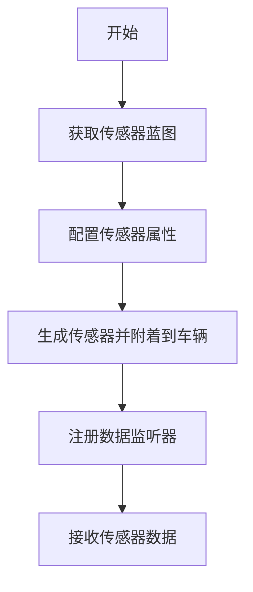

# IMU与GNSS传感器


**本文档中引用的文件**  
- [IMUMeasurement.h](https://github.com/carla-simulator/carla/blob/ue5-dev/LibCarla/source/carla/sensor/data/IMUMeasurement.h)
- [GnssMeasurement.h](https://github.com/carla-simulator/carla/blob/ue5-dev/LibCarla/source/carla/sensor/data/GnssMeasurement.h)
- [InertialMeasurementUnit.cpp](https://github.com/carla-simulator/carla/blob/ue5-dev/Unreal/CarlaUnreal/Plugins/Carla/Source/Carla/Sensor/InertialMeasurementUnit.cpp)
- [InertialMeasurementUnit.h](https://github.com/carla-simulator/carla/blob/ue5-dev/Unreal/CarlaUnreal/Plugins/Carla/Source/Carla/Sensor/InertialMeasurementUnit.h)
- [GnssSensor.cpp](https://github.com/carla-simulator/carla/blob/ue5-dev/Unreal/CarlaUnreal/Plugins/Carla/Source/Carla/Sensor/GnssSensor.cpp)
- [GnssSensor.h](https://github.com/carla-simulator/carla/blob/ue5-dev/Unreal/CarlaUnreal/Plugins/Carla/Source/Carla/Sensor/GnssSensor.h)
- [Vector3D.h](https://github.com/carla-simulator/carla/blob/ue5-dev/LibCarla/source/carla/geom/Vector3D.h)
- [GeoLocation.h](https://github.com/carla-simulator/carla/blob/ue5-dev/LibCarla/source/carla/geom/GeoLocation.h)
- [ref_sensors.md](https://github.com/carla-simulator/carla/blob/ue5-dev/Docs/ref_sensors.md)
- [IMUSerializer.cpp](https://github.com/carla-simulator/carla/blob/ue5-dev/LibCarla/source/carla/sensor/s11n/IMUSerializer.cpp)
- [GnssSerializer.cpp](https://github.com/carla-simulator/carla/blob/ue5-dev/LibCarla/source/carla/sensor/s11n/GnssSerializer.cpp)


## 目录
1. [引言](#引言)
2. [IMU传感器模拟原理](#imu传感器模拟原理)
3. [GNSS传感器模拟原理](#gnss传感器模拟原理)
4. [传感器数据单位与坐标系](#传感器数据单位与坐标系)
5. [噪声模型](#噪声模型)
6. [传感器创建与配置](#传感器创建与配置)
7. [数据处理与算法](#数据处理与算法)
8. [在车辆状态估计与SLAM中的应用](#在车辆状态估计与slam中的应用)
9. [代码示例](#代码示例)
10. [总结](#总结)

## 引言

CARLA仿真平台提供了高保真的IMU（惯性测量单元）和GNSS（全球导航卫星系统）传感器模拟，用于自动驾驶车辆的状态估计和定位。IMU传感器提供车辆的加速度、角速度和航向信息，而GNSS传感器提供车辆的全球地理位置信息。这些传感器在车辆动力学建模、姿态估计、定位算法和SLAM（同步定位与地图构建）中起着至关重要的作用。本文档详细介绍了CARLA中IMU和GNSS传感器的模拟原理、配置方法、数据格式、噪声模型以及在车辆状态估计中的应用。

**本节来源**  
- [ref_sensors.md](https://github.com/carla-simulator/carla/blob/ue5-dev/Docs/ref_sensors.md)

## IMU传感器模拟原理

CARLA中的IMU传感器通过物理引擎获取车辆的运动状态，并计算加速度、角速度和航向。IMU传感器在每次物理模拟步进后（PostPhysTick）进行数据更新，确保数据与车辆的真实物理状态同步。

加速度的计算基于车辆在连续三个时间步的位置，通过二次多项式插值的二阶导数来估算。具体公式为：d2[i] = -2.0*(y1/(h1*h2)-y2/((h2+h1)*h2)-y0/(h1*(h2+h1)))，其中y0、y1、y2是连续三个时间步的位置，h1和h2是对应的时间间隔。计算出的加速度向量会转换到IMU的局部坐标系，并加上标准的重力加速度（9.81 m/s²）。

角速度直接从车辆的物理组件获取，表示车辆绕其质心的旋转速率。该值同样会转换到IMU的局部坐标系。

航向（compass）通过计算车辆前进方向与世界坐标系北向（在CARLA中定义为(0.0, -1.0, 0.0)）之间的夹角得到，单位为弧度。

**本节来源**  
- [InertialMeasurementUnit.cpp](https://github.com/carla-simulator/carla/blob/ue5-dev/Unreal/CarlaUnreal/Plugins/Carla/Source/Carla/Sensor/InertialMeasurementUnit.cpp#L103-L146)
- [InertialMeasurementUnit.h](https://github.com/carla-simulator/carla/blob/ue5-dev/Unreal/CarlaUnreal/Plugins/Carla/Source/Carla/Sensor/InertialMeasurementUnit.h#L46-L52)

## GNSS传感器模拟原理

GNSS传感器通过将车辆在仿真世界中的局部坐标转换为全球地理坐标（经度、纬度、海拔）来模拟GPS定位。转换过程依赖于OpenDRIVE地图文件中定义的地理参考（GeoReference）。

传感器首先获取车辆在仿真世界中的位置（FVector），然后通过当前场景（episode）的地理参考对象（GeoReference）将其转换为经纬度坐标。这个转换过程是确定性的，确保了仿真结果的可重复性。

与真实GPS信号类似，CARLA的GNSS传感器也引入了可配置的随机噪声，以模拟真实世界中的定位误差。

**本节来源**  
- [GnssSensor.cpp](https://github.com/carla-simulator/carla/blob/ue5-dev/Unreal/CarlaUnreal/Plugins/Carla/Source/Carla/Sensor/GnssSensor.cpp#L47-L49)
- [GnssSensor.h](https://github.com/carla-simulator/carla/blob/ue5-dev/Unreal/CarlaUnreal/Plugins/Carla/Source/Carla/Sensor/GnssSensor.h#L64)

## 传感器数据单位与坐标系

### IMU数据单位与坐标系
- **加速度计 (Accelerometer)**：测量线性加速度，单位为米每二次方秒（m/s²）。数据在IMU的局部坐标系中提供，遵循右手定则，X轴向前，Y轴向右，Z轴向下。
- **陀螺仪 (Gyroscope)**：测量角速度，单位为弧度每秒（rad/s）。数据同样在IMU的局部坐标系中提供。
- **磁力计 (Compass)**：测量相对于正北方向的航向角，单位为弧度（rad）。在CARLA中，正北方向被定义为世界坐标系中的(0.0, -1.0, 0.0)。

### GNSS数据单位与坐标系
- **经度 (Longitude)** 和 **纬度 (Latitude)**：使用WGS84坐标系，单位为十进制度（degrees）。
- **海拔 (Altitude)**：相对于WGS84椭球面的高度，单位为米（m）。

所有传感器数据都附带一个`transform`属性，表示传感器在世界坐标系中的位置和旋转，以及`timestamp`和`frame`信息，用于时间同步。

**本节来源**  
- [IMUMeasurement.h](https://github.com/carla-simulator/carla/blob/ue5-dev/LibCarla/source/carla/sensor/data/IMUMeasurement.h)
- [GnssMeasurement.h](https://github.com/carla-simulator/carla/blob/ue5-dev/LibCarla/source/carla/sensor/data/GnssMeasurement.h)
- [ref_sensors.md](https://github.com/carla-simulator/carla/blob/ue5-dev/Docs/ref_sensors.md#L179-L186)

## 噪声模型

为了模拟真实传感器的不完美性，CARLA为IMU和GNSS传感器提供了可配置的噪声模型。

### IMU噪声模型
- **加速度计噪声**：采用高斯（正态）分布噪声。用户可以通过`noise_accel_stddev_x`、`noise_accel_stddev_y`、`noise_accel_stddev_z`属性设置各轴加速度的标准差。
- **陀螺仪噪声**：采用带有偏置的高斯分布噪声。用户可以通过`noise_gyro_bias_x`、`noise_gyro_bias_y`、`noise_gyro_bias_z`设置各轴的偏置（bias），并通过`noise_gyro_stddev_x`、`noise_gyro_stddev_y`、`noise_gyro_stddev_z`设置标准差。

### GNSS噪声模型
- **位置噪声**：对经度、纬度和海拔分别添加高斯噪声。用户可以通过`noise_lat_stddev`、`noise_lon_stddev`、`noise_alt_stddev`设置标准差，并通过`noise_lat_bias`、`noise_lon_bias`、`noise_alt_bias`设置偏置。

所有噪声的生成都基于一个伪随机数生成器，其种子可以通过`noise_seed`属性设置，以确保实验的可重复性。

**本节来源**  
- [InertialMeasurementUnit.cpp](https://github.com/carla-simulator/carla/blob/ue5-dev/Unreal/CarlaUnreal/Plugins/Carla/Source/Carla/Sensor/InertialMeasurementUnit.cpp#L72-L101)
- [GnssSensor.cpp](https://github.com/carla-simulator/carla/blob/ue5-dev/Unreal/CarlaUnreal/Plugins/Carla/Source/Carla/Sensor/GnssSensor.cpp#L50-L58)
- [ref_sensors.md](https://github.com/carla-simulator/carla/blob/ue5-dev/Docs/ref_sensors.md#L163-L173)

## 传感器创建与配置

在CARLA中，IMU和GNSS传感器通过蓝图（Blueprint）系统创建。以下是创建和配置传感器的步骤：

1.  **获取蓝图**：从蓝图库中查找`sensor.other.imu`或`sensor.other.gnss`。
2.  **设置属性**：根据需要配置传感器的噪声参数、更新频率（`sensor_tick`）等。
3.  **生成传感器**：使用`world.spawn_actor()`方法将传感器作为子对象附着到车辆上。
4.  **注册监听器**：使用`sensor.listen()`方法注册一个回调函数，以便在每次传感器更新时接收数据。



**本节来源**  
- [InertialMeasurementUnit.h](https://github.com/carla-simulator/carla/blob/ue5-dev/Unreal/CarlaUnreal/Plugins/Carla/Source/Carla/Sensor/InertialMeasurementUnit.h#L31)
- [GnssSensor.h](https://github.com/carla-simulator/carla/blob/ue5-dev/Unreal/CarlaUnreal/Plugins/Carla/Source/Carla/Sensor/GnssSensor.h#L31)
- [ref_sensors.md](https://github.com/carla-simulator/carla/blob/ue5-dev/Docs/ref_sensors.md#L115)

## 数据处理与算法

### 数据滤波
原始的IMU和GNSS数据包含噪声，通常需要进行滤波处理。常见的滤波算法包括：
- **低通滤波器**：用于去除IMU数据中的高频噪声。
- **卡尔曼滤波器 (Kalman Filter)**：结合IMU的高频数据和GNSS的低频但绝对位置数据，提供更平滑、更准确的位姿估计。

### 姿态估计
IMU的陀螺仪数据可以用于积分计算车辆的姿态（俯仰、横滚、偏航）。然而，由于积分会累积误差，通常需要与加速度计和磁力计的数据进行融合（如使用互补滤波器或Mahony滤波器）来校正漂移。

### 定位算法
GNSS提供绝对位置，但精度有限且可能丢失信号。IMU提供高频率的相对位移，但存在漂移。将两者融合的定位算法（如EKF-SLAM或基于滤波的融合算法）可以实现高精度、高鲁棒性的定位。

**本节来源**  
- [ref_sensors.md](https://github.com/carla-simulator/carla/blob/ue5-dev/Docs/ref_sensors.md)

## 在车辆状态估计与SLAM中的应用

IMU和GNSS传感器是车辆状态估计和SLAM系统的核心输入。

- **车辆状态估计**：IMU提供车辆的加速度和角速度，是估计车辆速度、位置和姿态的关键。GNSS提供全局位置参考，用于修正IMU积分产生的漂移。两者结合可以实现精确的车辆运动学建模。
- **SLAM算法**：在SLAM中，IMU数据可以作为运动模型的输入，预测车辆的位姿变化，从而减少对特征匹配的依赖，提高算法的鲁棒性和实时性。GNSS数据可以作为全局约束，帮助解决SLAM中的尺度不确定性和全局一致性问题，尤其是在长距离导航中。

**本节来源**  
- [ref_sensors.md](https://github.com/carla-simulator/carla/blob/ue5-dev/Docs/ref_sensors.md)

## 代码示例

以下Python代码示例展示了如何在CARLA中创建IMU传感器并处理其数据：

```python
class IMUSensor(object):
    def __init__(self, parent_actor):
        self.sensor = None
        self._parent = parent_actor
        self.accelerometer = (0.0, 0.0, 0.0)
        self.gyroscope = (0.0, 0.0, 0.0)
        self.compass = 0.0
        world = self._parent.get_world()
        bp = world.get_blueprint_library().find('sensor.other.imu')
        self.sensor = world.spawn_actor(
            bp, carla.Transform(), attach_to=self._parent)
        weak_self = weakref.ref(self)
        self.sensor.listen(
            lambda sensor_data: IMUSensor._IMU_callback(weak_self, sensor_data))

    @staticmethod
    def _IMU_callback(weak_self, sensor_data):
        self = weak_self()
        if not self:
            return
        self.accelerometer = (
            sensor_data.accelerometer.x,
            sensor_data.accelerometer.y,
            sensor_data.accelerometer.z)
        self.gyroscope = (
            math.degrees(sensor_data.gyroscope.x),
            math.degrees(sensor_data.gyroscope.y),
            math.degrees(sensor_data.gyroscope.z))
        self.compass = math.degrees(sensor_data.compass)
```

**本节来源**  
- [prop_control.py](https://github.com/carla-simulator/carla/blob/ue5-dev/PythonAPI/test/API/prop_control.py#L716-L747)
- [manual_control.py](https://github.com/carla-simulator/carla/blob/ue5-dev/PythonAPI/examples/manual_control.py#L990-L1021)

## 总结

CARLA平台提供了功能完备且可配置的IMU和GNSS传感器模拟。通过理解其模拟原理、数据格式、坐标系和噪声模型，开发者可以有效地利用这些传感器来开发和测试车辆状态估计、定位和SLAM算法。通过将高频率的IMU数据与绝对位置的GNSS数据进行融合，可以在仿真环境中实现接近真实世界的车辆感知能力，为自动驾驶系统的研发提供强大的支持。

**本节来源**  
- [ref_sensors.md](https://github.com/carla-simulator/carla/blob/ue5-dev/Docs/ref_sensors.md)