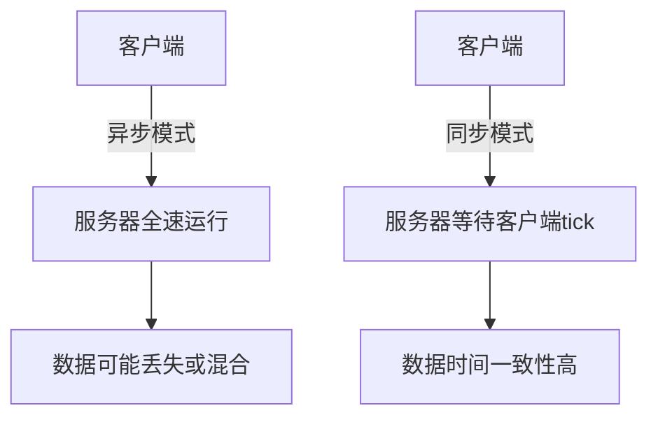
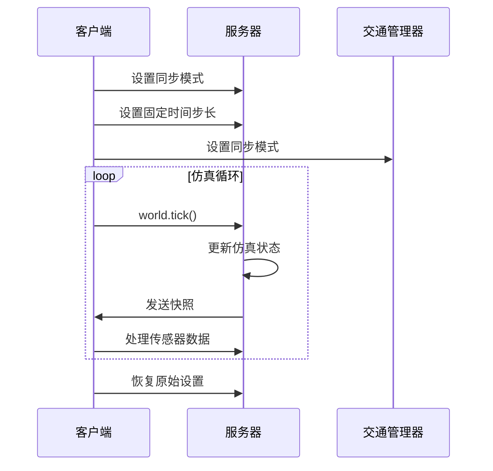
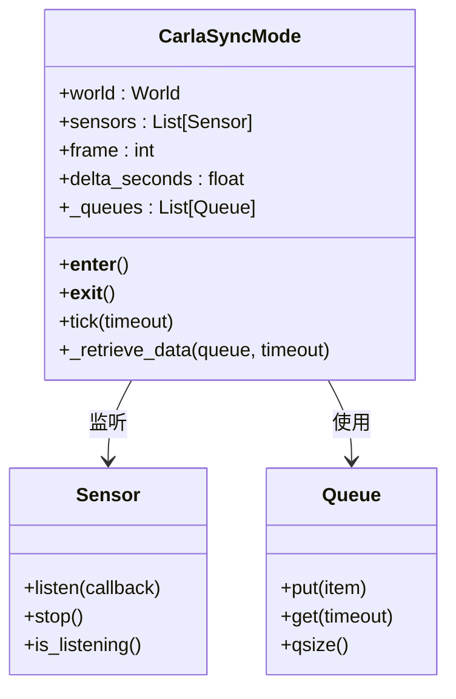

# 传感器数据同步

> **引用文件**
> **本文档中引用的文件**

- [sensor_synchronization.py](https://github.com/carla-simulator/carla/blob/ue5-dev/PythonAPI/examples/sensor_synchronization.py)
- [draw_skeleton.py](https://github.com/carla-simulator/carla/blob/ue5-dev/PythonAPI/examples/draw_skeleton.py)
- [adv_synchrony_timestep.md](https://github.com/carla-simulator/carla/blob/ue5-dev/Docs/adv_synchrony_timestep.md)
- [visualize_multiple_sensors.py](https://github.com/carla-simulator/carla/blob/ue5-dev/PythonAPI/examples/visualize_multiple_sensors.py)
- [test_sync.py](https://github.com/carla-simulator/carla/blob/ue5-dev/PythonAPI/test/smoke/test_sync.py)

## 目录

1. [引言](#引言)
2. [同步模式与异步模式对比](#同步模式与异步模式对比)
3. [世界同步模式设置](#世界同步模式设置)
4. [传感器数据同步机制](#传感器数据同步机制)
5. [同步数据流处理](#同步数据流处理)
6. [性能影响与最佳实践](#性能影响与最佳实践)

## 引言

在 CARLA 仿真环境中，传感器数据同步是确保多传感器数据时间一致性的关键机制。当使用多个传感器（如摄像头、激光雷达、雷达等）进行数据采集时，必须确保所有传感器的数据来自同一仿真时刻，这对于自动驾驶系统的感知、定位和决策至关重要。本文档深入讲解 CARLA 中的传感器数据同步机制，分析同步模式和异步模式的工作原理，并基于`sensor_synchronization.py`示例详细说明如何实现多传感器数据的时间同步。

**Section sources**

- <a href="https://github.com/carla-simulator/carla/blob/ue5-dev/PythonAPI/examples/sensor_synchronization.py#L1-L124" target="_blank">sensor_synchronization.py</a>
- <a href="https://github.com/carla-simulator/carla/blob/ue5-dev/Docs/adv_synchrony_timestep.md#L1-L282" target="_blank">adv_synchrony_timestep.md</a>

## 同步模式与异步模式对比

CARLA 仿真器采用客户端-服务器架构，其中服务器运行仿真，客户端负责获取信息和请求世界变更。通信模式分为同步模式和异步模式，两者在时间步长和数据一致性方面有显著差异。

### 同步模式

同步模式在客户端应用程序较慢或需要不同元素（如传感器）之间同步时特别重要。在此模式下，服务器会等待客户端的"tick"（就绪信号）后才更新到下一个仿真步骤。这种模式确保了客户端能够完全控制仿真及其信息流。

**优点：**

- 确保所有传感器数据来自同一仿真时刻
- 防止因客户端处理速度慢导致的信息溢出
- 便于实现精确的物理模拟和可重复的实验

**缺点：**

- 仿真速度受客户端处理速度限制
- 可能降低整体仿真效率

### 异步模式

异步模式是 CARLA 的默认模式。服务器以尽可能快的速度运行仿真，不等待客户端。这种模式适用于对实时性要求高但对数据时间一致性要求不高的场景。

**优点：**

- 服务器可以全速运行，提高仿真效率
- 适合快速数据采集和实时应用

**缺点：**

- 不同传感器的数据可能来自不同的仿真时刻
- 客户端可能无法处理所有数据，导致信息丢失或混合



**Diagram sources**

- <a href="https://github.com/carla-simulator/carla/blob/ue5-dev/Docs/adv_synchrony_timestep.md#L117-L118" target="_blank">adv_synchrony_timestep.md</a>

**Section sources**

- <a href="https://github.com/carla-simulator/carla/blob/ue5-dev/Docs/adv_synchrony_timestep.md#L117-L184" target="_blank">adv_synchrony_timestep.md</a>

## 世界同步模式设置

要启用同步模式，需要通过世界设置（World Settings）进行配置。以下是设置世界同步模式的关键步骤：

### 启用同步模式

```python
settings = world.get_settings()
settings.synchronous_mode = True
world.apply_settings(settings)
```

### 设置固定时间步长

同步模式通常与固定时间步长配合使用，以确保仿真的可预测性和物理模拟的准确性：

```python
settings.fixed_delta_seconds = 0.05
world.apply_settings(settings)
```

### 交通管理器同步

如果仿真中使用了交通管理器（Traffic Manager），也需要将其设置为同步模式：

```python
traffic_manager.set_synchronous_mode(True)
```

### 保存和恢复原始设置

在脚本结束时，应恢复原始设置以保持服务器状态的一致性：

```python
original_settings = world.get_settings()
# ... 仿真代码 ...
world.apply_settings(original_settings)
```



**Diagram sources**

- <a href="https://github.com/carla-simulator/carla/blob/ue5-dev/PythonAPI/examples/sensor_synchronization.py#L52-L55" target="_blank">sensor_synchronization.py</a>
- <a href="https://github.com/carla-simulator/carla/blob/ue5-dev/PythonAPI/examples/visualize_multiple_sensors.py#L261-L266" target="_blank">visualize_multiple_sensors.py</a>

**Section sources**

- <a href="https://github.com/carla-simulator/carla/blob/ue5-dev/PythonAPI/examples/sensor_synchronization.py#L47-L56" target="_blank">sensor_synchronization.py</a>
- <a href="https://github.com/carla-simulator/carla/blob/ue5-dev/PythonAPI/examples/visualize_multiple_sensors.py#L258-L267" target="_blank">visualize_multiple_sensors.py</a>

## 传感器数据同步机制

CARLA 提供了多种机制来确保多个传感器数据的时间一致性。核心思想是使用队列（Queue）来协调不同传感器的数据接收。

### 基于队列的同步机制

`sensor_synchronization.py`示例展示了如何使用队列实现多传感器同步：

1. 创建一个线程安全的队列来存储传感器数据
2. 为每个传感器设置回调函数，当收到数据时将其放入队列
3. 在主循环中，使用`world.tick()`推进仿真
4. 等待所有传感器数据到达队列后再进行处理

### 传感器回调函数

回调函数是传感器数据处理的核心，它在接收到数据时被调用：

```python
def sensor_callback(sensor_data, sensor_queue, sensor_name):
    sensor_queue.put((sensor_data.frame, sensor_name))
```

### 数据帧一致性验证

每个传感器数据和世界快照都包含帧编号（frame number），可用于验证数据的时间一致性：

```python
w_frame = world.get_snapshot().frame
s_frame = sensor_queue.get(True, 1.0)
assert w_frame == s_frame[0]  # 验证帧一致性
```

```mermaid
flowchart TD
A[创建传感器] --> B[设置监听回调]
B --> C[数据到达时放入队列]
C --> D[world.tick()推进仿真]
D --> E[获取世界快照]
E --> F[从队列获取所有传感器数据]
F --> G[验证数据时间一致性]
G --> H[处理同步数据]
```

**Diagram sources**

- <a href="https://github.com/carla-simulator/carla/blob/ue5-dev/PythonAPI/examples/sensor_synchronization.py#L34-L38" target="_blank">sensor_synchronization.py</a>
- <a href="https://github.com/carla-simulator/carla/blob/ue5-dev/PythonAPI/test/smoke/test_sync.py#L91-L93" target="_blank">test_sync.py</a>

**Section sources**

- <a href="https://github.com/carla-simulator/carla/blob/ue5-dev/PythonAPI/examples/sensor_synchronization.py#L60-L112" target="_blank">sensor_synchronization.py</a>
- <a href="https://github.com/carla-simulator/carla/blob/ue5-dev/PythonAPI/test/smoke/test_sync.py#L104-L121" target="_blank">test_sync.py</a>

## 同步数据流处理

处理同步数据流的关键是确保在处理数据之前，所有传感器的数据都已经到达。

### 等待所有传感器数据

在主循环中，使用循环等待所有传感器数据：

```python
for _ in range(len(sensor_list)):
    s_frame = sensor_queue.get(True, 1.0)
    print("    Frame: %d   Sensor: %s" % (s_frame[0], s_frame[1]))
```

### 超时处理

为防止无限等待，应设置合理的超时时间：

```python
except Empty:
    print("    Some of the sensor information is missed")
```

### CarlaSyncMode 上下文管理器

`draw_skeleton.py`示例中提供了一个更高级的同步模式实现——`CarlaSyncMode`上下文管理器：

```python
with CarlaSyncMode(world, camera, fps=30) as sync_mode:
    while True:
        snapshot, image_rgb = sync_mode.tick(timeout=5.0)
        # 处理同步数据
```

该实现自动处理设置应用、队列管理和资源清理，提供了更简洁的 API。



**Diagram sources**

- <a href="https://github.com/carla-simulator/carla/blob/ue5-dev/PythonAPI/examples/draw_skeleton.py#L35-L79" target="_blank">draw_skeleton.py</a>
- <a href="https://github.com/carla-simulator/carla/blob/ue5-dev/PythonAPI/examples/sensor_synchronization.py#L24-L38" target="_blank">sensor_synchronization.py</a>

**Section sources**

- <a href="https://github.com/carla-simulator/carla/blob/ue5-dev/PythonAPI/examples/draw_skeleton.py#L34-L79" target="_blank">draw_skeleton.py</a>
- <a href="https://github.com/carla-simulator/carla/blob/ue5-dev/PythonAPI/examples/sensor_synchronization.py#L100-L112" target="_blank">sensor_synchronization.py</a>

## 性能影响与最佳实践

同步模式虽然提供了数据一致性，但也带来了性能影响，需要遵循最佳实践来优化性能。

### 性能影响

- **仿真速度**：同步模式下仿真速度受最慢的客户端处理环节限制
- **内存使用**：大量传感器数据可能占用较多内存
- **延迟**：数据处理延迟会影响整体仿真效率

### 最佳实践

1. **始终使用固定时间步长**：在同步模式下，应始终使用固定时间步长以确保物理模拟的可靠性
2. **合理设置超时时间**：根据传感器性能和网络状况设置合理的超时时间
3. **批量处理命令**：使用`apply_batch_sync`批量处理命令，提高效率
4. **及时清理资源**：在脚本结束时及时销毁传感器和恢复原始设置
5. **监控队列状态**：定期检查队列大小，防止数据积压

### 物理子步进

为确保物理模拟的精确性，CARLA 支持物理子步进：

```python
settings.substepping = True
settings.max_substep_delta_time = 0.01
settings.max_substeps = 10
```

子步进参数需要与固定时间步长保持一致：

```
fixed_delta_seconds <= max_substep_delta_time * max_substeps
```

```mermaid
flowchart TD
A[开始] --> B[设置同步模式]
B --> C[设置固定时间步长]
C --> D[创建传感器]
D --> E[启动监听]
E --> F[主循环]
F --> G[world.tick()]
G --> H[等待所有传感器数据]
H --> I{数据完整?}
I --> |是| J[处理数据]
I --> |否| K[处理缺失]
J --> F
K --> F
F --> L[结束]
```

**Diagram sources**

- <a href="https://github.com/carla-simulator/carla/blob/ue5-dev/Docs/adv_synchrony_timestep.md#L91-L95" target="_blank">adv_synchrony_timestep.md</a>
- <a href="https://github.com/carla-simulator/carla/blob/ue5-dev/PythonAPI/examples/sensor_synchronization.py#L94-L112" target="_blank">sensor_synchronization.py</a>

**Section sources**

- <a href="https://github.com/carla-simulator/carla/blob/ue5-dev/Docs/adv_synchrony_timestep.md#L197-L198" target="_blank">adv_synchrony_timestep.md</a>
- <a href="https://github.com/carla-simulator/carla/blob/ue5-dev/PythonAPI/examples/sensor_synchronization.py#L110-L112" target="_blank">sensor_synchronization.py</a>
