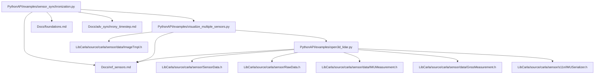
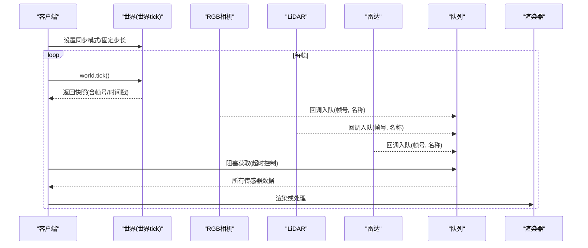
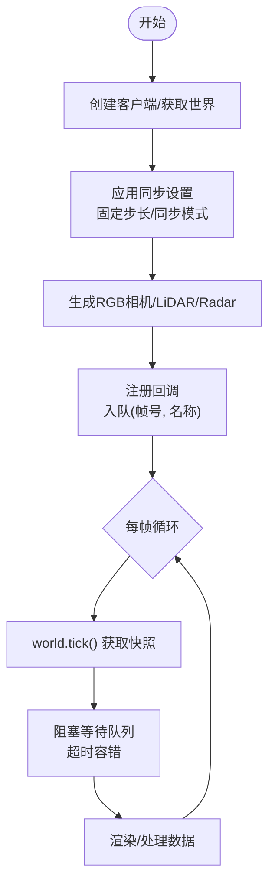
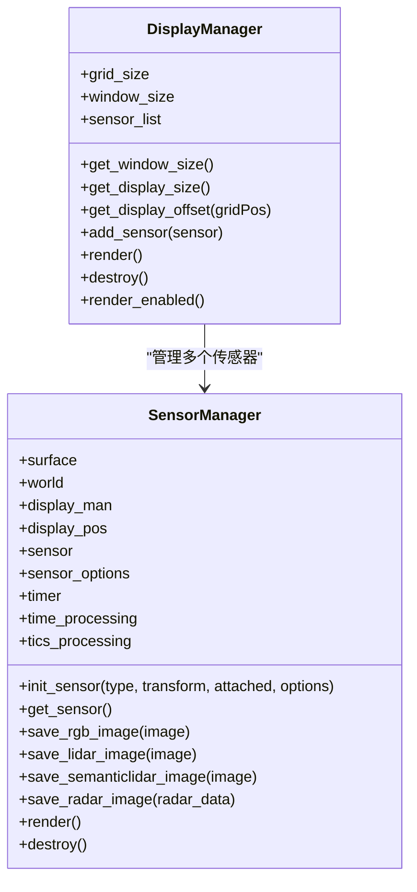
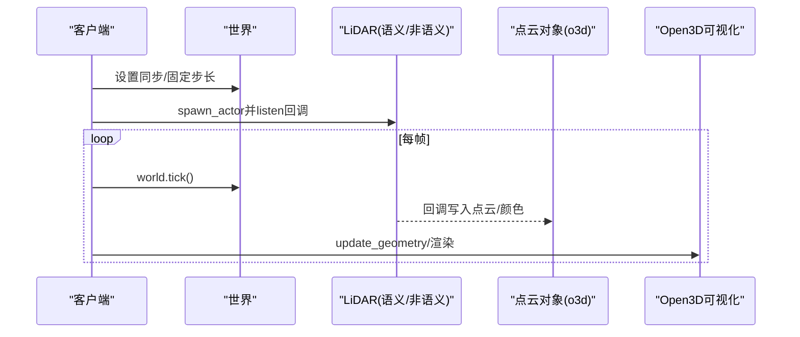
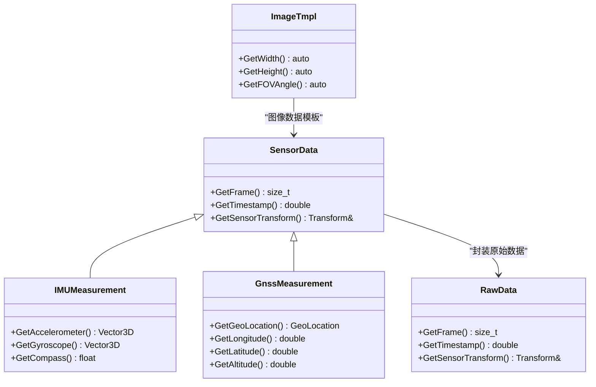
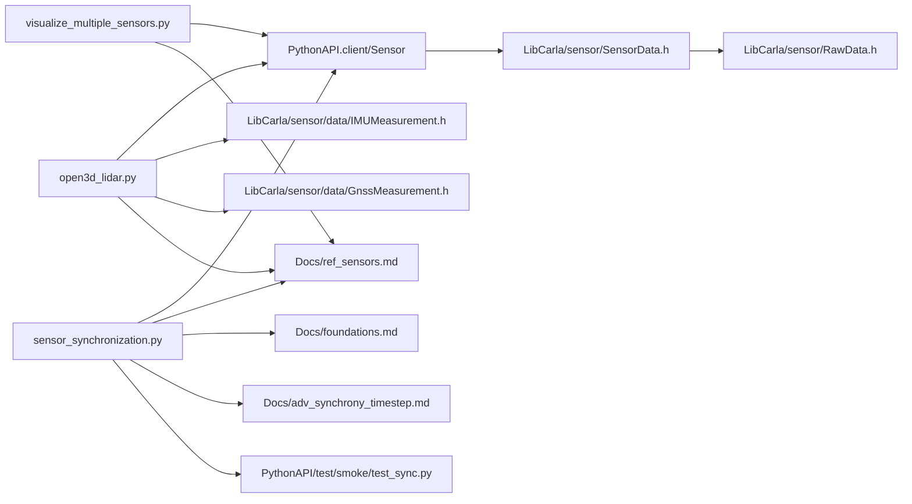

# 传感器集成与数据处理

**本文引用的文件**
- [sensor_synchronization.py](https://github.com/carla-simulator/carla/blob/ue5-dev/PythonAPI/examples/sensor_synchronization.py)
- [visualize_multiple_sensors.py](https://github.com/carla-simulator/carla/blob/ue5-dev/PythonAPI/examples/visualize_multiple_sensors.py)
- [open3d_lidar.py](https://github.com/carla-simulator/carla/blob/ue5-dev/PythonAPI/examples/open3d_lidar.py)
- [ref_sensors.md](https://github.com/carla-simulator/carla/blob/ue5-dev/Docs/ref_sensors.md)
- [foundations.md](https://github.com/carla-simulator/carla/blob/ue5-dev/Docs/foundations.md)
- [adv_synchrony_timestep.md](https://github.com/carla-simulator/carla/blob/ue5-dev/Docs/adv_synchrony_timestep.md)
- [SensorData.h](https://github.com/carla-simulator/carla/blob/ue5-dev/LibCarla/source/carla/sensor/SensorData.h)
- [RawData.h](https://github.com/carla-simulator/carla/blob/ue5-dev/LibCarla/source/carla/sensor/RawData.h)
- [ImageTmpl.h](https://github.com/carla-simulator/carla/blob/ue5-dev/LibCarla/source/carla/sensor/data/ImageTmpl.h)
- [IMUMeasurement.h](https://github.com/carla-simulator/carla/blob/ue5-dev/LibCarla/source/carla/sensor/data/IMUMeasurement.h)
- [GnssMeasurement.h](https://github.com/carla-simulator/carla/blob/ue5-dev/LibCarla/source/carla/sensor/data/GnssMeasurement.h)
- [IMUSerializer.h](https://github.com/carla-simulator/carla/blob/ue5-dev/LibCarla/source/carla/sensor/s11n/IMUSerializer.h)
- [test_sync.py](https://github.com/carla-simulator/carla/blob/ue5-dev/PythonAPI/test/smoke/test_sync.py)

## 目录
1. [简介](#简介)
2. [项目结构](#项目结构)
3. [核心组件](#核心组件)
4. [架构总览](#架构总览)
5. [详细组件分析](#详细组件分析)
6. [依赖关系分析](#依赖关系分析)
7. [性能考量](#性能考量)
8. [故障排查指南](#故障排查指南)
9. [结论](#结论)
10. [附录](#附录)

## 简介
本文件围绕CARLA仿真平台中的多传感器集成与数据处理展开，重点基于以下示例脚本：
- sensor_synchronization.py：演示传感器同步采集与队列阻塞等待机制，涵盖同步模式与异步模式差异。
- visualize_multiple_sensors.py：展示如何在单个窗口中渲染多个传感器（RGB相机、LiDAR、语义LiDAR、雷达），并讲解回调函数注册与数据转换流程。
- open3d_lidar.py：演示点云数据处理与可视化，包括强度着色与语义标签颜色映射，以及与Open3D的交互。

同时，结合官方参考文档与底层数据结构，系统阐述各类传感器（摄像头、激光雷达、雷达、IMU、GNSS）的蓝图属性、数据格式、坐标系约定、时间戳与帧号处理，以及同步/异步模式下的最佳实践与性能优化建议。

## 项目结构
本节聚焦与传感器相关的示例与文档，帮助快速定位关键实现与参考信息。

图表来源
- [sensor_synchronization.py](https://github.com/carla-simulator/carla/blob/ue5-dev/PythonAPI/examples/sensor_synchronization.py#L1-L124)
- [visualize_multiple_sensors.py](https://github.com/carla-simulator/carla/blob/ue5-dev/PythonAPI/examples/visualize_multiple_sensors.py#L1-L357)
- [open3d_lidar.py](https://github.com/carla-simulator/carla/blob/ue5-dev/PythonAPI/examples/open3d_lidar.py#L1-L287)
- [ref_sensors.md](https://github.com/carla-simulator/carla/blob/ue5-dev/Docs/ref_sensors.md#L1-L768)
- [foundations.md](https://github.com/carla-simulator/carla/blob/ue5-dev/Docs/foundations.md#L101-L121)
- [adv_synchrony_timestep.md](https://github.com/carla-simulator/carla/blob/ue5-dev/Docs/adv_synchrony_timestep.md#L161-L186)
- [SensorData.h](https://github.com/carla-simulator/carla/blob/ue5-dev/LibCarla/source/carla/sensor/SensorData.h#L1-L73)
- [RawData.h](https://github.com/carla-simulator/carla/blob/ue5-dev/LibCarla/source/carla/sensor/RawData.h#L1-L54)
- [ImageTmpl.h](https://github.com/carla-simulator/carla/blob/ue5-dev/LibCarla/source/carla/sensor/data/ImageTmpl.h#L44-L72)
- [IMUMeasurement.h](https://github.com/carla-simulator/carla/blob/ue5-dev/LibCarla/source/carla/sensor/data/IMUMeasurement.h#L1-L56)
- [GnssMeasurement.h](https://github.com/carla-simulator/carla/blob/ue5-dev/LibCarla/source/carla/sensor/data/GnssMeasurement.h#L1-L62)
- [IMUSerializer.h](https://github.com/carla-simulator/carla/blob/ue5-dev/LibCarla/source/carla/sensor/s11n/IMUSerializer.h#L1-L60)

章节来源
- [sensor_synchronization.py](https://github.com/carla-simulator/carla/blob/ue5-dev/PythonAPI/examples/sensor_synchronization.py#L1-L124)
- [visualize_multiple_sensors.py](https://github.com/carla-simulator/carla/blob/ue5-dev/PythonAPI/examples/visualize_multiple_sensors.py#L1-L357)
- [open3d_lidar.py](https://github.com/carla-simulator/carla/blob/ue5-dev/PythonAPI/examples/open3d_lidar.py#L1-L287)
- [ref_sensors.md](https://github.com/carla-simulator/carla/blob/ue5-dev/Docs/ref_sensors.md#L1-L768)
- [foundations.md](https://github.com/carla-simulator/carla/blob/ue5-dev/Docs/foundations.md#L101-L121)
- [adv_synchrony_timestep.md](https://github.com/carla-simulator/carla/blob/ue5-dev/Docs/adv_synchrony_timestep.md#L161-L186)

## 核心组件
- 同步采集与队列管理：通过监听器回调将各传感器数据入队，主循环按帧阻塞等待所有传感器返回，确保多传感器在同一时刻的数据对齐。
- 多传感器渲染管线：统一管理显示窗口与子传感器视图，分别处理RGB图像、LiDAR点云、语义LiDAR点云与雷达点阵。
- 点云处理与可视化：将原始点云数据解包为三维坐标与强度/语义标签，映射到Open3D点云对象并进行实时渲染。
- 数据结构与元信息：底层提供统一的传感器数据基类与原始数据头，包含帧号、时间戳、传感器位姿等关键字段。

章节来源
- [sensor_synchronization.py](https://github.com/carla-simulator/carla/blob/ue5-dev/PythonAPI/examples/sensor_synchronization.py#L30-L124)
- [visualize_multiple_sensors.py](https://github.com/carla-simulator/carla/blob/ue5-dev/PythonAPI/examples/visualize_multiple_sensors.py#L84-L243)
- [open3d_lidar.py](https://github.com/carla-simulator/carla/blob/ue5-dev/PythonAPI/examples/open3d_lidar.py#L51-L106)
- [SensorData.h](https://github.com/carla-simulator/carla/blob/ue5-dev/LibCarla/source/carla/sensor/SensorData.h#L1-L73)
- [RawData.h](https://github.com/carla-simulator/carla/blob/ue5-dev/LibCarla/source/carla/sensor/RawData.h#L1-L54)

## 架构总览
下图展示了从世界tick到传感器回调、数据入队与渲染的整体流程，体现同步模式下的时序一致性与异步模式下的解耦特性。

图表来源
- [sensor_synchronization.py](https://github.com/carla-simulator/carla/blob/ue5-dev/PythonAPI/examples/sensor_synchronization.py#L40-L117)
- [visualize_multiple_sensors.py](https://github.com/carla-simulator/carla/blob/ue5-dev/PythonAPI/examples/visualize_multiple_sensors.py#L244-L323)
- [foundations.md](https://github.com/carla-simulator/carla/blob/ue5-dev/Docs/foundations.md#L101-L121)
- [adv_synchrony_timestep.md](https://github.com/carla-simulator/carla/blob/ue5-dev/Docs/adv_synchrony_timestep.md#L161-L186)

## 详细组件分析

### 组件A：传感器同步采集与回调注册
- 创建与配置：通过蓝图库选择传感器类型，设置关键属性（如LiDAR的points_per_second、雷达的range等），并以spawn_actor生成实例。
- 注册回调：使用listen方法绑定lambda或函数，回调中通常进行数据转换、保存或入队操作。
- 同步等待：主循环中按传感器数量循环阻塞等待队列元素，超时则跳过缺失数据，保证帧间对齐。
- 资源清理：退出时恢复世界设置并销毁传感器与车辆。

图表来源
- [sensor_synchronization.py](https://github.com/carla-simulator/carla/blob/ue5-dev/PythonAPI/examples/sensor_synchronization.py#L40-L117)

章节来源
- [sensor_synchronization.py](https://github.com/carla-simulator/carla/blob/ue5-dev/PythonAPI/examples/sensor_synchronization.py#L40-L117)

### 组件B：多传感器渲染管线（RGB相机、LiDAR、语义LiDAR、雷达）
- 显示管理器：负责窗口尺寸、网格布局与子视图偏移，统一渲染与销毁。
- 传感器管理器：根据类型初始化对应传感器，设置蓝图属性，注册回调并缓存表面数据。
- 数据回调：
  - RGB相机：转换为numpy数组，必要时翻转通道顺序，供pygame绘制。
  - LiDAR/语义LiDAR：将raw_data解包为二维点集，缩放至显示区域并绘制为白点图。
  - 雷达：将raw_data解包为四元组(速度, 方位角, 俯仰角, 距离)，用于后续可视化或分析。
- 运行循环：tick世界、渲染显示、事件处理与退出清理。

图表来源
- [visualize_multiple_sensors.py](https://github.com/carla-simulator/carla/blob/ue5-dev/PythonAPI/examples/visualize_multiple_sensors.py#L42-L243)

章节来源
- [visualize_multiple_sensors.py](https://github.com/carla-simulator/carla/blob/ue5-dev/PythonAPI/examples/visualize_multiple_sensors.py#L42-L243)

### 组件C：点云数据处理与Open3D可视化（强度/语义）
- 强度LiDAR回调：从raw_data解包为四通道(f4)，分离强度并映射到伪彩；提取XYZ坐标，必要时调整坐标系以匹配Open3D右手系。
- 语义LiDAR回调：解包为结构化dtype，包含x/y/z、余弦入射角、对象索引与语义标签；按CityScapes调色板映射颜色。
- 传感器蓝图生成：根据参数设置上/下视野、通道数、最大距离、旋转频率与每秒点数等。
- 可视化循环：tick世界、更新几何体、渲染与窗口事件处理。

图表来源
- [open3d_lidar.py](https://github.com/carla-simulator/carla/blob/ue5-dev/PythonAPI/examples/open3d_lidar.py#L51-L106)
- [open3d_lidar.py](https://github.com/carla-simulator/carla/blob/ue5-dev/PythonAPI/examples/open3d_lidar.py#L108-L127)
- [open3d_lidar.py](https://github.com/carla-simulator/carla/blob/ue5-dev/PythonAPI/examples/open3d_lidar.py#L148-L277)

章节来源
- [open3d_lidar.py](https://github.com/carla-simulator/carla/blob/ue5-dev/PythonAPI/examples/open3d_lidar.py#L51-L106)
- [open3d_lidar.py](https://github.com/carla-simulator/carla/blob/ue5-dev/PythonAPI/examples/open3d_lidar.py#L108-L127)
- [open3d_lidar.py](https://github.com/carla-simulator/carla/blob/ue5-dev/PythonAPI/examples/open3d_lidar.py#L148-L277)

### 组件D：传感器数据格式与时间戳
- 基类与元信息：SensorData提供GetFrame()/GetTimestamp()/GetSensorTransform()等通用接口；RawData提供帧号、时间戳、传感器位姿等头部信息。
- 图像数据：ImageTmpl提供宽高与FOV等元信息。
- IMU/GNSS：底层测量类提供加速度、角速度、航向与经纬度/海拔等字段。
- 坐标系：官方文档明确所有传感器采用UE坐标系（x前、y右、z上），本地空间输出；注意与第三方库坐标系差异可能造成镜像效果。

图表来源
- [SensorData.h](https://github.com/carla-simulator/carla/blob/ue5-dev/LibCarla/source/carla/sensor/SensorData.h#L1-L73)
- [RawData.h](https://github.com/carla-simulator/carla/blob/ue5-dev/LibCarla/source/carla/sensor/RawData.h#L1-L54)
- [ImageTmpl.h](https://github.com/carla-simulator/carla/blob/ue5-dev/LibCarla/source/carla/sensor/data/ImageTmpl.h#L44-L72)
- [IMUMeasurement.h](https://github.com/carla-simulator/carla/blob/ue5-dev/LibCarla/source/carla/sensor/data/IMUMeasurement.h#L1-L56)
- [GnssMeasurement.h](https://github.com/carla-simulator/carla/blob/ue5-dev/LibCarla/source/carla/sensor/data/GnssMeasurement.h#L1-L62)
- [ref_sensors.md](https://github.com/carla-simulator/carla/blob/ue5-dev/Docs/ref_sensors.md#L1-L21)

章节来源
- [SensorData.h](https://github.com/carla-simulator/carla/blob/ue5-dev/LibCarla/source/carla/sensor/SensorData.h#L1-L73)
- [RawData.h](https://github.com/carla-simulator/carla/blob/ue5-dev/LibCarla/source/carla/sensor/RawData.h#L1-L54)
- [ImageTmpl.h](https://github.com/carla-simulator/carla/blob/ue5-dev/LibCarla/source/carla/sensor/data/ImageTmpl.h#L44-L72)
- [IMUMeasurement.h](https://github.com/carla-simulator/carla/blob/ue5-dev/LibCarla/source/carla/sensor/data/IMUMeasurement.h#L1-L56)
- [GnssMeasurement.h](https://github.com/carla-simulator/carla/blob/ue5-dev/LibCarla/source/carla/sensor/data/GnssMeasurement.h#L1-L62)
- [ref_sensors.md](https://github.com/carla-simulator/carla/blob/ue5-dev/Docs/ref_sensors.md#L1-L21)

## 依赖关系分析
- 示例脚本依赖PythonAPI的client与Sensor模块，通过蓝图库选择传感器类型并设置属性。
- 底层数据结构由LibCarla提供，统一了传感器数据的元信息与序列化接口。
- 文档与测试用例共同定义了同步模式行为、时间步长与帧号一致性要求。

图表来源
- [sensor_synchronization.py](https://github.com/carla-simulator/carla/blob/ue5-dev/PythonAPI/examples/sensor_synchronization.py#L1-L124)
- [visualize_multiple_sensors.py](https://github.com/carla-simulator/carla/blob/ue5-dev/PythonAPI/examples/visualize_multiple_sensors.py#L1-L357)
- [open3d_lidar.py](https://github.com/carla-simulator/carla/blob/ue5-dev/PythonAPI/examples/open3d_lidar.py#L1-L287)
- [SensorData.h](https://github.com/carla-simulator/carla/blob/ue5-dev/LibCarla/source/carla/sensor/SensorData.h#L1-L73)
- [RawData.h](https://github.com/carla-simulator/carla/blob/ue5-dev/LibCarla/source/carla/sensor/RawData.h#L1-L54)
- [IMUMeasurement.h](https://github.com/carla-simulator/carla/blob/ue5-dev/LibCarla/source/carla/sensor/data/IMUMeasurement.h#L1-L56)
- [GnssMeasurement.h](https://github.com/carla-simulator/carla/blob/ue5-dev/LibCarla/source/carla/sensor/data/GnssMeasurement.h#L1-L62)
- [ref_sensors.md](https://github.com/carla-simulator/carla/blob/ue5-dev/Docs/ref_sensors.md#L1-L768)
- [foundations.md](https://github.com/carla-simulator/carla/blob/ue5-dev/Docs/foundations.md#L101-L121)
- [adv_synchrony_timestep.md](https://github.com/carla-simulator/carla/blob/ue5-dev/Docs/adv_synchrony_timestep.md#L161-L186)
- [test_sync.py](https://github.com/carla-simulator/carla/blob/ue5-dev/PythonAPI/test/smoke/test_sync.py#L104-L121)

章节来源
- [sensor_synchronization.py](https://github.com/carla-simulator/carla/blob/ue5-dev/PythonAPI/examples/sensor_synchronization.py#L1-L124)
- [visualize_multiple_sensors.py](https://github.com/carla-simulator/carla/blob/ue5-dev/PythonAPI/examples/visualize_multiple_sensors.py#L1-L357)
- [open3d_lidar.py](https://github.com/carla-simulator/carla/blob/ue5-dev/PythonAPI/examples/open3d_lidar.py#L1-L287)
- [ref_sensors.md](https://github.com/carla-simulator/carla/blob/ue5-dev/Docs/ref_sensors.md#L1-L768)
- [foundations.md](https://github.com/carla-simulator/carla/blob/ue5-dev/Docs/foundations.md#L101-L121)
- [adv_synchrony_timestep.md](https://github.com/carla-simulator/carla/blob/ue5-dev/Docs/adv_synchrony_timestep.md#L161-L186)
- [test_sync.py](https://github.com/carla-simulator/carla/blob/ue5-dev/PythonAPI/test/smoke/test_sync.py#L104-L121)

## 性能考量
- 同步模式与固定步长：确保GPU传感器（如相机）延迟与多传感器对齐，避免数据溢出与丢失。
- 传感器频率与点密度：合理设置points_per_second、rotation_frequency与channels，平衡实时性与数据量。
- 渲染与显示：减少不必要的图像转换与拷贝，使用numpy向量化操作；在Open3D中适当降低点大小与背景亮度以提升流畅度。
- 无渲染模式：在仅处理数据不显示时启用无渲染模式，显著降低CPU/GPU开销。
- 超时与容错：同步等待时设置合理超时，避免因个别传感器卡顿导致整体停滞。

章节来源
- [foundations.md](https://github.com/carla-simulator/carla/blob/ue5-dev/Docs/foundations.md#L101-L121)
- [adv_synchrony_timestep.md](https://github.com/carla-simulator/carla/blob/ue5-dev/Docs/adv_synchrony_timestep.md#L161-L186)
- [open3d_lidar.py](https://github.com/carla-simulator/carla/blob/ue5-dev/PythonAPI/examples/open3d_lidar.py#L201-L216)

## 故障排查指南
- 同步等待超时：若部分传感器未按时返回，日志会提示缺失数据；检查传感器属性设置与回调是否正确注册。
- 帧号不一致：确保所有传感器在同一帧采集，避免跨帧混合；必要时在回调中记录并校验帧号。
- 坐标系问题：官方采用UE坐标系（x前、y右、z上），与某些库（如Open3D）右手系一致，但需注意Y轴方向差异可能导致镜像；示例中对Y轴进行了修正。
- IMU/GNSS首帧位姿：测试用例指出IMU等传感器在首次帧可能缺少正确位姿，应跳过首帧或做特殊处理。
- 传感器类型与属性：确认蓝图类型与属性键值有效，避免运行时报错或无效配置。

章节来源
- [sensor_synchronization.py](https://github.com/carla-simulator/carla/blob/ue5-dev/PythonAPI/examples/sensor_synchronization.py#L93-L117)
- [test_sync.py](https://github.com/carla-simulator/carla/blob/ue5-dev/PythonAPI/test/smoke/test_sync.py#L104-L121)
- [ref_sensors.md](https://github.com/carla-simulator/carla/blob/ue5-dev/Docs/ref_sensors.md#L1-L21)

## 结论
通过上述示例与底层数据结构，可以系统地完成多传感器的创建、参数配置、回调注册与数据处理。同步模式确保多传感器在同一时刻的数据对齐，适合需要严格时序一致性的场景；异步模式则更灵活，适用于对实时性要求较高且可容忍轻微时序偏差的应用。结合合理的性能优化策略与完善的错误处理，可在复杂场景中稳定高效地运行多传感器采集与可视化任务。

## 附录
- 传感器类型与属性参考：见“参考传感器”文档，涵盖RGB相机、深度相机、语义分割相机、光学流相机、DVS事件相机、LiDAR、语义LiDAR、雷达、碰撞检测、车道入侵、GNSS、IMU等。
- 时间步长与同步模式：见“高级同步与时步”文档，明确同步/异步两种配置对数据可靠性和可重复性的影响。
- 坐标系与数据格式：官方文档强调UE坐标系与本地空间输出，注意与第三方库坐标系差异。

章节来源
- [ref_sensors.md](https://github.com/carla-simulator/carla/blob/ue5-dev/Docs/ref_sensors.md#L1-L768)
- [adv_synchrony_timestep.md](https://github.com/carla-simulator/carla/blob/ue5-dev/Docs/adv_synchrony_timestep.md#L161-L186)