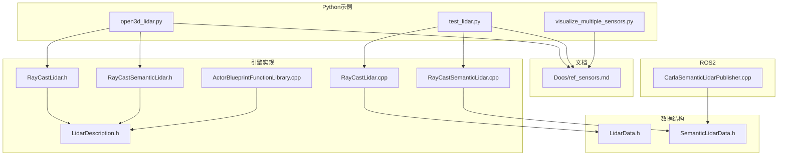
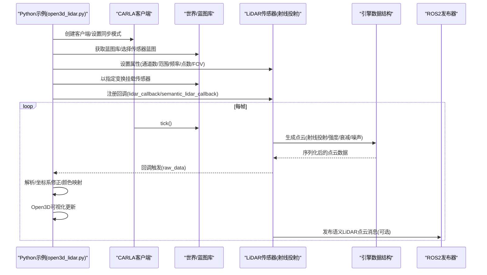
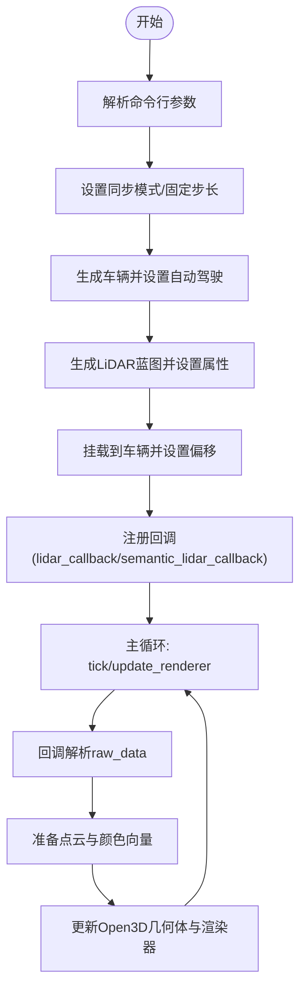
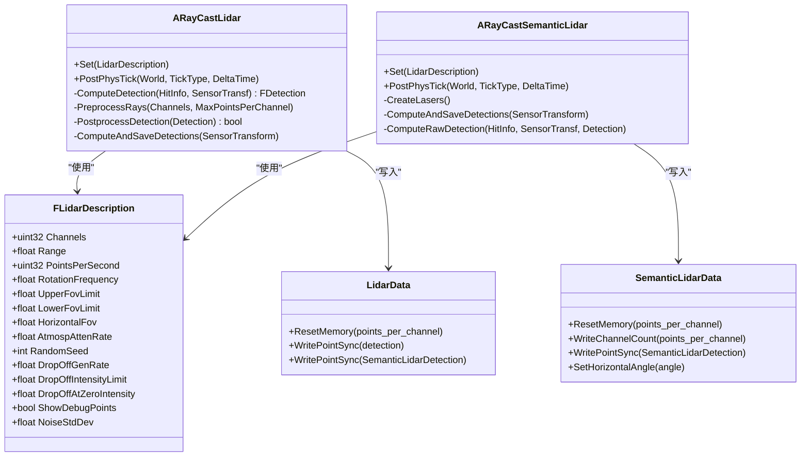
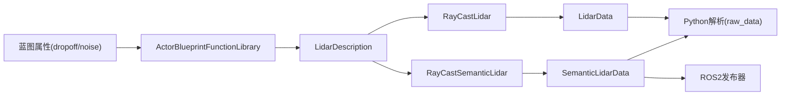

# 激光雷达传感器

> **引用文件**
> **本文引用的文件列表**

- [open3d_lidar.py](https://github.com/carla-simulator/carla/blob/ue5-dev/PythonAPI/examples/open3d_lidar.py)
- [test_lidar.py](https://github.com/carla-simulator/carla/blob/ue5-dev/PythonAPI/test/smoke/test_lidar.py)
- [ref_sensors.md](https://github.com/carla-simulator/carla/blob/ue5-dev/Docs/ref_sensors.md)
- [LidarData.h](https://github.com/carla-simulator/carla/blob/ue5-dev/LibCarla/source/carla/sensor/data/LidarData.h)
- [SemanticLidarData.h](https://github.com/carla-simulator/carla/blob/ue5-dev/LibCarla/source/carla/sensor/data/SemanticLidarData.h)
- [LidarDescription.h](https://github.com/carla-simulator/carla/blob/ue5-dev/Unreal/CarlaUnreal/Plugins/Carla/Source/Carla/Sensor/LidarDescription.h)
- [RayCastLidar.h](https://github.com/carla-simulator/carla/blob/ue5-dev/Unreal/CarlaUnreal/Plugins/Carla/Source/Carla/Sensor/RayCastLidar.h)
- [RayCastLidar.cpp](https://github.com/carla-simulator/carla/blob/ue5-dev/Unreal/CarlaUnreal/Plugins/Carla/Source/Carla/Sensor/RayCastLidar.cpp)
- [RayCastSemanticLidar.h](https://github.com/carla-simulator/carla/blob/ue5-dev/Unreal/CarlaUnreal/Plugins/Carla/Source/Carla/Sensor/RayCastSemanticLidar.h)
- [RayCastSemanticLidar.cpp](https://github.com/carla-simulator/carla/blob/ue5-dev/Unreal/CarlaUnreal/Plugins/Carla/Source/Carla/Sensor/RayCastSemanticLidar.cpp)
- [CarlaSemanticLidarPublisher.cpp](https://github.com/carla-simulator/carla/blob/ue5-dev/LibCarla/source/carla/ros2/publishers/CarlaSemanticLidarPublisher.cpp)
- [ActorBlueprintFunctionLibrary.cpp](https://github.com/carla-simulator/carla/blob/ue5-dev/Unreal/CarlaUnreal/Plugins/Carla/Source/Carla/Actor/ActorBlueprintFunctionLibrary.cpp)
- [visualize_multiple_sensors.py](https://github.com/carla-simulator/carla/blob/ue5-dev/PythonAPI/examples/visualize_multiple_sensors.py)

## 目录

1. [简介](#简介)
2. [项目结构与入口](#项目结构与入口)
3. [核心组件](#核心组件)
4. [架构总览](#架构总览)
5. [详细组件分析](#详细组件分析)
6. [依赖关系分析](#依赖关系分析)
7. [性能与配置影响](#性能与配置影响)
8. [故障排查指南](#故障排查指南)
9. [结论](#结论)
10. [附录：参数与数据结构速查](#附录参数与数据结构速查)

## 简介

本章节面向希望在 CARLA 中使用激光雷达传感器（LiDAR）进行感知仿真的用户，系统性地介绍 LiDAR 的工作原理、配置参数、数据结构、坐标系与时间戳处理，并结合 open3d_lidar.py 示例讲解如何创建 LiDAR 传感器、接收点云数据并用 Open3D 进行可视化；同时给出点云滤波、分割与特征提取的实践思路与参考路径，最后讨论不同 LiDAR 配置对仿真性能与数据质量的影响。

## 项目结构与入口

- 示例脚本：open3d_lidar.py 展示了如何通过 Python API 创建 LiDAR 或语义 LiDAR 传感器，监听点云数据并通过 Open3D 进行实时可视化。
- 测试脚本：test_lidar.py 验证了 LiDAR 与语义 LiDAR 输出点数一致性、帧号一致性以及噪声/衰减模型对点数的影响。
- 文档：ref_sensors.md 提供了 LiDAR 与语义 LiDAR 的蓝图属性、输出字段与行为说明。
- 引擎实现：Unreal 侧的 RayCastLidar 与 RayCastSemanticLidar 负责射线投射、强度/衰减/噪声模型、通道计数统计与点云打包。
- 数据结构：LibCarla 侧的 LidarData 与 SemanticLidarData 定义了点云序列化布局与检测项字段。
- ROS2 发布器：CarlaSemanticLidarPublisher.cpp 展示了语义 LiDAR 在 ROS2 下的点云消息字段描述。

图表来源

- <a href="https://github.com/carla-simulator/carla/blob/ue5-dev/PythonAPI/examples/open3d_lidar.py#L1-L287" target="_blank">open3d_lidar.py</a>
- <a href="https://github.com/carla-simulator/carla/blob/ue5-dev/PythonAPI/test/smoke/test_lidar.py#L1-L239" target="_blank">test_lidar.py</a>
- <a href="https://github.com/carla-simulator/carla/blob/ue5-dev/Docs/ref_sensors.md#L493-L649" target="_blank">ref_sensors.md</a>
- <a href="https://github.com/carla-simulator/carla/blob/ue5-dev/Unreal/CarlaUnreal/Plugins/Carla/Source/Carla/Sensor/RayCastLidar.h#L1-L70" target="_blank">RayCastLidar.h</a>
- <a href="https://github.com/carla-simulator/carla/blob/ue5-dev/Unreal/CarlaUnreal/Plugins/Carla/Source/Carla/Sensor/RayCastLidar.cpp#L46-L195" target="_blank">RayCastLidar.cpp</a>
- <a href="https://github.com/carla-simulator/carla/blob/ue5-dev/Unreal/CarlaUnreal/Plugins/Carla/Source/Carla/Sensor/RayCastSemanticLidar.h#L1-L48" target="_blank">RayCastSemanticLidar.h</a>
- <a href="https://github.com/carla-simulator/carla/blob/ue5-dev/Unreal/CarlaUnreal/Plugins/Carla/Source/Carla/Sensor/RayCastSemanticLidar.cpp#L1-L212" target="_blank">RayCastSemanticLidar.cpp</a>
- <a href="https://github.com/carla-simulator/carla/blob/ue5-dev/Unreal/CarlaUnreal/Plugins/Carla/Source/Carla/Sensor/LidarDescription.h#L1-L72" target="_blank">LidarDescription.h</a>
- <a href="https://github.com/carla-simulator/carla/blob/ue5-dev/Unreal/CarlaUnreal/Plugins/Carla/Source/Carla/Actor/ActorBlueprintFunctionLibrary.cpp#L1427-L1434" target="_blank">ActorBlueprintFunctionLibrary.cpp</a>
- <a href="https://github.com/carla-simulator/carla/blob/ue5-dev/LibCarla/source/carla/sensor/data/LidarData.h#L1-L121" target="_blank">LidarData.h</a>
- <a href="https://github.com/carla-simulator/carla/blob/ue5-dev/LibCarla/source/carla/sensor/data/SemanticLidarData.h#L1-L154" target="_blank">SemanticLidarData.h</a>
- <a href="https://github.com/carla-simulator/carla/blob/ue5-dev/LibCarla/source/carla/ros2/publishers/CarlaSemanticLidarPublisher.cpp#L168-L201" target="_blank">CarlaSemanticLidarPublisher.cpp</a>

章节来源

- <a href="https://github.com/carla-simulator/carla/blob/ue5-dev/PythonAPI/examples/open3d_lidar.py#L1-L287" target="_blank">open3d_lidar.py</a>
- <a href="https://github.com/carla-simulator/carla/blob/ue5-dev/PythonAPI/test/smoke/test_lidar.py#L1-L239" target="_blank">test_lidar.py</a>
- <a href="https://github.com/carla-simulator/carla/blob/ue5-dev/Docs/ref_sensors.md#L493-L649" target="_blank">ref_sensors.md</a>

## 核心组件

- Python 示例与测试
  - open3d_lidar.py：演示非语义 LiDAR 与语义 LiDAR 的创建、回调处理、Open3D 可视化与坐标系修正。
  - test_lidar.py：验证点数一致性、帧号一致性与噪声/衰减模型效果。
  - visualize_multiple_sensors.py：多传感器并行渲染示例，包含 LiDAR 与语义 LiDAR 的配置与显示逻辑。
- 引擎实现
  - RayCastLidar/RayCastSemanticLidar：射线投射 LiDAR 实现，负责通道分布、旋转模拟、强度计算、衰减与噪声后处理、点云打包与通道计数写入。
  - LidarDescription：LiDAR 硬件级参数（通道数、最大距离、每秒点数、旋转频率、上下视场角、水平视场角、噪声与衰减等）。
  - ActorBlueprintFunctionLibrary：从蓝图属性映射到 LidarDescription 的参数解析。
- 数据结构
  - LidarData：非语义 LiDAR 的点云序列化布局（XYZ+强度），支持重置内存与写入点。
  - SemanticLidarData：语义 LiDAR 的点云序列化布局（XYZ+余弦入射角+对象索引+语义标签），支持水平角度与通道计数写入。
- 文档与接口
  - ref_sensors.md：蓝图属性、输出字段、行为说明与公式推导。

章节来源

- <a href="https://github.com/carla-simulator/carla/blob/ue5-dev/PythonAPI/examples/open3d_lidar.py#L1-L287" target="_blank">open3d_lidar.py</a>
- <a href="https://github.com/carla-simulator/carla/blob/ue5-dev/PythonAPI/test/smoke/test_lidar.py#L1-L239" target="_blank">test_lidar.py</a>
- <a href="https://github.com/carla-simulator/carla/blob/ue5-dev/Docs/ref_sensors.md#L493-L649" target="_blank">ref_sensors.md</a>
- <a href="https://github.com/carla-simulator/carla/blob/ue5-dev/Unreal/CarlaUnreal/Plugins/Carla/Source/Carla/Sensor/RayCastLidar.h#L1-L70" target="_blank">RayCastLidar.h</a>
- <a href="https://github.com/carla-simulator/carla/blob/ue5-dev/Unreal/CarlaUnreal/Plugins/Carla/Source/Carla/Sensor/RayCastLidar.cpp#L46-L195" target="_blank">RayCastLidar.cpp</a>
- <a href="https://github.com/carla-simulator/carla/blob/ue5-dev/Unreal/CarlaUnreal/Plugins/Carla/Source/Carla/Sensor/RayCastSemanticLidar.h#L1-L48" target="_blank">RayCastSemanticLidar.h</a>
- <a href="https://github.com/carla-simulator/carla/blob/ue5-dev/Unreal/CarlaUnreal/Plugins/Carla/Source/Carla/Sensor/RayCastSemanticLidar.cpp#L1-L212" target="_blank">RayCastSemanticLidar.cpp</a>
- <a href="https://github.com/carla-simulator/carla/blob/ue5-dev/Unreal/CarlaUnreal/Plugins/Carla/Source/Carla/Sensor/LidarDescription.h#L1-L72" target="_blank">LidarDescription.h</a>
- <a href="https://github.com/carla-simulator/carla/blob/ue5-dev/Unreal/CarlaUnreal/Plugins/Carla/Source/Carla/Actor/ActorBlueprintFunctionLibrary.cpp#L1427-L1434" target="_blank">ActorBlueprintFunctionLibrary.cpp</a>
- <a href="https://github.com/carla-simulator/carla/blob/ue5-dev/LibCarla/source/carla/sensor/data/LidarData.h#L1-L121" target="_blank">LidarData.h</a>
- <a href="https://github.com/carla-simulator/carla/blob/ue5-dev/LibCarla/source/carla/sensor/data/SemanticLidarData.h#L1-L154" target="_blank">SemanticLidarData.h</a>

## 架构总览

下图展示从 Python API 到 Unreal 引擎再到数据结构与发布的端到端流程，以及关键参数在蓝图与引擎之间的映射关系。

图表来源

- <a href="https://github.com/carla-simulator/carla/blob/ue5-dev/PythonAPI/examples/open3d_lidar.py#L148-L277" target="_blank">open3d_lidar.py</a>
- <a href="https://github.com/carla-simulator/carla/blob/ue5-dev/Unreal/CarlaUnreal/Plugins/Carla/Source/Carla/Sensor/RayCastLidar.cpp#L46-L195" target="_blank">RayCastLidar.cpp</a>
- <a href="https://github.com/carla-simulator/carla/blob/ue5-dev/Unreal/CarlaUnreal/Plugins/Carla/Source/Carla/Sensor/RayCastSemanticLidar.cpp#L49-L212" target="_blank">RayCastSemanticLidar.cpp</a>
- <a href="https://github.com/carla-simulator/carla/blob/ue5-dev/LibCarla/source/carla/sensor/data/LidarData.h#L1-L121" target="_blank">LidarData.h</a>
- <a href="https://github.com/carla-simulator/carla/blob/ue5-dev/LibCarla/source/carla/sensor/data/SemanticLidarData.h#L1-L154" target="_blank">SemanticLidarData.h</a>
- <a href="https://github.com/carla-simulator/carla/blob/ue5-dev/LibCarla/source/carla/ros2/publishers/CarlaSemanticLidarPublisher.cpp#L168-L201" target="_blank">CarlaSemanticLidarPublisher.cpp</a>

## 详细组件分析

### Python 示例：open3d_lidar.py

- 关键流程
  - 参数解析：支持是否语义 LiDAR、是否去噪、上下视场角、通道数、最大距离、每秒点数、传感器偏移等。
  - 同步模式：固定步长与同步模式设置，确保帧号与点云时序一致。
  - 传感器生成：根据参数选择普通或语义 LiDAR 蓝图，设置噪声/衰减、FOV、通道、范围、旋转频率、points_per_second。
  - 回调处理：
    - 非语义 LiDAR：从 raw_data 解析 XYZ+强度，按强度映射颜色，修正 Y 轴方向以匹配 Open3D 右手坐标系，填充 Open3D 点云对象。
    - 语义 LiDAR：从 raw_data 解析 XYZ+余弦入射角+对象索引+语义标签，按 CityScapes 色板映射颜色，修正 Y 轴方向。
  - 可视化：创建 Open3D 窗口，添加坐标轴，循环更新几何体与渲染器，打印 FPS。
- 坐标系与时间戳
  - 坐标系：示例中对 Y 轴取负以匹配 Unreal 坐标系与 Open3D 右手坐标系的一致性。
  - 时间戳：Python 侧未直接使用，但 LiDAR 测量对象包含 frame 与 timestamp 字段，可用于帧号与仿真时间对齐。

图表来源

- <a href="https://github.com/carla-simulator/carla/blob/ue5-dev/PythonAPI/examples/open3d_lidar.py#L148-L277" target="_blank">open3d_lidar.py</a>

章节来源

- <a href="https://github.com/carla-simulator/carla/blob/ue5-dev/PythonAPI/examples/open3d_lidar.py#L1-L287" target="_blank">open3d_lidar.py</a>

### 测试脚本：test_lidar.py

- 功能要点
  - 验证非语义 LiDAR 与语义 LiDAR 的点数一致性：raw_data 解析点数、遍历测量数组点数、通道计数之和三者相等。
  - 帧号一致性：同步模式下，语义 LiDAR 与无衰减 LiDAR 在同一帧内点数应一致，且默认 LiDAR 点数显著少于语义 LiDAR（受衰减/噪声影响）。
  - 多组配置对比：不同通道数、范围、points_per_second、rotation_frequency 组合下的点数与帧号校验。
- 实践建议
  - 在集成测试中复用该模式，快速验证 LiDAR 配置与数据完整性。
  - 使用队列同步获取各传感器的 frame 与点数，便于跨传感器比对。

章节来源

- <a href="https://github.com/carla-simulator/carla/blob/ue5-dev/PythonAPI/test/smoke/test_lidar.py#L1-L239" target="_blank">test_lidar.py</a>

### 引擎实现：RayCastLidar 与 RayCastSemanticLidar

- 射线投射与通道分布
  - 通道数决定垂直视场角内的激光线分布，上下视场角决定每条激光的仰角。
  - 水平旋转由每帧旋转频率与固定步长共同决定，确保每帧输出为静态“快照”。
- 强度与衰减/噪声
  - 非语义 LiDAR：计算大气衰减强度，应用噪声高斯扰动，按衰减阈值与概率丢弃点，保留有效点并写入 LidarData。
  - 语义 LiDAR：不包含强度、衰减与噪声模型，仅记录几何与语义信息。
- 点云打包与通道计数
  - 计算每通道点数，重置内存，逐通道写入点，最终写入通道计数，供 Python 侧读取。

图表来源

- <a href="https://github.com/carla-simulator/carla/blob/ue5-dev/Unreal/CarlaUnreal/Plugins/Carla/Source/Carla/Sensor/RayCastLidar.h#L1-L70" target="_blank">RayCastLidar.h</a>
- <a href="https://github.com/carla-simulator/carla/blob/ue5-dev/Unreal/CarlaUnreal/Plugins/Carla/Source/Carla/Sensor/RayCastLidar.cpp#L46-L195" target="_blank">RayCastLidar.cpp</a>
- <a href="https://github.com/carla-simulator/carla/blob/ue5-dev/Unreal/CarlaUnreal/Plugins/Carla/Source/Carla/Sensor/RayCastSemanticLidar.h#L1-L48" target="_blank">RayCastSemanticLidar.h</a>
- <a href="https://github.com/carla-simulator/carla/blob/ue5-dev/Unreal/CarlaUnreal/Plugins/Carla/Source/Carla/Sensor/RayCastSemanticLidar.cpp#L49-L212" target="_blank">RayCastSemanticLidar.cpp</a>
- <a href="https://github.com/carla-simulator/carla/blob/ue5-dev/Unreal/CarlaUnreal/Plugins/Carla/Source/Carla/Sensor/LidarDescription.h#L1-L72" target="_blank">LidarDescription.h</a>
- <a href="https://github.com/carla-simulator/carla/blob/ue5-dev/LibCarla/source/carla/sensor/data/LidarData.h#L1-L121" target="_blank">LidarData.h</a>
- <a href="https://github.com/carla-simulator/carla/blob/ue5-dev/LibCarla/source/carla/sensor/data/SemanticLidarData.h#L1-L154" target="_blank">SemanticLidarData.h</a>

章节来源

- <a href="https://github.com/carla-simulator/carla/blob/ue5-dev/Unreal/CarlaUnreal/Plugins/Carla/Source/Carla/Sensor/RayCastLidar.h#L1-L70" target="_blank">RayCastLidar.h</a>
- <a href="https://github.com/carla-simulator/carla/blob/ue5-dev/Unreal/CarlaUnreal/Plugins/Carla/Source/Carla/Sensor/RayCastLidar.cpp#L46-L195" target="_blank">RayCastLidar.cpp</a>
- <a href="https://github.com/carla-simulator/carla/blob/ue5-dev/Unreal/CarlaUnreal/Plugins/Carla/Source/Carla/Sensor/RayCastSemanticLidar.h#L1-L48" target="_blank">RayCastSemanticLidar.h</a>
- <a href="https://github.com/carla-simulator/carla/blob/ue5-dev/Unreal/CarlaUnreal/Plugins/Carla/Source/Carla/Sensor/RayCastSemanticLidar.cpp#L49-L212" target="_blank">RayCastSemanticLidar.cpp</a>
- <a href="https://github.com/carla-simulator/carla/blob/ue5-dev/Unreal/CarlaUnreal/Plugins/Carla/Source/Carla/Sensor/LidarDescription.h#L1-L72" target="_blank">LidarDescription.h</a>
- <a href="https://github.com/carla-simulator/carla/blob/ue5-dev/LibCarla/source/carla/sensor/data/LidarData.h#L1-L121" target="_blank">LidarData.h</a>
- <a href="https://github.com/carla-simulator/carla/blob/ue5-dev/LibCarla/source/carla/sensor/data/SemanticLidarData.h#L1-L154" target="_blank">SemanticLidarData.h</a>

### 数据结构与序列化

- 非语义 LiDAR（LidarData）
  - 头部：水平角度、通道数、各通道点数。
  - 点：X、Y、Z、I（强度），按 float 存储。
  - 写入：逐点写入，支持重置内存与写入通道计数。
- 语义 LiDAR（SemanticLidarData）
  - 头部：水平角度、通道数、各通道点数。
  - 点：X、Y、Z、余弦入射角、对象索引、语义标签，按 float/uint32 存储。
  - 写入：逐点写入，设置水平角度，写入通道计数。
- ROS2 发布器
  - 语义 LiDAR 点云消息字段：x、y、z、cos_inc_angle、object_idx、object_tag，对应 SemanticLidarData 布局。

章节来源

- <a href="https://github.com/carla-simulator/carla/blob/ue5-dev/LibCarla/source/carla/sensor/data/LidarData.h#L1-L121" target="_blank">LidarData.h</a>
- <a href="https://github.com/carla-simulator/carla/blob/ue5-dev/LibCarla/source/carla/sensor/data/SemanticLidarData.h#L1-L154" target="_blank">SemanticLidarData.h</a>
- <a href="https://github.com/carla-simulator/carla/blob/ue5-dev/LibCarla/source/carla/ros2/publishers/CarlaSemanticLidarPublisher.cpp#L168-L201" target="_blank">CarlaSemanticLidarPublisher.cpp</a>

### 点云数据处理与分析（示例路径）

- 基础解析
  - 非语义 LiDAR：从 raw_data 解析为四元组(X,Y,Z,I)，用于强度着色与可视化。
  - 语义 LiDAR：从 raw_data 解析为六元组(X,Y,Z,cosθ,idx,tag)，用于语义着色与实例分割。
- 坐标系修正
  - 示例中对 Y 轴取负以匹配 Open3D 右手坐标系与 Unreal 坐标系的一致性。
- 可视化
  - 使用 Open3D 的 PointCloud 与 Vector3dVector 加载点与颜色，实时更新渲染。
- 处理与分析思路（实践建议）
  - 滤波：基于距离阈值、强度阈值、法向角（语义 LiDAR）剔除无效点。
  - 分割：基于高度/距离/颜色直方图进行地面/非地面分离；语义标签用于对象级分割。
  - 特征提取：统计特征（均值、方差、密度）、聚类（如 DBSCAN）、法向量估计、主成分分析（PCA）等。
  - 注意：上述为通用处理思路，具体实现需结合实际需求与第三方库（如 NumPy/Open3D/PCL）。

章节来源

- <a href="https://github.com/carla-simulator/carla/blob/ue5-dev/PythonAPI/examples/open3d_lidar.py#L51-L106" target="_blank">open3d_lidar.py</a>
- <a href="https://github.com/carla-simulator/carla/blob/ue5-dev/PythonAPI/test/smoke/test_lidar.py#L50-L93" target="_blank">test_lidar.py</a>

## 依赖关系分析

- 蓝图属性到引擎参数
  - dropoff_general_rate、dropoff_intensity_limit、dropoff_zero_intensity、noise_stddev 等属性通过 ActorBlueprintFunctionLibrary 映射到 LidarDescription，进而驱动 RayCastLidar 的丢弃与噪声策略。
- 引擎到 Python
  - 引擎将点云打包为连续内存块（LidarData/SemanticLidarData），Python 侧通过 numpy.frombuffer 按 dtype 解析。
- 引擎到 ROS2
  - 语义 LiDAR 点云字段与 SemanticLidarData 布局一致，便于 ROS2 下游节点直接消费。

图表来源

- <a href="https://github.com/carla-simulator/carla/blob/ue5-dev/Unreal/CarlaUnreal/Plugins/Carla/Source/Carla/Actor/ActorBlueprintFunctionLibrary.cpp#L1427-L1434" target="_blank">ActorBlueprintFunctionLibrary.cpp</a>
- <a href="https://github.com/carla-simulator/carla/blob/ue5-dev/Unreal/CarlaUnreal/Plugins/Carla/Source/Carla/Sensor/LidarDescription.h#L1-L72" target="_blank">LidarDescription.h</a>
- <a href="https://github.com/carla-simulator/carla/blob/ue5-dev/Unreal/CarlaUnreal/Plugins/Carla/Source/Carla/Sensor/RayCastLidar.cpp#L46-L195" target="_blank">RayCastLidar.cpp</a>
- <a href="https://github.com/carla-simulator/carla/blob/ue5-dev/Unreal/CarlaUnreal/Plugins/Carla/Source/Carla/Sensor/RayCastSemanticLidar.cpp#L49-L212" target="_blank">RayCastSemanticLidar.cpp</a>
- <a href="https://github.com/carla-simulator/carla/blob/ue5-dev/LibCarla/source/carla/sensor/data/LidarData.h#L1-L121" target="_blank">LidarData.h</a>
- <a href="https://github.com/carla-simulator/carla/blob/ue5-dev/LibCarla/source/carla/sensor/data/SemanticLidarData.h#L1-L154" target="_blank">SemanticLidarData.h</a>
- <a href="https://github.com/carla-simulator/carla/blob/ue5-dev/LibCarla/source/carla/ros2/publishers/CarlaSemanticLidarPublisher.cpp#L168-L201" target="_blank">CarlaSemanticLidarPublisher.cpp</a>

章节来源

- <a href="https://github.com/carla-simulator/carla/blob/ue5-dev/Unreal/CarlaUnreal/Plugins/Carla/Source/Carla/Actor/ActorBlueprintFunctionLibrary.cpp#L1427-L1434" target="_blank">ActorBlueprintFunctionLibrary.cpp</a>
- <a href="https://github.com/carla-simulator/carla/blob/ue5-dev/Unreal/CarlaUnreal/Plugins/Carla/Source/Carla/Sensor/LidarDescription.h#L1-L72" target="_blank">LidarDescription.h</a>
- <a href="https://github.com/carla-simulator/carla/blob/ue5-dev/Unreal/CarlaUnreal/Plugins/Carla/Source/Carla/Sensor/RayCastLidar.cpp#L46-L195" target="_blank">RayCastLidar.cpp</a>
- <a href="https://github.com/carla-simulator/carla/blob/ue5-dev/Unreal/CarlaUnreal/Plugins/Carla/Source/Carla/Sensor/RayCastSemanticLidar.cpp#L49-L212" target="_blank">RayCastSemanticLidar.cpp</a>
- <a href="https://github.com/carla-simulator/carla/blob/ue5-dev/LibCarla/source/carla/sensor/data/LidarData.h#L1-L121" target="_blank">LidarData.h</a>
- <a href="https://github.com/carla-simulator/carla/blob/ue5-dev/LibCarla/source/carla/sensor/data/SemanticLidarData.h#L1-L154" target="_blank">SemanticLidarData.h</a>
- <a href="https://github.com/carla-simulator/carla/blob/ue5-dev/LibCarla/source/carla/ros2/publishers/CarlaSemanticLidarPublisher.cpp#L168-L201" target="_blank">CarlaSemanticLidarPublisher.cpp</a>

## 性能与配置影响

- 通道数（channels）
  - 影响垂直视场角分辨率与点数总量；通道越多，垂直方向越精细，但计算与带宽开销越大。
- 最大距离（range）
  - 影响射线投射与强度衰减计算；更远的距离带来更大的衰减与更低的有效点密度。
- 每秒点数（points_per_second）
  - 控制总点生成速率；数值越高，点云越稠密，但 CPU/GPU 与网络传输压力越大。
- 旋转频率（rotation_frequency）
  - 与固定步长配合决定每帧旋转角度；旋转越快，视觉上更流畅，但可能降低单帧点密度。
- 噪声与衰减（noise*stddev、dropoff*\*）
  - 噪声增加随机性，有助于真实感；衰减减少远距离点，提高近景质量，但会降低远距离点数。
- 同步模式与固定步长
  - 同步模式保证帧号与点云时序一致，便于多传感器对齐与离线分析。
- 多传感器并行
  - visualize_multiple_sensors.py 展示了同时渲染多个传感器的示例，注意合理分配资源与显示区域。

章节来源

- <a href="https://github.com/carla-simulator/carla/blob/ue5-dev/PythonAPI/examples/open3d_lidar.py#L176-L199" target="_blank">open3d_lidar.py</a>
- <a href="https://github.com/carla-simulator/carla/blob/ue5-dev/PythonAPI/test/smoke/test_lidar.py#L94-L144" target="_blank">test_lidar.py</a>
- <a href="https://github.com/carla-simulator/carla/blob/ue5-dev/PythonAPI/examples/visualize_multiple_sensors.py#L289-L293" target="_blank">visualize_multiple_sensors.py</a>
- <a href="https://github.com/carla-simulator/carla/blob/ue5-dev/Unreal/CarlaUnreal/Plugins/Carla/Source/Carla/Sensor/RayCastLidar.cpp#L125-L149" target="_blank">RayCastLidar.cpp</a>
- <a href="https://github.com/carla-simulator/carla/blob/ue5-dev/Docs/ref_sensors.md#L520-L541" target="_blank">ref_sensors.md</a>

## 故障排查指南

- 点数不一致
  - 现象：raw_data 解析点数、遍历测量数组点数、通道计数之和不一致。
  - 排查：检查是否正确解析 dtype，确认 frame 与 timestamp 是否来自同一 tick，核对同步模式设置。
- 帧号不一致
  - 现象：语义 LiDAR 与非语义 LiDAR 在同一帧内点数不一致。
  - 排查：确认同步模式开启，固定步长与 rotation_frequency 匹配，避免异步回调导致的时间漂移。
- 噪声/衰减异常
  - 现象：点数过少或过多。
  - 排查：调整 dropoff_general_rate、dropoff_intensity_limit、dropoff_zero_intensity 与 noise_stddev，观察点数变化趋势。
- 坐标系偏差
  - 现象：点云方向与预期不符。
  - 排查：检查 Y 轴符号修正逻辑，确保与 Open3D 坐标系一致。
- 性能瓶颈
  - 现象：FPS 下降、渲染卡顿。
  - 排查：降低 channels、range、points_per_second 或关闭 no_rendering 模式，减少显示开销。

章节来源

- <a href="https://github.com/carla-simulator/carla/blob/ue5-dev/PythonAPI/test/smoke/test_lidar.py#L50-L93" target="_blank">test_lidar.py</a>
- <a href="https://github.com/carla-simulator/carla/blob/ue5-dev/PythonAPI/examples/open3d_lidar.py#L51-L106" target="_blank">open3d_lidar.py</a>
- <a href="https://github.com/carla-simulator/carla/blob/ue5-dev/Unreal/CarlaUnreal/Plugins/Carla/Source/Carla/Sensor/RayCastLidar.cpp#L125-L149" target="_blank">RayCastLidar.cpp</a>

## 结论

通过 open3d_lidar.py 示例与引擎实现，可以清晰理解 CARLA LiDAR 的工作机制：射线投射生成点云、强度与衰减/噪声模型控制点数质量、通道与视场角决定空间分辨率、同步模式保障时序一致性。结合 LidarData/SemanticLidarData 的数据结构与 Python 侧解析流程，用户可在 Open3D 中高效可视化 LiDAR 数据，并在此基础上开展滤波、分割与特征提取等高级分析。合理配置 channels、range、points_per_second 与 rotation_frequency，可以在仿真质量与性能之间取得平衡。

## 附录：参数与数据结构速查

- 蓝图属性（参考）
  - channels、range、points_per_second、rotation_frequency、upper_fov、lower_fov、horizontal_fov、sensor_tick
- 输出字段（参考）
  - frame、timestamp、transform、horizontal_angle、channels、get_point_count(channel)、raw_data
- 数据结构字段
  - 非语义 LiDAR：X、Y、Z、I（强度）
  - 语义 LiDAR：X、Y、Z、cos_inc_angle、object_idx、object_tag
- 引擎参数（示例）
  - Channels、Range、PointsPerSecond、RotationFrequency、UpperFovLimit、LowerFovLimit、HorizontalFov、AtmospAttenRate、RandomSeed、DropOffGenRate、DropOffIntensityLimit、DropOffAtZeroIntensity、NoiseStdDev

章节来源

- <a href="https://github.com/carla-simulator/carla/blob/ue5-dev/Docs/ref_sensors.md#L520-L560" target="_blank">ref_sensors.md</a>
- <a href="https://github.com/carla-simulator/carla/blob/ue5-dev/LibCarla/source/carla/sensor/data/LidarData.h#L30-L74" target="_blank">LidarData.h</a>
- <a href="https://github.com/carla-simulator/carla/blob/ue5-dev/LibCarla/source/carla/sensor/data/SemanticLidarData.h#L30-L83" target="_blank">SemanticLidarData.h</a>
- <a href="https://github.com/carla-simulator/carla/blob/ue5-dev/Unreal/CarlaUnreal/Plugins/Carla/Source/Carla/Sensor/LidarDescription.h#L1-L72" target="_blank">LidarDescription.h</a>
