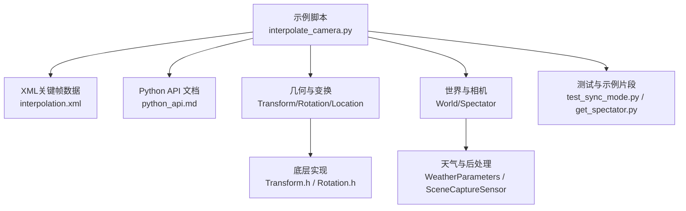
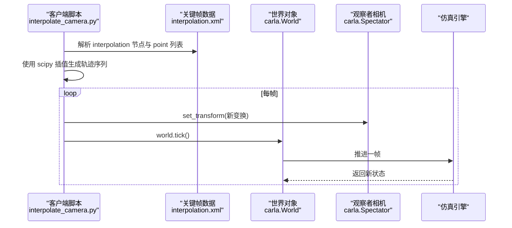
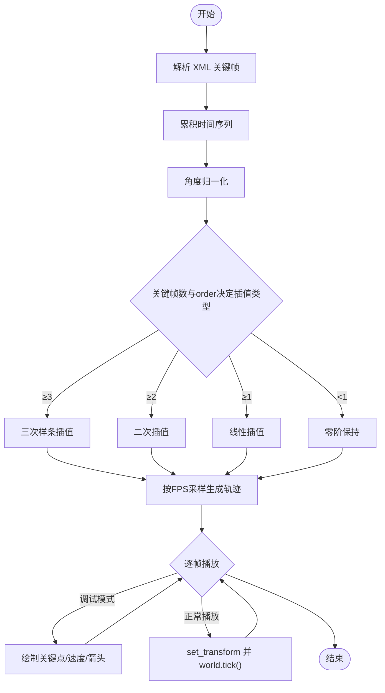
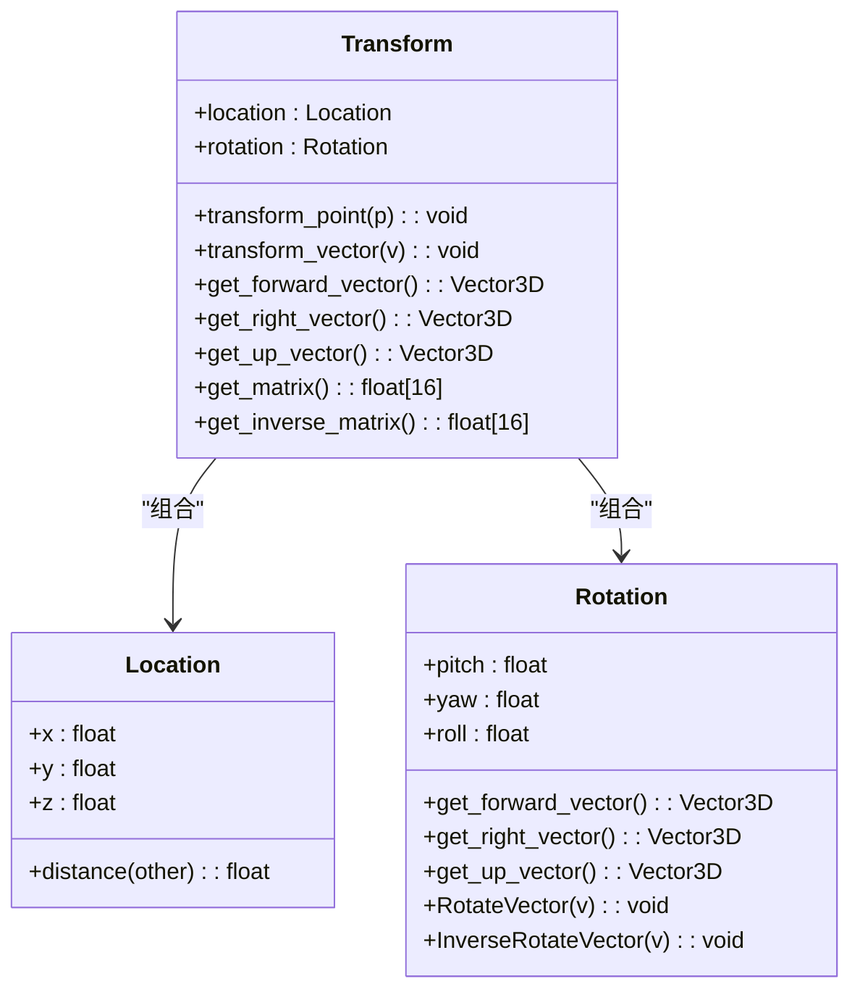
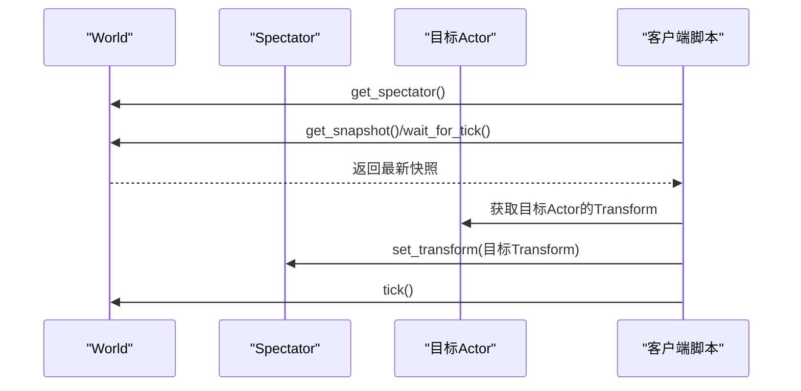
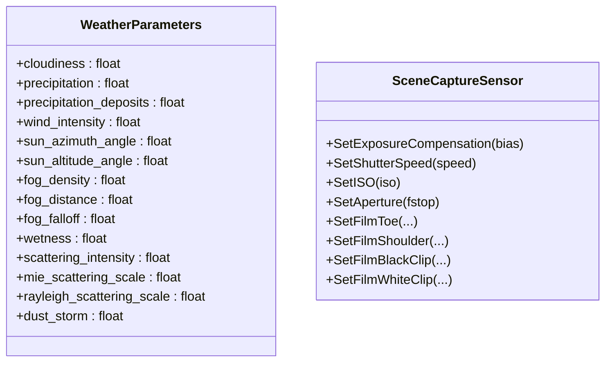
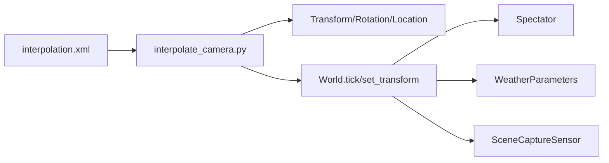

# 相机路径插值与动态视角控制

**本文引用的文件**
- [interpolate_camera.py](https://github.com/carla-simulator/carla/blob/ue5-dev/PythonAPI/examples/interpolate_camera.py)
- [interpolation.xml](https://github.com/carla-simulator/carla/blob/ue5-dev/PythonAPI/examples/interpolation.xml)
- [python_api.md](https://github.com/carla-simulator/carla/blob/ue5-dev/Docs/python_api.md)
- [geom.yml](https://github.com/carla-simulator/carla/blob/ue5-dev/PythonAPI/docs/geom.yml)
- [world.yml](https://github.com/carla-simulator/carla/blob/ue5-dev/PythonAPI/docs/world.yml)
- [carla.World.get_spectator.py](https://github.com/carla-simulator/carla/blob/ue5-dev/PythonAPI/docs/snipets/carla.World.get_spectator.py)
- [test_sync_mode.py](https://github.com/carla-simulator/carla/blob/ue5-dev/PythonAPI/test/API/test_sync_mode.py)
- [Transform.h](https://github.com/carla-simulator/carla/blob/ue5-dev/LibCarla/source/carla/geom/Transform.h)
- [Rotation.h](https://github.com/carla-simulator/carla/blob/ue5-dev/LibCarla/source/carla/geom/Rotation.h)
- [WeatherParameters.h](https://github.com/carla-simulator/carla/blob/ue5-dev/LibCarla/source/carla/rpc/WeatherParameters.h)
- [WeatherParameters.cpp](https://github.com/carla-simulator/carla/blob/ue5-dev/LibCarla/source/carla/rpc/WeatherParameters.cpp)
- [Weather.cpp](https://github.com/carla-simulator/carla/blob/ue5-dev/PythonAPI/carla/src/Weather.cpp)
- [SceneCaptureSensor.cpp](https://github.com/carla-simulator/carla/blob/ue5-dev/Unreal/CarlaUnreal/Plugins/Carla/Sensor/SceneCaptureSensor.cpp)

## 目录
1. [引言](#引言)
2. [项目结构](#项目结构)
3. [核心组件](#核心组件)
4. [架构总览](#架构总览)
5. [详细组件分析](#详细组件分析)
6. [依赖关系分析](#依赖关系分析)
7. [性能考量](#性能考量)
8. [故障排查指南](#故障排查指南)
9. [结论](#结论)
10. [附录](#附录)

## 引言
本文件围绕 CARLA 的相机路径插值与动态视角控制展开，以 Python 示例 interpolate_camera.py 为切入点，系统解析样条曲线插值在相机轨迹生成中的应用，详解如何通过 Python API 控制“观察者”（Spectator）相机的位置与旋转，实现平滑视角过渡；并对比线性、贝塞尔与样条等插值方法的优劣及视觉影响，给出基于事件触发的视角切换、多相机协同控制以及视角与车辆运动同步的高级实践建议。最后结合实际应用场景，如宣传片制作、特定角度传感器数据采集与电影级镜头效果实现，提供可操作的思路与流程图。

## 项目结构
与相机路径插值和视角控制直接相关的文件主要集中在 Python 示例与几何/世界 API 文档中：
- 示例：interpolate_camera.py（相机路径插值与播放）、interpolation.xml（关键帧与参数）
- 几何与变换：Transform、Rotation、Location 等类的定义与行为
- 世界与相机：World、Spectator、Weather 等 API 参考
- 测试与示例片段：测试用例与官方示例片段展示了 set_transform、tick、get_spectator 等常用接口

图表来源
- [interpolate_camera.py](https://github.com/carla-simulator/carla/blob/ue5-dev/PythonAPI/examples/interpolate_camera.py#L1-L210)
- [interpolation.xml](https://github.com/carla-simulator/carla/blob/ue5-dev/PythonAPI/examples/interpolation.xml#L1-L17)
- [python_api.md](https://github.com/carla-simulator/carla/blob/ue5-dev/Docs/python_api.md#L1-L800)
- [geom.yml](https://github.com/carla-simulator/carla/blob/ue5-dev/PythonAPI/docs/geom.yml#L1-L643)
- [world.yml](https://github.com/carla-simulator/carla/blob/ue5-dev/PythonAPI/docs/world.yml#L1-L800)
- [test_sync_mode.py](https://github.com/carla-simulator/carla/blob/ue5-dev/PythonAPI/test/API/test_sync_mode.py#L47-L60)
- [carla.World.get_spectator.py](https://github.com/carla-simulator/carla/blob/ue5-dev/PythonAPI/docs/snipets/carla.World.get_spectator.py#L2-L20)
- [Transform.h](https://github.com/carla-simulator/carla/blob/ue5-dev/LibCarla/source/carla/geom/Transform.h#L46-L116)
- [Rotation.h](https://github.com/carla-simulator/carla/blob/ue5-dev/LibCarla/source/carla/geom/Rotation.h#L43-L127)
- [WeatherParameters.h](https://github.com/carla-simulator/carla/blob/ue5-dev/LibCarla/source/carla/rpc/WeatherParameters.h#L50-L136)
- [WeatherParameters.cpp](https://github.com/carla-simulator/carla/blob/ue5-dev/LibCarla/source/carla/rpc/WeatherParameters.cpp#L1-L21)
- [Weather.cpp](https://github.com/carla-simulator/carla/blob/ue5-dev/PythonAPI/carla/src/Weather.cpp#L60-L95)
- [SceneCaptureSensor.cpp](https://github.com/carla-simulator/carla/blob/ue5-dev/Unreal/CarlaUnreal/Plugins/Carla/Sensor/SceneCaptureSensor.cpp#L156-L942)

章节来源
- [interpolate_camera.py](https://github.com/carla-simulator/carla/blob/ue5-dev/PythonAPI/examples/interpolate_camera.py#L1-L210)
- [interpolation.xml](https://github.com/carla-simulator/carla/blob/ue5-dev/PythonAPI/examples/interpolation.xml#L1-L17)
- [python_api.md](https://github.com/carla-simulator/carla/blob/ue5-dev/Docs/python_api.md#L1-L800)
- [geom.yml](https://github.com/carla-simulator/carla/blob/ue5-dev/PythonAPI/docs/geom.yml#L1-L643)
- [world.yml](https://github.com/carla-simulator/carla/blob/ue5-dev/PythonAPI/docs/world.yml#L1-L800)

## 核心组件
- 路径插值与播放器
  - interpolate_camera.py：解析 XML 关键帧，按 FPS 采样离散化，使用 scipy 插值生成连续轨迹，驱动 Spectator 按帧移动。
  - interpolation.xml：定义多个 interpolation 节点，每个包含若干 point，每个 point 含时间、位置与欧拉角。
- 几何与变换
  - Transform/Rotation/Location：组合位置与姿态，支持向量变换、矩阵表示与逆变换，是插值输出与 set_transform 的基础。
- 世界与相机
  - World：提供 get_spectator、tick、apply_settings 等能力；WorldSettings 支持同步模式与固定步长。
  - Spectator：观察者相机实体，可通过 set_transform 实时更新其位置与朝向。
- 天气与渲染
  - WeatherParameters：云量、降水、风速、太阳方位/高度、雾密度等；Weather.cpp 暴露默认预设。
  - SceneCaptureSensor：曝光、快门、ISO、光圈、胶片特性等后处理参数，用于稳定视觉风格。

章节来源
- [interpolate_camera.py](https://github.com/carla-simulator/carla/blob/ue5-dev/PythonAPI/examples/interpolate_camera.py#L1-L210)
- [interpolation.xml](https://github.com/carla-simulator/carla/blob/ue5-dev/PythonAPI/examples/interpolation.xml#L1-L17)
- [Transform.h](https://github.com/carla-simulator/carla/blob/ue5-dev/LibCarla/source/carla/geom/Transform.h#L46-L116)
- [Rotation.h](https://github.com/carla-simulator/carla/blob/ue5-dev/LibCarla/source/carla/geom/Rotation.h#L43-L127)
- [world.yml](https://github.com/carla-simulator/carla/blob/ue5-dev/PythonAPI/docs/world.yml#L454-L749)
- [WeatherParameters.h](https://github.com/carla-simulator/carla/blob/ue5-dev/LibCarla/source/carla/rpc/WeatherParameters.h#L50-L136)
- [WeatherParameters.cpp](https://github.com/carla-simulator/carla/blob/ue5-dev/LibCarla/source/carla/rpc/WeatherParameters.cpp#L1-L21)
- [Weather.cpp](https://github.com/carla-simulator/carla/blob/ue5-dev/PythonAPI/carla/src/Weather.cpp#L60-L95)
- [SceneCaptureSensor.cpp](https://github.com/carla-simulator/carla/blob/ue5-dev/Unreal/CarlaUnreal/Plugins/Carla/Sensor/SceneCaptureSensor.cpp#L156-L942)

## 架构总览
下图展示从关键帧到相机视角更新的整体流程：解析 XML → 插值生成轨迹 → 在每帧设置 Spectator Transform → tick 推进仿真。

图表来源
- [interpolate_camera.py](https://github.com/carla-simulator/carla/blob/ue5-dev/PythonAPI/examples/interpolate_camera.py#L116-L200)
- [interpolation.xml](https://github.com/carla-simulator/carla/blob/ue5-dev/PythonAPI/examples/interpolation.xml#L1-L17)
- [world.yml](https://github.com/carla-simulator/carla/blob/ue5-dev/PythonAPI/docs/world.yml#L499-L524)

## 详细组件分析

### 组件A：路径插值与播放器（interpolate_camera.py）
- 关键流程
  - 解析 XML：遍历 interpolation 节点，读取每个 point 的 time/x/y/z/pitch/yaw/roll，构建关键帧列表。
  - 时间累积：将相对时间累加得到绝对时间序列，作为插值的自变量。
  - 角度归一：对欧拉角进行跳变修正，避免 0°/360° 跳变导致插值异常。
  - 插值策略：根据关键帧数量与 order 决定插值类型（三次样条、二次、线性），对 x/y/z/roll/pitch/yaw 分别插值。
  - 离散化：按固定帧率（FPS）对时间区间进行采样，生成连续轨迹序列。
  - 调试可视化：可选绘制关键点、速度矢量与轨迹点箭头。
  - 播放循环：弹出轨迹项并 set_transform，随后 world.tick() 推进。
- 优缺点与适用场景
  - 线性插值：简单快速，适合短距离、低速过渡；但转角处易产生不连续的角速度变化，视觉上略显生硬。
  - 样条插值：平滑连续，适合长路径与复杂转角；计算成本较高，需足够关键帧密度。
  - 贝塞尔：通常用于路径设计阶段，便于手工调整曲率与切线；在实时播放中不如样条自然。
- 高级技巧
  - 基于事件触发：在轨迹中插入标记点，监听车辆事件（如到达某 Waypoint、碰撞、灯光变化）触发视角切换。
  - 多相机协同：同时驱动多个相机（如主摄、副摄、HUD）或使用 AttachmentType 的弹簧臂附件获得更顺滑的跟随效果。
  - 视角与车辆同步：将相机 Transform 与车辆 Actor 的 Transform 对齐，或通过相对位姿保持固定偏移，实现“车随景动”的电影级镜头。

图表来源
- [interpolate_camera.py](https://github.com/carla-simulator/carla/blob/ue5-dev/PythonAPI/examples/interpolate_camera.py#L23-L115)

章节来源
- [interpolate_camera.py](https://github.com/carla-simulator/carla/blob/ue5-dev/PythonAPI/examples/interpolate_camera.py#L23-L115)
- [interpolation.xml](https://github.com/carla-simulator/carla/blob/ue5-dev/PythonAPI/examples/interpolation.xml#L1-L17)

### 组件B：几何与变换（Transform/Rotation/Location）
- Transform
  - 组合位置与旋转，提供向量变换、矩阵表示与逆矩阵，支撑插值结果的物理意义与后续变换。
- Rotation
  - 提供前向、右向、上向单位向量，支持旋转与逆旋转，是视角方向计算的基础。
- Location
  - 表示空间点，提供距离、相等比较等工具方法，便于计算速度与路径长度。

图表来源
- [Transform.h](https://github.com/carla-simulator/carla/blob/ue5-dev/LibCarla/source/carla/geom/Transform.h#L46-L116)
- [Rotation.h](https://github.com/carla-simulator/carla/blob/ue5-dev/LibCarla/source/carla/geom/Rotation.h#L43-L127)
- [geom.yml](https://github.com/carla-simulator/carla/blob/ue5-dev/PythonAPI/docs/geom.yml#L250-L502)

章节来源
- [Transform.h](https://github.com/carla-simulator/carla/blob/ue5-dev/LibCarla/source/carla/geom/Transform.h#L46-L116)
- [Rotation.h](https://github.com/carla-simulator/carla/blob/ue5-dev/LibCarla/source/carla/geom/Rotation.h#L43-L127)
- [geom.yml](https://github.com/carla-simulator/carla/blob/ue5-dev/PythonAPI/docs/geom.yml#L250-L502)

### 组件C：世界与相机（World/Spectator）
- World
  - get_spectator：返回观察者相机 Actor。
  - tick/wait_for_tick/on_tick/remove_on_tick：控制仿真推进与回调。
  - apply_settings/get_settings：启用同步模式、固定步长等。
- Spectator
  - set_transform/get_transform：实时更新视角位置与朝向。
- 示例与测试
  - 官方示例片段展示了将 Spectator 设置为某个 Actor 的 Transform。
  - 测试用例验证了 set_transform 的即时生效与 tick 的必要性。

图表来源
- [carla.World.get_spectator.py](https://github.com/carla-simulator/carla/blob/ue5-dev/PythonAPI/docs/snipets/carla.World.get_spectator.py#L2-L20)
- [test_sync_mode.py](https://github.com/carla-simulator/carla/blob/ue5-dev/PythonAPI/test/API/test_sync_mode.py#L47-L60)
- [world.yml](https://github.com/carla-simulator/carla/blob/ue5-dev/PythonAPI/docs/world.yml#L499-L524)

章节来源
- [carla.World.get_spectator.py](https://github.com/carla-simulator/carla/blob/ue5-dev/PythonAPI/docs/snipets/carla.World.get_spectator.py#L2-L20)
- [test_sync_mode.py](https://github.com/carla-simulator/carla/blob/ue5-dev/PythonAPI/test/API/test_sync_mode.py#L47-L60)
- [world.yml](https://github.com/carla-simulator/carla/blob/ue5-dev/PythonAPI/docs/world.yml#L499-L524)

### 组件D：天气与渲染（WeatherParameters/SceneCaptureSensor）
- WeatherParameters
  - 提供云量、降水、风速、太阳方位/高度、雾密度等参数，支持多种预设（如 ClearNoon、WetCloudyNoon 等）。
- SceneCaptureSensor
  - 提供曝光补偿、快门速度、ISO、光圈、胶片特性等参数，用于稳定画面风格与控制景深/运动模糊等效果。

图表来源
- [WeatherParameters.h](https://github.com/carla-simulator/carla/blob/ue5-dev/LibCarla/source/carla/rpc/WeatherParameters.h#L50-L136)
- [WeatherParameters.cpp](https://github.com/carla-simulator/carla/blob/ue5-dev/LibCarla/source/carla/rpc/WeatherParameters.cpp#L1-L21)
- [Weather.cpp](https://github.com/carla-simulator/carla/blob/ue5-dev/PythonAPI/carla/src/Weather.cpp#L60-L95)
- [SceneCaptureSensor.cpp](https://github.com/carla-simulator/carla/blob/ue5-dev/Unreal/CarlaUnreal/Plugins/Carla/Sensor/SceneCaptureSensor.cpp#L156-L942)

章节来源
- [WeatherParameters.h](https://github.com/carla-simulator/carla/blob/ue5-dev/LibCarla/source/carla/rpc/WeatherParameters.h#L50-L136)
- [WeatherParameters.cpp](https://github.com/carla-simulator/carla/blob/ue5-dev/LibCarla/source/carla/rpc/WeatherParameters.cpp#L1-L21)
- [Weather.cpp](https://github.com/carla-simulator/carla/blob/ue5-dev/PythonAPI/carla/src/Weather.cpp#L60-L95)
- [SceneCaptureSensor.cpp](https://github.com/carla-simulator/carla/blob/ue5-dev/Unreal/CarlaUnreal/Plugins/Carla/Sensor/SceneCaptureSensor.cpp#L156-L942)

## 依赖关系分析
- 数据流依赖
  - interpolate_camera.py 依赖 XML 关键帧数据与 scipy 插值库，输出 Transform 序列。
  - Transform 序列依赖几何库（Transform/Rotation/Location）的数学运算。
  - 播放循环依赖 World 的 tick 机制与 Spectator 的 set_transform。
- 运行时耦合
  - 同步模式下，必须在每帧调用 world.tick()，否则仿真会冻结。
  - 天气与渲染参数会影响视觉一致性，应与插值节奏匹配，避免画面抖动。

图表来源
- [interpolate_camera.py](https://github.com/carla-simulator/carla/blob/ue5-dev/PythonAPI/examples/interpolate_camera.py#L116-L200)
- [interpolation.xml](https://github.com/carla-simulator/carla/blob/ue5-dev/PythonAPI/examples/interpolation.xml#L1-L17)
- [Transform.h](https://github.com/carla-simulator/carla/blob/ue5-dev/LibCarla/source/carla/geom/Transform.h#L46-L116)
- [Rotation.h](https://github.com/carla-simulator/carla/blob/ue5-dev/LibCarla/source/carla/geom/Rotation.h#L43-L127)
- [world.yml](https://github.com/carla-simulator/carla/blob/ue5-dev/PythonAPI/docs/world.yml#L499-L524)
- [WeatherParameters.h](https://github.com/carla-simulator/carla/blob/ue5-dev/LibCarla/source/carla/rpc/WeatherParameters.h#L50-L136)
- [SceneCaptureSensor.cpp](https://github.com/carla-simulator/carla/blob/ue5-dev/Unreal/CarlaUnreal/Plugins/Carla/Sensor/SceneCaptureSensor.cpp#L156-L942)

章节来源
- [interpolate_camera.py](https://github.com/carla-simulator/carla/blob/ue5-dev/PythonAPI/examples/interpolate_camera.py#L116-L200)
- [interpolation.xml](https://github.com/carla-simulator/carla/blob/ue5-dev/PythonAPI/examples/interpolation.xml#L1-L17)
- [Transform.h](https://github.com/carla-simulator/carla/blob/ue5-dev/LibCarla/source/carla/geom/Transform.h#L46-L116)
- [Rotation.h](https://github.com/carla-simulator/carla/blob/ue5-dev/LibCarla/source/carla/geom/Rotation.h#L43-L127)
- [world.yml](https://github.com/carla-simulator/carla/blob/ue5-dev/PythonAPI/docs/world.yml#L499-L524)

## 性能考量
- 插值复杂度
  - 样条插值在关键帧较多时计算开销较大；建议在离线阶段生成轨迹，运行时仅消费已生成的 Transform 序列。
- 帧率与步长
  - 同步模式下固定步长（fixed_delta_seconds）有助于稳定插值节奏；过小步长会增加 CPU/GPU 负担。
- 渲染与后处理
  - 频繁修改 SceneCaptureSensor 参数可能影响渲染管线；建议在关键帧切换时批量更新，避免每帧微调。
- 资源管理
  - 调试绘制（关键点、箭头、字符串）仅在需要时开启，避免占用带宽与 GPU 资源。

## 故障排查指南
- 仿真卡住
  - 确认在同步模式下每帧都调用 world.tick()；否则仿真会冻结。
- 视角不更新
  - 确保 Spectator 的 set_transform 调用顺序正确，并在 tick 之后才可见。
- 角度跳变导致视角抖动
  - 使用角度归一化函数，确保相邻关键帧间角度差不超过 180°。
- 天气/光照突变
  - 将天气参数变更与关键帧对齐，避免在插值过程中频繁改变，造成画面闪烁。

章节来源
- [test_sync_mode.py](https://github.com/carla-simulator/carla/blob/ue5-dev/PythonAPI/test/API/test_sync_mode.py#L47-L60)
- [interpolate_camera.py](https://github.com/carla-simulator/carla/blob/ue5-dev/PythonAPI/examples/interpolate_camera.py#L163-L193)

## 结论
通过 interpolate_camera.py 的路径插值与播放机制，结合 Transform/Rotation/Location 的几何运算与 World/Spectator 的 API，可以实现平滑、可控且可扩展的动态视角控制。样条插值在复杂路径与转角处表现最佳，配合同步模式与合理的帧率/步长，能够满足高质量视频与电影级镜头需求。天气与渲染参数的合理配置进一步提升了视觉一致性与稳定性。

## 附录

### 实际应用案例
- 宣传片制作
  - 使用样条插值生成流畅的环绕与俯冲镜头，结合天气参数（如 ClearNoon/WetCloudyNoon）与曝光/ISO 稳定画面风格。
- 特定角度传感器数据采集
  - 将相机路径与车辆运动同步，利用相对位姿保持固定偏移，确保传感器在关键视角下稳定采样。
- 电影级镜头效果
  - 多相机协同：主摄跟随、副摄补光、HUD/AR 显示；通过事件触发（如灯光变化、碰撞）切换视角，增强叙事张力。

### 最佳实践清单
- 关键帧密度：样条插值至少每段 3–4 个关键帧，保证曲率连续。
- 同步模式：启用同步模式并设置固定步长，确保插值节奏稳定。
- 角度归一：对欧拉角进行跳变修正，避免插值异常。
- 调试可视化：仅在开发阶段开启调试绘制，发布前关闭。
- 天气与渲染：将天气与后处理参数变更与关键帧对齐，减少画面闪烁。