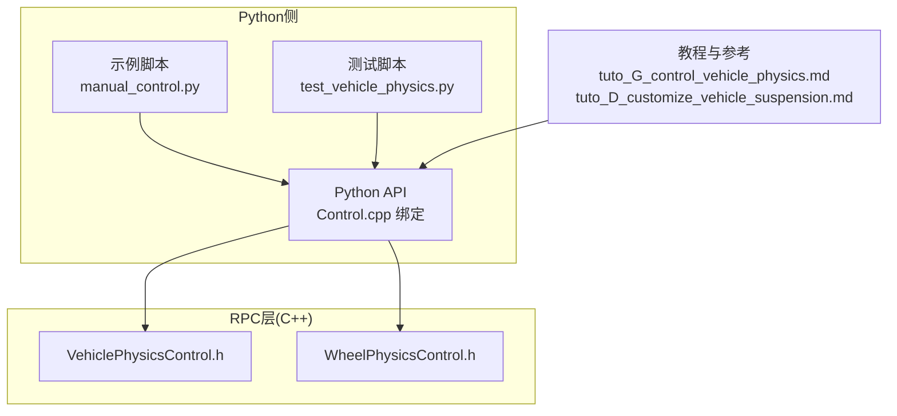
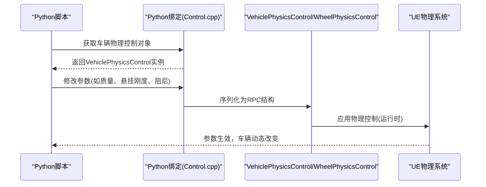
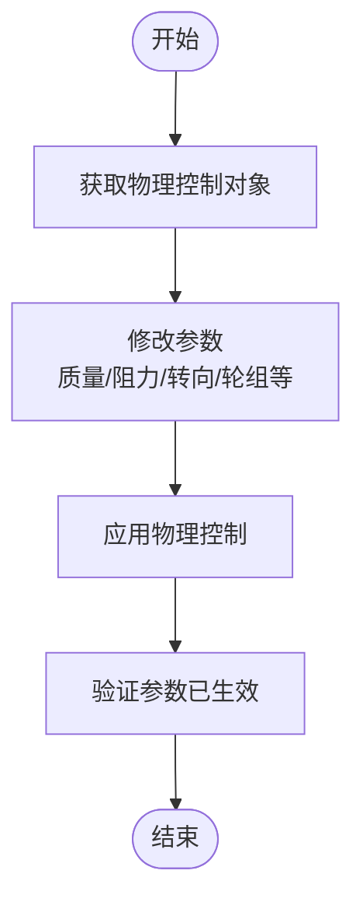
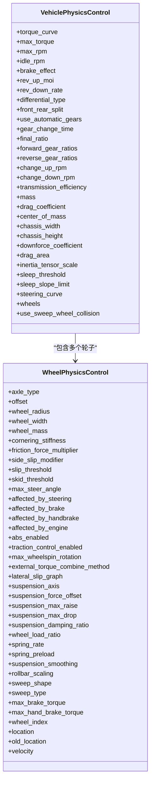
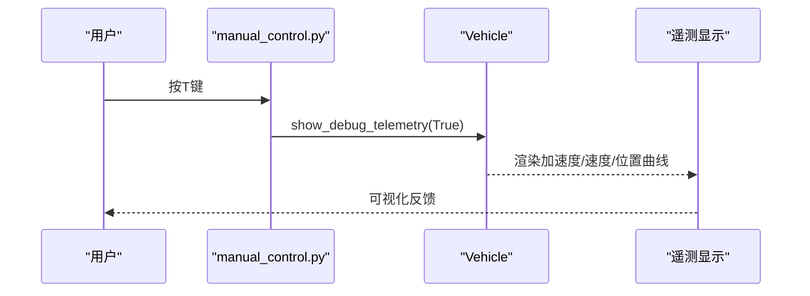

# 自定义车辆动力学与悬挂系统

**本文引用的文件列表**
- [VehiclePhysicsControl.h](https://github.com/carla-simulator/carla/blob/ue5-dev/LibCarla/source/carla/rpc/VehiclePhysicsControl.h)
- [WheelPhysicsControl.h](https://github.com/carla-simulator/carla/blob/ue5-dev/LibCarla/source/carla/rpc/WheelPhysicsControl.h)
- [Control.cpp](https://github.com/carla-simulator/carla/blob/ue5-dev/PythonAPI/carla/src/Control.cpp)
- [tuto_G_control_vehicle_physics.md](https://github.com/carla-simulator/carla/blob/ue5-dev/Docs/tuto_G_control_vehicle_physics.md)
- [tuto_D_customize_vehicle_suspension.md](https://github.com/carla-simulator/carla/blob/ue5-dev/Docs/tuto_D_customize_vehicle_suspension.md)
- [test_vehicle_physics.py](https://github.com/carla-simulator/carla/blob/ue5-dev/PythonAPI/test/test_vehicle_physics.py)
- [Actor.cpp](https://github.com/carla-simulator/carla/blob/ue5-dev/PythonAPI/carla/src/Actor.cpp)
- [manual_control.py](https://github.com/carla-simulator/carla/blob/ue5-dev/PythonAPI/examples/manual_control.py)
- [python_api.md](https://github.com/carla-simulator/carla/blob/ue5-dev/Docs/python_api.md)

## 目录
1. [简介](#简介)
2. [项目结构与定位](#项目结构与定位)
3. [核心组件总览](#核心组件总览)
4. [架构概览](#架构概览)
5. [关键组件详解](#关键组件详解)
6. [依赖关系分析](#依赖关系分析)
7. [性能与数值稳定性建议](#性能与数值稳定性建议)
8. [调试与验证方法](#调试与验证方法)
9. [实际应用案例](#实际应用案例)
10. [结论](#结论)

## 简介
本文件面向希望在CARLA中精细定制车辆动力学参数（尤其是悬挂系统）的用户，系统性地解析VehiclePhysicsControl与WheelPhysicsControl两类对象的参数含义、相互关系与调参策略，并结合Python测试脚本与教程文档给出可操作的实践路径。重点覆盖：
- 悬挂刚度、阻尼、预载、最大压缩/回弹等参数对车辆动态的影响
- 质量分布、升力系数、阻力系数、惯量张量等对操控与能耗的影响
- 如何通过Python API获取与修改物理控制参数，以模拟卡车、赛车、越野车等不同车型
- 在不同路面条件下的行为差异与调参要点
- 基于传感器数据与调试工具的验证方法
- 颠簸路面仿真与特定故障模式构建的实战案例

## 项目结构与定位
- C++ RPC层定义了VehiclePhysicsControl与WheelPhysicsControl的数据结构，用于跨进程传输与序列化。
- Python绑定通过Control.cpp将上述结构映射到Python API，便于脚本化调参。
- 教程与测试文档提供了参数化指导与验证流程。
- 示例脚本展示了如何启用调试遥测以观察姿态变化。

图表来源
- [Control.cpp](https://github.com/carla-simulator/carla/blob/ue5-dev/PythonAPI/carla/src/Control.cpp#L426-L491)
- [VehiclePhysicsControl.h](https://github.com/carla-simulator/carla/blob/ue5-dev/LibCarla/source/carla/rpc/VehiclePhysicsControl.h#L1-L246)
- [WheelPhysicsControl.h](https://github.com/carla-simulator/carla/blob/ue5-dev/LibCarla/source/carla/rpc/WheelPhysicsControl.h#L1-L261)
- [tuto_G_control_vehicle_physics.md](https://github.com/carla-simulator/carla/blob/ue5-dev/Docs/tuto_G_control_vehicle_physics.md#L1-L72)
- [tuto_D_customize_vehicle_suspension.md](https://github.com/carla-simulator/carla/blob/ue5-dev/Docs/tuto_D_customize_vehicle_suspension.md#L30-L106)
- [test_vehicle_physics.py](https://github.com/carla-simulator/carla/blob/ue5-dev/PythonAPI/test/test_vehicle_physics.py#L66-L103)
- [manual_control.py](https://github.com/carla-simulator/carla/blob/ue5-dev/PythonAPI/examples/manual_control.py#L1-L120)

章节来源
- [Control.cpp](https://github.com/carla-simulator/carla/blob/ue5-dev/PythonAPI/carla/src/Control.cpp#L426-L491)
- [VehiclePhysicsControl.h](https://github.com/carla-simulator/carla/blob/ue5-dev/LibCarla/source/carla/rpc/VehiclePhysicsControl.h#L1-L246)
- [WheelPhysicsControl.h](https://github.com/carla-simulator/carla/blob/ue5-dev/LibCarla/source/carla/rpc/WheelPhysicsControl.h#L1-L261)
- [tuto_G_control_vehicle_physics.md](https://github.com/carla-simulator/carla/blob/ue5-dev/Docs/tuto_G_control_vehicle_physics.md#L1-L72)
- [tuto_D_customize_vehicle_suspension.md](https://github.com/carla-simulator/carla/blob/ue5-dev/Docs/tuto_D_customize_vehicle_suspension.md#L30-L106)
- [test_vehicle_physics.py](https://github.com/carla-simulator/carla/blob/ue5-dev/PythonAPI/test/test_vehicle_physics.py#L66-L103)
- [manual_control.py](https://github.com/carla-simulator/carla/blob/ue5-dev/PythonAPI/examples/manual_control.py#L1-L120)

## 核心组件总览
- VehiclePhysicsControl：整车物理属性集合，包含引擎、传动、空气动力学、质量分布、转向曲线、轮子数组等。
- WheelPhysicsControl：单个车轮的物理属性，包含轴类型、几何偏移、半径/宽度/质量、抓地力、滑移阈值、悬架方向/力偏移、最大压缩/回弹、阻尼比、弹簧刚度、预载、抗侧倾等。

章节来源
- [VehiclePhysicsControl.h](https://github.com/carla-simulator/carla/blob/ue5-dev/LibCarla/source/carla/rpc/VehiclePhysicsControl.h#L18-L105)
- [WheelPhysicsControl.h](https://github.com/carla-simulator/carla/blob/ue5-dev/LibCarla/source/carla/rpc/WheelPhysicsControl.h#L19-L108)

## 架构概览
下图展示了从Python脚本到RPC层再到UE物理系统的调用链路与数据流。

图表来源
- [Control.cpp](https://github.com/carla-simulator/carla/blob/ue5-dev/PythonAPI/carla/src/Control.cpp#L426-L491)
- [VehiclePhysicsControl.h](https://github.com/carla-simulator/carla/blob/ue5-dev/LibCarla/source/carla/rpc/VehiclePhysicsControl.h#L111-L206)
- [WheelPhysicsControl.h](https://github.com/carla-simulator/carla/blob/ue5-dev/LibCarla/source/carla/rpc/WheelPhysicsControl.h#L109-L216)

## 关键组件详解

### VehiclePhysicsControl 参数详解
- 发动机与传动
  - 扭矩曲线：二维点集，描述转速与扭矩的关系。
  - 最大扭矩、最大转速、怠速转速、刹车效果、飞轮转动惯量、降速率。
  - 差速器类型、前后分配、是否自动挡、换挡时间、最终传动比、前后齿轮比数组、换挡触发转速、传动效率。
- 车身与气动
  - 质量、阻力系数、质心位置、底盘宽高、下压力系数、迎风面积、惯量张量缩放、休眠阈值与斜率。
- 转向曲线：随速度变化的转向增益。
- 轮子数组：每个轮子的独立物理控制。
- 轮毂碰撞扫描开关：是否启用轮毂碰撞扫描。

章节来源
- [VehiclePhysicsControl.h](https://github.com/carla-simulator/carla/blob/ue5-dev/LibCarla/source/carla/rpc/VehiclePhysicsControl.h#L18-L99)
- [python_api.md](https://github.com/carla-simulator/carla/blob/ue5-dev/Docs/python_api.md#L2697-L2698)

### WheelPhysicsControl 参数详解（与悬挂相关）
- 几何与质量
  - 轴类型、偏移、轮半径、轮宽、轮质量。
- 抓地与滑移
  - 角向刚度、摩擦力倍乘、侧偏修正、滑移阈值、滑动阈值、最大转向角、是否受制动力/手刹/驻车/引擎影响。
- ABS与牵引控制
  - ABS开关、牵引力控制开关、最大轮转速率、外部扭矩合成方式。
- 悬挂系统
  - 悬挂轴向量、悬挂力偏移、最大压缩、最大回弹、阻尼比、轮载荷比例、弹簧刚度、弹簧预载、悬挂平滑、抗侧倾比例、扫掠形状与类型。
- 制动与扭矩
  - 最大制动扭矩、最大手刹扭矩。
- 其他
  - 轮索引、位置、旧位置、速度。

章节来源
- [WheelPhysicsControl.h](https://github.com/carla-simulator/carla/blob/ue5-dev/LibCarla/source/carla/rpc/WheelPhysicsControl.h#L19-L108)
- [WheelPhysicsControl.h](https://github.com/carla-simulator/carla/blob/ue5-dev/LibCarla/source/carla/rpc/WheelPhysicsControl.h#L109-L216)
- [Control.cpp](https://github.com/carla-simulator/carla/blob/ue5-dev/PythonAPI/carla/src/Control.cpp#L426-L441)

### Python API 使用示例与流程
- 获取与设置物理控制
  - 通过Vehicle.get_physics_control()获取当前物理控制对象。
  - 修改目标参数后，调用Vehicle.apply_physics_control()应用。
- 示例脚本展示了如何批量修改轮胎摩擦、拖拽系数、轮毂碰撞扫描与最大转速，并将修改后的参数写回轮组数组。
- 教程文档提供了更直观的代码示例，涵盖扭矩曲线、最大转速、质量、阻力系数、转向曲线与轮组设置。

图表来源
- [test_vehicle_physics.py](https://github.com/carla-simulator/carla/blob/ue5-dev/PythonAPI/test/test_vehicle_physics.py#L66-L103)
- [tuto_G_control_vehicle_physics.md](https://github.com/carla-simulator/carla/blob/ue5-dev/Docs/tuto_G_control_vehicle_physics.md#L14-L61)

章节来源
- [test_vehicle_physics.py](https://github.com/carla-simulator/carla/blob/ue5-dev/PythonAPI/test/test_vehicle_physics.py#L66-L103)
- [tuto_G_control_vehicle_physics.md](https://github.com/carla-simulator/carla/blob/ue5-dev/Docs/tuto_G_control_vehicle_physics.md#L14-L61)

## 依赖关系分析
- VehiclePhysicsControl依赖WheelPhysicsControl数组，二者通过MsgPack序列化在RPC层传递。
- Python绑定通过Control.cpp将C++结构映射到Python对象，支持读写字段与比较相等性。
- 教程与测试文档为参数调优提供参考范围与验证流程。

图表来源
- [VehiclePhysicsControl.h](https://github.com/carla-simulator/carla/blob/ue5-dev/LibCarla/source/carla/rpc/VehiclePhysicsControl.h#L18-L105)
- [WheelPhysicsControl.h](https://github.com/carla-simulator/carla/blob/ue5-dev/LibCarla/source/carla/rpc/WheelPhysicsControl.h#L19-L108)

章节来源
- [VehiclePhysicsControl.h](https://github.com/carla-simulator/carla/blob/ue5-dev/LibCarla/source/carla/rpc/VehiclePhysicsControl.h#L18-L105)
- [WheelPhysicsControl.h](https://github.com/carla-simulator/carla/blob/ue5-dev/LibCarla/source/carla/rpc/WheelPhysicsControl.h#L19-L108)

## 性能与数值稳定性建议
- 合理设置睡眠阈值与斜率，避免低速时误判为静止导致仿真停滞。
- 调整惯量张量缩放以匹配真实车辆，过小会导致过度响应，过大则响应迟缓。
- 悬挂参数需成对调节：刚度过高会降低舒适性并增加轮胎离地风险；阻尼比过低易产生共振，过高则抑制能量耗散。
- 轮毂碰撞扫描开关在复杂地形或高精度需求下开启，但可能增加计算开销。
- 传动系统参数应与发动机扭矩曲线匹配，避免换挡频繁抖动。

[本节为通用建议，不直接分析具体文件]

## 调试与验证方法
- 启用遥测可视化
  - 在示例脚本中按T键切换遥测显示，观察加速度、速度、位置等指标。
  - 也可通过Actor.show_debug_telemetry()接口在Python侧控制遥测开关。
- 数据采集与对比
  - 使用测试脚本中的TelemetryPoint/TelemetryData结构记录帧间位置、速度、旋转差分，评估参数变化带来的动态差异。
- 场景化验证
  - 加速/刹车/掉头/高速弯等场景可作为基准测试，对比不同参数组合下的响应曲线。

图表来源
- [Actor.cpp](https://github.com/carla-simulator/carla/blob/ue5-dev/PythonAPI/carla/src/Actor.cpp#L201-L208)
- [manual_control.py](https://github.com/carla-simulator/carla/blob/ue5-dev/PythonAPI/examples/manual_control.py#L1-L120)

章节来源
- [Actor.cpp](https://github.com/carla-simulator/carla/blob/ue5-dev/PythonAPI/carla/src/Actor.cpp#L201-L208)
- [manual_control.py](https://github.com/carla-simulator/carla/blob/ue5-dev/PythonAPI/examples/manual_control.py#L1-L120)
- [test_vehicle_physics.py](https://github.com/carla-simulator/carla/blob/ue5-dev/PythonAPI/test/test_vehicle_physics.py#L136-L174)

## 实际应用案例

### 案例一：模拟不同车型的悬挂特性
- 卡车（重载、软悬挂）
  - 提高质量与重心高度，增大悬架最大压缩/回弹，适度降低弹簧刚度与阻尼比，提升载货稳定性与舒适性。
- 赛车（轻量化、硬悬挂）
  - 降低质量与惯量张量缩放，提高弹簧刚度与阻尼比，减小悬架压缩/回弹范围，增强高速过弯稳定性。
- 越野车（高离地、强抗侧倾）
  - 提高悬架最大压缩/回弹，适度增大抗侧倾比例，合理设置侧偏修正与滑移阈值，提升非铺装路面通过性。

章节来源
- [tuto_D_customize_vehicle_suspension.md](https://github.com/carla-simulator/carla/blob/ue5-dev/Docs/tuto_D_customize_vehicle_suspension.md#L30-L106)
- [WheelPhysicsControl.h](https://github.com/carla-simulator/carla/blob/ue5-dev/LibCarla/source/carla/rpc/WheelPhysicsControl.h#L19-L108)

### 案例二：颠簸路面行驶特性
- 参数要点
  - 降低弹簧刚度与阻尼比，增大悬架最大压缩/回弹，适度提高摩擦力倍乘与侧偏修正，减少车身俯仰与轮胎离地。
- 验证手段
  - 使用遥测观察垂直加速度与侧向加速度峰值，对比不同参数组合下的舒适性与稳定性指标。

章节来源
- [tuto_D_customize_vehicle_suspension.md](https://github.com/carla-simulator/carla/blob/ue5-dev/Docs/tuto_D_customize_vehicle_suspension.md#L30-L106)
- [Actor.cpp](https://github.com/carla-simulator/carla/blob/ue5-dev/PythonAPI/carla/src/Actor.cpp#L201-L208)

### 案例三：创建特定故障模式
- ABS/牵引力控制禁用
  - 将ABS与牵引力控制开关关闭，观察轮胎打滑与车身侧滑行为，评估极限工况下的可控性。
- 轮胎摩擦异常
  - 将某一侧或某一轮的摩擦力倍乘显著降低，模拟单侧轮胎失效，验证车辆的稳态与瞬态响应。
- 悬挂单侧失效
  - 将一侧悬架的最大压缩/回弹设为极小值，模拟悬挂断裂，观察车身倾斜与操控变化。

章节来源
- [WheelPhysicsControl.h](https://github.com/carla-simulator/carla/blob/ue5-dev/LibCarla/source/carla/rpc/WheelPhysicsControl.h#L19-L108)
- [test_vehicle_physics.py](https://github.com/carla-simulator/carla/blob/ue5-dev/PythonAPI/test/test_vehicle_physics.py#L66-L103)

## 结论
通过VehiclePhysicsControl与WheelPhysicsControl的参数化，CARLA能够灵活模拟多种车辆形态与工况。围绕悬挂系统的关键参数（弹簧刚度、阻尼比、预载、压缩/回弹范围、抗侧倾比例）进行系统性调节，并结合Python API与遥测工具进行验证，可在仿真中实现贴近现实的动态表现。建议以教程与测试脚本为起点，逐步微调参数并用多场景验证，最终形成稳定的参数集。