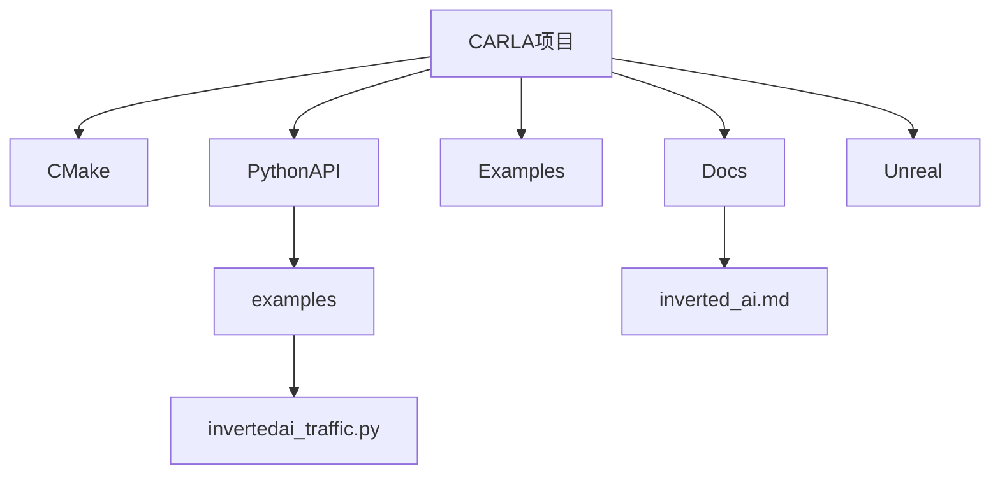
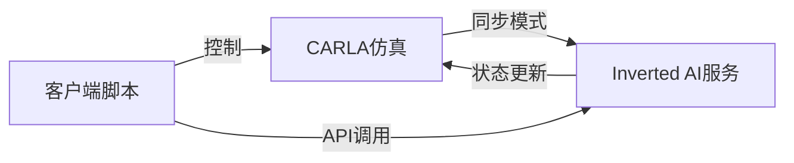
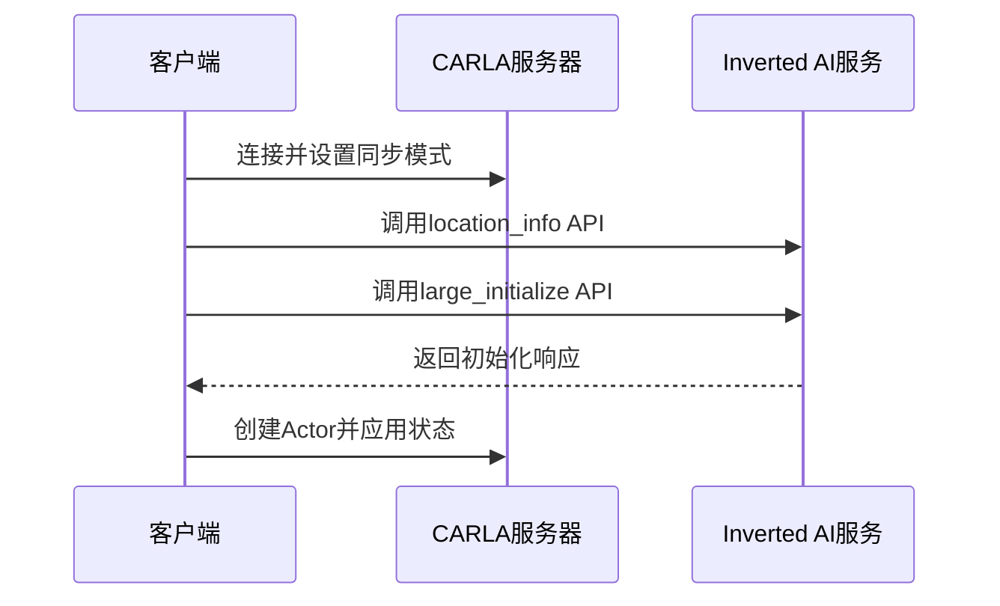
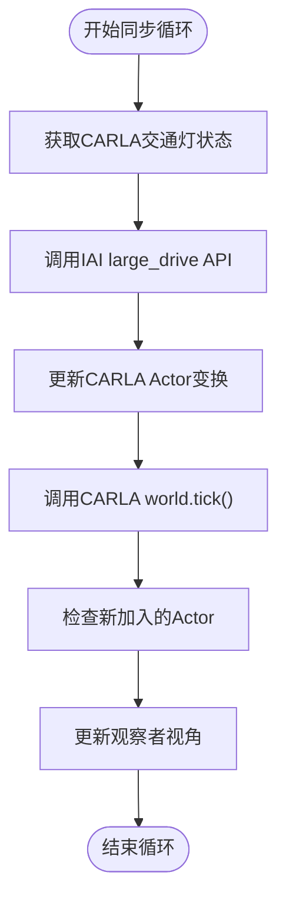
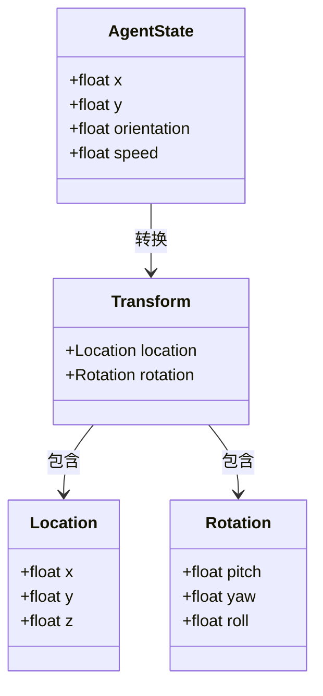

# 集成第三方服务（以 Inverted AI 为例）

> **引用文件**
> **本文档中引用的文件**

- [invertedai_traffic.py](https://github.com/carla-simulator/carla/blob/ue5-dev/PythonAPI/examples/invertedai_traffic.py)
- [inverted_ai.md](https://github.com/carla-simulator/carla/blob/ue5-dev/Docs/inverted_ai.md)
- [World.h](https://github.com/carla-simulator/carla/blob/ue5-dev/LibCarla/source/carla/client/World.h)
- [Actor.h](https://github.com/carla-simulator/carla/blob/ue5-dev/LibCarla/source/carla/client/Actor.h)
- [Transform.h](https://github.com/carla-simulator/carla/blob/ue5-dev/LibCarla/source/carla/geom/Transform.h)
- [adv_synchrony_timestep.md](https://github.com/carla-simulator/carla/blob/ue5-dev/Docs/adv_synchrony_timestep.md)

## 目录

1. [简介](#简介)
2. [项目结构](#项目结构)
3. [核心组件](#核心组件)
4. [架构概述](#架构概述)
5. [详细组件分析](#详细组件分析)
6. [依赖分析](#依赖分析)
7. [性能考虑](#性能考虑)
8. [故障排除指南](#故障排除指南)
9. [结论](#结论)

## 简介

本文档详细介绍了如何将第三方交通仿真服务（以 Inverted AI 为例）集成到 CARLA 仿真环境中。通过分析`invertedai_traffic.py`示例脚本，深入解析了客户端与外部服务的通信机制，包括 API 调用、数据格式转换和实时同步策略。文档还说明了如何将外部服务生成的交通参与者状态映射到 CARLA 的 Actor 系统中，并保持行为一致性。同时讨论了集成过程中的挑战，如时间同步、坐标系转换和网络延迟处理，并提供了扩展指南和性能优化建议。

## 项目结构

CARLA 项目采用模块化结构，主要包含 CMake 构建系统、文档、示例代码、Python API 和 Unreal 引擎集成等部分。第三方服务集成主要通过 PythonAPI/examples 目录下的脚本实现，其中`invertedai_traffic.py`是 Inverted AI 集成的核心示例。



**图源**

- [invertedai_traffic.py](https://github.com/carla-simulator/carla/blob/ue5-dev/PythonAPI/examples/invertedai_traffic.py)
- [inverted_ai.md](https://github.com/carla-simulator/carla/blob/ue5-dev/Docs/inverted_ai.md)

**本节来源**

- [invertedai_traffic.py](https://github.com/carla-simulator/carla/blob/ue5-dev/PythonAPI/examples/invertedai_traffic.py)
- [inverted_ai.md](https://github.com/carla-simulator/carla/blob/ue5-dev/Docs/inverted_ai.md)

## 核心组件

`invertedai_traffic.py`脚本是集成 Inverted AI 服务的核心组件，它实现了与外部服务的通信、状态同步和 Actor 管理等功能。脚本通过调用 Inverted AI 的 API 来获取交通参与者的状态，并将其映射到 CARLA 的 Actor 系统中。

**本节来源**

- [invertedai_traffic.py](https://github.com/carla-simulator/carla/blob/ue5-dev/PythonAPI/examples/invertedai_traffic.py)

## 架构概述

集成架构采用客户端-服务器模式，CARLA 作为仿真服务器，Inverted AI 作为外部服务提供者。两者通过同步模式进行通信，确保时间步长的一致性。



**图源**

- [invertedai_traffic.py](https://github.com/carla-simulator/carla/blob/ue5-dev/PythonAPI/examples/invertedai_traffic.py)
- [adv_synchrony_timestep.md](https://github.com/carla-simulator/carla/blob/ue5-dev/Docs/adv_synchrony_timestep.md)

## 详细组件分析

### 通信机制分析

`invertedai_traffic.py`脚本实现了与 Inverted AI 服务的完整通信流程，包括初始化、状态更新和资源清理。

#### 初始化流程



**图源**

- <a href="https://github.com/carla-simulator/carla/blob/ue5-dev/PythonAPI/examples/invertedai_traffic.py#L390-L422" target="_blank">invertedai_traffic.py</a>

#### 状态同步流程



**图源**

- <a href="https://github.com/carla-simulator/carla/blob/ue5-dev/PythonAPI/examples/invertedai_traffic.py#L580-L633" target="_blank">invertedai_traffic.py</a>

### 数据映射分析

脚本实现了 Inverted AI 状态与 CARLA Actor 之间的双向数据映射。

#### 坐标系转换



**图源**

- <a href="https://github.com/carla-simulator/carla/blob/ue5-dev/PythonAPI/examples/invertedai_traffic.py#L306-L318" target="_blank">invertedai_traffic.py</a>
- [Transform.h](https://github.com/carla-simulator/carla/blob/ue5-dev/LibCarla/source/carla/geom/Transform.h)

**本节来源**

- [invertedai_traffic.py](https://github.com/carla-simulator/carla/blob/ue5-dev/PythonAPI/examples/invertedai_traffic.py)
- [Transform.h](https://github.com/carla-simulator/carla/blob/ue5-dev/LibCarla/source/carla/geom/Transform.h)

## 依赖分析

集成方案依赖于多个关键组件和 API，形成了完整的依赖链。

```mermaid
graph TD
A[invertedai_traffic.py] --> B[carla Python API]
A --> C[invertedai Python包]
B --> D[LibCarla C++库]
D --> E[Unreal引擎]
C --> F[Inverted AI Web API]
A --> G[同步模式]
G --> H[World.tick()]
```

**图源**

- [invertedai_traffic.py](https://github.com/carla-simulator/carla/blob/ue5-dev/PythonAPI/examples/invertedai_traffic.py)
- [World.h](https://github.com/carla-simulator/carla/blob/ue5-dev/LibCarla/source/carla/client/World.h)

**本节来源**

- [invertedai_traffic.py](https://github.com/carla-simulator/carla/blob/ue5-dev/PythonAPI/examples/invertedai_traffic.py)
- [World.h](https://github.com/carla-simulator/carla/blob/ue5-dev/LibCarla/source/carla/client/World.h)

## 性能考虑

集成方案在性能方面需要考虑多个因素，包括网络延迟、同步开销和资源管理。

- **同步模式开销**：启用同步模式会增加通信延迟，但确保了仿真的确定性
- **批量更新**：通过`apply_batch_sync`方法可以批量处理 Actor 操作，提高效率
- **缓存策略**：脚本维护了 IAI 到 CARLA 的 Actor 映射缓存，避免重复查找
- **网络延迟处理**：异步 API 调用选项可以缓解网络延迟对仿真流畅性的影响

## 故障排除指南

集成过程中可能遇到的常见问题及解决方案：

**本节来源**

- <a href="https://github.com/carla-simulator/carla/blob/ue5-dev/PythonAPI/examples/invertedai_traffic.py#L494-L498" target="_blank">invertedai_traffic.py</a>
- [inverted_ai.md](https://github.com/carla-simulator/carla/blob/ue5-dev/Docs/inverted_ai.md)

## 结论

通过`invertedai_traffic.py`示例脚本，我们展示了如何将 Inverted AI 等第三方交通仿真服务集成到 CARLA 中。该集成方案采用了同步模式确保时间一致性，通过精确的坐标系转换实现状态映射，并提供了完整的生命周期管理。此架构可以轻松扩展到其他类似的外部服务，为自动驾驶仿真提供了更丰富、更真实的交通场景。
