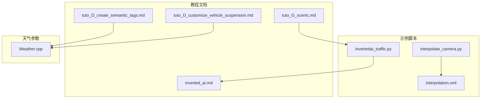
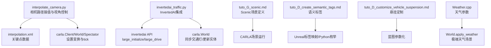
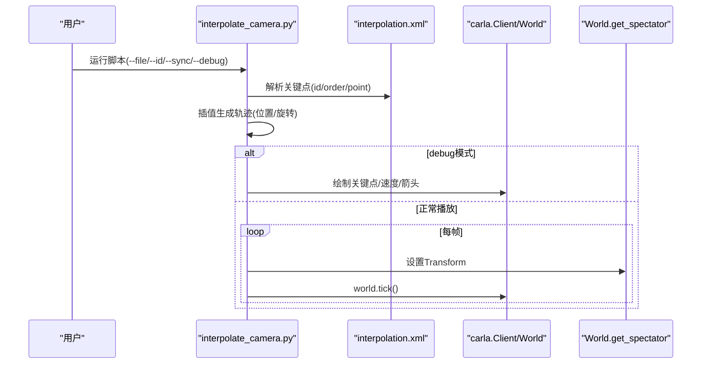
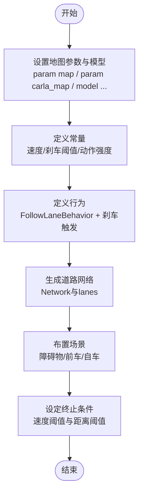
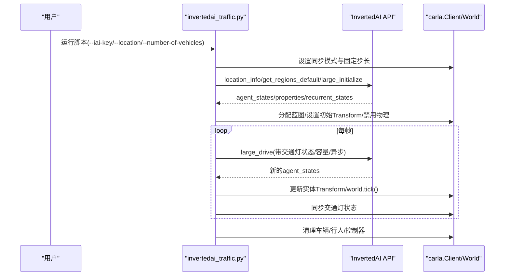
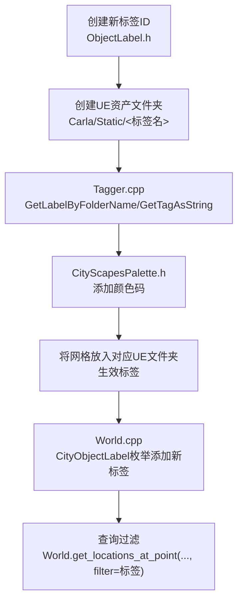
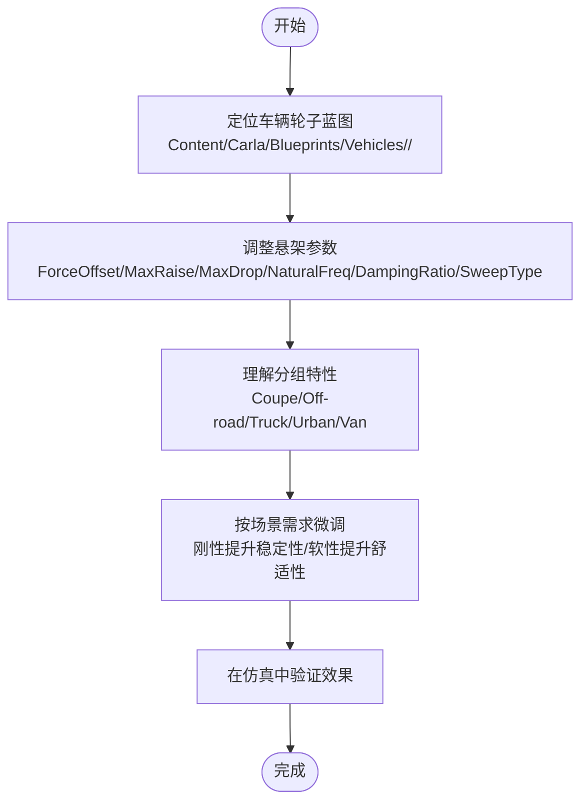
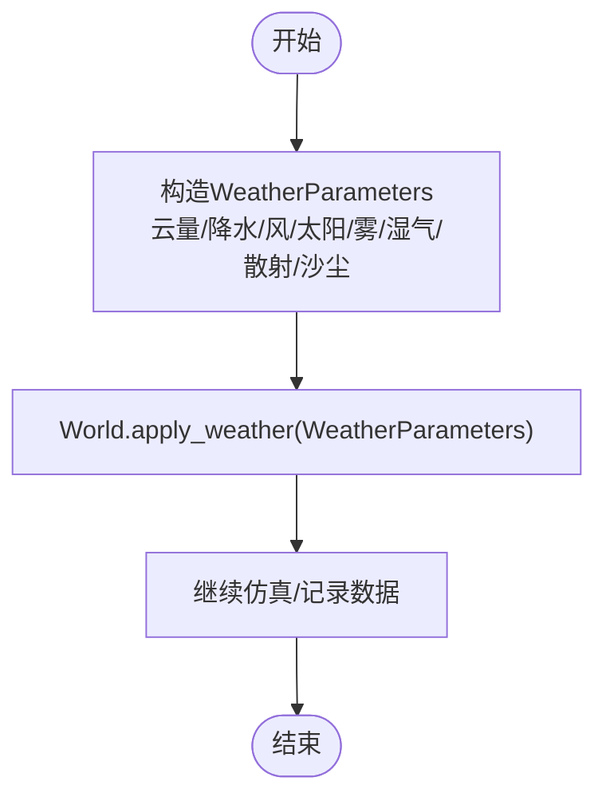
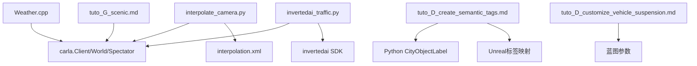

# 高级场景与自定义功能

> **引用文件**
> **本文引用的文件**

- [interpolate_camera.py](https://github.com/carla-simulator/carla/blob/ue5-dev/PythonAPI/examples/interpolate_camera.py)
- [interpolation.xml](https://github.com/carla-simulator/carla/blob/ue5-dev/PythonAPI/examples/interpolation.xml)
- [invertedai_traffic.py](https://github.com/carla-simulator/carla/blob/ue5-dev/PythonAPI/examples/invertedai_traffic.py)
- [tuto_G_scenic.md](https://github.com/carla-simulator/carla/blob/ue5-dev/Docs/tuto_G_scenic.md)
- [tuto_D_create_semantic_tags.md](https://github.com/carla-simulator/carla/blob/ue5-dev/Docs/tuto_D_create_semantic_tags.md)
- [tuto_D_customize_vehicle_suspension.md](https://github.com/carla-simulator/carla/blob/ue5-dev/Docs/tuto_D_customize_vehicle_suspension.md)
- [inverted_ai.md](https://github.com/carla-simulator/carla/blob/ue5-dev/Docs/inverted_ai.md)
- [Weather.cpp](https://github.com/carla-simulator/carla/blob/ue5-dev/PythonAPI/carla/src/Weather.cpp)

## 目录

1. [引言](#引言)
2. [项目结构](#项目结构)
3. [核心组件](#核心组件)
4. [架构总览](#架构总览)
5. [详细组件分析](#详细组件分析)
6. [依赖关系分析](#依赖关系分析)
7. [性能考量](#性能考量)
8. [故障排查指南](#故障排查指南)
9. [结论](#结论)
10. [附录](#附录)

## 引言

本文件面向希望在 CARLA 中进行高级场景创建与自定义的用户，围绕以下主题展开：

- 基于示例脚本实现相机路径插值与动态视角控制
- 使用 Scenic 语言定义复杂驾驶场景
- 集成第三方交通仿真服务 InvertedAI
- 创建语义标签与自定义车辆悬挂系统
- 实际应用案例：测试场景与极端天气条件下的驾驶行为
- 实现细节、代码示例路径与潜在限制

## 项目结构

本仓库提供了丰富的示例与教程文档，涉及 Python API 示例、Unreal 引擎扩展、以及多语言教程。与本文主题直接相关的文件包括：

- 示例脚本：相机插值、InvertedAI 集成
- 教程文档：Scenic 使用、语义标签、车辆悬挂定制
- 天气参数接口：用于极端天气场景构建

图表来源

- <a href="https://github.com/carla-simulator/carla/blob/ue5-dev/PythonAPI/examples/interpolate_camera.py#L1-L210" target="_blank">interpolate_camera.py</a>
- <a href="https://github.com/carla-simulator/carla/blob/ue5-dev/PythonAPI/examples/interpolation.xml#L1-L17" target="_blank">interpolation.xml</a>
- <a href="https://github.com/carla-simulator/carla/blob/ue5-dev/PythonAPI/examples/invertedai_traffic.py#L1-L665" target="_blank">invertedai_traffic.py</a>
- <a href="https://github.com/carla-simulator/carla/blob/ue5-dev/Docs/tuto_G_scenic.md#L1-L162" target="_blank">tuto_G_scenic.md</a>
- <a href="https://github.com/carla-simulator/carla/blob/ue5-dev/Docs/tuto_D_create_semantic_tags.md#L1-L88" target="_blank">tuto_D_create_semantic_tags.md</a>
- <a href="https://github.com/carla-simulator/carla/blob/ue5-dev/Docs/tuto_D_customize_vehicle_suspension.md#L1-L144" target="_blank">tuto_D_customize_vehicle_suspension.md</a>
- <a href="https://github.com/carla-simulator/carla/blob/ue5-dev/Docs/inverted_ai.md#L1-L31" target="_blank">inverted_ai.md</a>
- <a href="https://github.com/carla-simulator/carla/blob/ue5-dev/PythonAPI/carla/src/Weather.cpp#L1-L96" target="_blank">Weather.cpp</a>

章节来源

- <a href="https://github.com/carla-simulator/carla/blob/ue5-dev/PythonAPI/examples/interpolate_camera.py#L1-L210" target="_blank">interpolate_camera.py</a>
- <a href="https://github.com/carla-simulator/carla/blob/ue5-dev/PythonAPI/examples/interpolation.xml#L1-L17" target="_blank">interpolation.xml</a>
- <a href="https://github.com/carla-simulator/carla/blob/ue5-dev/PythonAPI/examples/invertedai_traffic.py#L1-L665" target="_blank">invertedai_traffic.py</a>
- <a href="https://github.com/carla-simulator/carla/blob/ue5-dev/Docs/tuto_G_scenic.md#L1-L162" target="_blank">tuto_G_scenic.md</a>
- <a href="https://github.com/carla-simulator/carla/blob/ue5-dev/Docs/tuto_D_create_semantic_tags.md#L1-L88" target="_blank">tuto_D_create_semantic_tags.md</a>
- <a href="https://github.com/carla-simulator/carla/blob/ue5-dev/Docs/tuto_D_customize_vehicle_suspension.md#L1-L144" target="_blank">tuto_D_customize_vehicle_suspension.md</a>
- <a href="https://github.com/carla-simulator/carla/blob/ue5-dev/Docs/inverted_ai.md#L1-L31" target="_blank">inverted_ai.md</a>
- <a href="https://github.com/carla-simulator/carla/blob/ue5-dev/PythonAPI/carla/src/Weather.cpp#L1-L96" target="_blank">Weather.cpp</a>

## 核心组件

- 相机路径插值与动态视角控制：通过 XML 定义关键点，脚本解析并插值生成连续轨迹，驱动世界观察者移动。
- Scenic 场景定义：以单一场景定义生成多样化场景，结合地图与行为库。
- InvertedAI 交通仿真集成：初始化真实 NPC，同步交通灯状态，并在每步更新 CARLA 实体位置。
- 语义标签：在 Unreal 与 Python 侧建立双向映射，支持语义分割与对象过滤。
- 车辆悬挂定制：在蓝图中调整悬架参数，按车辆分组给出典型设置。
- 极端天气场景：通过天气参数接口设置多种天气模式。

章节来源

- <a href="https://github.com/carla-simulator/carla/blob/ue5-dev/PythonAPI/examples/interpolate_camera.py#L1-L210" target="_blank">interpolate_camera.py</a>
- <a href="https://github.com/carla-simulator/carla/blob/ue5-dev/PythonAPI/examples/interpolation.xml#L1-L17" target="_blank">interpolation.xml</a>
- <a href="https://github.com/carla-simulator/carla/blob/ue5-dev/PythonAPI/examples/invertedai_traffic.py#L1-L665" target="_blank">invertedai_traffic.py</a>
- <a href="https://github.com/carla-simulator/carla/blob/ue5-dev/Docs/tuto_G_scenic.md#L1-L162" target="_blank">tuto_G_scenic.md</a>
- <a href="https://github.com/carla-simulator/carla/blob/ue5-dev/Docs/tuto_D_create_semantic_tags.md#L1-L88" target="_blank">tuto_D_create_semantic_tags.md</a>
- <a href="https://github.com/carla-simulator/carla/blob/ue5-dev/Docs/tuto_D_customize_vehicle_suspension.md#L1-L144" target="_blank">tuto_D_customize_vehicle_suspension.md</a>
- <a href="https://github.com/carla-simulator/carla/blob/ue5-dev/PythonAPI/carla/src/Weather.cpp#L1-L96" target="_blank">Weather.cpp</a>

## 架构总览

下图展示了示例脚本与教程文档之间的关系，以及与 CARLA 世界交互的关键流程。

图表来源

- <a href="https://github.com/carla-simulator/carla/blob/ue5-dev/PythonAPI/examples/interpolate_camera.py#L1-L210" target="_blank">interpolate_camera.py</a>
- <a href="https://github.com/carla-simulator/carla/blob/ue5-dev/PythonAPI/examples/interpolation.xml#L1-L17" target="_blank">interpolation.xml</a>
- <a href="https://github.com/carla-simulator/carla/blob/ue5-dev/PythonAPI/examples/invertedai_traffic.py#L1-L665" target="_blank">invertedai_traffic.py</a>
- <a href="https://github.com/carla-simulator/carla/blob/ue5-dev/Docs/tuto_G_scenic.md#L1-L162" target="_blank">tuto_G_scenic.md</a>
- <a href="https://github.com/carla-simulator/carla/blob/ue5-dev/Docs/tuto_D_create_semantic_tags.md#L1-L88" target="_blank">tuto_D_create_semantic_tags.md</a>
- <a href="https://github.com/carla-simulator/carla/blob/ue5-dev/Docs/tuto_D_customize_vehicle_suspension.md#L1-L144" target="_blank">tuto_D_customize_vehicle_suspension.md</a>
- <a href="https://github.com/carla-simulator/carla/blob/ue5-dev/PythonAPI/carla/src/Weather.cpp#L1-L96" target="_blank">Weather.cpp</a>

## 详细组件分析

### 组件 A：相机路径插值与动态视角控制

该组件通过 XML 关键点序列，对位置与欧拉角进行插值，生成平滑的相机轨迹，并可选择调试绘制关键点与速度矢量。

图表来源

- <a href="https://github.com/carla-simulator/carla/blob/ue5-dev/PythonAPI/examples/interpolate_camera.py#L1-L210" target="_blank">interpolate_camera.py</a>
- <a href="https://github.com/carla-simulator/carla/blob/ue5-dev/PythonAPI/examples/interpolation.xml#L1-L17" target="_blank">interpolation.xml</a>

实现要点与限制

- 关键点顺序与时间累计：脚本将每个点的“持续时间”累加得到全局时间轴，再按固定帧率离散化。
- 角度归一化：为避免角度跳变导致插值异常，脚本对航向角进行 ±360° 修正。
- 插值阶数：根据关键点数量与最大阶数选择线性/二次/三次插值；少于 1 个点时退化为零阶。
- 同步模式：启用同步模式并设置固定步长，确保轨迹播放稳定。
- 可视化调试：可选绘制关键点、速度与朝向箭头，便于验证轨迹质量。

章节来源

- <a href="https://github.com/carla-simulator/carla/blob/ue5-dev/PythonAPI/examples/interpolate_camera.py#L1-L210" target="_blank">interpolate_camera.py</a>
- <a href="https://github.com/carla-simulator/carla/blob/ue5-dev/PythonAPI/examples/interpolation.xml#L1-L17" target="_blank">interpolation.xml</a>

### 组件 B：Scenic 语言场景定义

Scenic 允许用单一场景定义生成多样化的驾驶场景，结合地图与行为库，自动随机化初始条件与对象分布。

图表来源

- <a href="https://github.com/carla-simulator/carla/blob/ue5-dev/Docs/tuto_G_scenic.md#L1-L162" target="_blank">tuto_G_scenic.md</a>

实现要点与限制

- 地图与模型：需指定 OpenDRIVE 地图与 CARLA 地图名称，或使用 OpenDRIVE 独立模式。
- 行为库：使用 Driving 域与 CARLA 域的行为与动作，保证与 CARLA 环境兼容。
- 随机化：通过 Uniform 与 Range 等语法在约束范围内随机化位置与速度。
- 终止条件：应明确场景结束条件，避免无限循环。

章节来源

- <a href="https://github.com/carla-simulator/carla/blob/ue5-dev/Docs/tuto_G_scenic.md#L1-L162" target="_blank">tuto_G_scenic.md</a>

### 组件 C：InvertedAI 交通仿真集成

该组件将 InvertedAI 的 NPC 与 CARLA 世界同步，初始化真实交通流，同步交通灯状态，并在每步更新实体位置。

图表来源

- <a href="https://github.com/carla-simulator/carla/blob/ue5-dev/PythonAPI/examples/invertedai_traffic.py#L1-L665" target="_blank">invertedai_traffic.py</a>
- <a href="https://github.com/carla-simulator/carla/blob/ue5-dev/Docs/inverted_ai.md#L1-L31" target="_blank">inverted_ai.md</a>

实现要点与限制

- 步长约束：InvertedAI 仅支持固定步长，脚本强制使用同步模式与固定 delta。
- 交通灯映射：需要在 CARLA 与 InvertedAI 之间建立 ID 映射，当前示例针对 Town10。
- 异步调用：可通过参数控制 API 调用是否异步，平衡吞吐与延迟。
- 安全过滤：可按 generation 与 base_type 筛选车辆蓝图，降低事故倾向。
- 记录与日志：支持开启录制与导出 InvertedAI cosimulation 日志，便于回放分析。

章节来源

- <a href="https://github.com/carla-simulator/carla/blob/ue5-dev/PythonAPI/examples/invertedai_traffic.py#L1-L665" target="_blank">invertedai_traffic.py</a>
- <a href="https://github.com/carla-simulator/carla/blob/ue5-dev/Docs/inverted_ai.md#L1-L31" target="_blank">inverted_ai.md</a>

### 组件 D：语义标签与对象过滤

通过在 Unreal 与 Python 侧建立双向映射，新增语义标签并将其加入 CityObjectLabel，从而支持语义分割与对象过滤。

图表来源

- <a href="https://github.com/carla-simulator/carla/blob/ue5-dev/Docs/tuto_D_create_semantic_tags.md#L1-L88" target="_blank">tuto_D_create_semantic_tags.md</a>

实现要点与限制

- 顺序一致性：数组索引与标签 ID 必须一致，否则颜色与标签不匹配。
- 文件夹命名建议：保持 UE 文件夹名与标签一致，便于维护。
- Python 枚举：需在 Python 侧补充新标签，以便在 World 接口中使用。

章节来源

- <a href="https://github.com/carla-simulator/carla/blob/ue5-dev/Docs/tuto_D_create_semantic_tags.md#L1-L88" target="_blank">tuto_D_create_semantic_tags.md</a>

### 组件 E：自定义车辆悬挂系统

通过修改蓝图中的悬架参数，实现不同车辆分组的刚/软悬架特性，满足不同场景需求。

图表来源

- <a href="https://github.com/carla-simulator/carla/blob/ue5-dev/Docs/tuto_D_customize_vehicle_suspension.md#L1-L144" target="_blank">tuto_D_customize_vehicle_suspension.md</a>

实现要点与限制

- 默认一致：默认所有车轮参数相同，可按车辆整体特性调整。
- 参数范围：自然频率与阻尼比影响车辆响应，需结合实测校准。
- 分组参考：不同分组有典型参数范围，可作为起点进行微调。

章节来源

- <a href="https://github.com/carla-simulator/carla/blob/ue5-dev/Docs/tuto_D_customize_vehicle_suspension.md#L1-L144" target="_blank">tuto_D_customize_vehicle_suspension.md</a>

### 组件 F：极端天气条件下的驾驶行为

通过天气参数接口设置多种天气模式，模拟雨雪雾尘暴等极端条件，评估传感器与算法鲁棒性。

图表来源

- <a href="https://github.com/carla-simulator/carla/blob/ue5-dev/PythonAPI/carla/src/Weather.cpp#L1-L96" target="_blank">Weather.cpp</a>

实现要点与限制

- 天气组合：可同时设置多个参数，形成复杂天气组合。
- 传感器影响：高湿/强风/沙尘会显著影响感知效果，需针对性优化算法。
- 性能开销：极端天气可能增加渲染与物理计算负担，需权衡帧率。

章节来源

- <a href="https://github.com/carla-simulator/carla/blob/ue5-dev/PythonAPI/carla/src/Weather.cpp#L1-L96" target="_blank">Weather.cpp</a>

## 依赖关系分析

- interpolate_camera.py 依赖 XML 关键点文件与 CARLA 客户端/世界/观察者接口。
- invertedai_traffic.py 依赖 InvertedAI SDK、CARLA 客户端/世界与命令批处理。
- Scenic 教程文档指导场景定义与运行流程。
- 语义标签教程文档涉及 Unreal 与 Python 双侧映射。
- 悬挂定制教程文档涉及蓝图参数化。
- 天气参数接口提供统一的天气设置入口。

图表来源

- <a href="https://github.com/carla-simulator/carla/blob/ue5-dev/PythonAPI/examples/interpolate_camera.py#L1-L210" target="_blank">interpolate_camera.py</a>
- <a href="https://github.com/carla-simulator/carla/blob/ue5-dev/PythonAPI/examples/interpolation.xml#L1-L17" target="_blank">interpolation.xml</a>
- <a href="https://github.com/carla-simulator/carla/blob/ue5-dev/PythonAPI/examples/invertedai_traffic.py#L1-L665" target="_blank">invertedai_traffic.py</a>
- <a href="https://github.com/carla-simulator/carla/blob/ue5-dev/Docs/tuto_G_scenic.md#L1-L162" target="_blank">tuto_G_scenic.md</a>
- <a href="https://github.com/carla-simulator/carla/blob/ue5-dev/Docs/tuto_D_create_semantic_tags.md#L1-L88" target="_blank">tuto_D_create_semantic_tags.md</a>
- <a href="https://github.com/carla-simulator/carla/blob/ue5-dev/Docs/tuto_D_customize_vehicle_suspension.md#L1-L144" target="_blank">tuto_D_customize_vehicle_suspension.md</a>
- <a href="https://github.com/carla-simulator/carla/blob/ue5-dev/PythonAPI/carla/src/Weather.cpp#L1-L96" target="_blank">Weather.cpp</a>

## 性能考量

- 相机插值：固定帧率与插值阶数直接影响轨迹平滑度与 CPU 占用；调试模式会额外绘制大量几何，建议仅在开发阶段启用。
- InvertedAI 集成：固定步长与同步模式确保时序一致性，但会限制异步并行；可通过异步 API 调用参数与区域容量参数调节吞吐。
- 语义标签：新增标签需在 Unreal 与 Python 两侧同步，避免运行时映射错误导致查询效率下降。
- 悬挂定制：参数变化会影响物理求解器收敛，建议先在简单场景验证再扩展到复杂地图。
- 天气设置：极端天气会增加渲染与物理计算负载，建议在测试集上分档评估。

## 故障排查指南

- 相机插值角度跳变：若航向角出现 180° 跳变，插值会失败。脚本已内置角度归一化逻辑，检查输入 XML 中角度是否连续。
- 同步模式未启用：InvertedAI 要求固定步长，若未启用同步模式，可能导致时序错乱。
- 交通灯映射缺失：当前示例针对 Town10 的映射，若更换地图需重新建立 ID 映射。
- API 密钥缺失：运行 InvertedAI 示例前需提供有效 API 密钥，否则无法初始化。
- 语义标签不生效：确认标签 ID 与颜色数组索引一致，且网格位于正确的 UE 文件夹内。
- 天气参数异常：确保传入的 WeatherParameters 各字段在合理范围内，避免渲染异常。

章节来源

- <a href="https://github.com/carla-simulator/carla/blob/ue5-dev/PythonAPI/examples/interpolate_camera.py#L1-L210" target="_blank">interpolate_camera.py</a>
- <a href="https://github.com/carla-simulator/carla/blob/ue5-dev/PythonAPI/examples/invertedai_traffic.py#L1-L665" target="_blank">invertedai_traffic.py</a>
- <a href="https://github.com/carla-simulator/carla/blob/ue5-dev/Docs/tuto_D_create_semantic_tags.md#L1-L88" target="_blank">tuto_D_create_semantic_tags.md</a>
- <a href="https://github.com/carla-simulator/carla/blob/ue5-dev/PythonAPI/carla/src/Weather.cpp#L1-L96" target="_blank">Weather.cpp</a>

## 结论

通过上述组件与流程，CARLA 能够支持从相机动态视角、复杂场景定义、真实 NPC 交通到语义标签与车辆悬架定制的完整高级能力。结合极端天气设置，可构建贴近真实世界的测试场景，验证感知与决策系统的鲁棒性。建议在工程实践中遵循模块化设计与参数化调优策略，逐步扩展至大规模场景与多模态传感器融合。

## 附录

- 实际应用案例建议
  - 测试场景：利用 Scenic 快速生成多组冲突场景（前车急刹、横穿马路、交叉口博弈），统一评估算法稳定性。
  - 极端天气：在不同天气组合下重复采集数据，训练与验证感知算法的鲁棒性。
  - NPC 多样性：通过 InvertedAI 初始化多样化初始条件，减少“过拟合”风险。
  - 悬挂调优：针对不同任务（高速稳定性/城市舒适性）分别调整悬架参数，对比仿真结果。
- 代码示例路径
  - 相机插值：<a href="https://github.com/carla-simulator/carla/blob/ue5-dev/PythonAPI/examples/interpolate_camera.py#L1-L210" target="_blank">interpolate_camera.py</a>，关键函数：parse_key_points、interpolate_data、main
  - 关键点数据：<a href="https://github.com/carla-simulator/carla/blob/ue5-dev/PythonAPI/examples/interpolation.xml#L1-L17" target="_blank">interpolation.xml</a>
  - InvertedAI 集成：<a href="https://github.com/carla-simulator/carla/blob/ue5-dev/PythonAPI/examples/invertedai_traffic.py#L1-L665" target="_blank">invertedai_traffic.py</a>，关键函数：initialize_simulation、update_transforms、main
  - Scenic 教程：<a href="https://github.com/carla-simulator/carla/blob/ue5-dev/Docs/tuto_G_scenic.md#L1-L162" target="_blank">tuto_G_scenic.md</a>
  - 语义标签：<a href="https://github.com/carla-simulator/carla/blob/ue5-dev/Docs/tuto_D_create_semantic_tags.md#L1-L88" target="_blank">tuto_D_create_semantic_tags.md</a>
  - 悬挂定制：<a href="https://github.com/carla-simulator/carla/blob/ue5-dev/Docs/tuto_D_customize_vehicle_suspension.md#L1-L144" target="_blank">tuto_D_customize_vehicle_suspension.md</a>
  - 天气参数：<a href="https://github.com/carla-simulator/carla/blob/ue5-dev/PythonAPI/carla/src/Weather.cpp#L1-L96" target="_blank">Weather.cpp</a>
