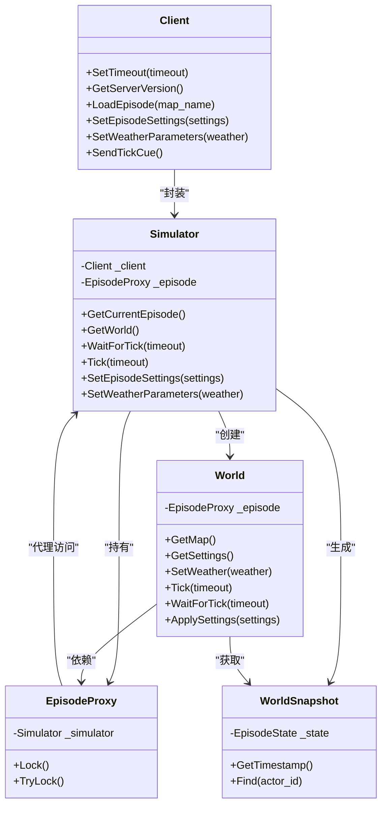
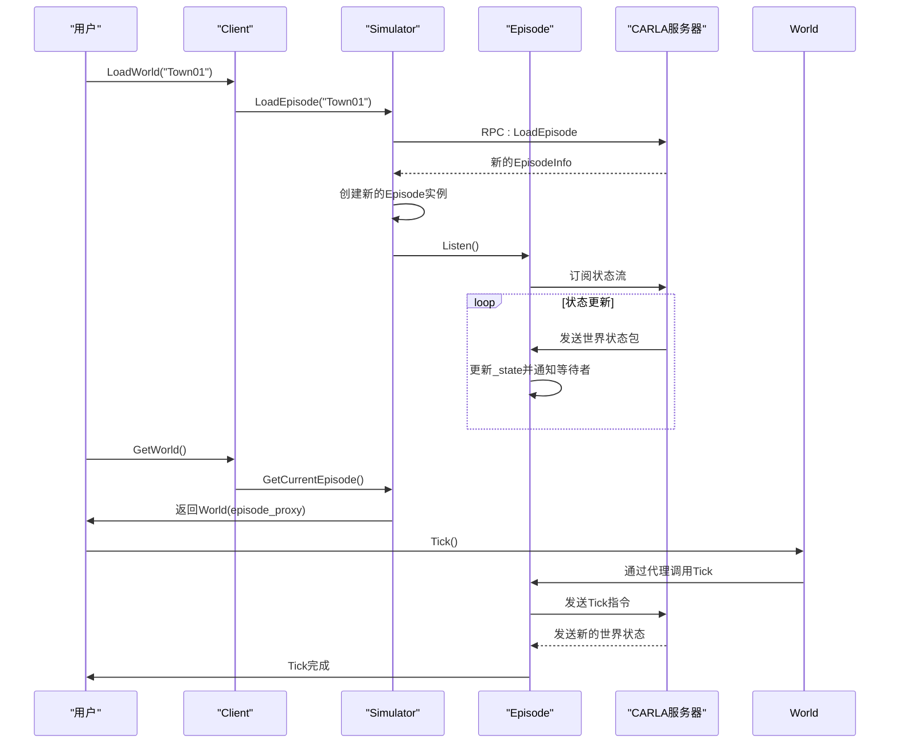
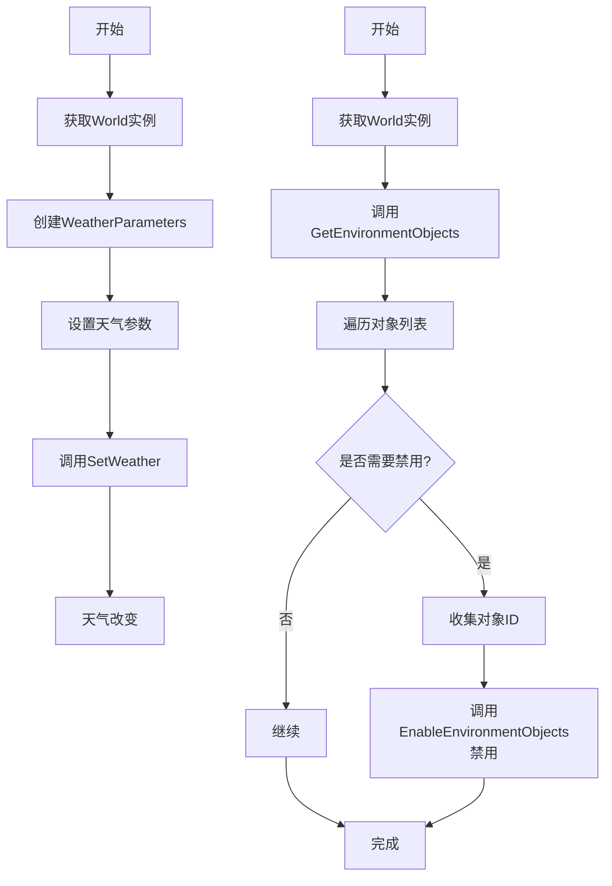

# 世界管理

> **引用文件**
> **本文档中引用的文件**

- [World.h](https://github.com/carla-simulator/carla/blob/ue5-dev/LibCarla/source/carla/client/World.h)
- [World.cpp](https://github.com/carla-simulator/carla/blob/ue5-dev/LibCarla/source/carla/client/World.cpp)
- [Client.h](https://github.com/carla-simulator/carla/blob/ue5-dev/LibCarla/source/carla/client/Client.h)
- [Client.cpp](https://github.com/carla-simulator/carla/blob/ue5-dev/LibCarla/source/carla/client/Client.cpp)
- [Simulator.h](https://github.com/carla-simulator/carla/blob/ue5-dev/LibCarla/source/carla/client/detail/Simulator.h)
- [Simulator.cpp](https://github.com/carla-simulator/carla/blob/ue5-dev/LibCarla/source/carla/client/detail/Simulator.cpp)
- [Episode.h](https://github.com/carla-simulator/carla/blob/ue5-dev/LibCarla/source/carla/client/detail/Episode.h)
- [Episode.cpp](https://github.com/carla-simulator/carla/blob/ue5-dev/LibCarla/source/carla/client/detail/Episode.cpp)
- [EpisodeProxy.h](https://github.com/carla-simulator/carla/blob/ue5-dev/LibCarla/source/carla/client/detail/EpisodeProxy.h)
- [EpisodeProxy.cpp](https://github.com/carla-simulator/carla/blob/ue5-dev/LibCarla/source/carla/client/detail/EpisodeProxy.cpp)
- [WorldSnapshot.h](https://github.com/carla-simulator/carla/blob/ue5-dev/LibCarla/source/carla/client/WorldSnapshot.h)
- [World.cpp](https://github.com/carla-simulator/carla/blob/ue5-dev/PythonAPI/carla/src/World.cpp)
- [Client.cpp](https://github.com/carla-simulator/carla/blob/ue5-dev/PythonAPI/carla/src/Client.cpp)

## 目录

1. [简介](#简介)
2. [核心架构设计](#核心架构设计)
3. [世界生命周期与 Episode 管理](#世界生命周期与episode管理)
4. [时间步进与同步模式](#时间步进与同步模式)
5. [天气与环境管理](#天气与环境管理)
6. [关键功能与 API](#关键功能与api)
7. [性能优化与最佳实践](#性能优化与最佳实践)
8. [Python API 使用示例](#python-api使用示例)
9. [结论](#结论)

## 简介

CARLA 仿真环境中的`World`类是整个模拟系统的核心控制器，负责管理仿真环境的各个方面。它作为客户端与仿真服务器之间的主要接口，提供了对时间步进、天气条件、环境对象、地图图层和仿真模式的全面控制。`World`类不仅管理着当前仿真世界的状态，还负责与`Client`类的交互，协调仿真生命周期，并提供对世界快照、演员（Actor）和地图的访问。通过`World`类，用户可以精确控制仿真环境的各个方面，从简单的天气变化到复杂的同步仿真流程，为自动驾驶算法的开发和测试提供了强大的基础。

**Section sources**

- <a href="https://github.com/carla-simulator/carla/blob/ue5-dev/LibCarla/source/carla/client/World.h#L45-L239" target="_blank">World.h</a>
- <a href="https://github.com/carla-simulator/carla/blob/ue5-dev/LibCarla/source/carla/client/World.cpp#L24-L392" target="_blank">World.cpp</a>

## 核心架构设计

### World 类与 Client 类的交互关系

`World`类的设计采用了分层架构，其核心是与`Client`类的紧密协作。`World`类本身并不直接与仿真服务器通信，而是通过一个`EpisodeProxy`对象来间接操作。`EpisodeProxy`持有对`Simulator`实例的引用，而`Simulator`则封装了与底层`Client`的通信逻辑。这种设计实现了关注点分离：`World`类专注于提供高层次的、面向用户的 API，而`Simulator`和`Client`类则负责处理底层的网络通信和协议细节。

`World`类的构造函数接受一个`EpisodeProxy`对象，这使得`World`实例与一个特定的仿真剧集（Episode）绑定。当用户通过`World`调用方法（如`SetWeather`或`Tick`）时，这些调用会通过`_episode`代理，最终由`Simulator`转发给`Client`，再通过 RPC（远程过程调用）发送到 CARLA 服务器。这种代理模式确保了`World`实例在对应的`Episode`结束后会自动失效，防止了对已销毁资源的访问。



**Diagram sources **

- <a href="https://github.com/carla-simulator/carla/blob/ue5-dev/LibCarla/source/carla/client/World.h#L45-L239" target="_blank">World.h</a>
- <a href="https://github.com/carla-simulator/carla/blob/ue5-dev/LibCarla/source/carla/client/Client.h#L20-L182" target="_blank">Client.h</a>
- <a href="https://github.com/carla-simulator/carla/blob/ue5-dev/LibCarla/source/carla/client/detail/Simulator.h#L49-L800" target="_blank">Simulator.h</a>

### 平台时间与视觉时间的分离机制

CARLA 通过`WorldSnapshot`类巧妙地实现了平台时间（Platform Time）与视觉时间（Visual Time）的分离。`WorldSnapshot`代表了仿真世界在某一特定时刻的完整状态快照，其中包含了`Timestamp`对象。这个`Timestamp`包含多个关键时间属性：

- **`frame`**: 一个单调递增的帧计数器，代表了仿真的逻辑步进。
- **`elapsed_seconds`**: 自仿真开始以来经过的总时间（秒），基于固定的或可变的时间步长计算。
- **`delta_seconds`**: 当前时间步长的持续时间。
- **`platform_timestamp`**: 服务器主机的系统时间戳，代表了事件实际发生的物理时间。

这种分离机制允许客户端以异步方式处理世界状态。例如，一个传感器回调函数接收到一个`WorldSnapshot`，它所看到的`elapsed_seconds`是该快照生成时的仿真时间，而处理该快照的客户端代码的本地系统时间（`platform_timestamp`）可能已经过去了几十毫秒。这种设计对于实现确定性仿真和回放功能至关重要，因为它确保了仿真逻辑与网络延迟和客户端处理速度解耦。

**Section sources**

- <a href="https://github.com/carla-simulator/carla/blob/ue5-dev/LibCarla/source/carla/client/WorldSnapshot.h#L18-L78" target="_blank">WorldSnapshot.h</a>
- <a href="https://github.com/carla-simulator/carla/blob/ue5-dev/LibCarla/source/carla/client/World.h#L99-L100" target="_blank">World.h</a>
- <a href="https://github.com/carla-simulator/carla/blob/ue5-dev/LibCarla/source/carla/client/detail/Simulator.h#L123-L126" target="_blank">Simulator.h</a>

## 世界生命周期与 Episode 管理

### Episode 生命周期管理

在 CARLA 中，“世界”（World）的概念与“剧集”（Episode）紧密相连。一个`Episode`代表了一次完整的仿真会话，从加载地图开始，到地图重新加载或关闭结束。`World`类是`Episode`的视图和控制器。当用户通过`Client`类的`LoadWorld`或`ReloadWorld`方法创建一个新的`World`实例时，实际上是在启动一个新的`Episode`。

`Episode`类是管理这一生命周期的核心。它负责：

1.  **监听状态更新**：通过`Listen()`方法订阅来自服务器的流式数据，每当服务器发送一个新的世界状态包时，`Episode`就会更新其内部的`_state`。
2.  **状态同步**：维护一个`RecurrentSharedFuture<WorldSnapshot>`，允许客户端代码（如`World::WaitForTick`）阻塞等待下一个世界状态的到来。
3.  **生命周期事件**：在`Episode`开始或改变时，触发`OnEpisodeStarted`和`OnEpisodeChanged`回调，用于重置内部状态（如 AI 导航系统）。

`World`实例的生命周期完全依赖于其背后的`Episode`。一旦`Episode`结束（例如，用户加载了新地图），任何对该`World`实例的后续调用都将抛出异常，因为`EpisodeProxy::Lock()`会检测到`Episode`已失效。



**Diagram sources **

- <a href="https://github.com/carla-simulator/carla/blob/ue5-dev/LibCarla/source/carla/client/Client.h#L70-L79" target="_blank">Client.h</a>
- <a href="https://github.com/carla-simulator/carla/blob/ue5-dev/LibCarla/source/carla/client/detail/Simulator.h#L72-L119" target="_blank">Simulator.h</a>
- <a href="https://github.com/carla-simulator/carla/blob/ue5-dev/LibCarla/source/carla/client/detail/Episode.h#L34-L137" target="_blank">Episode.h</a>
- <a href="https://github.com/carla-simulator/carla/blob/ue5-dev/LibCarla/source/carla/client/detail/Episode.cpp#L56-L113" target="_blank">Episode.cpp</a>

## 时间步进与同步模式

### 同步与异步模式详解

CARLA 支持两种主要的仿真模式：**异步模式**（Asynchronous Mode）和**同步模式**（Synchronous Mode），由`EpisodeSettings`中的`synchronous_mode`标志控制。

- **异步模式**：这是默认模式。服务器以尽可能快的速度运行仿真，不受客户端处理速度的影响。客户端通过注册`OnTick`回调来被动接收世界更新。这种方式延迟低，但可能导致客户端处理数据的速度跟不上服务器生成数据的速度，造成数据丢失或处理滞后。

- **同步模式**：在此模式下，服务器的仿真步进由客户端显式控制。服务器在完成一个时间步后会暂停，等待客户端发送`Tick`指令。这确保了客户端有充足的时间处理每一帧的数据，实现了精确的、确定性的仿真。这对于需要精确时间对齐的传感器融合或算法测试至关重要。

### 时间步进控制

`World`类提供了多种方法来控制时间步进：

- **`Tick(timeout)`**：在同步模式下，此方法向服务器发送一个“继续”信号，指示服务器执行下一个仿真步。它会阻塞直到收到新的世界状态或超时。这是控制同步仿真的主要方式。
- **`WaitForTick(timeout)`**：此方法阻塞调用线程，直到接收到下一个世界快照。它在异步和同步模式下都适用，常用于确保在继续执行前获取最新的世界状态。
- **`OnTick(callback)`**：注册一个回调函数，每当收到新的世界快照时自动调用。这是异步模式下处理数据的推荐方式，避免了轮询。

**Section sources**

- <a href="https://github.com/carla-simulator/carla/blob/ue5-dev/LibCarla/source/carla/client/World.h#L128-L143" target="_blank">World.h</a>
- <a href="https://github.com/carla-simulator/carla/blob/ue5-dev/LibCarla/source/carla/client/detail/Simulator.h#L192-L204" target="_blank">Simulator.h</a>
- <a href="https://github.com/carla-simulator/carla/blob/ue5-dev/LibCarla/source/carla/client/detail/Episode.h#L63-L69" target="_blank">Episode.h</a>

## 天气与环境管理

### 天气参数控制

`World`类通过`WeatherParameters`结构体提供了对仿真天气的精细控制。用户可以通过`SetWeather()`方法设置包括太阳方位角、太阳高度角、云量、降雨量、湿滑程度、雾浓度等在内的多种天气参数。`GetWeather()`方法则用于查询当前的天气状态。

值得注意的是，`SetWeather()`是一个即时操作，它会立即改变服务器端的天气渲染效果。然而，为了确保设置成功，代码中在`ApplySettings`方法里包含了一个验证循环，通过检查后续快照中的`delta_seconds`来确认设置是否生效，这体现了对网络延迟和状态同步的健壮性处理。

### 环境对象与地图图层管理

CARLA 允许动态管理环境对象和地图图层，以优化性能或创建特定场景。

- **环境对象**：通过`GetEnvironmentObjects()`可以查询世界中的静态网格物体（如建筑、植被），并使用`EnableEnvironmentObjects()`方法根据其 ID 启用或禁用它们。这在需要简化场景以提高性能时非常有用。
- **地图图层**：`LoadLevelLayer()`和`UnloadLevelLayer()`方法允许按类别（如建筑物、植被、道具）加载或卸载地图图层。这可以用于创建“精简版”地图，例如仅包含道路和交通标志的版本，以加速仿真。



**Diagram sources **

- <a href="https://github.com/carla-simulator/carla/blob/ue5-dev/LibCarla/source/carla/client/World.h#L90-L98" target="_blank">World.h</a>
- <a href="https://github.com/carla-simulator/carla/blob/ue5-dev/LibCarla/source/carla/client/World.h#L174-L182" target="_blank">World.h</a>
- <a href="https://github.com/carla-simulator/carla/blob/ue5-dev/LibCarla/source/carla/client/World.h#L66-L68" target="_blank">World.h</a>

## 关键功能与 API

### 获取世界设置与快照

- **`GetSettings()`**：返回当前的`EpisodeSettings`，包含同步模式、渲染模式、固定时间步长等关键配置。
- **`ApplySettings(settings)`**：应用新的世界设置。在同步模式下，这通常需要与`Tick`配合使用以确保设置生效。
- **`GetSnapshot()`**：获取当前世界状态的即时快照，包含所有演员的状态和时间戳。这对于需要在单个时间点分析整个世界状态的算法非常有用。

### 管理地图与演员

- **`GetMap()`**：返回当前地图的`Map`对象，用于路径规划和导航。
- **`GetActors()`**：获取世界中所有演员的列表。
- **`GetActor(id)`**：根据 ID 查找特定演员。
- **`SpawnActor(blueprint, transform)`**：根据蓝图和变换在世界中生成新的演员。

**Section sources**

- <a href="https://github.com/carla-simulator/carla/blob/ue5-dev/LibCarla/source/carla/client/World.h#L85-L118" target="_blank">World.h</a>
- <a href="https://github.com/carla-simulator/carla/blob/ue5-dev/LibCarla/source/carla/client/World.h#L64-L72" target="_blank">World.h</a>

## 性能优化与最佳实践

### 批处理操作

为了减少网络往返延迟，CARLA 提供了批处理操作。虽然`World`类本身不直接提供批处理方法，但`Client`类的`ApplyBatch`和`ApplyBatchSync`方法允许将多个命令（如生成多个演员、设置多个车辆控制）打包成一个请求发送。这显著提高了在需要执行大量操作时的效率。

### 时间步进优化策略

- **在同步模式下**：始终使用`Tick()`来推进仿真，避免使用`WaitForTick()`进行循环等待，因为`Tick()`是主动推进，而`WaitForTick()`是被动等待，可能导致不必要的延迟。
- **在异步模式下**：优先使用`OnTick`回调而非轮询`GetSnapshot()`，以降低 CPU 占用率。
- **合理设置超时**：为`Tick`和`WaitForTick`设置合理的超时时间，防止客户端因网络问题而永久阻塞。

**Section sources**

- <a href="https://github.com/carla-simulator/carla/blob/ue5-dev/LibCarla/source/carla/client/Client.h#L162-L176" target="_blank">Client.h</a>
- <a href="https://github.com/carla-simulator/carla/blob/ue5-dev/LibCarla/source/carla/client/detail/Simulator.h#L741-L747" target="_blank">Simulator.h</a>

## Python API 使用示例

以下是如何在 Python 中使用`World`类的典型示例：

```python
# 1. 获取世界实例
client = carla.Client('localhost', 2000)
world = client.get_world()

# 2. 设置同步模式
settings = world.get_settings()
settings.synchronous_mode = True
settings.fixed_delta_seconds = 0.05
world.apply_settings(settings)

# 3. 改变天气
weather = carla.WeatherParameters(cloudiness=80.0, precipitation=30.0, sun_altitude_angle=70.0)
world.set_weather(weather)

# 4. 在同步模式下控制仿真步进
try:
    while True:
        # 等待下一个仿真步
        world.tick()

        # 获取当前世界快照
        snapshot = world.get_snapshot()
        print(f"当前仿真时间: {snapshot.timestamp.elapsed_seconds}秒")

        # 处理传感器数据或执行其他逻辑...

finally:
    # 恢复异步模式
    settings.synchronous_mode = False
    world.apply_settings(settings)
```

**Section sources**

- <a href="https://github.com/carla-simulator/carla/blob/ue5-dev/PythonAPI/carla/src/World.cpp#L302-L360" target="_blank">World.cpp</a>
- <a href="https://github.com/carla-simulator/carla/blob/ue5-dev/PythonAPI/carla/src/Client.cpp#L188-L217" target="_blank">Client.cpp</a>

## 结论

`World`类是 CARLA 仿真框架的中枢神经，它通过精心设计的分层架构和代理模式，为用户提供了强大而灵活的仿真控制能力。其对同步/异步模式、时间步进、天气和环境的管理，使得 CARLA 能够适应从快速原型开发到高精度算法验证的各种需求。理解`World`类与`Client`、`Simulator`和`Episode`之间的交互关系，以及平台时间与视觉时间的分离机制，是高效使用 CARLA 进行自动驾驶研究和开发的关键。通过遵循批处理和合理的时间步进策略等最佳实践，用户可以构建出高性能、高可靠性的仿真系统。
