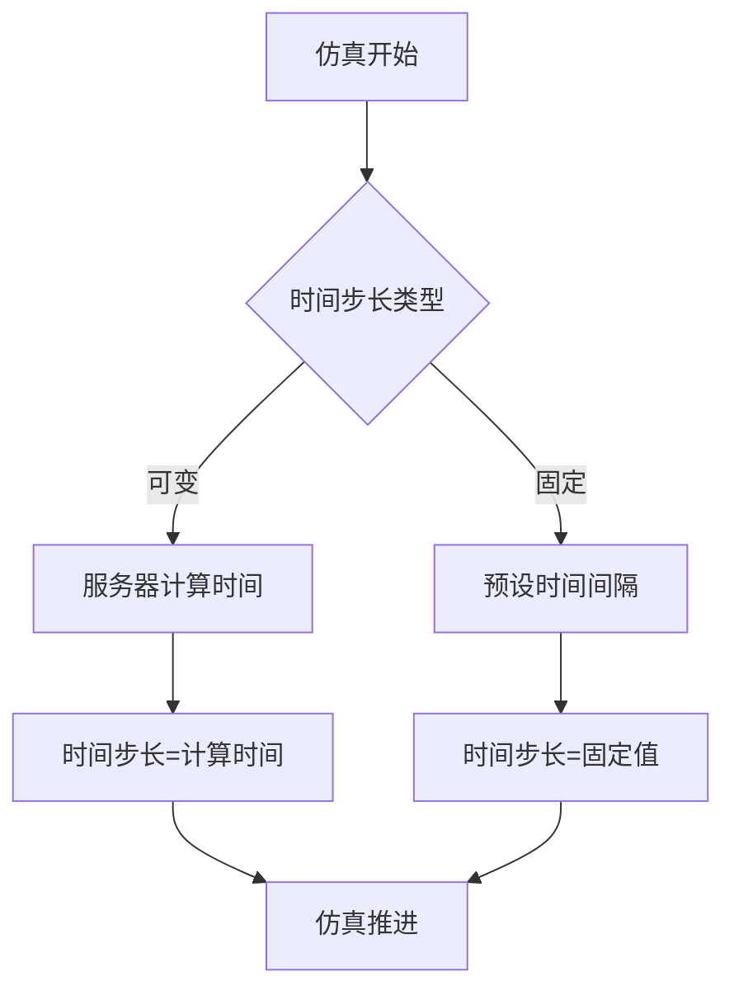
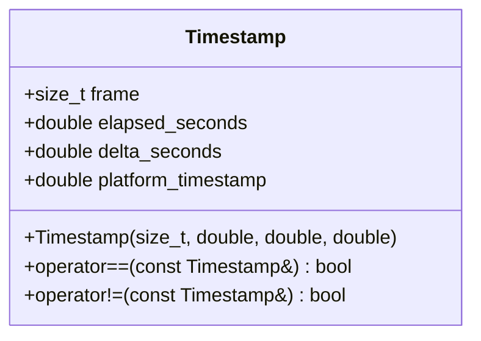
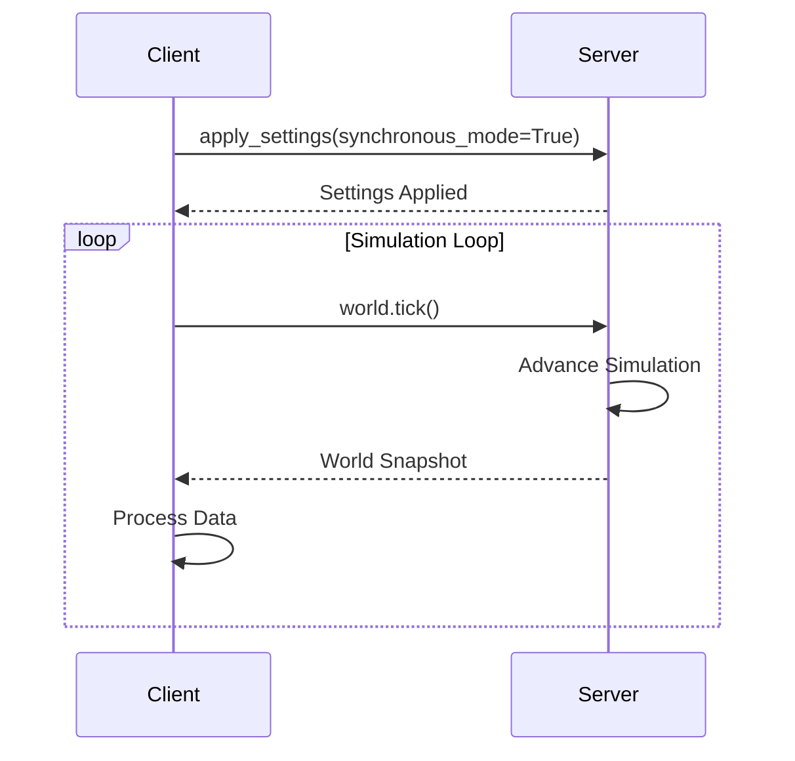
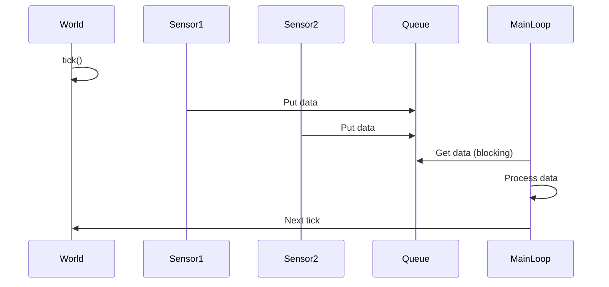
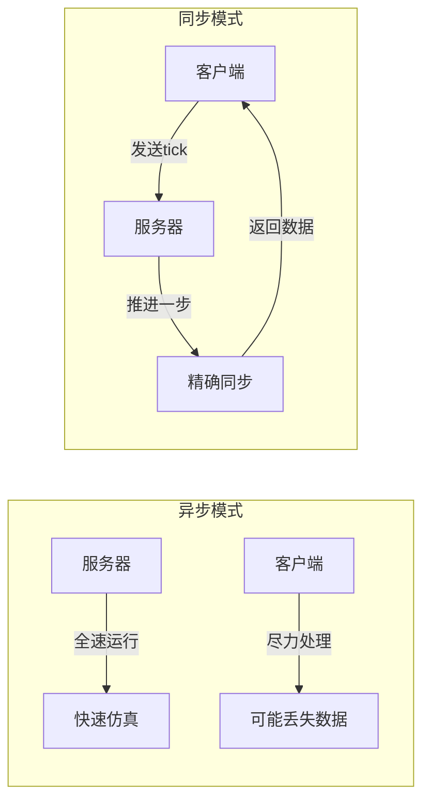
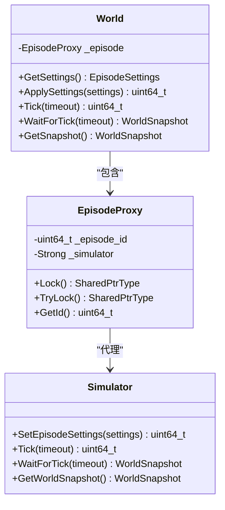

# 仿真控制

> **引用文件**
> **本文档中引用的文件**

- [World.h](https://github.com/carla-simulator/carla/blob/ue5-dev/LibCarla/source/carla/client/World.h)
- [World.cpp](https://github.com/carla-simulator/carla/blob/ue5-dev/LibCarla/source/carla/client/World.cpp)
- [EpisodeProxy.h](https://github.com/carla-simulator/carla/blob/ue5-dev/LibCarla/source/carla/client/detail/EpisodeProxy.h)
- [EpisodeProxy.cpp](https://github.com/carla-simulator/carla/blob/ue5-dev/LibCarla/source/carla/client/detail/EpisodeProxy.cpp)
- [Timestamp.h](https://github.com/carla-simulator/carla/blob/ue5-dev/LibCarla/source/carla/client/Timestamp.h)
- [WorldSnapshot.h](https://github.com/carla-simulator/carla/blob/ue5-dev/LibCarla/source/carla/client/WorldSnapshot.h)
- [World.cpp](https://github.com/carla-simulator/carla/blob/ue5-dev/PythonAPI/carla/src/World.cpp)
- [adv_synchrony_timestep.md](https://github.com/carla-simulator/carla/blob/ue5-dev/Docs/adv_synchrony_timestep.md)
- [sensor_synchronization.py](https://github.com/carla-simulator/carla/blob/ue5-dev/PythonAPI/examples/sensor_synchronization.py)
- [test_sync.py](https://github.com/carla-simulator/carla/blob/ue5-dev/PythonAPI/test/smoke/test_sync.py)

## 目录

1. [引言](#引言)
2. [仿真时间步进与同步模式](#仿真时间步进与同步模式)
3. [平台时间与视觉时间分离机制](#平台时间与视觉时间分离机制)
4. [同步模式与固定时间步长配置](#同步模式与固定时间步长配置)
5. [Episode 生命周期管理](#episode生命周期管理)
6. [传感器数据同步示例](#传感器数据同步示例)
7. [性能优化策略](#性能优化策略)
8. [同步/异步模式差异](#同步异步模式差异)
9. [底层时间管理机制](#底层时间管理机制)
10. [最佳实践](#最佳实践)

## 引言

CARLA 仿真平台采用客户端-服务器架构，其中服务器负责运行仿真，客户端负责获取信息并请求对世界进行更改。仿真控制的核心在于 World 类，它管理着仿真时间步进、同步模式以及整个仿真环境的状态。理解这些机制对于开发可靠的自动驾驶仿真应用至关重要。

**Section sources**

- [adv_synchrony_timestep.md](https://github.com/carla-simulator/carla/blob/ue5-dev/Docs/adv_synchrony_timestep.md#client-server-synchrony)

## 仿真时间步进与同步模式

CARLA 中的时间分为真实时间和仿真时间。仿真世界有其自己的时钟和时间，由服务器控制。计算两个仿真步骤需要一些真实时间，但这两个仿真时刻之间经过的时间跨度即为时间步长。时间步长可以是固定的或可变的，这取决于用户偏好。

### 可变时间步长

CARLA 的默认模式。仿真步骤之间经过的时间将是服务器计算这些步骤所需的时间。在这种模式下，服务器以尽可能快的速度运行仿真，不等待客户端。

### 固定时间步长

步骤之间经过的时间保持恒定。如果设置为 0.05 秒，则模拟器将采取二十个步骤（1/0.05）来重现世界的一秒。使用每个步骤上相同的时间增量是收集模拟数据的最佳方式。



**Diagram sources**

- <a href="https://github.com/carla-simulator/carla/blob/ue5-dev/LibCarla/source/carla/client/World.h#L22" target="_blank">World.h</a>
- [adv_synchrony_timestep.md](https://github.com/carla-simulator/carla/blob/ue5-dev/Docs/adv_synchrony_timestep.md#fixed-time-step)

**Section sources**

- [adv_synchrony_timestep.md](https://github.com/carla-simulator/carla/blob/ue5-dev/Docs/adv_synchrony_timestep.md#simulation-time-step)

## 平台时间与视觉时间分离机制

在分布式仿真中，平台时间（Platform Time）与视觉时间（Visual Time）的分离机制至关重要。平台时间指操作系统提供的实际时间戳，而视觉时间指模拟世界内部的逻辑时间。

World 类通过 Timestamp 结构体管理这两种时间：

- **frame**: 自模拟器启动以来经过的帧数
- **elapsed_seconds**: 当前 episode 开始以来经过的模拟秒数
- **delta_seconds**: 自上一帧以来经过的模拟秒数
- **platform_timestamp**: 操作系统提供的帧时间戳（秒）

这种分离允许客户端精确跟踪模拟状态，同时处理网络延迟和不同组件之间的同步问题。



**Diagram sources**

- <a href="https://github.com/carla-simulator/carla/blob/ue5-dev/LibCarla/source/carla/client/Timestamp.h#L14-L49" target="_blank">Timestamp.h</a>

**Section sources**

- <a href="https://github.com/carla-simulator/carla/blob/ue5-dev/LibCarla/source/carla/client/Timestamp.h#L14-L73" target="_blank">Timestamp.h</a>

## 同步模式与固定时间步长配置

同步模式是 CARLA 仿真控制的关键特性，它确保客户端和服务器之间的精确同步。当启用同步模式时，服务器会在更新到下一个模拟步骤之前等待客户端的"tick"消息。

### 启用同步模式

```python
settings = world.get_settings()
settings.synchronous_mode = True
settings.fixed_delta_seconds = 0.05
world.apply_settings(settings)
```

### 配置物理子步进

为了提高物理模拟的精度，可以配置物理子步进：

```python
settings = world.get_settings()
settings.substepping = True
settings.max_substep_delta_time = 0.01
settings.max_substeps = 10
world.apply_settings(settings)
```

必须确保固定时间步长与子步进设置一致：
`fixed_delta_seconds <= max_substep_delta_time * max_substeps`



**Diagram sources**

- <a href="https://github.com/carla-simulator/carla/blob/ue5-dev/LibCarla/source/carla/client/World.h#L85-L88" target="_blank">World.h</a>
- <a href="https://github.com/carla-simulator/carla/blob/ue5-dev/LibCarla/source/carla/client/World.cpp#L56-L83" target="_blank">World.cpp</a>

**Section sources**

- [adv_synchrony_timestep.md](https://github.com/carla-simulator/carla/blob/ue5-dev/Docs/adv_synchrony_timestep.md#client-server-synchrony)
- <a href="https://github.com/carla-simulator/carla/blob/ue5-dev/LibCarla/source/carla/client/World.h#L85-L88" target="_blank">World.h</a>

## Episode 生命周期管理

Episode 代表一次完整的仿真运行周期，从世界加载到重置或关闭。World 类通过 EpisodeProxy 管理 Episode 的生命周期。

### 仿真重置

重置仿真时，必须重新加载世界以确保确定性：

```python
client.reload_world(False) # 重新加载地图并保持世界设置
```

### 时间步进控制

World 类提供多种方法来控制时间步进：

- `Tick()`: 信号模拟器继续到下一步（仅在同步模式下有效）
- `WaitForTick()`: 阻塞调用线程直到接收到世界 tick
- `OnTick()`: 注册回调函数，在每次接收到世界 tick 时调用

### 数据采集同步

在每个时间步中，客户端应：

1. 调用`world.tick()`推进仿真
2. 从传感器队列中获取数据
3. 处理当前帧的数据
4. 准备下一帧

```mermaid
flowchart TD
A[开始仿真] --> B[配置同步模式]
B --> C[初始化传感器]
C --> D[启动传感器监听]
D --> E{主循环}
E --> F[world.tick()]
F --> G[获取传感器数据]
G --> H[处理数据]
H --> I{继续?}
I --> |是| E
I --> |否| J[清理资源]
J --> K[结束]
```

**Diagram sources**

- <a href="https://github.com/carla-simulator/carla/blob/ue5-dev/LibCarla/source/carla/client/World.h#L128-L143" target="_blank">World.h</a>
- <a href="https://github.com/carla-simulator/carla/blob/ue5-dev/PythonAPI/test/smoke/test_sync.py#L48-L58" target="_blank">test_sync.py</a>

**Section sources**

- <a href="https://github.com/carla-simulator/carla/blob/ue5-dev/LibCarla/source/carla/client/World.h#L128-L143" target="_blank">World.h</a>
- <a href="https://github.com/carla-simulator/carla/blob/ue5-dev/LibCarla/source/carla/client/World.cpp#L142-L161" target="_blank">World.cpp</a>

## 传感器数据同步示例

以下示例展示了如何使用队列同步多个传感器的数据采集：

```python
def sensor_callback(sensor_data, sensor_queue, sensor_name):
    sensor_queue.put((sensor_data.frame, sensor_name))

# 创建传感器队列
sensor_queue = Queue()

# 设置同步模式
settings = world.get_settings()
settings.fixed_delta_seconds = 0.2
settings.synchronous_mode = True
world.apply_settings(settings)

# 创建并启动传感器
camera = world.spawn_actor(cam_bp, transform)
camera.listen(lambda data: sensor_callback(data, sensor_queue, "camera"))

lidar = world.spawn_actor(lidar_bp, transform)
lidar.listen(lambda data: sensor_callback(data, sensor_queue, "lidar"))

# 主循环
while True:
    world.tick()
    w_frame = world.get_snapshot().frame

    # 等待所有传感器数据
    try:
        for _ in range(len(sensor_list)):
            s_frame = sensor_queue.get(True, 1.0)
            print(f"Frame: {s_frame[0]} Sensor: {s_frame[1]}")
    except Empty:
        print("Some sensor data missed")
```



**Diagram sources**

- <a href="https://github.com/carla-simulator/carla/blob/ue5-dev/PythonAPI/examples/sensor_synchronization.py#L34-L112" target="_blank">sensor_synchronization.py</a>

**Section sources**

- <a href="https://github.com/carla-simulator/carla/blob/ue5-dev/PythonAPI/examples/sensor_synchronization.py#L1-L124" target="_blank">sensor_synchronization.py</a>

## 性能优化策略

### 批处理命令

使用批处理命令可以显著提高性能并确保确定性：

```python
commands = [carla.command.SpawnActor(bp, transform) for bp, transform in actor_list]
responses = client.apply_batch_sync(commands)
```

### 网络延迟处理

- 使用`apply_batch_sync`确保命令按顺序执行
- 设置适当的超时时间
- 在同步模式下，客户端 tick 控制服务器进度
- 使用队列缓冲传感器数据，避免数据丢失

### 物理确定性

为确保物理确定性，必须：

1. 在加载世界前启用同步模式
2. 使用固定时间步长
3. 每次重复仿真时重新加载世界
4. 批量应用命令而非逐个应用

```mermaid
flowchart TD
A[连接客户端] --> B[加载地图]
B --> C[设置同步模式]
C --> D[应用固定时间步长]
D --> E[重新加载世界]
E --> F[设置交通管理器]
F --> G[生成车辆/行人]
G --> H[仿真循环]
H --> I[world.tick()]
I --> H
```

**Diagram sources**

- [adv_synchrony_timestep.md](https://github.com/carla-simulator/carla/blob/ue5-dev/Docs/adv_synchrony_timestep.md#physics-determinism)

**Section sources**

- [adv_synchrony_timestep.md](https://github.com/carla-simulator/carla/blob/ue5-dev/Docs/adv_synchrony_timestep.md#physics-determinism)
- <a href="https://github.com/carla-simulator/carla/blob/ue5-dev/PythonAPI/test/smoke/test_sync.py#L146-L180" target="_blank">test_sync.py</a>

## 同步/异步模式差异

### 初学者视角

| 模式     | 速度 | 控制       | 适用场景                 |
| -------- | ---- | ---------- | ------------------------ |
| 异步模式 | 快   | 服务器控制 | 快速测试、性能基准       |
| 同步模式 | 慢   | 客户端控制 | 精确数据采集、传感器同步 |

### 技术细节

- **异步模式**: 服务器以最大速度运行，可能导致数据溢出
- **同步模式**: 服务器等待客户端 tick，确保每步数据完整性
- **混合模式**: 不推荐，可能导致不可靠的仿真结果



**Diagram sources**

- [adv_synchrony_timestep.md](https://github.com/carla-simulator/carla/blob/ue5-dev/Docs/adv_synchrony_timestep.md#possible-configurations)

**Section sources**

- [adv_synchrony_timestep.md](https://github.com/carla-simulator/carla/blob/ue5-dev/Docs/adv_synchrony_timestep.md#possible-configurations)

## 底层时间管理机制

World 类通过 EpisodeProxy 与 Simulator 交互，管理时间步进：

1. `ApplySettings()`: 应用新的仿真设置，包括同步模式和固定时间步长
2. `Tick()`: 信号服务器继续到下一步
3. `WaitForTick()`: 阻塞直到接收到新的世界快照
4. `GetSnapshot()`: 获取当前世界状态的快照

EpisodeProxy 确保在 Episode 结束后对 Simulator 的任何访问都会抛出异常，保证了生命周期的安全性。



**Diagram sources**

- <a href="https://github.com/carla-simulator/carla/blob/ue5-dev/LibCarla/source/carla/client/World.h#L45-L239" target="_blank">World.h</a>
- <a href="https://github.com/carla-simulator/carla/blob/ue5-dev/LibCarla/source/carla/client/detail/EpisodeProxy.h#L28-L73" target="_blank">EpisodeProxy.h</a>

**Section sources**

- <a href="https://github.com/carla-simulator/carla/blob/ue5-dev/LibCarla/source/carla/client/World.h#L45-L239" target="_blank">World.h</a>
- <a href="https://github.com/carla-simulator/carla/blob/ue5-dev/LibCarla/source/carla/client/detail/EpisodeProxy.h#L28-L73" target="_blank">EpisodeProxy.h</a>

## 最佳实践

1. **始终在加载世界前设置同步模式**
2. **使用固定时间步长确保确定性**
3. **每次实验重新加载世界**
4. **使用批处理命令提高可靠性**
5. **合理设置超时时间**
6. **使用队列管理传感器数据流**
7. **在 finally 块中清理资源**

```python
try:
    # 实验设置
    settings = world.get_settings()
    settings.synchronous_mode = True
    settings.fixed_delta_seconds = 0.05
    world.apply_settings(settings)

    # 仿真循环
    while True:
        world.tick()
        # 处理数据

except Exception as e:
    print(f"Error: {e}")
finally:
    # 恢复原始设置
    world.apply_settings(original_settings)
    # 清理传感器
    for sensor in sensor_list:
        sensor.destroy()
```

**Section sources**

- [adv_synchrony_timestep.md](https://github.com/carla-simulator/carla/blob/ue5-dev/Docs/adv_synchrony_timestep.md#physics-determinism)
- <a href="https://github.com/carla-simulator/carla/blob/ue5-dev/PythonAPI/examples/sensor_synchronization.py#L113-L117" target="_blank">sensor_synchronization.py</a>
