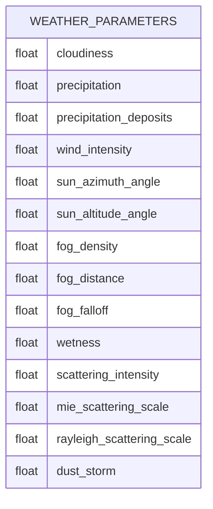
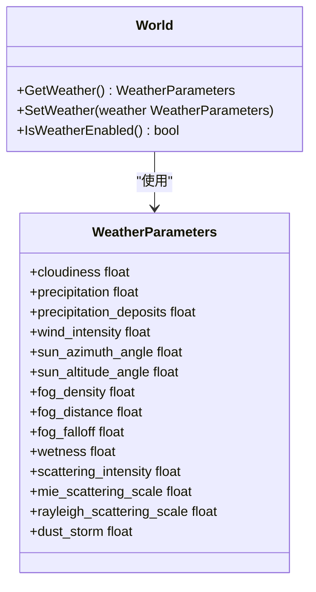
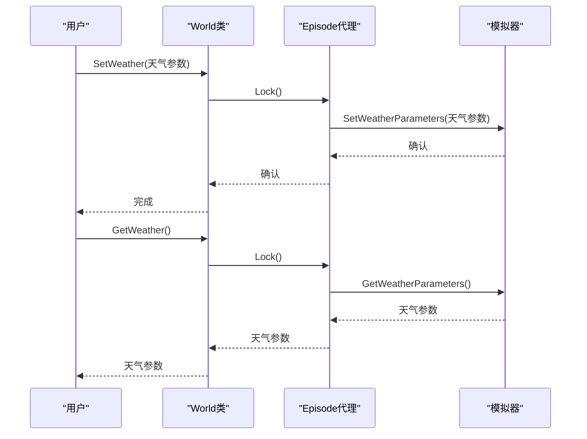
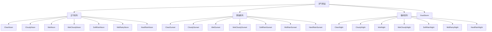
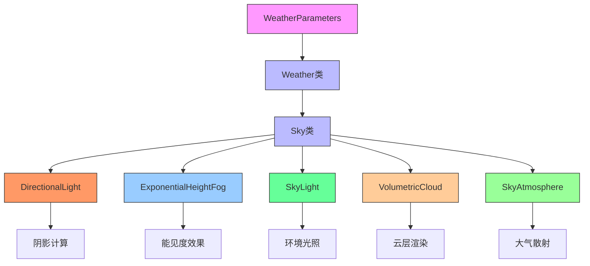
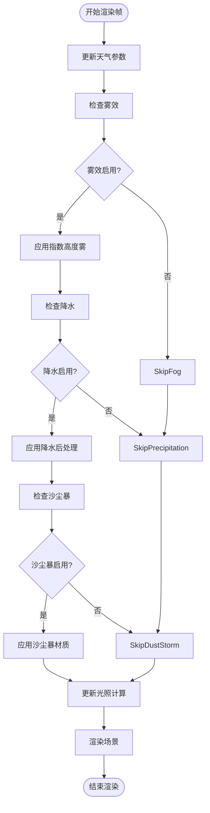
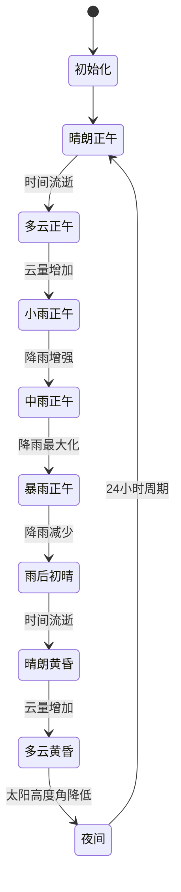
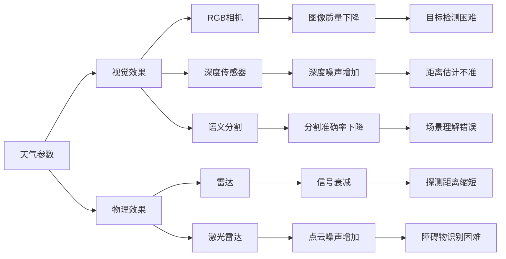
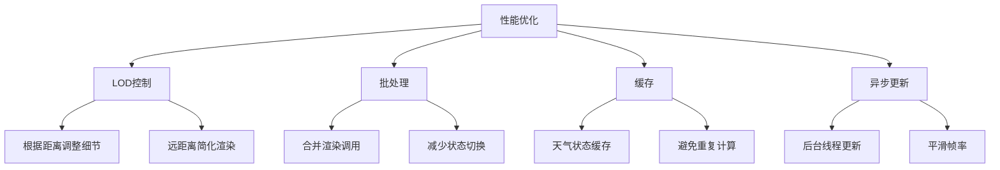

# 天气与光照


**本文档中引用的文件**   
- [WeatherParameters.h](https://github.com/carla-simulator/carla/blob/ue5-dev/LibCarla/source/carla/rpc/WeatherParameters.h)
- [WeatherParameters.cpp](https://github.com/carla-simulator/carla/blob/ue5-dev/LibCarla/source/carla/rpc/WeatherParameters.cpp)
- [World.h](https://github.com/carla-simulator/carla/blob/ue5-dev/LibCarla/source/carla/client/World.h)
- [World.cpp](https://github.com/carla-simulator/carla/blob/ue5-dev/LibCarla/source/carla/client/World.cpp)
- [Weather.cpp](https://github.com/carla-simulator/carla/blob/ue5-dev/PythonAPI/carla/src/Weather.cpp)
- [weather.yml](https://github.com/carla-simulator/carla/blob/ue5-dev/PythonAPI/docs/weather.yml)
- [WeatherParameters.h](https://github.com/carla-simulator/carla/blob/ue5-dev/Unreal/CarlaUnreal/Plugins/Carla/Source/Carla/Weather/WeatherParameters.h)
- [Weather.cpp](https://github.com/carla-simulator/carla/blob/ue5-dev/Unreal/CarlaUnreal/Plugins/Carla/Source/Carla/Weather/Weather.cpp)
- [Sky.h](https://github.com/carla-simulator/carla/blob/ue5-dev/Unreal/CarlaUnreal/Plugins/Carla/Source/Carla/Weather/Sky.h)
- [Sky.cpp](https://github.com/carla-simulator/carla/blob/ue5-dev/Unreal/CarlaUnreal/Plugins/Carla/Source/Carla/Weather/Sky.cpp)
- [automatic_control.py](https://github.com/carla-simulator/carla/blob/ue5-dev/PythonAPI/examples/automatic_control.py)


## 目录
1. [简介](#简介)
2. [天气参数详解](#天气参数详解)
3. [World类中的天气控制](#world类中的天气控制)
4. [天气预设](#天气预设)
5. [天气与光照系统集成](#天气与光照系统集成)
6. [Python API使用示例](#python-api使用示例)
7. [动态天气系统](#动态天气系统)
8. [传感器性能影响](#传感器性能影响)
9. [性能优化策略](#性能优化策略)

## 简介

CARLA模拟器提供了一个高度可配置的天气与光照系统，允许用户精确控制环境条件以进行自动驾驶算法的测试和验证。该系统通过`WeatherParameters`类定义各种天气属性，并通过`World`类进行管理和应用。天气系统不仅影响视觉传感器的感知效果，还通过物理准确的光照渲染影响整个场景的真实感。

天气系统的设计目标是为自动驾驶研究提供一个可控的环境测试平台，使研究人员能够在各种天气条件下评估算法的鲁棒性。从晴朗的正午到暴雨的黄昏，从薄雾弥漫到沙尘暴，CARLA提供了广泛的天气条件选项。

**天气与光照系统的主要特点包括：**
- 14种预定义的天气预设
- 14个可独立调节的天气参数
- 太阳位置的精确控制
- 物理准确的大气散射模型
- 动态天气过渡支持
- 对RGB相机传感器的直接影响

**Section sources**
- [WeatherParameters.h](https://github.com/carla-simulator/carla/blob/ue5-dev/LibCarla/source/carla/rpc/WeatherParameters.h#L20-L178)
- [World.h](https://github.com/carla-simulator/carla/blob/ue5-dev/LibCarla/source/carla/client/World.h#L45-L242)

## 天气参数详解

CARLA的天气系统由`WeatherParameters`类定义，包含14个可调节的参数，每个参数都有特定的物理意义和取值范围。这些参数共同决定了模拟环境的视觉外观和光照条件。

### 核心天气参数



**Diagram sources**
- [WeatherParameters.h](https://github.com/carla-simulator/carla/blob/ue5-dev/LibCarla/source/carla/rpc/WeatherParameters.h#L84-L97)

#### 云量 (cloudiness)
- **取值范围**: 0.0 到 100.0
- **物理意义**: 天空被云层覆盖的程度
- **影响**: 0表示完全晴朗的天空，100表示完全被云层覆盖的阴天
- **默认值**: 0.0

#### 降雨强度 (precipitation)
- **取值范围**: 0.0 到 100.0
- **物理意义**: 雨水的强度
- **影响**: 0表示无雨，100表示暴雨
- **注意**: 该参数仅控制视觉效果，不影响物理模拟

#### 降雨沉积 (precipitation_deposits)
- **取值范围**: 0.0 到 100.0
- **物理意义**: 地面上积水的程度
- **影响**: 控制路面上水坑的形成，值越高水坑越多
- **特点**: 水坑位置基于静态噪声生成，每次出现位置相同

#### 风力强度 (wind_intensity)
- **取值范围**: 0.0 到 100.0
- **物理意义**: 风的强度
- **影响**: 影响雨滴方向和树叶摆动，但受限制以避免动画问题

#### 太阳方位角 (sun_azimuth_angle)
- **取值范围**: 0.0 到 360.0 度
- **物理意义**: 太阳在水平面上的方向
- **参考点**: 0度为虚幻引擎确定的原点
- **典型值**: 正午时太阳位于南方（约180度）

#### 太阳高度角 (sun_altitude_angle)
- **取值范围**: -90.0 到 90.0 度
- **物理意义**: 太阳在垂直面上的高度
- **影响**: -90度表示午夜，90度表示正午
- **重要性**: 决定阴影长度和光照强度

#### 雾浓度 (fog_density)
- **取值范围**: 0.0 到 100.0
- **物理意义**: 雾的浓度或厚度
- **影响**: 仅影响RGB相机传感器的视觉效果
- **视觉效果**: 值越高，能见度越低

#### 雾距离 (fog_distance)
- **取值范围**: 0.0 到 ∞ 米
- **物理意义**: 雾开始出现的距离
- **单位**: 米
- **效果**: 控制雾的起始点，影响场景的深度感知

#### 雾衰减 (fog_falloff)
- **取值范围**: 0.0 到 ∞
- **物理意义**: 雾的密度（比质量）
- **影响**: 值越大，雾越密集，高度越低
- **特殊值**: 0表示比空气轻的雾，覆盖整个场景

#### 湿度 (wetness)
- **取值范围**: 0.0 到 100.0
- **物理意义**: 路面的湿润程度
- **影响**: 仅影响RGB相机传感器的视觉效果
- **视觉效果**: 值越高，路面反光越强

#### 散射强度 (scattering_intensity)
- **取值范围**: 0.0 到 ∞
- **物理意义**: 光线对体积雾的贡献程度
- **效果**: 0表示无贡献，值越大体积光效果越明显

#### 米氏散射比例 (mie_scattering_scale)
- **取值范围**: 0.0 到 ∞
- **物理意义**: 光线与大颗粒（如花粉、空气污染）的相互作用
- **视觉效果**: 产生有光晕的朦胧天空
- **典型值**: 0.03

#### 瑞利散射比例 (rayleigh_scattering_scale)
- **取值范围**: 0.0 到 ∞
- **物理意义**: 光线与小颗粒（如空气分子）的相互作用
- **视觉效果**: 依赖光波长，白天产生蓝色天空，傍晚产生红色天空
- **默认值**: 0.0331

#### 沙尘暴 (dust_storm)
- **取值范围**: 0.0 到 100.0
- **物理意义**: 沙尘暴天气的强度
- **影响**: 模拟沙尘暴天气条件
- **视觉效果**: 值越高，沙尘效果越明显

**Section sources**
- [WeatherParameters.h](https://github.com/carla-simulator/carla/blob/ue5-dev/LibCarla/source/carla/rpc/WeatherParameters.h#L84-L97)
- [weather.yml](https://github.com/carla-simulator/carla/blob/ue5-dev/PythonAPI/docs/weather.yml#L13-L84)

## World类中的天气控制

`World`类是CARLA模拟器中管理环境条件的核心类，提供了对天气系统的完整控制接口。通过`World`类的方法，用户可以获取当前天气状态、设置新的天气条件以及检查天气系统是否启用。

### 天气控制方法



**Diagram sources**
- [World.h](https://github.com/carla-simulator/carla/blob/ue5-dev/LibCarla/source/carla/client/World.h#L90-L97)
- [WeatherParameters.h](https://github.com/carla-simulator/carla/blob/ue5-dev/LibCarla/source/carla/rpc/WeatherParameters.h#L20-L178)

### 主要天气控制方法

#### 获取当前天气 (GetWeather)
- **功能**: 返回当前活跃的天气参数
- **返回值**: `WeatherParameters`对象
- **使用场景**: 在修改天气前获取当前状态作为参考

#### 设置天气 (SetWeather)
- **功能**: 更改模拟中的天气条件
- **参数**: `WeatherParameters`对象
- **影响**: 立即应用新的天气条件到场景中
- **注意**: 只影响视觉传感器，不影响物理模拟

#### 检查天气启用状态 (IsWeatherEnabled)
- **功能**: 查询天气系统是否启用
- **返回值**: 布尔值
- **用途**: 验证天气系统是否正常工作

### 方法调用流程



**Diagram sources**
- [World.cpp](https://github.com/carla-simulator/carla/blob/ue5-dev/LibCarla/source/carla/client/World.cpp#L86-L92)
- [World.h](https://github.com/carla-simulator/carla/blob/ue5-dev/LibCarla/source/carla/client/World.h#L90-L97)

**Section sources**
- [World.h](https://github.com/carla-simulator/carla/blob/ue5-dev/LibCarla/source/carla/client/World.h#L90-L97)
- [World.cpp](https://github.com/carla-simulator/carla/blob/ue5-dev/LibCarla/source/carla/client/World.cpp#L86-L92)

## 天气预设

CARLA提供了14种预定义的天气预设，涵盖了从晴朗到恶劣天气的各种条件。这些预设是经过精心调校的参数组合，可以快速设置常见的天气场景。

### 预设列表



**Diagram sources**
- [WeatherParameters.cpp](https://github.com/carla-simulator/carla/blob/ue5-dev/LibCarla/source/carla/rpc/WeatherParameters.cpp#L15-L37)

### 预设参数详解

| 预设名称 | 云量 | 降雨 | 降雨沉积 | 风力 | 太阳高度角 | 雾浓度 | 湿度 | 沙尘暴 |
|---------|------|------|----------|------|------------|--------|------|--------|
| ClearNoon | 5.0 | 0.0 | 0.0 | 10.0 | 45.0 | 2.0 | 0.0 | 0.0 |
| CloudyNoon | 60.0 | 0.0 | 0.0 | 10.0 | 45.0 | 3.0 | 0.0 | 0.0 |
| WetNoon | 5.0 | 0.0 | 50.0 | 10.0 | 45.0 | 3.0 | 0.0 | 0.0 |
| MidRainyNoon | 60.0 | 60.0 | 60.0 | 60.0 | 45.0 | 3.0 | 0.0 | 0.0 |
| HardRainNoon | 100.0 | 100.0 | 90.0 | 100.0 | 45.0 | 7.0 | 0.0 | 0.0 |
| ClearSunset | 5.0 | 0.0 | 0.0 | 10.0 | 15.0 | 2.0 | 0.0 | 0.0 |
| CloudySunset | 60.0 | 0.0 | 0.0 | 10.0 | 15.0 | 3.0 | 0.0 | 0.0 |
| WetSunset | 5.0 | 0.0 | 50.0 | 10.0 | 15.0 | 2.0 | 0.0 | 0.0 |
| MidRainSunset | 60.0 | 60.0 | 60.0 | 60.0 | 15.0 | 3.0 | 0.0 | 0.0 |
| HardRainSunset | 100.0 | 100.0 | 90.0 | 100.0 | 15.0 | 7.0 | 0.0 | 0.0 |
| ClearNight | 5.0 | 0.0 | 0.0 | 10.0 | -90.0 | 60.0 | 0.0 | 0.0 |
| CloudyNight | 60.0 | 0.0 | 0.0 | 10.0 | -90.0 | 60.0 | 0.0 | 0.0 |
| WetNight | 5.0 | 0.0 | 50.0 | 10.0 | -90.0 | 60.0 | 60.0 | 0.0 |
| HardRainNight | 100.0 | 100.0 | 90.0 | 100.0 | -90.0 | 100.0 | 100.0 | 0.0 |
| DustStorm | 100.0 | 0.0 | 0.0 | 100.0 | 45.0 | 2.0 | 0.0 | 100.0 |

**Section sources**
- [WeatherParameters.cpp](https://github.com/carla-simulator/carla/blob/ue5-dev/LibCarla/source/carla/rpc/WeatherParameters.cpp#L15-L37)
- [WeatherParameters.h](https://github.com/carla-simulator/carla/blob/ue5-dev/LibCarla/source/carla/rpc/WeatherParameters.h#L26-L48)

## 天气与光照系统集成

CARLA的天气系统与光照渲染系统深度集成，通过虚幻引擎的物理渲染管线实现真实的光照效果。这种集成确保了天气变化能够自然地影响场景的光照和视觉效果。

### 系统架构



**Diagram sources**
- [Sky.h](https://github.com/carla-simulator/carla/blob/ue5-dev/Unreal/CarlaUnreal/Plugins/Carla/Source/Carla/Weather/Sky.h#L28-L47)
- [Weather.cpp](https://github.com/carla-simulator/carla/blob/ue5-dev/Unreal/CarlaUnreal/Plugins/Carla/Source/Carla/Weather/Weather.cpp#L76-L85)

### 核心组件

#### 天空基类 (ASkyBase)
- **功能**: 管理天空相关的渲染组件
- **包含组件**:
  - 后处理组件 (PostProcessComponent)
  - 指数高度雾组件 (ExponentialHeightFogComponent)
  - 太阳光组件 (DirectionalLightComponentSun)
  - 月光组件 (DirectionalLightComponentMoon)
  - 天空光照组件 (SkyLightComponent)
  - 体积云组件 (VolumetricCloudComponent)
  - 天空大气组件 (SkyAtmosphereComponent)

#### 天气类 (AWeather)
- **功能**: 控制天气变化和日/夜循环
- **主要方法**:
  - `SetDayNightCycle(bool)`: 启用/禁用昼夜循环
  - `ApplyWeather(FWeatherParameters)`: 应用天气参数
  - `RefreshWeather(FWeatherParameters)`: 刷新天气效果

### 光照渲染流程



**Diagram sources**
- [Weather.cpp](https://github.com/carla-simulator/carla/blob/ue5-dev/Unreal/CarlaUnreal/Plugins/Carla/Source/Carla/Weather/Weather.cpp#L38-L50)
- [Sky.cpp](https://github.com/carla-simulator/carla/blob/ue5-dev/Unreal/CarlaUnreal/Plugins/Carla/Source/Carla/Weather/Sky.cpp#L18-L31)

**Section sources**
- [Sky.h](https://github.com/carla-simulator/carla/blob/ue5-dev/Unreal/CarlaUnreal/Plugins/Carla/Source/Carla/Weather/Sky.h#L28-L47)
- [Sky.cpp](https://github.com/carla-simulator/carla/blob/ue5-dev/Unreal/CarlaUnreal/Plugins/Carla/Source/Carla/Weather/Sky.cpp#L18-L31)
- [Weather.cpp](https://github.com/carla-simulator/carla/blob/ue5-dev/Unreal/CarlaUnreal/Plugins/Carla/Source/Carla/Weather/Weather.cpp#L38-L50)

## Python API使用示例

CARLA提供了Python API，使用户能够方便地控制天气系统。以下是一些常见的使用示例。

### 基本天气设置

```python
# 导入CARLA模块
import carla

# 连接到CARLA服务器
client = carla.Client('localhost', 2000)
client.set_timeout(10.0)

# 获取世界对象
world = client.get_world()

# 设置晴朗正午天气
weather = carla.WeatherParameters.ClearNoon
world.set_weather(weather)

# 或者创建自定义天气
custom_weather = carla.WeatherParameters(
    cloudiness=80.0,
    precipitation=60.0,
    sun_altitude_angle=15.0
)
world.set_weather(custom_weather)
```

### 天气预设循环

```python
# 获取所有天气预设
def find_weather_presets():
    rgx = re.compile('.+?(?:(?<=[a-z])(?=[A-Z])|(?<=[A-Z])(?=[A-Z][a-z])|$)')
    def name(x): return ' '.join(m.group(0) for m in rgx.finditer(x))
    presets = [x for x in dir(carla.WeatherParameters) if re.match('[A-Z].+', x)]
    return [(getattr(carla.WeatherParameters, x), name(x)) for x in presets]

# 使用预设
weather_presets = find_weather_presets()
current_index = 0

# 循环切换天气
def next_weather():
    global current_index
    current_index = (current_index + 1) % len(weather_presets)
    preset = weather_presets[current_index]
    print(f"切换到天气: {preset[1]}")
    world.set_weather(preset[0])
```

### 动态天气过渡

```python
import time

def smooth_weather_transition(start_weather, end_weather, duration=10.0):
    """
    平滑过渡天气效果
    :param start_weather: 起始天气
    :param end_weather: 结束天气
    :param duration: 过渡时间（秒）
    """
    steps = int(duration * 10)  # 每秒10步
    
    for i in range(steps + 1):
        # 线性插值
        ratio = i / steps
        current_weather = carla.WeatherParameters()
        
        # 逐个参数插值
        current_weather.cloudiness = start_weather.cloudiness + \
            ratio * (end_weather.cloudiness - start_weather.cloudiness)
        current_weather.precipitation = start_weather.precipitation + \
            ratio * (end_weather.precipitation - start_weather.precipitation)
        current_weather.sun_altitude_angle = start_weather.sun_altitude_angle + \
            ratio * (end_weather.sun_altitude_angle - start_weather.sun_altitude_angle)
        # ... 其他参数类似处理
        
        world.set_weather(current_weather)
        time.sleep(0.1)  # 每步0.1秒
```

### 实时天气控制

```python
import pygame

class WeatherController:
    def __init__(self, world):
        self.world = world
        self.weather_presets = find_weather_presets()
        self.current_index = 0
        
    def handle_input(self, event):
        if event.type == pygame.KEYDOWN:
            if event.key == pygame.K_n:  # 下一个天气
                self.next_weather()
            elif event.key == pygame.K_p:  # 上一个天气
                self.previous_weather()
                
    def next_weather(self):
        self.current_index = (self.current_index + 1) % len(self.weather_presets)
        preset = self.weather_presets[self.current_index]
        print(f"天气: {preset[1]}")
        self.world.set_weather(preset[0])
        
    def previous_weather(self):
        self.current_index = (self.current_index - 1) % len(self.weather_presets)
        preset = self.weather_presets[self.current_index]
        print(f"天气: {preset[1]}")
        self.world.set_weather(preset[0])
```

**Section sources**
- [Weather.cpp](https://github.com/carla-simulator/carla/blob/ue5-dev/PythonAPI/carla/src/Weather.cpp#L37-L69)
- [automatic_control.py](https://github.com/carla-simulator/carla/blob/ue5-dev/PythonAPI/examples/automatic_control.py#L57-L184)

## 动态天气系统

CARLA支持动态天气系统，可以模拟随时间变化的天气条件。这种功能对于测试自动驾驶系统在变化环境中的适应能力至关重要。

### 时间流逝机制



**Diagram sources**
- [Weather.cpp](https://github.com/carla-simulator/carla/blob/ue5-dev/Unreal/CarlaUnreal/Plugins/Carla/Source/Carla/Weather/Weather.cpp#L93-L96)
- [WeatherParameters.cpp](https://github.com/carla-simulator/carla/blob/ue5-dev/LibCarla/source/carla/rpc/WeatherParameters.cpp#L15-L37)

### 动态天气实现

动态天气系统通过以下机制实现：

1. **时间步进**: 每个模拟帧更新天气参数
2. **参数插值**: 在预设之间线性插值
3. **随机变化**: 添加轻微随机性以增加真实感
4. **物理约束**: 确保参数变化符合物理规律

### 动态天气示例

```python
class DynamicWeather:
    def __init__(self, world):
        self.world = world
        self.start_time = time.time()
        self.duration = 3600  # 1小时模拟时间
        
    def update(self):
        """每帧调用以更新天气"""
        elapsed = (time.time() - self.start_time) / self.duration
        
        # 模拟24小时周期
        day_cycle = (elapsed * 24) % 24
        
        # 根据时间设置基本天气模式
        if 6 <= day_cycle < 18:  # 白天
            self.update_day_weather(day_cycle)
        else:  # 夜间
            self.update_night_weather(day_cycle)
            
    def update_day_weather(self, hour):
        """更新白天天气"""
        # 模拟温度变化
        temperature_factor = 0.5 + 0.5 * math.sin((hour - 12) * math.pi / 12)
        
        # 模拟湿度变化
        humidity_factor = 0.3 + 0.7 * math.cos((hour - 3) * math.pi / 12)
        
        # 创建天气参数
        weather = carla.WeatherParameters()
        weather.sun_altitude_angle = max(-90, min(90, (hour - 12) * 7.5))
        weather.cloudiness = 20 + 80 * temperature_factor * humidity_factor
        weather.precipitation = 0 if random.random() > 0.95 else 50 * temperature_factor
        
        self.world.set_weather(weather)
```

**Section sources**
- [Weather.cpp](https://github.com/carla-simulator/carla/blob/ue5-dev/Unreal/CarlaUnreal/Plugins/Carla/Source/Carla/Weather/Weather.cpp#L93-L96)
- [WeatherParameters.h](https://github.com/carla-simulator/carla/blob/ue5-dev/LibCarla/source/carla/rpc/WeatherParameters.h#L26-L48)

## 传感器性能影响

天气条件对传感器性能有显著影响，特别是对视觉传感器。CARLA的天气系统专门设计来模拟这些影响，以测试自动驾驶系统的鲁棒性。

### 不同天气对传感器的影响

| 天气条件 | RGB相机 | 深度传感器 | 语义分割 | 雷达 | 激光雷达 |
|---------|--------|----------|---------|------|---------|
| 晴朗 | 正常 | 正常 | 正常 | 正常 | 正常 |
| 多云 | 轻微变暗 | 轻微影响 | 轻微影响 | 无影响 | 无影响 |
| 小雨 | 轻微模糊 | 轻微噪声 | 轻微影响 | 无影响 | 轻微噪声 |
| 中雨 | 明显模糊 | 明显噪声 | 明显影响 | 无影响 | 明显噪声 |
| 暴雨 | 严重模糊 | 严重噪声 | 严重影响 | 无影响 | 严重噪声 |
| 雾天 | 严重模糊 | 严重噪声 | 严重影响 | 轻微影响 | 严重噪声 |
| 夜间 | 低光照 | 低信噪比 | 低对比度 | 无影响 | 低信噪比 |
| 沙尘暴 | 严重模糊 | 严重噪声 | 严重影响 | 轻微影响 | 严重噪声 |

### 影响机制



**Diagram sources**
- [weather.yml](https://github.com/carla-simulator/carla/blob/ue5-dev/PythonAPI/docs/weather.yml#L9-L10)
- [Weather.cpp](https://github.com/carla-simulator/carla/blob/ue5-dev/Unreal/CarlaUnreal/Plugins/Carla/Source/Carla/Weather/Weather.cpp#L38-L50)

### 测试策略

1. **渐进式测试**: 从晴朗天气开始，逐步增加恶劣程度
2. **边界测试**: 测试极端天气条件下的系统表现
3. **恢复测试**: 从恶劣天气恢复到正常天气的系统适应能力
4. **组合测试**: 多种恶劣天气条件的组合影响

**Section sources**
- [weather.yml](https://github.com/carla-simulator/carla/blob/ue5-dev/PythonAPI/docs/weather.yml#L9-L10)
- [Weather.cpp](https://github.com/carla-simulator/carla/blob/ue5-dev/Unreal/CarlaUnreal/Plugins/Carla/Source/Carla/Weather/Weather.cpp#L38-L50)

## 性能优化策略

为了在保持视觉真实感的同时确保模拟性能，CARLA实现了多种优化策略。

### 参数优化建议

| 参数 | 性能影响 | 优化建议 |
|------|---------|---------|
| fog_density | 高 | 保持在合理范围，避免过高值 |
| precipitation | 中 | 仅在必要时启用 |
| cloudiness | 低 | 可自由调整 |
| scattering_intensity | 高 | 谨慎使用高值 |
| mie_scattering_scale | 高 | 适度使用 |
| rayleigh_scattering_scale | 中 | 保持默认值 |

### 优化技术



**Diagram sources**
- [Weather.cpp](https://github.com/carla-simulator/carla/blob/ue5-dev/Unreal/CarlaUnreal/Plugins/Carla/Source/Carla/Weather/Weather.cpp#L68-L69)
- [Sky.cpp](https://github.com/carla-simulator/carla/blob/ue5-dev/Unreal/CarlaUnreal/Plugins/Carla/Source/Carla/Weather/Sky.cpp#L18-L31)

### 最佳实践

1. **按需启用**: 只在测试需要时启用复杂天气效果
2. **合理参数**: 避免极端参数值，除非必要
3. **渐进变化**: 使用平滑过渡而非突变
4. **监控性能**: 实时监控帧率和资源使用
5. **硬件适配**: 根据硬件能力调整天气复杂度

**Section sources**
- [Weather.cpp](https://github.com/carla-simulator/carla/blob/ue5-dev/Unreal/CarlaUnreal/Plugins/Carla/Source/Carla/Weather/Weather.cpp#L68-L69)
- [Sky.cpp](https://github.com/carla-simulator/carla/blob/ue5-dev/Unreal/CarlaUnreal/Plugins/Carla/Source/Carla/Weather/Sky.cpp#L18-L31)