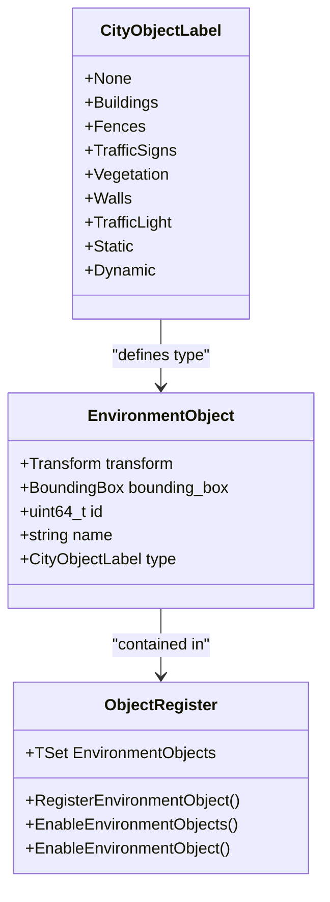
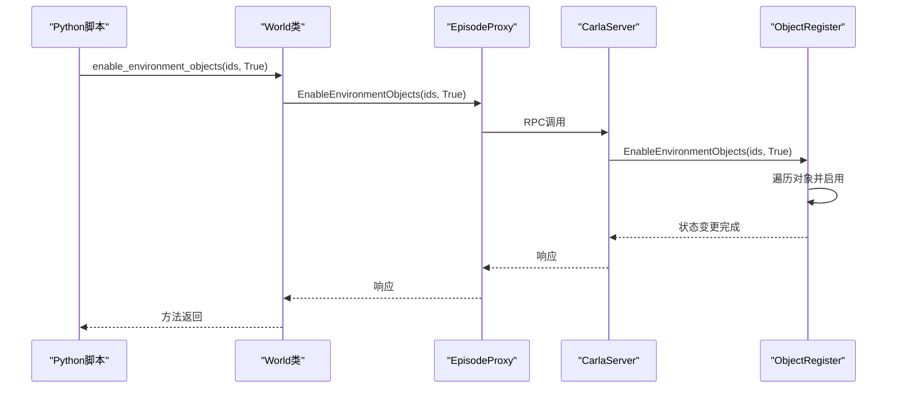
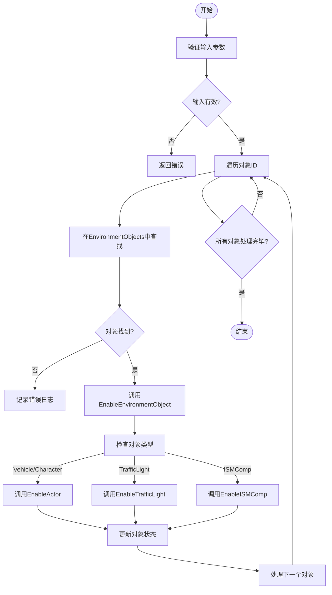
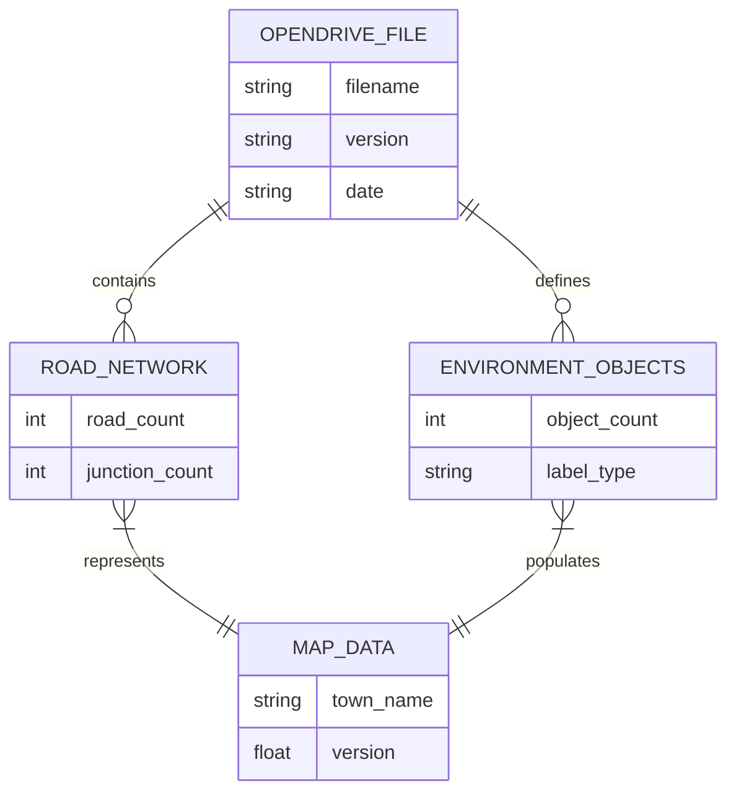
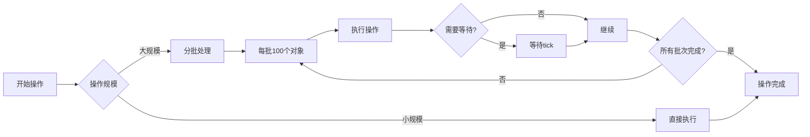

# 环境对象管理

> **引用文件**
> **本文档中引用的文件**

- [World.cpp](https://github.com/carla-simulator/carla/blob/ue5-dev/LibCarla/source/carla/client/World.cpp)
- [World.h](https://github.com/carla-simulator/carla/blob/ue5-dev/LibCarla/source/carla/client/World.h)
- [ObjectRegister.cpp](https://github.com/carla-simulator/carla/blob/ue5-dev/Unreal/CarlaUnreal/Plugins/Carla/Source/Carla/Util/ObjectRegister.cpp)
- [EnvironmentObject.h](https://github.com/carla-simulator/carla/blob/ue5-dev/LibCarla/source/carla/rpc/EnvironmentObject.h)
- [manage_environment_objects.py](https://github.com/carla-simulator/carla/blob/ue5-dev/PythonAPI/util/manage_environment_objects.py)
- [carla.World.enable_environment_objects.py](https://github.com/carla-simulator/carla/blob/ue5-dev/PythonAPI/docs/snipets/carla.World.enable_environment_objects.py)

## 目录

1. [简介](#简介)
2. [环境对象概念](#环境对象概念)
3. [World 类与环境对象管理](#world类与环境对象管理)
4. [核心方法分析](#核心方法分析)
5. [实际应用示例](#实际应用示例)
6. [OpenDRIVE 与地图数据关联](#opendrive与地图数据关联)
7. [性能优化与内存管理](#性能优化与内存管理)
8. [总结](#总结)

## 简介

CARLA 模拟器提供了一套完整的环境对象管理系统，允许用户动态控制静态环境元素的可见性和状态。本文档详细介绍了 World 类如何通过`enable_environment_objects`和`disable_environment_objects`方法管理环境对象，以及这些功能在动态场景构建中的应用。

**Section sources**

- <a href="https://github.com/carla-simulator/carla/blob/ue5-dev/LibCarla/source/carla/client/World.cpp#L238-L242" target="_blank">World.cpp</a>
- <a href="https://github.com/carla-simulator/carla/blob/ue5-dev/LibCarla/source/carla/client/World.h#L179-L181" target="_blank">World.h</a>

## 环境对象概念

环境对象是指在 CARLA 模拟环境中可被识别和管理的静态元素，包括建筑物、交通标志、路灯、植被等。每个环境对象都有唯一的标识符（ID）、名称、变换矩阵、边界框和类型标签。

环境对象通过`CityObjectLabel`枚举进行分类，主要类别包括：

- 建筑物 (Buildings)
- 围栏 (Fences)
- 交通标志 (TrafficSigns)
- 植被 (Vegetation)
- 墙壁 (Walls)
- 交通灯 (TrafficLight)

这些对象在地图加载时被注册到`ObjectRegister`系统中，通过哈希算法生成唯一 ID，确保跨会话的一致性。



**Diagram sources **

- <a href="https://github.com/carla-simulator/carla/blob/ue5-dev/LibCarla/source/carla/rpc/EnvironmentObject.h#L20-L40" target="_blank">EnvironmentObject.h</a>
- <a href="https://github.com/carla-simulator/carla/blob/ue5-dev/Unreal/CarlaUnreal/Plugins/Carla/Source/Carla/Util/ObjectRegister.cpp#L108-L126" target="_blank">ObjectRegister.cpp</a>

## World 类与环境对象管理

World 类是 CARLA 环境中所有对象的管理中心，负责协调环境对象的状态变更。它通过 RPC（远程过程调用）机制与底层模拟器通信，实现对环境对象的控制。

World 类提供了两个核心方法来管理环境对象：

- `enable_environment_objects(env_objects_ids, enable)`：启用或禁用指定 ID 的环境对象
- `get_environment_objects(object_type)`：根据类型标签获取环境对象列表

这些方法通过`EpisodeProxy`与模拟器后端通信，确保状态变更的同步性和一致性。



**Diagram sources **

- <a href="https://github.com/carla-simulator/carla/blob/ue5-dev/LibCarla/source/carla/client/World.cpp#L238-L242" target="_blank">World.cpp</a>
- <a href="https://github.com/carla-simulator/carla/blob/ue5-dev/Unreal/CarlaUnreal/Plugins/Carla/Source/Carla/Util/ObjectRegister.cpp#L108-L126" target="_blank">ObjectRegister.cpp</a>

**Section sources**

- <a href="https://github.com/carla-simulator/carla/blob/ue5-dev/LibCarla/source/carla/client/World.cpp#L238-L242" target="_blank">World.cpp</a>
- <a href="https://github.com/carla-simulator/carla/blob/ue5-dev/LibCarla/source/carla/client/World.h#L179-L181" target="_blank">World.h</a>

## 核心方法分析

### enable_environment_objects 方法

`enable_environment_objects`方法是环境对象管理的核心，它接收一个对象 ID 列表和一个布尔值，用于批量启用或禁用环境对象。

该方法的工作流程如下：

1. 接收对象 ID 集合和启用/禁用标志
2. 遍历 ID 集合，在环境对象列表中查找匹配的对象
3. 对每个找到的对象调用`EnableEnvironmentObject`进行状态变更
4. 如果对象未找到，记录错误日志



**Diagram sources **

- <a href="https://github.com/carla-simulator/carla/blob/ue5-dev/Unreal/CarlaUnreal/Plugins/Carla/Source/Carla/Util/ObjectRegister.cpp#L108-L126" target="_blank">ObjectRegister.cpp</a>
- <a href="https://github.com/carla-simulator/carla/blob/ue5-dev/Unreal/CarlaUnreal/Plugins/Carla/Source/Carla/Util/ObjectRegister.cpp#L351-L372" target="_blank">ObjectRegister.cpp</a>

**Section sources**

- <a href="https://github.com/carla-simulator/carla/blob/ue5-dev/Unreal/CarlaUnreal/Plugins/Carla/Source/Carla/Util/ObjectRegister.cpp#L108-L126" target="_blank">ObjectRegister.cpp</a>

### 对象状态控制机制

不同类型的环境对象有不同的状态控制机制：

#### Actor 类型对象

对于车辆、角色等 Actor 类型对象，状态控制包括：

- `SetActorHiddenInGame(!Enable)`：设置对象的可见性
- `SetActorEnableCollision(Enable)`：启用或禁用碰撞检测
- `SetActorTickEnabled(Enable)`：控制对象是否接收 tick 事件

#### 交通灯对象

交通灯由多个静态网格组件组成，需要特殊处理：

- 查找与对象 ID 关联的所有静态网格组件
- 逐个设置每个组件的隐藏状态和碰撞属性
- 使用查询和物理碰撞或无碰撞模式

#### ISM 组件

实例化静态网格（ISM）组件的处理方式：

- 通过 ObjectIdToComp 映射查找相关组件
- 保存实例变换信息
- 统一管理大批量相似对象

**Section sources**

- <a href="https://github.com/carla-simulator/carla/blob/ue5-dev/Unreal/CarlaUnreal/Plugins/Carla/Source/Carla/Util/ObjectRegister.cpp#L376-L413" target="_blank">ObjectRegister.cpp</a>

## 实际应用示例

### 动态场景构建

环境对象管理功能在测试场景构建中具有重要应用价值。以下是一个典型的使用场景：

```python
# 获取世界对象
world = client.get_world()

# 获取所有建筑物环境对象
buildings = world.get_environment_objects(carla.CityObjectLabel.Buildings)

# 选择特定建筑物进行操作
target_buildings = [buildings[0], buildings[1]]
building_ids = [obj.id for obj in target_buildings]

# 禁用建筑物（创建开放空间测试场景）
world.enable_environment_objects(building_ids, False)

# 执行测试...
# 重新启用建筑物
world.enable_environment_objects(building_ids, True)
```

**Section sources**

- <a href="https://github.com/carla-simulator/carla/blob/ue5-dev/PythonAPI/util/manage_environment_objects.py#L138-L141" target="_blank">manage_environment_objects.py</a>
- <a href="https://github.com/carla-simulator/carla/blob/ue5-dev/PythonAPI/docs/snipets/carla.World.enable_environment_objects.py#L12-L15" target="_blank">carla.World.enable_environment_objects.py</a>

### 批量操作与查询

环境对象系统支持高效的批量操作和查询：

```python
# 查询特定标签的所有对象
traffic_signs = world.get_environment_objects(carla.CityObjectLabel.TrafficSigns)
print(f"找到 {len(traffic_signs)} 个交通标志")

# 批量禁用所有交通标志
sign_ids = [sign.id for sign in traffic_signs]
world.enable_environment_objects(sign_ids, False)

# 按ID精确控制单个对象
specific_sign = next((s for s in traffic_signs if s.name == "StopSign_01"), None)
if specific_sign:
    world.enable_environment_objects([specific_sign.id], True)
```

这种机制使得创建复杂的测试场景变得简单高效，可以快速切换不同的环境配置。

**Section sources**

- <a href="https://github.com/carla-simulator/carla/blob/ue5-dev/PythonAPI/util/manage_environment_objects.py#L117-L141" target="_blank">manage_environment_objects.py</a>

## OpenDRIVE 与地图数据关联

CARLA 的环境对象管理与 OpenDRIVE 地图数据紧密关联。OpenDRIVE 文件定义了道路网络、交通标志、交通灯等静态元素的位置和属性。

### 对象注册机制

当加载地图时，CARLA 通过以下流程注册环境对象：

1. 解析 OpenDRIVE 文件，提取道路、标志、信号等元素
2. 在虚幻引擎中创建对应的 Actor
3. 通过`ObjectRegister`系统注册为环境对象
4. 生成唯一 ID 并建立类型标签

### 标签系统

环境对象使用`CityObjectLabel`枚举进行分类，该系统与 OpenDRIVE 元素类型对应：

| OpenDRIVE 元素                | CityObjectLabel |
| ----------------------------- | --------------- |
| <road>                        | Roads           |
| <object> with type="building" | Buildings       |
| <signal> with type="1000"     | TrafficSigns    |
| <signal> with type="205"      | TrafficLight    |
| <object> with type="tree"     | Vegetation      |

这种映射关系确保了地图数据与可管理对象的一致性。



**Diagram sources **

- <a href="https://github.com/carla-simulator/carla/blob/ue5-dev/Unreal/CarlaUnreal/Plugins/Carla/Source/Carla/Util/ObjectRegister.cpp#L130-L149" target="_blank">ObjectRegister.cpp</a>
- <a href="https://github.com/carla-simulator/carla/blob/ue5-dev/LibCarla/source/carla/road/SignalType.h#L14-L37" target="_blank">SignalType.h</a>

**Section sources**

- <a href="https://github.com/carla-simulator/carla/blob/ue5-dev/Unreal/CarlaUnreal/Plugins/Carla/Source/Carla/Util/ObjectRegister.cpp#L130-L149" target="_blank">ObjectRegister.cpp</a>

## 性能优化与内存管理

### 大规模操作优化

对于大规模环境对象操作，CARLA 提供了以下优化策略：

1. **批量处理**：使用集合操作而非逐个处理
2. **ID 缓存**：缓存常用对象 ID，避免重复查询
3. **异步执行**：在非关键路径上执行耗时操作

```python
# 优化的批量操作示例
class EnvironmentManager:
    def __init__(self, world):
        self.world = world
        self._object_cache = {}

    def get_objects_by_label(self, label):
        """带缓存的对象查询"""
        if label not in self._object_cache:
            self._object_cache[label] = self.world.get_environment_objects(label)
        return self._object_cache[label]

    def toggle_objects(self, label, enable):
        """优化的批量切换"""
        objects = self.get_objects_by_label(label)
        if objects:
            ids = [obj.id for obj in objects]
            self.world.enable_environment_objects(ids, enable)
```

### 内存管理注意事项

1. **对象生命周期**：环境对象在地图加载时创建，在地图卸载时销毁
2. **引用管理**：避免持有已销毁对象的引用
3. **资源释放**：及时清理不再需要的对象引用

### 最佳实践

1. **预获取 ID**：在场景初始化时获取并缓存对象 ID
2. **分批操作**：将大规模操作分解为小批次
3. **错误处理**：检查对象是否存在再进行操作
4. **状态同步**：在关键操作后确保状态同步



**Diagram sources **

- <a href="https://github.com/carla-simulator/carla/blob/ue5-dev/LibCarla/source/carla/client/World.cpp#L238-L242" target="_blank">World.cpp</a>
- <a href="https://github.com/carla-simulator/carla/blob/ue5-dev/Unreal/CarlaUnreal/Plugins/Carla/Source/Carla/Util/ObjectRegister.cpp#L108-L126" target="_blank">ObjectRegister.cpp</a>

**Section sources**

- <a href="https://github.com/carla-simulator/carla/blob/ue5-dev/PythonAPI/util/manage_environment_objects.py#L85-L141" target="_blank">manage_environment_objects.py</a>

## 总结

CARLA 的环境对象管理系统提供了一套强大而灵活的工具，用于动态控制模拟环境中的静态元素。通过 World 类的`enable_environment_objects`和`get_environment_objects`方法，用户可以精确管理建筑物、交通标志、路灯等环境对象的状态。

该系统的关键特性包括：

- 基于唯一 ID 的对象识别
- 支持批量操作的高效接口
- 与 OpenDRIVE 地图数据的紧密集成
- 针对不同类型对象的专门处理机制

在实际应用中，这些功能使得创建多样化的测试场景成为可能，从简单的对象显隐控制到复杂的动态环境重构。通过合理的性能优化和内存管理，可以在大规模场景中高效使用这些功能。

**Section sources**

- <a href="https://github.com/carla-simulator/carla/blob/ue5-dev/LibCarla/source/carla/client/World.cpp#L238-L242" target="_blank">World.cpp</a>
- <a href="https://github.com/carla-simulator/carla/blob/ue5-dev/Unreal/CarlaUnreal/Plugins/Carla/Source/Carla/Util/ObjectRegister.cpp#L108-L126" target="_blank">ObjectRegister.cpp</a>
- <a href="https://github.com/carla-simulator/carla/blob/ue5-dev/PythonAPI/util/manage_environment_objects.py#L85-L141" target="_blank">manage_environment_objects.py</a>
