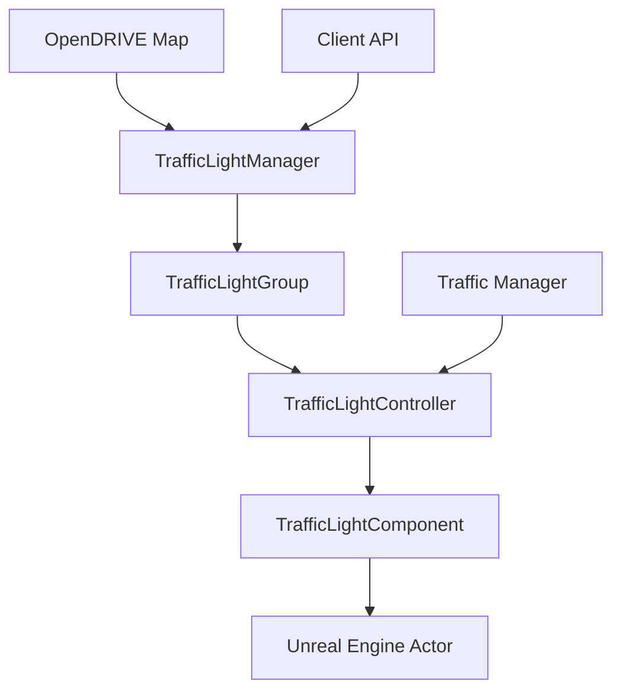
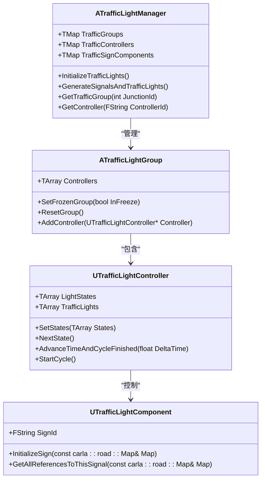
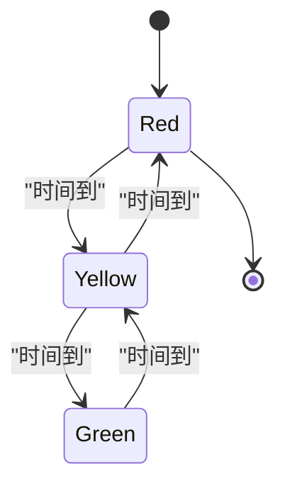
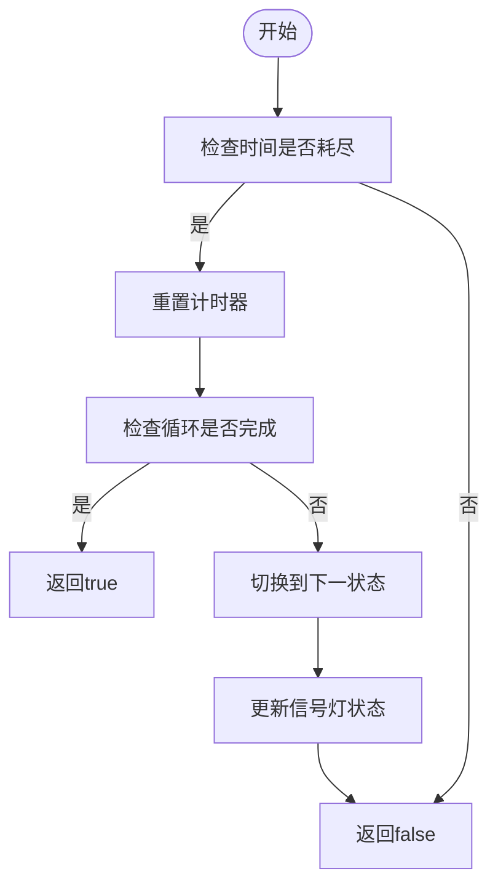
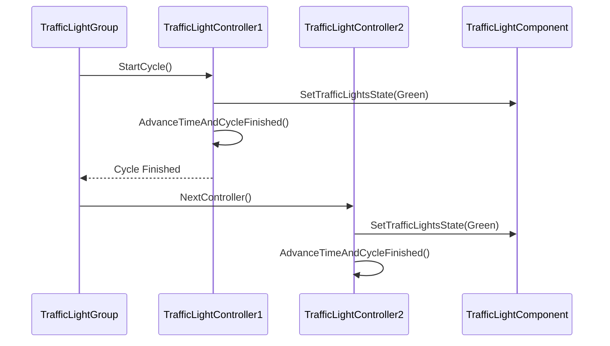
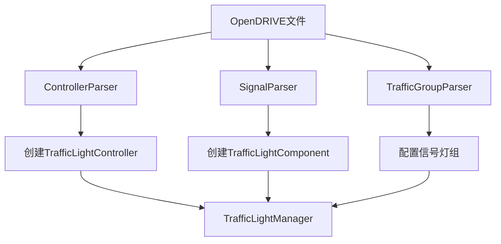

# 交通信号灯协调


**本文档中引用的文件**  
- [TrafficLightManager.h](https://github.com/carla-simulator/carla/blob/ue5-dev/Unreal/CarlaUnreal/Plugins/Carla/Source/Carla/Traffic/TrafficLightManager.h)
- [TrafficLightController.h](https://github.com/carla-simulator/carla/blob/ue5-dev/Unreal/CarlaUnreal/Plugins/Carla/Source/Carla/Traffic/TrafficLightController.h)
- [TrafficLightGroup.h](https://github.com/carla-simulator/carla/blob/ue5-dev/Unreal/CarlaUnreal/Plugins/Carla/Source/Carla/Traffic/TrafficLightGroup.h)
- [TrafficLightState.h](https://github.com/carla-simulator/carla/blob/ue5-dev/Unreal/CarlaUnreal/Plugins/Carla/Source/Carla/Traffic/TrafficLightState.h)
- [TrafficLight.cpp](https://github.com/carla-simulator/carla/blob/ue5-dev/LibCarla/source/carla/client/TrafficLight.cpp)
- [TrafficLightStage.cpp](https://github.com/carla-simulator/carla/blob/ue5-dev/LibCarla/source/carla/trafficmanager/TrafficLightStage.cpp)
- [ControllerParser.cpp](https://github.com/carla-simulator/carla/blob/ue5-dev/LibCarla/source/carla/opendrive/parser/ControllerParser.cpp)
- [SignalParser.cpp](https://github.com/carla-simulator/carla/blob/ue5-dev/LibCarla/source/carla/opendrive/parser/SignalParser.cpp)
- [TrafficLightStage.h](https://github.com/carla-simulator/carla/blob/ue5-dev/LibCarla/source/carla/trafficmanager/TrafficLightStage.h)
- [manage_traffic_light.py](https://github.com/carla-simulator/carla/blob/ue5-dev/PythonAPI/util/manage_traffic_light.py)


## 目录
1. [引言](#引言)
2. [交通信号灯系统架构](#交通信号灯系统架构)
3. [核心组件分析](#核心组件分析)
4. [信号灯状态机与控制逻辑](#信号灯状态机与控制逻辑)
5. [交通信号灯组与交叉路口协调](#交通信号灯组与交叉路口协调)
6. [API使用示例](#api使用示例)
7. [时序控制与同步机制](#时序控制与同步机制)
8. [OpenDRIVE地图数据集成](#opendrive地图数据集成)
9. [性能优化与大规模场景管理](#性能优化与大规模场景管理)
10. [故障排除指南](#故障排除指南)

## 引言
CARLA模拟器中的交通信号灯协调系统是一个复杂的分布式控制系统，负责管理虚拟城市环境中所有交通信号灯的状态同步和相位切换。该系统通过TrafficLightManager、TrafficLightController和TrafficLightGroup等核心组件，实现了对交通信号灯的精确控制。系统支持固定时间控制、自适应控制和手动控制等多种模式，能够模拟真实世界中的交通信号灯行为。通过OpenDRIVE地图数据，系统可以自动配置信号灯逻辑，实现与道路网络的无缝集成。本文档将深入探讨CARLA交通信号灯系统的内部工作原理，为开发者提供全面的技术参考。

## 交通信号灯系统架构
CARLA的交通信号灯系统采用分层架构设计，由多个协同工作的组件构成。系统的核心是TrafficLightManager，它负责创建和管理所有的交通信号灯组件。TrafficLightManager通过解析OpenDRIVE地图数据，自动识别和配置交通信号灯，并将其组织成逻辑组。每个交通信号灯组由一个或多个TrafficLightController管理，这些控制器定义了信号灯的相位切换逻辑。实际的信号灯状态由TrafficLightComponent表示，它们与Unreal Engine中的3D模型关联，负责渲染和物理交互。



**图示来源**
- [TrafficLightManager.h](https://github.com/carla-simulator/carla/blob/ue5-dev/Unreal/CarlaUnreal/Plugins/Carla/Source/Carla/Traffic/TrafficLightManager.h)
- [TrafficLightController.h](https://github.com/carla-simulator/carla/blob/ue5-dev/Unreal/CarlaUnreal/Plugins/Carla/Source/Carla/Traffic/TrafficLightController.h)
- [TrafficLightGroup.h](https://github.com/carla-simulator/carla/blob/ue5-dev/Unreal/CarlaUnreal/Plugins/Carla/Source/Carla/Traffic/TrafficLightGroup.h)

**本节来源**
- [TrafficLightManager.h](https://github.com/carla-simulator/carla/blob/ue5-dev/Unreal/CarlaUnreal/Plugins/Carla/Source/Carla/Traffic/TrafficLightManager.h)
- [TrafficLightController.h](https://github.com/carla-simulator/carla/blob/ue5-dev/Unreal/CarlaUnreal/Plugins/Carla/Source/Carla/Traffic/TrafficLightController.h)

## 核心组件分析
CARLA交通信号灯系统的核心组件包括TrafficLightManager、TrafficLightController、TrafficLightGroup和TrafficLightComponent。这些组件通过紧密协作，实现了对交通信号灯的全面控制。

### TrafficLightManager分析
TrafficLightManager是整个交通信号灯系统的中枢，负责协调所有其他组件。它通过解析OpenDRIVE地图数据，自动识别和配置交通信号灯。Manager维护着三个主要的映射表：TrafficGroups（交叉路口映射）、TrafficControllers（控制器映射）和TrafficSignComponents（信号组件映射）。这些映射表使得系统能够快速查找和访问特定的交通信号灯组件。



**图示来源**
- [TrafficLightManager.h](https://github.com/carla-simulator/carla/blob/ue5-dev/Unreal/CarlaUnreal/Plugins/Carla/Source/Carla/Traffic/TrafficLightManager.h)
- [TrafficLightGroup.h](https://github.com/carla-simulator/carla/blob/ue5-dev/Unreal/CarlaUnreal/Plugins/Carla/Source/Carla/Traffic/TrafficLightGroup.h)
- [TrafficLightController.h](https://github.com/carla-simulator/carla/blob/ue5-dev/Unreal/CarlaUnreal/Plugins/Carla/Source/Carla/Traffic/TrafficLightController.h)
- [TrafficLightComponent.cpp](https://github.com/carla-simulator/carla/blob/ue5-dev/Unreal/CarlaUnreal/Plugins/Carla/Source/Carla/Traffic/TrafficLightComponent.cpp)

**本节来源**
- [TrafficLightManager.h](https://github.com/carla-simulator/carla/blob/ue5-dev/Unreal/CarlaUnreal/Plugins/Carla/Source/Carla/Traffic/TrafficLightManager.h)
- [TrafficLightGroup.h](https://github.com/carla-simulator/carla/blob/ue5-dev/Unreal/CarlaUnreal/Plugins/Carla/Source/Carla/Traffic/TrafficLightGroup.h)
- [TrafficLightController.h](https://github.com/carla-simulator/carla/blob/ue5-dev/Unreal/CarlaUnreal/Plugins/Carla/Source/Carla/Traffic/TrafficLightController.h)

## 信号灯状态机与控制逻辑
CARLA的交通信号灯系统基于状态机模型实现，每个信号灯控制器维护一个状态序列，定义了信号灯的相位切换逻辑。系统支持多种控制模式，包括固定时间控制、自适应控制和手动控制。

### 状态机实现
信号灯状态机由FTrafficLightStage结构体定义，每个阶段包含一个状态（红、黄、绿或关）和持续时间。控制器按照预定义的顺序循环执行这些阶段，实现信号灯的周期性切换。



**图示来源**
- [TrafficLightController.h](https://github.com/carla-simulator/carla/blob/ue5-dev/Unreal/CarlaUnreal/Plugins/Carla/Source/Carla/Traffic/TrafficLightController.h)
- [TrafficLightState.h](https://github.com/carla-simulator/carla/blob/ue5-dev/Unreal/CarlaUnreal/Plugins/Carla/Source/Carla/Traffic/TrafficLightState.h)

### 控制逻辑分析
TrafficLightController的控制逻辑主要由AdvanceTimeAndCycleFinished方法实现。该方法在每个时间步进中更新控制器的计时器，当当前阶段的时间耗尽时，切换到下一个阶段。



**图示来源**
- [TrafficLightController.cpp](https://github.com/carla-simulator/carla/blob/ue5-dev/Unreal/CarlaUnreal/Plugins/Carla/Source/Carla/Traffic/TrafficLightController.cpp)

**本节来源**
- [TrafficLightController.h](https://github.com/carla-simulator/carla/blob/ue5-dev/Unreal/CarlaUnreal/Plugins/Carla/Source/Carla/Traffic/TrafficLightController.h)
- [TrafficLightController.cpp](https://github.com/carla-simulator/carla/blob/ue5-dev/Unreal/CarlaUnreal/Plugins/Carla/Source/Carla/Traffic/TrafficLightController.cpp)
- [TrafficLightState.h](https://github.com/carla-simulator/carla/blob/ue5-dev/Unreal/CarlaUnreal/Plugins/Carla/Source/Carla/Traffic/TrafficLightState.h)

## 交通信号灯组与交叉路口协调
交通信号灯组（TrafficLightGroup）是CARLA中实现交叉路口协调的关键概念。每个组代表一个逻辑上的交叉路口，包含一个或多个TrafficLightController，这些控制器协同工作，确保交叉路口的交通流畅和安全。

### 交叉路口协调机制
TrafficLightGroup通过维护一个控制器序列，实现对交叉路口的协调控制。当一个控制器完成其周期时，组会自动切换到下一个控制器，确保不同方向的交通流有序交替。



**图示来源**
- [TrafficLightGroup.cpp](https://github.com/carla-simulator/carla/blob/ue5-dev/Unreal/CarlaUnreal/Plugins/Carla/Source/Carla/Traffic/TrafficLightGroup.cpp)
- [TrafficLightController.cpp](https://github.com/carla-simulator/carla/blob/ue5-dev/Unreal/CarlaUnreal/Plugins/Carla/Source/Carla/Traffic/TrafficLightController.cpp)

### 组管理功能
TrafficLightGroup提供了多种管理功能，包括冻结组状态、重置组状态和添加控制器。这些功能使得开发者能够灵活地控制交叉路口的行为。

**本节来源**
- [TrafficLightGroup.h](https://github.com/carla-simulator/carla/blob/ue5-dev/Unreal/CarlaUnreal/Plugins/Carla/Source/Carla/Traffic/TrafficLightGroup.h)
- [TrafficLightGroup.cpp](https://github.com/carla-simulator/carla/blob/ue5-dev/Unreal/CarlaUnreal/Plugins/Carla/Source/Carla/Traffic/TrafficLightGroup.cpp)

## API使用示例
CARLA提供了丰富的API，允许开发者通过客户端代码与交通信号灯系统交互。以下是一些常见的使用示例。

### 获取信号灯状态
通过TrafficLight类的API，可以获取信号灯的当前状态和计时信息。

```mermaid
flowchart TD
A[客户端] --> B[调用GetState()]
B --> C[获取当前状态]
C --> D[返回状态值]
A --> E[调用GetGreenTime()]
E --> F[获取绿灯时间]
F --> G[返回时间值]
```

### 设置信号灯相位
开发者可以通过API手动设置信号灯的相位和计时参数。

```mermaid
flowchart TD
A[客户端] --> B[调用SetState()]
B --> C[设置新状态]
C --> D[更新信号灯]
D --> E[返回成功]
A --> F[调用SetGreenTime()]
F --> G[设置绿灯时间]
G --> H[更新控制器]
H --> I[返回成功]
```

**图示来源**
- [TrafficLight.cpp](https://github.com/carla-simulator/carla/blob/ue5-dev/LibCarla/source/carla/client/TrafficLight.cpp)

**本节来源**
- [TrafficLight.cpp](https://github.com/carla-simulator/carla/blob/ue5-dev/LibCarla/source/carla/client/TrafficLight.cpp)
- [manage_traffic_light.py](https://github.com/carla-simulator/carla/blob/ue5-dev/PythonAPI/util/manage_traffic_light.py)

## 时序控制与同步机制
CARLA的交通信号灯系统采用精确的时序控制机制，确保信号灯状态切换的准确性和一致性。系统通过Delta时间步进和周期性检查，实现了对信号灯状态的精确管理。

### 时间步进机制
系统在每个时间步进中调用AdvanceTimeAndCycleFinished方法，更新控制器的计时器。当计时器超过当前阶段的持续时间时，切换到下一个阶段。

```mermaid
flowchart TD
A[开始] --> B[增加ElapsedTime]
B --> C[比较ElapsedTime和CurrentState.Time]
C --> |大于| D[重置ElapsedTime]
D --> E[检查循环是否完成]
E --> |是| F[返回true]
E --> |否| G[调用NextState()]
G --> H[返回false]
C --> |小于| H
```

**图示来源**
- [TrafficLightController.cpp](https://github.com/carla-simulator/carla/blob/ue5-dev/Unreal/CarlaUnreal/Plugins/Carla/Source/Carla/Traffic/TrafficLightController.cpp)

### 同步机制
在同步模式下，交通信号灯的状态更新与仿真步进同步，确保所有组件的状态一致性。

**本节来源**
- [TrafficLightController.cpp](https://github.com/carla-simulator/carla/blob/ue5-dev/Unreal/CarlaUnreal/Plugins/Carla/Source/Carla/Traffic/TrafficLightController.cpp)
- [TrafficLightStage.cpp](https://github.com/carla-simulator/carla/blob/ue5-dev/LibCarla/source/carla/trafficmanager/TrafficLightStage.cpp)

## OpenDRIVE地图数据集成
CARLA通过OpenDRIVE地图数据自动配置交通信号灯逻辑。系统解析OpenDRIVE文件中的controller、signal和trafficGroup元素，构建相应的信号灯控制结构。

### 数据解析流程
系统通过ControllerParser和SignalParser等解析器，从OpenDRIVE文件中提取信号灯配置信息。



**图示来源**
- [ControllerParser.cpp](https://github.com/carla-simulator/carla/blob/ue5-dev/LibCarla/source/carla/opendrive/parser/ControllerParser.cpp)
- [SignalParser.cpp](https://github.com/carla-simulator/carla/blob/ue5-dev/LibCarla/source/carla/opendrive/parser/SignalParser.cpp)
- [TrafficGroupParser.cpp](https://github.com/carla-simulator/carla/blob/ue5-dev/LibCarla/source/carla/opendrive/parser/TrafficGroupParser.cpp)

### 配置映射
OpenDRIVE中的controller元素映射到TrafficLightController，signal元素映射到TrafficLightComponent，trafficGroup元素提供信号灯组的配置参数。

**本节来源**
- [ControllerParser.cpp](https://github.com/carla-simulator/carla/blob/ue5-dev/LibCarla/source/carla/opendrive/parser/ControllerParser.cpp)
- [SignalParser.cpp](https://github.com/carla-simulator/carla/blob/ue5-dev/LibCarla/source/carla/opendrive/parser/SignalParser.cpp)
- [TrafficGroupParser.cpp](https://github.com/carla-simulator/carla/blob/ue5-dev/LibCarla/source/carla/opendrive/parser/TrafficGroupParser.cpp)

## 性能优化与大规模场景管理
在大规模场景中，交通信号灯系统的性能优化至关重要。CARLA通过多种机制确保系统在复杂环境中的高效运行。

### 优化策略
- **批量处理**：将多个信号灯状态更新操作批量处理，减少通信开销
- **空间分区**：根据地理位置对信号灯进行分区管理，提高查找效率
- **状态缓存**：缓存频繁访问的信号灯状态，减少重复计算

### 大规模场景管理
在包含数百个交叉路口的大型城市环境中，系统通过分层管理和异步更新机制，确保性能稳定。

**本节来源**
- [TrafficLightManager.h](https://github.com/carla-simulator/carla/blob/ue5-dev/Unreal/CarlaUnreal/Plugins/Carla/Source/Carla/Traffic/TrafficLightManager.h)
- [TrafficLightController.h](https://github.com/carla-simulator/carla/blob/ue5-dev/Unreal/CarlaUnreal/Plugins/Carla/Source/Carla/Traffic/TrafficLightController.h)

## 故障排除指南
在使用CARLA交通信号灯系统时，可能会遇到一些常见问题。以下是一些故障排除建议。

### 常见问题
- **信号灯不更新**：检查是否启用了同步模式，确保时间步进正常
- **状态不一致**：验证OpenDRIVE地图数据的完整性，确保信号灯配置正确
- **性能下降**：检查信号灯数量，考虑使用空间分区优化

**本节来源**
- [TrafficLightController.cpp](https://github.com/carla-simulator/carla/blob/ue5-dev/Unreal/CarlaUnreal/Plugins/Carla/Source/Carla/Traffic/TrafficLightController.cpp)
- [TrafficLightManager.cpp](https://github.com/carla-simulator/carla/blob/ue5-dev/Unreal/CarlaUnreal/Plugins/Carla/Source/Carla/Traffic/TrafficLightManager.cpp)