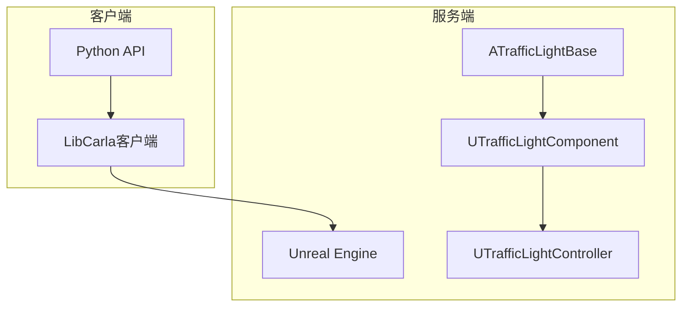
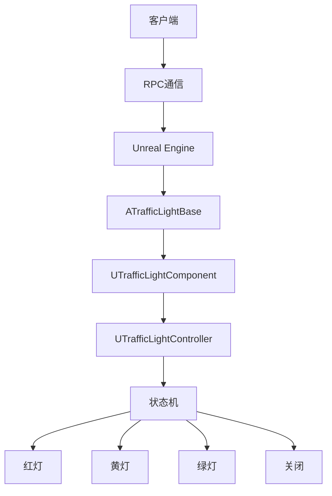
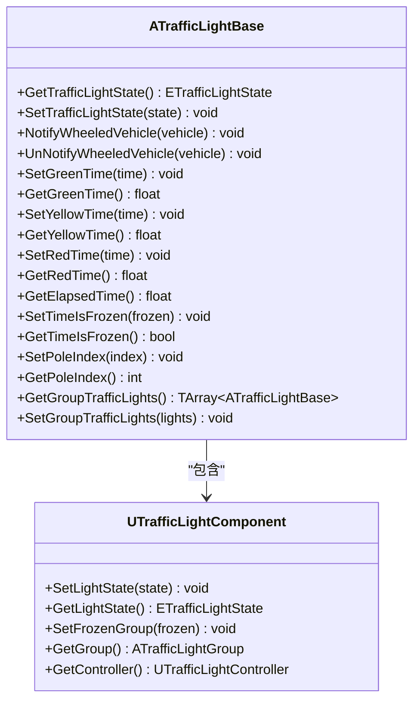
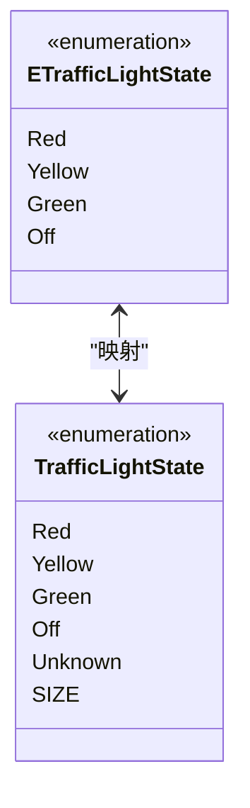
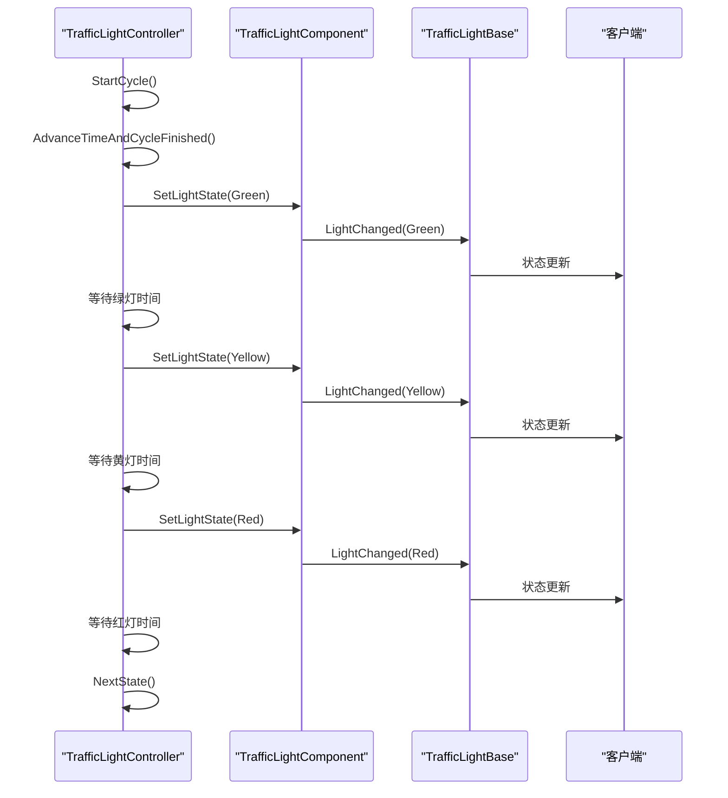
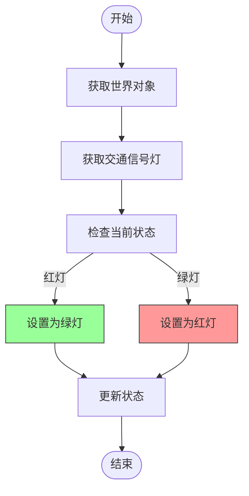
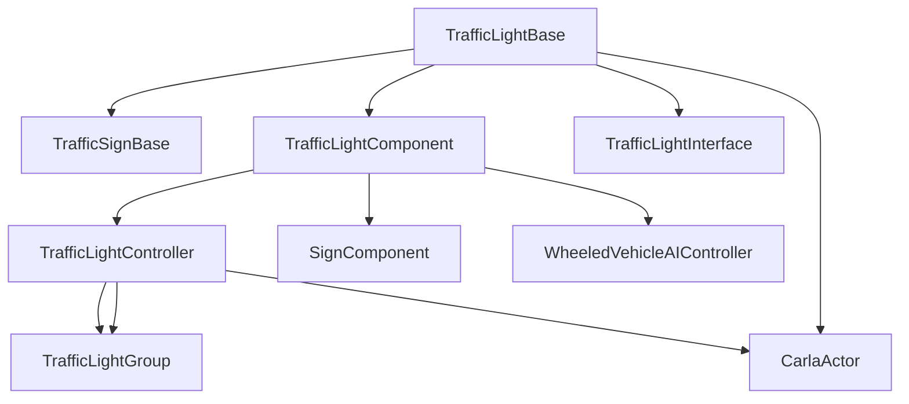

# 信号灯状态管理

**本文档中引用的文件**  
- [TrafficLightBase.h](https://github.com/carla-simulator/carla/blob/ue5-dev/Unreal/CarlaUnreal/Plugins/Carla/Source/Carla/Traffic/TrafficLightBase.h)
- [TrafficLightBase.cpp](https://github.com/carla-simulator/carla/blob/ue5-dev/Unreal/CarlaUnreal/Plugins/Carla/Source/Carla/Traffic/TrafficLightBase.cpp)
- [TrafficLightState.h](https://github.com/carla-simulator/carla/blob/ue5-dev/Unreal/CarlaUnreal/Plugins/Carla/Source/Carla/Traffic/TrafficLightState.h)
- [TrafficLightController.h](https://github.com/carla-simulator/carla/blob/ue5-dev/Unreal/CarlaUnreal/Plugins/Carla/Source/Carla/Traffic/TrafficLightController.h)
- [TrafficLightController.cpp](https://github.com/carla-simulator/carla/blob/ue5-dev/Unreal/CarlaUnreal/Plugins/Carla/Source/Carla/Traffic/TrafficLightController.cpp)
- [TrafficLightComponent.h](https://github.com/carla-simulator/carla/blob/ue5-dev/Unreal/CarlaUnreal/Plugins/Carla/Source/Carla/Traffic/TrafficLightComponent.h)
- [TrafficLightInterface.h](https://github.com/carla-simulator/carla/blob/ue5-dev/Unreal/CarlaUnreal/Plugins/Carla/Source/Carla/Traffic/TrafficLightInterface.h)
- [TrafficLight.h](https://github.com/carla-simulator/carla/blob/ue5-dev/LibCarla/source/carla/client/TrafficLight.h)
- [TrafficLight.cpp](https://github.com/carla-simulator/carla/blob/ue5-dev/LibCarla/source/carla/client/TrafficLight.cpp)
- [TrafficLightStage.h](https://github.com/carla-simulator/carla/blob/ue5-dev/LibCarla/source/carla/trafficmanager/TrafficLightStage.h)
- [TrafficLightStage.cpp](https://github.com/carla-simulator/carla/blob/ue5-dev/LibCarla/source/carla/trafficmanager/TrafficLightStage.cpp)
- [TrafficLightState.h](https://github.com/carla-simulator/carla/blob/ue5-dev/LibCarla/source/carla/rpc/TrafficLightState.h)
- [manage_traffic_light.py](https://github.com/carla-simulator/carla/blob/ue5-dev/PythonAPI/util/manage_traffic_light.py)
- [carla.TrafficLight.set_state.py](https://github.com/carla-simulator/carla/blob/ue5-dev/PythonAPI/docs/snipets/carla.TrafficLight.set_state.py)

## 目录
1. [引言](#引言)
2. [项目结构](#项目结构)
3. [核心组件](#核心组件)
4. [架构概述](#架构概述)
5. [详细组件分析](#详细组件分析)
6. [依赖分析](#依赖分析)
7. [性能考虑](#性能考虑)
8. [故障排除指南](#故障排除指南)
9. [结论](#结论)

## 引言
本文档详细介绍了CARLA模拟器中交通信号灯状态管理的实现机制。文档深入解释了TrafficLightBase类如何实现信号灯的状态机，包括红、黄、绿、左转等不同状态的定义和转换逻辑。同时描述了TrafficLightState枚举类型及其在客户端和服务端之间的同步机制，详细说明了状态转换的时序控制，包括状态持续时间、过渡动画和同步点。为初学者解释了信号灯状态机的基本概念，同时为高级开发者提供了状态一致性维护和异常处理策略。

## 项目结构
CARLA交通信号灯系统采用分层架构设计，主要包含客户端、服务端和Python API三个部分。系统通过Unreal Engine的Actor组件系统实现信号灯的可视化和物理交互，同时通过RPC协议在客户端和服务端之间同步状态信息。

**图示来源**
- [TrafficLightBase.h](https://github.com/carla-simulator/carla/blob/ue5-dev/Unreal/CarlaUnreal/Plugins/Carla/Source/Carla/Traffic/TrafficLightBase.h)
- [TrafficLightComponent.h](https://github.com/carla-simulator/carla/blob/ue5-dev/Unreal/CarlaUnreal/Plugins/Carla/Source/Carla/Traffic/TrafficLightComponent.h)
- [TrafficLightController.h](https://github.com/carla-simulator/carla/blob/ue5-dev/Unreal/CarlaUnreal/Plugins/Carla/Source/Carla/Traffic/TrafficLightController.h)

**章节来源**
- [TrafficLightBase.h](https://github.com/carla-simulator/carla/blob/ue5-dev/Unreal/CarlaUnreal/Plugins/Carla/Source/Carla/Traffic/TrafficLightBase.h)
- [TrafficLightController.h](https://github.com/carla-simulator/carla/blob/ue5-dev/Unreal/CarlaUnreal/Plugins/Carla/Source/Carla/Traffic/TrafficLightController.h)

## 核心组件
CARLA交通信号灯系统的核心组件包括TrafficLightBase、TrafficLightComponent和TrafficLightController三个主要类。TrafficLightBase作为信号灯的基类，继承自ATrafficSignBase，负责管理信号灯的基本状态和与车辆的交互。TrafficLightComponent是信号灯的具体实现组件，处理信号灯的视觉表现和触发区域。TrafficLightController则负责管理信号灯的状态转换逻辑和时序控制。

**章节来源**
- [TrafficLightBase.h](https://github.com/carla-simulator/carla/blob/ue5-dev/Unreal/CarlaUnreal/Plugins/Carla/Source/Carla/Traffic/TrafficLightBase.h)
- [TrafficLightComponent.h](https://github.com/carla-simulator/carla/blob/ue5-dev/Unreal/CarlaUnreal/Plugins/Carla/Source/Carla/Traffic/TrafficLightComponent.h)
- [TrafficLightController.h](https://github.com/carla-simulator/carla/blob/ue5-dev/Unreal/CarlaUnreal/Plugins/Carla/Source/Carla/Traffic/TrafficLightController.h)

## 架构概述
CARLA交通信号灯系统的架构采用组件化设计，通过分层的方式实现信号灯的完整功能。系统从上到下分为三个层次：客户端API层、RPC通信层和Unreal Engine实现层。客户端API层提供Python和C++接口供用户调用，RPC通信层负责在客户端和服务端之间传输状态信息，Unreal Engine实现层则负责信号灯的具体行为和视觉表现。

**图示来源**
- [TrafficLightBase.h](https://github.com/carla-simulator/carla/blob/ue5-dev/Unreal/CarlaUnreal/Plugins/Carla/Source/Carla/Traffic/TrafficLightBase.h)
- [TrafficLightController.h](https://github.com/carla-simulator/carla/blob/ue5-dev/Unreal/CarlaUnreal/Plugins/Carla/Source/Carla/Traffic/TrafficLightController.h)
- [TrafficLightState.h](https://github.com/carla-simulator/carla/blob/ue5-dev/Unreal/CarlaUnreal/Plugins/Carla/Source/Carla/Traffic/TrafficLightState.h)

## 详细组件分析

### TrafficLightBase分析
TrafficLightBase类是CARLA中所有交通信号灯的基类，继承自ATrafficSignBase。该类负责管理信号灯的基本状态和与车辆的交互。当车辆进入信号灯的触发区域时，信号灯会通知车辆AI控制器当前的信号灯状态。

**图示来源**
- [TrafficLightBase.h](https://github.com/carla-simulator/carla/blob/ue5-dev/Unreal/CarlaUnreal/Plugins/Carla/Source/Carla/Traffic/TrafficLightBase.h)
- [TrafficLightComponent.h](https://github.com/carla-simulator/carla/blob/ue5-dev/Unreal/CarlaUnreal/Plugins/Carla/Source/Carla/Traffic/TrafficLightComponent.h)

**章节来源**
- [TrafficLightBase.h](https://github.com/carla-simulator/carla/blob/ue5-dev/Unreal/CarlaUnreal/Plugins/Carla/Source/Carla/Traffic/TrafficLightBase.h)
- [TrafficLightBase.cpp](https://github.com/carla-simulator/carla/blob/ue5-dev/Unreal/CarlaUnreal/Plugins/Carla/Source/Carla/Traffic/TrafficLightBase.cpp)

### TrafficLightState分析
TrafficLightState枚举类型定义了交通信号灯的所有可能状态，包括红灯、黄灯、绿灯和关闭状态。这个枚举在客户端和服务端之间保持一致，确保状态同步的准确性。

**图示来源**
- [TrafficLightState.h](https://github.com/carla-simulator/carla/blob/ue5-dev/Unreal/CarlaUnreal/Plugins/Carla/Source/Carla/Traffic/TrafficLightState.h)
- [TrafficLightState.h](https://github.com/carla-simulator/carla/blob/ue5-dev/LibCarla/source/carla/rpc/TrafficLightState.h)

**章节来源**
- [TrafficLightState.h](https://github.com/carla-simulator/carla/blob/ue5-dev/Unreal/CarlaUnreal/Plugins/Carla/Source/Carla/Traffic/TrafficLightState.h)
- [TrafficLightState.h](https://github.com/carla-simulator/carla/blob/ue5-dev/LibCarla/source/carla/rpc/TrafficLightState.h)

### TrafficLightController分析
TrafficLightController类负责管理信号灯的状态转换逻辑和时序控制。它通过FTrafficLightStage结构体定义信号灯的各个阶段，包括每个阶段的持续时间和目标状态。控制器按照预设的时间序列循环执行各个阶段，实现信号灯的自动切换。

**图示来源**
- [TrafficLightController.h](https://github.com/carla-simulator/carla/blob/ue5-dev/Unreal/CarlaUnreal/Plugins/Carla/Source/Carla/Traffic/TrafficLightController.h)
- [TrafficLightController.cpp](https://github.com/carla-simulator/carla/blob/ue5-dev/Unreal/CarlaUnreal/Plugins/Carla/Source/Carla/Traffic/TrafficLightController.cpp)
- [TrafficLightComponent.h](https://github.com/carla-simulator/carla/blob/ue5-dev/Unreal/CarlaUnreal/Plugins/Carla/Source/Carla/Traffic/TrafficLightComponent.h)

**章节来源**
- [TrafficLightController.h](https://github.com/carla-simulator/carla/blob/ue5-dev/Unreal/CarlaUnreal/Plugins/Carla/Source/Carla/Traffic/TrafficLightController.h)
- [TrafficLightController.cpp](https://github.com/carla-simulator/carla/blob/ue5-dev/Unreal/CarlaUnreal/Plugins/Carla/Source/Carla/Traffic/TrafficLightController.cpp)

### Python API分析
CARLA提供了丰富的Python API，使用户能够方便地查询和控制交通信号灯的状态。通过Python API，用户可以获取信号灯的当前状态、设置状态转换、调整各状态的持续时间等。

**图示来源**
- [TrafficLight.h](https://github.com/carla-simulator/carla/blob/ue5-dev/LibCarla/source/carla/client/TrafficLight.h)
- [TrafficLight.cpp](https://github.com/carla-simulator/carla/blob/ue5-dev/LibCarla/source/carla/client/TrafficLight.cpp)
- [carla.TrafficLight.set_state.py](https://github.com/carla-simulator/carla/blob/ue5-dev/PythonAPI/docs/snipets/carla.TrafficLight.set_state.py)

**章节来源**
- [TrafficLight.h](https://github.com/carla-simulator/carla/blob/ue5-dev/LibCarla/source/carla/client/TrafficLight.h)
- [TrafficLight.cpp](https://github.com/carla-simulator/carla/blob/ue5-dev/LibCarla/source/carla/client/TrafficLight.cpp)
- [carla.TrafficLight.set_state.py](https://github.com/carla-simulator/carla/blob/ue5-dev/PythonAPI/docs/snipets/carla.TrafficLight.set_state.py)

## 依赖分析
CARLA交通信号灯系统依赖于多个核心组件和模块。系统通过Unreal Engine的Actor组件系统实现信号灯的可视化和物理交互，通过RPC协议在客户端和服务端之间同步状态信息，通过TrafficManager模块协调多个信号灯的协同工作。

**图示来源**
- [TrafficLightBase.h](https://github.com/carla-simulator/carla/blob/ue5-dev/Unreal/CarlaUnreal/Plugins/Carla/Source/Carla/Traffic/TrafficLightBase.h)
- [TrafficLightComponent.h](https://github.com/carla-simulator/carla/blob/ue5-dev/Unreal/CarlaUnreal/Plugins/Carla/Source/Carla/Traffic/TrafficLightComponent.h)
- [TrafficLightController.h](https://github.com/carla-simulator/carla/blob/ue5-dev/Unreal/CarlaUnreal/Plugins/Carla/Source/Carla/Traffic/TrafficLightController.h)

**章节来源**
- [TrafficLightBase.h](https://github.com/carla-simulator/carla/blob/ue5-dev/Unreal/CarlaUnreal/Plugins/Carla/Source/Carla/Traffic/TrafficLightBase.h)
- [TrafficLightComponent.h](https://github.com/carla-simulator/carla/blob/ue5-dev/Unreal/CarlaUnreal/Plugins/Carla/Source/Carla/Traffic/TrafficLightComponent.h)
- [TrafficLightController.h](https://github.com/carla-simulator/carla/blob/ue5-dev/Unreal/CarlaUnreal/Plugins/Carla/Source/Carla/Traffic/TrafficLightController.h)

## 性能考虑
CARLA交通信号灯系统在设计时充分考虑了性能因素。系统采用事件驱动的架构，只有在状态发生变化时才进行更新，减少了不必要的计算开销。同时，系统通过批量处理和缓存机制优化了RPC通信的效率。

**章节来源**
- [TrafficLightController.cpp](https://github.com/carla-simulator/carla/blob/ue5-dev/Unreal/CarlaUnreal/Plugins/Carla/Source/Carla/Traffic/TrafficLightController.cpp)
- [TrafficLight.cpp](https://github.com/carla-simulator/carla/blob/ue5-dev/LibCarla/source/carla/client/TrafficLight.cpp)

## 故障排除指南
在使用CARLA交通信号灯系统时，可能会遇到一些常见问题。例如，信号灯状态无法正确更新，可能是由于客户端和服务端的版本不匹配导致的。信号灯与车辆的交互出现问题，可能是由于触发区域设置不当引起的。

**章节来源**
- [TrafficLightBase.cpp](https://github.com/carla-simulator/carla/blob/ue5-dev/Unreal/CarlaUnreal/Plugins/Carla/Source/Carla/Traffic/TrafficLightBase.cpp)
- [TrafficLightController.cpp](https://github.com/carla-simulator/carla/blob/ue5-dev/Unreal/CarlaUnreal/Plugins/Carla/Source/Carla/Traffic/TrafficLightController.cpp)
- [TrafficLight.cpp](https://github.com/carla-simulator/carla/blob/ue5-dev/LibCarla/source/carla/client/TrafficLight.cpp)

## 结论
CARLA交通信号灯状态管理系统通过精心设计的架构和组件，实现了高效、可靠的信号灯控制功能。系统不仅提供了丰富的API接口，还通过组件化的设计保证了良好的可扩展性和可维护性。对于自动驾驶仿真测试而言，这套系统提供了真实、可控的交通环境，为算法验证和性能评估提供了有力支持。