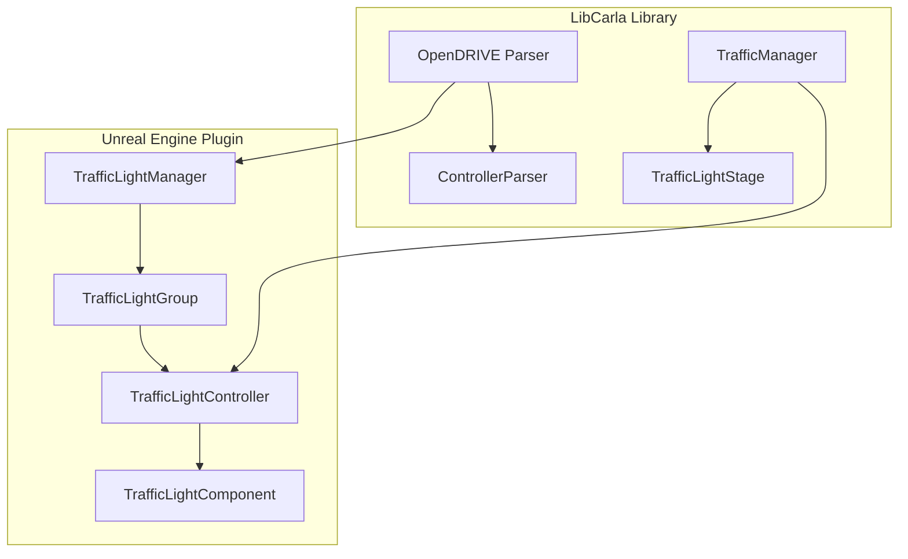
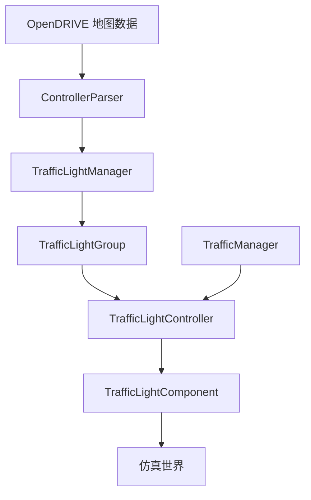
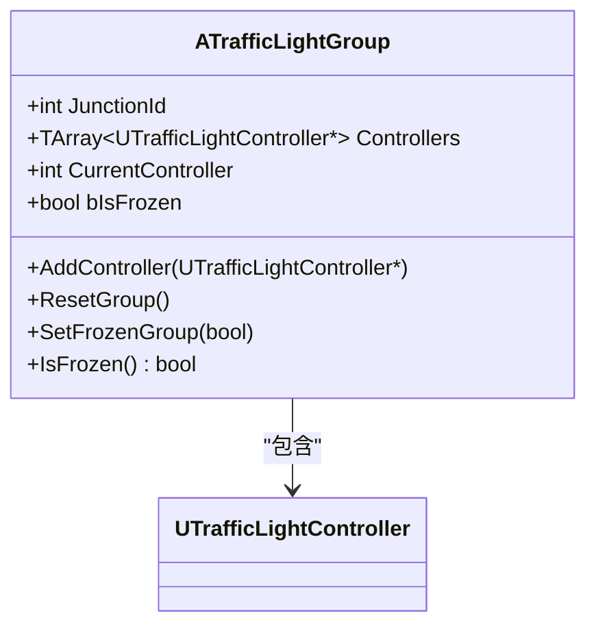
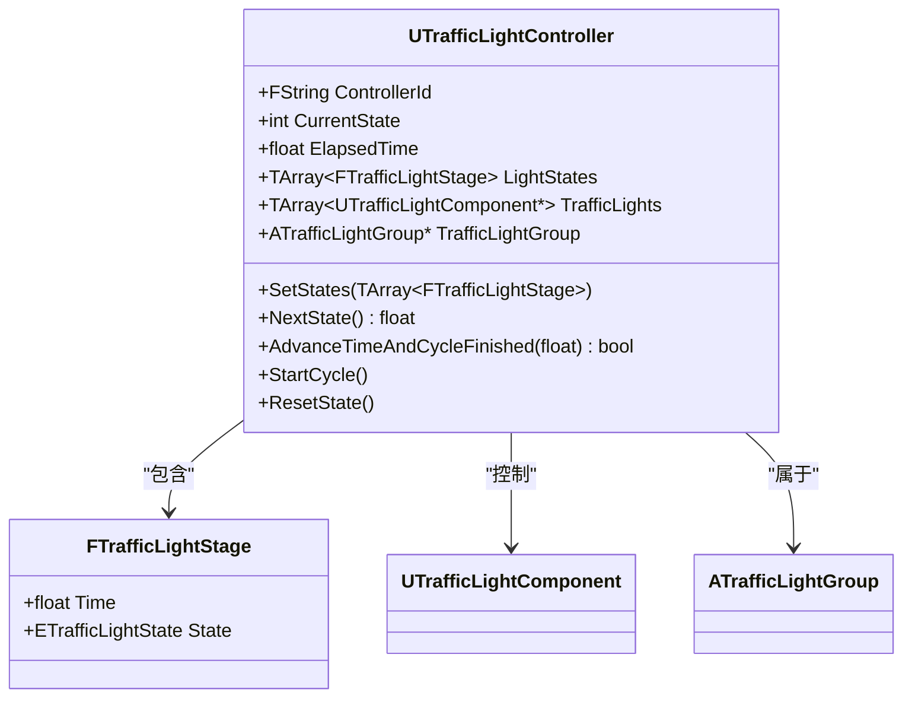
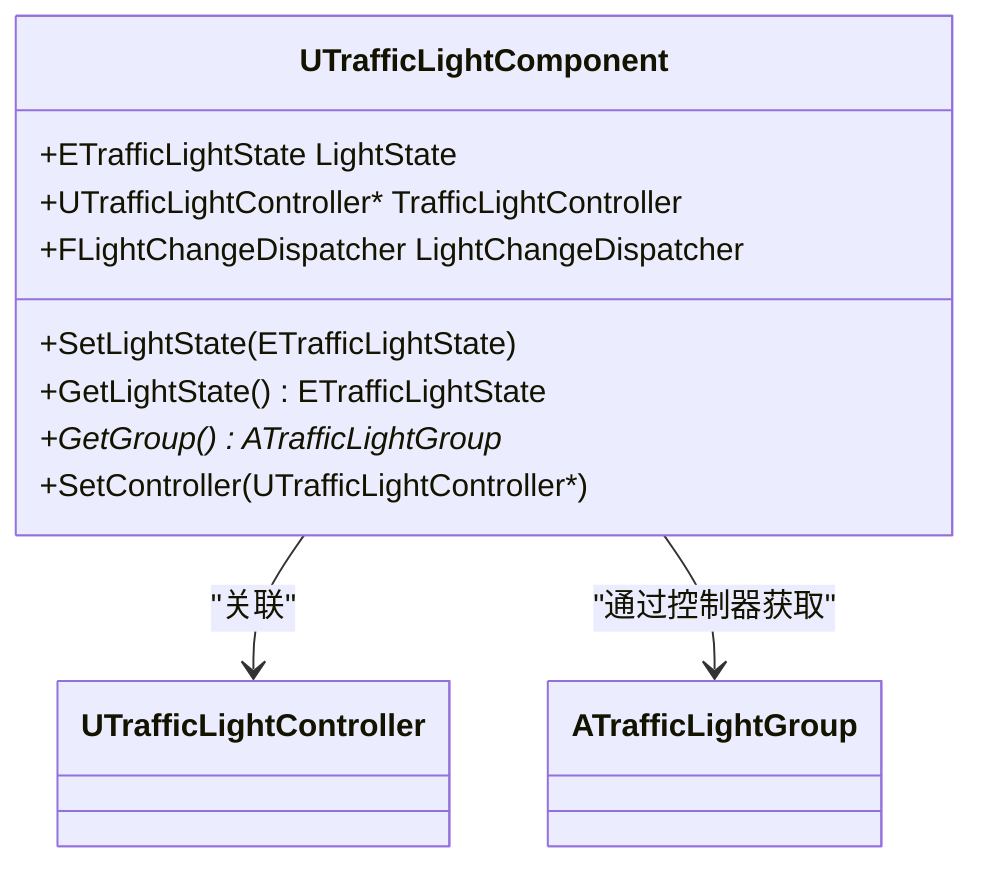
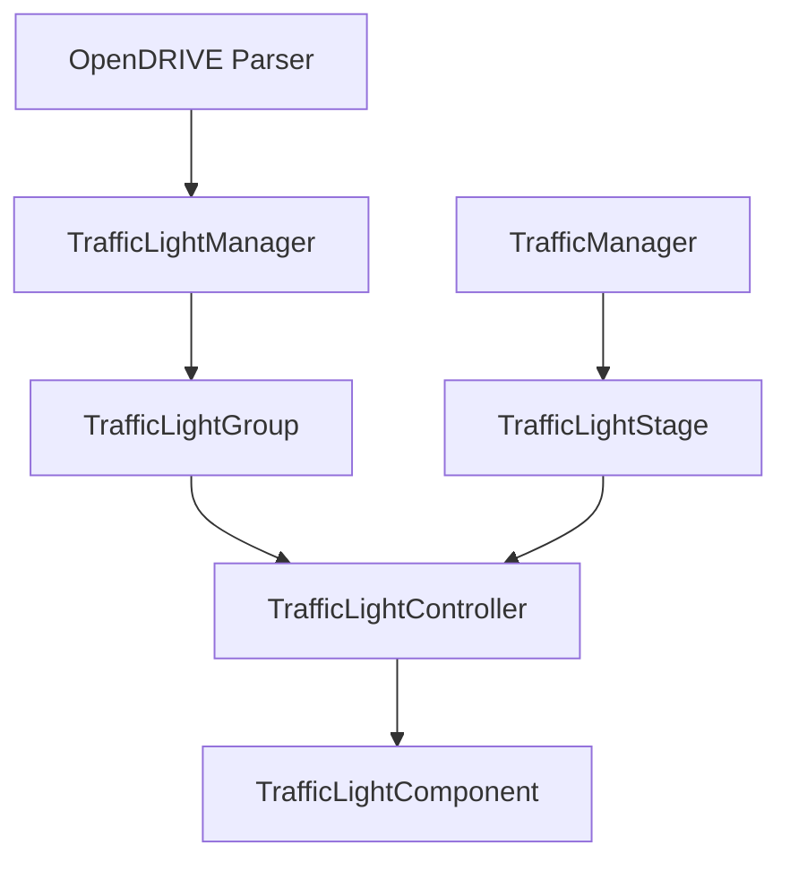
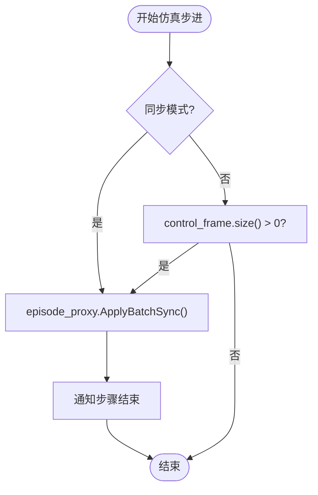

# 信号灯组协调

**本文档中引用的文件**   
- [TrafficLightGroup.h](https://github.com/carla-simulator/carla/blob/ue5-dev/Unreal/CarlaUnreal/Plugins/Carla/Source/Carla/Traffic/TrafficLightGroup.h)
- [TrafficLightGroup.cpp](https://github.com/carla-simulator/carla/blob/ue5-dev/Unreal/CarlaUnreal/Plugins/Carla/Source/Carla/Traffic/TrafficLightGroup.cpp)
- [TrafficLightController.h](https://github.com/carla-simulator/carla/blob/ue5-dev/Unreal/CarlaUnreal/Plugins/Carla/Source/Carla/Traffic/TrafficLightController.h)
- [TrafficLightController.cpp](https://github.com/carla-simulator/carla/blob/ue5-dev/Unreal/CarlaUnreal/Plugins/Carla/Source/Carla/Traffic/TrafficLightController.cpp)
- [TrafficLightComponent.h](https://github.com/carla-simulator/carla/blob/ue5-dev/Unreal/CarlaUnreal/Plugins/Carla/Source/Carla/Traffic/TrafficLightComponent.h)
- [TrafficLightComponent.cpp](https://github.com/carla-simulator/carla/blob/ue5-dev/Unreal/CarlaUnreal/Plugins/Carla/Source/Carla/Traffic/TrafficLightComponent.cpp)
- [TrafficLightManager.h](https://github.com/carla-simulator/carla/blob/ue5-dev/Unreal/CarlaUnreal/Plugins/Carla/Source/Carla/Traffic/TrafficLightManager.h)
- [TrafficLightManager.cpp](https://github.com/carla-simulator/carla/blob/ue5-dev/Unreal/CarlaUnreal/Plugins/Carla/Source/Carla/Traffic/TrafficLightManager.cpp)
- [ControllerParser.cpp](https://github.com/carla-simulator/carla/blob/ue5-dev/LibCarla/source/carla/opendrive/parser/ControllerParser.cpp)
- [TrafficLightStage.cpp](https://github.com/carla-simulator/carla/blob/ue5-dev/LibCarla/source/carla/trafficmanager/TrafficLightStage.cpp)
- [TrafficLightStage.h](https://github.com/carla-simulator/carla/blob/ue5-dev/LibCarla/source/carla/trafficmanager/TrafficLightStage.h)
- [TrafficManagerLocal.cpp](https://github.com/carla-simulator/carla/blob/ue5-dev/LibCarla/source/carla/trafficmanager/TrafficManagerLocal.cpp)

## 目录
1. [引言](#引言)
2. [项目结构](#项目结构)
3. [核心组件](#核心组件)
4. [架构概述](#架构概述)
5. [详细组件分析](#详细组件分析)
6. [依赖分析](#依赖分析)
7. [性能考虑](#性能考虑)
8. [故障排除指南](#故障排除指南)
9. [结论](#结论)

## 引言
本文档详细描述了CARLA仿真环境中交通信号灯组协调的实现机制。文档重点阐述了TrafficLightGroup如何将多个相关信号灯组织成逻辑组，以实现交叉路口的协调控制。同时，解释了TrafficLightController如何管理组内信号灯的相位同步和冲突检测，确保交通安全。涵盖了信号灯相位（phase）的概念、相位序列的配置方法以及绿波带（green wave）的实现原理。此外，还提供了实际案例展示如何通过OpenDRIVE地图数据自动构建信号灯组，以及如何手动配置复杂的交叉路口协调逻辑，并包括在大规模城市仿真中的性能优化建议。

## 项目结构
CARLA的信号灯协调系统主要由Unreal引擎插件和LibCarla库两部分构成。核心功能实现在Unreal插件的`Carla/Traffic`目录下，包括信号灯组（TrafficLightGroup）、控制器（TrafficLightController）和组件（TrafficLightComponent）等关键类。LibCarla库则提供了与OpenDRIVE地图解析和交通管理器（TrafficManager）交互的底层支持。

**图源**
- [TrafficLightManager.h](https://github.com/carla-simulator/carla/blob/ue5-dev/Unreal/CarlaUnreal/Plugins/Carla/Source/Carla/Traffic/TrafficLightManager.h)
- [ControllerParser.cpp](https://github.com/carla-simulator/carla/blob/ue5-dev/LibCarla/source/carla/opendrive/parser/ControllerParser.cpp)
- [TrafficLightStage.h](https://github.com/carla-simulator/carla/blob/ue5-dev/LibCarla/source/carla/trafficmanager/TrafficLightStage.h)

**章节源**
- [TrafficLightManager.h](https://github.com/carla-simulator/carla/blob/ue5-dev/Unreal/CarlaUnreal/Plugins/Carla/Source/Carla/Traffic/TrafficLightManager.h)
- [ControllerParser.cpp](https://github.com/carla-simulator/carla/blob/ue5-dev/LibCarla/source/carla/opendrive/parser/ControllerParser.cpp)

## 核心组件
CARLA的信号灯协调系统由三个核心组件构成：TrafficLightGroup负责管理一个交叉路口的所有信号灯；TrafficLightController定义了信号灯的相位序列和时序；TrafficLightComponent则代表了物理世界中的单个信号灯实体。这些组件通过TrafficLightManager进行统一注册和协调，确保了信号灯状态的同步和逻辑一致性。

**章节源**
- [TrafficLightGroup.h](https://github.com/carla-simulator/carla/blob/ue5-dev/Unreal/CarlaUnreal/Plugins/Carla/Source/Carla/Traffic/TrafficLightGroup.h)
- [TrafficLightController.h](https://github.com/carla-simulator/carla/blob/ue5-dev/Unreal/CarlaUnreal/Plugins/Carla/Source/Carla/Traffic/TrafficLightController.h)
- [TrafficLightComponent.h](https://github.com/carla-simulator/carla/blob/ue5-dev/Unreal/CarlaUnreal/Plugins/Carla/Source/Carla/Traffic/TrafficLightComponent.h)

## 架构概述
CARLA的信号灯协调架构采用分层设计。最底层是基于OpenDRIVE标准的地图数据，其中定义了信号灯、控制器和交叉路口的逻辑关系。中间层由TrafficLightManager负责解析地图数据并创建相应的TrafficLightGroup和TrafficLightController实例。最上层是运行时系统，通过Tick机制驱动控制器更新信号灯状态，并由TrafficManager处理车辆与信号灯的交互。

**图源**
- [ControllerParser.cpp](https://github.com/carla-simulator/carla/blob/ue5-dev/LibCarla/source/carla/opendrive/parser/ControllerParser.cpp)
- [TrafficLightManager.h](https://github.com/carla-simulator/carla/blob/ue5-dev/Unreal/CarlaUnreal/Plugins/Carla/Source/Carla/Traffic/TrafficLightManager.h)
- [TrafficLightController.h](https://github.com/carla-simulator/carla/blob/ue5-dev/Unreal/CarlaUnreal/Plugins/Carla/Source/Carla/Traffic/TrafficLightController.h)

## 详细组件分析

### TrafficLightGroup 分析
TrafficLightGroup是信号灯协调的核心逻辑单元，它将属于同一交叉路口的所有信号灯组织在一起。该类继承自AActor，可以被添加到Unreal世界中。它通过JunctionId属性标识其管理的交叉路口，并维护一个控制器列表（Controllers），这些控制器共同决定了该交叉路口的信号灯状态。

**图源**
- [TrafficLightGroup.h](https://github.com/carla-simulator/carla/blob/ue5-dev/Unreal/CarlaUnreal/Plugins/Carla/Source/Carla/Traffic/TrafficLightGroup.h)
- [TrafficLightController.h](https://github.com/carla-simulator/carla/blob/ue5-dev/Unreal/CarlaUnreal/Plugins/Carla/Source/Carla/Traffic/TrafficLightController.h)

**章节源**
- [TrafficLightGroup.h](https://github.com/carla-simulator/carla/blob/ue5-dev/Unreal/CarlaUnreal/Plugins/Carla/Source/Carla/Traffic/TrafficLightGroup.h)
- [TrafficLightGroup.cpp](https://github.com/carla-simulator/carla/blob/ue5-dev/Unreal/CarlaUnreal/Plugins/Carla/Source/Carla/Traffic/TrafficLightGroup.cpp)

### TrafficLightController 分析
TrafficLightController是信号灯相位逻辑的执行者。它定义了一个FTrafficLightStage结构体数组，每个元素包含一个信号灯状态（State）和持续时间（Time），从而形成一个相位序列。控制器通过CurrentState索引跟踪当前相位，并在Tick时钟驱动下按顺序切换相位。

**图源**
- [TrafficLightController.h](https://github.com/carla-simulator/carla/blob/ue5-dev/Unreal/CarlaUnreal/Plugins/Carla/Source/Carla/Traffic/TrafficLightController.h)
- [TrafficLightComponent.h](https://github.com/carla-simulator/carla/blob/ue5-dev/Unreal/CarlaUnreal/Plugins/Carla/Source/Carla/Traffic/TrafficLightComponent.h)
- [TrafficLightGroup.h](https://github.com/carla-simulator/carla/blob/ue5-dev/Unreal/CarlaUnreal/Plugins/Carla/Source/Carla/Traffic/TrafficLightGroup.h)

**章节源**
- [TrafficLightController.h](https://github.com/carla-simulator/carla/blob/ue5-dev/Unreal/CarlaUnreal/Plugins/Carla/Source/Carla/Traffic/TrafficLightController.h)
- [TrafficLightController.cpp](https://github.com/carla-simulator/carla/blob/ue5-dev/Unreal/CarlaUnreal/Plugins/Carla/Source/Carla/Traffic/TrafficLightController.cpp)

### TrafficLightComponent 分析
TrafficLightComponent是信号灯在仿真世界中的具体表现。它继承自USignComponent，包含了信号灯的物理属性和状态。该组件通过LightState属性存储当前状态，并通过LightChangeDispatcher事件通知外部状态变化。它与TrafficLightController关联，接收来自控制器的状态更新指令。

**图源**
- [TrafficLightComponent.h](https://github.com/carla-simulator/carla/blob/ue5-dev/Unreal/CarlaUnreal/Plugins/Carla/Source/Carla/Traffic/TrafficLightComponent.h)
- [TrafficLightController.h](https://github.com/carla-simulator/carla/blob/ue5-dev/Unreal/CarlaUnreal/Plugins/Carla/Source/Carla/Traffic/TrafficLightController.h)
- [TrafficLightGroup.h](https://github.com/carla-simulator/carla/blob/ue5-dev/Unreal/CarlaUnreal/Plugins/Carla/Source/Carla/Traffic/TrafficLightGroup.h)

**章节源**
- [TrafficLightComponent.h](https://github.com/carla-simulator/carla/blob/ue5-dev/Unreal/CarlaUnreal/Plugins/Carla/Source/Carla/Traffic/TrafficLightComponent.h)
- [TrafficLightComponent.cpp](https://github.com/carla-simulator/carla/blob/ue5-dev/Unreal/CarlaUnreal/Plugins/Carla/Source/Carla/Traffic/TrafficLightComponent.cpp)

## 依赖分析
信号灯协调系统的依赖关系清晰。TrafficLightManager作为顶层管理者，依赖于OpenDRIVE地图数据来创建TrafficLightGroup和TrafficLightController。每个TrafficLightController依赖于一个或多个TrafficLightComponent来执行状态更新。TrafficManager则依赖于TrafficLightStage来处理车辆与信号灯的交互逻辑。

**图源**
- [TrafficLightManager.h](https://github.com/carla-simulator/carla/blob/ue5-dev/Unreal/CarlaUnreal/Plugins/Carla/Source/Carla/Traffic/TrafficLightManager.h)
- [TrafficLightStage.h](https://github.com/carla-simulator/carla/blob/ue5-dev/LibCarla/source/carla/trafficmanager/TrafficLightStage.h)
- [ControllerParser.cpp](https://github.com/carla-simulator/carla/blob/ue5-dev/LibCarla/source/carla/opendrive/parser/ControllerParser.cpp)

**章节源**
- [TrafficLightManager.h](https://github.com/carla-simulator/carla/blob/ue5-dev/Unreal/CarlaUnreal/Plugins/Carla/Source/Carla/Traffic/TrafficLightManager.h)
- [TrafficLightStage.h](https://github.com/carla-simulator/carla/blob/ue5-dev/LibCarla/source/carla/trafficmanager/TrafficLightStage.h)
- [ControllerParser.cpp](https://github.com/carla-simulator/carla/blob/ue5-dev/LibCarla/source/carla/opendrive/parser/ControllerParser.cpp)

## 性能考虑
在大规模城市仿真中，信号灯组的管理需要考虑性能优化。TrafficManager采用批量处理（batch processing）机制，将多个车辆的控制指令合并发送，减少了网络通信开销。同时，通过同步模式（synchronous mode）确保了仿真步进的一致性，避免了因时钟不同步导致的逻辑错误。

**图源**
- [TrafficManagerLocal.cpp](https://github.com/carla-simulator/carla/blob/ue5-dev/LibCarla/source/carla/trafficmanager/TrafficManagerLocal.cpp)

**章节源**
- [TrafficManagerLocal.cpp](https://github.com/carla-simulator/carla/blob/ue5-dev/LibCarla/source/carla/trafficmanager/TrafficManagerLocal.cpp)

## 故障排除指南
当信号灯协调出现问题时，应首先检查OpenDRIVE地图数据中控制器（controller）和信号灯（signal）的定义是否正确。其次，确认TrafficLightManager是否成功解析了地图数据并创建了相应的TrafficLightGroup。最后，检查TrafficLightController的相位序列配置是否合理，避免出现死锁或冲突。

**章节源**
- [TrafficLightManager.cpp](https://github.com/carla-simulator/carla/blob/ue5-dev/Unreal/CarlaUnreal/Plugins/Carla/Source/Carla/Traffic/TrafficLightManager.cpp)
- [TrafficLightController.cpp](https://github.com/carla-simulator/carla/blob/ue5-dev/Unreal/CarlaUnreal/Plugins/Carla/Source/Carla/Traffic/TrafficLightController.cpp)

## 结论
CARLA的信号灯组协调系统通过TrafficLightGroup、TrafficLightController和TrafficLightComponent三个核心组件的协同工作，实现了复杂交叉路口的信号灯控制。该系统能够基于OpenDRIVE地图数据自动构建信号灯组，并支持手动配置相位序列以实现绿波带等高级交通控制策略。在大规模仿真中，通过批量处理和同步模式确保了系统的稳定性和性能。