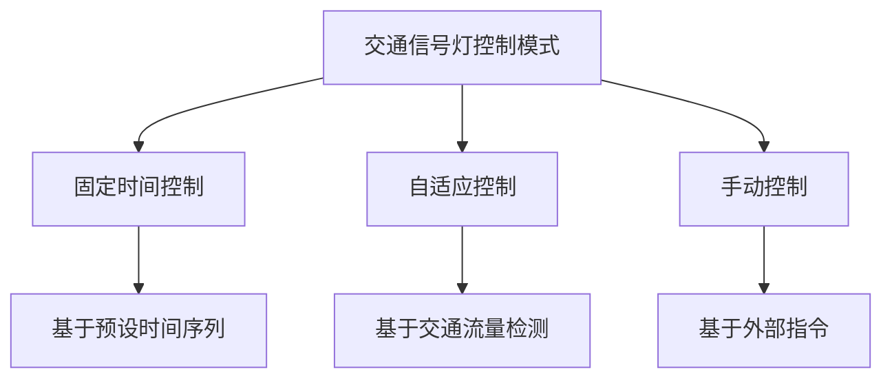
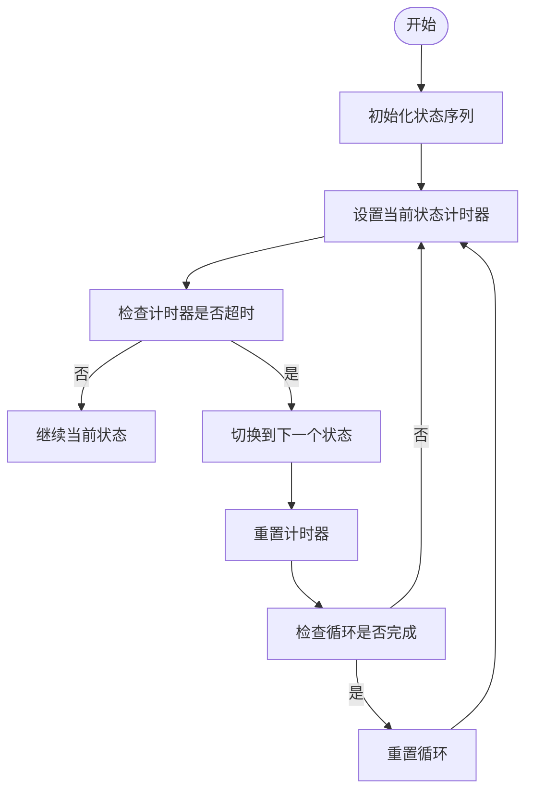
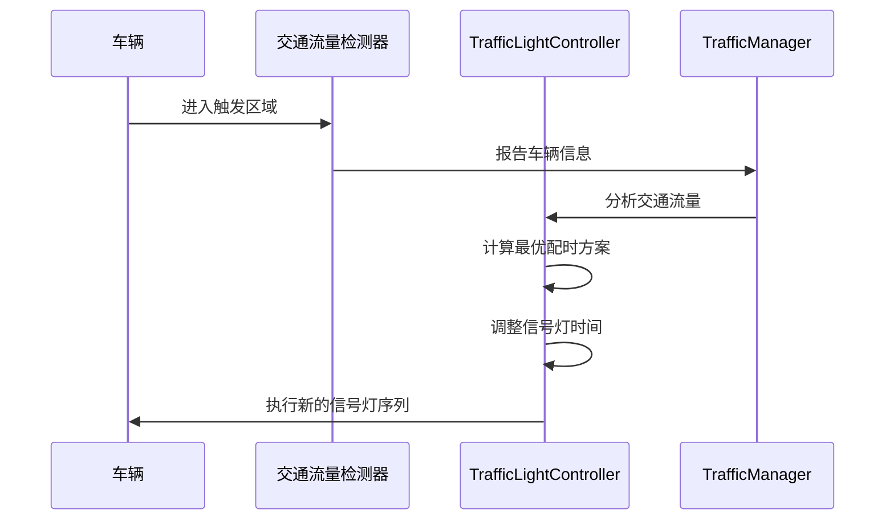
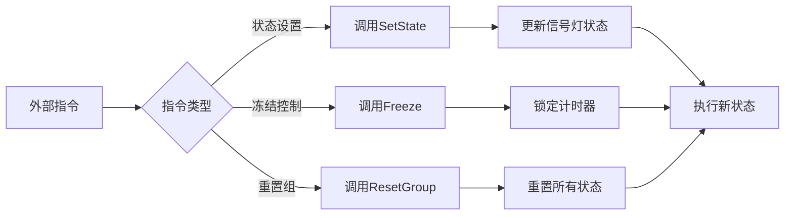
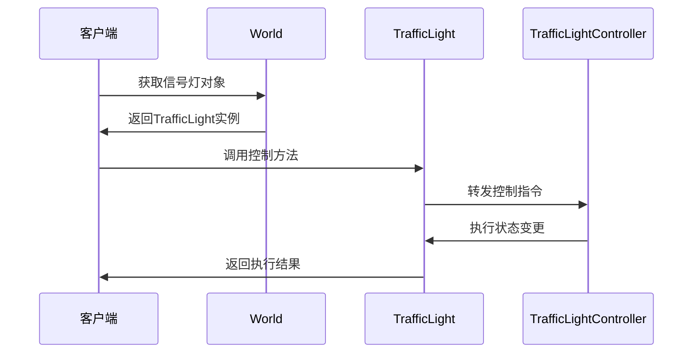
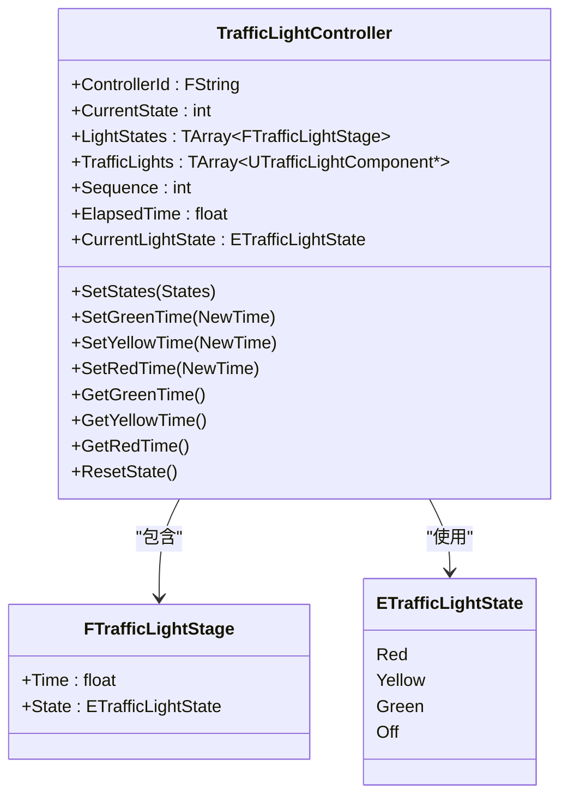
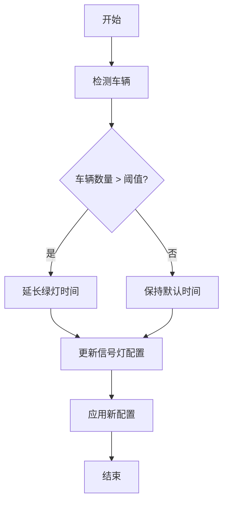
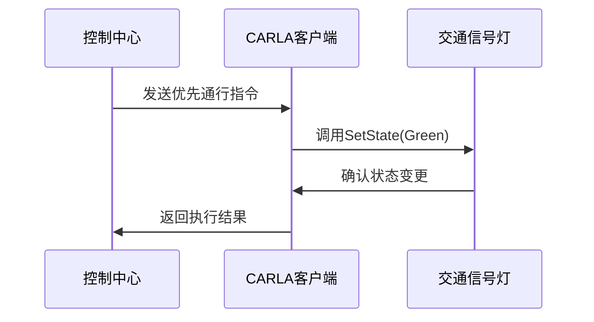
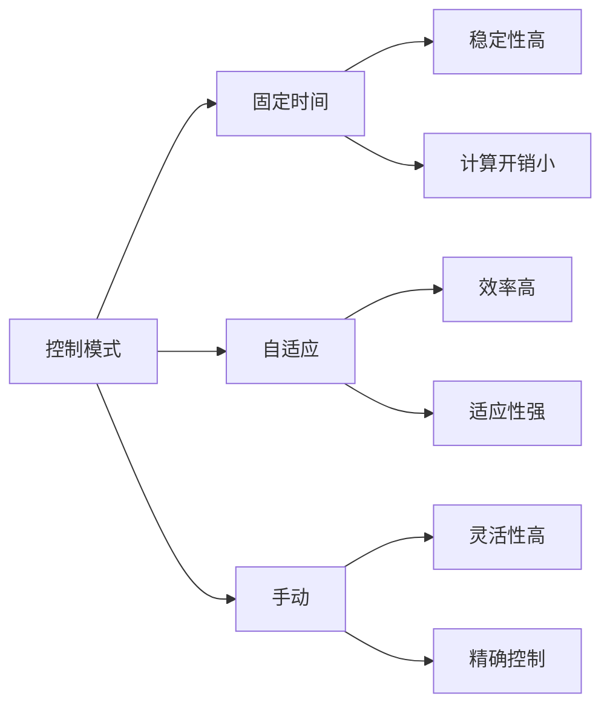
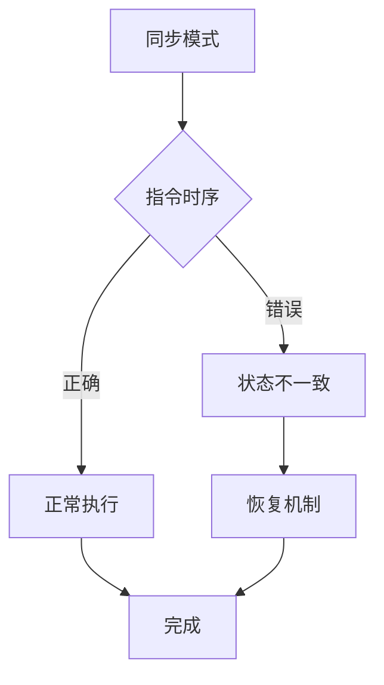

# 控制模式配置

**本文档中引用的文件**  
- [TrafficLightController.h](https://github.com/carla-simulator/carla/blob/ue5-dev/Unreal/CarlaUnreal/Plugins/Carla/Source/Carla/Traffic/TrafficLightController.h)
- [TrafficLightController.cpp](https://github.com/carla-simulator/carla/blob/ue5-dev/Unreal/CarlaUnreal/Plugins/Carla/Source/Carla/Traffic/TrafficLightController.cpp)
- [TrafficLight.cpp](https://github.com/carla-simulator/carla/blob/ue5-dev/LibCarla/source/carla/client/TrafficLight.cpp)
- [TrafficLight.h](https://github.com/carla-simulator/carla/blob/ue5-dev/LibCarla/source/carla/client/TrafficLight.h)
- [manage_traffic_light.py](https://github.com/carla-simulator/carla/blob/ue5-dev/PythonAPI/util/manage_traffic_light.py)
- [TrafficLightStage.cpp](https://github.com/carla-simulator/carla/blob/ue5-dev/LibCarla/source/carla/trafficmanager/TrafficLightStage.cpp)
- [TrafficLightStage.h](https://github.com/carla-simulator/carla/blob/ue5-dev/LibCarla/source/carla/trafficmanager/TrafficLightStage.h)

## 目录
1. [引言](#引言)
2. [交通信号灯控制模式概述](#交通信号灯控制模式概述)
3. [固定时间控制模式](#固定时间控制模式)
4. [自适应控制模式](#自适应控制模式)
5. [手动控制模式](#手动控制模式)
6. [控制模式切换与API接口](#控制模式切换与api接口)
7. [参数配置方法](#参数配置方法)
8. [代码示例](#代码示例)
9. [适用场景与性能特征](#适用场景与性能特征)
10. [同步问题与注意事项](#同步问题与注意事项)

## 引言
CARLA模拟器提供了多种交通信号灯控制模式，以满足不同交通仿真场景的需求。本文档详细介绍了三种主要的控制模式：固定时间控制、自适应控制和手动控制。通过分析TrafficLightController的实现机制，我们将深入探讨每种模式的算法逻辑、参数配置方法以及API调用方式。这些控制模式为交通流仿真、自动驾驶测试和智能交通系统研究提供了灵活而强大的工具。

## 交通信号灯控制模式概述
CARLA中的交通信号灯控制系统基于OpenDRIVE标准实现，通过TrafficLightController类管理信号灯的状态转换。系统支持三种主要控制模式：固定时间控制、自适应控制和手动控制。每种模式都有其特定的应用场景和性能特征。核心控制逻辑位于Unreal引擎插件中的TrafficLightController组件，该组件负责管理信号灯的状态序列、计时器和状态转换。

**图表来源**  
- [TrafficLightController.h](https://github.com/carla-simulator/carla/blob/ue5-dev/Unreal/CarlaUnreal/Plugins/Carla/Source/Carla/Traffic/TrafficLightController.h#L19-L31)
- [TrafficLightController.cpp](https://github.com/carla-simulator/carla/blob/ue5-dev/Unreal/CarlaUnreal/Plugins/Carla/Source/Carla/Traffic/TrafficLightController.cpp#L14-L30)

**本节来源**  
- [TrafficLightController.h](https://github.com/carla-simulator/carla/blob/ue5-dev/Unreal/CarlaUnreal/Plugins/Carla/Source/Carla/Traffic/TrafficLightController.h#L1-L174)
- [TrafficLightController.cpp](https://github.com/carla-simulator/carla/blob/ue5-dev/Unreal/CarlaUnreal/Plugins/Carla/Source/Carla/Traffic/TrafficLightController.cpp#L1-L209)

## 固定时间控制模式
固定时间控制模式是交通信号灯最基础的控制方式，它按照预设的时间序列循环执行信号灯状态转换。在CARLA中，这种模式通过TrafficLightController类的LightStates数组实现，该数组定义了信号灯状态（红、黄、绿）及其持续时间。控制器通过AdvanceTimeAndCycleFinished方法在每个仿真步进中更新计时器，并在达到设定时间后自动切换到下一个状态。

该模式的算法逻辑基于简单的定时器机制，每个状态的持续时间是固定的。当当前状态的计时器超过预设时间时，系统会自动切换到序列中的下一个状态，并重置计时器。这种控制方式适用于交通流量相对稳定、可预测的场景，如城市主干道的信号灯控制。

**图表来源**  
- [TrafficLightController.cpp](https://github.com/carla-simulator/carla/blob/ue5-dev/Unreal/CarlaUnreal/Plugins/Carla/Source/Carla/Traffic/TrafficLightController.cpp#L32-L45)
- [TrafficLightController.h](https://github.com/carla-simulator/carla/blob/ue5-dev/Unreal/CarlaUnreal/Plugins/Carla/Source/Carla/Traffic/TrafficLightController.h#L150-L155)

**本节来源**  
- [TrafficLightController.cpp](https://github.com/carla-simulator/carla/blob/ue5-dev/Unreal/CarlaUnreal/Plugins/Carla/Source/Carla/Traffic/TrafficLightController.cpp#L32-L45)
- [TrafficLightController.h](https://github.com/carla-simulator/carla/blob/ue5-dev/Unreal/CarlaUnreal/Plugins/Carla/Source/Carla/Traffic/TrafficLightController.h#L149-L155)

## 自适应控制模式
自适应控制模式根据实时交通流量动态调整信号灯的配时方案。在CARLA中，这种模式通过TrafficLightStage类实现，该类作为TrafficManager的一部分，负责检测交通状况并相应地调整信号灯控制策略。系统通过监测车辆在信号灯触发区域内的行为来判断交通流量，并根据预设的算法逻辑调整信号灯的绿灯时间。

自适应控制的核心算法包括交通流量检测、优先级计算和动态配时调整。系统会持续监控各个方向的车辆排队长度和等待时间，当检测到某方向交通流量显著增加时，可以自动延长该方向的绿灯时间。这种控制方式能够有效提高道路通行效率，减少车辆等待时间，特别适用于交通流量变化较大的交叉口。

**图表来源**  
- [TrafficLightStage.cpp](https://github.com/carla-simulator/carla/blob/ue5-dev/LibCarla/source/carla/trafficmanager/TrafficLightStage.cpp#L31-L80)
- [TrafficLightStage.h](https://github.com/carla-simulator/carla/blob/ue5-dev/LibCarla/source/carla/trafficmanager/TrafficLightStage.h#L13-L15)

**本节来源**  
- [TrafficLightStage.cpp](https://github.com/carla-simulator/carla/blob/ue5-dev/LibCarla/source/carla/trafficmanager/TrafficLightStage.cpp#L31-L80)
- [TrafficLightStage.h](https://github.com/carla-simulator/carla/blob/ue5-dev/LibCarla/source/carla/trafficmanager/TrafficLightStage.h#L13-L15)

## 手动控制模式
手动控制模式允许外部系统或用户直接控制交通信号灯的状态。在CARLA中，这种模式通过TrafficLight类的API接口实现，用户可以通过调用SetState方法直接设置信号灯的状态。这种控制方式为特殊场景的仿真提供了灵活性，如紧急车辆优先通行、施工区域临时交通管制等。

手动控制模式的核心是外部指令处理机制。系统提供了Freeze方法来锁定信号灯状态，防止自动控制逻辑干扰手动操作。此外，ResetGroup方法可用于重置整个信号灯组的状态，确保控制的一致性。这种模式特别适用于需要精确控制信号灯状态的测试场景，如自动驾驶车辆的紧急响应测试。

**图表来源**  
- [TrafficLight.cpp](https://github.com/carla-simulator/carla/blob/ue5-dev/LibCarla/source/carla/client/TrafficLight.cpp#L17-L23)
- [TrafficLight.h](https://github.com/carla-simulator/carla/blob/ue5-dev/LibCarla/source/carla/client/TrafficLight.h#L24-L30)

**本节来源**  
- [TrafficLight.cpp](https://github.com/carla-simulator/carla/blob/ue5-dev/LibCarla/source/carla/client/TrafficLight.cpp#L17-L23)
- [TrafficLight.h](https://github.com/carla-simulator/carla/blob/ue5-dev/LibCarla/source/carla/client/TrafficLight.h#L24-L30)

## 控制模式切换与API接口
CARLA提供了丰富的API接口用于切换和控制交通信号灯模式。主要的控制接口包括SetState用于直接设置信号灯状态，Freeze用于冻结自动控制，以及通过TrafficLightController的SetStates方法重新配置控制序列。这些API可以通过Python客户端或C++接口调用，为不同层次的控制需求提供了灵活性。

模式切换通常涉及多个步骤：首先通过GetGroupTrafficLights获取相关信号灯组，然后根据需要调用相应的控制方法。例如，从固定时间控制切换到手动控制时，需要先调用Freeze(true)冻结自动控制，然后使用SetState设置所需的状态。完成手动控制后，调用Freeze(false)恢复自动控制逻辑。

**图表来源**  
- [TrafficLight.cpp](https://github.com/carla-simulator/carla/blob/ue5-dev/LibCarla/source/carla/client/TrafficLight.cpp#L67-L74)
- [TrafficLightController.cpp](https://github.com/carla-simulator/carla/blob/ue5-dev/Unreal/CarlaUnreal/Plugins/Carla/Source/Carla/Traffic/TrafficLightController.cpp#L102-L113)

**本节来源**  
- [TrafficLight.cpp](https://github.com/carla-simulator/carla/blob/ue5-dev/LibCarla/source/carla/client/TrafficLight.cpp#L17-L60)
- [TrafficLightController.cpp](https://github.com/carla-simulator/carla/blob/ue5-dev/Unreal/CarlaUnreal/Plugins/Carla/Source/Carla/Traffic/TrafficLightController.cpp#L102-L113)

## 参数配置方法
交通信号灯的参数配置主要通过TrafficLightController类的属性和方法实现。核心参数包括各状态的持续时间（绿灯、黄灯、红灯时间）、控制序列和组ID。这些参数可以通过SetGreenTime、SetYellowTime和SetRedTime等方法进行动态调整，也可以通过SetStates方法一次性配置整个控制序列。

参数配置的最佳实践包括：在仿真开始前预设合理的默认值，根据交通场景动态调整参数，以及使用ResetState方法确保参数变更的正确应用。对于复杂的交叉口，建议通过OpenDRIVE文件定义初始参数，然后在运行时根据需要进行微调。

**图表来源**  
- [TrafficLightController.h](https://github.com/carla-simulator/carla/blob/ue5-dev/Unreal/CarlaUnreal/Plugins/Carla/Source/Carla/Traffic/TrafficLightController.h#L143-L173)
- [TrafficLightController.cpp](https://github.com/carla-simulator/carla/blob/ue5-dev/Unreal/CarlaUnreal/Plugins/Carla/Source/Carla/Traffic/TrafficLightController.cpp#L162-L182)

**本节来源**  
- [TrafficLightController.h](https://github.com/carla-simulator/carla/blob/ue5-dev/Unreal/CarlaUnreal/Plugins/Carla/Source/Carla/Traffic/TrafficLightController.h#L143-L173)
- [TrafficLightController.cpp](https://github.com/carla-simulator/carla/blob/ue5-dev/Unreal/CarlaUnreal/Plugins/Carla/Source/Carla/Traffic/TrafficLightController.cpp#L132-L160)

## 代码示例
以下代码示例展示了如何在CARLA中实现基于车辆检测的自适应信号控制和紧急车辆优先通行。第一个示例演示了如何根据检测到的车辆数量动态调整绿灯时间，第二个示例展示了如何通过远程指令实现紧急车辆优先通行。

**图表来源**  
- [manage_traffic_light.py](https://github.com/carla-simulator/carla/blob/ue5-dev/PythonAPI/util/manage_traffic_light.py#L41-L74)
- [TrafficLight.cpp](https://github.com/carla-simulator/carla/blob/ue5-dev/LibCarla/source/carla/client/TrafficLight.cpp#L17-L23)

**本节来源**  
- [manage_traffic_light.py](https://github.com/carla-simulator/carla/blob/ue5-dev/PythonAPI/util/manage_traffic_light.py#L41-L74)
- [TrafficLight.cpp](https://github.com/carla-simulator/carla/blob/ue5-dev/LibCarla/source/carla/client/TrafficLight.cpp#L17-L23)

## 适用场景与性能特征
不同的交通信号灯控制模式适用于不同的仿真场景。固定时间控制模式适用于交通流量稳定、可预测的场景，如城市主干道的日常交通管理。这种模式的性能特征是控制逻辑简单、计算开销小，但无法适应交通流量的实时变化。

自适应控制模式适用于交通流量变化大、需要动态调整的场景，如商业区交叉口或高峰时段的交通管理。这种模式能够显著提高道路通行效率，但需要更多的计算资源来实时分析交通状况。

手动控制模式适用于特殊场景的仿真，如紧急车辆优先通行、交通事故处理或施工区域交通管制。这种模式提供了最高的控制灵活性，但需要外部系统或用户进行干预。

**图表来源**  
- [TrafficLightStage.cpp](https://github.com/carla-simulator/carla/blob/ue5-dev/LibCarla/source/carla/trafficmanager/TrafficLightStage.cpp#L31-L80)
- [TrafficLightController.cpp](https://github.com/carla-simulator/carla/blob/ue5-dev/Unreal/CarlaUnreal/Plugins/Carla/Source/Carla/Traffic/TrafficLightController.cpp#L32-L45)

**本节来源**  
- [TrafficLightStage.cpp](https://github.com/carla-simulator/carla/blob/ue5-dev/LibCarla/source/carla/trafficmanager/TrafficLightStage.cpp#L31-L80)
- [TrafficLightController.cpp](https://github.com/carla-simulator/carla/blob/ue5-dev/Unreal/CarlaUnreal/Plugins/Carla/Source/Carla/Traffic/TrafficLightController.cpp#L32-L45)

## 同步问题与注意事项
在使用CARLA交通信号灯控制时，需要注意同步问题。在同步模式下，所有控制指令必须在正确的仿真步进中执行，否则可能导致状态不一致。特别是当多个客户端同时控制同一信号灯组时，需要确保操作的原子性和一致性。

其他注意事项包括：避免频繁的状态切换导致仿真不稳定，确保参数配置的合理性，以及在切换控制模式时正确处理状态过渡。对于复杂的交叉口，建议使用信号灯组的概念来协调多个信号灯的控制，避免冲突。

**图表来源**  
- [TrafficLightStage.cpp](https://github.com/carla-simulator/carla/blob/ue5-dev/LibCarla/source/carla/trafficmanager/TrafficLightStage.cpp#L31-L80)
- [TrafficLightController.cpp](https://github.com/carla-simulator/carla/blob/ue5-dev/Unreal/CarlaUnreal/Plugins/Carla/Source/Carla/Traffic/TrafficLightController.cpp#L32-L45)

**本节来源**  
- [TrafficLightStage.cpp](https://github.com/carla-simulator/carla/blob/ue5-dev/LibCarla/source/carla/trafficmanager/TrafficLightStage.cpp#L31-L80)
- [TrafficLightController.cpp](https://github.com/carla-simulator/carla/blob/ue5-dev/Unreal/CarlaUnreal/Plugins/Carla/Source/Carla/Traffic/TrafficLightController.cpp#L32-L45)