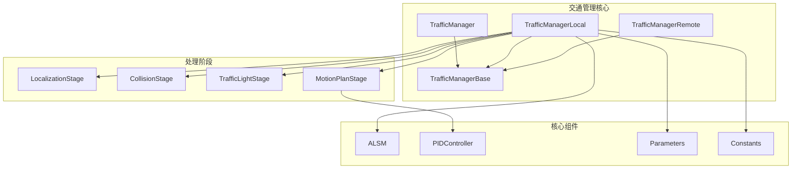
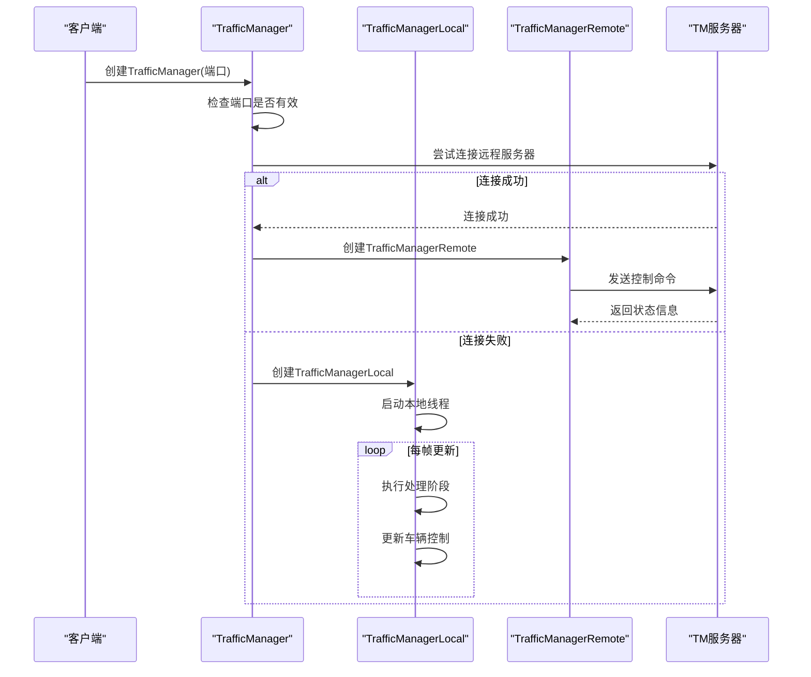
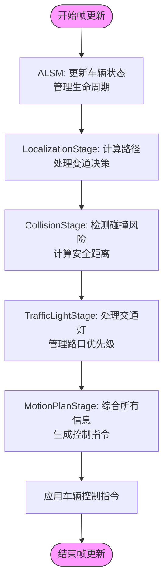
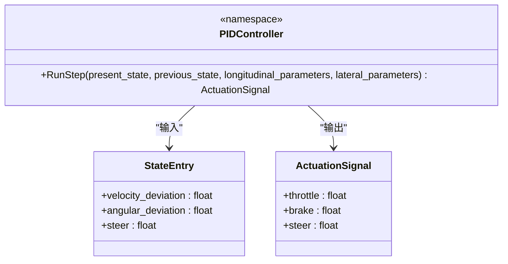
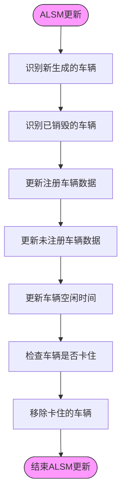
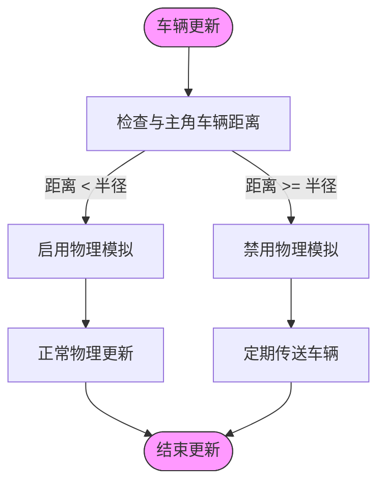
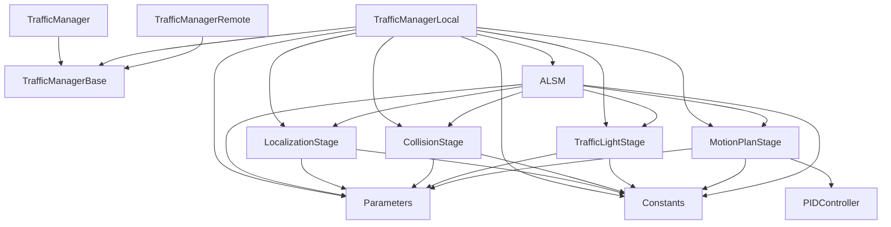

# 交通管理

**本文档中引用的文件**   
- [TrafficManager.h](https://github.com/carla-simulator/carla/blob/ue5-dev/LibCarla/source/carla/trafficmanager/TrafficManager.h)
- [TrafficManager.cpp](https://github.com/carla-simulator/carla/blob/ue5-dev/LibCarla/source/carla/trafficmanager/TrafficManager.cpp)
- [TrafficManagerLocal.h](https://github.com/carla-simulator/carla/blob/ue5-dev/LibCarla/source/carla/trafficmanager/TrafficManagerLocal.h)
- [TrafficManagerRemote.h](https://github.com/carla-simulator/carla/blob/ue5-dev/LibCarla/source/carla/trafficmanager/TrafficManagerRemote.h)
- [ALSM.h](https://github.com/carla-simulator/carla/blob/ue5-dev/LibCarla/source/carla/trafficmanager/ALSM.h)
- [PIDController.h](https://github.com/carla-simulator/carla/blob/ue5-dev/LibCarla/source/carla/trafficmanager/PIDController.h)
- [Parameters.h](https://github.com/carla-simulator/carla/blob/ue5-dev/LibCarla/source/carla/trafficmanager/Parameters.h)
- [LocalizationStage.h](https://github.com/carla-simulator/carla/blob/ue5-dev/LibCarla/source/carla/trafficmanager/LocalizationStage.h)
- [CollisionStage.h](https://github.com/carla-simulator/carla/blob/ue5-dev/LibCarla/source/carla/trafficmanager/CollisionStage.h)
- [TrafficLightStage.h](https://github.com/carla-simulator/carla/blob/ue5-dev/LibCarla/source/carla/trafficmanager/TrafficLightStage.h)
- [MotionPlanStage.h](https://github.com/carla-simulator/carla/blob/ue5-dev/LibCarla/source/carla/trafficmanager/MotionPlanStage.h)
- [Constants.h](https://github.com/carla-simulator/carla/blob/ue5-dev/LibCarla/source/carla/trafficmanager/Constants.h)
- [TrafficManager.cpp](https://github.com/carla-simulator/carla/blob/ue5-dev/PythonAPI/carla/src/TrafficManager.cpp)
- [tuto_G_traffic_manager.md](https://github.com/carla-simulator/carla/blob/ue5-dev/Docs/tuto_G_traffic_manager.md)

## 目录
1. [简介](#简介)
2. [项目结构](#项目结构)
3. [核心组件](#核心组件)
4. [架构概述](#架构概述)
5. [详细组件分析](#详细组件分析)
6. [依赖分析](#依赖分析)
7. [性能考虑](#性能考虑)
8. [故障排除指南](#故障排除指南)
9. [结论](#结论)

## 简介
CARLA交通管理器（Traffic Manager）是一个复杂的系统，旨在模拟逼真的交通流，为自动驾驶车辆提供真实的测试环境。该系统通过客户端-服务器架构管理大量交通车辆的行为，实现了速度限制、车道保持、跟车行为、变道决策和交通信号灯遵守等交通规则。文档将深入探讨交通管理器的本地和远程模式、高级功能如ALSM（高级本地化状态机）算法和PID控制器的实现，以及如何通过批量生成交通车辆、配置行为参数、避免碰撞和控制交通密度来创建复杂的交通场景。

## 项目结构
CARLA交通管理系统的代码库组织清晰，主要功能集中在`LibCarla/source/carla/trafficmanager/`目录下。该系统采用模块化设计，将不同的功能分离到独立的头文件和源文件中，便于维护和扩展。核心组件包括交通管理器主类、本地和远程实现、各种处理阶段（如定位、碰撞检测、交通灯响应）以及辅助工具类。

**图源**
- [TrafficManager.h](https://github.com/carla-simulator/carla/blob/ue5-dev/LibCarla/source/carla/trafficmanager/TrafficManager.h)
- [TrafficManagerLocal.h](https://github.com/carla-simulator/carla/blob/ue5-dev/LibCarla/source/carla/trafficmanager/TrafficManagerLocal.h)
- [TrafficManagerRemote.h](https://github.com/carla-simulator/carla/blob/ue5-dev/LibCarla/source/carla/trafficmanager/TrafficManagerRemote.h)
- [TrafficManagerBase.h](https://github.com/carla-simulator/carla/blob/ue5-dev/LibCarla/source/carla/trafficmanager/TrafficManagerBase.h)
- [LocalizationStage.h](https://github.com/carla-simulator/carla/blob/ue5-dev/LibCarla/source/carla/trafficmanager/LocalizationStage.h)
- [CollisionStage.h](https://github.com/carla-simulator/carla/blob/ue5-dev/LibCarla/source/carla/trafficmanager/CollisionStage.h)
- [TrafficLightStage.h](https://github.com/carla-simulator/carla/blob/ue5-dev/LibCarla/source/carla/trafficmanager/TrafficLightStage.h)
- [MotionPlanStage.h](https://github.com/carla-simulator/carla/blob/ue5-dev/LibCarla/source/carla/trafficmanager/MotionPlanStage.h)
- [ALSM.h](https://github.com/carla-simulator/carla/blob/ue5-dev/LibCarla/source/carla/trafficmanager/ALSM.h)
- [PIDController.h](https://github.com/carla-simulator/carla/blob/ue5-dev/LibCarla/source/carla/trafficmanager/PIDController.h)
- [Parameters.h](https://github.com/carla-simulator/carla/blob/ue5-dev/LibCarla/source/carla/trafficmanager/Parameters.h)
- [Constants.h](https://github.com/carla-simulator/carla/blob/ue5-dev/LibCarla/source/carla/trafficmanager/Constants.h)

**章节源**
- [TrafficManager.h](https://github.com/carla-simulator/carla/blob/ue5-dev/LibCarla/source/carla/trafficmanager/TrafficManager.h)
- [TrafficManager.cpp](https://github.com/carla-simulator/carla/blob/ue5-dev/LibCarla/source/carla/trafficmanager/TrafficManager.cpp)
- [TrafficManagerLocal.h](https://github.com/carla-simulator/carla/blob/ue5-dev/LibCarla/source/carla/trafficmanager/TrafficManagerLocal.h)
- [TrafficManagerRemote.h](https://github.com/carla-simulator/carla/blob/ue5-dev/LibCarla/source/carla/trafficmanager/TrafficManagerRemote.h)

## 核心组件
CARLA交通管理器的核心组件包括`TrafficManager`、`TrafficManagerLocal`、`TrafficManagerRemote`和`TrafficManagerBase`类。`TrafficManager`是客户端接口，负责根据端口决定是创建本地实例还是连接到远程服务器。`TrafficManagerLocal`在本地运行，直接控制车辆行为，而`TrafficManagerRemote`通过网络连接到远程服务器，实现分布式交通管理。`TrafficManagerBase`是抽象基类，定义了所有交通管理器必须实现的接口。

**章节源**
- [TrafficManager.h](https://github.com/carla-simulator/carla/blob/ue5-dev/LibCarla/source/carla/trafficmanager/TrafficManager.h)
- [TrafficManager.cpp](https://github.com/carla-simulator/carla/blob/ue5-dev/LibCarla/source/carla/trafficmanager/TrafficManager.cpp)
- [TrafficManagerLocal.h](https://github.com/carla-simulator/carla/blob/ue5-dev/LibCarla/source/carla/trafficmanager/TrafficManagerLocal.h)
- [TrafficManagerRemote.h](https://github.com/carla-simulator/carla/blob/ue5-dev/LibCarla/source/carla/trafficmanager/TrafficManagerRemote.h)
- [TrafficManagerBase.h](https://github.com/carla-simulator/carla/blob/ue5-dev/LibCarla/source/carla/trafficmanager/TrafficManagerBase.h)

## 架构概述
CARLA交通管理器采用客户端-服务器架构，支持本地和远程两种模式。当创建`TrafficManager`实例时，它首先尝试连接到指定端口的远程服务器。如果连接失败，则创建一个本地服务器实例。这种设计允许在单机上进行快速测试，也可以在分布式环境中进行大规模交通模拟。

**图源**
- [TrafficManager.h](https://github.com/carla-simulator/carla/blob/ue5-dev/LibCarla/source/carla/trafficmanager/TrafficManager.h)
- [TrafficManager.cpp](https://github.com/carla-simulator/carla/blob/ue5-dev/LibCarla/source/carla/trafficmanager/TrafficManager.cpp)
- [TrafficManagerLocal.h](https://github.com/carla-simulator/carla/blob/ue5-dev/LibCarla/source/carla/trafficmanager/TrafficManagerLocal.h)
- [TrafficManagerRemote.h](https://github.com/carla-simulator/carla/blob/ue5-dev/LibCarla/source/carla/trafficmanager/TrafficManagerRemote.h)

## 详细组件分析

### 交通规则实现
CARLA交通管理器通过多个处理阶段协同工作来实现复杂的交通规则。这些阶段包括定位、碰撞检测、交通灯响应和运动规划，每个阶段负责特定的任务，并将结果传递给下一个阶段。

#### 处理阶段类图

```mermaid
classDiagram
class TrafficManagerBase {
<<abstract>>
+Start()
+Stop()
+Release()
+Reset()
+RegisterVehicles(actor_list)
+SetPercentageSpeedDifference(actor, percentage)
+SetDesiredSpeed(actor, value)
+SetLaneOffset(actor, offset)
+SetCollisionDetection(ref_actor, other_actor, detect)
+SetForceLaneChange(actor, direction)
+SetAutoLaneChange(actor, enable)
+SetDistanceToLeadingVehicle(actor, distance)
+SetPercentageIgnoreWalkers(actor, perc)
+SetPercentageIgnoreVehicles(actor, perc)
+SetPercentageRunningLight(actor, perc)
+SetPercentageRunningSign(actor, perc)
+SetSynchronousMode(mode)
+SetSynchronousModeTimeOutInMiliSecond(time)
+SynchronousTick()
}
class TrafficManagerLocal {
-registered_vehicles : AtomicActorSet
-local_map : LocalMapPtr
-buffer_map : BufferMap
-track_traffic : TrackTraffic
-simulation_state : SimulationState
-parameters : Parameters
-localization_stage : LocalizationStage
-collision_stage : CollisionStage
-traffic_light_stage : TrafficLightStage
-motion_plan_stage : MotionPlanStage
-alsm : ALSM
-server : TrafficManagerServer
+Start()
+Run()
+Stop()
+Release()
+Reset()
+RegisterVehicles(actor_list)
+UnregisterVehicles(actor_list)
+SetPercentageSpeedDifference(actor, percentage)
+SetDesiredSpeed(actor, value)
+SetLaneOffset(actor, offset)
+SetCollisionDetection(ref_actor, other_actor, detect)
+SetForceLaneChange(actor, direction)
+SetAutoLaneChange(actor, enable)
+SetDistanceToLeadingVehicle(actor, distance)
+SetPercentageIgnoreWalkers(actor, perc)
+SetPercentageIgnoreVehicles(actor, perc)
+SetPercentageRunningLight(actor, perc)
+SetPercentageRunningSign(actor, perc)
+SetSynchronousMode(mode)
+SetSynchronousModeTimeOutInMiliSecond(time)
+SynchronousTick()
}
class TrafficManagerRemote {
-client : TrafficManagerClient
-episodeProxyTM : EpisodeProxy
+Start()
+Stop()
+Release()
+Reset()
+RegisterVehicles(actor_list)
+UnregisterVehicles(actor_list)
+SetPercentageSpeedDifference(actor, percentage)
+SetDesiredSpeed(actor, value)
+SetLaneOffset(actor, offset)
+SetCollisionDetection(ref_actor, other_actor, detect)
+SetForceLaneChange(actor, direction)
+SetAutoLaneChange(actor, enable)
+SetDistanceToLeadingVehicle(actor, distance)
+SetPercentageIgnoreWalkers(actor, perc)
+SetPercentageIgnoreVehicles(actor, perc)
+SetPercentageRunningLight(actor, perc)
+SetPercentageRunningSign(actor, perc)
+SetSynchronousMode(mode)
+SetSynchronousModeTimeOutInMiliSecond(time)
+SynchronousTick()
}
class LocalizationStage {
-vehicle_id_list : vector~ActorId~
-buffer_map : BufferMap
-simulation_state : SimulationState
-track_traffic : TrackTraffic
-local_map : LocalMapPtr
-parameters : Parameters
-marked_for_removal : vector~ActorId~
-output_array : LocalizationFrame
-last_lane_change_swpt : LaneChangeSWptMap
-vehicles_at_junction : ActorIdSet
-random_device : RandomGenerator
+Update(index)
+RemoveActor(actor_id)
+Reset()
+ComputeNextAction(actor_id)
+ComputeActionBuffer(actor_id)
}
class CollisionStage {
-vehicle_id_list : vector~ActorId~
-simulation_state : SimulationState
-buffer_map : BufferMap
-track_traffic : TrackTraffic
-parameters : Parameters
-output_array : CollisionFrame
-collision_locks : CollisionLockMap
-geometry_cache : GeometryComparisonMap
-geodesic_boundary_map : GeodesicBoundaryMap
-random_device : RandomGenerator
+Update(index)
+RemoveActor(actor_id)
+Reset()
+ClearCycleCache()
}
class TrafficLightStage {
-vehicle_id_list : vector~ActorId~
-simulation_state : SimulationState
-buffer_map : BufferMap
-parameters : Parameters
-world : World
-entering_vehicles_map : map~JunctionID, deque~ActorId~~
-vehicle_last_junction : map~ActorId, JunctionID~
-vehicle_stop_time : map~ActorId, Timestamp~
-output_array : TLFrame
-random_device : RandomGenerator
-current_timestamp : Timestamp
+Update(index)
+RemoveActor(actor_id)
+Reset()
}
class MotionPlanStage {
-vehicle_id_list : vector~ActorId~
-simulation_state : SimulationState
-parameters : Parameters
-buffer_map : BufferMap
-track_traffic : TrackTraffic
-urban_longitudinal_parameters : vector~float~
-highway_longitudinal_parameters : vector~float~
-urban_lateral_parameters : vector~float~
-highway_lateral_parameters : vector~float~
-localization_frame : LocalizationFrame
-collision_frame : CollisionFrame
-tl_frame : TLFrame
-world : World
-pid_state_map : map~ActorId, StateEntry~
-teleportation_instance : map~ActorId, Timestamp~
-output_array : ControlFrame
-current_timestamp : Timestamp
-random_device : RandomGenerator
-local_map : LocalMapPtr
+Update(index)
+RemoveActor(actor_id)
+Reset()
}
class ALSM {
-registered_vehicles : AtomicActorSet&
-unregistered_actors : ActorMap
-buffer_map : BufferMap&
-idle_time : IdleTimeMap
-hero_actors : ActorMap
-track_traffic : TrackTraffic&
-marked_for_removal : vector~ActorId~&
-parameters : Parameters&
-world : World&
-local_map : LocalMapPtr&
-simulation_state : SimulationState&
-localization_stage : LocalizationStage&
-collision_stage : CollisionStage&
-traffic_light_stage : TrafficLightStage&
-motion_plan_stage : MotionPlanStage&
-vehicle_light_stage : VehicleLightStage&
-elapsed_last_actor_destruction : double
-current_timestamp : Timestamp
-has_physics_enabled : map~ActorId, bool~
+Update()
+RemoveActor(actor_id, registered_actor)
+Reset()
}
TrafficManagerLocal --> TrafficManagerBase : "继承"
TrafficManagerRemote --> TrafficManagerBase : "继承"
TrafficManagerLocal --> LocalizationStage : "使用"
TrafficManagerLocal --> CollisionStage : "使用"
TrafficManagerLocal --> TrafficLightStage : "使用"
TrafficManagerLocal --> MotionPlanStage : "使用"
TrafficManagerLocal --> ALSM : "使用"
TrafficManagerLocal --> Parameters : "使用"
TrafficManagerLocal --> Constants : "使用"
```

**图源**
- [TrafficManagerBase.h](https://github.com/carla-simulator/carla/blob/ue5-dev/LibCarla/source/carla/trafficmanager/TrafficManagerBase.h)
- [TrafficManagerLocal.h](https://github.com/carla-simulator/carla/blob/ue5-dev/LibCarla/source/carla/trafficmanager/TrafficManagerLocal.h)
- [TrafficManagerRemote.h](https://github.com/carla-simulator/carla/blob/ue5-dev/LibCarla/source/carla/trafficmanager/TrafficManagerRemote.h)
- [LocalizationStage.h](https://github.com/carla-simulator/carla/blob/ue5-dev/LibCarla/source/carla/trafficmanager/LocalizationStage.h)
- [CollisionStage.h](https://github.com/carla-simulator/carla/blob/ue5-dev/LibCarla/source/carla/trafficmanager/CollisionStage.h)
- [TrafficLightStage.h](https://github.com/carla-simulator/carla/blob/ue5-dev/LibCarla/source/carla/trafficmanager/TrafficLightStage.h)
- [MotionPlanStage.h](https://github.com/carla-simulator/carla/blob/ue5-dev/LibCarla/source/carla/trafficmanager/MotionPlanStage.h)
- [ALSM.h](https://github.com/carla-simulator/carla/blob/ue5-dev/LibCarla/source/carla/trafficmanager/ALSM.h)

#### 交通规则处理流程

**图源**
- [ALSM.h](https://github.com/carla-simulator/carla/blob/ue5-dev/LibCarla/source/carla/trafficmanager/ALSM.h)
- [LocalizationStage.h](https://github.com/carla-simulator/carla/blob/ue5-dev/LibCarla/source/carla/trafficmanager/LocalizationStage.h)
- [CollisionStage.h](https://github.com/carla-simulator/carla/blob/ue5-dev/LibCarla/source/carla/trafficmanager/CollisionStage.h)
- [TrafficLightStage.h](https://github.com/carla-simulator/carla/blob/ue5-dev/LibCarla/source/carla/trafficmanager/TrafficLightStage.h)
- [MotionPlanStage.h](https://github.com/carla-simulator/carla/blob/ue5-dev/LibCarla/source/carla/trafficmanager/MotionPlanStage.h)

**章节源**
- [ALSM.h](https://github.com/carla-simulator/carla/blob/ue5-dev/LibCarla/source/carla/trafficmanager/ALSM.h)
- [LocalizationStage.h](https://github.com/carla-simulator/carla/blob/ue5-dev/LibCarla/source/carla/trafficmanager/LocalizationStage.h)
- [CollisionStage.h](https://github.com/carla-simulator/carla/blob/ue5-dev/LibCarla/source/carla/trafficmanager/CollisionStage.h)
- [TrafficLightStage.h](https://github.com/carla-simulator/carla/blob/ue5-dev/LibCarla/source/carla/trafficmanager/TrafficLightStage.h)
- [MotionPlanStage.h](https://github.com/carla-simulator/carla/blob/ue5-dev/LibCarla/source/carla/trafficmanager/MotionPlanStage.h)

### 关键功能分析
CARLA交通管理器提供了丰富的功能来控制和配置交通车辆的行为。这些功能包括批量生成交通车辆、配置行为参数、避免碰撞和控制交通密度。

#### 行为参数配置

```mermaid
classDiagram
class Parameters {
-percentage_difference_from_speed_limit : AtomicMap~ActorId, float~
-lane_offset : AtomicMap~ActorId, float~
-exact_desired_speed : AtomicMap~ActorId, float~
-global_percentage_difference_from_limit : float
-global_lane_offset : float
-ignore_collision : AtomicMap~ActorId, shared_ptr~AtomicActorSet~~
-distance_to_leading_vehicle : AtomicMap~ActorId, float~
-force_lane_change : AtomicMap~ActorId, ChangeLaneInfo~
-auto_lane_change : AtomicMap~ActorId, bool~
-perc_run_traffic_light : AtomicMap~ActorId, float~
-perc_run_traffic_sign : AtomicMap~ActorId, float~
-perc_ignore_walkers : AtomicMap~ActorId, float~
-perc_ignore_vehicles : AtomicMap~ActorId, float~
-perc_keep_slow_lane : AtomicMap~ActorId, float~
-perc_random_left : AtomicMap~ActorId, float~
-perc_random_right : AtomicMap~ActorId, float~
-auto_update_vehicle_lights : AtomicMap~ActorId, bool~
-synchronous_mode : atomic~bool~
-distance_margin : atomic~float~
-hybrid_physics_mode : atomic~bool~
-respawn_dormant_vehicles : atomic~bool~
-respawn_lower_bound : atomic~float~
-respawn_upper_bound : atomic~float~
-min_lower_bound : float
-max_upper_bound : float
-hybrid_physics_radius : atomic~float~
-osm_mode : atomic~bool~
-upload_path : AtomicMap~ActorId, bool~
-custom_path : AtomicMap~ActorId, Path~
-upload_route : AtomicMap~ActorId, bool~
-custom_route : AtomicMap~ActorId, Route~
+SetPercentageSpeedDifference(actor, percentage)
+SetLaneOffset(actor, offset)
+SetDesiredSpeed(actor, value)
+SetGlobalPercentageSpeedDifference(percentage)
+SetGlobalLaneOffset(offset)
+SetCollisionDetection(ref_actor, other_actor, detect)
+SetDistanceToLeadingVehicle(actor, distance)
+SetForceLaneChange(actor, direction)
+SetAutoLaneChange(actor, enable)
+SetPercentageRunningSign(actor, perc)
+SetPercentageRunningLight(actor, perc)
+SetPercentageIgnoreVehicles(actor, perc)
+SetPercentageIgnoreWalkers(actor, perc)
+SetKeepSlowLanePercentage(actor, percentage)
+SetRandomLeftLaneChangePercentage(actor, percentage)
+SetRandomRightLaneChangePercentage(actor, percentage)
+SetUpdateVehicleLights(actor, do_update)
+SetGlobalDistanceToLeadingVehicle(dist)
+SetSynchronousModeTimeOutInMiliSecond(time)
+SetHybridPhysicsMode(mode_switch)
+SetSynchronousMode(mode_switch)
+SetHybridPhysicsRadius(radius)
+SetOSMMode(mode_switch)
+SetRespawnDormantVehicles(mode_switch)
+SetBoundariesRespawnDormantVehicles(lower_bound, upper_bound)
+SetMaxBoundaries(lower, upper)
+SetCustomPath(actor, path, empty_buffer)
+RemoveUploadPath(actor_id, remove_path)
+UpdateUploadPath(actor_id, path)
+SetImportedRoute(actor, route, empty_buffer)
+RemoveImportedRoute(actor_id, remove_path)
+UpdateImportedRoute(actor_id, route)
+GetVehicleTargetVelocity(actor_id, speed_limit)
+GetLaneOffset(actor_id)
+GetCollisionDetection(ref_actor_id, other_actor_id)
+GetForceLaneChange(actor_id)
+GetAutoLaneChange(actor_id)
+GetDistanceToLeadingVehicle(actor_id)
+GetPercentageRunningSign(actor_id)
+GetPercentageRunningLight(actor_id)
+GetPercentageIgnoreVehicles(actor_id)
+GetPercentageIgnoreWalkers(actor_id)
+GetUpdateVehicleLights(actor_id)
+GetSynchronousMode()
+GetSynchronousModeTimeOutInMiliSecond()
+GetHybridPhysicsMode()
+GetRespawnDormantVehicles()
+GetLowerBoundaryRespawnDormantVehicles()
+GetUpperBoundaryRespawnDormantVehicles()
+GetOSMMode()
+GetUploadPath(actor_id)
+GetCustomPath(actor_id)
+GetUploadRoute(actor_id)
+GetImportedRoute(actor_id)
}
```

**图源**
- [Parameters.h](https://github.com/carla-simulator/carla/blob/ue5-dev/LibCarla/source/carla/trafficmanager/Parameters.h)

#### PID控制器实现

**图源**
- [PIDController.h](https://github.com/carla-simulator/carla/blob/ue5-dev/LibCarla/source/carla/trafficmanager/PIDController.h)

**章节源**
- [Parameters.h](https://github.com/carla-simulator/carla/blob/ue5-dev/LibCarla/source/carla/trafficmanager/Parameters.h)
- [PIDController.h](https://github.com/carla-simulator/carla/blob/ue5-dev/LibCarla/source/carla/trafficmanager/PIDController.h)
- [Constants.h](https://github.com/carla-simulator/carla/blob/ue5-dev/LibCarla/source/carla/trafficmanager/Constants.h)

### 高级功能分析
CARLA交通管理器包含一些高级功能，如ALSM（高级本地化状态机）算法和混合物理模式，这些功能提高了交通模拟的真实性和效率。

#### ALSM算法流程

**图源**
- [ALSM.h](https://github.com/carla-simulator/carla/blob/ue5-dev/LibCarla/source/carla/trafficmanager/ALSM.h)

#### 混合物理模式

**图源**
- [TrafficManagerLocal.h](https://github.com/carla-simulator/carla/blob/ue5-dev/LibCarla/source/carla/trafficmanager/TrafficManagerLocal.h)
- [Constants.h](https://github.com/carla-simulator/carla/blob/ue5-dev/LibCarla/source/carla/trafficmanager/Constants.h)

**章节源**
- [ALSM.h](https://github.com/carla-simulator/carla/blob/ue5-dev/LibCarla/source/carla/trafficmanager/ALSM.h)
- [TrafficManagerLocal.h](https://github.com/carla-simulator/carla/blob/ue5-dev/LibCarla/source/carla/trafficmanager/TrafficManagerLocal.h)
- [Constants.h](https://github.com/carla-simulator/carla/blob/ue5-dev/LibCarla/source/carla/trafficmanager/Constants.h)

## 依赖分析
CARLA交通管理器的组件之间存在复杂的依赖关系。`TrafficManagerLocal`是核心组件，依赖于多个处理阶段和辅助类。这些依赖关系确保了交通管理器能够协调工作，实现逼真的交通流模拟。

**图源**
- [TrafficManager.h](https://github.com/carla-simulator/carla/blob/ue5-dev/LibCarla/source/carla/trafficmanager/TrafficManager.h)
- [TrafficManagerLocal.h](https://github.com/carla-simulator/carla/blob/ue5-dev/LibCarla/source/carla/trafficmanager/TrafficManagerLocal.h)
- [TrafficManagerRemote.h](https://github.com/carla-simulator/carla/blob/ue5-dev/LibCarla/source/carla/trafficmanager/TrafficManagerRemote.h)
- [TrafficManagerBase.h](https://github.com/carla-simulator/carla/blob/ue5-dev/LibCarla/source/carla/trafficmanager/TrafficManagerBase.h)
- [LocalizationStage.h](https://github.com/carla-simulator/carla/blob/ue5-dev/LibCarla/source/carla/trafficmanager/LocalizationStage.h)
- [CollisionStage.h](https://github.com/carla-simulator/carla/blob/ue5-dev/LibCarla/source/carla/trafficmanager/CollisionStage.h)
- [TrafficLightStage.h](https://github.com/carla-simulator/carla/blob/ue5-dev/LibCarla/source/carla/trafficmanager/TrafficLightStage.h)
- [MotionPlanStage.h](https://github.com/carla-simulator/carla/blob/ue5-dev/LibCarla/source/carla/trafficmanager/MotionPlanStage.h)
- [ALSM.h](https://github.com/carla-simulator/carla/blob/ue5-dev/LibCarla/source/carla/trafficmanager/ALSM.h)
- [PIDController.h](https://github.com/carla-simulator/carla/blob/ue5-dev/LibCarla/source/carla/trafficmanager/PIDController.h)
- [Parameters.h](https://github.com/carla-simulator/carla/blob/ue5-dev/LibCarla/source/carla/trafficmanager/Parameters.h)
- [Constants.h](https://github.com/carla-simulator/carla/blob/ue5-dev/LibCarla/source/carla/trafficmanager/Constants.h)

**章节源**
- [TrafficManager.h](https://github.com/carla-simulator/carla/blob/ue5-dev/LibCarla/source/carla/trafficmanager/TrafficManager.h)
- [TrafficManagerLocal.h](https://github.com/carla-simulator/carla/blob/ue5-dev/LibCarla/source/carla/trafficmanager/TrafficManagerLocal.h)
- [TrafficManagerRemote.h](https://github.com/carla-simulator/carla/blob/ue5-dev/LibCarla/source/carla/trafficmanager/TrafficManagerRemote.h)
- [TrafficManagerBase.h](https://github.com/carla-simulator/carla/blob/ue5-dev/LibCarla/source/carla/trafficmanager/TrafficManagerBase.h)

## 性能考虑
CARLA交通管理器在设计时考虑了性能优化，特别是在处理大量交通车辆时。通过使用混合物理模式，系统可以在保持模拟真实性的同时提高性能。在这种模式下，只有靠近主角车辆的交通车辆才启用完整的物理模拟，而远处的车辆则通过定期传送来模拟移动，从而大大减少了计算开销。

此外，交通管理器使用了多线程架构和高效的内存管理策略。`AtomicActorSet`和`AtomicMap`等原子数据结构确保了在多线程环境下的线程安全，而`InMemoryMap`则提供了快速的地图查询功能。这些优化使得CARLA能够处理数千辆交通车辆的复杂交通场景。

**章节源**
- [TrafficManagerLocal.h](https://github.com/carla-simulator/carla/blob/ue5-dev/LibCarla/source/carla/trafficmanager/TrafficManagerLocal.h)
- [Constants.h](https://github.com/carla-simulator/carla/blob/ue5-dev/LibCarla/source/carla/trafficmanager/Constants.h)
- [AtomicActorSet.h](https://github.com/carla-simulator/carla/blob/ue5-dev/LibCarla/source/carla/trafficmanager/AtomicActorSet.h)
- [AtomicMap.h](https://github.com/carla-simulator/carla/blob/ue5-dev/LibCarla/source/carla/trafficmanager/AtomicMap.h)
- [InMemoryMap.h](https://github.com/carla-simulator/carla/blob/ue5-dev/LibCarla/source/carla/trafficmanager/InMemoryMap.h)

## 故障排除指南
在使用CARLA交通管理器时，可能会遇到一些常见问题。以下是一些故障排除建议：

1. **车辆不移动**：确保已通过`set_autopilot(True)`将车辆控制权交给交通管理器。
2. **网络连接问题**：检查指定的端口是否被占用，或尝试使用不同的端口。
3. **性能问题**：启用混合物理模式以提高性能，或减少交通车辆的数量。
4. **行为不符合预期**：检查行为参数设置是否正确，如速度差异、车道偏移等。
5. **车辆卡住**：ALSM算法会自动检测并移除卡住的车辆，但可以调整相关参数来改变其行为。

**章节源**
- [tuto_G_traffic_manager.md](https://github.com/carla-simulator/carla/blob/ue5-dev/Docs/tuto_G_traffic_manager.md)
- [TrafficManager.h](https://github.com/carla-simulator/carla/blob/ue5-dev/LibCarla/source/carla/trafficmanager/TrafficManager.h)
- [TrafficManagerLocal.h](https://github.com/carla-simulator/carla/blob/ue5-dev/LibCarla/source/carla/trafficmanager/TrafficManagerLocal.h)

## 结论
CARLA交通管理器是一个功能强大且复杂的系统，能够实现逼真的交通流模拟。通过客户端-服务器架构，它支持本地和远程两种模式，适用于不同规模的模拟需求。系统通过多个处理阶段协同工作，实现了速度限制、车道保持、跟车行为、变道决策和交通信号灯遵守等交通规则。高级功能如ALSM算法和混合物理模式进一步提高了模拟的真实性和效率。对于自动驾驶研究和开发，CARLA交通管理器提供了一个可靠的测试平台，能够创建各种复杂的交通场景来评估和训练自动驾驶算法。