# 交通车辆控制

**本文档中引用的文件**  
- [TrafficManager.h](https://github.com/carla-simulator/carla/blob/ue5-dev/LibCarla/source/carla/trafficmanager/TrafficManager.h)
- [MotionPlanStage.h](https://github.com/carla-simulator/carla/blob/ue5-dev/LibCarla/source/carla/trafficmanager/MotionPlanStage.h)
- [LocalizationStage.h](https://github.com/carla-simulator/carla/blob/ue5-dev/LibCarla/source/carla/trafficmanager/LocalizationStage.h)
- [ALSM.h](https://github.com/carla-simulator/carla/blob/ue5-dev/LibCarla/source/carla/trafficmanager/ALSM.h)
- [PIDController.h](https://github.com/carla-simulator/carla/blob/ue5-dev/LibCarla/source/carla/trafficmanager/PIDController.h)
- [Parameters.h](https://github.com/carla-simulator/carla/blob/ue5-dev/LibCarla/source/carla/trafficmanager/Parameters.h)
- [DataStructures.h](https://github.com/carla-simulator/carla/blob/ue5-dev/LibCarla/source/carla/trafficmanager/DataStructures.h)
- [Constants.h](https://github.com/carla-simulator/carla/blob/ue5-dev/LibCarla/source/carla/trafficmanager/Constants.h)
- [MotionPlanStage.cpp](https://github.com/carla-simulator/carla/blob/ue5-dev/LibCarla/source/carla/trafficmanager/MotionPlanStage.cpp)
- [LocalizationStage.cpp](https://github.com/carla-simulator/carla/blob/ue5-dev/LibCarla/source/carla/trafficmanager/LocalizationStage.cpp)
- [ALSM.cpp](https://github.com/carla-simulator/carla/blob/ue5-dev/LibCarla/source/carla/trafficmanager/ALSM.cpp)
- [tuto_G_traffic_manager.md](https://github.com/carla-simulator/carla/blob/ue5-dev/Docs/tuto_G_traffic_manager.md)
- [adv_traffic_manager.md](https://github.com/carla-simulator/carla/blob/ue5-dev/Docs/adv_traffic_manager.md)

## 目录
1. [引言](#引言)
2. [系统架构概述](#系统架构概述)
3. [路径规划与定位机制](#路径规划与定位机制)
4. [车辆行为模型](#车辆行为模型)
5. [车辆批量生成与管理API](#车辆批量生成与管理api)
6. [自动驾驶行为参数配置](#自动驾驶行为参数配置)
7. [ALSM状态机与PID控制器](#alsm状态机与pid控制器)
8. [性能优化与多线程调度](#性能优化与多线程调度)
9. [结论](#结论)

## 引言

CARLA仿真平台中的交通管理器（TrafficManager）是实现复杂交通场景的核心组件，它通过多阶段协同工作来管理非玩家车辆（NPC）的行为。该系统采用模块化设计，将车辆控制分解为定位、运动规划、碰撞检测等多个阶段，通过高级本地化状态机（ALSM）进行生命周期管理。交通管理器不仅能够实现基本的自动驾驶功能，还支持复杂的交通行为模拟，如跟车、变道、超车和避障等。本文档将深入解析TrafficManager的内部工作机制，为开发者提供从基础使用到高级优化的全面指导。

**Section sources**
- [tuto_G_traffic_manager.md](https://github.com/carla-simulator/carla/blob/ue5-dev/Docs/tuto_G_traffic_manager.md#L1-L227)
- [adv_traffic_manager.md](https://github.com/carla-simulator/carla/blob/ue5-dev/Docs/adv_traffic_manager.md#L314-L329)

## 系统架构概述

CARLA的交通管理系统采用分层架构设计，由多个协同工作的组件构成。核心组件包括TrafficManager、MotionPlanStage、LocalizationStage和ALSM（高级本地化状态机）。TrafficManager作为顶层控制器，负责协调各个阶段的工作；MotionPlanStage负责运动规划和速度控制；LocalizationStage负责路径规划和车道变更决策；ALSM则负责车辆生命周期管理和状态跟踪。这些组件通过共享数据结构和参数系统进行通信，形成一个完整的闭环控制系统。

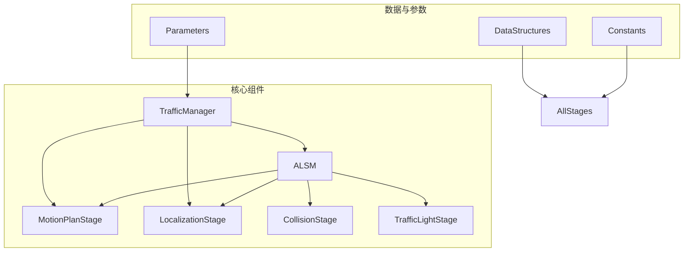

**Diagram sources**
- [TrafficManager.h](https://github.com/carla-simulator/carla/blob/ue5-dev/LibCarla/source/carla/trafficmanager/TrafficManager.h#L26-L407)
- [ALSM.h](https://github.com/carla-simulator/carla/blob/ue5-dev/LibCarla/source/carla/trafficmanager/ALSM.h#L41-L117)
- [MotionPlanStage.h](https://github.com/carla-simulator/carla/blob/ue5-dev/LibCarla/source/carla/trafficmanager/MotionPlanStage.h#L22-L97)
- [LocalizationStage.h](https://github.com/carla-simulator/carla/blob/ue5-dev/LibCarla/source/carla/trafficmanager/LocalizationStage.h#L32-L93)

**Section sources**
- [TrafficManager.h](https://github.com/carla-simulator/carla/blob/ue5-dev/LibCarla/source/carla/trafficmanager/TrafficManager.h#L26-L407)
- [ALSM.h](https://github.com/carla-simulator/carla/blob/ue5-dev/LibCarla/source/carla/trafficmanager/ALSM.h#L41-L117)

## 路径规划与定位机制

### LocalizationStage工作原理

LocalizationStage是交通管理系统中的路径规划核心组件，负责为车辆维护前方的航点序列。该阶段通过`Update`方法周期性地更新每个注册车辆的航点缓冲区，确保车辆能够沿着预定路径行驶。当车辆接近交叉路口时，系统会检测是否处于路口入口，并根据交通规则和安全距离做出相应的决策。

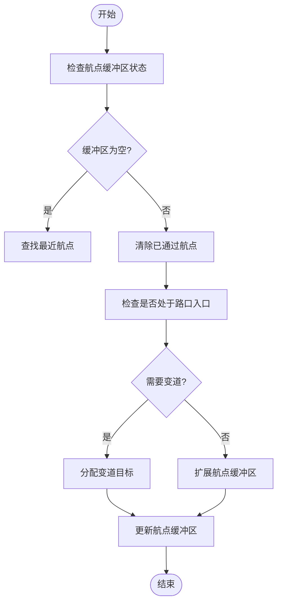

**Diagram sources**
- [LocalizationStage.h](https://github.com/carla-simulator/carla/blob/ue5-dev/LibCarla/source/carla/trafficmanager/LocalizationStage.h#L32-L93)
- [LocalizationStage.cpp](https://github.com/carla-simulator/carla/blob/ue5-dev/LibCarla/source/carla/trafficmanager/LocalizationStage.cpp#L36-L200)

### MotionPlanStage工作原理

MotionPlanStage负责车辆的运动规划和速度控制，它基于定位、碰撞避让和交通灯响应等信息进行决策。该阶段通过PID控制器调节车辆的速度和转向，确保车辆能够安全、平稳地行驶。在检测到潜在碰撞危险时，系统会启动紧急制动程序，避免事故发生。

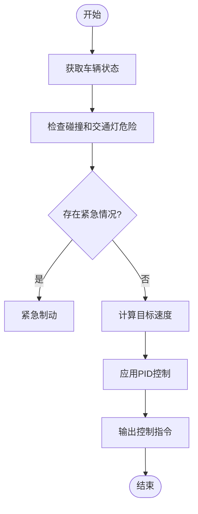

**Diagram sources**
- [MotionPlanStage.h](https://github.com/carla-simulator/carla/blob/ue5-dev/LibCarla/source/carla/trafficmanager/MotionPlanStage.h#L22-L97)
- [MotionPlanStage.cpp](https://github.com/carla-simulator/carla/blob/ue5-dev/LibCarla/source/carla/trafficmanager/MotionPlanStage.cpp#L63-L200)

**Section sources**
- [MotionPlanStage.h](https://github.com/carla-simulator/carla/blob/ue5-dev/LibCarla/source/carla/trafficmanager/MotionPlanStage.h#L22-L97)
- [MotionPlanStage.cpp](https://github.com/carla-simulator/carla/blob/ue5-dev/LibCarla/source/carla/trafficmanager/MotionPlanStage.cpp#L63-L200)

## 车辆行为模型

### 跟车算法实现

跟车算法是交通管理系统中的核心行为模型之一，它通过动态调整车辆速度来保持与前车的安全距离。系统根据车辆的相对速度和距离，采用分级控制策略：当距离大于安全距离时，车辆以目标速度行驶；当距离接近安全距离时，车辆开始减速；当距离小于临界制动距离时，车辆启动紧急制动。

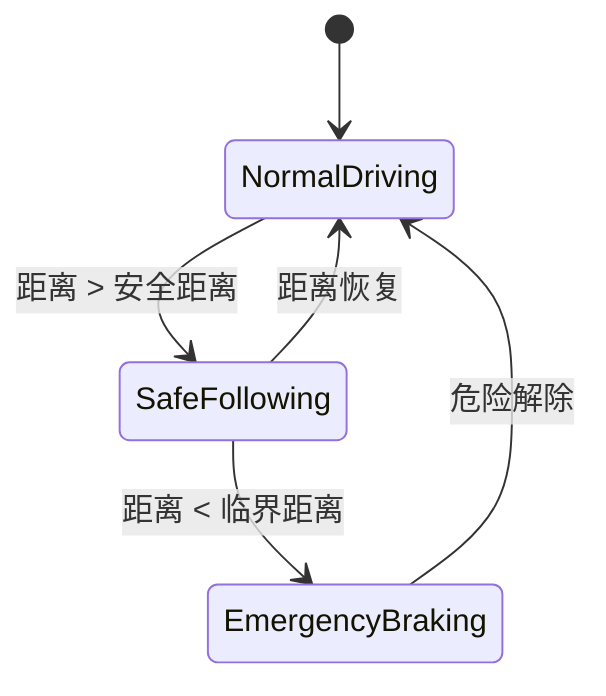

**Diagram sources**
- [MotionPlanStage.cpp](https://github.com/carla-simulator/carla/blob/ue5-dev/LibCarla/source/carla/trafficmanager/MotionPlanStage.cpp#L325-L349)
- [Constants.h](https://github.com/carla-simulator/carla/blob/ue5-dev/LibCarla/source/carla/trafficmanager/Constants.h#L116-L133)

### 变道与超车策略

变道决策由LocalizationStage负责，系统综合考虑多种因素来决定是否进行变道操作。这些因素包括强制变道指令、自动变道设置、保持慢车道概率和随机变道概率等。当满足变道条件时，系统会选择合适的变道目标点，并更新航点缓冲区。

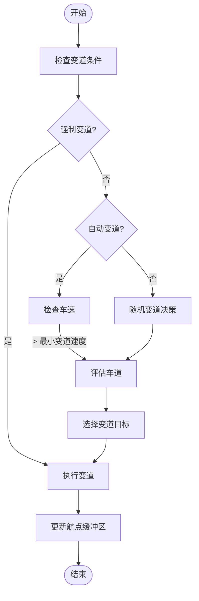

**Diagram sources**
- [LocalizationStage.cpp](https://github.com/carla-simulator/carla/blob/ue5-dev/LibCarla/source/carla/trafficmanager/LocalizationStage.cpp#L113-L177)
- [Constants.h](https://github.com/carla-simulator/carla/blob/ue5-dev/LibCarla/source/carla/trafficmanager/Constants.h#L62-L71)

### 避障算法机制

避障算法通过CollisionStage检测潜在的碰撞危险，并将结果传递给MotionPlanStage进行处理。系统采用动态安全距离模型，根据车辆速度和相对运动状态计算安全距离。当检测到碰撞危险时，系统会根据危险程度采取相应的措施，从减速到紧急制动。

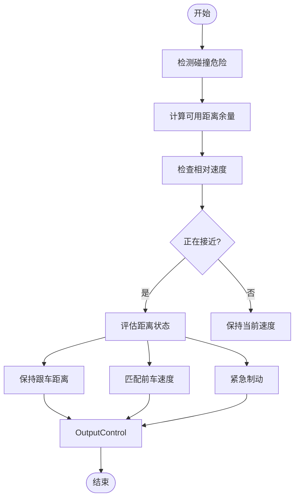

**Diagram sources**
- [MotionPlanStage.cpp](https://github.com/carla-simulator/carla/blob/ue5-dev/LibCarla/source/carla/trafficmanager/MotionPlanStage.cpp#L48-L52)
- [CollisionStage.h](https://github.com/carla-simulator/carla/blob/ue5-dev/LibCarla/source/carla/trafficmanager/CollisionStage.h)

**Section sources**
- [MotionPlanStage.cpp](https://github.com/carla-simulator/carla/blob/ue5-dev/LibCarla/source/carla/trafficmanager/MotionPlanStage.cpp#L48-L52)
- [LocalizationStage.cpp](https://github.com/carla-simulator/carla/blob/ue5-dev/LibCarla/source/carla/trafficmanager/LocalizationStage.cpp#L113-L177)

## 车辆批量生成与管理API

### 车辆生成与注册

交通管理器提供了完整的API接口用于车辆的批量生成和管理。通过`RegisterVehicles`方法可以将一组车辆注册到交通管理系统中，使其接受自动控制。车辆生成通常结合地图的预定义生成点进行，确保车辆在合理的位置出现。

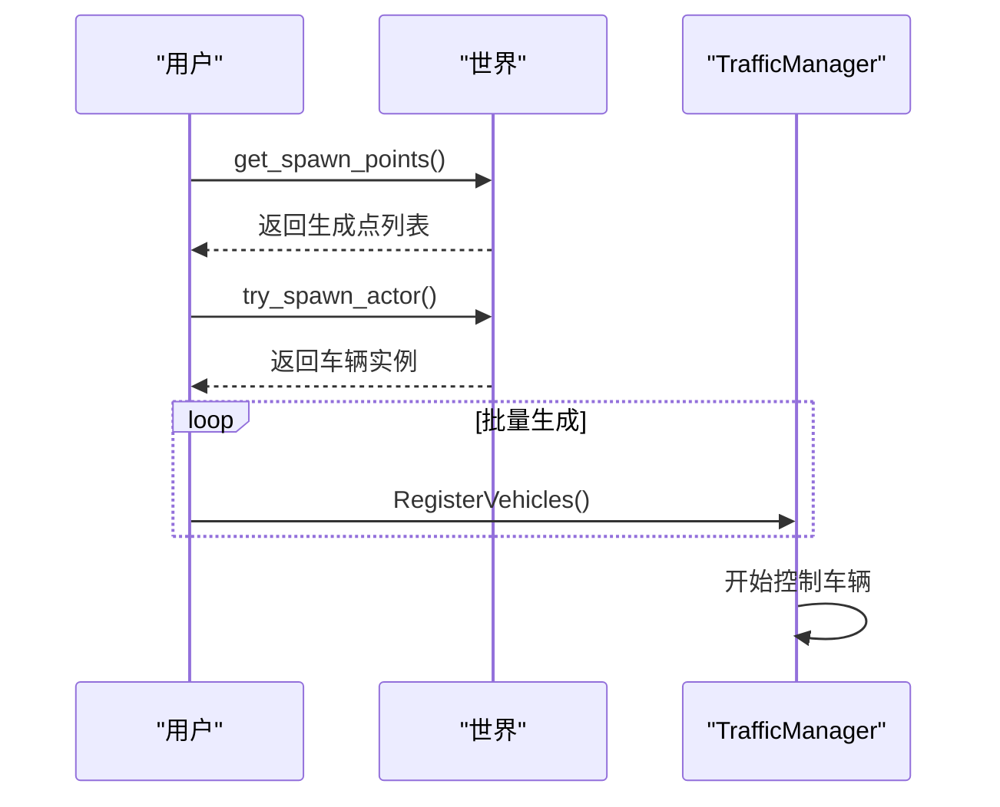

**Diagram sources**
- [TrafficManager.h](https://github.com/carla-simulator/carla/blob/ue5-dev/LibCarla/source/carla/trafficmanager/TrafficManager.h#L155-L161)
- [tuto_G_traffic_manager.md](https://github.com/carla-simulator/carla/blob/ue5-dev/Docs/tuto_G_traffic_manager.md#L61-L78)

### 核心管理API

交通管理器提供了丰富的API接口来控制车辆行为，包括速度控制、车道偏移、碰撞检测等。这些API分为车辆特定设置和全局设置两种类型，允许开发者灵活配置交通场景。

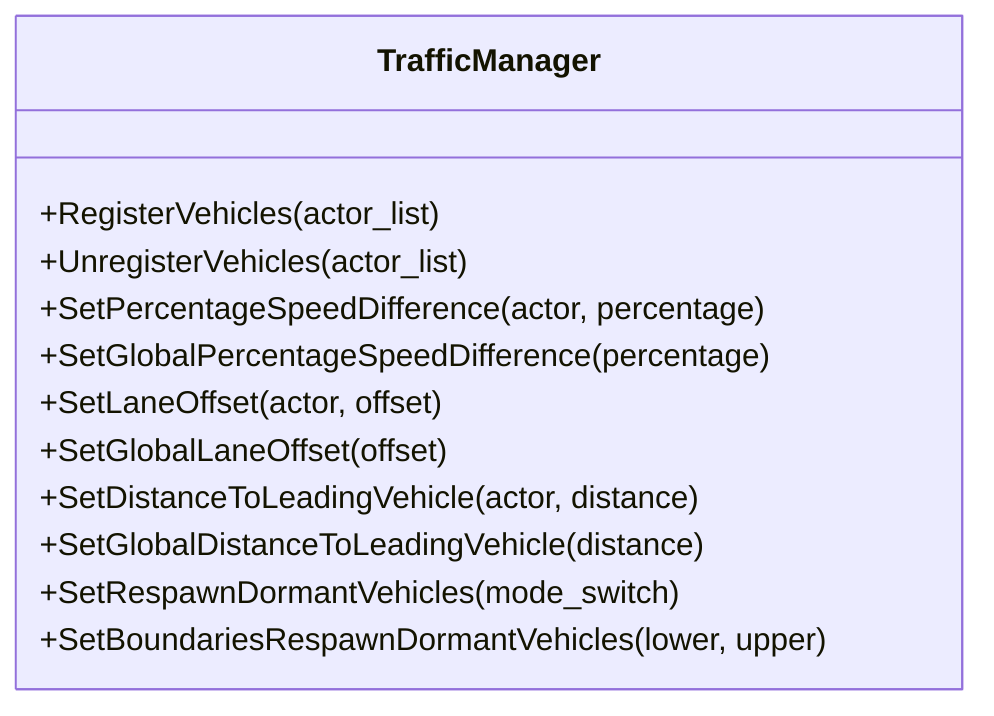

**Diagram sources**
- [TrafficManager.h](https://github.com/carla-simulator/carla/blob/ue5-dev/LibCarla/source/carla/trafficmanager/TrafficManager.h#L117-L137)
- [Parameters.h](https://github.com/carla-simulator/carla/blob/ue5-dev/LibCarla/source/carla/trafficmanager/Parameters.h#L109-L170)

**Section sources**
- [TrafficManager.h](https://github.com/carla-simulator/carla/blob/ue5-dev/LibCarla/source/carla/trafficmanager/TrafficManager.h#L117-L137)
- [Parameters.h](https://github.com/carla-simulator/carla/blob/ue5-dev/LibCarla/source/carla/trafficmanager/Parameters.h#L109-L170)

## 自动驾驶行为参数配置

### 速度控制参数

交通管理器提供了多种速度控制参数，允许开发者精确控制车辆的行驶速度。`SetPercentageSpeedDifference`方法可以设置车辆相对于限速的百分比差异，负值表示超速。`SetGlobalPercentageSpeedDifference`则为所有注册车辆设置全局速度偏差。

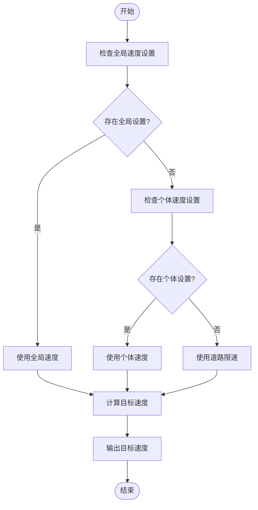

**Diagram sources**
- [Parameters.h](https://github.com/carla-simulator/carla/blob/ue5-dev/LibCarla/source/carla/trafficmanager/Parameters.h#L110-L122)
- [MotionPlanStage.cpp](https://github.com/carla-simulator/carla/blob/ue5-dev/LibCarla/source/carla/trafficmanager/MotionPlanStage.cpp#L134-L135)

### 距离与车道参数

车辆间的最小间距通过`SetDistanceToLeadingVehicle`方法进行配置，该参数直接影响跟车行为的安全性和流畅性。车道偏移参数`SetLaneOffset`允许车辆在车道内进行横向偏移，正值表示向右偏移，负值表示向左偏移。

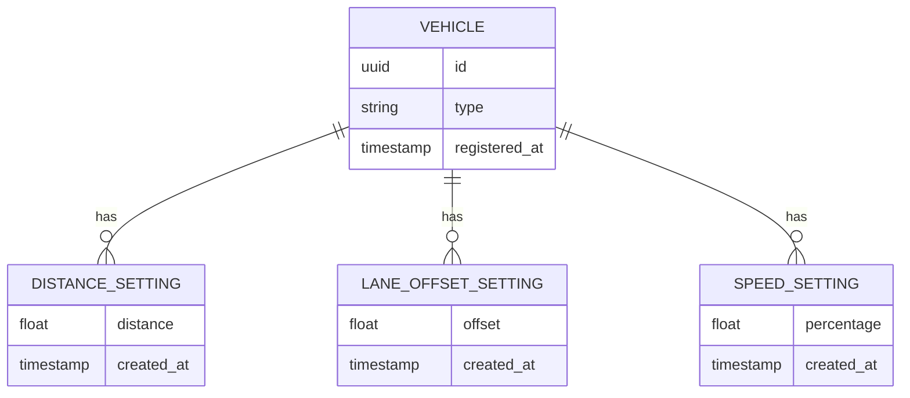

**Diagram sources**
- [Parameters.h](https://github.com/carla-simulator/carla/blob/ue5-dev/LibCarla/source/carla/trafficmanager/Parameters.h#L53-L54)
- [Constants.h](https://github.com/carla-simulator/carla/blob/ue5-dev/LibCarla/source/carla/trafficmanager/Constants.h#L73-L89)

**Section sources**
- [Parameters.h](https://github.com/carla-simulator/carla/blob/ue5-dev/LibCarla/source/carla/trafficmanager/Parameters.h#L53-L54)
- [MotionPlanStage.cpp](https://github.com/carla-simulator/carla/blob/ue5-dev/LibCarla/source/carla/trafficmanager/MotionPlanStage.cpp#L143-L147)

## ALSM状态机与PID控制器

### ALSM状态机作用

ALSM（Agent Lifecycle and State Management）是交通管理系统中的核心状态管理组件，负责跟踪和管理所有注册车辆的生命周期。它维护车辆的静态属性和动态状态，处理车辆的创建、销毁和状态更新。ALSM还负责在混合物理模式下管理车辆的物理状态切换。

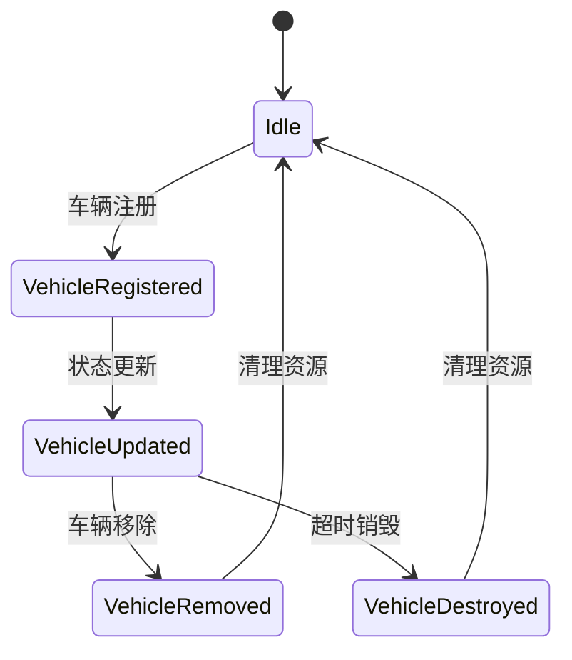

**Diagram sources**
- [ALSM.h](https://github.com/carla-simulator/carla/blob/ue5-dev/LibCarla/source/carla/trafficmanager/ALSM.h#L41-L117)
- [ALSM.cpp](https://github.com/carla-simulator/carla/blob/ue5-dev/LibCarla/source/carla/trafficmanager/ALSM.cpp#L45-L200)

### PID控制器实现

PID控制器是车辆速度调节的核心组件，它通过比例-积分-微分算法计算油门、刹车和转向控制信号。系统根据车辆当前速度与目标速度的偏差，以及角偏差，实时调整控制输出。PID参数根据道路条件（城市或高速公路）动态选择，确保控制效果的最优化。

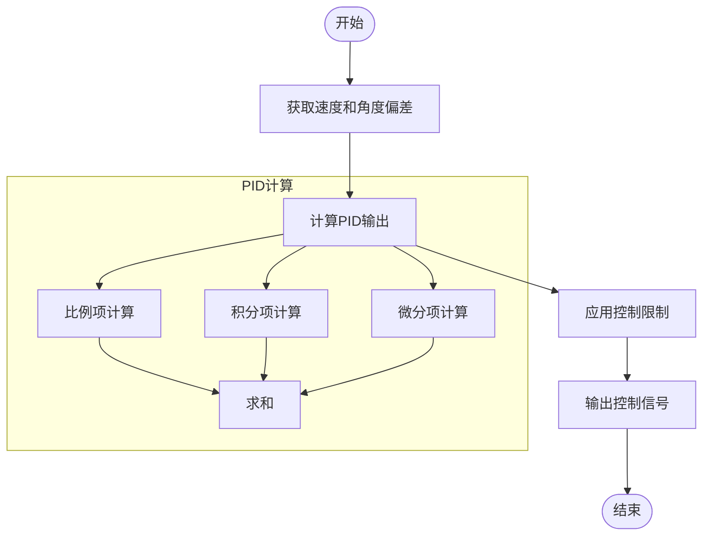

**Diagram sources**
- [PIDController.h](https://github.com/carla-simulator/carla/blob/ue5-dev/LibCarla/source/carla/trafficmanager/PIDController.h#L27-L59)
- [Constants.h](https://github.com/carla-simulator/carla/blob/ue5-dev/LibCarla/source/carla/trafficmanager/Constants.h#L145-L155)

**Section sources**
- [PIDController.h](https://github.com/carla-simulator/carla/blob/ue5-dev/LibCarla/source/carla/trafficmanager/PIDController.h#L27-L59)
- [MotionPlanStage.cpp](https://github.com/carla-simulator/carla/blob/ue5-dev/LibCarla/source/carla/trafficmanager/MotionPlanStage.cpp#L186-L195)

## 性能优化与多线程调度

### 多线程架构

交通管理系统采用多线程架构来提高性能和响应速度。不同阶段的计算任务可以在独立的线程中并行执行，通过共享内存和原子操作进行数据同步。这种设计充分利用了现代多核处理器的计算能力，确保系统能够在高密度交通场景下稳定运行。

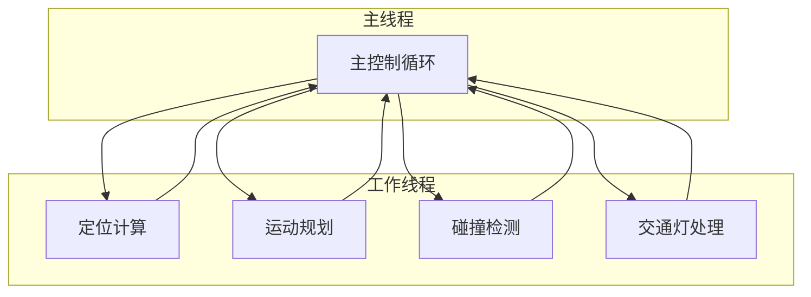

**Diagram sources**
- [TrafficManager.h](https://github.com/carla-simulator/carla/blob/ue5-dev/LibCarla/source/carla/trafficmanager/TrafficManager.h)
- [ALSM.h](https://github.com/carla-simulator/carla/blob/ue5-dev/LibCarla/source/carla/trafficmanager/ALSM.h)

### 性能优化策略

系统通过多种策略进行性能优化，包括数据结构优化、算法复杂度降低和缓存机制。例如，使用哈希表和原子操作来高效管理大量车辆的状态；采用空间索引技术加速航点查找；通过预计算和缓存减少重复计算。这些优化措施确保系统能够在大规模交通场景下保持高性能。

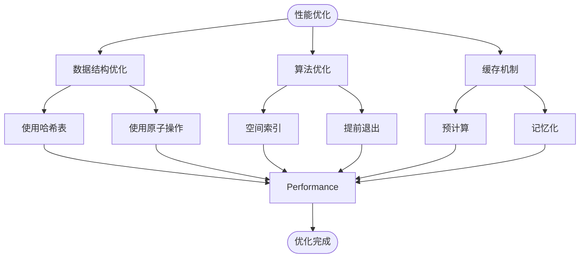

**Diagram sources**
- [DataStructures.h](https://github.com/carla-simulator/carla/blob/ue5-dev/LibCarla/source/carla/trafficmanager/DataStructures.h)
- [Constants.h](https://github.com/carla-simulator/carla/blob/ue5-dev/LibCarla/source/carla/trafficmanager/Constants.h#L92-L96)

**Section sources**
- [DataStructures.h](https://github.com/carla-simulator/carla/blob/ue5-dev/LibCarla/source/carla/trafficmanager/DataStructures.h)
- [Constants.h](https://github.com/carla-simulator/carla/blob/ue5-dev/LibCarla/source/carla/trafficmanager/Constants.h#L92-L96)

## 结论

CARLA的交通管理系统通过模块化设计和多阶段协同工作，实现了复杂而真实的交通场景模拟。系统核心由LocalizationStage和MotionPlanStage构成，前者负责路径规划和车道变更，后者负责运动规划和速度控制。ALSM状态机确保了车辆生命周期的正确管理，而PID控制器则提供了精确的速度调节。通过丰富的API接口，开发者可以灵活配置车辆行为，创建各种交通场景。系统的多线程架构和性能优化策略确保了在高密度交通场景下的稳定运行。这些特性使得CARLA成为自动驾驶算法开发和测试的理想平台。