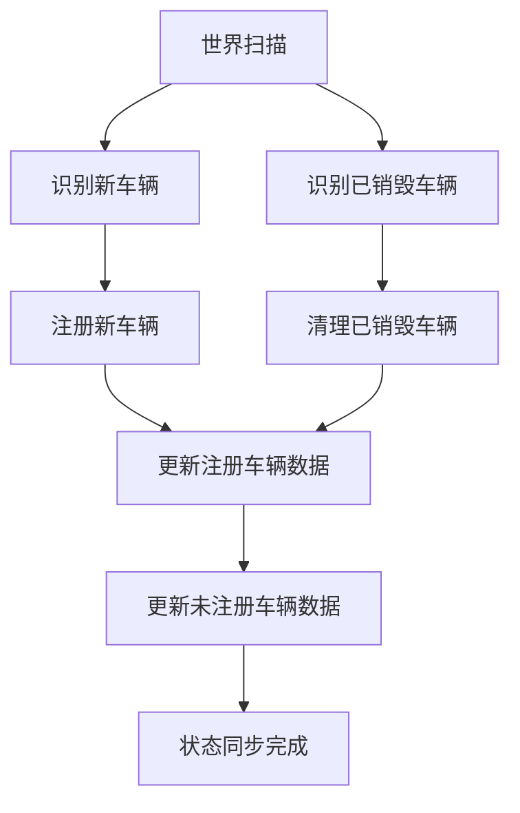
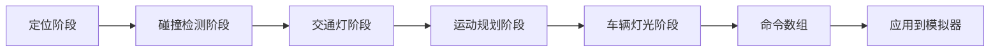
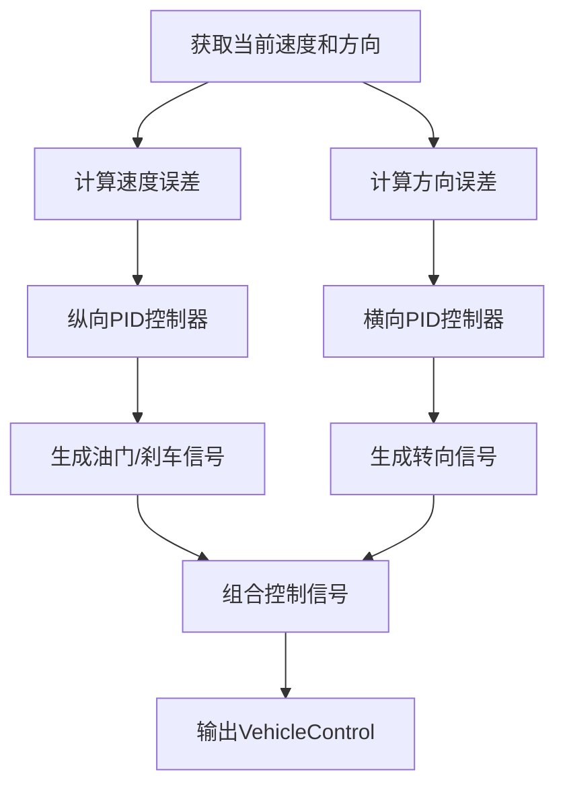

# 行为决策逻辑


**本文档引用的文件**   
- [ALSM.cpp](https://github.com/carla-simulator/carla/blob/ue5-dev/LibCarla/source/carla/trafficmanager/ALSM.cpp)
- [ALSM.h](https://github.com/carla-simulator/carla/blob/ue5-dev/LibCarla/source/carla/trafficmanager/ALSM.h)
- [PIDController.h](https://github.com/carla-simulator/carla/blob/ue5-dev/LibCarla/source/carla/trafficmanager/PIDController.h)
- [TrafficManager.h](https://github.com/carla-simulator/carla/blob/ue5-dev/LibCarla/source/carla/trafficmanager/TrafficManager.h)
- [VehicleControl.h](https://github.com/carla-simulator/carla/blob/ue5-dev/LibCarla/rpc/VehicleControl.h)
- [Constants.h](https://github.com/carla-simulator/carla/blob/ue5-dev/LibCarla/source/carla/trafficmanager/Constants.h)
- [DataStructures.h](https://github.com/carla-simulator/carla/blob/ue5-dev/LibCarla/source/carla/trafficmanager/DataStructures.h)
- [MotionPlanStage.h](https://github.com/carla-simulator/carla/blob/ue5-dev/LibCarla/source/carla/trafficmanager/MotionPlanStage.h)
- [LocalizationStage.h](https://github.com/carla-simulator/carla/blob/ue5-dev/LibCarla/source/carla/trafficmanager/LocalizationStage.h)
- [Parameters.h](https://github.com/carla-simulator/carla/blob/ue5-dev/LibCarla/source/carla/trafficmanager/Parameters.h)
- [SimulationState.h](https://github.com/carla-simulator/carla/blob/ue5-dev/LibCarla/source/carla/trafficmanager/SimulationState.h)
- [TrafficManager.cpp](https://github.com/carla-simulator/carla/blob/ue5-dev/PythonAPI/carla/src/TrafficManager.cpp)
- [tuto_G_traffic_manager.md](https://github.com/carla-simulator/carla/blob/ue5-dev/Docs/tuto_G_traffic_manager.md)
- [adv_traffic_manager.md](https://github.com/carla-simulator/carla/blob/ue5-dev/Docs/adv_traffic_manager.md)


## 目录
1. [引言](#引言)
2. [高级本地化状态机（ALSM）](#高级本地化状态机alsm)
3. [驾驶状态转换管理](#驾驶状态转换管理)
4. [PID控制器与速度调节](#pid控制器与速度调节)
5. [车辆控制接口](#车辆控制接口)
6. [变道决策算法](#变道决策算法)
7. [TrafficManager行为参数配置](#trafficmanager行为参数配置)
8. [初学者指南：驾驶行为直观解释](#初学者指南驾驶行为直观解释)
9. [高级开发者指南：多目标优化与风险评估](#高级开发者指南多目标优化与风险评估)
10. [结论](#结论)

## 引言

CARLA模拟器中的行为决策逻辑是自动驾驶仿真系统的核心，它通过TrafficManager（交通管理器）模块实现对非玩家车辆（NPC）的智能控制。该系统基于高级本地化状态机（ALSM）架构，能够管理车辆的巡航、跟车、变道、超车和紧急制动等多种驾驶状态。本指南将深入解析ALSM如何协调各个决策阶段，利用PID控制器进行精确的速度和方向控制，并通过`VehicleControl`接口实现油门、刹车和转向的协同。同时，我们将探讨变道决策算法中的安全距离评估、盲区检测和轨迹预测机制，并提供配置`TrafficManager`行为参数（如`distance_threshold`和`percentage_speed_difference`）的实际代码示例。无论您是初学者还是高级开发者，都能从本文中获得对CARLA行为决策系统的全面理解。

## 高级本地化状态机（ALSM）

高级本地化状态机（ALSM）是CARLA交通管理器的核心组件，负责管理所有受控车辆的生命周期和状态。它作为整个决策系统的入口点，定期扫描模拟环境，识别新出现和已销毁的车辆，并更新其内部状态缓存。

ALSM的主要职责包括：
1.  **生命周期管理**：通过`IdentifyDestroyedActors`和`IdentifyNewActors`方法，ALSM能够检测到场景中车辆的创建和销毁事件，并相应地更新注册车辆列表。
2.  **状态同步**：ALSM通过`UpdateRegisteredActorsData`和`UpdateUnregisteredActorsData`方法，从CARLA服务器获取车辆的实时位置、速度、旋转和交通灯状态等信息，并将其存储在`SimulationState`中，为后续的决策阶段提供数据支持。
3.  **混合物理模式**：ALSM实现了混合物理模式（Hybrid Physics Mode），通过`SetHybridPhysicsMode`和`SetHybridPhysicsRadius`参数，可以动态地为靠近“英雄车辆”（hero vehicle）的NPC开启物理模拟，而对远处的车辆则通过瞬移（teleportation）来更新位置，从而在保证仿真真实感的同时大幅提升性能。



**图源**
- [ALSM.cpp](https://github.com/carla-simulator/carla/blob/ue5-dev/LibCarla/source/carla/trafficmanager/ALSM.cpp#L45-L113)

**本节来源**
- [ALSM.cpp](https://github.com/carla-simulator/carla/blob/ue5-dev/LibCarla/source/carla/trafficmanager/ALSM.cpp#L1-L397)
- [ALSM.h](https://github.com/carla-simulator/carla/blob/ue5-dev/LibCarla/source/carla/trafficmanager/ALSM.h#L1-L117)
- [adv_traffic_manager.md](https://github.com/carla-simulator/carla/blob/ue5-dev/Docs/adv_traffic_manager.md#alsm)

## 驾驶状态转换管理

ALSM通过一个复杂的控制循环来管理车辆的驾驶状态转换。这个循环由多个阶段组成，每个阶段负责特定的决策任务，共同决定了车辆的最终行为。

### 状态机与决策阶段

CARLA的驾驶状态并非一个简单的有限状态机，而是由五个协同工作的阶段构成的流水线：

1.  **定位阶段（Localization Stage）**：此阶段为车辆规划一条由一系列航点（waypoint）组成的未来路径。它利用内存地图（In-Memory Map）来确定车辆当前位置，并根据道路拓扑结构和用户设定的参数（如车道偏移）生成一条平滑的轨迹。
2.  **碰撞检测阶段（Collision Stage）**：在路径生成后，此阶段会检查车辆路径上是否存在潜在的碰撞风险。它通过扩展车辆的包围盒（bounding box）并沿路径进行扫描，来预测与前方车辆或行人的碰撞可能性。
3.  **交通灯阶段（Traffic Light Stage）**：此阶段负责处理交通信号灯、停车标志和无信号灯路口的优先级问题。它会判断车辆是否处于红灯或黄灯的影响范围内，或者是否需要在路口让行。
4.  **运动规划阶段（Motion Plan Stage）**：这是决策的核心阶段。它综合前三个阶段的信息，计算出车辆应采取的具体动作。例如，如果前方有碰撞风险或红灯，它会决定减速或停车；如果路径畅通，则维持巡航速度。
5.  **车辆灯光阶段（Vehicle Light Stage）**：此阶段根据车辆的行驶意图（如即将转弯）和环境条件（如天气、光照）来自动控制车灯的开关，如转向灯、刹车灯和近光灯。

这些阶段按顺序执行，形成一个同步的控制循环，确保所有车辆在同一时间步内完成决策。



**图源**
- [adv_traffic_manager.md](https://github.com/carla-simulator/carla/blob/ue5-dev/Docs/adv_traffic_manager.md#architecture)

**本节来源**
- [adv_traffic_manager.md](https://github.com/carla-simulator/carla/blob/ue5-dev/Docs/adv_traffic_manager.md#stages-of-the-control-loop)
- [LocalizationStage.h](https://github.com/carla-simulator/carla/blob/ue5-dev/LibCarla/source/carla/trafficmanager/LocalizationStage.h#L1-L93)
- [CollisionStage.cpp](https://github.com/carla-simulator/carla/blob/ue5-dev/LibCarla/source/carla/trafficmanager/CollisionStage.cpp)
- [TrafficLightStage.cpp](https://github.com/carla-simulator/carla/blob/ue5-dev/LibCarla/source/carla/trafficmanager/TrafficLightStage.cpp)
- [MotionPlanStage.h](https://github.com/carla-simulator/carla/blob/ue5-dev/LibCarla/source/carla/trafficmanager/MotionPlanStage.h#L1-L97)
- [VehicleLightStage.cpp](https://github.com/carla-simulator/carla/blob/ue5-dev/LibCarla/source/carla/trafficmanager/VehicleLightStage.cpp)

## PID控制器与速度调节

在运动规划阶段，CARLA使用PID（比例-积分-微分）控制器来精确调节车辆的速度和方向，使其能够平滑地跟踪目标航点。

### PID控制原理

PID控制器通过计算当前状态与目标状态之间的误差，并根据误差的比例（P）、积分（I）和微分（D）来生成控制信号。在CARLA中，纵向（速度）和横向（转向）控制分别使用独立的PID控制器。

-   **纵向控制（油门/刹车）**：控制器的目标是使车辆的实际速度与期望速度（由`GetVehicleTargetVelocity`根据`percentage_speed_difference`等参数计算得出）相匹配。其输出为油门或刹车信号。
-   **横向控制（转向）**：控制器的目标是使车辆的朝向与路径的切线方向对齐。其输出为转向信号。

### 参数配置

PID控制器的性能由一组参数决定，这些参数在`Constants.h`文件中定义：

```cpp
namespace PID {
  static const float MAX_THROTTLE = 0.85f; // 最大油门
  static const float MAX_BRAKE = 0.7f;     // 最大刹车
  static const float MAX_STEERING = 0.8f;  // 最大转向
  static const std::vector<float> LONGITUDIAL_PARAM = {12.0f, 0.05f, 0.02f}; // 纵向PID参数 [Kp, Ki, Kd]
  static const std::vector<float> LATERAL_PARAM = {8.0f, 0.04f, 0.16f};      // 横向PID参数 [Kp, Ki, Kd]
}
```

开发者可以根据需要调整这些参数以获得不同的驾驶风格，例如更激进或更保守的加减速。



**图源**
- [PIDController.h](https://github.com/carla-simulator/carla/blob/ue5-dev/LibCarla/source/carla/trafficmanager/PIDController.h#L27-L58)

**本节来源**
- [PIDController.h](https://github.com/carla-simulator/carla/blob/ue5-dev/LibCarla/source/carla/trafficmanager/PIDController.h#L1-L64)
- [Constants.h](https://github.com/carla-simulator/carla/blob/ue5-dev/LibCarla/source/carla/trafficmanager/Constants.h#L145-L155)
- [MotionPlanStage.h](https://github.com/carla-simulator/carla/blob/ue5-dev/LibCarla/source/carla/trafficmanager/MotionPlanStage.h#L29-L33)

## 车辆控制接口

CARLA通过`VehicleControl`结构体来实现对车辆的精确控制。这个接口是运动规划阶段的最终输出，包含了油门、刹车、转向等所有控制指令。

### VehicleControl结构

`VehicleControl`结构体定义了车辆控制的所有参数：

```cpp
class VehicleControl {
public:
  float throttle = 0.0f;        // 油门 (0.0 到 1.0)
  float steer = 0.0f;           // 转向 (-1.0 到 1.0, 左负右正)
  float brake = 0.0f;           // 刹车 (0.0 到 1.0)
  bool hand_brake = false;      // 手刹
  bool reverse = false;         // 倒车
  bool manual_gear_shift = false; // 手动换挡
  int32_t gear = 0;             // 挡位
};
```

运动规划阶段会根据PID控制器的输出，填充`throttle`、`brake`和`steer`字段，然后将这个`VehicleControl`对象打包成一个命令，最终通过`apply_batch`或`apply_batch_sync`方法批量应用到模拟器中。

**本节来源**
- [VehicleControl.h](https://github.com/carla-simulator/carla/blob/ue5-dev/LibCarla/rpc/VehicleControl.h#L1-L101)
- [TrafficManagerLocal.cpp](https://github.com/carla-simulator/carla/blob/ue5-dev/LibCarla/source/carla/trafficmanager/TrafficManagerLocal.cpp)

## 变道决策算法

变道是自动驾驶中一个复杂的决策过程，CARLA的变道决策算法综合考虑了安全、效率和用户指令等多个因素。

### 决策流程

1.  **触发条件**：
    *   **强制变道**：通过`SetForceLaneChange` API，可以强制车辆向左或向右变道，忽略碰撞风险。
    *   **自动变道**：当`SetAutoLaneChange`启用时，车辆会根据以下条件自动决策：
        *   **速度**：当前车道速度过慢（可通过`SetKeepSlowLanePercentage`设置偏好）。
        *   **障碍物**：前方有慢速车辆，且目标车道安全。
        *   **随机性**：根据`SetRandomLeftLaneChangePercentage`和`SetRandomRightLaneChangePercentage`设置的概率随机变道。

2.  **安全评估**：
    *   **安全距离**：算法会计算与目标车道前后车辆的距离，确保有足够的安全间隔。`distance_to_leading_vehicle`参数定义了与前车的最小距离。
    *   **盲区检测**：通过扩展车辆的包围盒并检查路径重叠，来判断目标车道是否存在潜在的碰撞风险。
    *   **轨迹预测**：系统会预测周围车辆的未来轨迹，以评估变道动作的长期安全性。

3.  **执行**：一旦决策为安全，定位阶段会修改车辆的航点路径，使其平滑地过渡到目标车道。

**本节来源**
- [LocalizationStage.h](https://github.com/carla-simulator/carla/blob/ue5-dev/LibCarla/source/carla/trafficmanager/LocalizationStage.h#L49-L52)
- [Parameters.h](https://github.com/carla-simulator/carla/blob/ue5-dev/LibCarla/source/carla/trafficmanager/Parameters.h#L55-L71)
- [Constants.h](https://github.com/carla-simulator/carla/blob/ue5-dev/LibCarla/source/carla/trafficmanager/Constants.h#L62-L71)
- [adv_traffic_manager.md](https://github.com/carla-simulator/carla/blob/ue5-dev/Docs/adv_traffic_manager.md#lane-changes)

## TrafficManager行为参数配置

`TrafficManager`提供了丰富的API来配置NPC车辆的行为，使其适应不同的测试场景。

### 关键参数配置

| 参数 | API方法 | 说明 |
| :--- | :--- | :--- |
| **速度控制** | `SetPercentageSpeedDifference` | 设置车辆相对于限速的百分比差异（负值表示超速）。 |
| | `SetGlobalPercentageSpeedDifference` | 为所有车辆设置全局速度百分比差异。 |
| | `SetDesiredSpeed` | 为车辆设置精确的目标速度（m/s）。 |
| **跟车距离** | `SetDistanceToLeadingVehicle` | 设置车辆与前车的最小距离（米）。 |
| | `SetGlobalDistanceToLeadingVehicle` | 为所有车辆设置全局最小跟车距离。 |
| **变道行为** | `SetAutoLaneChange` | 启用/禁用车辆的自动变道功能。 |
| | `SetForceLaneChange` | 强制车辆立即向左或向右变道。 |
| | `SetRandomLeft/RightLaneChangePercentage` | 设置车辆随机向左/右变道的概率。 |
| **交通规则遵守** | `SetPercentageRunningLight` | 设置车辆闯红灯的概率。 |
| | `SetPercentageRunningSign` | 设置车辆闯停车标志的概率。 |
| | `SetPercentageIgnoreVehicles/Walkers` | 设置车辆忽略其他车辆/行人的概率。 |
| **混合物理模式** | `SetHybridPhysicsMode` | 启用/禁用混合物理模式。 |
| | `SetHybridPhysicsRadius` | 设置混合物理模式的作用半径（米）。 |

### Python代码示例

```python
# 获取TrafficManager实例
tm = client.get_trafficmanager(port)

# 配置特定车辆的行为
vehicle = world.get_actors().filter('vehicle.*')[0]

tm.set_desired_speed(vehicle, 30.0) # 设置目标速度为30m/s
tm.set_distance_to_leading_vehicle(vehicle, 5.0) # 设置跟车距离为5米
tm.set_percentage_running_light(vehicle, 50.0) # 50%概率闯红灯
tm.set_auto_lane_change(vehicle, True) # 启用自动变道

# 配置全局行为
tm.set_global_distance_to_leading_vehicle(10.0) # 所有车辆最小跟车距离10米
tm.set_global_percentage_speed_difference(-10.0) # 所有车辆超速10%
tm.set_hybrid_physics_mode(True) # 启用混合物理模式
tm.set_hybrid_physics_radius(70.0) # 设置作用半径为70米
```

**本节来源**
- [TrafficManager.h](https://github.com/carla-simulator/carla/blob/ue5-dev/LibCarla/source/carla/trafficmanager/TrafficManager.h#L173-L344)
- [Parameters.h](https://github.com/carla-simulator/carla/blob/ue5-dev/LibCarla/source/carla/trafficmanager/Parameters.h#L109-L170)
- [TrafficManager.cpp](https://github.com/carla-simulator/carla/blob/ue5-dev/PythonAPI/carla/src/TrafficManager.cpp#L76-L112)
- [tuto_G_traffic_manager.md](https://github.com/carla-simulator/carla/blob/ue5-dev/Docs/tuto_G_traffic_manager.md#controlling-vehicles-with-traffic-manager)
- [adv_traffic_manager.md](https://github.com/carla-simulator/carla/blob/ue5-dev/Docs/adv_traffic_manager.md#vehicle-behavior-considerations)

## 初学者指南：驾驶行为直观解释

对于初学者来说，可以将CARLA中NPC车辆的驾驶行为理解为一个“自动驾驶司机”。

1.  **“眼睛”和“耳朵”**：车辆通过`SimulationState`感知世界，就像司机用眼睛看路、用耳朵听喇叭一样。它知道自己的位置、速度、前方是否有车、交通灯是什么颜色。
2.  **“大脑”**：`ALSM`和五个决策阶段构成了车辆的“大脑”。它会思考：“我现在在哪条车道？”（定位），“前面会不会撞上？”（碰撞检测），“红灯了要停车吗？”（交通灯），然后做出决定：“我该加速、减速还是变道？”（运动规划）。
3.  **“手脚”**：`PID控制器`就像是车辆的“小脑”，负责精细操作。当“大脑”决定要加速时，`PID控制器`会精确地计算出踩多少油门；当决定要转弯时，它会计算出方向盘该打多少度。
4.  **“性格”**：通过`TrafficManager`的API，你可以改变这个“司机”的性格。比如，把`percentage_speed_difference`设为负值，他就变成了一个“路怒症”司机，喜欢超速；把`distance_to_leading_vehicle`设得很小，他就变成了一个“跟车狂”，喜欢紧贴前车。

通过调整这些“性格”参数，你就可以创造出从温和到激进的各种驾驶风格，用于测试你的自动驾驶算法。

**本节来源**
- [tuto_G_traffic_manager.md](https://github.com/carla-simulator/carla/blob/ue5-dev/Docs/tuto_G_traffic_manager.md)
- [adv_traffic_manager.md](https://github.com/carla-simulator/carla/blob/ue5-dev/Docs/adv_traffic_manager.md#vehicle-behavior-considerations)

## 高级开发者指南：多目标优化与风险评估

对于高级开发者，CARLA的行为决策系统是一个复杂的多目标优化问题。

### 多目标优化

车辆的决策过程需要在多个相互冲突的目标之间进行权衡：
*   **效率**：尽快到达目的地（通过保持高速和选择最优车道）。
*   **安全性**：避免碰撞，遵守交通规则。
*   **舒适性**：平滑的加减速和转向，避免急刹和猛打方向。
*   **合规性**：遵守用户设定的行为规则（如不闯红灯）。

ALSM通过分层决策的方式解决这个问题：低层级的PID控制器确保舒适性，中层级的运动规划确保安全性和效率，高层级的用户参数则定义了合规性的边界。

### 风险评估模型

CARLA的风险评估主要基于几何和运动学预测：
1.  **几何风险**：通过扩展车辆的包围盒（`BOUNDARY_EXTENSION_RATE`）并检查路径交叉来评估即时碰撞风险。
2.  **时间风险**：通过计算相对速度和距离，预测未来某个时间点的碰撞可能性。
3.  **不确定性处理**：通过引入随机性（`RandomGenerator`）和概率参数（如`perc_ignore_vehicles`），模型能够模拟人类驾驶员的不确定行为。

开发者可以通过深入理解`CollisionStage`和`MotionPlanStage`的源码，进一步定制风险评估模型，例如引入更复杂的机器学习预测器来替代简单的几何检查。

**本节来源**
- [CollisionStage.cpp](https://github.com/carla-simulator/carla/blob/ue5-dev/LibCarla/source/carla/trafficmanager/CollisionStage.cpp)
- [MotionPlanStage.h](https://github.com/carla-simulator/carla/blob/ue5-dev/LibCarla/source/carla/trafficmanager/MotionPlanStage.h#L48-L52)
- [Constants.h](https://github.com/carla-simulator/carla/blob/ue5-dev/LibCarla/source/carla/trafficmanager/Constants.h#L73-L89)
- [RandomGenerator.h](https://github.com/carla-simulator/carla/blob/ue5-dev/LibCarla/source/carla/trafficmanager/RandomGenerator.h)

## 结论

CARLA的行为决策逻辑是一个高度模块化和可配置的系统。其核心是基于ALSM的控制循环，通过定位、碰撞检测、交通灯响应、运动规划和灯光控制五个阶段的协同工作，实现了对NPC车辆的智能管理。PID控制器提供了精确的速度和方向调节能力，而`VehicleControl`接口则是连接决策与执行的桥梁。丰富的`TrafficManager` API使得开发者可以轻松地模拟各种驾驶场景。无论是为初学者提供直观的驾驶行为模型，还是为高级开发者提供深入的多目标优化和风险评估框架，CARLA都为自动驾驶的研发和测试提供了强大的支持。