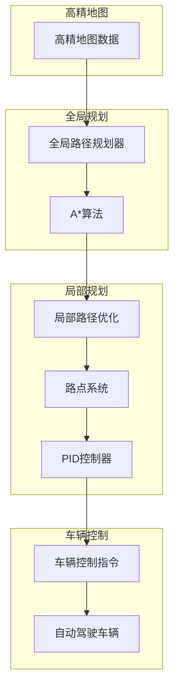
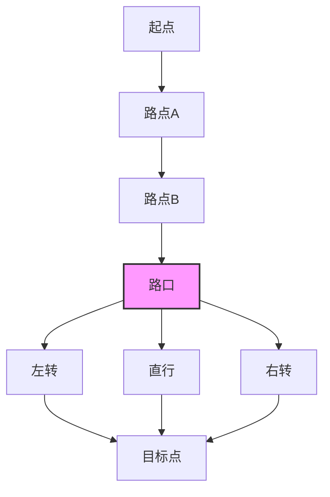
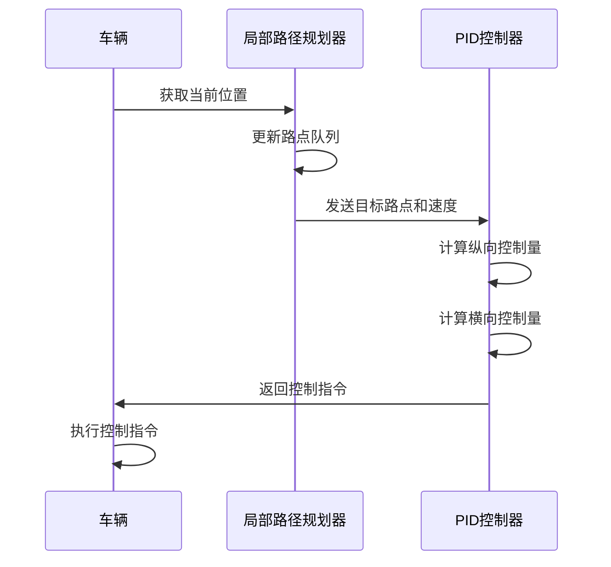
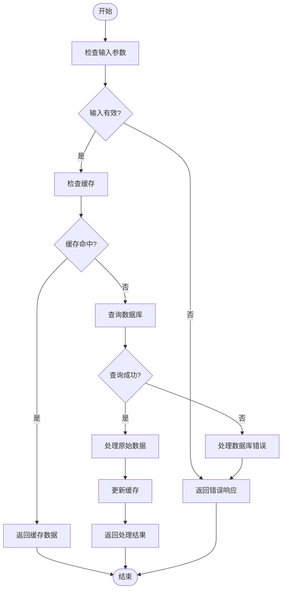

# 路径规划与导航

> **引用文件**
> **本文档引用的文件**

- [MotionPlanStage.h](https://github.com/carla-simulator/carla/blob/ue5-dev/LibCarla/source/carla/trafficmanager/MotionPlanStage.h)
- [MotionPlanStage.cpp](https://github.com/carla-simulator/carla/blob/ue5-dev/LibCarla/source/carla/trafficmanager/MotionPlanStage.cpp)
- [LocalizationStage.h](https://github.com/carla-simulator/carla/blob/ue5-dev/LibCarla/source/carla/trafficmanager/LocalizationStage.h)
- [LocalizationStage.cpp](https://github.com/carla-simulator/carla/blob/ue5-dev/LibCarla/source/carla/trafficmanager/LocalizationStage.cpp)
- [SimpleWaypoint.h](https://github.com/carla-simulator/carla/blob/ue5-dev/LibCarla/source/carla/trafficmanager/SimpleWaypoint.h)
- [SimpleWaypoint.cpp](https://github.com/carla-simulator/carla/blob/ue5-dev/LibCarla/source/carla/trafficmanager/SimpleWaypoint.cpp)
- [InMemoryMap.h](https://github.com/carla-simulator/carla/blob/ue5-dev/LibCarla/source/carla/trafficmanager/InMemoryMap.h)
- [InMemoryMap.cpp](https://github.com/carla-simulator/carla/blob/ue5-dev/LibCarla/source/carla/trafficmanager/InMemoryMap.cpp)
- [Parameters.h](https://github.com/carla-simulator/carla/blob/ue5-dev/LibCarla/source/carla/trafficmanager/Parameters.h)
- [Parameters.cpp](https://github.com/carla-simulator/carla/blob/ue5-dev/LibCarla/source/carla/trafficmanager/Parameters.cpp)
- [global_route_planner.py](https://github.com/carla-simulator/carla/blob/ue5-dev/PythonAPI/carla/agents/navigation/global_route_planner.py)
- [local_planner.py](https://github.com/carla-simulator/carla/blob/ue5-dev/PythonAPI/carla/agents/navigation/local_planner.py)
- [controller.py](https://github.com/carla-simulator/carla/blob/ue5-dev/PythonAPI/carla/agents/navigation/controller.py)
- [basic_agent.py](https://github.com/carla-simulator/carla/blob/ue5-dev/PythonAPI/carla/agents/navigation/basic_agent.py)

## 目录

1. [引言](#引言)
2. [核心组件分析](#核心组件分析)
3. [路径规划架构](#路径规划架构)
4. [全局路径规划](#全局路径规划)
5. [局部路径优化](#局部路径优化)
6. [路径平滑与车道保持](#路径平滑与车道保持)
7. [Python API 应用示例](#python-api应用示例)
8. [结论](#结论)

## 引言

CARLA 仿真平台提供了一套完整的路径规划与导航系统，该系统基于高精地图数据为自动驾驶车辆生成安全、高效的行驶轨迹。本文档深入解析了 CARLA 中 MotionPlanStage 和 LocalizationStage 等核心组件的工作机制，详细阐述了从全局路径规划到局部路径优化的完整流程。系统利用 A\*算法在高精地图上进行全局路径搜索，并通过 Waypoint 系统提供连续的导航点序列。同时，文档还涵盖了路径冲突检测、动态重规划以及通过 Python API 获取和可视化规划路径的实际应用方法，为开发者提供了从理论到实践的全面指导。

## 核心组件分析

CARLA 的路径规划系统由多个核心组件协同工作，主要包括 MotionPlanStage（运动规划阶段）、LocalizationStage（定位阶段）、SimpleWaypoint（简化路点）和 InMemoryMap（内存地图）等。

MotionPlanStage 是路径规划系统的核心，负责根据车辆的当前状态、碰撞风险和交通信号灯信息，计算出最优的控制指令。该组件通过 PID 控制器调节车辆的纵向速度和横向转向，确保车辆能够平稳、安全地沿预定轨迹行驶。在紧急情况下，如检测到前方有碰撞风险或交通信号灯为红色，系统会立即触发紧急制动。

LocalizationStage 则负责维护车辆前方的路点序列，并管理车道变换决策。该组件会根据车辆的实时位置和速度，动态调整路点缓冲区的长度，确保车辆始终有足够的前瞻距离。同时，它还负责处理车道变换逻辑，根据交通规则和周围车辆情况，决定是否执行变道操作。

SimpleWaypoint 是对 CARLA 原始路点对象的封装，它不仅包含了位置、方向等基本信息，还扩展了前后连接路点、左右变道路点等拓扑关系，为路径规划提供了丰富的上下文信息。InMemoryMap 则构建了一个离散化的本地地图缓存，通过 R-tree 空间索引技术，实现了对路点的高效查询和管理。

**Section sources**

- <a href="https://github.com/carla-simulator/carla/blob/ue5-dev/LibCarla/source/carla/trafficmanager/MotionPlanStage.h#L1-L97" target="_blank">MotionPlanStage.h</a>
- <a href="https://github.com/carla-simulator/carla/blob/ue5-dev/LibCarla/source/carla/trafficmanager/LocalizationStage.h#L1-L93" target="_blank">LocalizationStage.h</a>
- <a href="https://github.com/carla-simulator/carla/blob/ue5-dev/LibCarla/source/carla/trafficmanager/SimpleWaypoint.h#L1-L141" target="_blank">SimpleWaypoint.h</a>
- <a href="https://github.com/carla-simulator/carla/blob/ue5-dev/LibCarla/source/carla/trafficmanager/InMemoryMap.h#L1-L126" target="_blank">InMemoryMap.h</a>

## 路径规划架构



**Diagram sources **

- <a href="https://github.com/carla-simulator/carla/blob/ue5-dev/PythonAPI/carla/agents/navigation/global_route_planner.py#L1-L399" target="_blank">global_route_planner.py</a>
- <a href="https://github.com/carla-simulator/carla/blob/ue5-dev/PythonAPI/carla/agents/navigation/local_planner.py#L1-L353" target="_blank">local_planner.py</a>
- <a href="https://github.com/carla-simulator/carla/blob/ue5-dev/PythonAPI/carla/agents/navigation/controller.py#L1-L267" target="_blank">controller.py</a>

**Section sources**

- <a href="https://github.com/carla-simulator/carla/blob/ue5-dev/PythonAPI/carla/agents/navigation/global_route_planner.py#L1-L399" target="_blank">global_route_planner.py</a>
- <a href="https://github.com/carla-simulator/carla/blob/ue5-dev/PythonAPI/carla/agents/navigation/local_planner.py#L1-L353" target="_blank">local_planner.py</a>

## 全局路径规划

全局路径规划是路径规划的第一步，其目标是在高精地图上找到从起点到终点的最优路径。CARLA 的全局路径规划器（GlobalRoutePlanner）基于 A\*搜索算法实现，该算法通过启发式函数指导搜索方向，能够高效地找到最短路径。

全局路径规划器首先从 CARLA 世界地图中获取拓扑结构，构建一个由路点组成的网络图。每个路点代表道路上的一个离散位置，路点之间的连接关系构成了图的边。规划器在图上执行 A\*搜索，使用欧几里得距离作为启发式函数，计算从当前路点到目标路点的最短路径。

在路径搜索过程中，规划器会考虑多种道路选项，如直行、左转、右转和车道跟随等。对于路口，系统会根据路点的航向角变化来判断转弯方向。当车辆接近路口时，规划器会提前计算出通过路口的最佳路径，并将其添加到路点序列中。



**Diagram sources **

- <a href="https://github.com/carla-simulator/carla/blob/ue5-dev/PythonAPI/carla/agents/navigation/global_route_planner.py#L287-L302" target="_blank">global_route_planner.py</a>
- <a href="https://github.com/carla-simulator/carla/blob/ue5-dev/LibCarla/source/carla/trafficmanager/InMemoryMap.cpp#L70-L85" target="_blank">InMemoryMap.cpp</a>

**Section sources**

- <a href="https://github.com/carla-simulator/carla/blob/ue5-dev/PythonAPI/carla/agents/navigation/global_route_planner.py#L287-L302" target="_blank">global_route_planner.py</a>
- <a href="https://github.com/carla-simulator/carla/blob/ue5-dev/LibCarla/source/carla/trafficmanager/InMemoryMap.cpp#L70-L85" target="_blank">InMemoryMap.cpp</a>

## 局部路径优化

局部路径优化负责将全局规划生成的路径转化为车辆可执行的控制指令。这一过程主要由局部路径规划器（LocalPlanner）和车辆 PID 控制器（VehiclePIDController）协同完成。

局部路径规划器维护一个包含未来路点的队列，队列的长度根据车辆速度动态调整。当队列中的路点数量低于阈值时，规划器会自动从全局路径中获取新的路点并添加到队列末尾。同时，规划器会不断检查车辆与前方路点的距离，当车辆接近某个路点时，会将其从队列中移除。

车辆 PID 控制器接收目标速度和目标路点作为输入，通过两个独立的 PID 控制器分别计算纵向和横向控制量。纵向 PID 控制器根据目标速度和当前速度的差值，计算出油门或刹车的控制量；横向 PID 控制器则根据车辆当前位置与目标路点的偏差，计算出转向控制量。



**Diagram sources **

- <a href="https://github.com/carla-simulator/carla/blob/ue5-dev/PythonAPI/carla/agents/navigation/local_planner.py#L223-L271" target="_blank">local_planner.py</a>
- <a href="https://github.com/carla-simulator/carla/blob/ue5-dev/PythonAPI/carla/agents/navigation/controller.py#L54-L92" target="_blank">controller.py</a>

**Section sources**

- <a href="https://github.com/carla-simulator/carla/blob/ue5-dev/PythonAPI/carla/agents/navigation/local_planner.py#L223-L271" target="_blank">local_planner.py</a>
- <a href="https://github.com/carla-simulator/carla/blob/ue5-dev/PythonAPI/carla/agents/navigation/controller.py#L54-L92" target="_blank">controller.py</a>

## 路径平滑与车道保持

路径平滑和车道保持是确保车辆平稳、安全行驶的关键环节。CARLA 通过多种机制实现这一目标。

在路径平滑方面，系统通过在路点之间插入额外的中间路点来减少路径的曲率突变。当检测到相邻路点之间的角度变化过大或距离过远时，规划器会自动生成新的路点，使路径更加平滑。此外，PID 控制器的积分项也有助于消除路径跟踪的稳态误差，使车辆能够更精确地沿预定轨迹行驶。

车道保持功能主要通过设置车道偏移量来实现。开发者可以为车辆指定一个相对于车道中心线的偏移量，正值表示向右偏移，负值表示向左偏移。PID 控制器在计算转向控制量时，会将目标路点的位置根据偏移量进行调整，从而引导车辆在车道内保持特定的行驶位置。



**Diagram sources **

- <a href="https://github.com/carla-simulator/carla/blob/ue5-dev/LibCarla/source/carla/trafficmanager/MotionPlanStage.cpp#L158-L167" target="_blank">MotionPlanStage.cpp</a>
- <a href="https://github.com/carla-simulator/carla/blob/ue5-dev/PythonAPI/carla/agents/navigation/controller.py#L229-L236" target="_blank">controller.py</a>

**Section sources**

- <a href="https://github.com/carla-simulator/carla/blob/ue5-dev/LibCarla/source/carla/trafficmanager/MotionPlanStage.cpp#L158-L167" target="_blank">MotionPlanStage.cpp</a>
- <a href="https://github.com/carla-simulator/carla/blob/ue5-dev/PythonAPI/carla/agents/navigation/controller.py#L229-L236" target="_blank">controller.py</a>

## Python API 应用示例

CARLA 提供了丰富的 Python API，使开发者能够轻松地获取和可视化车辆的规划路径。以下是一个简单的应用示例：

```python
import carla
from agents.navigation.global_route_planner import GlobalRoutePlanner

# 连接到CARLA服务器
client = carla.Client('localhost', 2000)
world = client.get_world()

# 获取地图和全局路径规划器
map = world.get_map()
grp = GlobalRoutePlanner(map, 2.0)

# 定义起点和终点
start = carla.Location(x=100, y=200, z=0)
end = carla.Location(x=300, y=400, z=0)

# 计算路径
route = grp.trace_route(start, end)

# 可视化路径
for waypoint, road_option in route:
    world.debug.draw_string(waypoint.transform.location, 'O', life_time=60.0)
```

该示例首先连接到 CARLA 服务器，获取世界地图和全局路径规划器。然后定义起点和终点的位置，调用`trace_route`方法计算从起点到终点的最优路径。最后，通过调试绘图功能将路径上的所有路点可视化，便于开发者观察和分析路径规划结果。

**Section sources**

- <a href="https://github.com/carla-simulator/carla/blob/ue5-dev/PythonAPI/carla/agents/navigation/global_route_planner.py#L41-L82" target="_blank">global_route_planner.py</a>
- <a href="https://github.com/carla-simulator/carla/blob/ue5-dev/PythonAPI/carla/agents/navigation/basic_agent.py#L141-L163" target="_blank">basic_agent.py</a>

## 结论

CARLA 的路径规划与导航系统是一个功能强大且高度可配置的框架，它结合了全局路径规划和局部路径优化的优势，为自动驾驶车辆提供了安全、高效的行驶轨迹。通过深入理解 MotionPlanStage、LocalizationStage 等核心组件的工作原理，开发者可以更好地利用 CARLA 平台进行自动驾驶算法的研究和开发。同时，丰富的 Python API 使得路径规划的实现和可视化变得简单直观，为初学者和高级开发者都提供了便利。未来，随着算法的不断优化和新功能的加入，CARLA 的路径规划系统将在自动驾驶领域发挥更加重要的作用。
