# 车辆状态管理

> **引用文件**
> **本文档引用的文件**

- [SimulationState.h](https://github.com/carla-simulator/carla/blob/ue5-dev/LibCarla/source/carla/trafficmanager/SimulationState.h)
- [SimulationState.cpp](https://github.com/carla-simulator/carla/blob/ue5-dev/LibCarla/source/carla/trafficmanager/SimulationState.cpp)
- [TrackTraffic.h](https://github.com/carla-simulator/carla/blob/ue5-dev/LibCarla/source/carla/trafficmanager/TrackTraffic.h)
- [TrackTraffic.cpp](https://github.com/carla-simulator/carla/blob/ue5-dev/LibCarla/source/carla/trafficmanager/TrackTraffic.cpp)
- [Parameters.h](https://github.com/carla-simulator/carla/blob/ue5-dev/LibCarla/source/carla/trafficmanager/Parameters.h)
- [TrafficManager.cpp](https://github.com/carla-simulator/carla/blob/ue5-dev/PythonAPI/carla/src/TrafficManager.cpp)
- [generate_traffic.py](https://github.com/carla-simulator/carla/blob/ue5-dev/PythonAPI/examples/generate_traffic.py)
- [ActorSnapshot.h](https://github.com/carla-simulator/carla/blob/ue5-dev/LibCarla/source/carla/client/ActorSnapshot.h)
- [Vehicle.cpp](https://github.com/carla-simulator/carla/blob/ue5-dev/LibCarla/source/carla/client/Vehicle.cpp)
- [Control.cpp](https://github.com/carla-simulator/carla/blob/ue5-dev/PythonAPI/carla/src/Control.cpp)

## 目录

1. [简介](#简介)
2. [车辆状态管理核心组件](#车辆状态管理核心组件)
3. [SimulationState 状态管理](#simulationstate状态管理)
4. [TrackTraffic 车辆跟踪](#tracktraffic车辆跟踪)
5. [车辆生命周期管理](#车辆生命周期管理)
6. [Python API 车辆状态操作](#python-api车辆状态操作)
7. [车辆状态同步机制](#车辆状态同步机制)
8. [性能优化与内存管理](#性能优化与内存管理)
9. [总结](#总结)

## 简介

CARLA 仿真平台提供了完整的车辆状态管理系统，用于维护和管理仿真环境中所有交通车辆的实时状态。该系统通过 SimulationState 和 TrackTraffic 等核心组件，实现了对车辆位置、速度、加速度和驾驶行为的精确跟踪。本文档深入探讨了车辆状态管理的内部机制，包括车辆生命周期的全过程管理、重生机制（respawn）和休眠车辆管理策略，为开发者提供全面的技术指导。

## 车辆状态管理核心组件

CARLA 的车辆状态管理主要由两个核心组件构成：SimulationState 和 TrackTraffic。SimulationState 负责维护所有交通车辆的实时状态信息，包括位置、速度、加速度等动态属性以及车辆类型、尺寸等静态属性。TrackTraffic 则专注于跟踪车辆在路网中的生命周期，管理车辆的路径占用和空间关系。

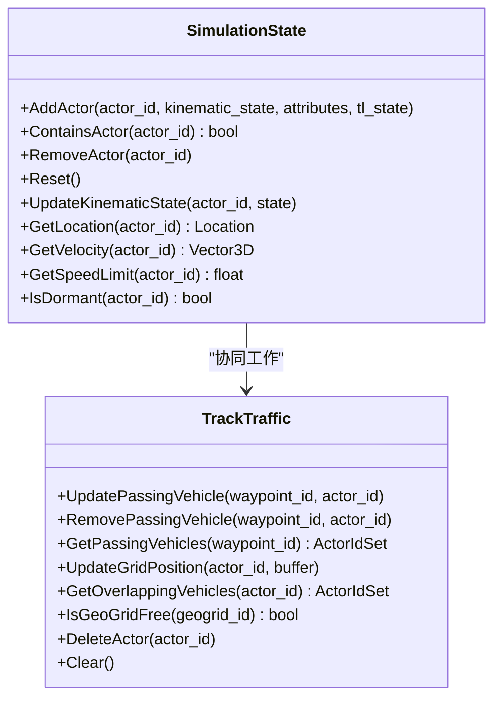

**图表来源**

- <a href="https://github.com/carla-simulator/carla/blob/ue5-dev/LibCarla/source/carla/trafficmanager/SimulationState.h#L42-L103" target="_blank">SimulationState.h</a>
- <a href="https://github.com/carla-simulator/carla/blob/ue5-dev/LibCarla/source/carla/trafficmanager/TrackTraffic.h#L18-L63" target="_blank">TrackTraffic.h</a>

## SimulationState 状态管理

SimulationState 类是 CARLA 车辆状态管理的核心，它通过多个数据结构来维护所有交通车辆的状态信息。该类使用哈希表来高效存储和检索车辆状态，确保在大规模交通仿真中的高性能。

### 状态数据结构

SimulationState 使用四种主要数据结构来组织车辆状态：

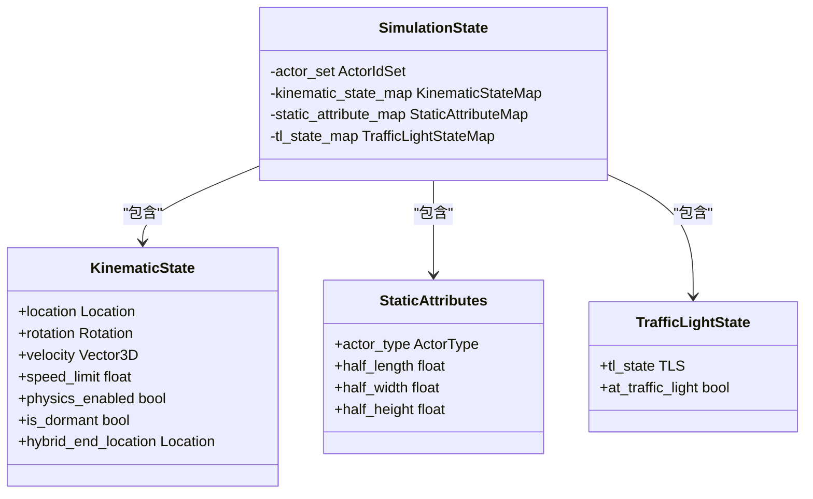

**图表来源**

- <a href="https://github.com/carla-simulator/carla/blob/ue5-dev/LibCarla/source/carla/trafficmanager/SimulationState.h#L17-L32" target="_blank">SimulationState.h</a>

### 状态管理功能

SimulationState 提供了完整的状态管理功能，包括添加、更新、查询和删除车辆状态。这些功能通过原子操作确保线程安全，支持在多线程环境下的并发访问。

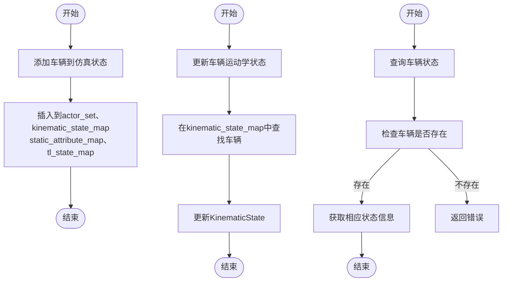

**图表来源**

- <a href="https://github.com/carla-simulator/carla/blob/ue5-dev/LibCarla/source/carla/trafficmanager/SimulationState.cpp#L9-L27" target="_blank">SimulationState.cpp</a>

## TrackTraffic 车辆跟踪

TrackTraffic 模块负责跟踪车辆在路网中的生命周期，管理车辆的路径占用和空间关系。该模块通过地理网格系统和路点重叠检测，实现了高效的车辆位置跟踪和碰撞预测。

### 路径跟踪机制

TrackTraffic 使用多种数据结构来跟踪车辆的路径信息：

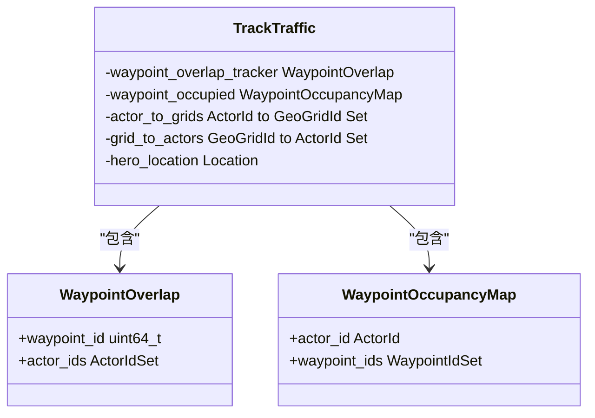

**图表来源**

- <a href="https://github.com/carla-simulator/carla/blob/ue5-dev/LibCarla/source/carla/trafficmanager/TrackTraffic.h#L23-L37" target="_blank">TrackTraffic.h</a>

### 车辆跟踪流程

TrackTraffic 的车辆跟踪流程包括更新车辆位置、检测重叠车辆和管理地理网格占用等关键步骤：

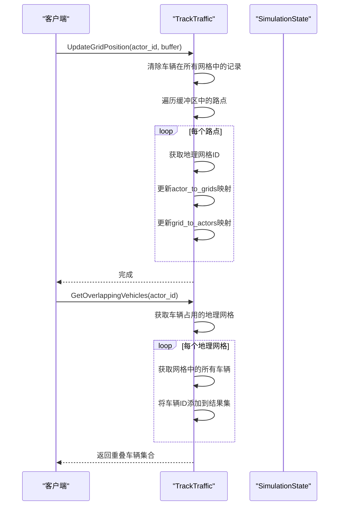

**图表来源**

- <a href="https://github.com/carla-simulator/carla/blob/ue5-dev/LibCarla/source/carla/trafficmanager/TrackTraffic.cpp#L40-L75" target="_blank">TrackTraffic.cpp</a>

## 车辆生命周期管理

CARLA 的车辆生命周期管理包括车辆的生成、行驶和销毁全过程，以及特殊的重生机制和休眠车辆管理策略。

### 车辆重生机制

车辆重生机制允许在大规模地图中自动重生休眠车辆，以维持交通密度。该机制通过设置重生边界和自动重生开关来控制：

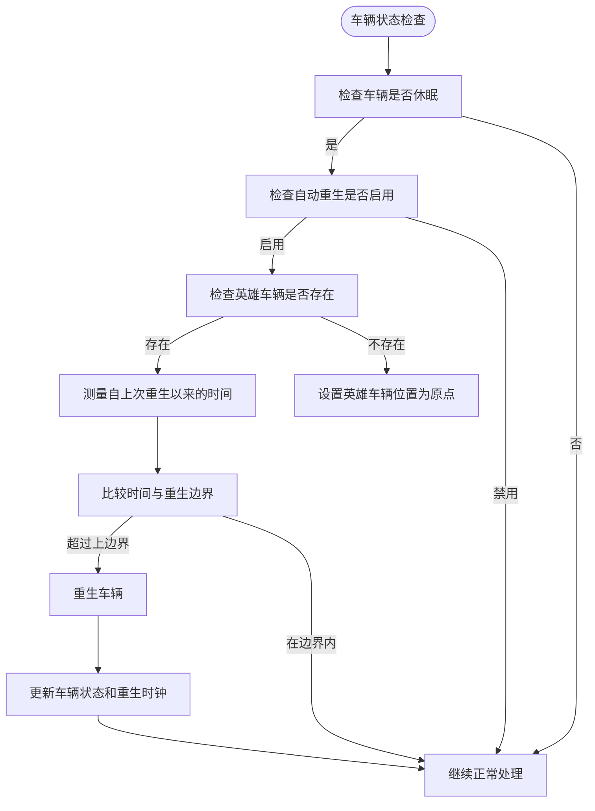

**图表来源**

- <a href="https://github.com/carla-simulator/carla/blob/ue5-dev/LibCarla/source/carla/trafficmanager/MotionPlanStage.cpp#L86-L103" target="_blank">MotionPlanStage.cpp</a>
- <a href="https://github.com/carla-simulator/carla/blob/ue5-dev/LibCarla/source/carla/trafficmanager/Parameters.h#L80-L85" target="_blank">Parameters.h</a>

### 休眠车辆管理

休眠车辆管理策略通过混合物理模式（hybrid physics mode）优化性能，将远离英雄车辆的车辆置于休眠状态：

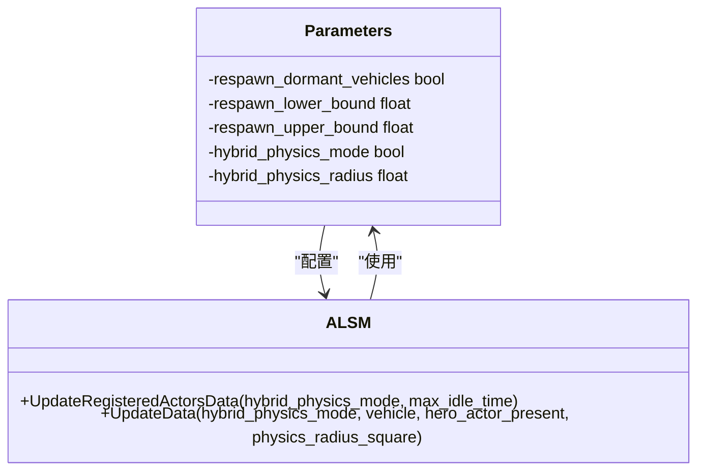

**图表来源**

- <a href="https://github.com/carla-simulator/carla/blob/ue5-dev/LibCarla/source/carla/trafficmanager/Parameters.h#L79-L91" target="_blank">Parameters.h</a>
- <a href="https://github.com/carla-simulator/carla/blob/ue5-dev/LibCarla/source/carla/trafficmanager/ALSM.cpp#L169-L197" target="_blank">ALSM.cpp</a>

## Python API 车辆状态操作

CARLA 提供了丰富的 Python API，允许用户通过编程方式查询和修改车辆状态，以及批量管理大量交通车辆。

### 车辆状态查询

通过 Python API 可以方便地查询车辆的各种状态信息：

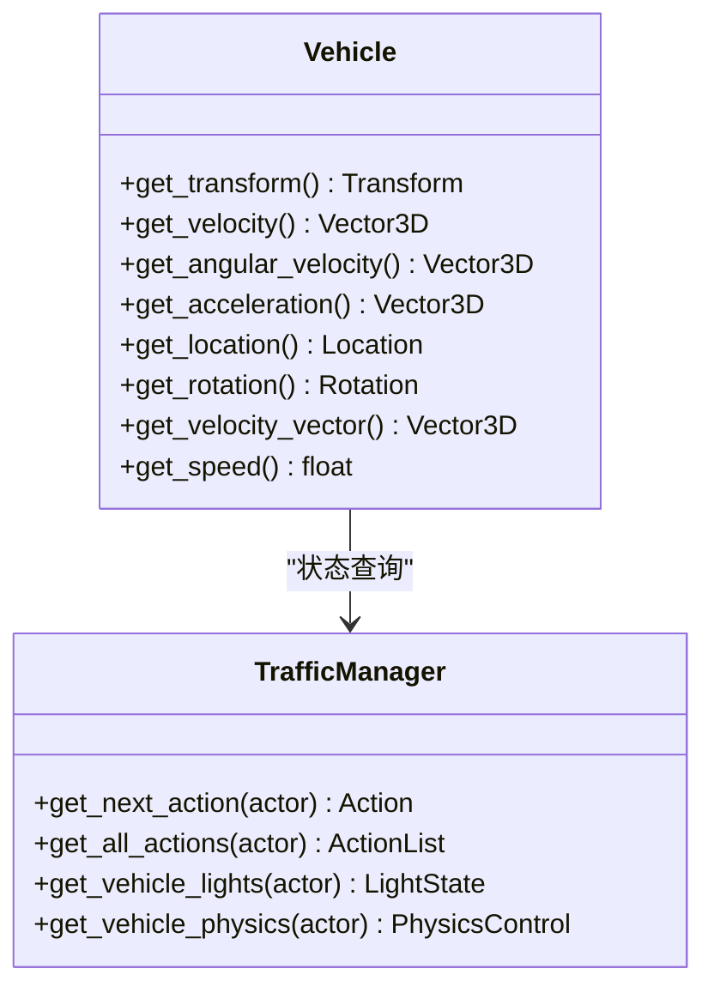

**图表来源**

- <a href="https://github.com/carla-simulator/carla/blob/ue5-dev/LibCarla/source/carla/client/Vehicle.cpp#L47-L84" target="_blank">Vehicle.cpp</a>
- <a href="https://github.com/carla-simulator/carla/blob/ue5-dev/PythonAPI/carla/src/TrafficManager.cpp#L55-L72" target="_blank">TrafficManager.cpp</a>

### 批量车辆管理

generate_traffic.py 示例展示了如何批量生成和管理交通车辆：

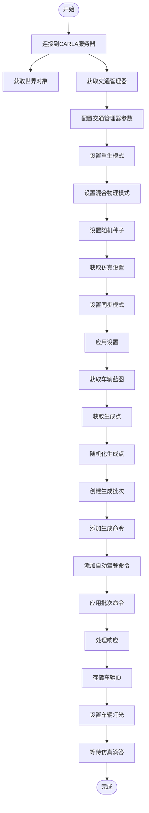

**图表来源**

- <a href="https://github.com/carla-simulator/carla/blob/ue5-dev/PythonAPI/examples/generate_traffic.py#L115-L198" target="_blank">generate_traffic.py</a>

## 车辆状态同步机制

CARLA 通过客户端-服务器架构确保车辆状态在客户端和仿真服务器之间的数据一致性。该机制在同步和异步模式下有不同的实现方式。

### 同步模式

在同步模式下，客户端和服务器严格按照时间步长进行同步：

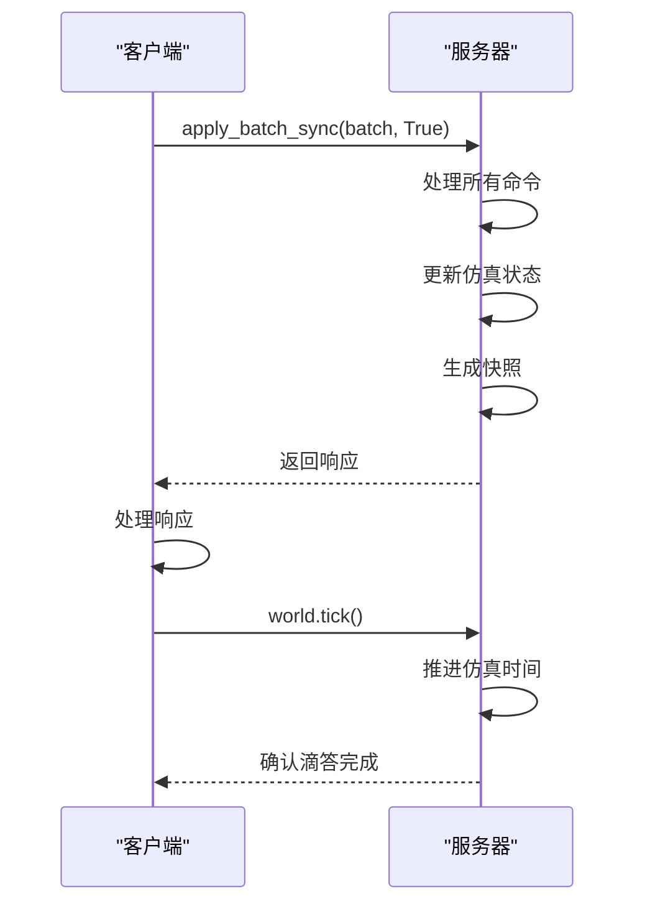

**图表来源**

- <a href="https://github.com/carla-simulator/carla/blob/ue5-dev/PythonAPI/examples/generate_traffic.py#L193-L198" target="_blank">generate_traffic.py</a>
- <a href="https://github.com/carla-simulator/carla/blob/ue5-dev/LibCarla/source/carla/client/detail/Simulator.h#L741-L743" target="_blank">Simulator.h</a>

### 状态快照机制

CARLA 使用快照机制来确保状态的一致性：

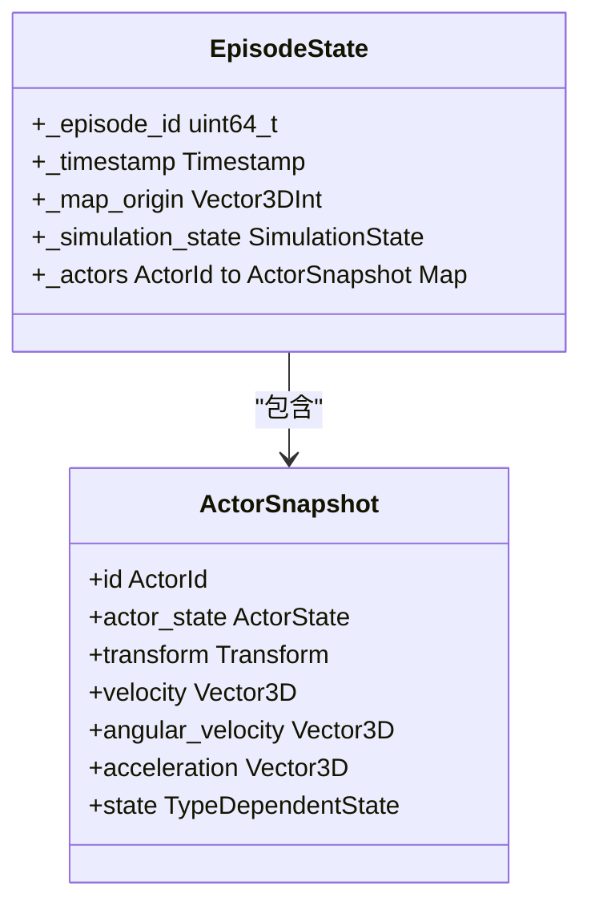

**图表来源**

- <a href="https://github.com/carla-simulator/carla/blob/ue5-dev/LibCarla/source/carla/client/ActorSnapshot.h#L18-L26" target="_blank">ActorSnapshot.h</a>
- <a href="https://github.com/carla-simulator/carla/blob/ue5-dev/LibCarla/source/carla/client/detail/EpisodeState.h#L55-L116" target="_blank">EpisodeState.h</a>

## 性能优化与内存管理

CARLA 在大规模交通仿真中采用了多种性能优化和内存管理策略，以确保系统的高效运行。

### 混合物理模式

混合物理模式通过区分近处和远处车辆的物理计算精度来优化性能：

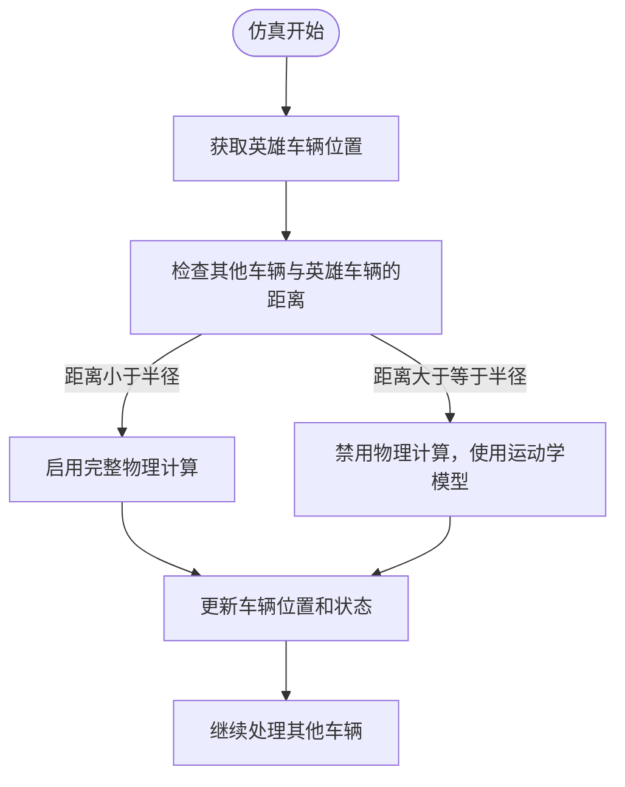

**图表来源**

- <a href="https://github.com/carla-simulator/carla/blob/ue5-dev/LibCarla/source/carla/trafficmanager/Parameters.h#L79-L80" target="_blank">Parameters.h</a>
- <a href="https://github.com/carla-simulator/carla/blob/ue5-dev/LibCarla/source/carla/trafficmanager/ALSM.cpp#L173-L174" target="_blank">ALSM.cpp</a>

### 内存管理策略

CARLA 通过多种机制优化内存使用：

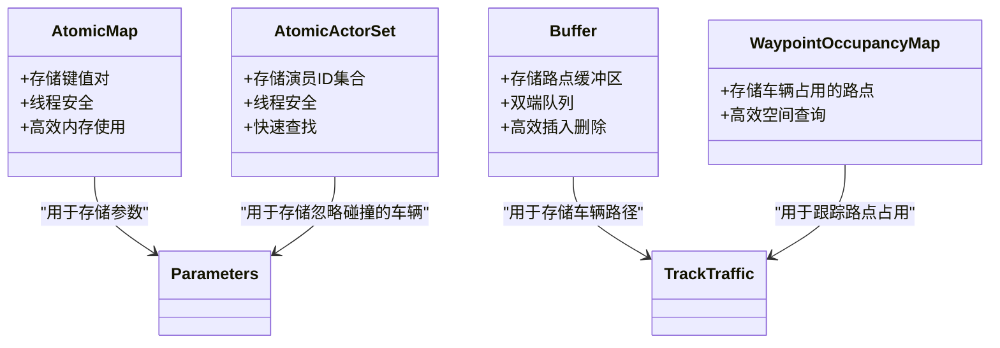

**图表来源**

- <a href="https://github.com/carla-simulator/carla/blob/ue5-dev/LibCarla/source/carla/trafficmanager/Parameters.h#L41-L73" target="_blank">Parameters.h</a>
- <a href="https://github.com/carla-simulator/carla/blob/ue5-dev/LibCarla/source/carla/trafficmanager/TrackTraffic.h#L27-L29" target="_blank">TrackTraffic.h</a>

## 总结

CARLA 的车辆状态管理系统通过 SimulationState 和 TrackTraffic 等核心组件，实现了对交通车辆全生命周期的精确管理。该系统不仅提供了丰富的状态查询和控制功能，还通过混合物理模式、车辆重生机制等高级特性，在保证仿真精度的同时优化了性能和内存使用。Python API 的完善支持使得开发者能够方便地进行车辆状态操作和批量管理，为自动驾驶算法的开发和测试提供了强大的工具支持。

**文档来源**

- [SimulationState.h](https://github.com/carla-simulator/carla/blob/ue5-dev/LibCarla/source/carla/trafficmanager/SimulationState.h)
- [SimulationState.cpp](https://github.com/carla-simulator/carla/blob/ue5-dev/LibCarla/source/carla/trafficmanager/SimulationState.cpp)
- [TrackTraffic.h](https://github.com/carla-simulator/carla/blob/ue5-dev/LibCarla/source/carla/trafficmanager/TrackTraffic.h)
- [TrackTraffic.cpp](https://github.com/carla-simulator/carla/blob/ue5-dev/LibCarla/source/carla/trafficmanager/TrackTraffic.cpp)
- [Parameters.h](https://github.com/carla-simulator/carla/blob/ue5-dev/LibCarla/source/carla/trafficmanager/Parameters.h)
- [TrafficManager.cpp](https://github.com/carla-simulator/carla/blob/ue5-dev/PythonAPI/carla/src/TrafficManager.cpp)
- [generate_traffic.py](https://github.com/carla-simulator/carla/blob/ue5-dev/PythonAPI/examples/generate_traffic.py)
- [ActorSnapshot.h](https://github.com/carla-simulator/carla/blob/ue5-dev/LibCarla/source/carla/client/ActorSnapshot.h)
- [Vehicle.cpp](https://github.com/carla-simulator/carla/blob/ue5-dev/LibCarla/source/carla/client/Vehicle.cpp)
- [Control.cpp](https://github.com/carla-simulator/carla/blob/ue5-dev/PythonAPI/carla/src/Control.cpp)
