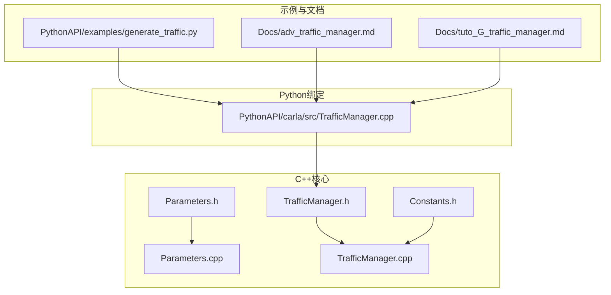
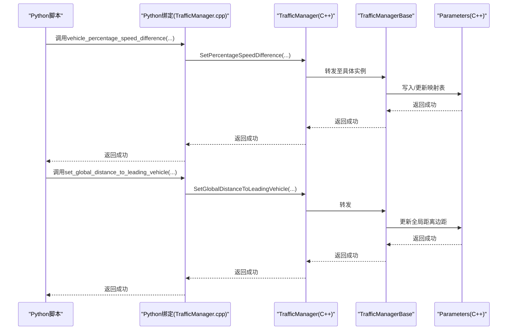
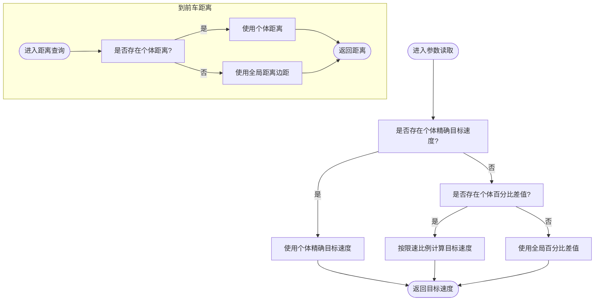
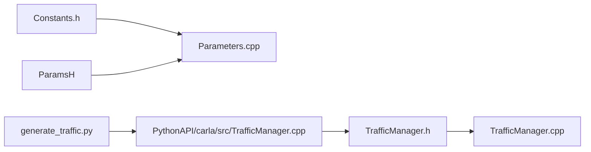

# 行为参数配置

**本文引用的文件列表**
- [Parameters.h](https://github.com/carla-simulator/carla/blob/ue5-dev/LibCarla/source/carla/trafficmanager/Parameters.h)
- [Parameters.cpp](https://github.com/carla-simulator/carla/blob/ue5-dev/LibCarla/source/carla/trafficmanager/Parameters.cpp)
- [TrafficManager.h](https://github.com/carla-simulator/carla/blob/ue5-dev/LibCarla/source/carla/trafficmanager/TrafficManager.h)
- [TrafficManager.cpp](https://github.com/carla-simulator/carla/blob/ue5-dev/LibCarla/source/carla/trafficmanager/TrafficManager.cpp)
- [TrafficManager.cpp(Python绑定)](https://github.com/carla-simulator/carla/blob/ue5-dev/PythonAPI/carla/src/TrafficManager.cpp)
- [Constants.h](https://github.com/carla-simulator/carla/blob/ue5-dev/LibCarla/source/carla/trafficmanager/Constants.h)
- [generate_traffic.py](https://github.com/carla-simulator/carla/blob/ue5-dev/PythonAPI/examples/generate_traffic.py)
- [adv_traffic_manager.md](https://github.com/carla-simulator/carla/blob/ue5-dev/Docs/adv_traffic_manager.md)
- [tuto_G_traffic_manager.md](https://github.com/carla-simulator/carla/blob/ue5-dev/Docs/tuto_G_traffic_manager.md)

## 目录
1. [简介](#简介)
2. [项目结构](#项目结构)
3. [核心组件](#核心组件)
4. [架构总览](#架构总览)
5. [详细组件分析](#详细组件分析)
6. [依赖关系分析](#依赖关系分析)
7. [性能考量](#性能考量)
8. [故障排查指南](#故障排查指南)
9. [结论](#结论)
10. [附录](#附录)

## 简介
本章节面向CARLA交通管理器的行为参数配置，系统性梳理Parameters类中定义的关键行为参数，包括：
- 车辆速度限制相关：全局/个体百分比差值、精确目标速度、全局车道偏移
- 跟车与安全距离：全局/个体到前车距离、碰撞检测规则
- 变道策略：强制变道、自动变道、随机左右变道概率、保持慢车道概率
- 驾驶风格与交通规则：忽略信号灯/标志、忽略行人/车辆、自动车灯更新
- 其他运行参数：同步模式、混合物理模式、重生机制、自定义路径/路线等

文档重点说明如何通过API接口（如set_global_distance_to_leading_vehicle、set_percentage_speed_difference等）动态调整这些参数，并解释参数间的相互影响与最佳实践。最后给出不同交通密度与驾驶风格（激进/保守）下的参数组合建议，以及针对单个车辆与批量车辆的个性化配置方法。

## 项目结构
与行为参数配置直接相关的模块位于LibCarla的trafficmanager子目录，Python侧通过绑定导出TrafficManager接口供用户脚本调用；示例脚本展示了典型用法。

图表来源
- [Parameters.h](https://github.com/carla-simulator/carla/blob/ue5-dev/LibCarla/source/carla/trafficmanager/Parameters.h#L1-L300)
- [Parameters.cpp](https://github.com/carla-simulator/carla/blob/ue5-dev/LibCarla/source/carla/trafficmanager/Parameters.cpp#L1-L486)
- [TrafficManager.h](https://github.com/carla-simulator/carla/blob/ue5-dev/LibCarla/source/carla/trafficmanager/TrafficManager.h#L1-L407)
- [TrafficManager.cpp](https://github.com/carla-simulator/carla/blob/ue5-dev/LibCarla/source/carla/trafficmanager/TrafficManager.cpp#L1-L237)
- [TrafficManager.cpp(Python绑定)](https://github.com/carla-simulator/carla/blob/ue5-dev/PythonAPI/carla/src/TrafficManager.cpp#L76-L114)
- [generate_traffic.py](https://github.com/carla-simulator/carla/blob/ue5-dev/PythonAPI/examples/generate_traffic.py#L112-L124)
- [adv_traffic_manager.md](https://github.com/carla-simulator/carla/blob/ue5-dev/Docs/adv_traffic_manager.md#L285-L351)
- [tuto_G_traffic_manager.md](https://github.com/carla-simulator/carla/blob/ue5-dev/Docs/tuto_G_traffic_manager.md#L94-L107)

章节来源
- [Parameters.h](https://github.com/carla-simulator/carla/blob/ue5-dev/LibCarla/source/carla/trafficmanager/Parameters.h#L1-L300)
- [TrafficManager.h](https://github.com/carla-simulator/carla/blob/ue5-dev/LibCarla/source/carla/trafficmanager/TrafficManager.h#L1-L407)
- [TrafficManager.cpp](https://github.com/carla-simulator/carla/blob/ue5-dev/LibCarla/source/carla/trafficmanager/TrafficManager.cpp#L1-L237)
- [TrafficManager.cpp(Python绑定)](https://github.com/carla-simulator/carla/blob/ue5-dev/PythonAPI/carla/src/TrafficManager.cpp#L76-L114)
- [generate_traffic.py](https://github.com/carla-simulator/carla/blob/ue5-dev/PythonAPI/examples/generate_traffic.py#L112-L124)
- [adv_traffic_manager.md](https://github.com/carla-simulator/carla/blob/ue5-dev/Docs/adv_traffic_manager.md#L285-L351)
- [tuto_G_traffic_manager.md](https://github.com/carla-simulator/carla/blob/ue5-dev/Docs/tuto_G_traffic_manager.md#L94-L107)

## 核心组件
- Parameters类：集中管理所有行为参数，提供原子化映射存储与线程安全访问，支持全局与个体两级配置。
- TrafficManager类：对外暴露Python/C++ API，封装参数设置与查询，协调多客户端/多端口场景。
- Python绑定：将TrafficManager方法导出为Python接口，便于脚本化配置与批量操作。
- 常量定义：提供默认参数、阈值与PID控制参数，作为行为参数的参考基准。

章节来源
- [Parameters.h](https://github.com/carla-simulator/carla/blob/ue5-dev/LibCarla/source/carla/trafficmanager/Parameters.h#L37-L296)
- [Parameters.cpp](https://github.com/carla-simulator/carla/blob/ue5-dev/LibCarla/source/carla/trafficmanager/Parameters.cpp#L23-L237)
- [TrafficManager.h](https://github.com/carla-simulator/carla/blob/ue5-dev/LibCarla/source/carla/trafficmanager/TrafficManager.h#L171-L344)
- [TrafficManager.cpp(Python绑定)](https://github.com/carla-simulator/carla/blob/ue5-dev/PythonAPI/carla/src/TrafficManager.cpp#L76-L114)
- [Constants.h](https://github.com/carla-simulator/carla/blob/ue5-dev/LibCarla/source/carla/trafficmanager/Constants.h#L40-L166)

## 架构总览
下图展示从Python脚本到C++核心参数系统的调用链路与数据流。

图表来源
- [TrafficManager.cpp(Python绑定)](https://github.com/carla-simulator/carla/blob/ue5-dev/PythonAPI/carla/src/TrafficManager.cpp#L76-L114)
- [TrafficManager.h](https://github.com/carla-simulator/carla/blob/ue5-dev/LibCarla/source/carla/trafficmanager/TrafficManager.h#L171-L344)
- [Parameters.cpp](https://github.com/carla-simulator/carla/blob/ue5-dev/LibCarla/source/carla/trafficmanager/Parameters.cpp#L155-L160)

章节来源
- [TrafficManager.cpp(Python绑定)](https://github.com/carla-simulator/carla/blob/ue5-dev/PythonAPI/carla/src/TrafficManager.cpp#L76-L114)
- [TrafficManager.h](https://github.com/carla-simulator/carla/blob/ue5-dev/LibCarla/source/carla/trafficmanager/TrafficManager.h#L171-L344)
- [Parameters.cpp](https://github.com/carla-simulator/carla/blob/ue5-dev/LibCarla/source/carla/trafficmanager/Parameters.cpp#L155-L160)

## 详细组件分析

### 参数类别与作用域
- 速度与目标行为
  - 全局/个体百分比差值：用于按限速比例调整目标速度，支持正负值表示加速或减速。
  - 精确目标速度：覆盖百分比差值，直接设定目标速度。
  - 全局/个体车道偏移：控制车辆在车道内的横向位置，支持左右偏移。
- 安全与跟车
  - 个体/全局到前车距离：决定与前车的最小安全距离，全局值可被个体覆盖。
  - 碰撞检测规则：允许/禁止某两车之间的碰撞检测，支持按对配置。
- 变道策略
  - 强制变道：一次性指令，方向为左/右。
  - 自动变道：是否启用自动变道。
  - 随机左右变道概率：独立于自动变道，用于随机探索。
  - 保持慢车道概率：在合适场景下倾向保持慢车道。
- 驾驶风格与交通规则
  - 忽略信号灯/标志概率：控制是否无视红灯/限速标志。
  - 忽略行人/车辆概率：控制对行人的避让程度与对其他车辆的容忍度。
  - 自动车灯更新：委托TM管理刹车灯、转向灯等状态。
- 运行参数
  - 同步模式与超时：控制仿真步进节奏。
  - 混合物理模式与半径：控制物理计算范围。
  - 自动重生：在大地图下自动重生离英雄车过远的车辆。
  - 自定义路径/路线：上传自定义轨迹或导航序列。

章节来源
- [Parameters.h](https://github.com/carla-simulator/carla/blob/ue5-dev/LibCarla/source/carla/trafficmanager/Parameters.h#L37-L296)
- [Parameters.cpp](https://github.com/carla-simulator/carla/blob/ue5-dev/LibCarla/source/carla/trafficmanager/Parameters.cpp#L43-L237)

### API接口与调用流程
- Python侧常用接口（由绑定导出）
  - vehicle_percentage_speed_difference(actor, percentage)
  - set_desired_speed(actor, speed)
  - global_percentage_speed_difference(percentage)
  - global_lane_offset(offset)
  - distance_to_leading_vehicle(actor, distance)
  - set_global_distance_to_leading_vehicle(distance)
  - ignore_lights_percentage(actor, perc)
  - ignore_signs_percentage(actor, perc)
  - ignore_walkers_percentage(actor, perc)
  - ignore_vehicles_percentage(actor, perc)
  - auto_lane_change(actor, enable)
  - force_lane_change(actor, direction)
  - random_left_lanechange_percentage(actor, percentage)
  - random_right_lanechange_percentage(actor, percentage)
  - keep_slow_lane_rule_percentage(actor, percentage)
  - update_vehicle_lights(actor, do_update)
  - set_synchronous_mode(mode_switch)
  - set_hybrid_physics_mode(enabled)
  - set_hybrid_physics_radius(r)
  - set_random_device_seed(value)
  - set_osm_mode(mode_switch)
  - set_path(actor, path, empty_buffer)
  - set_route(actor, route, empty_buffer)
  - set_respawn_dormant_vehicles(mode_switch)
  - set_boundaries_respawn_dormant_vehicles(lower_bound, upper_bound)
- C++侧对应方法由TrafficManager转发至TrafficManagerBase，再写入Parameters映射表。

```mermaid
classDiagram
class Parameters {
+SetPercentageSpeedDifference(actor, percentage)
+SetDesiredSpeed(actor, value)
+SetGlobalPercentageSpeedDifference(percentage)
+SetLaneOffset(actor, offset)
+SetGlobalLaneOffset(offset)
+SetDistanceToLeadingVehicle(actor, distance)
+SetGlobalDistanceToLeadingVehicle(dist)
+SetCollisionDetection(reference_actor, other_actor, detect_collision)
+SetForceLaneChange(actor, direction)
+SetAutoLaneChange(actor, enable)
+SetRandomLeftLaneChangePercentage(actor, percentage)
+SetRandomRightLaneChangePercentage(actor, percentage)
+SetKeepSlowLanePercentage(actor, percentage)
+SetPercentageRunningLight(actor, perc)
+SetPercentageRunningSign(actor, perc)
+SetPercentageIgnoreVehicles(actor, perc)
+SetPercentageIgnoreWalkers(actor, perc)
+SetUpdateVehicleLights(actor, do_update)
+SetSynchronousMode(mode_switch)
+SetSynchronousModeTimeOutInMiliSecond(time)
+SetHybridPhysicsMode(mode_switch)
+SetHybridPhysicsRadius(radius)
+SetOSMMode(mode_switch)
+SetRespawnDormantVehicles(mode_switch)
+SetBoundariesRespawnDormantVehicles(lower_bound, upper_bound)
+SetMaxBoundaries(lower, upper)
+SetCustomPath(actor, path, empty_buffer)
+RemoveUploadPath(actor_id, remove_path)
+UpdateUploadPath(actor_id, path)
+SetImportedRoute(actor, route, empty_buffer)
+RemoveImportedRoute(actor_id, remove_path)
+UpdateImportedRoute(actor_id, route)
+GetVehicleTargetVelocity(actor_id, speed_limit)
+GetLaneOffset(actor_id)
+GetDistanceToLeadingVehicle(actor_id)
+GetCollisionDetection(reference_actor_id, other_actor_id)
+GetForceLaneChange(actor_id)
+GetAutoLaneChange(actor_id)
+GetRandomLeftLaneChangePercentage(actor_id)
+GetRandomRightLaneChangePercentage(actor_id)
+GetKeepSlowLanePercentage(actor_id)
+GetPercentageRunningLight(actor_id)
+GetPercentageRunningSign(actor_id)
+GetPercentageIgnoreVehicles(actor_id)
+GetPercentageIgnoreWalkers(actor_id)
+GetUpdateVehicleLights(actor_id)
+GetSynchronousMode()
+GetSynchronousModeTimeOutInMiliSecond()
+GetHybridPhysicsMode()
+GetHybridPhysicsRadius()
+GetOSMMode()
+GetUploadPath(actor_id)
+GetCustomPath(actor_id)
+GetUploadRoute(actor_id)
+GetImportedRoute(actor_id)
}
class TrafficManager {
+SetPercentageSpeedDifference(...)
+SetDesiredSpeed(...)
+SetGlobalPercentageSpeedDifference(...)
+SetLaneOffset(...)
+SetGlobalLaneOffset(...)
+SetDistanceToLeadingVehicle(...)
+SetGlobalDistanceToLeadingVehicle(...)
+SetCollisionDetection(...)
+SetForceLaneChange(...)
+SetAutoLaneChange(...)
+SetRandomLeftLaneChangePercentage(...)
+SetRandomRightLaneChangePercentage(...)
+SetKeepSlowLanePercentage(...)
+SetPercentageRunningLight(...)
+SetPercentageRunningSign(...)
+SetPercentageIgnoreVehicles(...)
+SetPercentageIgnoreWalkers(...)
+SetUpdateVehicleLights(...)
+SetSynchronousMode(...)
+SetSynchronousModeTimeOutInMiliSecond(...)
+SetHybridPhysicsMode(...)
+SetHybridPhysicsRadius(...)
+SetOSMMode(...)
+SetRespawnDormantVehicles(...)
+SetBoundariesRespawnDormantVehicles(...)
+SetCustomPath(...)
+RemoveUploadPath(...)
+UpdateUploadPath(...)
+SetImportedRoute(...)
+RemoveImportedRoute(...)
+UpdateImportedRoute(...)
}
class TrafficManagerBase {
+SetPercentageSpeedDifference(...)
+SetDesiredSpeed(...)
+SetGlobalPercentageSpeedDifference(...)
+SetLaneOffset(...)
+SetGlobalLaneOffset(...)
+SetDistanceToLeadingVehicle(...)
+SetGlobalDistanceToLeadingVehicle(...)
+SetCollisionDetection(...)
+SetForceLaneChange(...)
+SetAutoLaneChange(...)
+SetRandomLeftLaneChangePercentage(...)
+SetRandomRightLaneChangePercentage(...)
+SetKeepSlowLanePercentage(...)
+SetPercentageRunningLight(...)
+SetPercentageRunningSign(...)
+SetPercentageIgnoreVehicles(...)
+SetPercentageIgnoreWalkers(...)
+SetUpdateVehicleLights(...)
+SetSynchronousMode(...)
+SetSynchronousModeTimeOutInMiliSecond(...)
+SetHybridPhysicsMode(...)
+SetHybridPhysicsRadius(...)
+SetOSMMode(...)
+SetRespawnDormantVehicles(...)
+SetBoundariesRespawnDormantVehicles(...)
+SetCustomPath(...)
+RemoveUploadPath(...)
+UpdateUploadPath(...)
+SetImportedRoute(...)
+RemoveImportedRoute(...)
+UpdateImportedRoute(...)
}
TrafficManager --> TrafficManagerBase : "转发调用"
TrafficManagerBase --> Parameters : "写入/读取参数"
```

图表来源
- [Parameters.h](https://github.com/carla-simulator/carla/blob/ue5-dev/LibCarla/source/carla/trafficmanager/Parameters.h#L107-L296)
- [Parameters.cpp](https://github.com/carla-simulator/carla/blob/ue5-dev/LibCarla/source/carla/trafficmanager/Parameters.cpp#L23-L237)
- [TrafficManager.h](https://github.com/carla-simulator/carla/blob/ue5-dev/LibCarla/source/carla/trafficmanager/TrafficManager.h#L171-L344)
- [TrafficManager.cpp(Python绑定)](https://github.com/carla-simulator/carla/blob/ue5-dev/PythonAPI/carla/src/TrafficManager.cpp#L76-L114)

章节来源
- [TrafficManager.h](https://github.com/carla-simulator/carla/blob/ue5-dev/LibCarla/source/carla/trafficmanager/TrafficManager.h#L171-L344)
- [TrafficManager.cpp(Python绑定)](https://github.com/carla-simulator/carla/blob/ue5-dev/PythonAPI/carla/src/TrafficManager.cpp#L76-L114)
- [Parameters.cpp](https://github.com/carla-simulator/carla/blob/ue5-dev/LibCarla/source/carla/trafficmanager/Parameters.cpp#L23-L237)

### 关键参数与算法逻辑
- 目标速度计算
  - 优先级：个体精确目标速度 > 个体百分比差值 > 全局百分比差值；最终按限速比例换算。
- 到前车距离
  - 个体存在则用个体值，否则回退到全局“距离边距”。
- 碰撞检测
  - 默认开启，可通过忽略集合关闭特定对之间的碰撞检测。
- 变道决策
  - 强制变道为一次性指令，自动变道与随机变道概率共同影响变道行为。
- 车道偏移
  - 个体偏移覆盖全局偏移，用于微调车辆在车道中的横向位置。

图表来源
- [Parameters.cpp](https://github.com/carla-simulator/carla/blob/ue5-dev/LibCarla/source/carla/trafficmanager/Parameters.cpp#L254-L265)
- [Parameters.cpp](https://github.com/carla-simulator/carla/blob/ue5-dev/LibCarla/source/carla/trafficmanager/Parameters.cpp#L346-L356)

章节来源
- [Parameters.cpp](https://github.com/carla-simulator/carla/blob/ue5-dev/LibCarla/source/carla/trafficmanager/Parameters.cpp#L254-L265)
- [Parameters.cpp](https://github.com/carla-simulator/carla/blob/ue5-dev/LibCarla/source/carla/trafficmanager/Parameters.cpp#L346-L356)

### 动态调整API与最佳实践
- 通过Python脚本批量设置
  - 示例：生成交通脚本中设置全局跟车距离、同步模式、混合物理模式、随机种子等。
- 单车个性化
  - 对特定车辆设置百分比差值、忽略信号灯/标志、忽略行人/车辆、自动车灯更新等。
- 组合策略
  - 低密度/高真实感：保守风格，提高跟车距离、降低速度差值、启用自动变道与保持慢车道。
  - 高密度/高挑战：激进风格，降低跟车距离、提高速度差值、减少随机变道、允许忽略信号灯/标志但需谨慎。

章节来源
- [generate_traffic.py](https://github.com/carla-simulator/carla/blob/ue5-dev/PythonAPI/examples/generate_traffic.py#L112-L124)
- [adv_traffic_manager.md](https://github.com/carla-simulator/carla/blob/ue5-dev/Docs/adv_traffic_manager.md#L314-L339)
- [tuto_G_traffic_manager.md](https://github.com/carla-simulator/carla/blob/ue5-dev/Docs/tuto_G_traffic_manager.md#L94-L107)

## 依赖关系分析
- Parameters依赖
  - AtomicMap/AtomicActorSet：保证多线程安全的参数存储。
  - 常量定义：提供默认值与阈值，作为参数边界与初始值参考。
- TrafficManager依赖
  - TrafficManagerBase：统一转发到本地或远程实例。
  - Python绑定：Boost.Python导出方法名与参数签名。
- 外部集成点
  - 同步模式与混合物理模式：与世界设置与渲染模式协同。
  - 自动重生：与地图大小与英雄车位置联动。

图表来源
- [Constants.h](https://github.com/carla-simulator/carla/blob/ue5-dev/LibCarla/source/carla/trafficmanager/Constants.h#L40-L166)
- [Parameters.h](https://github.com/carla-simulator/carla/blob/ue5-dev/LibCarla/source/carla/trafficmanager/Parameters.h#L1-L300)
- [Parameters.cpp](https://github.com/carla-simulator/carla/blob/ue5-dev/LibCarla/source/carla/trafficmanager/Parameters.cpp#L1-L486)
- [TrafficManager.h](https://github.com/carla-simulator/carla/blob/ue5-dev/LibCarla/source/carla/trafficmanager/TrafficManager.h#L1-L407)
- [TrafficManager.cpp](https://github.com/carla-simulator/carla/blob/ue5-dev/LibCarla/source/carla/trafficmanager/TrafficManager.cpp#L1-L237)
- [TrafficManager.cpp(Python绑定)](https://github.com/carla-simulator/carla/blob/ue5-dev/PythonAPI/carla/src/TrafficManager.cpp#L76-L114)
- [generate_traffic.py](https://github.com/carla-simulator/carla/blob/ue5-dev/PythonAPI/examples/generate_traffic.py#L112-L124)

章节来源
- [Constants.h](https://github.com/carla-simulator/carla/blob/ue5-dev/LibCarla/source/carla/trafficmanager/Constants.h#L40-L166)
- [Parameters.h](https://github.com/carla-simulator/carla/blob/ue5-dev/LibCarla/source/carla/trafficmanager/Parameters.h#L1-L300)
- [Parameters.cpp](https://github.com/carla-simulator/carla/blob/ue5-dev/LibCarla/source/carla/trafficmanager/Parameters.cpp#L1-L486)
- [TrafficManager.h](https://github.com/carla-simulator/carla/blob/ue5-dev/LibCarla/source/carla/trafficmanager/TrafficManager.h#L1-L407)
- [TrafficManager.cpp](https://github.com/carla-simulator/carla/blob/ue5-dev/LibCarla/source/carla/trafficmanager/TrafficManager.cpp#L1-L237)
- [TrafficManager.cpp(Python绑定)](https://github.com/carla-simulator/carla/blob/ue5-dev/PythonAPI/carla/src/TrafficManager.cpp#L76-L114)
- [generate_traffic.py](https://github.com/carla-simulator/carla/blob/ue5-dev/PythonAPI/examples/generate_traffic.py#L112-L124)

## 性能考量
- 参数读取路径
  - 目标速度与距离查询均为O(1)映射访问，开销极低。
- 碰撞检测
  - 忽略集合采用原子集合，避免频繁锁竞争；但大规模忽略对可能增加查找成本。
- 同步/异步模式
  - 同步模式下，合理设置固定步长与超时，避免卡顿与丢帧。
- 混合物理模式
  - 控制半径与开关，平衡真实感与性能。
- 批量操作
  - 使用批量注册/取消注册与批量设置接口，减少网络往返与状态切换。

[本节为通用指导，不直接分析具体文件]

## 故障排查指南
- 参数未生效
  - 确认已调用set_autopilot并传入正确的TM端口。
  - 检查是否设置了精确目标速度导致百分比差值失效。
- 距离设置无效
  - 个体设置会覆盖全局设置；确认是否误设了个体距离。
- 变道异常
  - 强制变道为一次性指令，若未触发，检查自动变道开关与随机变道概率。
- 碰撞检测问题
  - 若两车间无碰撞，确认未将它们加入忽略集合。
- 同步模式卡顿
  - 检查固定步长与超时设置，确保客户端与服务器一致。

章节来源
- [TrafficManager.cpp(Python绑定)](https://github.com/carla-simulator/carla/blob/ue5-dev/PythonAPI/carla/src/TrafficManager.cpp#L76-L114)
- [Parameters.cpp](https://github.com/carla-simulator/carla/blob/ue5-dev/LibCarla/source/carla/trafficmanager/Parameters.cpp#L254-L265)
- [Parameters.cpp](https://github.com/carla-simulator/carla/blob/ue5-dev/LibCarla/source/carla/trafficmanager/Parameters.cpp#L346-L356)

## 结论
通过Parameters类与TrafficManager接口，CARLA提供了细粒度且可扩展的行为参数体系。合理组合速度、跟车距离、变道策略与交通规则参数，可在不同交通密度与驾驶风格下获得更真实、可控的仿真效果。建议先以保守参数验证系统稳定性，再逐步引入激进参数进行挑战性测试，并结合批量操作提升大规模场景的配置效率。

[本节为总结性内容，不直接分析具体文件]

## 附录

### 参数清单与含义（摘要）
- 速度相关
  - 全局/个体百分比差值：按限速比例调整目标速度。
  - 精确目标速度：直接设定目标速度，覆盖百分比差值。
  - 全局/个体车道偏移：横向位置微调。
- 跟车与安全
  - 个体/全局到前车距离：最小安全距离。
  - 碰撞检测规则：按对允许/禁止碰撞。
- 变道策略
  - 强制变道：一次性指令。
  - 自动变道：是否启用。
  - 随机左右变道概率：随机探索。
  - 保持慢车道概率：倾向慢车道。
- 驾驶风格
  - 忽略信号灯/标志概率：无视红灯/限速标志。
  - 忽略行人/车辆概率：对行人的避让程度与对其他车辆的容忍度。
  - 自动车灯更新：委托TM管理车灯。
- 运行参数
  - 同步模式与超时：仿真步进节奏。
  - 混合物理模式与半径：物理计算范围。
  - 自动重生：大地图重生策略。
  - 自定义路径/路线：上传轨迹或导航序列。

章节来源
- [Parameters.h](https://github.com/carla-simulator/carla/blob/ue5-dev/LibCarla/source/carla/trafficmanager/Parameters.h#L37-L296)
- [Parameters.cpp](https://github.com/carla-simulator/carla/blob/ue5-dev/LibCarla/source/carla/trafficmanager/Parameters.cpp#L43-L237)
- [Constants.h](https://github.com/carla-simulator/carla/blob/ue5-dev/LibCarla/source/carla/trafficmanager/Constants.h#L40-L166)

### 实战案例与建议
- 低密度/高真实感（保守）
  - 提高全局到前车距离、降低速度差值、启用自动变道与保持慢车道、关闭忽略信号灯/标志。
- 高密度/高挑战（激进）
  - 降低到前车距离、提高速度差值、减少随机变道、允许忽略信号灯/标志但需谨慎。
- 批量配置
  - 使用脚本批量设置百分比差值、忽略概率与车灯更新，结合端口复用与多客户端场景。

章节来源
- [generate_traffic.py](https://github.com/carla-simulator/carla/blob/ue5-dev/PythonAPI/examples/generate_traffic.py#L112-L124)
- [adv_traffic_manager.md](https://github.com/carla-simulator/carla/blob/ue5-dev/Docs/adv_traffic_manager.md#L314-L339)
- [tuto_G_traffic_manager.md](https://github.com/carla-simulator/carla/blob/ue5-dev/Docs/tuto_G_traffic_manager.md#L94-L107)