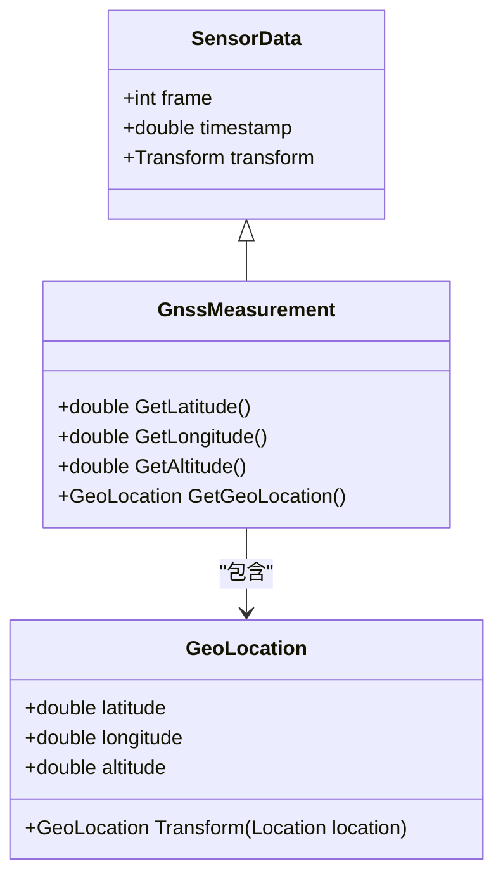
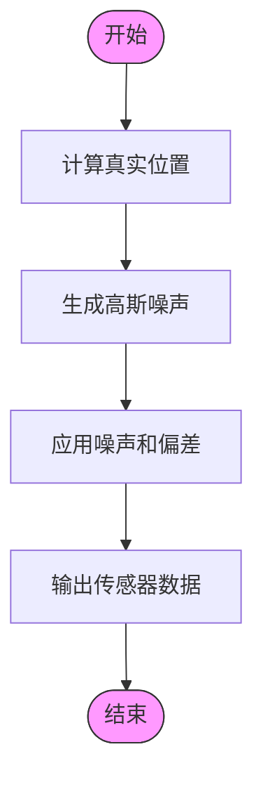
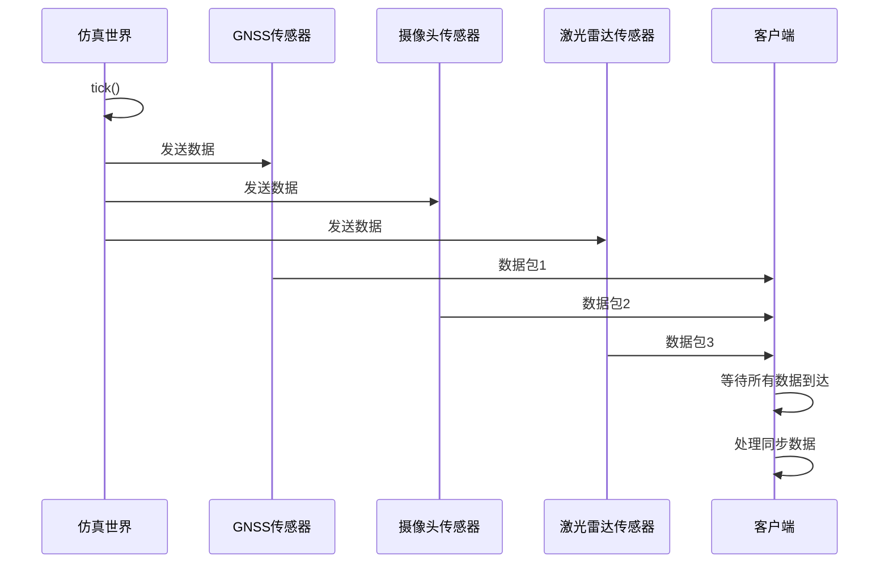

# GNSS传感器


**本文档中引用的文件**   
- [GnssSensor.h](https://github.com/carla-simulator/carla/blob/ue5-dev/Unreal/CarlaUnreal/Plugins/Carla/Source/Carla/Sensor/GnssSensor.h)
- [GnssSensor.cpp](https://github.com/carla-simulator/carla/blob/ue5-dev/Unreal/CarlaUnreal/Plugins/Carla/Source/Carla/Sensor/GnssSensor.cpp)
- [GnssMeasurement.h](https://github.com/carla-simulator/carla/blob/ue5-dev/LibCarla/source/carla/sensor/data/GnssMeasurement.h)
- [GeoLocation.h](https://github.com/carla-simulator/carla/blob/ue5-dev/LibCarla/source/carla/geom/GeoLocation.h)
- [ref_sensors.md](https://github.com/carla-simulator/carla/blob/ue5-dev/Docs/ref_sensors.md)
- [SensorData.cpp](https://github.com/carla-simulator/carla/blob/ue5-dev/PythonAPI/carla/src/SensorData.cpp)
- [test_sensor_recording.py](https://github.com/carla-simulator/carla/blob/ue5-dev/PythonAPI/test/API/test_sensor_recording.py)
- [sensor_synchronization.py](https://github.com/carla-simulator/carla/blob/ue5-dev/PythonAPI/examples/sensor_synchronization.py)


## 目录
1. [简介](#简介)
2. [GNSS传感器数据结构](#gnss传感器数据结构)
3. [GNSS误差模型](#gnss误差模型)
4. [GNSS传感器配置与使用](#gnss传感器配置与使用)
5. [数据同步与时间戳](#数据同步与时间戳)
6. [实际应用案例](#实际应用案例)
7. [结论](#结论)

## 简介

CARLA模拟器中的GNSS传感器为自动驾驶仿真提供了关键的全局定位能力。该传感器通过将车辆在仿真世界中的度量位置转换为地理坐标（经度、纬度、海拔高度），实现了与真实世界GPS系统相似的功能。GNSS传感器的定位基于OpenDRIVE地图定义中的初始地理参考位置，通过将车辆的局部坐标转换到全局地理坐标系来计算其精确位置。

该传感器不仅提供精确的定位数据，还支持可配置的噪声模型，以模拟真实GNSS传感器中存在的各种误差源，如多路径效应、大气延迟和卫星几何分布（DOP值）的影响。这种高保真度的误差建模使得CARLA成为开发和测试鲁棒性定位算法的理想平台。

**Section sources**
- [ref_sensors.md](https://github.com/carla-simulator/carla/blob/ue5-dev/Docs/ref_sensors.md#L113-L119)

## GNSS传感器数据结构

GNSS传感器输出的数据结构`GnssMeasurement`包含了车辆在地球上的精确位置信息。该数据结构继承自`SensorData`，并包含以下关键字段：

- **经度 (longitude)**: 表示车辆位置的经度值，单位为度。
- **纬度 (latitude)**: 表示车辆位置的纬度值，单位为度。
- **海拔高度 (altitude)**: 表示车辆位置的海拔高度，单位为米。
- **时间戳 (timestamp)**: 记录测量发生时的仿真时间，单位为秒。
- **帧号 (frame)**: 标识测量发生的仿真帧号。
- **变换 (transform)**: 包含传感器在世界坐标系中的位置和旋转信息。

这些数据字段通过`carla::geom::GeoLocation`类进行封装和管理，该类定义了地理坐标的基本数据结构，包括纬度、经度和海拔高度三个浮点数成员。`GnssMeasurement`类提供了`GetLatitude()`、`GetLongitude()`和`GetAltitude()`等方法来访问这些地理坐标值。



**Diagram sources **
- [GnssMeasurement.h](https://github.com/carla-simulator/carla/blob/ue5-dev/LibCarla/source/carla/sensor/data/GnssMeasurement.h#L18-L58)
- [GeoLocation.h](https://github.com/carla-simulator/carla/blob/ue5-dev/LibCarla/source/carla/geom/GeoLocation.h#L16-L61)

**Section sources**
- [GnssMeasurement.h](https://github.com/carla-simulator/carla/blob/ue5-dev/LibCarla/source/carla/sensor/data/GnssMeasurement.h#L18-L58)
- [GeoLocation.h](https://github.com/carla-simulator/carla/blob/ue5-dev/LibCarla/source/carla/geom/GeoLocation.h#L16-L61)
- [SensorData.cpp](https://github.com/carla-simulator/carla/blob/ue5-dev/PythonAPI/carla/src/SensorData.cpp#L478-L481)

## GNSS误差模型

CARLA的GNSS传感器实现了高度可配置的误差模型，以模拟真实世界GNSS系统中的各种不确定性。该模型通过在真实位置上添加可控的偏差和噪声来实现，从而为开发者提供了一个逼真的测试环境。

### 误差参数

GNSS传感器支持以下误差参数的配置：

| 蓝图属性 | 类型 | 默认值 | 描述 |
| ------------------- | ------------------- | ------------------- | ------------------- |
| `noise_lat_bias` | float | 0.0 | 纬度噪声模型的均值参数。 |
| `noise_lat_stddev` | float | 0.0 | 纬度噪声模型的标准差参数。 |
| `noise_lon_bias` | float | 0.0 | 经度噪声模型的均值参数。 |
| `noise_lon_stddev` | float | 0.0 | 经度噪声模型的标准差参数。 |
| `noise_alt_bias` | float | 0.0 | 海拔高度噪声模型的均值参数。 |
| `noise_alt_stddev` | float | 0.0 | 海拔高度噪声模型的标准差参数。 |
| `noise_seed` | int | 0 | 伪随机数生成器的初始化器。 |

这些参数允许用户精确控制GNSS数据的噪声特性。例如，通过设置`noise_lat_stddev`和`noise_lon_stddev`的值，可以模拟不同精度等级的GNSS接收器。`noise_seed`参数确保了噪声生成的可重复性，这对于实验的可复现性至关重要。

### 误差实现机制

在仿真过程中，GNSS传感器的误差是通过以下步骤实现的：

1. 首先，系统计算车辆在仿真世界中的真实地理坐标。
2. 然后，使用伪随机数生成器根据配置的标准差参数生成高斯噪声。
3. 最后，将噪声和偏差添加到真实坐标上，生成最终的传感器输出。

这种实现方式在`AGnssSensor::PostPhysTick`方法中完成，该方法在每个物理模拟步骤后被调用。代码中使用`RandomEngine->GetNormalDistribution()`函数生成符合正态分布的随机噪声，然后将其与配置的偏差一起添加到真实位置上。



**Diagram sources **
- [GnssSensor.cpp](https://github.com/carla-simulator/carla/blob/ue5-dev/Unreal/CarlaUnreal/Plugins/Carla/Source/Carla/Sensor/GnssSensor.cpp#L50-L58)

**Section sources**
- [ref_sensors.md](https://github.com/carla-simulator/carla/blob/ue5-dev/Docs/ref_sensors.md#L123-L132)
- [GnssSensor.h](https://github.com/carla-simulator/carla/blob/ue5-dev/Unreal/CarlaUnreal/Plugins/Carla/Source/Carla/Sensor/GnssSensor.h#L38-L44)
- [GnssSensor.cpp](https://github.com/carla-simulator/carla/blob/ue5-dev/Unreal/CarlaUnreal/Plugins/Carla/Source/Carla/Sensor/GnssSensor.cpp#L50-L58)

## GNSS传感器配置与使用

在CARLA中配置和使用GNSS传感器涉及几个关键步骤，包括传感器的创建、属性设置和数据订阅。

### 传感器创建

要创建一个GNSS传感器，首先需要从蓝图库中获取传感器的蓝图定义，然后将其附加到目标车辆上。以下是一个Python示例：

```python
world = client.get_world()
blueprint = world.get_blueprint_library().find('sensor.other.gnss')
gnss_sensor = world.spawn_actor(blueprint, 
                               carla.Transform(carla.Location(x=1.0, z=2.8)), 
                               attach_to=vehicle)
```

### 属性配置

在创建传感器后，可以通过设置其属性来配置误差模型。例如：

```python
blueprint.set_attribute('noise_lat_stddev', '0.01')
blueprint.set_attribute('noise_lon_stddev', '0.01')
blueprint.set_attribute('noise_alt_stddev', '0.05')
blueprint.set_attribute('sensor_tick', '0.1')
```

### 数据订阅

一旦传感器被创建和配置，就可以通过`listen`方法订阅其数据流。这通常涉及提供一个回调函数，该函数在每次接收到新的GNSS测量时被调用：

```python
def gnss_callback(data):
    print(f"纬度: {data.latitude}, 经度: {data.longitude}, 海拔: {data.altitude}")

gnss_sensor.listen(gnss_callback)
```

这种机制允许开发者实时处理GNSS数据，用于导航、轨迹绘制或与其他传感器数据进行融合。

**Section sources**
- [test_sensor_recording.py](https://github.com/carla-simulator/carla/blob/ue5-dev/PythonAPI/test/API/test_sensor_recording.py#L163-L177)
- [ActorBlueprintFunctionLibrary.cpp](https://github.com/carla-simulator/carla/blob/ue5-dev/Unreal/CarlaUnreal/Plugins/Carla/Source/Carla/Actor/ActorBlueprintFunctionLibrary.cpp#L778-L814)

## 数据同步与时间戳

在自动驾驶系统中，确保不同传感器数据的时间同步至关重要。CARLA提供了同步模式来解决这一问题，确保所有传感器数据在相同的仿真时间点被捕获。

### 同步模式

通过将世界设置为同步模式，可以确保所有传感器在每个仿真步骤后同时更新其数据：

```python
settings = world.get_settings()
settings.synchronous_mode = True
settings.fixed_delta_seconds = 0.1
world.apply_settings(settings)
```

### 数据队列

为了处理同步的传感器数据，可以使用队列来收集来自不同传感器的数据包。以下是一个示例，展示了如何使用队列来同步GNSS、摄像头和激光雷达数据：

```python
sensor_queue = Queue()

def sensor_callback(sensor_data, sensor_queue, sensor_name):
    sensor_queue.put((sensor_data.frame, sensor_name))

# 为每个传感器设置回调
gnss_sensor.listen(lambda data: sensor_callback(data, sensor_queue, "gnss"))
camera_sensor.listen(lambda data: sensor_callback(data, sensor_queue, "camera"))
lidar_sensor.listen(lambda data: sensor_callback(data, sensor_queue, "lidar"))

# 主循环
while True:
    world.tick()
    try:
        for _ in range(3):  # 三个传感器
            s_frame = sensor_queue.get(True, 1.0)
            print(f"帧: {s_frame[0]} 传感器: {s_frame[1]}")
    except Empty:
        print("部分传感器数据丢失")
```

这种方法确保了所有传感器数据在处理前都已到达，从而实现了精确的时间同步。



**Diagram sources **
- [sensor_synchronization.py](https://github.com/carla-simulator/carla/blob/ue5-dev/PythonAPI/examples/sensor_synchronization.py#L24-L113)

**Section sources**
- [sensor_synchronization.py](https://github.com/carla-simulator/carla/blob/ue5-dev/PythonAPI/examples/sensor_synchronization.py#L24-L113)

## 实际应用案例

GNSS传感器在自动驾驶仿真中有多种实际应用，包括轨迹绘制、地图匹配和定位性能评估。

### 轨迹绘制

通过记录GNSS传感器的输出，可以绘制车辆在仿真环境中的行驶轨迹。以下是一个简单的轨迹记录示例：

```python
class GnssRecorder:
    def __init__(self, vehicle):
        self.vehicle = vehicle
        self.data = []
        
    def callback(self, data):
        self.data.append({
            'frame': data.frame,
            'latitude': data.latitude,
            'longitude': data.longitude,
            'altitude': data.altitude
        })
        
    def start_recording(self):
        blueprint = self.vehicle.get_world().get_blueprint_library().find('sensor.other.gnss')
        self.sensor = self.vehicle.get_world().spawn_actor(
            blueprint, 
            carla.Transform(carla.Location(x=1.0, z=2.8)), 
            attach_to=self.vehicle
        )
        self.sensor.listen(self.callback)
```

### 地图匹配

GNSS数据可以与高精地图进行匹配，以提高定位精度。通过将GNSS测量值与地图中的道路网络进行比较，可以纠正定位误差并确定车辆在道路上的精确位置。

### 定位性能评估

通过配置不同的GNSS误差参数，可以评估定位算法在各种条件下的性能。例如，可以测试滤波算法（如卡尔曼滤波）在不同噪声水平下的表现，从而优化算法参数。

这些应用案例展示了GNSS传感器在开发和测试自动驾驶系统中的重要性，为开发者提供了强大的工具来验证和改进其定位解决方案。

**Section sources**
- [test_sensor_recording.py](https://github.com/carla-simulator/carla/blob/ue5-dev/PythonAPI/test/API/test_sensor_recording.py#L181-L205)

## 结论

CARLA的GNSS传感器为自动驾驶仿真提供了一个强大而灵活的全局定位工具。通过精确的地理坐标转换和可配置的误差模型，该传感器能够高度逼真地模拟真实世界的GNSS系统。开发者可以利用这些功能来测试和验证各种定位算法，从基本的轨迹绘制到复杂的多传感器融合系统。

该传感器的实现展示了CARLA在提供高保真度仿真环境方面的优势，使其成为自动驾驶研究和开发的理想平台。通过深入理解GNSS传感器的工作原理和配置选项，开发者可以创建更加真实和具有挑战性的测试场景，从而加速自动驾驶技术的发展。