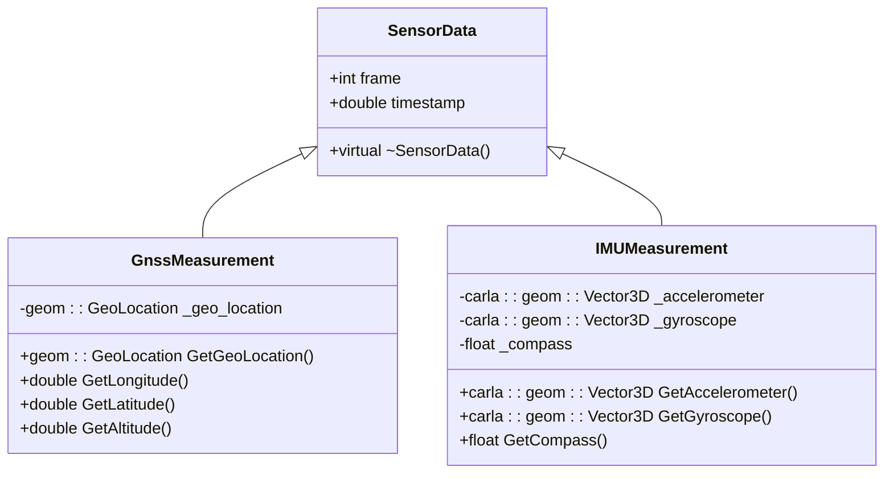
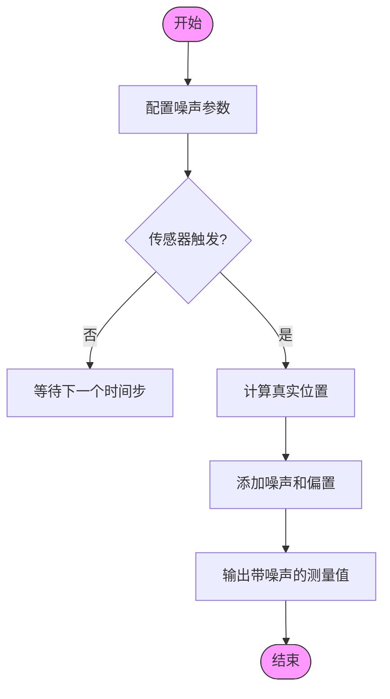
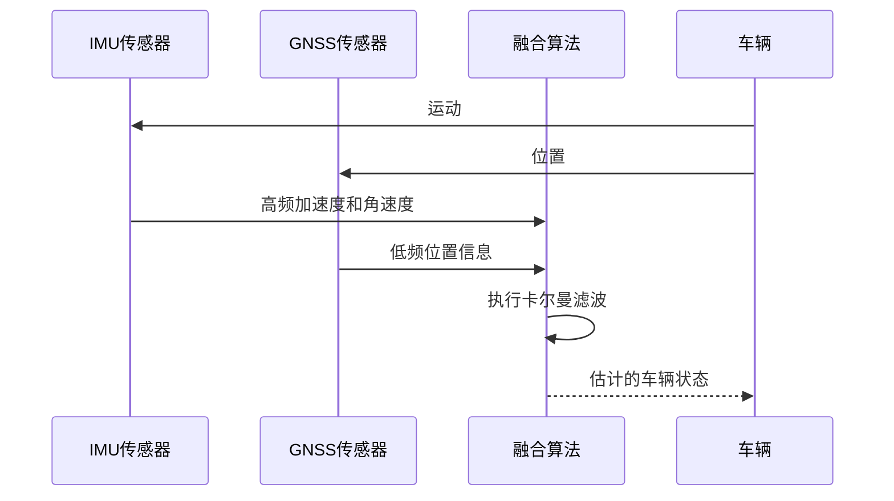

# IMU与GNSS传感器


**本文档引用的文件**
- [InertialMeasurementUnit.h](https://github.com/carla-simulator/carla/blob/ue5-dev/Unreal/CarlaUnreal/Plugins/Carla/Source/Carla/Sensor/InertialMeasurementUnit.h)
- [InertialMeasurementUnit.cpp](https://github.com/carla-simulator/carla/blob/ue5-dev/Unreal/CarlaUnreal/Plugins/Carla/Source/Carla/Sensor/InertialMeasurementUnit.cpp)
- [GnssSensor.h](https://github.com/carla-simulator/carla/blob/ue5-dev/Unreal/CarlaUnreal/Plugins/Carla/Source/Carla/Sensor/GnssSensor.h)
- [GnssSensor.cpp](https://github.com/carla-simulator/carla/blob/ue5-dev/Unreal/CarlaUnreal/Plugins/Carla/Source/Carla/Sensor/GnssSensor.cpp)
- [GnssMeasurement.h](https://github.com/carla-simulator/carla/blob/ue5-dev/LibCarla/source/carla/sensor/data/GnssMeasurement.h)
- [GnssSerializer.cpp](https://github.com/carla-simulator/carla/blob/ue5-dev/LibCarla/source/carla/sensor/s11n/GnssSerializer.cpp)
- [ref_sensors.md](https://github.com/carla-simulator/carla/blob/ue5-dev/Docs/ref_sensors.md)
- [SensorData.cpp](https://github.com/carla-simulator/carla/blob/ue5-dev/PythonAPI/carla/src/SensorData.cpp)
- [manual_control.py](https://github.com/carla-simulator/carla/blob/ue5-dev/PythonAPI/examples/manual_control.py)


## 目录
1. [简介](#简介)
2. [IMU传感器实现](#imu传感器实现)
3. [GNSS传感器实现](#gnss传感器实现)
4. [传感器数据结构](#传感器数据结构)
5. [误差模型与噪声配置](#误差模型与噪声配置)
6. [传感器融合与同步](#传感器融合与同步)
7. [Python API使用示例](#python-api使用示例)
8. [结论](#结论)

## 简介
CARLA模拟器提供了高保真的IMU（惯性测量单元）和GNSS（全球导航卫星系统）传感器，用于车辆状态估计和定位。这些传感器在自动驾驶仿真中扮演着关键角色，为算法开发和测试提供了接近真实世界的传感器数据。IMU传感器模拟了加速度计和陀螺仪的功能，提供三轴线加速度和角速度测量，而GNSS传感器则提供全局定位信息，包括经度、纬度和海拔高度。本文档详细介绍了这些传感器的实现原理、配置方法和使用方式。

## IMU传感器实现

IMU传感器在CARLA中通过`AInertialMeasurementUnit`类实现，该类继承自`ASensor`基类。传感器在每次物理模拟步进后计算加速度计、陀螺仪和磁力计的值。加速度计通过二次多项式插值计算车辆的线加速度，考虑了重力加速度的影响。陀螺仪测量车辆的角速度，而磁力计则提供相对于北方的朝向信息。

传感器的计算在`PostPhysTick`方法中执行，该方法在每个物理模拟步骤后被调用。加速度计的计算使用了前两个时间步的位置信息，通过二次导数公式计算加速度。陀螺仪的值直接从车辆的物理组件获取，并转换到传感器的局部坐标系。

**本节来源**
- [InertialMeasurementUnit.h](https://github.com/carla-simulator/carla/blob/ue5-dev/Unreal/CarlaUnreal/Plugins/Carla/Source/Carla/Sensor/InertialMeasurementUnit.h#L23-L104)
- [InertialMeasurementUnit.cpp](https://github.com/carla-simulator/carla/blob/ue5-dev/Unreal/CarlaUnreal/Plugins/Carla/Source/Carla/Sensor/InertialMeasurementUnit.cpp#L103-L191)

## GNSS传感器实现

GNSS传感器在CARLA中通过`AGnssSensor`类实现。该传感器将车辆的局部坐标转换为全局地理坐标，基于OpenDRIVE地图定义的初始地理参考位置。传感器输出包括经度、纬度和海拔高度，这些值可以配置噪声和偏置以模拟真实GNSS传感器的误差特性。

GNSS传感器的计算也在`PostPhysTick`方法中执行。首先，车辆的局部位置被转换为全局位置，然后应用配置的噪声和偏置。噪声使用正态分布生成，其标准差由用户配置。偏置是固定的偏移量，用于模拟系统性误差。

**本节来源**
- [GnssSensor.h](https://github.com/carla-simulator/carla/blob/ue5-dev/Unreal/CarlaUnreal/Plugins/Carla/Source/Carla/Sensor/GnssSensor.h#L23-L78)
- [GnssSensor.cpp](https://github.com/carla-simulator/carla/blob/ue5-dev/Unreal/CarlaUnreal/Plugins/Carla/Source/Carla/Sensor/GnssSensor.cpp#L37-L60)

## 传感器数据结构

CARLA使用专门的数据结构来表示IMU和GNSS传感器的测量结果。`GnssMeasurement`类继承自`SensorData`基类，包含一个`GeoLocation`对象，该对象存储经度、纬度和海拔高度。`IMUMeasurement`类同样继承自`SensorData`，包含加速度计、陀螺仪和磁力计的测量值。

数据序列化通过专门的序列化器实现。`GnssSerializer`负责将原始数据反序列化为`GnssMeasurement`对象。这种设计允许高效的数据传输和存储，同时保持类型安全。



**图示来源**
- [GnssMeasurement.h](https://github.com/carla-simulator/carla/blob/ue5-dev/LibCarla/source/carla/sensor/data/GnssMeasurement.h#L18-L58)
- [SensorData.cpp](https://github.com/carla-simulator/carla/blob/ue5-dev/PythonAPI/carla/src/SensorData.cpp#L69-L86)

## 误差模型与噪声配置

IMU和GNSS传感器都实现了详细的误差模型，以提高仿真的真实性。IMU传感器的噪声模型包括加速度计的标准差和陀螺仪的偏置与标准差。这些参数可以通过传感器属性进行配置，允许用户模拟不同质量的IMU设备。

加速度计的噪声通过正态分布添加，其标准差由`noise_accel_stddev_x`、`noise_accel_stddev_y`和`noise_accel_stddev_z`属性控制。陀螺仪的噪声包括偏置和正态分布噪声，分别由`noise_gyro_bias_x`等属性和`noise_gyro_stddev_x`等属性控制。

GNSS传感器的误差模型包括经度、纬度和海拔高度的标准差和偏置。这些参数通过`noise_lat_stddev`、`noise_lon_stddev`、`noise_alt_stddev`等属性配置。噪声种子`noise_seed`用于初始化伪随机数生成器，确保结果的可重现性。



**图示来源**
- [InertialMeasurementUnit.cpp](https://github.com/carla-simulator/carla/blob/ue5-dev/Unreal/CarlaUnreal/Plugins/Carla/Source/Carla/Sensor/InertialMeasurementUnit.cpp#L72-L101)
- [GnssSensor.cpp](https://github.com/carla-simulator/carla/blob/ue5-dev/Unreal/CarlaUnreal/Plugins/Carla/Source/Carla/Sensor/GnssSensor.cpp#L51-L58)
- [ref_sensors.md](https://github.com/carla-simulator/carla/blob/ue5-dev/Docs/ref_sensors.md#L122-L173)

## 传感器融合与同步

在自动驾驶系统中，IMU和GNSS传感器的数据通常需要进行融合，以获得更准确和鲁棒的定位。CARLA提供了同步的传感器数据流，允许开发者实现传感器融合算法。IMU提供高频的相对运动信息，而GNSS提供低频的绝对位置信息，两者的结合可以克服各自的局限性。

传感器的同步通过`sensor_tick`属性控制，该属性定义了传感器数据采集的时间间隔。通过合理配置IMU和GNSS的采样率，可以模拟真实传感器的同步特性。在数据处理时，通常使用卡尔曼滤波或扩展卡尔曼滤波等算法来融合IMU和GNSS数据。



**图示来源**
- [InertialMeasurementUnit.cpp](https://github.com/carla-simulator/carla/blob/ue5-dev/Unreal/CarlaUnreal/Plugins/Carla/Source/Carla/Sensor/InertialMeasurementUnit.cpp#L186-L191)
- [GnssSensor.cpp](https://github.com/carla-simulator/carla/blob/ue5-dev/Unreal/CarlaUnreal/Plugins/Carla/Source/Carla/Sensor/GnssSensor.cpp#L37-L60)

## Python API使用示例

CARLA的Python API提供了简单易用的接口来访问IMU和GNSS传感器数据。以下是一个使用示例，展示了如何创建和使用这些传感器：

```python
# 创建GNSS传感器
gnss_bp = world.get_blueprint_library().find('sensor.other.gnss')
gnss_sensor = world.spawn_actor(gnss_bp, carla.Transform(carla.Location(x=1.0, z=2.8)), attach_to=vehicle)

# 设置GNSS传感器噪声参数
gnss_bp.set_attribute('noise_lat_stddev', '0.000005')
gnss_bp.set_attribute('noise_lon_stddev', '0.000005')
gnss_bp.set_attribute('noise_alt_stddev', '0.001')

# 定义GNSS数据回调函数
def on_gnss_data(event):
    print(f"GNSS数据: 纬度={event.latitude}, 经度={event.longitude}, 海拔={event.altitude}")

# 开始监听GNSS数据
gnss_sensor.listen(on_gnss_data)
```

类似的，IMU传感器可以通过`sensor.other.imu`蓝图创建，并通过监听器获取加速度计、陀螺仪和磁力计的数据。

**本节来源**
- [manual_control.py](https://github.com/carla-simulator/carla/blob/ue5-dev/PythonAPI/examples/manual_control.py#L962-L983)
- [ref_sensors.md](https://github.com/carla-simulator/carla/blob/ue5-dev/Docs/ref_sensors.md#L113-L133)

## 结论
CARLA的IMU和GNSS传感器提供了高度可配置的仿真环境，能够准确模拟真实传感器的行为和误差特性。通过详细的噪声和偏置模型，开发者可以测试和验证各种定位和状态估计算法。传感器数据的高效序列化和同步机制使得在复杂自动驾驶系统中集成这些传感器变得简单而可靠。这些功能使得CARLA成为自动驾驶研究和开发的强大工具。