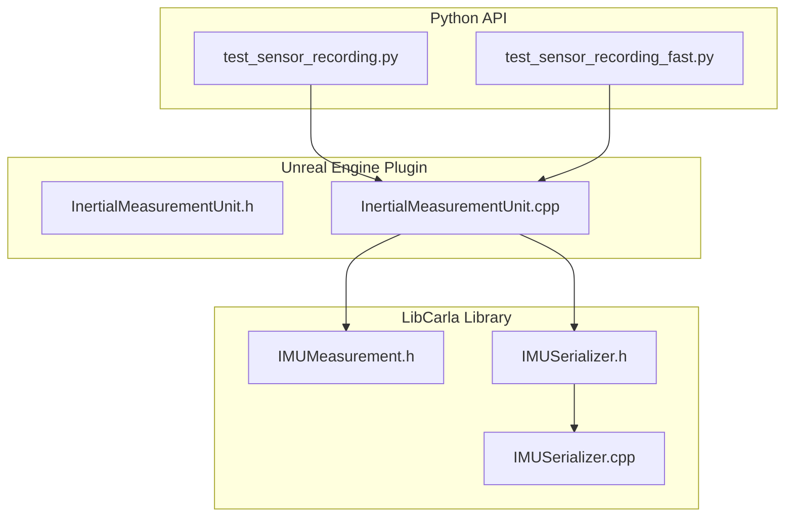
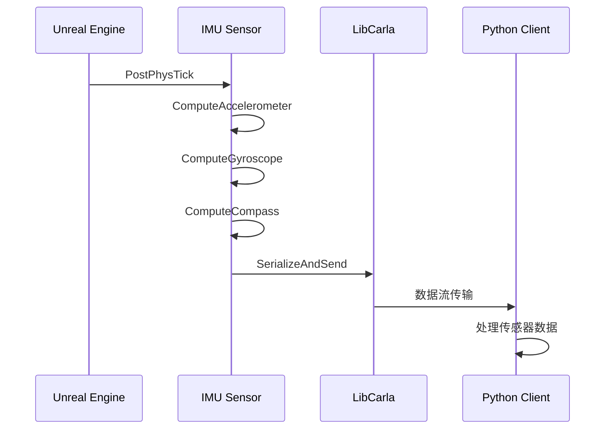
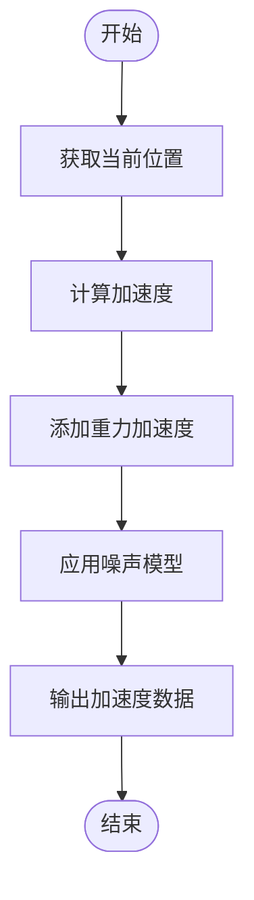
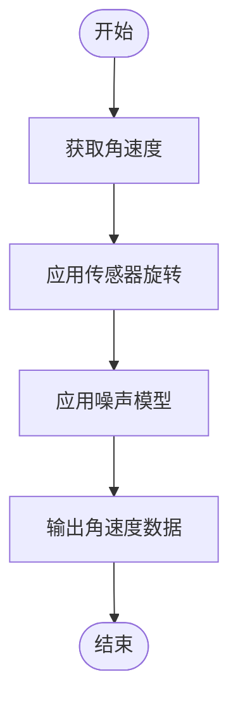
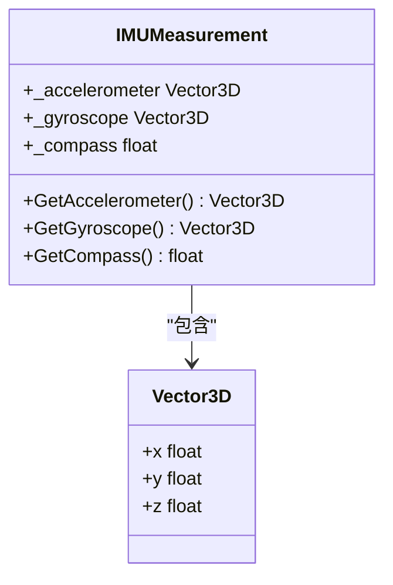
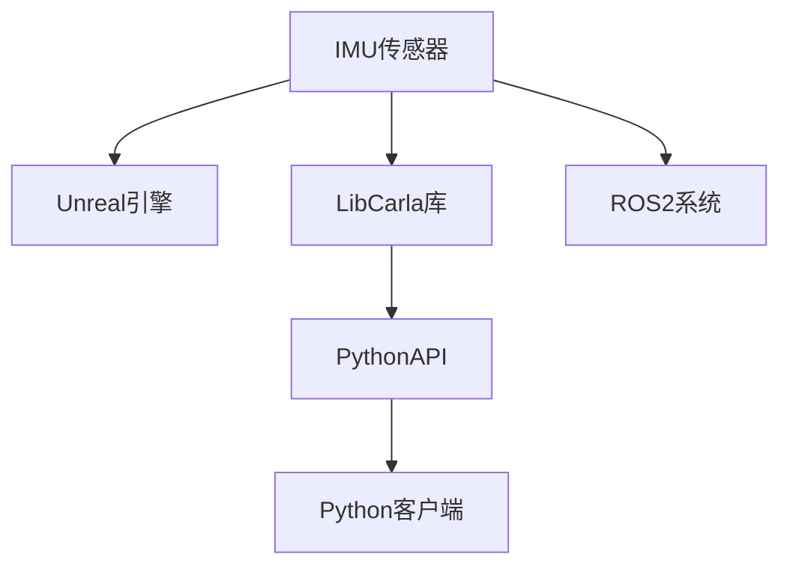

# IMU 传感器

> **引用文件**
> **本文档中引用的文件**

- [InertialMeasurementUnit.h](https://github.com/carla-simulator/carla/blob/ue5-dev/Unreal/CarlaUnreal/Plugins/Carla/Source/Carla/Sensor/InertialMeasurementUnit.h)
- [InertialMeasurementUnit.cpp](https://github.com/carla-simulator/carla/blob/ue5-dev/Unreal/CarlaUnreal/Plugins/Carla/Source/Carla/Sensor/InertialMeasurementUnit.cpp)
- [IMUMeasurement.h](https://github.com/carla-simulator/carla/blob/ue5-dev/LibCarla/source/carla/sensor/data/IMUMeasurement.h)
- [IMUSerializer.h](https://github.com/carla-simulator/carla/blob/ue5-dev/LibCarla/source/carla/sensor/s11n/IMUSerializer.h)
- [IMUSerializer.cpp](https://github.com/carla-simulator/carla/blob/ue5-dev/LibCarla/source/carla/sensor/s11n/IMUSerializer.cpp)
- [ActorBlueprintFunctionLibrary.cpp](https://github.com/carla-simulator/carla/blob/ue5-dev/Unreal/CarlaUnreal/Plugins/Carla/Source/Carla/Actor/ActorBlueprintFunctionLibrary.cpp)
- [test_sensor_recording.py](https://github.com/carla-simulator/carla/blob/ue5-dev/PythonAPI/test/API/test_sensor_recording.py)
- [test_sensor_recording_fast.py](https://github.com/carla-simulator/carla/blob/ue5-dev/PythonAPI/test/API/test_sensor_recording_fast.py)

## 目录

1. [简介](#简介)
2. [项目结构](#项目结构)
3. [核心组件](#核心组件)
4. [架构概述](#架构概述)
5. [详细组件分析](#详细组件分析)
6. [依赖分析](#依赖分析)
7. [性能考虑](#性能考虑)
8. [故障排除指南](#故障排除指南)
9. [结论](#结论)

## 简介

本文档详细介绍了 CARLA 模拟器中的 IMU（惯性测量单元）传感器，重点阐述其在车辆动态状态感知中的关键作用。IMU 传感器通过模拟三轴加速度计和三轴陀螺仪，提供线性加速度和角速度的测量数据，为自动驾驶系统的姿态估计、运动预测和传感器融合提供基础支持。文档深入解析了 IMU 传感器的数据结构、噪声模型实现以及在 Python 客户端中的使用方法，旨在为初学者和高级用户提供全面的技术参考。

## 项目结构

CARLA 的 IMU 传感器实现分布在多个模块中，主要包括 Unreal 引擎插件中的传感器实现、LibCarla 库中的数据序列化和 PythonAPI 中的客户端接口。这种分层架构确保了传感器功能的高效实现和跨平台访问。

**图示来源**

- [InertialMeasurementUnit.h](https://github.com/carla-simulator/carla/blob/ue5-dev/Unreal/CarlaUnreal/Plugins/Carla/Source/Carla/Sensor/InertialMeasurementUnit.h)
- [InertialMeasurementUnit.cpp](https://github.com/carla-simulator/carla/blob/ue5-dev/Unreal/CarlaUnreal/Plugins/Carla/Source/Carla/Sensor/InertialMeasurementUnit.cpp)
- [IMUMeasurement.h](https://github.com/carla-simulator/carla/blob/ue5-dev/LibCarla/source/carla/sensor/data/IMUMeasurement.h)
- [IMUSerializer.h](https://github.com/carla-simulator/carla/blob/ue5-dev/LibCarla/source/carla/sensor/s11n/IMUSerializer.h)
- [IMUSerializer.cpp](https://github.com/carla-simulator/carla/blob/ue5-dev/LibCarla/source/carla/sensor/s11n/IMUSerializer.cpp)
- [test_sensor_recording.py](https://github.com/carla-simulator/carla/blob/ue5-dev/PythonAPI/test/API/test_sensor_recording.py)
- [test_sensor_recording_fast.py](https://github.com/carla-simulator/carla/blob/ue5-dev/PythonAPI/test/API/test_sensor_recording_fast.py)

**章节来源**

- [InertialMeasurementUnit.h](https://github.com/carla-simulator/carla/blob/ue5-dev/Unreal/CarlaUnreal/Plugins/Carla/Source/Carla/Sensor/InertialMeasurementUnit.h)
- [InertialMeasurementUnit.cpp](https://github.com/carla-simulator/carla/blob/ue5-dev/Unreal/CarlaUnreal/Plugins/Carla/Source/Carla/Sensor/InertialMeasurementUnit.cpp)

## 核心组件

IMU 传感器的核心组件包括加速度计、陀螺仪和磁力计的模拟实现。加速度计通过车辆位置的二次导数计算线性加速度，并添加重力加速度分量；陀螺仪通过获取车辆的角速度来测量角速度；磁力计则计算车辆相对于北方的朝向。这些组件共同构成了 IMU 传感器的完整功能。

**章节来源**

- [InertialMeasurementUnit.h](https://github.com/carla-simulator/carla/blob/ue5-dev/Unreal/CarlaUnreal/Plugins/Carla/Source/Carla/Sensor/InertialMeasurementUnit.h)
- [InertialMeasurementUnit.cpp](https://github.com/carla-simulator/carla/blob/ue5-dev/Unreal/CarlaUnreal/Plugins/Carla/Source/Carla/Sensor/InertialMeasurementUnit.cpp)

## 架构概述

IMU 传感器的架构设计遵循模块化原则，将传感器的物理模拟、数据处理和通信功能分离。传感器在 Unreal 引擎的物理滴答周期中更新数据，通过序列化机制将数据发送到客户端，并支持 ROS2 等外部系统的集成。

**图示来源**

- [InertialMeasurementUnit.cpp](https://github.com/carla-simulator/carla/blob/ue5-dev/Unreal/CarlaUnreal/Plugins/Carla/Source/Carla/Sensor/InertialMeasurementUnit.cpp)
- [IMUSerializer.h](https://github.com/carla-simulator/carla/blob/ue5-dev/LibCarla/source/carla/sensor/s11n/IMUSerializer.h)
- [IMUSerializer.cpp](https://github.com/carla-simulator/carla/blob/ue5-dev/LibCarla/source/carla/sensor/s11n/IMUSerializer.cpp)

## 详细组件分析

### 加速度计分析

加速度计通过车辆位置的二次导数计算线性加速度。实现中使用了二次多项式插值的二阶导数来计算加速度，并添加了重力加速度分量。

**图示来源**

- <a href="https://github.com/carla-simulator/carla/blob/ue5-dev/Unreal/CarlaUnreal/Plugins/Carla/Source/Carla/Sensor/InertialMeasurementUnit.cpp#L103-L146" target="_blank">InertialMeasurementUnit.cpp</a>

**章节来源**

- <a href="https://github.com/carla-simulator/carla/blob/ue5-dev/Unreal/CarlaUnreal/Plugins/Carla/Source/Carla/Sensor/InertialMeasurementUnit.cpp#L103-L146" target="_blank">InertialMeasurementUnit.cpp</a>

### 陀螺仪分析

陀螺仪通过获取车辆的角速度来测量角速度。实现中考虑了传感器的局部旋转，并应用了噪声模型。

**图示来源**

- <a href="https://github.com/carla-simulator/carla/blob/ue5-dev/Unreal/CarlaUnreal/Plugins/Carla/Source/Carla/Sensor/InertialMeasurementUnit.cpp#L148-L166" target="_blank">InertialMeasurementUnit.cpp</a>

**章节来源**

- <a href="https://github.com/carla-simulator/carla/blob/ue5-dev/Unreal/CarlaUnreal/Plugins/Carla/Source/Carla/Sensor/InertialMeasurementUnit.cpp#L148-L166" target="_blank">InertialMeasurementUnit.cpp</a>

### 数据结构分析

IMU 传感器的数据结构包含加速度、角速度和罗盘方向三个主要字段，每个字段都有明确的单位和数据类型。

**图示来源**

- [IMUMeasurement.h](https://github.com/carla-simulator/carla/blob/ue5-dev/LibCarla/source/carla/sensor/data/IMUMeasurement.h)
- [Vector3D.h](https://github.com/carla-simulator/carla/blob/ue5-dev/LibCarla/source/carla/geom/Vector3D.h)

**章节来源**

- [IMUMeasurement.h](https://github.com/carla-simulator/carla/blob/ue5-dev/LibCarla/source/carla/sensor/data/IMUMeasurement.h)

## 依赖分析

IMU 传感器的实现依赖于多个 CARLA 组件，包括 Unreal 引擎的物理系统、LibCarla 的序列化框架和 PythonAPI 的客户端接口。

**图示来源**

- [InertialMeasurementUnit.cpp](https://github.com/carla-simulator/carla/blob/ue5-dev/Unreal/CarlaUnreal/Plugins/Carla/Source/Carla/Sensor/InertialMeasurementUnit.cpp)
- [IMUSerializer.h](https://github.com/carla-simulator/carla/blob/ue5-dev/LibCarla/source/carla/sensor/s11n/IMUSerializer.h)
- [test_sensor_recording.py](https://github.com/carla-simulator/carla/blob/ue5-dev/PythonAPI/test/API/test_sensor_recording.py)

**章节来源**

- [InertialMeasurementUnit.cpp](https://github.com/carla-simulator/carla/blob/ue5-dev/Unreal/CarlaUnreal/Plugins/Carla/Source/Carla/Sensor/InertialMeasurementUnit.cpp)
- [IMUSerializer.h](https://github.com/carla-simulator/carla/blob/ue5-dev/LibCarla/source/carla/sensor/s11n/IMUSerializer.h)
- [test_sensor_recording.py](https://github.com/carla-simulator/carla/blob/ue5-dev/PythonAPI/test/API/test_sensor_recording.py)

## 性能考虑

IMU 传感器的性能主要受物理模拟精度和数据传输频率的影响。通过优化插值算法和减少不必要的计算，可以提高传感器的实时性能。

## 故障排除指南

当 IMU 传感器数据出现异常时，应检查传感器的安装位置、噪声参数设置和数据处理逻辑。确保传感器的坐标系与车辆坐标系正确对齐。

**章节来源**

- [InertialMeasurementUnit.cpp](https://github.com/carla-simulator/carla/blob/ue5-dev/Unreal/CarlaUnreal/Plugins/Carla/Source/Carla/Sensor/InertialMeasurementUnit.cpp)
- [test_sensor_recording.py](https://github.com/carla-simulator/carla/blob/ue5-dev/PythonAPI/test/API/test_sensor_recording.py)

## 结论

CARLA 的 IMU 传感器为自动驾驶仿真提供了精确的惯性测量功能。通过深入理解其工作原理和实现细节，开发者可以更好地利用这一工具进行车辆动态状态感知的研究和开发。
