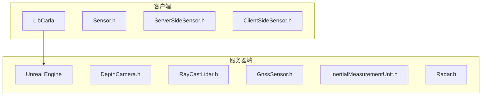
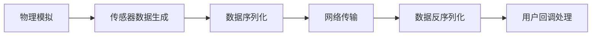
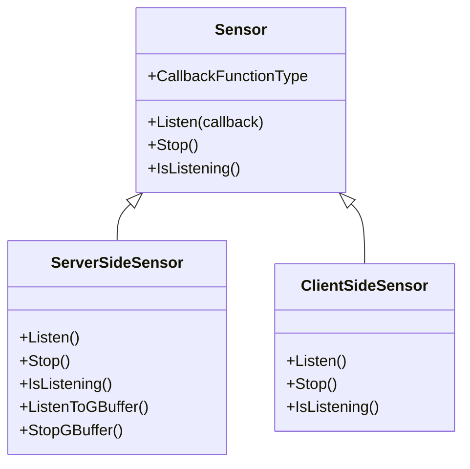
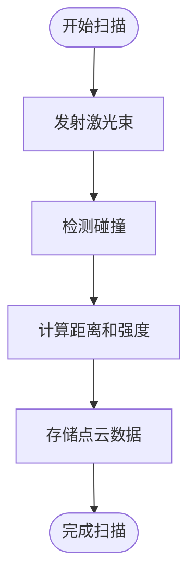
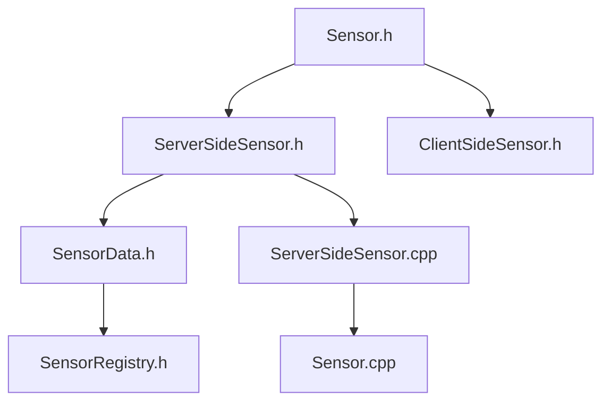

# 传感器系统

**本文档中引用的文件**  
- [ServerSideSensor.h](https://github.com/carla-simulator/carla/blob/ue5-dev/LibCarla/source/carla/client/ServerSideSensor.h)
- [ClientSideSensor.h](https://github.com/carla-simulator/carla/blob/ue5-dev/LibCarla/source/carla/client/ClientSideSensor.h)
- [Sensor.h](https://github.com/carla-simulator/carla/blob/ue5-dev/LibCarla/source/carla/client/Sensor.h)
- [SensorData.h](https://github.com/carla-simulator/carla/blob/ue5-dev/LibCarla/source/carla/sensor/SensorData.h)
- [SensorRegistry.h](https://github.com/carla-simulator/carla/blob/ue5-dev/LibCarla/source/carla/sensor/SensorRegistry.h)
- [ServerSideSensor.cpp](https://github.com/carla-simulator/carla/blob/ue5-dev/LibCarla/source/carla/client/ServerSideSensor.cpp)
- [Sensor.cpp](https://github.com/carla-simulator/carla/blob/ue5-dev/PythonAPI/carla/src/Sensor.cpp)
- [DepthCamera.h](https://github.com/carla-simulator/carla/blob/ue5-dev/Unreal/CarlaUnreal/Plugins/Carla/Source/Carla/Sensor/DepthCamera.h)
- [RayCastLidar.h](https://github.com/carla-simulator/carla/blob/ue5-dev/Unreal/CarlaUnreal/Plugins/Carla/Source/Carla/Sensor/RayCastLidar.h)
- [GnssSensor.h](https://github.com/carla-simulator/carla/blob/ue5-dev/Unreal/CarlaUnreal/Plugins/Carla/Source/Carla/Sensor/GnssSensor.h)
- [InertialMeasurementUnit.h](https://github.com/carla-simulator/carla/blob/ue5-dev/Unreal/CarlaUnreal/Plugins/Carla/Source/Carla/Sensor/InertialMeasurementUnit.h)
- [Radar.h](https://github.com/carla-simulator/carla/blob/ue5-dev/Unreal/CarlaUnreal/Plugins/Carla/Source/Carla/Sensor/Radar.h)

## 目录
1. [简介](#简介)
2. [项目结构](#项目结构)
3. [核心组件](#核心组件)
4. [架构概述](#架构概述)
5. [详细组件分析](#详细组件分析)
6. [依赖分析](#依赖分析)
7. [性能考虑](#性能考虑)
8. [故障排除指南](#故障排除指南)
9. [结论](#结论)

## 简介
CARLA传感器系统是一个高度模块化和可扩展的架构，用于模拟自动驾驶车辆中的各种传感器。该系统通过ServerSideSensor和ClientSideSensor的分离设计实现了高效的数据采集和传输。本文件将深入探讨各种传感器模型的实现和使用，包括RGB摄像头、深度传感器、语义分割摄像头、激光雷达、雷达、IMU、GNSS等。我们将详细解释传感器数据格式、时间戳同步、数据流控制和传感器噪声模型等关键功能。

## 项目结构
CARLA传感器系统的代码库组织良好，主要分为客户端和服务器端两个部分。客户端代码位于LibCarla目录下，而服务器端实现则在Unreal插件中。这种分离的设计使得传感器逻辑可以在模拟器内部高效执行，同时允许客户端灵活地处理和分析传感器数据。

**图源**  
- [Sensor.h](https://github.com/carla-simulator/carla/blob/ue5-dev/LibCarla/source/carla/client/Sensor.h)
- [DepthCamera.h](https://github.com/carla-simulator/carla/blob/ue5-dev/Unreal/CarlaUnreal/Plugins/Carla/Source/Carla/Sensor/DepthCamera.h)
- [RayCastLidar.h](https://github.com/carla-simulator/carla/blob/ue5-dev/Unreal/CarlaUnreal/Plugins/Carla/Source/Carla/Sensor/RayCastLidar.h)

**节源**  
- [Sensor.h](https://github.com/carla-simulator/carla/blob/ue5-dev/LibCarla/source/carla/client/Sensor.h)
- [DepthCamera.h](https://github.com/carla-simulator/carla/blob/ue5-dev/Unreal/CarlaUnreal/Plugins/Carla/Source/Carla/Sensor/DepthCamera.h)

## 核心组件
CARLA传感器系统的核心组件包括Sensor基类、ServerSideSensor和ClientSideSensor派生类，以及各种具体的传感器实现。Sensor基类定义了所有传感器的通用接口，包括Listen、Stop和IsListening等方法。ServerSideSensor用于处理需要在服务器端生成数据的传感器，而ClientSideSensor则用于仅在客户端处理数据的传感器。

**节源**  
- [Sensor.h](https://github.com/carla-simulator/carla/blob/ue5-dev/LibCarla/source/carla/client/Sensor.h)
- [ServerSideSensor.h](https://github.com/carla-simulator/carla/blob/ue5-dev/LibCarla/source/carla/client/ServerSideSensor.h)
- [ClientSideSensor.h](https://github.com/carla-simulator/carla/blob/ue5-dev/LibCarla/source/carla/client/ClientSideSensor.h)

## 架构概述
CARLA传感器系统采用分层架构设计，将传感器的抽象接口与具体实现分离。这种设计模式允许系统轻松扩展以支持新的传感器类型，同时保持API的一致性。数据流从服务器端的物理模拟开始，经过序列化处理，通过网络传输到客户端，最后由用户定义的回调函数处理。

**图源**  
- [SensorData.h](https://github.com/carla-simulator/carla/blob/ue5-dev/LibCarla/source/carla/sensor/SensorData.h)
- [SensorRegistry.h](https://github.com/carla-simulator/carla/blob/ue5-dev/LibCarla/source/carla/sensor/SensorRegistry.h)

## 详细组件分析
### 传感器基类分析
CARLA中的所有传感器都继承自Sensor基类，该类定义了传感器的基本行为和接口。通过虚函数机制，系统能够以统一的方式处理不同类型的传感器。

**图源**  
- [Sensor.h](https://github.com/carla-simulator/carla/blob/ue5-dev/LibCarla/source/carla/client/Sensor.h)
- [ServerSideSensor.h](https://github.com/carla-simulator/carla/blob/ue5-dev/LibCarla/source/carla/client/ServerSideSensor.h)
- [ClientSideSensor.h](https://github.com/carla-simulator/carla/blob/ue5-dev/LibCarla/source/carla/client/ClientSideSensor.h)

**节源**  
- [Sensor.h](https://github.com/carla-simulator/carla/blob/ue5-dev/LibCarla/source/carla/client/Sensor.h)
- [ServerSideSensor.h](https://github.com/carla-simulator/carla/blob/ue5-dev/LibCarla/source/carla/client/ServerSideSensor.h)

### 具体传感器实现分析
#### 深度摄像头
深度摄像头传感器生成表示场景深度的图像数据。它基于ShaderBasedSensor实现，利用着色器技术高效计算每个像素的深度值。

**节源**  
- [DepthCamera.h](https://github.com/carla-simulator/carla/blob/ue5-dev/Unreal/CarlaUnreal/Plugins/Carla/Source/Carla/Sensor/DepthCamera.h)

#### 激光雷达
激光雷达传感器使用光线投射技术模拟LiDAR扫描过程。它通过发射多束激光并计算反射点来生成三维点云数据。

**图源**  
- [RayCastLidar.h](https://github.com/carla-simulator/carla/blob/ue5-dev/Unreal/CarlaUnreal/Plugins/Carla/Source/Carla/Sensor/RayCastLidar.h)

**节源**  
- [RayCastLidar.h](https://github.com/carla-simulator/carla/blob/ue5-dev/Unreal/CarlaUnreal/Plugins/Carla/Source/Carla/Sensor/RayCastLidar.h)

#### GNSS传感器
GNSS传感器模拟全球导航卫星系统，提供地理位置信息。它考虑了偏差和标准差等噪声因素，以更真实地模拟实际GNSS设备的行为。

**节源**  
- [GnssSensor.h](https://github.com/carla-simulator/carla/blob/ue5-dev/Unreal/CarlaUnreal/Plugins/Carla/Source/Carla/Sensor/GnssSensor.h)

#### IMU传感器
IMU（惯性测量单元）传感器模拟加速度计、陀螺仪和磁力计，提供车辆的运动状态信息。它通过物理计算生成线性加速度和角速度数据。

**节源**  
- [InertialMeasurementUnit.h](https://github.com/carla-simulator/carla/blob/ue5-dev/Unreal/CarlaUnreal/Plugins/Carla/Source/Carla/Sensor/InertialMeasurementUnit.h)

#### 雷达传感器
雷达传感器模拟毫米波雷达的工作原理，检测周围物体并计算其相对速度。它使用FOV（视场角）和探测范围等参数来配置传感器特性。

**节源**  
- [Radar.h](https://github.com/carla-simulator/carla/blob/ue5-dev/Unreal/CarlaUnreal/Plugins/Carla/Source/Carla/Sensor/Radar.h)

## 依赖分析
CARLA传感器系统具有清晰的依赖关系，客户端和服务器端组件通过明确定义的接口进行通信。这种设计降低了组件间的耦合度，提高了系统的可维护性和可扩展性。

**图源**  
- [Sensor.h](https://github.com/carla-simulator/carla/blob/ue5-dev/LibCarla/source/carla/client/Sensor.h)
- [ServerSideSensor.cpp](https://github.com/carla-simulator/carla/blob/ue5-dev/LibCarla/source/carla/client/ServerSideSensor.cpp)
- [Sensor.cpp](https://github.com/carla-simulator/carla/blob/ue5-dev/PythonAPI/carla/src/Sensor.cpp)

**节源**  
- [Sensor.h](https://github.com/carla-simulator/carla/blob/ue5-dev/LibCarla/source/carla/client/Sensor.h)
- [ServerSideSensor.cpp](https://github.com/carla-simulator/carla/blob/ue5-dev/LibCarla/source/carla/client/ServerSideSensor.cpp)
- [Sensor.cpp](https://github.com/carla-simulator/carla/blob/ue5-dev/PythonAPI/carla/src/Sensor.cpp)

## 性能考虑
CARLA传感器系统在设计时充分考虑了性能优化。通过数据压缩、流式传输和多传感器同步机制，系统能够在保持高精度的同时实现高效的实时模拟。服务器端传感器的数据生成与物理模拟同步，确保了时间戳的准确性。

## 故障排除指南
当遇到传感器相关问题时，建议首先检查传感器是否正确连接并正在监听数据流。确保回调函数正确设置，并验证传感器配置参数是否符合预期。对于网络传输问题，检查ROS2集成设置和流式传输配置。

**节源**  
- [ServerSideSensor.h](https://github.com/carla-simulator/carla/blob/ue5-dev/LibCarla/source/carla/client/ServerSideSensor.h)
- [ServerSideSensor.cpp](https://github.com/carla-simulator/carla/blob/ue5-dev/LibCarla/source/carla/client/ServerSideSensor.cpp)

## 结论
CARLA传感器系统通过精心设计的架构实现了高效、灵活和可扩展的传感器模拟功能。ServerSideSensor和ClientSideSensor的分离设计使得系统既能处理复杂的物理模拟，又能提供灵活的数据处理接口。各种传感器模型的实现充分考虑了真实世界的物理特性和噪声因素，为自动驾驶研究提供了可靠的模拟环境。