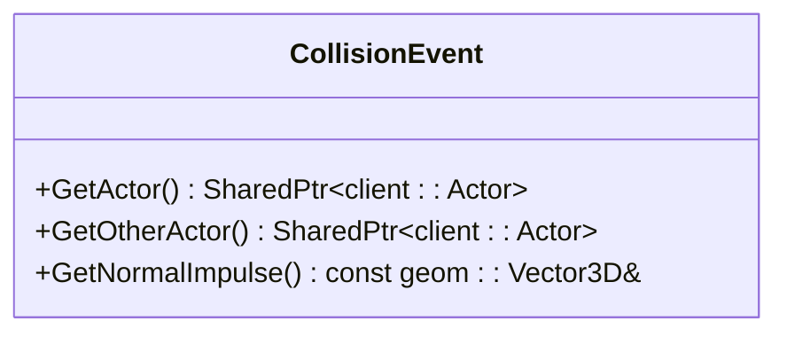
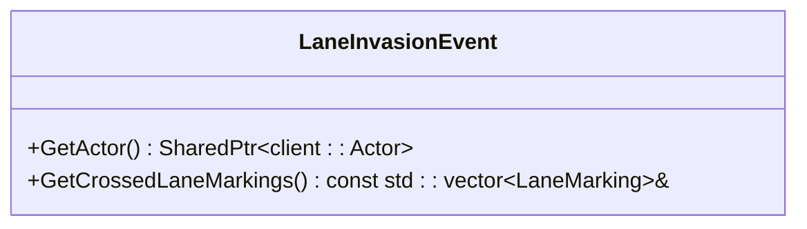
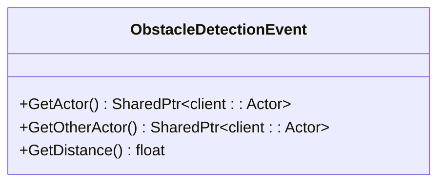
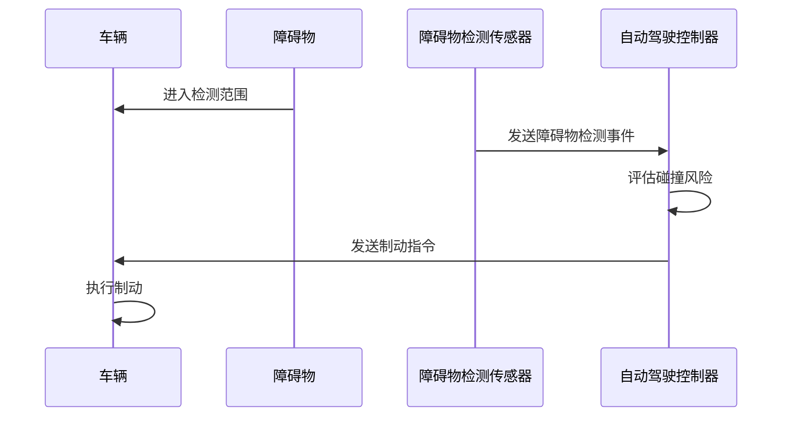

# 其他传感器

> **引用文件**
> **本文档中引用的文件**

- [CollisionEvent.h](https://github.com/carla-simulator/carla/blob/ue5-dev/LibCarla/source/carla/sensor/data/CollisionEvent.h)
- [LaneInvasionEvent.h](https://github.com/carla-simulator/carla/blob/ue5-dev/LibCarla/source/carla/sensor/data/LaneInvasionEvent.h)
- [ObstacleDetectionEvent.h](https://github.com/carla-simulator/carla/blob/ue5-dev/LibCarla/source/carla/sensor/data/ObstacleDetectionEvent.h)
- [RadarData.h](https://github.com/carla-simulator/carla/blob/ue5-dev/LibCarla/source/carla/sensor/data/RadarData.h)
- [Sensor.cpp](https://github.com/carla-simulator/carla/blob/ue5-dev/PythonAPI/carla/src/Sensor.cpp)
- [SensorData.cpp](https://github.com/carla-simulator/carla/blob/ue5-dev/PythonAPI/carla/src/SensorData.cpp)
- [test_collision_sensor.py](https://github.com/carla-simulator/carla/blob/ue5-dev/PythonAPI/test/smoke/test_collision_sensor.py)
- [prop_control.py](https://github.com/carla-simulator/carla/blob/ue5-dev/PythonAPI/test/API/prop_control.py)
- [manual_control.py](https://github.com/carla-simulator/carla/blob/ue5-dev/PythonAPI/examples/manual_control.py)
- [automatic_control.py](https://github.com/carla-simulator/carla/blob/ue5-dev/PythonAPI/examples/automatic_control.py)
- [visualize_multiple_sensors.py](https://github.com/carla-simulator/carla/blob/ue5-dev/PythonAPI/examples/visualize_multiple_sensors.py)
- [LaneInvasionSensor.cpp](https://github.com/carla-simulator/carla/blob/ue5-dev/Unreal/CarlaUnreal/Plugins/Carla/Source/Carla/Sensor/LaneInvasionSensor.cpp)
- [ObstacleDetectionSensor.cpp](https://github.com/carla-simulator/carla/blob/ue5-dev/Unreal/CarlaUnreal/Plugins/Carla/Source/Carla/Sensor/ObstacleDetectionSensor.cpp)

## 目录

1. [引言](#引言)
2. [碰撞传感器](#碰撞传感器)
3. [车道入侵传感器](#车道入侵传感器)
4. [障碍物检测传感器](#障碍物检测传感器)
5. [传感器数据结构](#传感器数据结构)
6. [传感器使用示例](#传感器使用示例)
7. [自动驾驶算法测试应用](#自动驾驶算法测试应用)
8. [硬件对应与高级实现](#硬件对应与高级实现)
9. [结论](#结论)

## 引言

CARLA 模拟器提供了多种专用传感器，用于支持自动驾驶系统的开发和测试。这些传感器包括碰撞传感器、车道入侵传感器和障碍物检测传感器，它们在模拟真实世界驾驶场景中起着关键作用。本文档将详细介绍这些传感器的工作原理、应用场景、数据结构以及使用方法，为开发者提供全面的技术参考。

## 碰撞传感器

碰撞传感器用于检测车辆与其他物体的物理接触。该传感器基于物理引擎的碰撞检测算法，当车辆与环境中的其他实体发生碰撞时，会生成相应的事件。

碰撞传感器的工作原理是通过监听物理引擎中的碰撞事件。当两个具有碰撞体的物体发生接触时，物理引擎会触发碰撞回调，传感器捕获这些信息并生成碰撞事件。传感器记录碰撞点的位置、碰撞物体的标识以及碰撞的法向冲量等信息。

在自动驾驶系统中，碰撞传感器主要用于安全性评估和紧急制动系统验证。通过监测碰撞事件，可以评估自动驾驶算法在避免碰撞方面的性能。

**本节来源**

- <a href="https://github.com/carla-simulator/carla/blob/ue5-dev/LibCarla/source/carla/sensor/data/CollisionEvent.h#L1-L63" target="_blank">CollisionEvent.h</a>
- <a href="https://github.com/carla-simulator/carla/blob/ue5-dev/PythonAPI/test/smoke/test_collision_sensor.py#L1-L54" target="_blank">test_collision_sensor.py</a>

## 车道入侵传感器

车道入侵传感器用于监测车辆相对于车道线的位置。该传感器使用 OpenDRIVE 地图数据来确定车辆是否侵入了其他车道。

传感器通过考虑车辆四个车轮之间的空间来判断车道入侵情况。当车辆跨越车道线时，传感器会注册一个事件。值得注意的是，由于 OpenDRIVE 文件与地图之间可能存在差异，可能会出现跨越不可见车道的情况。

车道入侵传感器的输出包含一个被跨越车道线的列表，计算基于 OpenDRIVE 数据并考虑整个车轮空间。因此，同一时间可能会跨越多条车道线。该传感器没有可配置的属性。

在驾驶辅助系统中，车道入侵传感器可用于实现车道保持辅助功能，当检测到车辆偏离车道时，系统可以发出警告或自动纠正方向。

**本节来源**

- <a href="https://github.com/carla-simulator/carla/blob/ue5-dev/LibCarla/source/carla/sensor/data/LaneInvasionEvent.h#L1-L55" target="_blank">LaneInvasionEvent.h</a>
- <a href="https://github.com/carla-simulator/carla/blob/ue5-dev/Unreal/CarlaUnreal/Plugins/Carla/Source/Carla/Sensor/LaneInvasionSensor.cpp#L1-L19" target="_blank">LaneInvasionSensor.cpp</a>

## 障碍物检测传感器

障碍物检测传感器模拟车载雷达的前向探测功能。该传感器使用射线投射（ray casting）技术来检测前方障碍物。

传感器向前方发射射线，当射线与环境中的物体相交时，会记录交点信息。传感器可以配置检测距离、命中半径等参数。可选地，可以启用动态物体限制，只检测动态障碍物。

障碍物检测传感器在自动驾驶系统中用于实现前向碰撞预警和自适应巡航控制功能。通过持续监测前方道路情况，系统可以提前识别潜在的碰撞风险并采取相应措施。

**本节来源**

- <a href="https://github.com/carla-simulator/carla/blob/ue5-dev/LibCarla/source/carla/sensor/data/ObstacleDetectionEvent.h#L1-L67" target="_blank">ObstacleDetectionEvent.h</a>
- <a href="https://github.com/carla-simulator/carla/blob/ue5-dev/Unreal/CarlaUnreal/Plugins/Carla/Source/Carla/Sensor/ObstacleDetectionSensor.cpp#L1-L169" target="_blank">ObstacleDetectionSensor.cpp</a>

## 传感器数据结构

### 碰撞事件数据结构

碰撞事件包含以下信息：

- **自身参与者**：测量碰撞的参与者
- **其他参与者**：发生碰撞的另一个参与者
- **法向冲量**：碰撞结果的法向冲量



**图表来源**

- <a href="https://github.com/carla-simulator/carla/blob/ue5-dev/LibCarla/source/carla/sensor/data/CollisionEvent.h#L19-L58" target="_blank">CollisionEvent.h</a>

### 车道入侵事件数据结构

车道入侵事件包含以下信息：

- **自身参与者**：侵入其他车道的参与者
- **被跨越的车道线**：被跨越的车道线列表



**图表来源**

- <a href="https://github.com/carla-simulator/carla/blob/ue5-dev/LibCarla/source/carla/sensor/data/LaneInvasionEvent.h#L21-L50" target="_blank">LaneInvasionEvent.h</a>

### 障碍物检测事件数据结构

障碍物检测事件包含以下信息：

- **自身参与者**：测量障碍物的参与者
- **其他参与者**：被检测到的障碍物
- **距离**：到障碍物的距离



**图表来源**

- <a href="https://github.com/carla-simulator/carla/blob/ue5-dev/LibCarla/source/carla/sensor/data/ObstacleDetectionEvent.h#L19-L62" target="_blank">ObstacleDetectionEvent.h</a>

## 传感器使用示例

### 订阅传感器事件流

所有传感器都有`listen()`方法，用于注册回调函数。当传感器获取数据时，会调用该回调函数。

```python
# 为碰撞传感器设置回调函数
def collision_callback(event):
    print(f"检测到碰撞: {event.other_actor}")

collision_sensor.listen(collision_callback)
```

### 处理传感器回调函数

在回调函数中，可以访问传感器数据并执行相应的处理逻辑。例如，对于车道入侵传感器：

```python
def lane_invasion_callback(event):
    lane_types = {x.type for x in event.crossed_lane_markings}
    lane_names = [str(x).split()[-1] for x in lane_types]
    print(f"跨越车道线: {' and '.join(lane_names)}")
```

### 实现基本驾驶策略

基于传感器数据，可以实现简单的驾驶策略。例如，结合碰撞传感器和车道入侵传感器：

```python
class DrivingAssistant:
    def __init__(self, vehicle):
        self.vehicle = vehicle
        self.setup_sensors()

    def setup_sensors(self):
        # 设置碰撞传感器
        collision_bp = world.get_blueprint_library().find('sensor.other.collision')
        self.collision_sensor = world.spawn_actor(collision_bp, carla.Transform(), attach_to=self.vehicle)
        self.collision_sensor.listen(self.on_collision)

        # 设置车道入侵传感器
        lane_invasion_bp = world.get_blueprint_library().find('sensor.other.lane_invasion')
        self.lane_invasion_sensor = world.spawn_actor(lane_invasion_bp, carla.Transform(), attach_to=self.vehicle)
        self.lane_invasion_sensor.listen(self.on_lane_invasion)

    def on_collision(self, event):
        print("紧急制动: 检测到碰撞")
        self.vehicle.apply_control(carla.VehicleControl(brake=1.0))

    def on_lane_invasion(self, event):
        print("车道保持: 检测到车道偏离")
        # 实现车道纠正逻辑
```

**本节来源**

- <a href="https://github.com/carla-simulator/carla/blob/ue5-dev/PythonAPI/carla/src/Sensor.cpp#L1-L54" target="_blank">Sensor.cpp</a>
- <a href="https://github.com/carla-simulator/carla/blob/ue5-dev/PythonAPI/carla/src/SensorData.cpp#L458-L476" target="_blank">SensorData.cpp</a>
- <a href="https://github.com/carla-simulator/carla/blob/ue5-dev/PythonAPI/test/API/prop_control.py#L657-L680" target="_blank">prop_control.py</a>
- <a href="https://github.com/carla-simulator/carla/blob/ue5-dev/PythonAPI/examples/manual_control.py#L931-L954" target="_blank">manual_control.py</a>

## 自动驾驶算法测试应用

### 安全性评估

碰撞传感器可用于评估自动驾驶系统的安全性。通过在各种场景中测试车辆的碰撞频率和严重程度，可以量化系统的安全性能。

### 合规性检查

车道入侵传感器可用于检查自动驾驶系统是否遵守交通规则。通过监测车辆是否保持在车道内，可以评估系统在车道保持方面的合规性。

### 紧急制动系统验证

结合碰撞传感器和障碍物检测传感器，可以验证紧急制动系统的性能。通过设置不同的测试场景，如前方突然出现障碍物，可以评估系统的反应时间和制动效果。



**图表来源**

- <a href="https://github.com/carla-simulator/carla/blob/ue5-dev/PythonAPI/test/smoke/test_collision_sensor.py#L19-L37" target="_blank">test_collision_sensor.py</a>
- <a href="https://github.com/carla-simulator/carla/blob/ue5-dev/PythonAPI/examples/visualize_multiple_sensors.py#L143-L151" target="_blank">visualize_multiple_sensors.py</a>

## 硬件对应与高级实现

### 真实车辆中的对应硬件

- **碰撞传感器**：对应车辆的碰撞检测系统，通常由车身上的加速度传感器和压力传感器组成
- **车道入侵传感器**：对应车道保持辅助系统（LKAS）的摄像头
- **障碍物检测传感器**：对应前向雷达或激光雷达

### 基于物理引擎的碰撞检测算法

CARLA 使用物理引擎（如 Unreal Engine 的 PhysX）来实现精确的碰撞检测。物理引擎维护一个碰撞体层次结构，通过空间分割算法（如 BVH 树）来高效地检测潜在的碰撞对。

### 基于路径规划的障碍物预测机制

高级自动驾驶系统不仅检测当前障碍物，还能预测障碍物的未来轨迹。这通常结合传感器数据和路径规划算法，使用卡尔曼滤波或粒子滤波来估计障碍物的运动状态。

**本节来源**

- <a href="https://github.com/carla-simulator/carla/blob/ue5-dev/Unreal/CarlaUnreal/Plugins/Carla/Source/Carla/Sensor/ObstacleDetectionSensor.cpp#L56-L65" target="_blank">ObstacleDetectionSensor.cpp</a>
- <a href="https://github.com/carla-simulator/carla/blob/ue5-dev/LibCarla/source/carla/sensor/data/RadarData.h#L27-L32" target="_blank">RadarData.h</a>

## 结论

CARLA 的专用传感器为自动驾驶系统的开发和测试提供了强大的工具。通过合理使用碰撞传感器、车道入侵传感器和障碍物检测传感器，开发者可以构建安全可靠的自动驾驶算法。这些传感器不仅能够模拟真实车辆的感知能力，还提供了精确的物理仿真，使得在虚拟环境中进行的测试结果具有很高的可信度。
