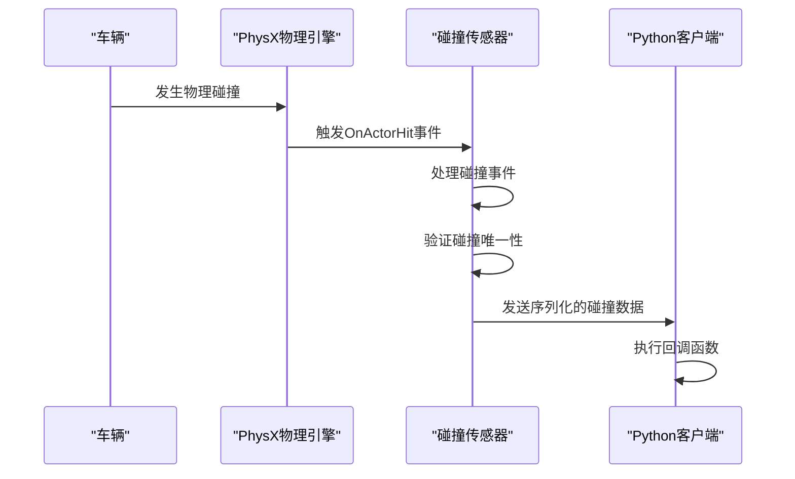
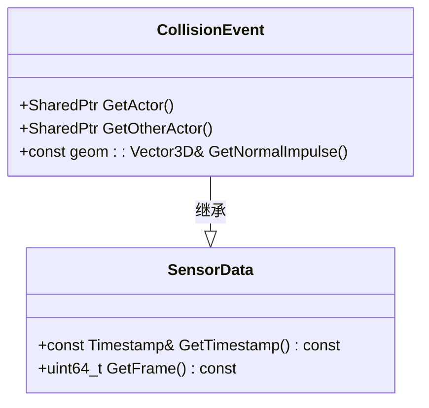
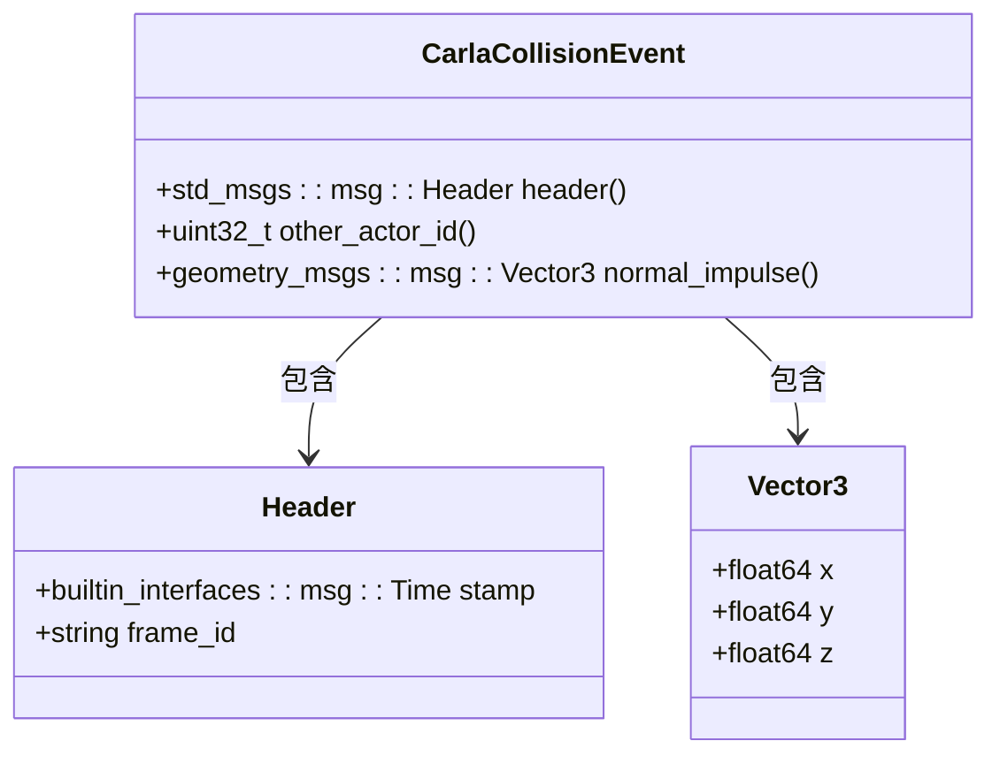
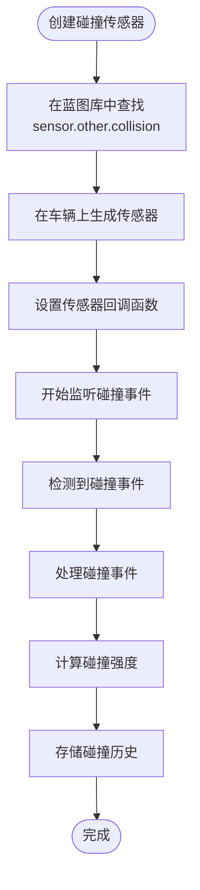
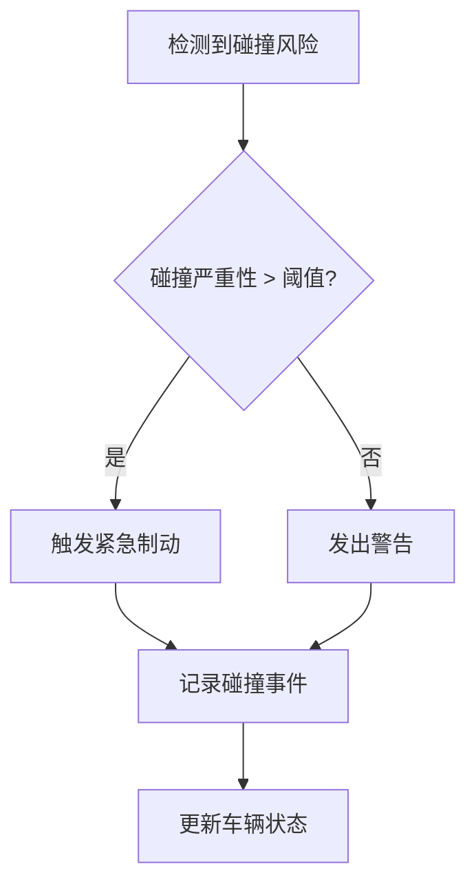
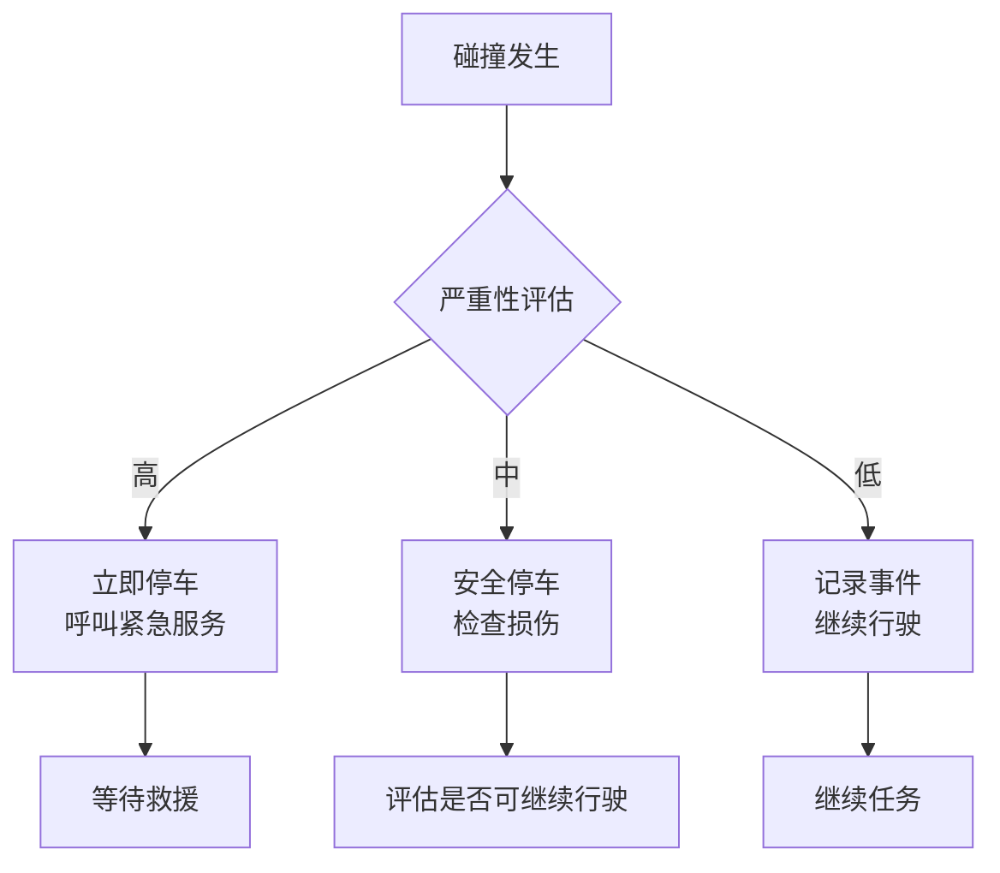
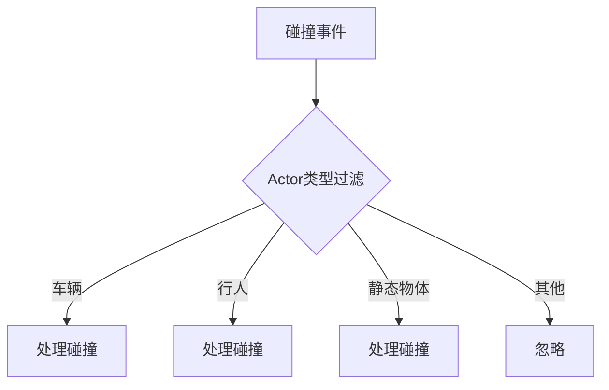
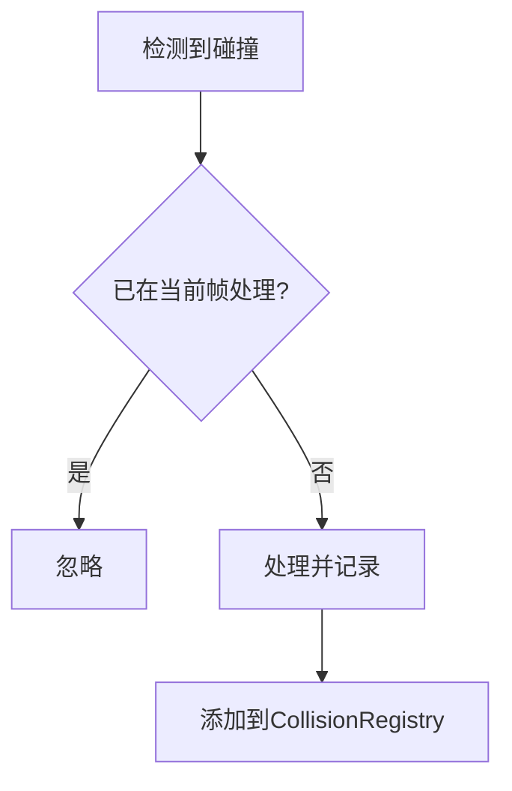

# 碰撞传感器

> **引用文件**
> **本文档中引用的文件**

- [CollisionSensor.h](https://github.com/carla-simulator/carla/blob/ue5-dev/Unreal/CarlaUnreal/Plugins/Carla/Source/Carla/Sensor/CollisionSensor.h)
- [CollisionSensor.cpp](https://github.com/carla-simulator/carla/blob/ue5-dev/Unreal/CarlaUnreal/Plugins/Carla/Source/Carla/Sensor/CollisionSensor.cpp)
- [CollisionEvent.h](https://github.com/carla-simulator/carla/blob/ue5-dev/LibCarla/source/carla/sensor/data/CollisionEvent.h)
- [CarlaCollisionEvent.h](https://github.com/carla-simulator/carla/blob/ue5-dev/LibCarla/source/carla/ros2/types/CarlaCollisionEvent.h)
- [CarlaCollisionPublisher.cpp](https://github.com/carla-simulator/carla/blob/ue5-dev/LibCarla/source/carla/ros2/publishers/CarlaCollisionPublisher.cpp)
- [automatic_control.py](https://github.com/carla-simulator/carla/blob/ue5-dev/PythonAPI/examples/automatic_control.py)
- [test_collision.py](https://github.com/carla-simulator/carla/blob/ue5-dev/PythonAPI/test/API/test_collision.py)
- [test_collision_sensor.py](https://github.com/carla-simulator/carla/blob/ue5-dev/PythonAPI/test/smoke/test_collision_sensor.py)

## 目录

1. [简介](#简介)
2. [工作原理](#工作原理)
3. [数据结构](#数据结构)
4. [Python 客户端实现](#python客户端实现)
5. [自动驾驶系统中的应用](#自动驾驶系统中的应用)
6. [性能优化](#性能优化)
7. [故障排除](#故障排除)
8. [结论](#结论)

## 简介

碰撞传感器是 CARLA 模拟器中的关键组件，用于检测车辆与其他 Actor（包括其他车辆、行人和静态物体）之间的物理接触。该传感器基于 Unreal Engine 的 PhysX 物理引擎，能够精确捕捉碰撞事件的详细信息，如碰撞点的世界坐标、碰撞法线向量和涉及的两个 Actor 的引用。碰撞传感器在自动驾驶系统的开发和测试中扮演着至关重要的角色，可用于紧急制动触发、碰撞后行为决策和安全性基准测试。

## 工作原理

碰撞传感器通过监听其附着的 Actor 的物理碰撞事件来工作。当附着的车辆与其他 Actor 发生碰撞时，Unreal Engine 的 PhysX 物理引擎会触发碰撞事件，碰撞传感器捕获这些事件并将其转换为可处理的数据格式。传感器使用 PhysX 子步进机制来确保物理模拟的精确性，这允许在较低的时间步长下进行物理计算，从而提高碰撞检测的准确性。



**Diagram sources**

- <a href="https://github.com/carla-simulator/carla/blob/ue5-dev/Unreal/CarlaUnreal/Plugins/Carla/Source/Carla/Sensor/CollisionSensor.cpp#L41-L127" target="_blank">CollisionSensor.cpp</a>

**Section sources**

- <a href="https://github.com/carla-simulator/carla/blob/ue5-dev/Unreal/CarlaUnreal/Plugins/Carla/Source/Carla/Sensor/CollisionSensor.cpp#L1-L128" target="_blank">CollisionSensor.cpp</a>
- <a href="https://github.com/carla-simulator/carla/blob/ue5-dev/Docs/adv_synchrony_timestep.md#L73-L103" target="_blank">adv_synchrony_timestep.md</a>

## 数据结构

碰撞传感器生成的碰撞事件包含多个关键字段，这些字段提供了关于碰撞的详细信息。主要数据结构包括`CollisionEvent`和`CarlaCollisionEvent`，它们分别在 C++和 ROS2 环境中使用。

### CollisionEvent 结构

`CollisionEvent`是 CARLA 中表示碰撞事件的核心数据结构，包含以下字段：

- **\_self_actor**: 引发碰撞的 Actor（即附着传感器的车辆）
- **\_other_actor**: 被碰撞的 Actor（其他车辆、行人或静态物体）
- **\_normal_impulse**: 碰撞法线方向的冲量向量，表示碰撞的强度和方向



**Diagram sources**

- <a href="https://github.com/carla-simulator/carla/blob/ue5-dev/LibCarla/source/carla/sensor/data/CollisionEvent.h#L19-L58" target="_blank">CollisionEvent.h</a>

**Section sources**

- <a href="https://github.com/carla-simulator/carla/blob/ue5-dev/LibCarla/source/carla/sensor/data/CollisionEvent.h#L1-L63" target="_blank">CollisionEvent.h</a>

### CarlaCollisionEvent 结构

在 ROS2 集成中，碰撞事件被封装为`CarlaCollisionEvent`消息类型，包含以下字段：

- **header**: 包含时间戳和帧 ID 的标准消息头
- **other_actor_id**: 被碰撞 Actor 的唯一标识符
- **normal_impulse**: 碰撞法线方向的冲量向量



**Diagram sources**

- <a href="https://github.com/carla-simulator/carla/blob/ue5-dev/LibCarla/source/carla/ros2/types/CarlaCollisionEvent.h#L74-L258" target="_blank">CarlaCollisionEvent.h</a>
- <a href="https://github.com/carla-simulator/carla/blob/ue5-dev/LibCarla/source/carla/ros2/publishers/CarlaCollisionPublisher.cpp#L151-L172" target="_blank">CarlaCollisionPublisher.cpp</a>

**Section sources**

- <a href="https://github.com/carla-simulator/carla/blob/ue5-dev/LibCarla/source/carla/ros2/types/CarlaCollisionEvent.h#L1-L263" target="_blank">CarlaCollisionEvent.h</a>
- <a href="https://github.com/carla-simulator/carla/blob/ue5-dev/LibCarla/source/carla/ros2/publishers/CarlaCollisionPublisher.cpp#L151-L191" target="_blank">CarlaCollisionPublisher.cpp</a>

## Python 客户端实现

在 Python 客户端中，可以通过创建碰撞传感器类来实现碰撞事件的检测和处理。以下是一个完整的代码示例，展示了如何创建、附加碰撞传感器并设置回调函数。



**Diagram sources**

- <a href="https://github.com/carla-simulator/carla/blob/ue5-dev/PythonAPI/examples/automatic_control.py#L467-L503" target="_blank">automatic_control.py</a>

**Section sources**

- <a href="https://github.com/carla-simulator/carla/blob/ue5-dev/PythonAPI/examples/automatic_control.py#L467-L666" target="_blank">automatic_control.py</a>
- <a href="https://github.com/carla-simulator/carla/blob/ue5-dev/PythonAPI/test/API/test_collision.py#L29-L65" target="_blank">test_collision.py</a>
- <a href="https://github.com/carla-simulator/carla/blob/ue5-dev/PythonAPI/test/smoke/test_collision_sensor.py#L11-L55" target="_blank">test_collision_sensor.py</a>

### 代码示例

```python
class CollisionSensor(object):
    """碰撞传感器类"""

    def __init__(self, parent_actor, hud):
        """构造函数"""
        self.sensor = None
        self.history = []
        self._parent = parent_actor
        self.hud = hud
        world = self._parent.get_world()
        blueprint = world.get_blueprint_library().find('sensor.other.collision')
        self.sensor = world.spawn_actor(blueprint, carla.Transform(), attach_to=self._parent)

        # 使用弱引用避免循环引用
        weak_self = weakref.ref(self)
        self.sensor.listen(lambda event: CollisionSensor._on_collision(weak_self, event))

    def get_collision_history(self):
        """获取碰撞历史"""
        history = collections.defaultdict(int)
        for frame, intensity in self.history:
            history[frame] += intensity
        return history

    @staticmethod
    def _on_collision(weak_self, event):
        """碰撞事件回调"""
        self = weak_self()
        if not self:
            return
        actor_type = get_actor_display_name(event.other_actor)
        self.hud.notification('与 %r 发生碰撞' % actor_type)
        impulse = event.normal_impulse
        intensity = math.sqrt(impulse.x ** 2 + impulse.y ** 2 + impulse.z ** 2)
        self.history.append((event.frame, intensity))
        if len(self.history) > 4000:
            self.history.pop(0)
```

## 自动驾驶系统中的应用

碰撞传感器在自动驾驶系统中具有多种关键应用，包括紧急制动触发、碰撞后行为决策和安全性基准测试。

### 紧急制动触发

当检测到即将发生的碰撞时，自动驾驶系统可以立即触发紧急制动，以最小化碰撞的严重性。碰撞传感器提供的法线冲量信息可以用于判断碰撞的严重程度，从而决定制动的强度。



### 碰撞后行为决策

碰撞发生后，自动驾驶系统需要根据碰撞的严重性和类型做出相应的决策，如停车、呼叫紧急服务或继续行驶。



**Section sources**

- <a href="https://github.com/carla-simulator/carla/blob/ue5-dev/PythonAPI/examples/automatic_control.py#L467-L503" target="_blank">automatic_control.py</a>
- <a href="https://github.com/carla-simulator/carla/blob/ue5-dev/PythonAPI/test/API/test_collision.py#L29-L65" target="_blank">test_collision.py</a>

## 性能优化

为了优化碰撞传感器的性能，可以调整传感器频率和过滤规则，以减少不必要的计算和数据传输。

### 传感器频率调整

通过调整世界设置中的子步进参数，可以优化物理模拟的精度和性能平衡。

```python
settings = world.get_settings()
settings.substepping = True
settings.max_substep_delta_time = 0.01
settings.max_substeps = 10
world.apply_settings(settings)
```

### 过滤规则

可以设置碰撞传感器只检测特定类型的 Actor，以减少处理的数据量。



**Section sources**

- <a href="https://github.com/carla-simulator/carla/blob/ue5-dev/Docs/adv_synchrony_timestep.md#L73-L95" target="_blank">adv_synchrony_timestep.md</a>
- <a href="https://github.com/carla-simulator/carla/blob/ue5-dev/Unreal/CarlaUnreal/Plugins/Carla/Source/Carla/Sensor/CollisionSensor.cpp#L54-L63" target="_blank">CollisionSensor.cpp</a>

## 故障排除

在使用碰撞传感器时可能会遇到一些常见问题，以下是一些故障排除建议。

### 碰撞事件重复

由于 PhysX 子步进机制，同一碰撞可能会在多个子步中被检测到。为避免重复处理，碰撞传感器使用`CollisionRegistry`来记录已处理的碰撞事件。



### 碰撞检测不准确

如果碰撞检测不准确，可以检查以下方面：

- 确保车辆和其他 Actor 的碰撞体设置正确
- 调整物理子步进参数以提高精度
- 检查传感器的附加位置和方向

**Section sources**

- <a href="https://github.com/carla-simulator/carla/blob/ue5-dev/Unreal/CarlaUnreal/Plugins/Carla/Source/Carla/Sensor/CollisionSensor.cpp#L54-L74" target="_blank">CollisionSensor.cpp</a>
- <a href="https://github.com/carla-simulator/carla/blob/ue5-dev/PythonAPI/test/smoke/test_collision_sensor.py#L11-L55" target="_blank">test_collision_sensor.py</a>

## 结论

碰撞传感器是 CARLA 模拟器中不可或缺的组件，为自动驾驶系统的开发和测试提供了关键的碰撞检测功能。通过深入理解其工作原理、数据结构和应用方法，开发者可以有效地利用碰撞传感器来提高自动驾驶系统的安全性和可靠性。无论是初学者还是高级开发者，都可以通过调整传感器参数和优化处理逻辑来满足特定的测试需求。
