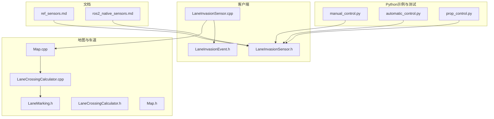
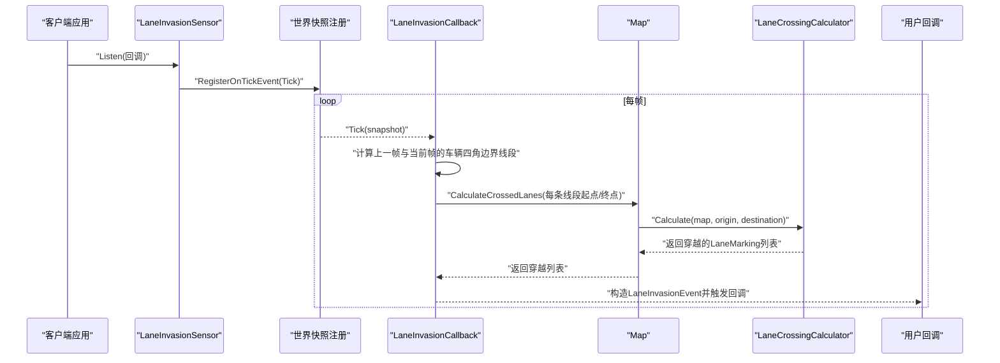
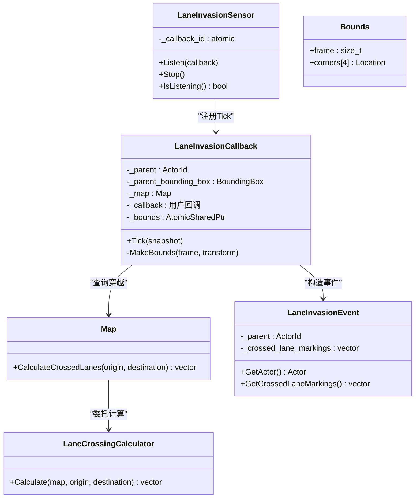
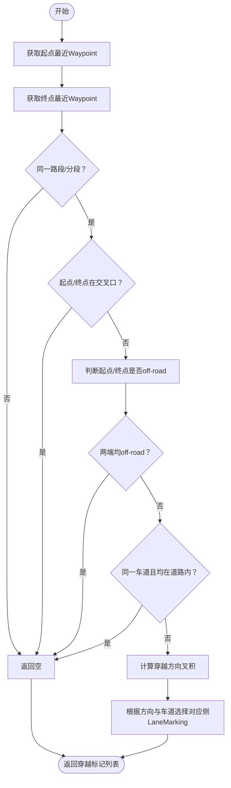
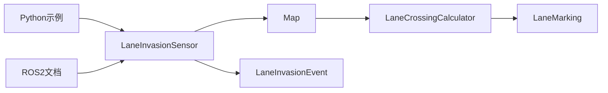

# 车道入侵传感器

> **引用文件**
> **本文引用的文件列表**

- [LaneInvasionSensor.h](https://github.com/carla-simulator/carla/blob/ue5-dev/LibCarla/source/carla/client/LaneInvasionSensor.h)
- [LaneInvasionSensor.cpp](https://github.com/carla-simulator/carla/blob/ue5-dev/LibCarla/source/carla/client/LaneInvasionSensor.cpp)
- [LaneInvasionEvent.h](https://github.com/carla-simulator/carla/blob/ue5-dev/LibCarla/source/carla/sensor/data/LaneInvasionEvent.h)
- [LaneMarking.h](https://github.com/carla-simulator/carla/blob/ue5-dev/LibCarla/source/carla/road/element/LaneMarking.h)
- [LaneCrossingCalculator.h](https://github.com/carla-simulator/carla/blob/ue5-dev/LibCarla/source/carla/road/element/LaneCrossingCalculator.h)
- [LaneCrossingCalculator.cpp](https://github.com/carla-simulator/carla/blob/ue5-dev/LibCarla/source/carla/road/element/LaneCrossingCalculator.cpp)
- [Map.h](https://github.com/carla-simulator/carla/blob/ue5-dev/LibCarla/source/carla/road/Map.h)
- [Map.cpp](https://github.com/carla-simulator/carla/blob/ue5-dev/LibCarla/source/carla/road/Map.cpp)
- [manual_control.py](https://github.com/carla-simulator/carla/blob/ue5-dev/PythonAPI/examples/manual_control.py)
- [automatic_control.py](https://github.com/carla-simulator/carla/blob/ue5-dev/PythonAPI/examples/automatic_control.py)
- [prop_control.py](https://github.com/carla-simulator/carla/blob/ue5-dev/PythonAPI/test/API/prop_control.py)
- [ref_sensors.md](https://github.com/carla-simulator/carla/blob/ue5-dev/Docs/ref_sensors.md)
- [ros2_native_sensors.md](https://github.com/carla-simulator/carla/blob/ue5-dev/Docs/ros2_native_sensors.md)

## 目录

1. [简介](#简介)
2. [项目结构](#项目结构)
3. [核心组件](#核心组件)
4. [架构总览](#架构总览)
5. [组件详解](#组件详解)
6. [依赖关系分析](#依赖关系分析)
7. [性能考量](#性能考量)
8. [故障排查指南](#故障排查指南)
9. [结论](#结论)
10. [附录](#附录)

## 简介

本文件围绕 CARLA 的“车道入侵传感器”进行系统化技术文档编写，目标是帮助初学者理解该传感器如何模拟车辆的车道保持辅助系统（LKA），并为高级开发者提供其基于高精地图拓扑与车辆轨迹预测的算法实现细节。文档重点覆盖：

- 传感器如何通过车辆与 OpenDRIVE 地图中车道线的相对位置关系检测车道偏离行为；
- LaneInvasionEvent 数据结构的组成：被入侵的车道标记类型（实线、虚线、路肩等）、入侵方向与持续性（以事件形式体现）；
- 实际代码示例：如何配置传感器、订阅事件流、基于回调数据实现车道保持警告或自动纠正转向；
- 在评估自动驾驶车辆合规性与安全性中的作用：如检测是否在禁止变道区域变道；
- 初学者视角：将该传感器视为 LKA 的模拟器实现；高级视角：解释其算法实现与复杂路口、车道合并场景下的检测逻辑。

## 项目结构

与车道入侵传感器直接相关的核心代码分布在以下模块：

- 客户端侧传感器实现与事件数据模型：client、sensor/data
- 高精地图与车道标记：road/element、road
- Python 示例与测试：PythonAPI/examples、PythonAPI/test
- 文档参考：Docs/ref_sensors.md、Docs/ros2_native_sensors.md

图表来源

- <a href="https://github.com/carla-simulator/carla/blob/ue5-dev/LibCarla/source/carla/client/LaneInvasionSensor.h#L1-L50" target="_blank">LaneInvasionSensor.h</a>
- <a href="https://github.com/carla-simulator/carla/blob/ue5-dev/LibCarla/source/carla/client/LaneInvasionSensor.cpp#L1-L184" target="_blank">LaneInvasionSensor.cpp</a>
- <a href="https://github.com/carla-simulator/carla/blob/ue5-dev/LibCarla/source/carla/sensor/data/LaneInvasionEvent.h#L1-L54" target="_blank">LaneInvasionEvent.h</a>
- <a href="https://github.com/carla-simulator/carla/blob/ue5-dev/LibCarla/source/carla/road/element/LaneMarking.h#L1-L86" target="_blank">LaneMarking.h</a>
- <a href="https://github.com/carla-simulator/carla/blob/ue5-dev/LibCarla/source/carla/road/element/LaneCrossingCalculator.h#L1-L33" target="_blank">LaneCrossingCalculator.h</a>
- <a href="https://github.com/carla-simulator/carla/blob/ue5-dev/LibCarla/source/carla/road/element/LaneCrossingCalculator.cpp#L1-L111" target="_blank">LaneCrossingCalculator.cpp</a>
- <a href="https://github.com/carla-simulator/carla/blob/ue5-dev/LibCarla/source/carla/road/Map.h#L1-L200" target="_blank">Map.h</a>
- <a href="https://github.com/carla-simulator/carla/blob/ue5-dev/LibCarla/source/carla/road/Map.cpp#L450-L455" target="_blank">Map.cpp</a>
- <a href="https://github.com/carla-simulator/carla/blob/ue5-dev/PythonAPI/examples/manual_control.py#L926-L954" target="_blank">manual_control.py</a>
- <a href="https://github.com/carla-simulator/carla/blob/ue5-dev/PythonAPI/examples/automatic_control.py#L505-L534" target="_blank">automatic_control.py</a>
- <a href="https://github.com/carla-simulator/carla/blob/ue5-dev/PythonAPI/test/API/prop_control.py#L652-L680" target="_blank">prop_control.py</a>
- <a href="https://github.com/carla-simulator/carla/blob/ue5-dev/Docs/ref_sensors.md#L194-L204" target="_blank">ref_sensors.md</a>
- <a href="https://github.com/carla-simulator/carla/blob/ue5-dev/Docs/ros2_native_sensors.md#L90-L94" target="_blank">ros2_native_sensors.md</a>

章节来源

- <a href="https://github.com/carla-simulator/carla/blob/ue5-dev/LibCarla/source/carla/client/LaneInvasionSensor.h#L1-L50" target="_blank">LaneInvasionSensor.h</a>
- <a href="https://github.com/carla-simulator/carla/blob/ue5-dev/LibCarla/source/carla/client/LaneInvasionSensor.cpp#L1-L184" target="_blank">LaneInvasionSensor.cpp</a>
- <a href="https://github.com/carla-simulator/carla/blob/ue5-dev/LibCarla/source/carla/sensor/data/LaneInvasionEvent.h#L1-L54" target="_blank">LaneInvasionEvent.h</a>
- <a href="https://github.com/carla-simulator/carla/blob/ue5-dev/LibCarla/source/carla/road/element/LaneMarking.h#L1-L86" target="_blank">LaneMarking.h</a>
- <a href="https://github.com/carla-simulator/carla/blob/ue5-dev/LibCarla/source/carla/road/element/LaneCrossingCalculator.h#L1-L33" target="_blank">LaneCrossingCalculator.h</a>
- <a href="https://github.com/carla-simulator/carla/blob/ue5-dev/LibCarla/source/carla/road/element/LaneCrossingCalculator.cpp#L1-L111" target="_blank">LaneCrossingCalculator.cpp</a>
- <a href="https://github.com/carla-simulator/carla/blob/ue5-dev/LibCarla/source/carla/road/Map.h#L1-L200" target="_blank">Map.h</a>
- <a href="https://github.com/carla-simulator/carla/blob/ue5-dev/LibCarla/source/carla/road/Map.cpp#L450-L455" target="_blank">Map.cpp</a>
- <a href="https://github.com/carla-simulator/carla/blob/ue5-dev/PythonAPI/examples/manual_control.py#L926-L954" target="_blank">manual_control.py</a>
- <a href="https://github.com/carla-simulator/carla/blob/ue5-dev/PythonAPI/examples/automatic_control.py#L505-L534" target="_blank">automatic_control.py</a>
- <a href="https://github.com/carla-simulator/carla/blob/ue5-dev/PythonAPI/test/API/prop_control.py#L652-L680" target="_blank">prop_control.py</a>
- <a href="https://github.com/carla-simulator/carla/blob/ue5-dev/Docs/ref_sensors.md#L194-L204" target="_blank">ref_sensors.md</a>
- <a href="https://github.com/carla-simulator/carla/blob/ue5-dev/Docs/ros2_native_sensors.md#L90-L94" target="_blank">ros2_native_sensors.md</a>

## 核心组件

- 客户端侧传感器 LaneInvasionSensor：负责监听世界快照，计算车辆四角边界线段穿越的车道标记，并向用户回调发送 LaneInvasionEvent。
- 事件数据 LaneInvasionEvent：封装一次穿越事件的时间戳、父对象（车辆）、穿越的车道标记集合。
- 地图与车道标记 LaneMarking：定义车道标记类型（实线、虚线、双实线、破/实混合、波形标线、草边、路肩等）、颜色、可变更方向标志等。
- 车道穿越计算器 LaneCrossingCalculator：根据起点与终点在 OpenDRIVE 地图上的投影，判断穿越了哪些车道标记。
- Map 接口：提供 CalculateCrossedLanes 封装调用，供传感器回调使用。

章节来源

- <a href="https://github.com/carla-simulator/carla/blob/ue5-dev/LibCarla/source/carla/client/LaneInvasionSensor.h#L1-L50" target="_blank">LaneInvasionSensor.h</a>
- <a href="https://github.com/carla-simulator/carla/blob/ue5-dev/LibCarla/source/carla/client/LaneInvasionSensor.cpp#L146-L180" target="_blank">LaneInvasionSensor.cpp</a>
- <a href="https://github.com/carla-simulator/carla/blob/ue5-dev/LibCarla/source/carla/sensor/data/LaneInvasionEvent.h#L21-L54" target="_blank">LaneInvasionEvent.h</a>
- <a href="https://github.com/carla-simulator/carla/blob/ue5-dev/LibCarla/source/carla/road/element/LaneMarking.h#L18-L86" target="_blank">LaneMarking.h</a>
- <a href="https://github.com/carla-simulator/carla/blob/ue5-dev/LibCarla/source/carla/road/element/LaneCrossingCalculator.h#L21-L33" target="_blank">LaneCrossingCalculator.h</a>
- <a href="https://github.com/carla-simulator/carla/blob/ue5-dev/LibCarla/source/carla/road/element/LaneCrossingCalculator.cpp#L60-L108" target="_blank">LaneCrossingCalculator.cpp</a>
- <a href="https://github.com/carla-simulator/carla/blob/ue5-dev/LibCarla/source/carla/road/Map.cpp#L450-L455" target="_blank">Map.cpp</a>

## 架构总览

下图展示了从世界快照到事件回调的整体流程，以及与地图拓扑的交互。

图表来源

- <a href="https://github.com/carla-simulator/carla/blob/ue5-dev/LibCarla/source/carla/client/LaneInvasionSensor.cpp#L146-L180" target="_blank">LaneInvasionSensor.cpp</a>
- <a href="https://github.com/carla-simulator/carla/blob/ue5-dev/LibCarla/source/carla/client/LaneInvasionSensor.cpp#L78-L124" target="_blank">LaneInvasionSensor.cpp</a>
- <a href="https://github.com/carla-simulator/carla/blob/ue5-dev/LibCarla/source/carla/road/Map.cpp#L450-L455" target="_blank">Map.cpp</a>
- <a href="https://github.com/carla-simulator/carla/blob/ue5-dev/LibCarla/source/carla/road/element/LaneCrossingCalculator.cpp#L60-L108" target="_blank">LaneCrossingCalculator.cpp</a>
- <a href="https://github.com/carla-simulator/carla/blob/ue5-dev/LibCarla/source/carla/sensor/data/LaneInvasionEvent.h#L21-L54" target="_blank">LaneInvasionEvent.h</a>

## 组件详解

### 1) 客户端侧传感器 LaneInvasionSensor

- 功能要点
  - Listen 回调注册：将 Tick 逻辑注册到世界 Tick 事件，按帧检查车辆边界线段穿越。
  - Stop 取消监听：移除已注册的 Tick 事件。
  - IsListening 查询状态：基于原子变量判断是否正在监听。
- 关键实现
  - 使用原子变量保存回调 ID，避免重复注册导致的数据流竞争。
  - Tick 中先获取父对象（必须为车辆），再计算上一帧与当前帧的车辆四角边界点集，仅当位移足够大时才继续计算。
  - 对每条边调用 Map::CalculateCrossedLanes，汇总穿越的 LaneMarking 并生成 LaneInvasionEvent 触发用户回调。

图表来源

- <a href="https://github.com/carla-simulator/carla/blob/ue5-dev/LibCarla/source/carla/client/LaneInvasionSensor.h#L19-L50" target="_blank">LaneInvasionSensor.h</a>
- <a href="https://github.com/carla-simulator/carla/blob/ue5-dev/LibCarla/source/carla/client/LaneInvasionSensor.cpp#L78-L180" target="_blank">LaneInvasionSensor.cpp</a>
- <a href="https://github.com/carla-simulator/carla/blob/ue5-dev/LibCarla/source/carla/sensor/data/LaneInvasionEvent.h#L21-L54" target="_blank">LaneInvasionEvent.h</a>
- <a href="https://github.com/carla-simulator/carla/blob/ue5-dev/LibCarla/source/carla/road/Map.cpp#L450-L455" target="_blank">Map.cpp</a>
- <a href="https://github.com/carla-simulator/carla/blob/ue5-dev/LibCarla/source/carla/road/element/LaneCrossingCalculator.h#L21-L33" target="_blank">LaneCrossingCalculator.h</a>

章节来源

- <a href="https://github.com/carla-simulator/carla/blob/ue5-dev/LibCarla/source/carla/client/LaneInvasionSensor.h#L19-L50" target="_blank">LaneInvasionSensor.h</a>
- <a href="https://github.com/carla-simulator/carla/blob/ue5-dev/LibCarla/source/carla/client/LaneInvasionSensor.cpp#L78-L180" target="_blank">LaneInvasionSensor.cpp</a>

### 2) 事件数据 LaneInvasionEvent

- 字段与语义
  - 父对象标识：记录触发事件的车辆 ActorId。
  - 穿越标记集合：一次穿越可能跨越多条车道线，集合包含所有穿越的 LaneMarking。
  - 时间戳与变换：事件发生时的世界帧号、时间戳与传感器变换（可用于定位）。
- 获取接口
  - GetActor：返回父 Actor 引用（便于进一步查询车辆状态）。
  - GetCrossedLaneMarkings：返回穿越标记列表。

章节来源

- <a href="https://github.com/carla-simulator/carla/blob/ue5-dev/LibCarla/source/carla/sensor/data/LaneInvasionEvent.h#L21-L54" target="_blank">LaneInvasionEvent.h</a>

### 3) 车道标记 LaneMarking

- 类型枚举
  - 其他、断开（Broken）、连续（Solid）、双连续（SolidSolid）、连续-断开（SolidBroken）、断开-连续（BrokenSolid）、断断续续（BrokenBroken）、波形标线（BottsDots）、草边（Grass）、路肩（Curb）、无（None）。
- 颜色与可变更方向
  - 颜色：标准（白）、蓝、绿、红、黄、其他。
  - 可变更方向：左、右、双向、不可变更。
- 辅助信息
  - GetColorInfoAsString：输出颜色字符串（用于调试与可视化）。

章节来源

- <a href="https://github.com/carla-simulator/carla/blob/ue5-dev/LibCarla/source/carla/road/element/LaneMarking.h#L18-L86" target="_blank">LaneMarking.h</a>

### 4) 车道穿越计算 LaneCrossingCalculator

- 输入
  - 起点与终点：通常来自车辆四角边界线段的上一帧与当前帧位置。
- 计算步骤
  - 在地图上找到最近的“可驾驶”路段 Waypoint（排除肩带等非驾驶区）。
  - 若起点/终点跨路段或进入/离开交叉口，则不进行计算（返回空）。
  - 判断起点/终点是否位于道路外（off-road），若两端均在道路外则不计穿越。
  - 若起点与终点在同一车道且均在道路上，则不计穿越。
  - 计算原方向向量与移动方向向量的叉积，确定穿越方向（右侧/左侧）。
  - 基于起点/终点所在车道与穿越方向，返回对应侧的 LaneMarking。
- 复杂场景处理
  - 跨路段与交叉口：默认不计算穿越，避免误判。
  - off-road：仅当一端 off-road 时才考虑对侧车道标记。

图表来源

- <a href="https://github.com/carla-simulator/carla/blob/ue5-dev/LibCarla/source/carla/road/element/LaneCrossingCalculator.cpp#L60-L108" target="_blank">LaneCrossingCalculator.cpp</a>

章节来源

- <a href="https://github.com/carla-simulator/carla/blob/ue5-dev/LibCarla/source/carla/road/element/LaneCrossingCalculator.h#L21-L33" target="_blank">LaneCrossingCalculator.h</a>
- <a href="https://github.com/carla-simulator/carla/blob/ue5-dev/LibCarla/source/carla/road/element/LaneCrossingCalculator.cpp#L60-L108" target="_blank">LaneCrossingCalculator.cpp</a>

### 5) 地图接口 Map

- 关键方法
  - CalculateCrossedLanes：对外暴露的统一入口，内部委托 LaneCrossingCalculator::Calculate。
- 与传感器协作
  - 传感器在 Tick 中对每条边界线段调用该方法，汇总穿越标记。

章节来源

- <a href="https://github.com/carla-simulator/carla/blob/ue5-dev/LibCarla/source/carla/road/Map.h#L86-L88" target="_blank">Map.h</a>
- <a href="https://github.com/carla-simulator/carla/blob/ue5-dev/LibCarla/source/carla/road/Map.cpp#L450-L455" target="_blank">Map.cpp</a>

### 6) Python 示例与测试

- 示例脚本
  - manual_control.py：创建传感器、挂接回调，打印穿越的车道标记类型。
  - automatic_control.py：同上，用于自动控制场景。
  - prop_control.py：测试用例风格的传感器使用方式。
- 事件订阅
  - 通过 world.get_blueprint_library().find('sensor.other.lane_invasion') 获取蓝图；
  - world.spawn_actor(..., attach_to=vehicle) 挂载到车辆；
  - sensor.listen(lambda event: ...) 订阅事件。

章节来源

- <a href="https://github.com/carla-simulator/carla/blob/ue5-dev/PythonAPI/examples/manual_control.py#L926-L954" target="_blank">manual_control.py</a>
- <a href="https://github.com/carla-simulator/carla/blob/ue5-dev/PythonAPI/examples/automatic_control.py#L505-L534" target="_blank">automatic_control.py</a>
- <a href="https://github.com/carla-simulator/carla/blob/ue5-dev/PythonAPI/test/API/prop_control.py#L652-L680" target="_blank">prop_control.py</a>

## 依赖关系分析

- 组件耦合
  - LaneInvasionSensor 依赖 Map 提供的 CalculateCrossedLanes；
  - Map 将具体计算委托给 LaneCrossingCalculator；
  - 事件数据 LaneInvasionEvent 依赖 LaneMarking 描述穿越标记。
- 外部集成
  - Python 示例通过蓝图库与世界 API 创建并挂载传感器；
  - ROS2 Native 文档给出消息类型 carla_msgs/CarlaLaneInvasionEvent 的主题映射。

图表来源

- <a href="https://github.com/carla-simulator/carla/blob/ue5-dev/LibCarla/source/carla/client/LaneInvasionSensor.cpp#L146-L180" target="_blank">LaneInvasionSensor.cpp</a>
- <a href="https://github.com/carla-simulator/carla/blob/ue5-dev/LibCarla/source/carla/road/Map.cpp#L450-L455" target="_blank">Map.cpp</a>
- <a href="https://github.com/carla-simulator/carla/blob/ue5-dev/LibCarla/source/carla/road/element/LaneCrossingCalculator.cpp#L60-L108" target="_blank">LaneCrossingCalculator.cpp</a>
- <a href="https://github.com/carla-simulator/carla/blob/ue5-dev/LibCarla/source/carla/road/element/LaneMarking.h#L18-L86" target="_blank">LaneMarking.h</a>
- <a href="https://github.com/carla-simulator/carla/blob/ue5-dev/LibCarla/source/carla/sensor/data/LaneInvasionEvent.h#L21-L54" target="_blank">LaneInvasionEvent.h</a>
- <a href="https://github.com/carla-simulator/carla/blob/ue5-dev/PythonAPI/examples/manual_control.py#L926-L954" target="_blank">manual_control.py</a>
- <a href="https://github.com/carla-simulator/carla/blob/ue5-dev/Docs/ros2_native_sensors.md#L90-L94" target="_blank">ros2_native_sensors.md</a>

章节来源

- <a href="https://github.com/carla-simulator/carla/blob/ue5-dev/LibCarla/source/carla/client/LaneInvasionSensor.cpp#L146-L180" target="_blank">LaneInvasionSensor.cpp</a>
- <a href="https://github.com/carla-simulator/carla/blob/ue5-dev/LibCarla/source/carla/road/Map.cpp#L450-L455" target="_blank">Map.cpp</a>
- <a href="https://github.com/carla-simulator/carla/blob/ue5-dev/LibCarla/source/carla/road/element/LaneCrossingCalculator.cpp#L60-L108" target="_blank">LaneCrossingCalculator.cpp</a>
- <a href="https://github.com/carla-simulator/carla/blob/ue5-dev/LibCarla/source/carla/road/element/LaneMarking.h#L18-L86" target="_blank">LaneMarking.h</a>
- <a href="https://github.com/carla-simulator/carla/blob/ue5-dev/LibCarla/source/carla/sensor/data/LaneInvasionEvent.h#L21-L54" target="_blank">LaneInvasionEvent.h</a>
- <a href="https://github.com/carla-simulator/carla/blob/ue5-dev/PythonAPI/examples/manual_control.py#L926-L954" target="_blank">manual_control.py</a>
- <a href="https://github.com/carla-simulator/carla/blob/ue5-dev/Docs/ros2_native_sensors.md#L90-L94" target="_blank">ros2_native_sensors.md</a>

## 性能考量

- 帧间阈值与边界点更新
  - 传感器仅在车辆边界点位移超过一定阈值时才计算穿越，避免高频无效计算。
- 原子边界缓存
  - 使用原子指针缓存上一帧边界，减少重复计算与竞态。
- 计算范围限制
  - 仅在“可驾驶”车道类型上查找 Waypoint，避免肩带等区域干扰。
- 复杂场景短路
  - 同路段/分段、交叉口、两端 off-road、同车道等场景直接返回空，降低计算成本。

章节来源

- <a href="https://github.com/carla-simulator/carla/blob/ue5-dev/LibCarla/source/carla/client/LaneInvasionSensor.cpp#L78-L124" target="_blank">LaneInvasionSensor.cpp</a>
- <a href="https://github.com/carla-simulator/carla/blob/ue5-dev/LibCarla/source/carla/road/element/LaneCrossingCalculator.cpp#L56-L108" target="_blank">LaneCrossingCalculator.cpp</a>

## 故障排查指南

- 未附着到车辆
  - Listen 前需确保传感器已 attach_to 车辆，否则会记录错误日志。
- 事件未触发
  - 确认 Tick 注册成功且 IsListening 返回 true；
  - 检查车辆是否在道路上（off-road 时不会产生穿越）；
  - 确保地图加载正确且 CalculateCrossedLanes 可用。
- 事件内容为空
  - 同一路段/分段、交叉口、两端 off-road、同车道等场景会被短路返回空；
  - 检查车辆边界线段是否跨越了车道标记（可通过调试绘制 Waypoint 与箭头辅助验证）。
- ROS2 消息订阅
  - 参考文档的主题名与消息类型，确认话题命名与消息结构一致。

章节来源

- <a href="https://github.com/carla-simulator/carla/blob/ue5-dev/LibCarla/source/carla/client/LaneInvasionSensor.cpp#L146-L180" target="_blank">LaneInvasionSensor.cpp</a>
- <a href="https://github.com/carla-simulator/carla/blob/ue5-dev/LibCarla/source/carla/road/element/LaneCrossingCalculator.cpp#L60-L108" target="_blank">LaneCrossingCalculator.cpp</a>
- <a href="https://github.com/carla-simulator/carla/blob/ue5-dev/Docs/ros2_native_sensors.md#L90-L94" target="_blank">ros2_native_sensors.md</a>

## 结论

- 车道入侵传感器以“车辆四角边界线段穿越车道标记”为核心判定逻辑，结合高精 OpenDRIVE 地图拓扑，提供稳定可靠的车道偏离检测能力。
- 事件数据 LaneInvasionEvent 以集合形式返回穿越标记，便于实现多车道同时穿越的告警与控制策略。
- 在复杂场景（交叉口、变道、肩带、off-road）中，传感器通过严格的条件短路避免误判，保证安全性与稳定性。
- 对于 LKA 模拟与自动驾驶合规性评估，该传感器提供了关键的底层支持。

## 附录

### A. 如何配置与订阅车道入侵传感器（Python）

- 步骤概览
  - 获取蓝图：world.get_blueprint_library().find('sensor.other.lane_invasion')
  - 生成传感器：world.spawn_actor(blueprint, transform, attach_to=vehicle)
  - 订阅事件：sensor.listen(lambda event: ...)
- 示例参考路径
  - manual_control.py 中的 LaneInvasionSensor 类
  - automatic_control.py 中的同名类
  - prop_control.py 中的测试风格用法

章节来源

- <a href="https://github.com/carla-simulator/carla/blob/ue5-dev/PythonAPI/examples/manual_control.py#L926-L954" target="_blank">manual_control.py</a>
- <a href="https://github.com/carla-simulator/carla/blob/ue5-dev/PythonAPI/examples/automatic_control.py#L505-L534" target="_blank">automatic_control.py</a>
- <a href="https://github.com/carla-simulator/carla/blob/ue5-dev/PythonAPI/test/API/prop_control.py#L652-L680" target="_blank">prop_control.py</a>

### B. 基于回调数据实现车道保持告警与自动纠正

- 告警策略
  - 当事件中包含禁止变道的车道标记（如实线、双实线、路肩等）时，触发视觉/听觉告警；
  - 对于连续线（Solid、SolidSolid）优先告警，断开线（Broken）可作为轻告警。
- 自动纠正思路
  - 读取事件中的穿越标记方向，结合车辆当前航向与目标车道，计算最小转向修正；
  - 与纵向控制（速度）协同，避免急刹或急转。
- 注意事项
  - 不同地图的车道标记语义可能存在差异，应结合地图元数据与 LaneChange 标志综合判断；
  - 在交叉口与复杂立交场景，建议暂时屏蔽自动纠正，仅做告警。

### C. 合规性与安全性评估

- 禁止变道区域检测
  - 通过 LaneMarking 的 LaneChange 标志与类型（如 SolidSolid、Curb）识别禁止变道线；
  - 结合事件方向与车辆行驶方向，判断是否存在违规变道。
- 安全性评估
  - 事件频率与持续时间可作为异常驾驶行为的指标；
  - 与碰撞传感器、轨迹预测模块联动，形成更全面的安全评估体系。

### D. 初学者与高级开发者提示

- 初学者
  - 将车道入侵传感器视为 LKA 的模拟器实现：它会检测车辆是否越过了车道线，并发出告警。
- 高级开发者
  - 理解其基于高精地图拓扑与车辆轨迹预测的算法实现，关注复杂路口与车道合并场景的短路逻辑；
  - 在自定义控制策略中，结合 LaneInvasionEvent 的穿越标记集合与方向，设计稳健的自动纠正策略。
