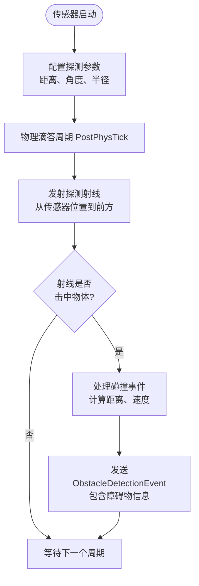
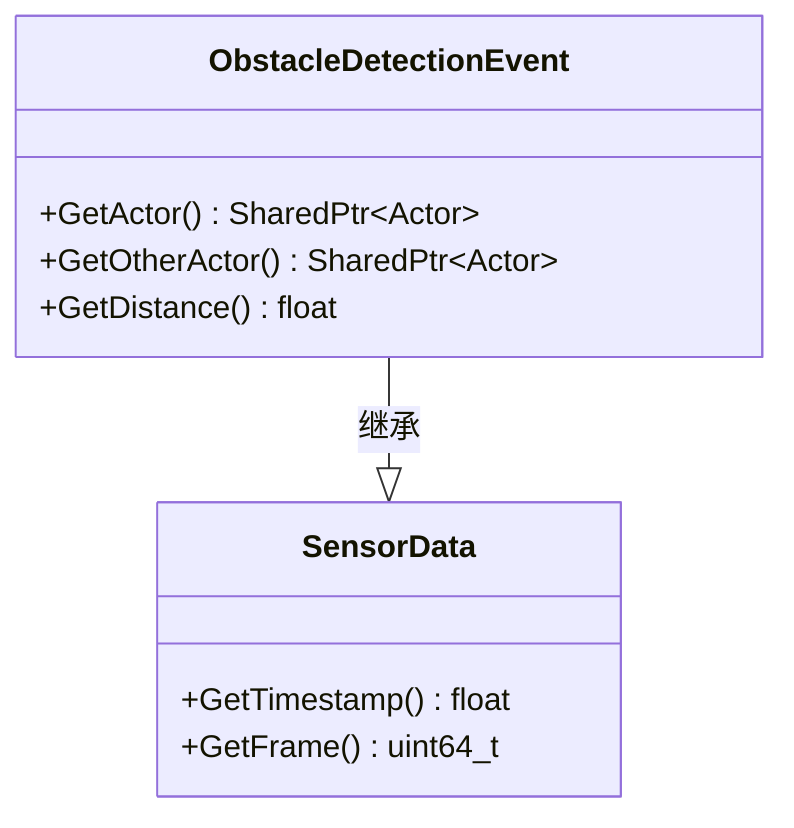
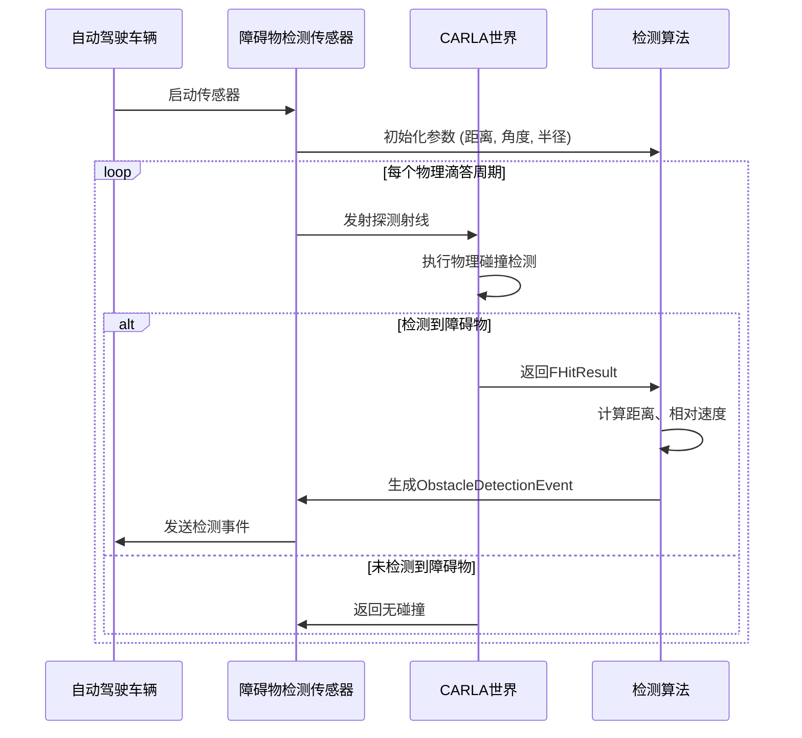

# 障碍物检测传感器


**本文档引用的文件**
- [ObstacleDetectionSensor.h](https://github.com/carla-simulator/carla/blob/ue5-dev/Unreal/CarlaUnreal/Plugins/Carla/Source/Carla/Sensor/ObstacleDetectionSensor.h)
- [ObstacleDetectionSensor.cpp](https://github.com/carla-simulator/carla/blob/ue5-dev/Unreal/CarlaUnreal/Plugins/Carla/Source/Carla/Sensor/ObstacleDetectionSensor.cpp)
- [ObstacleDetectionEvent.h](https://github.com/carla-simulator/carla/blob/ue5-dev/LibCarla/source/carla/sensor/data/ObstacleDetectionEvent.h)
- [Radar.cpp](https://github.com/carla-simulator/carla/blob/ue5-dev/Unreal/CarlaUnreal/Plugins/Carla/Source/Carla/Sensor/Radar.cpp)
- [RadarData.h](https://github.com/carla-simulator/carla/blob/ue5-dev/LibCarla/source/carla/sensor/data/RadarData.h)
- [visualize_radar.py](https://github.com/carla-simulator/carla/blob/ue5-dev/PythonAPI/examples/visualize_radar.py)
- [ref_sensors.md](https://github.com/carla-simulator/carla/blob/ue5-dev/Docs/ref_sensors.md)


## 目录
1. [引言](#引言)
2. [核心功能与工作原理](#核心功能与工作原理)
3. [ObstacleDetectionEvent数据结构](#obstacledetectionevent数据结构)
4. [传感器配置与参数](#传感器配置与参数)
5. [代码示例：传感器设置与数据处理](#代码示例传感器设置与数据处理)
6. [在自动驾驶决策中的应用](#在自动驾驶决策中的应用)
7. [高级特性：检测算法与性能模拟](#高级特性检测算法与性能模拟)
8. [结论](#结论)

## 引言

障碍物检测传感器是CARLA模拟器中用于模拟车载毫米波雷达或激光雷达前向探测功能的关键组件。该传感器通过射线投射（Ray Casting）技术，在车辆前方规定距离和角度范围内检测动态障碍物，为自动驾驶系统的决策规划提供关键的环境感知数据。本文档将详细解释该传感器的实现原理、数据结构、配置方法和应用场景，为开发者提供全面的技术参考。

## 核心功能与工作原理

障碍物检测传感器的核心功能是模拟真实世界雷达系统对前方障碍物的探测能力。传感器通过在车辆前方发射虚拟射线，检测射线与环境中其他物体的碰撞，从而获取障碍物的位置、距离和相对速度等信息。

传感器的工作原理基于Unreal Engine的物理引擎。在每个物理滴答周期（PostPhysTick），传感器从其位置沿前进方向发射一条射线，射线长度由`distance`参数决定。射线的检测范围可以通过`hit_radius`参数设置为一个球形区域，以模拟雷达波束的宽度。传感器可以配置为仅检测动态物体（`only_dynamics`）或检测所有物体。



**图示来源**
- [ObstacleDetectionSensor.cpp](https://github.com/carla-simulator/carla/blob/ue5-dev/Unreal/CarlaUnreal/Plugins/Carla/Source/Carla/Sensor/ObstacleDetectionSensor.cpp#L56-L129)

## ObstacleDetectionEvent数据结构

`ObstacleDetectionEvent`是障碍物检测传感器生成的核心数据结构，它继承自`SensorData`，包含了检测到的障碍物的所有关键信息。

该数据结构主要包含以下三个关键属性：
- **`_self_actor`**: 触发检测的传感器所属的车辆或物体（即“自我”物体）。
- **`_other_actor`**: 被检测到的障碍物物体。
- **`_distance`**: 传感器与障碍物之间的相对距离，单位为米。

通过`GetActor()`方法可以获取触发检测的车辆，通过`GetOtherActor()`方法可以获取被检测到的障碍物，通过`GetDistance()`方法可以获取两者之间的距离。这些信息是实现自适应巡航控制（ACC）和前向碰撞预警（FCW）等高级驾驶辅助系统的基础。



**图示来源**
- [ObstacleDetectionEvent.h](https://github.com/carla-simulator/carla/blob/ue5-dev/LibCarla/source/carla/sensor/data/ObstacleDetectionEvent.h#L19-L62)

## 传感器配置与参数

障碍物检测传感器可以通过蓝图属性进行灵活配置，以模拟不同性能的雷达系统。主要配置参数包括：

- **`distance`**: 探测距离，定义了传感器能够检测前方障碍物的最大范围，单位为米。
- **`hit_radius`**: 探测半径，定义了射线检测的球形区域半径，单位为米。
- **`only_dynamics`**: 布尔值，如果为`true`，则传感器仅检测动态物体（如其他车辆、行人），忽略静态物体（如建筑物、路标）。
- **`debug_linetrace`**: 布尔值，如果为`true`，则在编辑器中显示射线的轨迹，便于调试。

这些参数在`AObstacleDetectionSensor::Set`方法中被初始化，从`FActorDescription`中读取并转换为内部使用的厘米单位。

**本节来源**
- [ObstacleDetectionSensor.cpp](https://github.com/carla-simulator/carla/blob/ue5-dev/Unreal/CarlaUnreal/Plugins/Carla/Source/Carla/Sensor/ObstacleDetectionSensor.cpp#L32-L54)
- [ObstacleDetectionSensor.h](https://github.com/carla-simulator/carla/blob/ue5-dev/Unreal/CarlaUnreal/Plugins/Carla/Source/Carla/Sensor/ObstacleDetectionSensor.h#L43-L49)

## 代码示例：传感器设置与数据处理

以下Python代码示例展示了如何在CARLA中设置障碍物检测传感器并处理其数据流。

```python
# 创建雷达传感器蓝图并设置参数
radar_bp = blueprint_library.find('sensor.other.radar')
radar_bp.set_attribute('horizontal_fov', '35')  # 水平视场角
radar_bp.set_attribute('vertical_fov', '20')    # 垂直视场角
radar_bp.set_attribute('points_per_second', '1500')  # 每秒点数
radar_bp.set_attribute('range', '100')          # 探测范围

# 在车辆上生成传感器
radar = world.spawn_actor(
    radar_bp, 
    carla.Transform(carla.Location(x=3, z=2), carla.Rotation(pitch=5)), 
    attach_to=vehicle)

# 定义数据处理回调函数
def radar_callback(radar_data):
    for detect in radar_data:
        # 获取检测到的障碍物信息
        velocity = detect.velocity  # 相对速度 (m/s)
        azimuth = detect.azimuth   # 方位角 (弧度)
        altitude = detect.altitude # 仰角 (弧度)
        depth = detect.depth       # 距离 (米)
        
        # 实现前向碰撞预警 (FCW)
        if depth < 20 and velocity < -5:  # 距离小于20米且相对速度为负（接近）
            print("前向碰撞预警：前方有障碍物接近！")

# 将回调函数绑定到传感器
radar.listen(radar_callback)
```

**本节来源**
- [visualize_radar.py](https://github.com/carla-simulator/carla/blob/ue5-dev/PythonAPI/examples/visualize_radar.py#L19-L37)
- [RadarData.h](https://github.com/carla-simulator/carla/blob/ue5-dev/LibCarla/source/carla/sensor/data/RadarData.h#L27-L32)

## 在自动驾驶决策中的应用

障碍物检测传感器在自动驾驶决策规划中扮演着核心角色，特别是在跟车、前车距离保持和紧急避障等场景中。

- **自适应巡航控制 (ACC)**: 通过持续监测前方车辆的距离和相对速度，ACC系统可以自动调整本车速度，保持安全的跟车距离。当检测到前车减速时，系统会自动降低车速；当道路畅通时，系统会加速至设定的巡航速度。
- **前向碰撞预警 (FCW)**: 当传感器检测到前方障碍物距离过近且相对速度为负（表示正在接近）时，系统会立即发出预警，提醒驾驶员采取制动措施，避免碰撞。
- **紧急避障**: 在极端情况下，当FCW系统判断碰撞不可避免时，可以触发紧急制动或转向避障策略，最大限度地减少事故损失。

这些应用依赖于传感器提供的连续、实时的探测数据流，以及对`ObstacleDetectionEvent`中距离和相对速度的精确计算。

**本节来源**
- [Radar.cpp](https://github.com/carla-simulator/carla/blob/ue5-dev/Unreal/CarlaUnreal/Plugins/Carla/Source/Carla/Sensor/Radar.cpp#L209-L221)
- [ObstacleDetectionEvent.h](https://github.com/carla-simulator/carla/blob/ue5-dev/LibCarla/source/carla/sensor/data/ObstacleDetectionEvent.h#L50-L52)

## 高级特性：检测算法与性能模拟

障碍物检测传感器的底层实现采用了基于射线投射（Ray Casting）的检测算法。在每个物理滴答周期，传感器调用Unreal Engine的`SweepSingleByObjectType`或`SweepSingleByChannel`方法，执行一次球形扫描（Sweep），以检测指定范围内的物体。

对于雷达传感器，其算法更为复杂，涉及多个射线的并行处理。`ARadar::SendLineTraces`方法会根据`points_per_second`参数生成指定数量的射线，并使用`ParallelLineTraceSingleByChannel`进行并行射线追踪，以提高性能。每条射线的方位角和仰角是随机生成的，以模拟真实雷达的扫描模式。

此外，传感器还可以通过参数调整来模拟不同性能雷达的探测特性。例如，通过调整`points_per_second`可以模拟不同扫描频率的雷达，通过调整`range`和`fov`可以模拟不同探测范围和视场角的雷达。



**图示来源**
- [ObstacleDetectionSensor.cpp](https://github.com/carla-simulator/carla/blob/ue5-dev/Unreal/CarlaUnreal/Plugins/Carla/Source/Carla/Sensor/ObstacleDetectionSensor.cpp#L56-L129)
- [Radar.cpp](https://github.com/carla-simulator/carla/blob/ue5-dev/Unreal/CarlaUnreal/Plugins/Carla/Source/Carla/Sensor/Radar.cpp#L121-L207)

## 结论

障碍物检测传感器是CARLA模拟器中一个功能强大且高度可配置的组件，它通过射线投射技术精确地模拟了真实世界雷达系统的前向探测功能。通过对`ObstacleDetectionEvent`数据结构的深入理解和对传感器参数的灵活配置，开发者可以构建出逼真的自动驾驶感知系统，并在此基础上实现复杂的决策规划算法，如自适应巡航控制和前向碰撞预警。该传感器的高性能实现和与ROS2的无缝集成，使其成为自动驾驶研究和开发的理想工具。