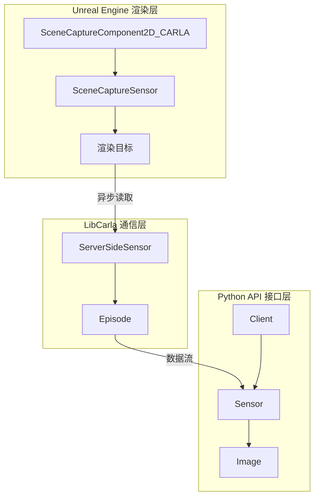
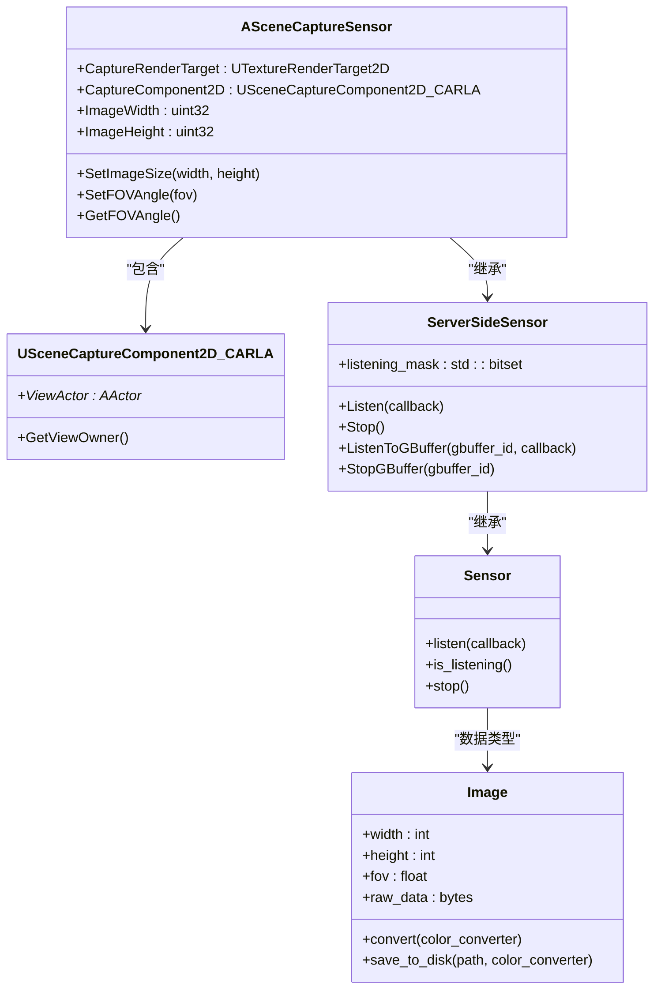
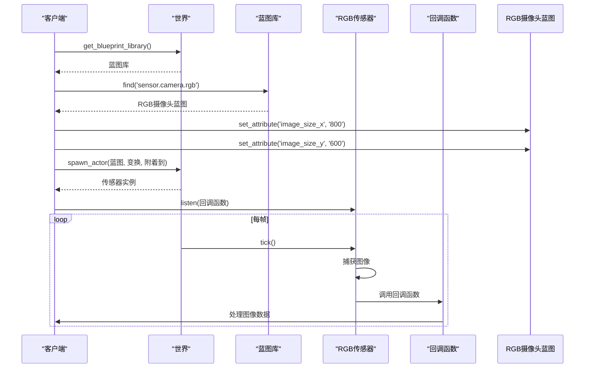
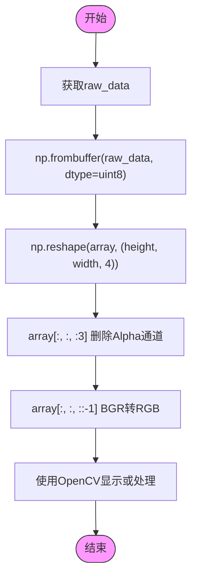
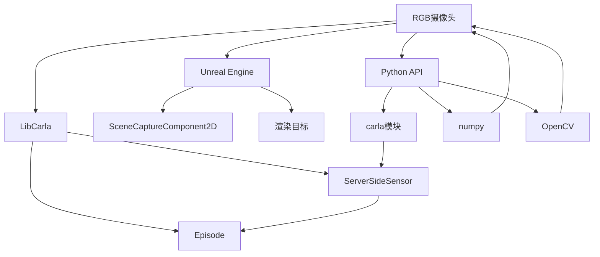

# RGB 摄像头

> **引用文件**
> **本文档中引用的文件**

- [SceneCaptureSensor.cpp](https://github.com/carla-simulator/carla/blob/ue5-dev/Unreal/CarlaUnreal/Plugins/Carla/Source/Carla/Sensor/SceneCaptureSensor.cpp)
- [SceneCaptureComponent2D_CARLA.h](https://github.com/carla-simulator/carla/blob/ue5-dev/Unreal/CarlaUnreal/Plugins/Carla/Source/Carla/Sensor/UE4_Overridden/SceneCaptureComponent2D_CARLA.h)
- [SceneCaptureComponent2D_CARLA.cpp](https://github.com/carla-simulator/carla/blob/ue5-dev/Unreal/CarlaUnreal/Plugins/Carla/Source/Carla/Sensor/UE4_Overridden/SceneCaptureComponent2D_CARLA.cpp)
- [ServerSideSensor.cpp](https://github.com/carla-simulator/carla/blob/ue5-dev/LibCarla/source/carla/client/ServerSideSensor.cpp)
- [Sensor.cpp](https://github.com/carla-simulator/carla/blob/ue5-dev/PythonAPI/carla/src/Sensor.cpp)
- [SensorData.cpp](https://github.com/carla-simulator/carla/blob/ue5-dev/PythonAPI/carla/src/SensorData.cpp)
- [ImageTmpl.h](https://github.com/carla-simulator/carla/blob/ue5-dev/LibCarla/source/carla/sensor/data/ImageTmpl.h)
- [ImageView.h](https://github.com/carla-simulator/carla/blob/ue5-dev/LibCarla/source/carla/image/ImageView.h)
- [ImageConverter.h](https://github.com/carla-simulator/carla/blob/ue5-dev/LibCarla/source/carla/image/ImageConverter.h)
- [visualize_multiple_sensors.py](https://github.com/carla-simulator/carla/blob/ue5-dev/PythonAPI/examples/visualize_multiple_sensors.py)
- [sensor_synchronization.py](https://github.com/carla-simulator/carla/blob/ue5-dev/PythonAPI/examples/sensor_synchronization.py)

## 目录

1. [简介](#简介)
2. [核心组件](#核心组件)
3. [架构概述](#架构概述)
4. [详细组件分析](#详细组件分析)
5. [依赖分析](#依赖分析)
6. [性能考虑](#性能考虑)
7. [故障排除指南](#故障排除指南)
8. [结论](#结论)

## 简介

CARLA 中的 RGB 摄像头是一种基础视觉传感器，用于模拟自动驾驶车辆的视觉感知能力。它基于 Unreal Engine 的 SceneCaptureComponent2D 实现，能够捕获高保真的图像数据。该传感器支持多种图像格式、分辨率和帧率配置，广泛应用于目标检测、车道线识别等自动驾驶任务。通过 Python API，用户可以方便地创建、配置和使用 RGB 摄像头，将捕获的图像数据转换为 numpy 数组进行处理和显示。

## 核心组件

RGB 摄像头的核心组件包括基于 Unreal Engine 的 SceneCaptureComponent2D_CARLA、LibCarla 中的 ServerSideSensor 以及 Python API 中的 Sensor 和 Image 类。这些组件协同工作，实现了从图像捕获到数据传输的完整流程。传感器通过异步方式从渲染目标读取图像数据，并通过回调函数将数据传递给客户端。在 Python 端，Image 类提供了丰富的接口用于数据转换和处理。

**本文档中引用的文件**

- [SceneCaptureSensor.cpp](https://github.com/carla-simulator/carla/blob/ue5-dev/Unreal/CarlaUnreal/Plugins/Carla/Source/Carla/Sensor/SceneCaptureSensor.cpp)
- [ServerSideSensor.cpp](https://github.com/carla-simulator/carla/blob/ue5-dev/LibCarla/source/carla/client/ServerSideSensor.cpp)
- [SensorData.cpp](https://github.com/carla-simulator/carla/blob/ue5-dev/PythonAPI/carla/src/SensorData.cpp)

## 架构概述

CARLA RGB 摄像头的架构分为三个主要层次：Unreal Engine 渲染层、LibCarla 通信层和 Python API 接口层。渲染层负责生成图像数据，通信层负责数据传输，接口层提供用户友好的编程接口。

**图表来源**

- [SceneCaptureSensor.cpp](https://github.com/carla-simulator/carla/blob/ue5-dev/Unreal/CarlaUnreal/Plugins/Carla/Source/Carla/Sensor/SceneCaptureSensor.cpp)
- [ServerSideSensor.cpp](https://github.com/carla-simulator/carla/blob/ue5-dev/LibCarla/source/carla/client/ServerSideSensor.cpp)
- [Sensor.cpp](https://github.com/carla-simulator/carla/blob/ue5-dev/PythonAPI/carla/src/Sensor.cpp)
- [SensorData.cpp](https://github.com/carla-simulator/carla/blob/ue5-dev/PythonAPI/carla/src/SensorData.cpp)

## 详细组件分析

### RGB 摄像头工作原理分析

RGB 摄像头的工作原理涉及从场景渲染到数据传输的完整流程。首先，SceneCaptureComponent2D_CARLA 捕获场景图像并存储到渲染目标中。然后，通过异步读取机制将图像数据传输到 ServerSideSensor。最后，通过 Python API 的 listen()方法订阅图像流。

#### 对象导向组件：

**图表来源**

- <a href="https://github.com/carla-simulator/carla/blob/ue5-dev/Unreal/CarlaUnreal/Plugins/Carla/Source/Carla/Sensor/SceneCaptureSensor.cpp#L47-L80" target="_blank">SceneCaptureSensor.cpp</a>
- <a href="https://github.com/carla-simulator/carla/blob/ue5-dev/Unreal/CarlaUnreal/Plugins/Carla/Source/Carla/Sensor/UE4_Overridden/SceneCaptureComponent2D_CARLA.h#L18-L29" target="_blank">SceneCaptureComponent2D_CARLA.h</a>
- <a href="https://github.com/carla-simulator/carla/blob/ue5-dev/Unreal/CarlaUnreal/Plugins/Carla/Source/Carla/Sensor/UE4_Overridden/SceneCaptureComponent2D_CARLA.cpp#L11-L20" target="_blank">SceneCaptureComponent2D_CARLA.cpp</a>
- <a href="https://github.com/carla-simulator/carla/blob/ue5-dev/LibCarla/source/carla/client/ServerSideSensor.cpp#L39-L85" target="_blank">ServerSideSensor.cpp</a>
- <a href="https://github.com/carla-simulator/carla/blob/ue5-dev/PythonAPI/carla/src/Sensor.cpp#L24-L30" target="_blank">Sensor.cpp</a>
- <a href="https://github.com/carla-simulator/carla/blob/ue5-dev/PythonAPI/carla/src/SensorData.cpp#L389-L405" target="_blank">SensorData.cpp</a>

### Python API 使用分析

Python API 提供了简洁的接口来创建和使用 RGB 摄像头。用户可以通过 get_blueprint_library()获取传感器蓝图，设置属性后使用 spawn_actor()创建传感器实例，并通过 listen()方法订阅图像流。

#### API/服务组件：

**图表来源**

- <a href="https://github.com/carla-simulator/carla/blob/ue5-dev/PythonAPI/examples/visualize_multiple_sensors.py#L100-L112" target="_blank">visualize_multiple_sensors.py</a>
- <a href="https://github.com/carla-simulator/carla/blob/ue5-dev/PythonAPI/examples/sensor_synchronization.py#L64-L73" target="_blank">sensor_synchronization.py</a>
- <a href="https://github.com/carla-simulator/carla/blob/ue5-dev/PythonAPI/carla/src/Sensor.cpp#L26-L28" target="_blank">Sensor.cpp</a>

### 图像数据处理流程分析

图像数据处理流程包括从原始数据到可用 numpy 数组的转换过程。原始图像数据以 BGRA 格式存储，需要转换为 RGB 格式并重塑为三维数组才能被 OpenCV 等库处理。

#### 复杂逻辑组件：

**图表来源**

- <a href="https://github.com/carla-simulator/carla/blob/ue5-dev/PythonAPI/examples/visualize_multiple_sensors.py#L163-L166" target="_blank">visualize_multiple_sensors.py</a>
- <a href="https://github.com/carla-simulator/carla/blob/ue5-dev/PythonAPI/carla/src/SensorData.cpp#L393-L395" target="_blank">SensorData.cpp</a>
- <a href="https://github.com/carla-simulator/carla/blob/ue5-dev/LibCarla/source/carla/image/ImageView.h#L49-L55" target="_blank">ImageView.h</a>

## 依赖分析

RGB 摄像头的实现依赖于多个组件和系统，包括 Unreal Engine 的渲染系统、LibCarla 的通信框架和 Python 的科学计算库。

**图表来源**

- [SceneCaptureSensor.cpp](https://github.com/carla-simulator/carla/blob/ue5-dev/Unreal/CarlaUnreal/Plugins/Carla/Source/Carla/Sensor/SceneCaptureSensor.cpp)
- [ServerSideSensor.cpp](https://github.com/carla-simulator/carla/blob/ue5-dev/LibCarla/source/carla/client/ServerSideSensor.cpp)
- [SensorData.cpp](https://github.com/carla-simulator/carla/blob/ue5-dev/PythonAPI/carla/src/SensorData.cpp)
- [visualize_multiple_sensors.py](https://github.com/carla-simulator/carla/blob/ue5-dev/PythonAPI/examples/visualize_multiple_sensors.py)

## 性能考虑

RGB 摄像头的性能受多种因素影响，包括分辨率、帧率、图像格式和后处理效果。高分辨率和高帧率会显著增加 GPU 和网络带宽的负载。为了优化性能，建议根据实际需求选择合适的配置，并在不需要时停止传感器。

在同步模式下，所有传感器的数据采集是同步的，这有助于确保数据的一致性，但可能会限制整体帧率。异步模式可以提供更高的帧率，但需要额外的同步机制来处理不同传感器之间的时序差异。

**本文档中引用的文件**

- [SceneCaptureSensor.cpp](https://github.com/carla-simulator/carla/blob/ue5-dev/Unreal/CarlaUnreal/Plugins/Carla/Source/Carla/Sensor/SceneCaptureSensor.cpp)
- [ServerSideSensor.cpp](https://github.com/carla-simulator/carla/blob/ue5-dev/LibCarla/source/carla/client/ServerSideSensor.cpp)

## 故障排除指南

在使用 RGB 摄像头时可能遇到的常见问题包括传感器无法创建、图像数据为空、性能下降等。对于传感器无法创建的问题，应检查蓝图名称是否正确以及附着的 Actor 是否存在。对于图像数据为空的问题，应确保传感器已正确启动监听。

性能问题通常与分辨率和帧率设置过高有关。可以通过降低分辨率或使用异步模式来改善性能。如果遇到内存泄漏问题，应确保在不再需要传感器时调用 destroy()方法。

**本文档中引用的文件**

- <a href="https://github.com/carla-simulator/carla/blob/ue5-dev/LibCarla/source/carla/client/ServerSideSensor.cpp#L46-L56" target="_blank">ServerSideSensor.cpp</a>
- [visualize_multiple_sensors.py](https://github.com/carla-simulator/carla/blob/ue5-dev/PythonAPI/examples/visualize_multiple_sensors.py)

## 结论

CARLA 的 RGB 摄像头是一个功能强大且灵活的视觉传感器，能够满足自动驾驶研究的各种需求。通过深入理解其工作原理和架构，用户可以更好地利用这一工具进行算法开发和测试。未来的工作可以集中在进一步优化性能和扩展功能上，例如支持更多的图像格式和后处理效果。
