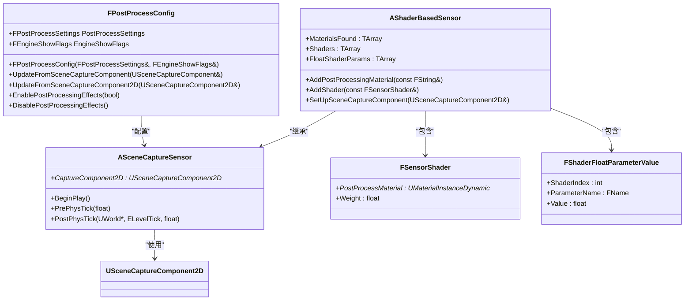
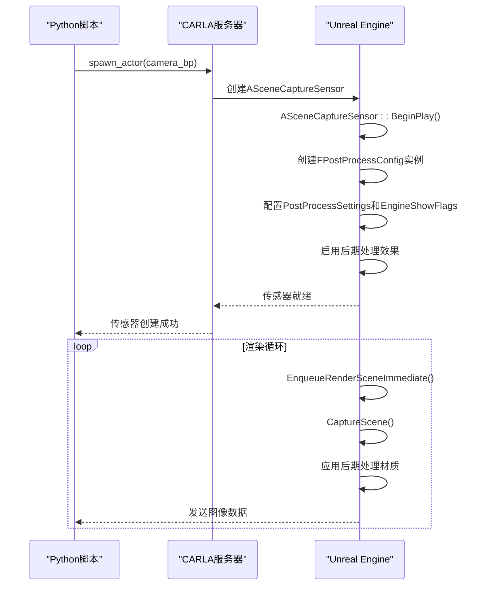

# 后期处理与特殊效果


**本文档引用的文件**  
- [PostProcessConfig.h](https://github.com/carla-simulator/carla/blob/ue5-dev/Unreal/CarlaUnreal/Plugins/Carla/Source/Carla/Sensor/PostProcessConfig.h)
- [PostProcessConfig.cpp](https://github.com/carla-simulator/carla/blob/ue5-dev/Unreal/CarlaUnreal/Plugins/Carla/Source/Carla/Sensor/PostProcessConfig.cpp)
- [SceneCaptureSensor.cpp](https://github.com/carla-simulator/carla/blob/ue5-dev/Unreal/CarlaUnreal/Plugins/Carla/Source/Carla/Sensor/SceneCaptureSensor.cpp)
- [ShaderBasedSensor.h](https://github.com/carla-simulator/carla/blob/ue5-dev/Unreal/CarlaUnreal/Plugins/Carla/Source/Carla/Sensor/ShaderBasedSensor.h)
- [ShaderBasedSensor.cpp](https://github.com/carla-simulator/carla/blob/ue5-dev/Unreal/CarlaUnreal/Plugins/Carla/Source/Carla/Sensor/ShaderBasedSensor.cpp)
- [bp_library.md](https://github.com/carla-simulator/carla/blob/ue5-dev/Docs/bp_library.md)
- [ref_sensors.md](https://github.com/carla-simulator/carla/blob/ue5-dev/Docs/ref_sensors.md)
- [camera_postprocess_presets.md](https://github.com/carla-simulator/carla/blob/ue5-dev/Docs/camera_postprocess_presets.md)
- [ActorBlueprintFunctionLibrary.cpp](https://github.com/carla-simulator/carla/blob/ue5-dev/Unreal/CarlaUnreal/Plugins/Carla/Source/Carla/Actor/ActorBlueprintFunctionLibrary.cpp)
- [visualize_multiple_sensors.py](https://github.com/carla-simulator/carla/blob/ue5-dev/PythonAPI/examples/visualize_multiple_sensors.py)
- [manual_control.py](https://github.com/carla-simulator/carla/blob/ue5-dev/PythonAPI/examples/manual_control.py)


## 目录
1. [简介](#简介)
2. [核心组件与架构](#核心组件与架构)
3. [可配置参数详解](#可配置参数详解)
4. [Python API 使用示例](#python-api-使用示例)
5. [后期处理预设配置](#后期处理预设配置)
6. [高级集成与渲染机制](#高级集成与渲染机制)
7. [应用场景与重要性](#应用场景与重要性)

## 简介
本文档详细介绍了CARLA仿真平台中摄像头传感器的后期处理与特殊视觉效果系统。该系统通过`PostProcessConfig`类和相关的蓝图系统，实现了对摄像头视觉效果的精细控制，能够模拟真实相机的光学特性。文档将系统性地介绍所有可调节参数，包括动态模糊、景深、镜头光晕、色差和曝光控制等，并提供具体的代码示例，说明如何在Python中配置和应用这些效果。这些功能对于增强仿真环境的真实感以及测试感知算法在复杂视觉条件下的鲁棒性至关重要。

## 核心组件与架构
CARLA的后期处理系统由多个核心组件构成，它们协同工作以实现逼真的视觉效果渲染。`PostProcessConfig`类是整个系统的核心，负责管理和配置后期处理设置。



**图源**
- [PostProcessConfig.h](https://github.com/carla-simulator/carla/blob/ue5-dev/Unreal/CarlaUnreal/Plugins/Carla/Source/Carla/Sensor/PostProcessConfig.h#L6-L25)
- [ShaderBasedSensor.h](https://github.com/carla-simulator/carla/blob/ue5-dev/Unreal/CarlaUnreal/Plugins/Carla/Source/Carla/Sensor/ShaderBasedSensor.h#L91-L132)
- [SceneCaptureSensor.cpp](https://github.com/carla-simulator/carla/blob/ue5-dev/Unreal/CarlaUnreal/Plugins/Carla/Source/Carla/Sensor/SceneCaptureSensor.cpp#L894-L903)

**本节来源**
- [PostProcessConfig.h](https://github.com/carla-simulator/carla/blob/ue5-dev/Unreal/CarlaUnreal/Plugins/Carla/Source/Carla/Sensor/PostProcessConfig.h#L6-L25)
- [ShaderBasedSensor.h](https://github.com/carla-simulator/carla/blob/ue5-dev/Unreal/CarlaUnreal/Plugins/Carla/Source/Carla/Sensor/ShaderBasedSensor.h#L91-L132)

## 可配置参数详解
CARLA的摄像头传感器提供了丰富的后期处理参数，允许用户精确模拟各种相机光学效果。这些参数主要通过传感器蓝图的属性进行配置。

### 曝光与白平衡控制
曝光控制参数用于模拟相机的自动曝光和手动曝光行为，确保在不同光照条件下获得合适的图像亮度。

- `exposure_mode` (_字符串_): 曝光模式，可设置为`manual`（手动）或`histogram`（直方图自动曝光）。
- `exposure_compensation` (_浮点数_): 曝光补偿，以对数方式调整曝光。0表示无调整，正值使图像更亮，负值使图像更暗。
- `exposure_min_bright` (_浮点数_): 自动曝光模式下的最小亮度值。
- `exposure_max_bright` (_浮点数_): 自动曝光模式下的最大亮度值。
- `exposure_speed_up` (_浮点数_): 从暗到亮环境的曝光适应速度。
- `exposure_speed_down` (_浮点数_): 从亮到暗环境的曝光适应速度。
- `temp` (_浮点数_): 色温，用于白平衡调整。6500K通常代表白光。
- `tint` (_浮点数_): 色温色调，用于微调洋红和青色范围。

### 景深与动态模糊
这些参数模拟了真实相机的物理光学特性，增加了图像的电影感和真实感。

- `focal_distance` (_浮点数_): 景深效果的焦点距离，单位为厘米。
- `fstop` (_浮点数_): 光圈值，控制景深的强度。
- `motion_blur_intensity` (_浮点数_): 动态模糊的强度，取值范围[0,1]。
- `motion_blur_max_distortion` (_浮点数_): 动态模糊造成的最大失真，以屏幕宽度的百分比表示。
- `motion_blur_min_object_screen_size` (_浮点数_): 应用动态模糊的对象在屏幕上的最小尺寸百分比。

### 镜头特效
这些参数模拟了镜头的光学缺陷和特殊效果，如镜头光晕和色差。

- `lens_flare_intensity` (_浮点数_): 镜头光晕的强度。
- `bloom_intensity` (_浮点数_): 泛光效果的强度。
- `chromatic_aberration_intensity` (_浮点数_): 色差的强度，控制颜色在屏幕边缘的偏移。
- `chromatic_aberration_offset` (_浮点数_): 色差效果的起始偏移距离。

### 色彩与色调映射
这些参数控制图像的最终色彩表现和对比度。

- `slope` (_浮点数_): 色调映射器S曲线的陡峭度。
- `toe` (_浮点数_): 调整色调映射器中的暗部颜色。
- `shoulder` (_浮点数_): 调整色调映射器中的亮部颜色。
- `black_clip` (_浮点数_): 设置黑色色调开始截断的值。
- `white_clip` (_浮点数_): 设置白色色调开始截断的值。

**本节来源**
- [bp_library.md](https://github.com/carla-simulator/carla/blob/ue5-dev/Docs/bp_library.md#L22-L257)
- [ref_sensors.md](https://github.com/carla-simulator/carla/blob/ue5-dev/Docs/ref_sensors.md#L448-L474)

## Python API 使用示例
可以通过CARLA的Python API创建和配置摄像头传感器，并应用后期处理效果。

```python
import carla

# 连接到CARLA服务器
client = carla.Client('localhost', 2000)
world = client.get_world()

# 获取蓝图库
blueprint_library = world.get_blueprint_library()

# 获取RGB摄像头蓝图
camera_bp = blueprint_library.find('sensor.camera.rgb')

# 配置摄像头参数
camera_bp.set_attribute('image_size_x', '1920')
camera_bp.set_attribute('image_size_y', '1080')
camera_bp.set_attribute('fov', '110')

# 配置后期处理参数
camera_bp.set_attribute('exposure_min_bright', '5.0')
camera_bp.set_attribute('exposure_max_bright', '15.0')
camera_bp.set_attribute('motion_blur_intensity', '0.6')
camera_bp.set_attribute('lens_flare_intensity', '1.0')
camera_bp.set_attribute('chromatic_aberration_intensity', '0.1')

# 在世界中生成摄像头
transform = carla.Transform(carla.Location(x=2.5, z=1.0), carla.Rotation(yaw=0.0))
camera = world.spawn_actor(camera_bp, transform)

# 设置数据监听器
def process_image(image):
    # 处理图像数据
    pass

camera.listen(process_image)
```

**本节来源**
- [visualize_multiple_sensors.py](https://github.com/carla-simulator/carla/blob/ue5-dev/PythonAPI/examples/visualize_multiple_sensors.py#L97-L111)
- [ActorBlueprintFunctionLibrary.cpp](https://github.com/carla-simulator/carla/blob/ue5-dev/Unreal/CarlaUnreal/Plugins/Carla/Source/Carla/Actor/ActorBlueprintFunctionLibrary.cpp#L1384-L1401)

## 后期处理预设配置
CARLA支持使用预设文件来快速应用一组后期处理参数。这些预设可以保存和加载，便于在不同场景间复用。

### 创建和使用预设
1. 在Unreal Editor中调整`BP_CarlaSky`蓝图的后期处理参数。
2. 使用`BP_PostProcessVolumeSettings`蓝图将当前设置保存为JSON文件。
3. 在Python API中，通过设置`post_process_profile`属性来应用预设。

```python
# 应用名为 "GoPro" 的后期处理预设
camera_bp = blueprint_library.find('sensor.camera.rgb')
camera_bp.set_attribute('post_process_profile', 'GoPro')
camera = world.spawn_actor(camera_bp, transform)
```

**本节来源**
- [camera_postprocess_presets.md](https://github.com/carla-simulator/carla/blob/ue5-dev/Docs/camera_postprocess_presets.md#L13-L29)
- [manual_control.py](https://github.com/carla-simulator/carla/blob/ue5-dev/PythonAPI/examples/manual_control.py#L1124-L1204)

## 高级集成与渲染机制
`PostProcessConfig`类深度集成到Unreal Engine的渲染管线中。在`ASceneCaptureSensor::BeginPlay()`函数中，会创建一个`FPostProcessConfig`实例，并将其与场景捕捉组件的`PostProcessSettings`和`EngineShowFlags`关联。



**图源**
- [SceneCaptureSensor.cpp](https://github.com/carla-simulator/carla/blob/ue5-dev/Unreal/CarlaUnreal/Plugins/Carla/Source/Carla/Sensor/SceneCaptureSensor.cpp#L874-L955)
- [PostProcessConfig.cpp](https://github.com/carla-simulator/carla/blob/ue5-dev/Unreal/CarlaUnreal/Plugins/Carla/Source/Carla/Sensor/PostProcessConfig.cpp#L7-L27)

**本节来源**
- [SceneCaptureSensor.cpp](https://github.com/carla-simulator/carla/blob/ue5-dev/Unreal/CarlaUnreal/Plugins/Carla/Source/Carla/Sensor/SceneCaptureSensor.cpp#L874-L955)
- [PostProcessConfig.cpp](https://github.com/carla-simulator/carla/blob/ue5-dev/Unreal/CarlaUnreal/Plugins/Carla/Source/Carla/Sensor/PostProcessConfig.cpp#L7-L27)

## 应用场景与重要性
摄像头后期处理与特殊效果在自动驾驶仿真中扮演着至关重要的角色。

### 增强仿真真实感
通过精确模拟真实相机的光学特性，如动态模糊、景深和镜头光晕，可以使仿真环境更加逼真。这对于训练基于视觉的感知模型至关重要，因为模型需要在与真实世界相似的条件下进行训练。

### 测试感知算法鲁棒性
后期处理效果可以用来创建具有挑战性的视觉条件，例如：
- **眩光条件**: 通过增强镜头光晕和泛光效果，模拟车辆在逆光或夜间行驶时的视觉挑战。
- **低光照条件**: 通过调整曝光参数，模拟黄昏或隧道内的驾驶场景。
- **运动模糊**: 模拟高速行驶时的视觉模糊，测试算法在动态场景下的性能。

这些功能使得开发者能够在安全的仿真环境中，全面评估感知算法在各种极端和复杂条件下的表现，从而提高自动驾驶系统的安全性和可靠性。

**本节来源**
- [documentation_objective](#documentation_objective)
- [bp_library.md](https://github.com/carla-simulator/carla/blob/ue5-dev/Docs/bp_library.md#L22-L257)