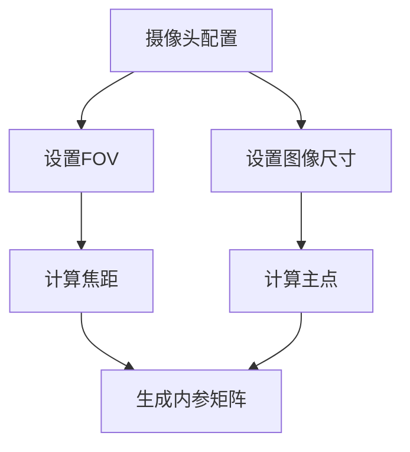
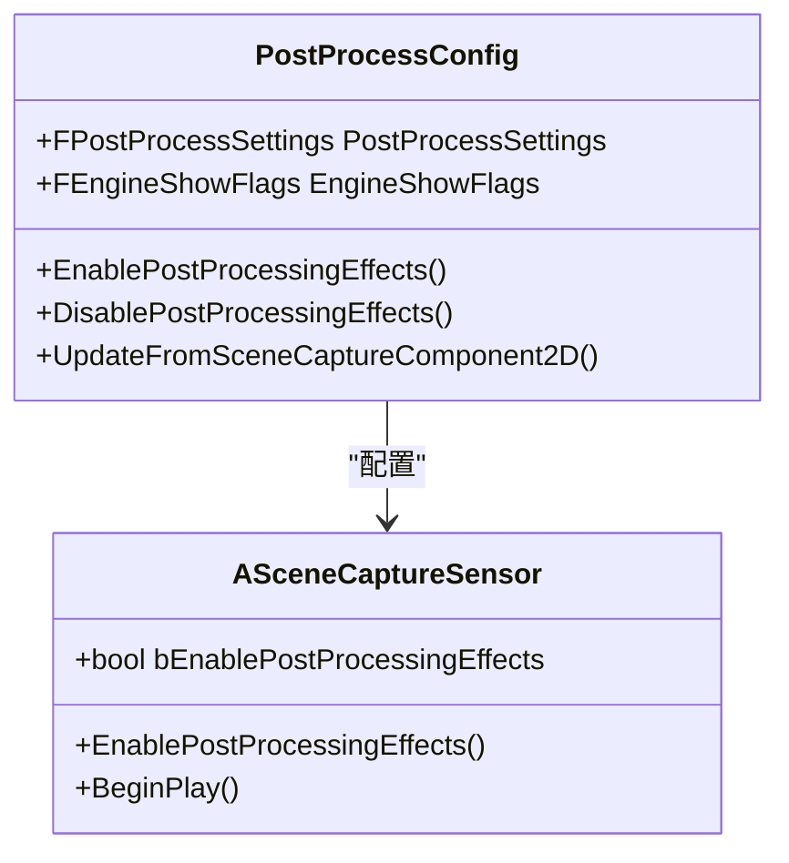
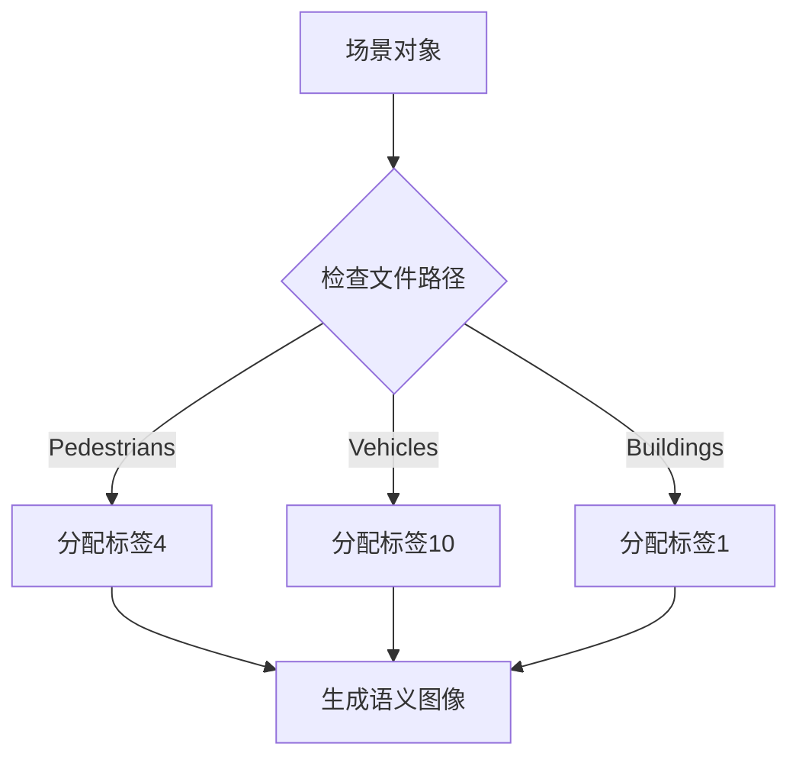

# 摄像头传感器

> **引用文件**
> **本文档中引用的文件**

- [ref_sensors.md](https://github.com/carla-simulator/carla/blob/ue5-dev/Docs/ref_sensors.md)
- [camera_postprocess_presets.md](https://github.com/carla-simulator/carla/blob/ue5-dev/Docs/camera_postprocess_presets.md)
- [SceneCaptureSensor.h](https://github.com/carla-simulator/carla/blob/ue5-dev/Unreal/CarlaUnreal/Plugins/Carla/Source/Carla/Sensor/SceneCaptureSensor.h)
- [SceneCaptureSensor.cpp](https://github.com/carla-simulator/carla/blob/ue5-dev/Unreal/CarlaUnreal/Plugins/Carla/Source/Carla/Sensor/SceneCaptureSensor.cpp)
- [PostProcessConfig.h](https://github.com/carla-simulator/carla/blob/ue5-dev/Unreal/CarlaUnreal/Plugins/Carla/Source/Carla/Sensor/PostProcessConfig.h)
- [PostProcessConfig.cpp](https://github.com/carla-simulator/carla/blob/ue5-dev/Unreal/CarlaUnreal/Plugins/Carla/Source/Carla/Sensor/PostProcessConfig.cpp)
- [Sensor.cpp](https://github.com/carla-simulator/carla/blob/ue5-dev/PythonAPI/carla/src/Sensor.cpp)
- [SensorData.cpp](https://github.com/carla-simulator/carla/blob/ue5-dev/PythonAPI/carla/src/SensorData.cpp)
- [SemanticSegmentationCamera.h](https://github.com/carla-simulator/carla/blob/ue5-dev/Unreal/CarlaUnreal/Plugins/Carla/Source/Carla/Sensor/SemanticSegmentationCamera.h)
- [SemanticSegmentationCamera.cpp](https://github.com/carla-simulator/carla/blob/ue5-dev/Unreal/CarlaUnreal/Plugins/Carla/Source/Carla/Sensor/SemanticSegmentationCamera.cpp)
- [InstanceSegmentationCamera.h](https://github.com/carla-simulator/carla/blob/ue5-dev/Unreal/CarlaUnreal/Plugins/Carla/Source/Carla/Sensor/InstanceSegmentationCamera.h)
- [tuto_G_instance_segmentation_sensor.md](https://github.com/carla-simulator/carla/blob/ue5-dev/Docs/tuto_G_instance_segmentation_sensor.md)
- [CameraInfo.cpp](https://github.com/carla-simulator/carla/blob/ue5-dev/LibCarla/source/carla/ros2/types/CameraInfo.cpp)

## 目录

1. [引言](#引言)
2. [摄像头传感器类型](#摄像头传感器类型)
3. [成像原理与数据格式](#成像原理与数据格式)
4. [摄像头参数配置](#摄像头参数配置)
5. [后期处理效果](#后期处理效果)
6. [Python 客户端使用示例](#python客户端使用示例)
7. [多摄像头同步与流式传输](#多摄像头同步与流式传输)
8. [坐标系与投影变换](#坐标系与投影变换)
9. [高级渲染管线](#高级渲染管线)
10. [附录](#附录)

## 引言

CARLA 模拟器提供了多种摄像头传感器，用于自动驾驶和计算机视觉研究。这些传感器基于 Unreal Engine 的渲染技术，能够生成高质量的图像数据。所有传感器都使用 UE 坐标系（x-前向，y-右向，z-上向），并返回局部空间中的坐标。

本文档详细介绍了 CARLA 中的 RGB 摄像头、深度摄像头、语义分割摄像头和实例分割摄像头，涵盖了它们的成像原理、数据格式、使用场景以及配置方法。同时，文档还深入探讨了摄像头的内参（焦距、主点）和外参（位置、旋转）配置，以及如何通过 PostProcessConfig 进行后期处理效果设置。

**Section sources**

- <a href="https://github.com/carla-simulator/carla/blob/ue5-dev/Docs/ref_sensors.md#L1-L20" target="_blank">ref_sensors.md</a>

## 摄像头传感器类型

CARLA 提供了多种类型的摄像头传感器，每种都有特定的用途和输出格式：

- **RGB 摄像头** (`sensor.camera.rgb`): 生成常规的彩色图像，模拟真实相机的输出。
- **深度摄像头** (`sensor.camera.depth`): 生成深度图，每个像素值表示该点到相机的距离。
- **语义分割摄像头** (`sensor.camera.semantic_segmentation`): 为场景中的每个对象按类别进行分类，使用不同的颜色表示不同的语义标签。
- **实例分割摄像头** (`sensor.camera.instance_segmentation`): 不仅按类别分类，还为每个对象实例分配唯一的 ID，使得同一类别的不同实例可以被区分。

这些传感器都继承自`ASceneCaptureSensor`基类，利用`USceneCaptureComponent2D_CARLA`组件进行场景渲染。

**Section sources**

- <a href="https://github.com/carla-simulator/carla/blob/ue5-dev/Docs/ref_sensors.md#L376-L664" target="_blank">ref_sensors.md</a>
- <a href="https://github.com/carla-simulator/carla/blob/ue5-dev/Docs/tuto_G_instance_segmentation_sensor.md#L1-L10" target="_blank">tuto_G_instance_segmentation_sensor.md</a>

## 成像原理与数据格式

### RGB 摄像头

RGB 摄像头生成标准的彩色图像，输出为`carla.Image`对象。图像数据以 BGRA 32 位像素数组的形式存储在`raw_data`属性中。每个像素包含蓝、绿、红和阿尔法通道。

### 深度摄像头

深度摄像头生成深度图，编码场景中每个像素到相机的距离。深度值使用 RGB 颜色空间的三个通道进行编码，从低到高字节：R -> G -> B。实际距离（米）可以通过以下公式解码：

```
normalized = (R + G * 256 + B * 256 * 256) / (256 * 256 * 256 - 1)
in_meters = 1000 * normalized
```

### 语义分割摄像头

语义分割摄像头为每个对象分配一个语义标签，标签信息编码在图像的红色通道中。像素的红色值对应其语义标签 ID。CARLA 提供了 CityScapesPalette 颜色转换器，可以将标签 ID 转换为可视化颜色。

### 实例分割摄像头

实例分割摄像头不仅提供语义标签，还为每个对象实例分配唯一 ID。红色通道存储语义标签，绿色通道和蓝色通道共同定义对象的唯一实例 ID。

**Section sources**

- <a href="https://github.com/carla-simulator/carla/blob/ue5-dev/Docs/ref_sensors.md#L47-L664" target="_blank">ref_sensors.md</a>

## 摄像头参数配置

### 内参配置

摄像头的内参主要包括焦距和主点，这些参数通过水平视场角（FOV）和图像尺寸来确定。在 CARLA 中，可以通过蓝图属性进行配置：

- `fov`: 水平视场角（度）
- `image_size_x`: 图像宽度（像素）
- `image_size_y`: 图像高度（像素）

焦距（f_x, f_y）和主点（c_x, c_y）可以通过以下公式计算：

```
c_x = image_width / 2
c_y = image_height / 2
f_x = f_y = image_width / (2 * tan(fov * π / 360))
```

这些参数在`CameraInfo`消息中自动填充，用于 ROS 等外部系统。



**Diagram sources**

- <a href="https://github.com/carla-simulator/carla/blob/ue5-dev/LibCarla/source/carla/ros2/types/CameraInfo.cpp#L47-L62" target="_blank">CameraInfo.cpp</a>

### 外参配置

摄像头的外参定义了其相对于父对象的位置和旋转。在 Python 客户端中，可以通过`carla.Transform`对象进行设置：

```python
camera_transform = carla.Transform(
    carla.Location(x=2.0, y=0.0, z=1.5),
    carla.Rotation(pitch=0.0, yaw=0.0, roll=0.0)
)
```

外参在传感器数据的`transform`属性中返回，表示传感器在世界坐标系中的位置和旋转。

**Section sources**

- <a href="https://github.com/carla-simulator/carla/blob/ue5-dev/Docs/ref_sensors.md#L480-L490" target="_blank">ref_sensors.md</a>

## 后期处理效果

CARLA 通过`PostProcessConfig`类管理摄像头的后期处理效果。这些效果可以显著提高图像的真实感。

### 启用后期处理

可以通过`enable_postprocess_effects`属性控制后期处理效果的启用：

```cpp
void ASceneCaptureSensor::EnablePostProcessingEffects(bool Enable = true)
{
    bEnablePostProcessingEffects = Enable;
}
```

### 主要后期处理效果

- **镜头光晕** (`lens_flare_intensity`): 模拟明亮物体在镜头上的反射。
- **自动曝光** (`exposure_compensation`): 模拟人眼对明暗环境的适应。
- **景深** (`focal_distance`): 模糊近处或远处的物体。
- **运动模糊** (`motion_blur_intensity`): 模拟快速移动时的模糊效果。
- **泛光** (`bloom_intensity`): 模拟强烈光线的扩散效果。

预设的后期处理配置可以保存为 JSON 文件，并通过`post_process_profile`属性在 Python API 中加载。



**Diagram sources**

- <a href="https://github.com/carla-simulator/carla/blob/ue5-dev/Unreal/CarlaUnreal/Plugins/Carla/Source/Carla/Sensor/PostProcessConfig.h#L6-L25" target="_blank">PostProcessConfig.h</a>
- <a href="https://github.com/carla-simulator/carla/blob/ue5-dev/Unreal/CarlaUnreal/Plugins/Carla/Source/Carla/Sensor/PostProcessConfig.cpp#L7-L199" target="_blank">PostProcessConfig.cpp</a>
- <a href="https://github.com/carla-simulator/carla/blob/ue5-dev/Unreal/CarlaUnreal/Plugins/Carla/Source/Carla/Sensor/SceneCaptureSensor.h#L153-L156" target="_blank">SceneCaptureSensor.h</a>

## Python 客户端使用示例

### 创建和配置摄像头

```python
# 获取蓝图库
blueprint_library = world.get_blueprint_library()

# 获取RGB摄像头蓝图
camera_bp = blueprint_library.find('sensor.camera.rgb')

# 配置摄像头属性
camera_bp.set_attribute('image_size_x', '800')
camera_bp.set_attribute('image_size_y', '600')
camera_bp.set_attribute('fov', '90')
camera_bp.set_attribute('enable_postprocess_effects', 'True')

# 在指定位置生成摄像头
camera = world.spawn_actor(
    camera_bp,
    carla.Transform(carla.Location(x=2.0, z=1.5)),
    attach_to=vehicle
)
```

### 订阅图像数据流

```python
def process_image(image):
    # 将图像数据转换为OpenCV格式
    array = np.frombuffer(image.raw_data, dtype=np.dtype("uint8"))
    array = np.reshape(array, (image.height, image.width, 4))
    array = array[:, :, :3]  # 移除Alpha通道
    array = array[:, :, ::-1]  # BGR转RGB

    # 显示图像
    cv2.imshow('Camera View', array)
    cv2.waitKey(1)

# 订阅图像流
camera.listen(process_image)
```

### 图像格式转换

```python
# 保存语义分割图像
semantic_camera = world.spawn_actor(semantic_bp, transform, attach_to=vehicle)
semantic_camera.listen(lambda image: image.save_to_disk('output/%06d.png' % image.frame, carla.ColorConverter.CityScapesPalette))
```

**Section sources**

- <a href="https://github.com/carla-simulator/carla/blob/ue5-dev/PythonAPI/carla/src/Sensor.cpp#L7-L30" target="_blank">Sensor.cpp</a>
- <a href="https://github.com/carla-simulator/carla/blob/ue5-dev/PythonAPI/carla/src/SensorData.cpp#L389-L405" target="_blank">SensorData.cpp</a>

## 多摄像头同步与流式传输

### 同步机制

CARLA 支持多摄像头同步，确保所有传感器在同一仿真步长内捕获数据。这通过`sensor_tick`属性控制，设置为 0.0 表示尽可能快地捕获。

### 流式传输优化

为了优化流式传输性能，CARLA 使用异步数据流机制。传感器数据通过`FDataStream`进行序列化和发送，客户端可以高效地接收和处理大量图像数据。

```cpp
void ASceneCaptureSensor::EnqueueRenderSceneImmediate()
{
    TRACE_CPUPROFILER_EVENT_SCOPE(ASceneCaptureSensor::EnqueueRenderSceneImmediate);
#ifdef CARLA_HAS_GBUFFER_API
    CaptureSceneExtended();
#else
    GetCaptureComponent2D()->CaptureScene();
#endif
}
```

**Section sources**

- <a href="https://github.com/carla-simulator/carla/blob/ue5-dev/Unreal/CarlaUnreal/Plugins/Carla/Source/Carla/Sensor/SceneCaptureSensor.cpp#L863-L871" target="_blank">SceneCaptureSensor.cpp</a>

## 坐标系与投影变换

### UE 坐标系

CARLA 使用 Unreal Engine 的坐标系：

- X 轴：前向
- Y 轴：右向
- Z 轴：上向

### 投影变换

从 3D 世界坐标到 2D 图像坐标的投影变换使用标准的针孔相机模型：

```
u = f_x * (X / Z) + c_x
v = f_y * (Y / Z) + c_y
```

其中(X, Y, Z)是世界坐标系中的点，(u, v)是图像平面上的像素坐标。

**Section sources**

- <a href="https://github.com/carla-simulator/carla/blob/ue5-dev/Docs/ref_sensors.md#L18-L20" target="_blank">ref_sensors.md</a>

## 高级渲染管线

### SceneCaptureComponent2D_CARLA

CARLA 使用自定义的`USceneCaptureComponent2D_CARLA`组件进行场景捕获。该组件继承自 Unreal Engine 的`USceneCaptureComponent2D`，并重写了`GetViewOwner`方法以正确获取视图所有者。

```cpp
const AActor* USceneCaptureComponent2D_CARLA::GetViewOwner() const
{
    return ViewActor;
}
```

### G-Buffer 数据提取

对于高级应用，CARLA 支持从 G-Buffer 中提取额外的渲染数据，如法线、材质属性等。这通过`FGBufferRequest`和`SendGBuffer`函数实现。

```cpp
#ifdef CARLA_HAS_GBUFFER_API
void ASceneCaptureSensor::CaptureSceneExtended()
{
    auto GBufferPtr = MakeUnique<FGBufferRequest>();
    // ...
    CaptureComponent2D->CaptureSceneWithGBuffer(GBuffer);
    // ...
}
#endif
```

### 语义标签映射

语义标签基于对象的相对文件路径自动分配。例如，存储在`Unreal/CarlaUnreal/Content/Static/Pedestrians`中的网格被标记为"Pedestrian"。



**Diagram sources**

- <a href="https://github.com/carla-simulator/carla/blob/ue5-dev/Unreal/CarlaUnreal/Plugins/Carla/Source/Carla/Sensor/UE4_Overridden/SceneCaptureComponent2D_CARLA.h#L18-L29" target="_blank">USceneCaptureComponent2D_CARLA.h</a>
- <a href="https://github.com/carla-simulator/carla/blob/ue5-dev/Unreal/CarlaUnreal/Plugins/Carla/Source/Carla/Sensor/SceneCaptureSensor.cpp#L987-L1046" target="_blank">SceneCaptureSensor.cpp</a>
- <a href="https://github.com/carla-simulator/carla/blob/ue5-dev/Unreal/CarlaUnreal/Plugins/Carla/Source/Carla/Sensor/SemanticSegmentationCamera.cpp#L11-L14" target="_blank">SemanticSegmentationCamera.cpp</a>

## 附录

### 语义标签映射表

| 值  | 标签   | 颜色           | 描述                   |
| --- | ------ | -------------- | ---------------------- |
| 0   | 未标记 | (0, 0, 0)      | 未分类的元素           |
| 1   | 建筑物 | (70, 70, 70)   | 房屋、摩天大楼等       |
| 4   | 行人   | (220, 20, 60)  | 步行或骑车的人类       |
| 10  | 车辆   | (0, 0, 142)    | 汽车、摩托车、公交车等 |
| 13  | 天空   | (70, 130, 180) | 开放的天空             |

### 实例分割示例

```python
# 创建实例分割摄像头
instance_camera_bp = world.get_blueprint_library().find('sensor.camera.instance_segmentation')
instance_camera = world.spawn_actor(instance_camera_bp, transform, attach_to=vehicle)

def process_instance_image(image):
    # 解析实例ID (G和B通道)
    array = np.frombuffer(image.raw_data, dtype=np.dtype("uint8"))
    array = np.reshape(array, (image.height, image.width, 4))
    instance_ids = array[:, :, 1] * 256 + array[:, :, 2]  # G * 256 + B
    semantic_labels = array[:, :, 0]  # R通道
    # 处理实例分割数据
    pass

instance_camera.listen(process_instance_image)
```

**Section sources**

- <a href="https://github.com/carla-simulator/carla/blob/ue5-dev/Docs/ref_sensors.md#L582-L607" target="_blank">ref_sensors.md</a>
- <a href="https://github.com/carla-simulator/carla/blob/ue5-dev/Docs/tuto_G_instance_segmentation_sensor.md#L1-L10" target="_blank">tuto_G_instance_segmentation_sensor.md</a>
