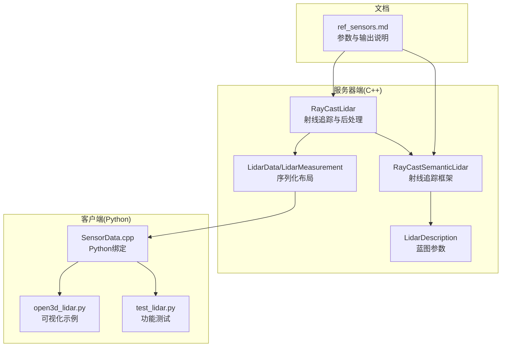
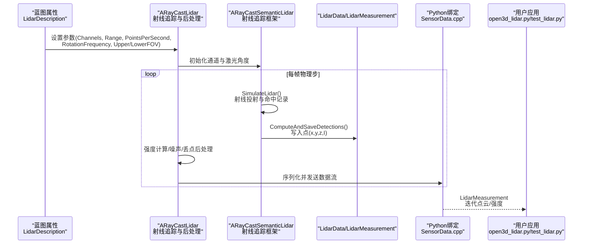
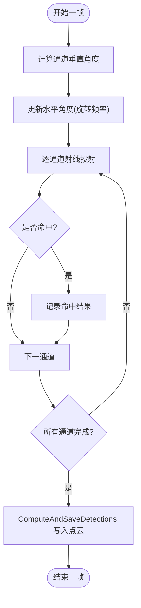
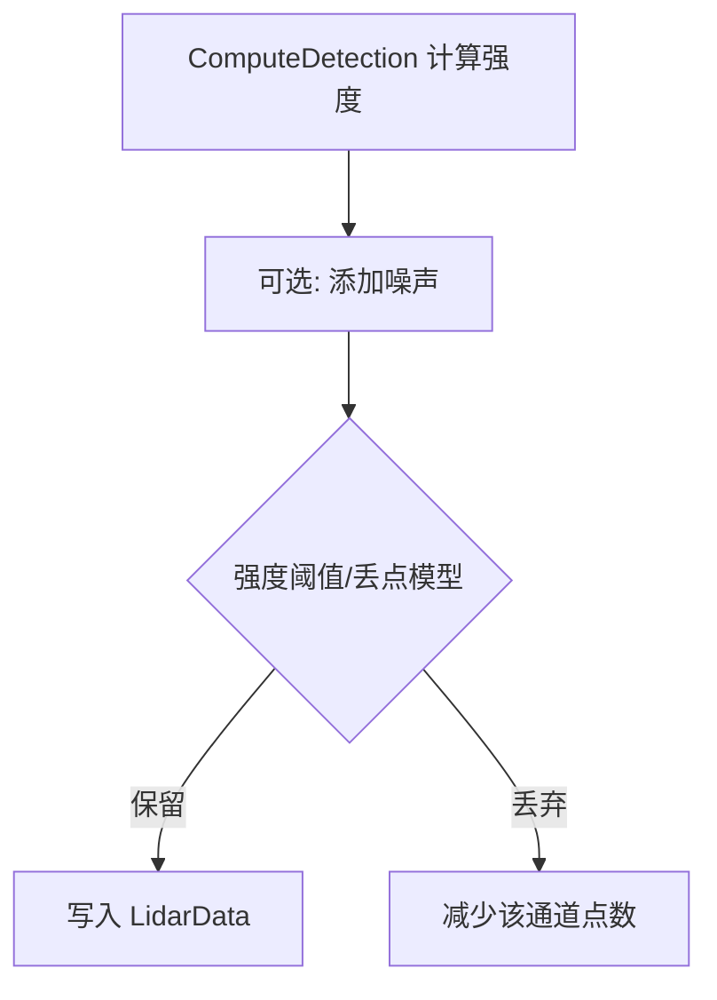
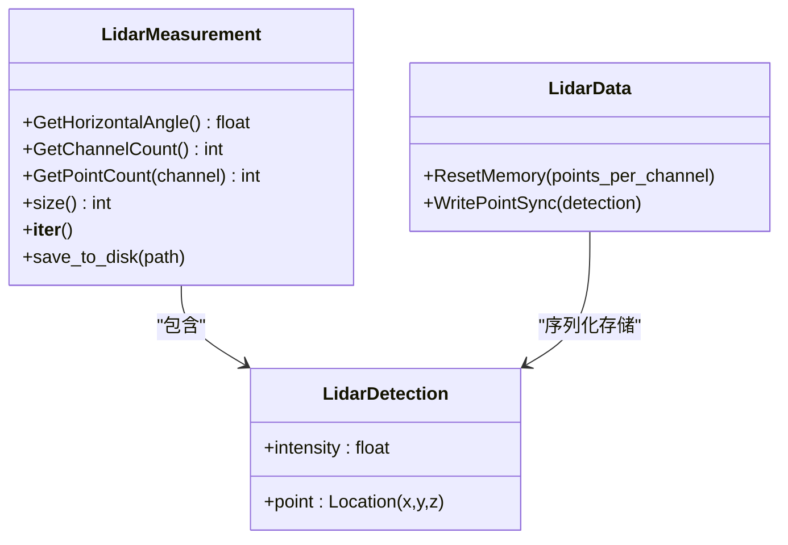
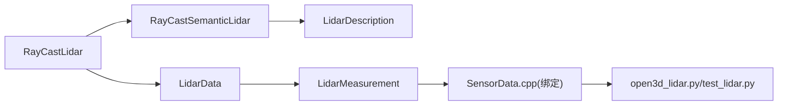

# 基础激光雷达

**本文引用的文件**
- [RayCastLidar.h](https://github.com/carla-simulator/carla/blob/ue5-dev/Unreal/CarlaUnreal/Plugins/Carla/Source/Carla/Sensor/RayCastLidar.h)
- [RayCastLidar.cpp](https://github.com/carla-simulator/carla/blob/ue5-dev/Unreal/CarlaUnreal/Plugins/Carla/Source/Carla/Sensor/RayCastLidar.cpp)
- [RayCastSemanticLidar.h](https://github.com/carla-simulator/carla/blob/ue5-dev/Unreal/CarlaUnreal/Plugins/Carla/Source/Carla/Sensor/RayCastSemanticLidar.h)
- [RayCastSemanticLidar.cpp](https://github.com/carla-simulator/carla/blob/ue5-dev/Unreal/CarlaUnreal/Plugins/Carla/Source/Carla/Sensor/RayCastSemanticLidar.cpp)
- [LidarDescription.h](https://github.com/carla-simulator/carla/blob/ue5-dev/Unreal/CarlaUnreal/Plugins/Carla/Source/Carla/Sensor/LidarDescription.h)
- [LidarData.h](https://github.com/carla-simulator/carla/blob/ue5-dev/LibCarla/source/carla/sensor/data/LidarData.h)
- [LidarMeasurement.h](https://github.com/carla-simulator/carla/blob/ue5-dev/LibCarla/source/carla/sensor/data/LidarMeasurement.h)
- [SensorData.cpp](https://github.com/carla-simulator/carla/blob/ue5-dev/PythonAPI/carla/src/SensorData.cpp)
- [open3d_lidar.py](https://github.com/carla-simulator/carla/blob/ue5-dev/PythonAPI/examples/open3d_lidar.py)
- [test_lidar.py](https://github.com/carla-simulator/carla/blob/ue5-dev/PythonAPI/test/smoke/test_lidar.py)
- [ref_sensors.md](https://github.com/carla-simulator/carla/blob/ue5-dev/Docs/ref_sensors.md)

## 目录
1. [简介](#简介)
2. [项目结构](#项目结构)
3. [核心组件](#核心组件)
4. [架构总览](#架构总览)
5. [详细组件分析](#详细组件分析)
6. [依赖关系分析](#依赖关系分析)
7. [性能考量](#性能考量)
8. [故障排查指南](#故障排查指南)
9. [结论](#结论)
10. [附录](#附录)

## 简介
本文件系统性阐述 CARLA 基础激光雷达（RayCastLidar）的物理模拟原理与实现细节，重点覆盖：
- 基于光线投射的物理模拟流程：激光束发射、与场景几何体的相交计算、反射强度确定机制
- 关键配置参数的语义与影响：channels、range、points_per_second、rotation_frequency、upper_fov、lower_fov
- LidarMeasurement 数据结构组成：点的 3D 坐标（x, y, z）与强度（intensity）
- 在障碍物检测与环境建模中的典型应用
- 与真实世界激光雷达性能的对比与仿真局限性

## 项目结构
RayCastLidar 的实现由 C++ 服务器端与 Python 客户端两部分构成：
- 服务器端（Unreal/CarlaUnreal/Plugins/Carla/Source/Carla/Sensor/）：
  - RayCastLidar.h/.cpp：RayCastLidar 类及其后处理（强度计算、丢点模型、噪声等）
  - RayCastSemanticLidar.h/.cpp：通用射线追踪框架与通道管理
  - LidarDescription.h：激光雷达蓝图参数描述
- 核心数据结构（LibCarla/source/carla/sensor/data/）：
  - LidarData.h：LidarDetection 与 LidarData 序列化布局
  - LidarMeasurement.h：LidarMeasurement 及其头部元信息访问
- Python 绑定（PythonAPI/carla/src/SensorData.cpp）：将 C++ 数据结构暴露为 Python 接口
- 示例与测试（PythonAPI/examples/、PythonAPI/test/）：可视化与功能验证
- 文档（Docs/ref_sensors.md）：官方参考与参数说明

图表来源
- [RayCastLidar.h](https://github.com/carla-simulator/carla/blob/ue5-dev/Unreal/CarlaUnreal/Plugins/Carla/Source/Carla/Sensor/RayCastLidar.h#L1-L71)
- [RayCastLidar.cpp](https://github.com/carla-simulator/carla/blob/ue5-dev/Unreal/CarlaUnreal/Plugins/Carla/Source/Carla/Sensor/RayCastLidar.cpp#L1-L196)
- [RayCastSemanticLidar.h](https://github.com/carla-simulator/carla/blob/ue5-dev/Unreal/CarlaUnreal/Plugins/Carla/Source/Carla/Sensor/RayCastSemanticLidar.h#L1-L82)
- [LidarDescription.h](https://github.com/carla-simulator/carla/blob/ue5-dev/Unreal/CarlaUnreal/Plugins/Carla/Source/Carla/Sensor/LidarDescription.h#L1-L56)
- [LidarData.h](https://github.com/carla-simulator/carla/blob/ue5-dev/LibCarla/source/carla/sensor/data/LidarData.h#L1-L121)
- [LidarMeasurement.h](https://github.com/carla-simulator/carla/blob/ue5-dev/LibCarla/source/carla/sensor/data/LidarMeasurement.h#L1-L62)
- [SensorData.cpp](https://github.com/carla-simulator/carla/blob/ue5-dev/PythonAPI/carla/src/SensorData.cpp#L424-L439)
- [open3d_lidar.py](https://github.com/carla-simulator/carla/blob/ue5-dev/PythonAPI/examples/open3d_lidar.py#L1-L287)
- [test_lidar.py](https://github.com/carla-simulator/carla/blob/ue5-dev/PythonAPI/test/smoke/test_lidar.py#L39-L223)
- [ref_sensors.md](https://github.com/carla-simulator/carla/blob/ue5-dev/Docs/ref_sensors.md#L221-L545)

章节来源
- [RayCastLidar.h](https://github.com/carla-simulator/carla/blob/ue5-dev/Unreal/CarlaUnreal/Plugins/Carla/Source/Carla/Sensor/RayCastLidar.h#L1-L71)
- [RayCastLidar.cpp](https://github.com/carla-simulator/carla/blob/ue5-dev/Unreal/CarlaUnreal/Plugins/Carla/Source/Carla/Sensor/RayCastLidar.cpp#L1-L196)
- [RayCastSemanticLidar.h](https://github.com/carla-simulator/carla/blob/ue5-dev/Unreal/CarlaUnreal/Plugins/Carla/Source/Carla/Sensor/RayCastSemanticLidar.h#L1-L82)
- [LidarDescription.h](https://github.com/carla-simulator/carla/blob/ue5-dev/Unreal/CarlaUnreal/Plugins/Carla/Source/Carla/Sensor/LidarDescription.h#L1-L56)
- [LidarData.h](https://github.com/carla-simulator/carla/blob/ue5-dev/LibCarla/source/carla/sensor/data/LidarData.h#L1-L121)
- [LidarMeasurement.h](https://github.com/carla-simulator/carla/blob/ue5-dev/LibCarla/source/carla/sensor/data/LidarMeasurement.h#L1-L62)
- [SensorData.cpp](https://github.com/carla-simulator/carla/blob/ue5-dev/PythonAPI/carla/src/SensorData.cpp#L424-L439)
- [open3d_lidar.py](https://github.com/carla-simulator/carla/blob/ue5-dev/PythonAPI/examples/open3d_lidar.py#L1-L287)
- [test_lidar.py](https://github.com/carla-simulator/carla/blob/ue5-dev/PythonAPI/test/smoke/test_lidar.py#L39-L223)
- [ref_sensors.md](https://github.com/carla-simulator/carla/blob/ue5-dev/Docs/ref_sensors.md#L221-L545)

## 核心组件
- 射线追踪框架（RayCastSemanticLidar）
  - 负责按通道分布生成激光线束，执行射线投射，记录命中结果，再统一写入 LidarData
  - 提供 CreateLasers、SimulateLidar、ShootLaser、ComputeAndSaveDetections 等关键方法
- 基础激光雷达（RayCastLidar）
  - 在射线追踪基础上增加强度计算、噪声与丢点后处理
  - 计算每个点的强度（指数衰减），并根据 DropOff 模型决定是否丢弃该点
- 参数描述（LidarDescription）
  - channels、range、points_per_second、rotation_frequency、upper_fov、lower_fov、horizontal_fov、atmosphere_attenuation_rate、dropoff_*、noise_stddev 等
- 数据结构（LidarData/LidarMeasurement）
  - LidarDetection：包含 point(x,y,z) 与 intensity
  - LidarMeasurement：封装点云数组与头部元信息（水平角度、通道数、各通道点数）

章节来源
- [RayCastSemanticLidar.h](https://github.com/carla-simulator/carla/blob/ue5-dev/Unreal/CarlaUnreal/Plugins/Carla/Source/Carla/Sensor/RayCastSemanticLidar.h#L1-L82)
- [RayCastLidar.h](https://github.com/carla-simulator/carla/blob/ue5-dev/Unreal/CarlaUnreal/Plugins/Carla/Source/Carla/Sensor/RayCastLidar.h#L1-L71)
- [LidarDescription.h](https://github.com/carla-simulator/carla/blob/ue5-dev/Unreal/CarlaUnreal/Plugins/Carla/Source/Carla/Sensor/LidarDescription.h#L1-L56)
- [LidarData.h](https://github.com/carla-simulator/carla/blob/ue5-dev/LibCarla/source/carla/sensor/data/LidarData.h#L1-L121)
- [LidarMeasurement.h](https://github.com/carla-simulator/carla/blob/ue5-dev/LibCarla/source/carla/sensor/data/LidarMeasurement.h#L1-L62)

## 架构总览
下图展示了从蓝图配置到 Python 订阅的数据通路与处理阶段。

图表来源
- [RayCastLidar.cpp](https://github.com/carla-simulator/carla/blob/ue5-dev/Unreal/CarlaUnreal/Plugins/Carla/Source/Carla/Sensor/RayCastLidar.cpp#L59-L123)
- [RayCastSemanticLidar.cpp](https://github.com/carla-simulator/carla/blob/ue5-dev/Unreal/CarlaUnreal/Plugins/Carla/Source/Carla/Sensor/RayCastSemanticLidar.cpp#L49-L76)
- [LidarData.h](https://github.com/carla-simulator/carla/blob/ue5-dev/LibCarla/source/carla/sensor/data/LidarData.h#L76-L116)
- [SensorData.cpp](https://github.com/carla-simulator/carla/blob/ue5-dev/PythonAPI/carla/src/SensorData.cpp#L424-L439)
- [open3d_lidar.py](https://github.com/carla-simulator/carla/blob/ue5-dev/PythonAPI/examples/open3d_lidar.py#L1-L287)
- [test_lidar.py](https://github.com/carla-simulator/carla/blob/ue5-dev/PythonAPI/test/smoke/test_lidar.py#L39-L223)

## 详细组件分析

### 光线投射与相交计算
- 通道分布
  - 依据 channels、upper_fov、lower_fov 计算每条激光的垂直角度，形成均匀分布的竖直线束阵列
- 射线投射
  - 每帧根据旋转频率与时间步长更新水平角度，对每条激光执行射线投射
  - 命中结果保存在 RecordedHits 中，随后统一写入 LidarData
- 点计数与排序
  - 每个通道的点数写入头部，点云按通道顺序排列，便于上层解析

图表来源
- [RayCastSemanticLidar.cpp](https://github.com/carla-simulator/carla/blob/ue5-dev/Unreal/CarlaUnreal/Plugins/Carla/Source/Carla/Sensor/RayCastSemanticLidar.cpp#L49-L76)
- [RayCastSemanticLidar.h](https://github.com/carla-simulator/carla/blob/ue5-dev/Unreal/CarlaUnreal/Plugins/Carla/Source/Carla/Sensor/RayCastSemanticLidar.h#L47-L81)
- [LidarData.h](https://github.com/carla-simulator/carla/blob/ue5-dev/LibCarla/source/carla/sensor/data/LidarData.h#L76-L116)

章节来源
- [RayCastSemanticLidar.cpp](https://github.com/carla-simulator/carla/blob/ue5-dev/Unreal/CarlaUnreal/Plugins/Carla/Source/Carla/Sensor/RayCastSemanticLidar.cpp#L49-L76)
- [RayCastSemanticLidar.h](https://github.com/carla-simulator/carla/blob/ue5-dev/Unreal/CarlaUnreal/Plugins/Carla/Source/Carla/Sensor/RayCastSemanticLidar.h#L47-L81)
- [LidarData.h](https://github.com/carla-simulator/carla/blob/ue5-dev/LibCarla/source/carla/sensor/data/LidarData.h#L76-L116)

### 强度计算与后处理
- 强度模型
  - 基于指数衰减：I ∝ exp(-k·d)，其中 k 为大气衰减系数，d 为点到传感器的距离
  - 服务器端在 ComputeDetection 中计算强度并写入 LidarData
- 噪声与丢点
  - 噪声：沿射线方向添加高斯噪声，受 noise_stddev 控制
  - 丢点：基于 DropOff 模型，对低强度点以一定概率丢弃；同时支持“通用丢点率”预处理
- 最终点云
  - 通过 PostprocessDetection 决定是否保留该点，最终写入 LidarData

图表来源
- [RayCastLidar.cpp](https://github.com/carla-simulator/carla/blob/ue5-dev/Unreal/CarlaUnreal/Plugins/Carla/Source/Carla/Sensor/RayCastLidar.cpp#L94-L149)
- [LidarData.h](https://github.com/carla-simulator/carla/blob/ue5-dev/LibCarla/source/carla/sensor/data/LidarData.h#L98-L103)

章节来源
- [RayCastLidar.cpp](https://github.com/carla-simulator/carla/blob/ue5-dev/Unreal/CarlaUnreal/Plugins/Carla/Source/Carla/Sensor/RayCastLidar.cpp#L94-L149)
- [LidarData.h](https://github.com/carla-simulator/carla/blob/ue5-dev/LibCarla/source/carla/sensor/data/LidarData.h#L98-L103)

### LidarMeasurement 数据结构
- 结构组成
  - 头部包含水平角度、通道数、各通道点数
  - 点云数组为浮点四元组：(x, y, z, intensity)
- Python 绑定
  - 提供 horizontal_angle、channels、raw_data、get_point_count、迭代器等接口
  - 支持 save_to_disk 导出点云

图表来源
- [LidarMeasurement.h](https://github.com/carla-simulator/carla/blob/ue5-dev/LibCarla/source/carla/sensor/data/LidarMeasurement.h#L1-L62)
- [LidarData.h](https://github.com/carla-simulator/carla/blob/ue5-dev/LibCarla/source/carla/sensor/data/LidarData.h#L52-L116)
- [SensorData.cpp](https://github.com/carla-simulator/carla/blob/ue5-dev/PythonAPI/carla/src/SensorData.cpp#L424-L439)

章节来源
- [LidarMeasurement.h](https://github.com/carla-simulator/carla/blob/ue5-dev/LibCarla/source/carla/sensor/data/LidarMeasurement.h#L1-L62)
- [LidarData.h](https://github.com/carla-simulator/carla/blob/ue5-dev/LibCarla/source/carla/sensor/data/LidarData.h#L52-L116)
- [SensorData.cpp](https://github.com/carla-simulator/carla/blob/ue5-dev/PythonAPI/carla/src/SensorData.cpp#L424-L439)

### 关键配置参数详解
- channels：垂直线束数量，决定竖直视角离散化程度
- range：最大探测距离（单位：厘米，历史版本为厘米；当前版本为米）
- points_per_second：所有激光器每秒产生的点数
- rotation_frequency：激光器旋转频率（Hz）
- upper_fov / lower_fov：垂直视场角上下限（度）
- horizontal_fov：水平视场角（度）
- atmosphere_attenuation_rate：大气衰减系数（m⁻¹）
- dropoff_*：丢点模型参数（通用丢点率、强度阈值、零强度丢点概率）
- noise_stddev：射线方向上的噪声标准差
- sensor_tick：传感器捕获间隔（秒）

章节来源
- [LidarDescription.h](https://github.com/carla-simulator/carla/blob/ue5-dev/Unreal/CarlaUnreal/Plugins/Carla/Source/Carla/Sensor/LidarDescription.h#L1-L56)
- [ref_sensors.md](https://github.com/carla-simulator/carla/blob/ue5-dev/Docs/ref_sensors.md#L221-L545)

### Python 使用示例与订阅
- 创建与配置
  - 通过蓝图库选择 sensor.lidar.ray_cast，设置 channels、range、points_per_second、rotation_frequency、upper_fov、lower_fov 等属性
- 订阅点云
  - 使用 listen 回调接收 LidarMeasurement，遍历点云并提取 (x, y, z, intensity)
- 可视化
  - open3d_lidar.py 展示了将 intensity 映射为颜色并渲染点云的流程

章节来源
- [open3d_lidar.py](https://github.com/carla-simulator/carla/blob/ue5-dev/PythonAPI/examples/open3d_lidar.py#L108-L127)
- [open3d_lidar.py](https://github.com/carla-simulator/carla/blob/ue5-dev/PythonAPI/examples/open3d_lidar.py#L51-L80)
- [SensorData.cpp](https://github.com/carla-simulator/carla/blob/ue5-dev/PythonAPI/carla/src/SensorData.cpp#L424-L439)
- [test_lidar.py](https://github.com/carla-simulator/carla/blob/ue5-dev/PythonAPI/test/smoke/test_lidar.py#L39-L59)

## 依赖关系分析
- 组件耦合
  - ARayCastLidar 继承自 ARayCastSemanticLidar，复用射线追踪框架，仅扩展后处理逻辑
  - LidarData 作为序列化容器，与 LidarMeasurement 通过头部元信息解耦
- 外部依赖
  - Python 绑定依赖 boost::python 暴露 SensorData 子类型
  - 可选 ROS2 发布路径在服务器端集成

图表来源
- [RayCastLidar.h](https://github.com/carla-simulator/carla/blob/ue5-dev/Unreal/CarlaUnreal/Plugins/Carla/Source/Carla/Sensor/RayCastLidar.h#L1-L71)
- [RayCastSemanticLidar.h](https://github.com/carla-simulator/carla/blob/ue5-dev/Unreal/CarlaUnreal/Plugins/Carla/Source/Carla/Sensor/RayCastSemanticLidar.h#L1-L82)
- [LidarDescription.h](https://github.com/carla-simulator/carla/blob/ue5-dev/Unreal/CarlaUnreal/Plugins/Carla/Source/Carla/Sensor/LidarDescription.h#L1-L56)
- [LidarData.h](https://github.com/carla-simulator/carla/blob/ue5-dev/LibCarla/source/carla/sensor/data/LidarData.h#L1-L121)
- [LidarMeasurement.h](https://github.com/carla-simulator/carla/blob/ue5-dev/LibCarla/source/carla/sensor/data/LidarMeasurement.h#L1-L62)
- [SensorData.cpp](https://github.com/carla-simulator/carla/blob/ue5-dev/PythonAPI/carla/src/SensorData.cpp#L424-L439)

章节来源
- [RayCastLidar.h](https://github.com/carla-simulator/carla/blob/ue5-dev/Unreal/CarlaUnreal/Plugins/Carla/Source/Carla/Sensor/RayCastLidar.h#L1-L71)
- [RayCastSemanticLidar.h](https://github.com/carla-simulator/carla/blob/ue5-dev/Unreal/CarlaUnreal/Plugins/Carla/Source/Carla/Sensor/RayCastSemanticLidar.h#L1-L82)
- [LidarData.h](https://github.com/carla-simulator/carla/blob/ue5-dev/LibCarla/source/carla/sensor/data/LidarData.h#L1-L121)
- [LidarMeasurement.h](https://github.com/carla-simulator/carla/blob/ue5-dev/LibCarla/source/carla/sensor/data/LidarMeasurement.h#L1-L62)
- [SensorData.cpp](https://github.com/carla-simulator/carla/blob/ue5-dev/PythonAPI/carla/src/SensorData.cpp#L424-L439)

## 性能考量
- points_per_second 与 channels 的权衡
  - points_per_channel_each_step = points_per_second / (FPS × channels)
  - 增加 channels 会降低每通道点数，可能影响点密度；提高 points_per_second 会增加 CPU/GPU 负载
- rotation_frequency 与固定步长
  - 旋转频率应与仿真 FPS 匹配，以获得稳定的整圈输出
- 丢点与噪声
  - 合理设置 dropoff_* 与 noise_stddev 可在真实性与性能间取得平衡
- 可视化开销
  - 大规模点云渲染建议使用降采样或外部工具（如 Open3D）进行后处理

[本节为通用指导，不直接分析具体文件]

## 故障排查指南
- 点云稀疏或缺失
  - 检查 channels 与 points_per_second 的组合是否导致每通道点数过少
  - 确认 rotation_frequency 与仿真步长匹配
- 强度异常或全黑
  - 检查 atmosphere_attenuation_rate 是否过大
  - 确认 range 设置合理，避免过短导致有效距离不足
- 噪声与丢点问题
  - 调整 noise_stddev 与 dropoff_* 参数，观察对下游算法的影响
- Python 端解析错误
  - 使用 raw_data 或迭代器访问点云，确保按 (x,y,z,I) 四元组读取
  - 使用 save_to_disk 导出点云进行离线验证

章节来源
- [ref_sensors.md](https://github.com/carla-simulator/carla/blob/ue5-dev/Docs/ref_sensors.md#L221-L545)
- [SensorData.cpp](https://github.com/carla-simulator/carla/blob/ue5-dev/PythonAPI/carla/src/SensorData.cpp#L424-L439)
- [open3d_lidar.py](https://github.com/carla-simulator/carla/blob/ue5-dev/PythonAPI/examples/open3d_lidar.py#L51-L80)

## 结论
RayCastLidar 通过射线投射在仿真中高效地生成点云，结合指数衰减强度模型与噪声/丢点后处理，提供了接近真实激光雷达的观测特性。合理配置 channels、range、points_per_second、rotation_frequency 与 FOV，可在精度与性能之间取得良好平衡。配合 Python 绑定与可视化工具，可快速开展感知算法开发与评估。

[本节为总结，不直接分析具体文件]

## 附录

### 关键实现路径索引
- 射线追踪框架与通道管理
  - [RayCastSemanticLidar.h](https://github.com/carla-simulator/carla/blob/ue5-dev/Unreal/CarlaUnreal/Plugins/Carla/Source/Carla/Sensor/RayCastSemanticLidar.h#L47-L81)
  - [RayCastSemanticLidar.cpp](https://github.com/carla-simulator/carla/blob/ue5-dev/Unreal/CarlaUnreal/Plugins/Carla/Source/Carla/Sensor/RayCastSemanticLidar.cpp#L49-L76)
- 基础激光雷达后处理（强度、噪声、丢点）
  - [RayCastLidar.h](https://github.com/carla-simulator/carla/blob/ue5-dev/Unreal/CarlaUnreal/Plugins/Carla/Source/Carla/Sensor/RayCastLidar.h#L43-L70)
  - [RayCastLidar.cpp](https://github.com/carla-simulator/carla/blob/ue5-dev/Unreal/CarlaUnreal/Plugins/Carla/Source/Carla/Sensor/RayCastLidar.cpp#L94-L149)
- 参数描述
  - [LidarDescription.h](https://github.com/carla-simulator/carla/blob/ue5-dev/Unreal/CarlaUnreal/Plugins/Carla/Source/Carla/Sensor/LidarDescription.h#L1-L56)
- 数据结构与序列化
  - [LidarData.h](https://github.com/carla-simulator/carla/blob/ue5-dev/LibCarla/source/carla/sensor/data/LidarData.h#L52-L116)
  - [LidarMeasurement.h](https://github.com/carla-simulator/carla/blob/ue5-dev/LibCarla/source/carla/sensor/data/LidarMeasurement.h#L1-L62)
- Python 绑定与示例
  - [SensorData.cpp](https://github.com/carla-simulator/carla/blob/ue5-dev/PythonAPI/carla/src/SensorData.cpp#L424-L439)
  - [open3d_lidar.py](https://github.com/carla-simulator/carla/blob/ue5-dev/PythonAPI/examples/open3d_lidar.py#L108-L127)
  - [test_lidar.py](https://github.com/carla-simulator/carla/blob/ue5-dev/PythonAPI/test/smoke/test_lidar.py#L39-L59)