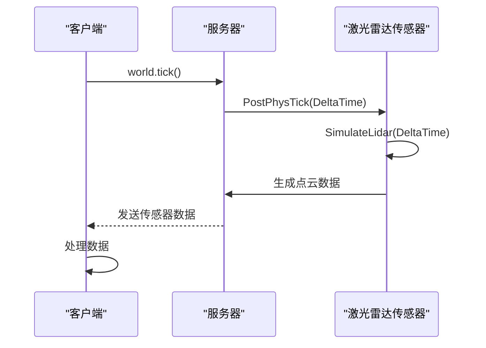
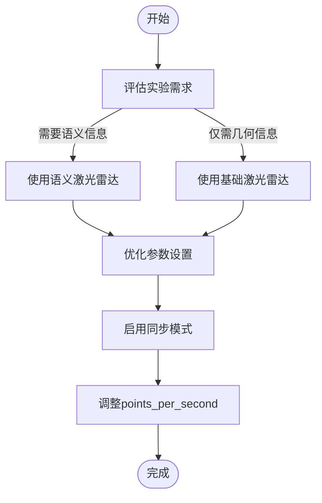

# 性能与优化


**本文档中引用的文件**  
- [RayCastLidar.h](https://github.com/carla-simulator/carla/blob/ue5-dev/Unreal/CarlaUnreal/Plugins/Carla/Source/Carla/Sensor/RayCastLidar.h)
- [RayCastLidar.cpp](https://github.com/carla-simulator/carla/blob/ue5-dev/Unreal/CarlaUnreal/Plugins/Carla/Source/Carla/Sensor/RayCastLidar.cpp)
- [RayCastSemanticLidar.h](https://github.com/carla-simulator/carla/blob/ue5-dev/Unreal/CarlaUnreal/Plugins/Carla/Source/Carla/Sensor/RayCastSemanticLidar.h)
- [RayCastSemanticLidar.cpp](https://github.com/carla-simulator/carla/blob/ue5-dev/Unreal/CarlaUnreal/Plugins/Carla/Source/Carla/Sensor/RayCastSemanticLidar.cpp)
- [LidarDescription.h](https://github.com/carla-simulator/carla/blob/ue5-dev/Unreal/CarlaUnreal/Plugins/Carla/Source/Carla/Sensor/LidarDescription.h)
- [SemanticLidarData.h](https://github.com/carla-simulator/carla/blob/ue5-dev/LibCarla/source/carla/sensor/data/SemanticLidarData.h)
- [LidarData.h](https://github.com/carla-simulator/carla/blob/ue5-dev/LibCarla/source/carla/sensor/data/LidarData.h)
- [test_lidar.py](https://github.com/carla-simulator/carla/blob/ue5-dev/PythonAPI/test/smoke/test_lidar.py)
- [foundations.md](https://github.com/carla-simulator/carla/blob/ue5-dev/Docs/foundations.md)
- [adv_synchrony_timestep.md](https://github.com/carla-simulator/carla/blob/ue5-dev/Docs/adv_synchrony_timestep.md)
- [test_raycast_sensor.py](https://github.com/carla-simulator/carla/blob/ue5-dev/PythonAPI/test/test_raycast_sensor.py)


## 目录
1. [激光雷达性能影响因素](#激光雷达性能影响因素)
2. [数据生成与同步机制](#数据生成与同步机制)
3. [性能优化策略](#性能优化策略)
4. [多传感器资源管理](#多传感器资源管理)
5. [性能监控方法](#性能监控方法)

## 激光雷达性能影响因素

激光雷达传感器的性能受多个关键参数影响。其中，`points_per_second`（每秒生成点数）是影响CPU负载的主要因素。当该值设置过高时，会显著增加CPU计算负担，因为系统需要处理更多的射线投射和碰撞检测计算。在`LidarDescription.h`中定义了该参数的默认值为56,000点/秒，但可配置范围可达500,000点/秒。

语义激光雷达（Semantic Lidar）比基础激光雷达（Basic Lidar）消耗更多性能，因为语义激光雷达需要查询每个检测点的Actor信息。在`RayCastSemanticLidar.cpp`的`ComputeRawDetection`函数中，系统需要获取碰撞物体的Actor指针，并通过`ActorRegistry`查找对应的Carla Actor，以获取物体索引（object_idx）和语义标签（object_tag）。这一过程增加了额外的内存访问和查找开销。

此外，激光雷达的通道数（Channels）、扫描频率（RotationFrequency）和扫描范围（Range）也直接影响性能。更多的通道数意味着需要进行更多的射线投射计算，而更高的扫描频率会增加每帧的计算量。

**本节来源**
- [LidarDescription.h](https://github.com/carla-simulator/carla/blob/ue5-dev/Unreal/CarlaUnreal/Plugins/Carla/Source/Carla/Sensor/LidarDescription.h#L24-L27)
- [RayCastSemanticLidar.cpp](https://github.com/carla-simulator/carla/blob/ue5-dev/Unreal/CarlaUnreal/Plugins/Carla/Source/Carla/Sensor/RayCastSemanticLidar.cpp#L217-L236)
- [test_lidar.py](https://github.com/carla-simulator/carla/blob/ue5-dev/PythonAPI/test/smoke/test_lidar.py#L99-L102)

## 数据生成与同步机制

激光雷达数据的生成与Unreal Engine主循环紧密同步。在`RayCastLidar.cpp`和`RayCastSemanticLidar.cpp`中，`PostPhysTick`函数在每个物理滴答（tick）后被调用，负责执行激光雷达的模拟计算。该函数调用`SimulateLidar`方法，根据`DeltaTime`（自上一帧以来的时间）计算当前应生成的点数。

在同步模式下，服务器会等待客户端的tick指令，确保数据生成与客户端处理同步。这通过`world.tick()`调用实现，如`foundations.md`文档所述。同步模式对于确保多个传感器数据的时间一致性至关重要，避免了数据混合或丢失。

而在异步模式下，服务器以最大速度运行，可能导致数据延迟。客户端可能无法及时处理所有传感器数据，造成数据队列积压或丢失。异步模式下的时间参考不够精确，可能影响实验结果的可靠性。



**图表来源**
- [RayCastLidar.cpp](https://github.com/carla-simulator/carla/blob/ue5-dev/Unreal/CarlaUnreal/Plugins/Carla/Source/Carla/Sensor/RayCastLidar.cpp#L59-L62)
- [foundations.md](https://github.com/carla-simulator/carla/blob/ue5-dev/Docs/foundations.md#L114-L119)

**本节来源**
- [RayCastLidar.cpp](https://github.com/carla-simulator/carla/blob/ue5-dev/Unreal/CarlaUnreal/Plugins/Carla/Source/Carla/Sensor/RayCastLidar.cpp#L59-L62)
- [foundations.md](https://github.com/carla-simulator/carla/blob/ue5-dev/Docs/foundations.md#L114-L119)
- [adv_synchrony_timestep.md](https://github.com/carla-simulator/carla/blob/ue5-dev/Docs/adv_synchrony_timestep.md#L145-L157)

## 性能优化策略

为优化激光雷达性能，建议采取以下策略：

1. **降低点云密度**：在不影响实验结果的前提下，适当降低`points_per_second`参数。例如，将默认的56,000点/秒降低到100,000点/秒以下，可显著减少CPU负载。

2. **优先使用基础激光雷达**：当不需要语义信息时，应优先使用基础激光雷达而非语义激光雷达。基础激光雷达仅计算几何信息，避免了Actor信息查询的开销。

3. **使用同步模式**：利用CARLA的同步模式（synchronous mode）来稳定数据流。通过设置`settings.synchronous_mode = True`，可以确保客户端有足够时间处理每帧数据，避免数据丢失。

4. **合理配置传感器参数**：根据实际需求调整`Channels`、`Range`和`RotationFrequency`等参数，避免不必要的计算开销。

这些优化策略可以在保证仿真质量的同时，显著提升系统性能和稳定性。



**图表来源**
- [LidarDescription.h](https://github.com/carla-simulator/carla/blob/ue5-dev/Unreal/CarlaUnreal/Plugins/Carla/Source/Carla/Sensor/LidarDescription.h#L24-L30)
- [foundations.md](https://github.com/carla-simulator/carla/blob/ue5-dev/Docs/foundations.md#L114-L116)

**本节来源**
- [LidarDescription.h](https://github.com/carla-simulator/carla/blob/ue5-dev/Unreal/CarlaUnreal/Plugins/Carla/Source/Carla/Sensor/LidarDescription.h#L24-L30)
- [foundations.md](https://github.com/carla-simulator/carla/blob/ue5-dev/Docs/foundations.md#L114-L116)
- [test_lidar.py](https://github.com/carla-simulator/carla/blob/ue5-dev/PythonAPI/test/smoke/test_lidar.py#L99-L102)

## 多传感器资源管理

在大规模场景中使用多传感器时，有效的资源管理至关重要。CARLA通过`SensorManager`统一管理所有传感器的生命周期和更新。每个传感器的`PostPhysTick`方法在主循环中被调用，因此传感器数量的增加会线性增加CPU负载。

建议采用分层管理策略：
- **优先级管理**：为关键传感器分配更高优先级，确保其数据及时处理
- **时间分片**：通过`sensor_tick`属性配置不同传感器的更新频率，避免所有传感器同时更新
- **动态激活**：根据场景需求动态激活/停用传感器，减少不必要的计算

在`Sensor.cpp`中，`Set`方法通过`sensor_tick`属性设置传感器的更新间隔，实现灵活的时间控制。

**本节来源**
- [SensorManager.h](https://github.com/carla-simulator/carla/blob/ue5-dev/Unreal/CarlaUnreal/Plugins/Carla/Source/Carla/Sensor/SensorManager.h#L16-L18)
- [Sensor.cpp](https://github.com/carla-simulator/carla/blob/ue5-dev/Unreal/CarlaUnreal/Plugins/Carla/Source/Carla/Sensor/Sensor.cpp#L44-L48)
- [test_sensor_tick_time.py](https://github.com/carla-simulator/carla/blob/ue5-dev/PythonAPI/test/smoke/test_sensor_tick_time.py#L51-L65)

## 性能监控方法

评估激光雷达性能影响的最直接方法是监控仿真帧率（FPS）。在`test_raycast_sensor.py`中展示了如何计算FPS：

```python
time_frames = timer.time() - time0
fps = 30.0 / time_frames
print("FPS: %.3f" % fps)
```

通过定期测量处理30帧所需的时间，可以计算出实际FPS。当添加激光雷达传感器后，如果FPS显著下降，则表明该传感器对性能有较大影响。

此外，还可以监控：
- **CPU使用率**：观察激光雷达参数变化对CPU负载的影响
- **内存使用**：评估点云数据对内存的占用
- **数据延迟**：测量从数据生成到客户端接收的时间差

这些指标共同构成了完整的性能评估体系。

**本节来源**
- [test_raycast_sensor.py](https://github.com/carla-simulator/carla/blob/ue5-dev/PythonAPI/test/test_raycast_sensor.py#L371-L377)
- [test_sensor_determinism.py](https://github.com/carla-simulator/carla/blob/ue5-dev/PythonAPI/test/smoke/test_sensor_determinism.py#L306-L308)