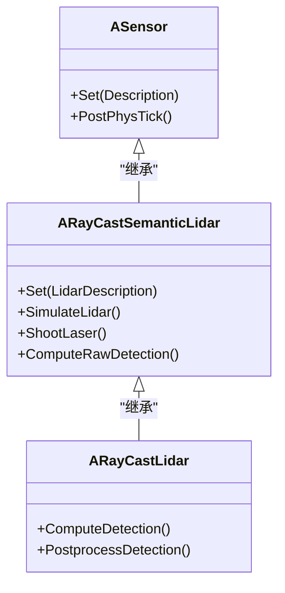
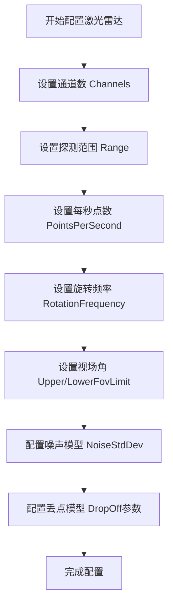
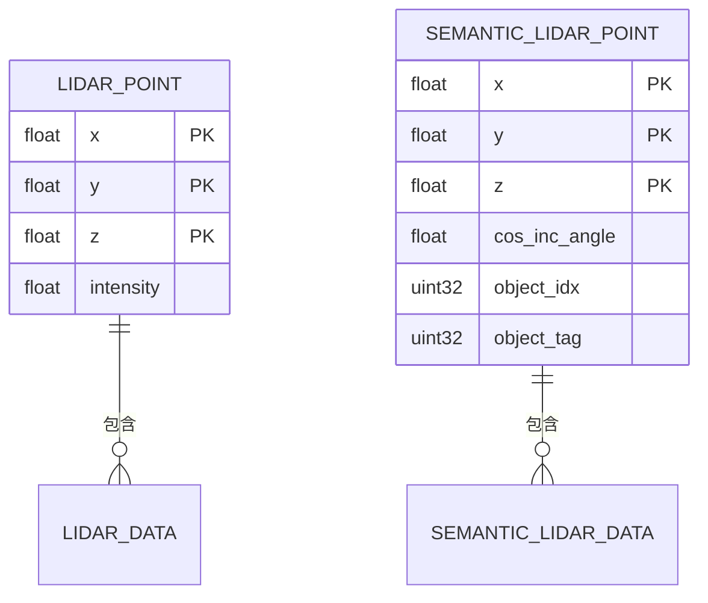
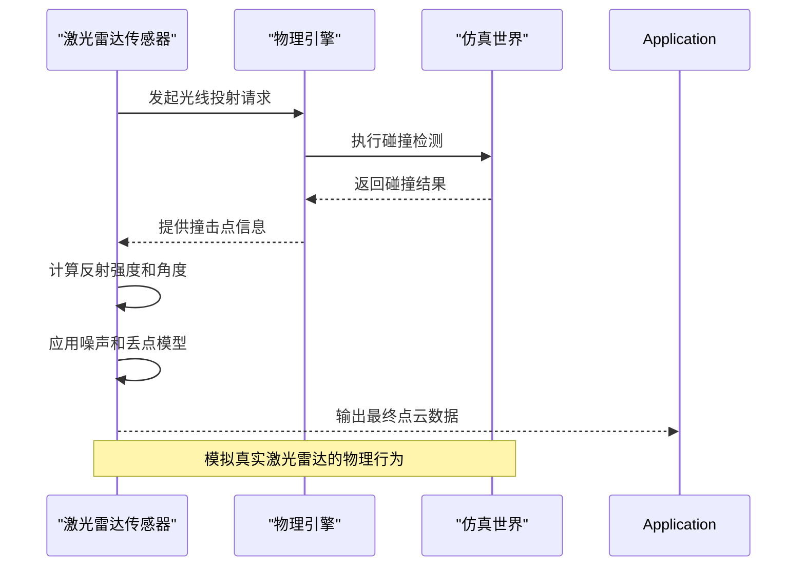
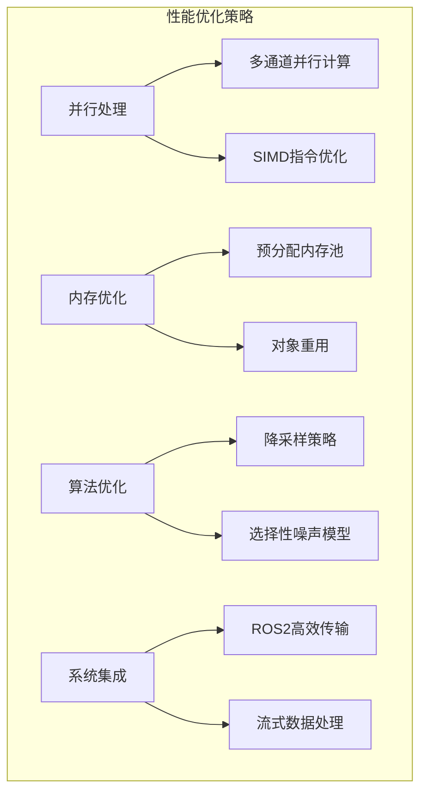
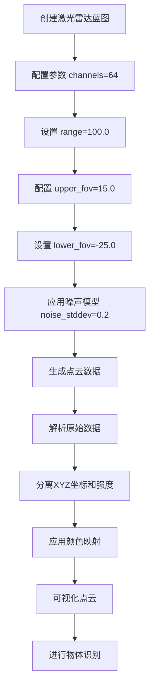

# 激光雷达传感器

> **引用文件**
> **本文档引用的文件**

- [RayCastLidar.h](https://github.com/carla-simulator/carla/blob/ue5-dev/Unreal/CarlaUnreal/Plugins/Carla/Source/Carla/Sensor/RayCastLidar.h)
- [RayCastLidar.cpp](https://github.com/carla-simulator/carla/blob/ue5-dev/Unreal/CarlaUnreal/Plugins/Carla/Source/Carla/Sensor/RayCastLidar.cpp)
- [RayCastSemanticLidar.h](https://github.com/carla-simulator/carla/blob/ue5-dev/Unreal/CarlaUnreal/Plugins/Carla/Source/Carla/Sensor/RayCastSemanticLidar.h)
- [RayCastSemanticLidar.cpp](https://github.com/carla-simulator/carla/blob/ue5-dev/Unreal/CarlaUnreal/Plugins/Carla/Source/Carla/Sensor/RayCastSemanticLidar.cpp)
- [LidarDescription.h](https://github.com/carla-simulator/carla/blob/ue5-dev/Unreal/CarlaUnreal/Plugins/Carla/Source/Carla/Sensor/LidarDescription.h)
- [LidarData.h](https://github.com/carla-simulator/carla/blob/ue5-dev/LibCarla/source/carla/sensor/data/LidarData.h)
- [SemanticLidarData.h](https://github.com/carla-simulator/carla/blob/ue5-dev/LibCarla/source/carla/sensor/data/SemanticLidarData.h)
- [ref_sensors.md](https://github.com/carla-simulator/carla/blob/ue5-dev/Docs/ref_sensors.md)
- [bp_library.md](https://github.com/carla-simulator/carla/blob/ue5-dev/Docs/bp_library.md)
- [open3d_lidar.py](https://github.com/carla-simulator/carla/blob/ue5-dev/PythonAPI/examples/open3d_lidar.py)
- [test_lidar.py](https://github.com/carla-simulator/carla/blob/ue5-dev/PythonAPI/test/smoke/test_lidar.py)

## 目录

1. [简介](#简介)
2. [核心实现原理](#核心实现原理)
3. [关键参数配置](#关键参数配置)
4. [点云数据组织格式](#点云数据组织格式)
5. [物理模拟机制](#物理模拟机制)
6. [性能优化策略](#性能优化策略)
7. [使用示例](#使用示例)
8. [总结](#总结)

## 简介

CARLA 中的激光雷达传感器通过光线投射算法模拟真实世界的激光雷达设备，提供高精度的环境感知能力。系统实现了两种主要类型的激光雷达：RayCastLidar 和 RayCastSemanticLidar。前者提供带有强度信息的点云数据，后者在此基础上增加了语义标签信息，能够识别不同类型的物体。激光雷达传感器在自动驾驶仿真中扮演着关键角色，为感知算法提供可靠的三维环境数据。

**Section sources**

- [ref_sensors.md](https://github.com/carla-simulator/carla/blob/ue5-dev/Docs/ref_sensors.md#LIDAR-sensor)

## 核心实现原理

CARLA 的激光雷达传感器基于光线投射（Ray Casting）算法实现，通过模拟激光束的发射和反射来生成点云数据。系统采用分层架构设计，其中 RayCastLidar 继承自 RayCastSemanticLidar，而后者又继承自基础的 ASensor 类，形成了清晰的继承关系。

激光雷达的工作流程始于 PostPhysTick 函数的调用，该函数在每个物理周期结束后执行。系统首先调用 SimulateLidar 方法来模拟激光雷达的扫描过程。在此过程中，根据配置的通道数（Channels）创建相应的激光束，并计算每个激光束在垂直方向上的角度分布。水平方向的扫描通过计算每个时间步长内的旋转角度来实现。

**Diagram sources**

- <a href="https://github.com/carla-simulator/carla/blob/ue5-dev/Unreal/CarlaUnreal/Plugins/Carla/Source/Carla/Sensor/RayCastLidar.h#L24" target="_blank">RayCastLidar.h</a>
- <a href="https://github.com/carla-simulator/carla/blob/ue5-dev/Unreal/CarlaUnreal/Plugins/Carla/Source/Carla/Sensor/RayCastSemanticLidar.h#L24" target="_blank">RayCastSemanticLidar.h</a>

**Section sources**

- <a href="https://github.com/carla-simulator/carla/blob/ue5-dev/Unreal/CarlaUnreal/Plugins/Carla/Source/Carla/Sensor/RayCastLidar.h#L24" target="_blank">RayCastLidar.h</a>
- <a href="https://github.com/carla-simulator/carla/blob/ue5-dev/Unreal/CarlaUnreal/Plugins/Carla/Source/Carla/Sensor/RayCastSemanticLidar.h#L24" target="_blank">RayCastSemanticLidar.h</a>

## 关键参数配置

激光雷达传感器的关键参数通过 LidarDescription 结构体进行配置，这些参数决定了传感器的性能特征和行为模式。主要配置参数包括垂直和水平分辨率、扫描频率、最大探测距离以及噪声模型等。

垂直分辨率由通道数（Channels）和上下视场角（UpperFovLimit 和 LowerFovLimit）共同决定。系统根据通道数均匀分布激光束的垂直角度，计算公式为：DeltaAngle = (UpperFovLimit - LowerFovLimit) / (Channels - 1)。水平分辨率则由扫描频率（RotationFrequency）和每秒生成的点数（PointsPerSecond）决定，系统通过计算每个时间步长内的水平旋转角度来实现连续扫描。

**Diagram sources**

- <a href="https://github.com/carla-simulator/carla/blob/ue5-dev/Unreal/CarlaUnreal/Plugins/Carla/Source/Carla/Sensor/LidarDescription.h#L18" target="_blank">LidarDescription.h</a>
- <a href="https://github.com/carla-simulator/carla/blob/ue5-dev/Unreal/CarlaUnreal/Plugins/Carla/Source/Carla/Sensor/LidarDescription.h#L35" target="_blank">LidarDescription.h</a>
- <a href="https://github.com/carla-simulator/carla/blob/ue5-dev/Unreal/CarlaUnreal/Plugins/Carla/Source/Carla/Sensor/LidarDescription.h#L40" target="_blank">LidarDescription.h</a>

**Section sources**

- <a href="https://github.com/carla-simulator/carla/blob/ue5-dev/Unreal/CarlaUnreal/Plugins/Carla/Source/Carla/Sensor/LidarDescription.h#L16" target="_blank">LidarDescription.h</a>
- [ref_sensors.md](https://github.com/carla-simulator/carla/blob/ue5-dev/Docs/ref_sensors.md#Lidar-attributes)

## 点云数据组织格式

激光雷达生成的点云数据采用特定的组织格式，包含坐标信息、强度值和语义标签等关键数据。对于普通激光雷达（RayCastLidar），每个点由四个浮点数表示：X、Y、Z 坐标和强度值（Intensity）。而对于语义激光雷达（RayCastSemanticLidar），每个点还包含入射角余弦值、物体索引和物体标签等额外信息。

点云数据的坐标系以传感器为中心，遵循右手坐标系规则。X 轴指向车辆前方，Y 轴指向车辆左侧，Z 轴指向上方。这种坐标系设计与大多数自动驾驶系统的坐标约定保持一致，便于数据处理和算法集成。强度值反映了激光束在传播过程中的衰减情况，主要受大气衰减率（AtmospAttenRate）和距离的影响，计算公式为：Intensity = exp(-AtmospAttenRate \* Distance)。

**Diagram sources**

- <a href="https://github.com/carla-simulator/carla/blob/ue5-dev/LibCarla/source/carla/sensor/data/LidarData.h#L51" target="_blank">LidarData.h</a>
- <a href="https://github.com/carla-simulator/carla/blob/ue5-dev/LibCarla/source/carla/sensor/data/SemanticLidarData.h#L55" target="_blank">SemanticLidarData.h</a>

**Section sources**

- <a href="https://github.com/carla-simulator/carla/blob/ue5-dev/LibCarla/source/carla/sensor/data/LidarData.h#L29" target="_blank">LidarData.h</a>
- <a href="https://github.com/carla-simulator/carla/blob/ue5-dev/LibCarla/source/carla/sensor/data/SemanticLidarData.h#L29" target="_blank">SemanticLidarData.h</a>

## 物理模拟机制

激光雷达的物理模拟机制基于精确的光线投射算法，通过模拟激光束与场景物体的交互来生成真实的点云数据。系统使用 Unreal Engine 的物理引擎进行碰撞检测，通过 ParallelLineTraceSingleByChannel 方法执行并行光线追踪，确保高效的性能表现。

表面反射率的计算考虑了入射角的影响，通过计算激光束方向与物体表面法线的夹角余弦值来确定反射强度。这一物理特性使得垂直于激光束的表面产生更强的回波信号，而倾斜表面的信号则相对较弱，这与真实激光雷达的物理行为一致。多回波处理机制允许单个激光束在遇到半透明或分层物体时产生多个返回信号，提高了对复杂场景的感知能力。

噪声模型通过在点的位置上添加随机扰动来模拟真实传感器的测量误差。系统使用正态分布生成噪声值，并将其沿激光束方向应用，模拟了真实激光雷达中常见的距离测量噪声。丢点模型则通过两种机制模拟信号丢失：通用丢点率（DropOffGenRate）随机丢弃部分点云数据，而基于强度的丢点则根据信号强度动态调整丢点概率，强度越低的点越容易被丢弃。

**Diagram sources**

- <a href="https://github.com/carla-simulator/carla/blob/ue5-dev/Unreal/CarlaUnreal/Plugins/Carla/Source/Carla/Sensor/RayCastSemanticLidar.cpp#L243" target="_blank">RayCastSemanticLidar.cpp</a>
- <a href="https://github.com/carla-simulator/carla/blob/ue5-dev/Unreal/CarlaUnreal/Plugins/Carla/Source/Carla/Sensor/RayCastLidar.cpp#L137" target="_blank">RayCastLidar.cpp</a>
- <a href="https://github.com/carla-simulator/carla/blob/ue5-dev/Unreal/CarlaUnreal/Plugins/Carla/Source/Carla/Sensor/RayCastLidar.cpp#L135" target="_blank">RayCastLidar.cpp</a>

**Section sources**

- <a href="https://github.com/carla-simulator/carla/blob/ue5-dev/Unreal/CarlaUnreal/Plugins/Carla/Source/Carla/Sensor/RayCastSemanticLidar.cpp#L105" target="_blank">RayCastSemanticLidar.cpp</a>
- <a href="https://github.com/carla-simulator/carla/blob/ue5-dev/Unreal/CarlaUnreal/Plugins/Carla/Source/Carla/Sensor/RayCastLidar.cpp#L107" target="_blank">RayCastLidar.cpp</a>

## 性能优化策略

为了在大规模场景下保持高性能，CARLA 的激光雷达实现采用了多种优化策略。首先，系统利用并行计算框架 ParallelFor 对多个激光通道进行并行处理，充分利用多核 CPU 的计算能力。每个通道的光线投射独立执行，显著提高了处理效率。

内存管理方面，系统采用预分配和重用策略，避免频繁的内存分配和释放操作。RecordedHits 数组在每次扫描前被重置，但保持已分配的内存空间，减少了内存管理开销。数据序列化过程也经过优化，通过直接操作原始字节流来提高传输效率。

对于高分辨率激光雷达，系统提供了灵活的降采样机制。通过调整 PointsPerSecond 参数，可以在保持扫描频率的同时降低点云密度，从而平衡性能和精度。此外，选择性地启用或禁用噪声模型和丢点模型也能显著影响性能表现，用户可以根据仿真需求进行权衡。

**Diagram sources**

- <a href="https://github.com/carla-simulator/carla/blob/ue5-dev/Unreal/CarlaUnreal/Plugins/Carla/Source/Carla/Sensor/RayCastSemanticLidar.cpp#L137" target="_blank">RayCastSemanticLidar.cpp</a>
- <a href="https://github.com/carla-simulator/carla/blob/ue5-dev/Unreal/CarlaUnreal/Plugins/Carla/Source/Carla/Sensor/RayCastSemanticLidar.cpp#L167" target="_blank">RayCastSemanticLidar.cpp</a>
- <a href="https://github.com/carla-simulator/carla/blob/ue5-dev/Unreal/CarlaUnreal/Plugins/Carla/Source/Carla/Sensor/RayCastLidar.cpp#L69" target="_blank">RayCastLidar.cpp</a>

**Section sources**

- <a href="https://github.com/carla-simulator/carla/blob/ue5-dev/Unreal/CarlaUnreal/Plugins/Carla/Source/Carla/Sensor/RayCastSemanticLidar.cpp#L105" target="_blank">RayCastSemanticLidar.cpp</a>
- <a href="https://github.com/carla-simulator/carla/blob/ue5-dev/Unreal/CarlaUnreal/Plugins/Carla/Source/Carla/Sensor/RayCastLidar.cpp#L59" target="_blank">RayCastLidar.cpp</a>

## 使用示例

配置多线束激光雷达参数的示例代码展示了如何通过 Python API 创建和配置激光雷达传感器。用户首先获取蓝图库中的激光雷达蓝图，然后设置各种参数如通道数、探测范围、垂直视场角等。通过调整这些参数，可以模拟不同规格的激光雷达设备。

处理原始点云数据的示例展示了如何将二进制数据转换为可用的数值数组。对于普通激光雷达，数据被解析为包含 XYZ 坐标和强度值的四维数组；对于语义激光雷达，则解析为包含位置、入射角、物体索引和标签的结构化数组。这些数据可以进一步用于可视化、目标检测或地图构建等应用。

利用语义激光雷达进行物体识别的示例中，系统根据物体标签（object_tag）对点云进行着色，不同类型的物体显示为不同颜色。这种方法使得用户能够直观地识别场景中的车辆、行人、建筑物等对象，为感知算法的开发和验证提供了便利。

**Diagram sources**

- <a href="https://github.com/carla-simulator/carla/blob/ue5-dev/PythonAPI/examples/open3d_lidar.py#L108" target="_blank">open3d_lidar.py</a>
- <a href="https://github.com/carla-simulator/carla/blob/ue5-dev/PythonAPI/test/smoke/test_lidar.py#L23" target="_blank">test_lidar.py</a>
- [bp_library.md](https://github.com/carla-simulator/carla/blob/ue5-dev/Docs/bp_library.md#sensor.lidar.ray_cast)

**Section sources**

- <a href="https://github.com/carla-simulator/carla/blob/ue5-dev/PythonAPI/examples/open3d_lidar.py#L1" target="_blank">open3d_lidar.py</a>
- <a href="https://github.com/carla-simulator/carla/blob/ue5-dev/PythonAPI/test/smoke/test_lidar.py#L1" target="_blank">test_lidar.py</a>

## 总结

CARLA 的激光雷达传感器通过先进的光线投射算法和物理模拟机制，提供了高度真实的环境感知能力。系统不仅支持普通激光雷达的基本功能，还通过语义激光雷达扩展了物体识别能力，为自动驾驶算法的开发和测试提供了强大的工具。通过灵活的参数配置和高效的性能优化，用户可以根据具体需求定制激光雷达的行为，满足从基础研究到复杂应用的各种场景需求。

**Section sources**

- [ref_sensors.md](https://github.com/carla-simulator/carla/blob/ue5-dev/Docs/ref_sensors.md#LIDAR-sensor)
- <a href="https://github.com/carla-simulator/carla/blob/ue5-dev/Unreal/CarlaUnreal/Plugins/Carla/Source/Carla/Sensor/RayCastLidar.h#L24" target="_blank">RayCastLidar.h</a>
