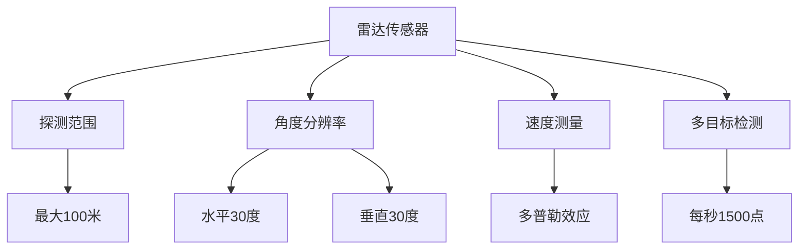
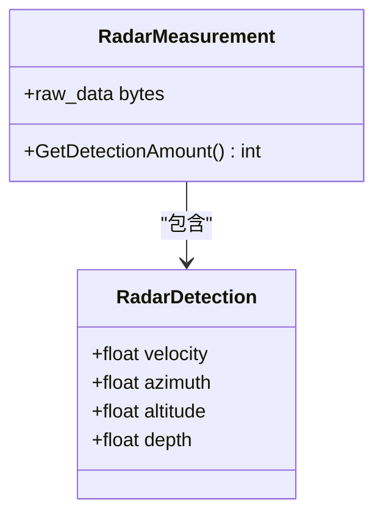
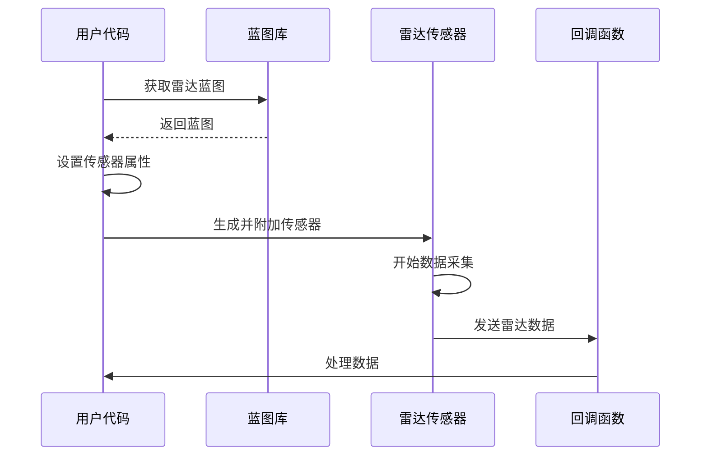
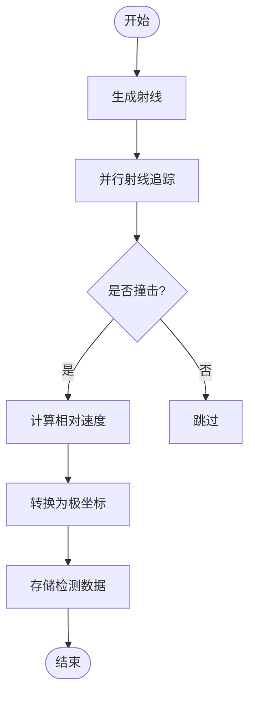

# 雷达传感器

**本文档中引用的文件**   
- [ref_sensors.md](https://github.com/carla-simulator/carla/blob/ue5-dev/Docs/ref_sensors.md)
- [Radar.h](https://github.com/carla-simulator/carla/blob/ue5-dev/Unreal/CarlaUnreal/Plugins/Carla/Source/Carla/Sensor/Radar.h)
- [Radar.cpp](https://github.com/carla-simulator/carla/blob/ue5-dev/Unreal/CarlaUnreal/Plugins/Carla/Source/Carla/Sensor/Radar.cpp)
- [RadarData.h](https://github.com/carla-simulator/carla/blob/ue5-dev/LibCarla/source/carla/sensor/data/RadarData.h)
- [RadarMeasurement.h](https://github.com/carla-simulator/carla/blob/ue5-dev/LibCarla/source/carla/sensor/data/RadarMeasurement.h)
- [visualize_radar.py](https://github.com/carla-simulator/carla/blob/ue5-dev/PythonAPI/examples/visualize_radar.py)
- [manual_control.py](https://github.com/carla-simulator/carla/blob/ue5-dev/PythonAPI/examples/manual_control.py)
- [ActorBlueprintFunctionLibrary.cpp](https://github.com/carla-simulator/carla/blob/ue5-dev/Unreal/CarlaUnreal/Plugins/Carla/Source/Carla/Actor/ActorBlueprintFunctionLibrary.cpp)

## 目录
1. [引言](#引言)
2. [雷达传感器核心特性](#雷达传感器核心特性)
3. [数据格式与结构](#数据格式与结构)
4. [配置与使用方法](#配置与使用方法)
5. [物理模型实现](#物理模型实现)
6. [高级功能与算法](#高级功能与算法)
7. [与其他传感器的对比分析](#与其他传感器的对比分析)
8. [应用实例与最佳实践](#应用实例与最佳实践)
9. [结论](#结论)

## 引言

雷达传感器在自动驾驶仿真中扮演着至关重要的角色，它通过模拟真实世界的雷达系统，为自动驾驶算法提供了关键的环境感知能力。与传统的光学传感器不同，雷达传感器能够穿透雨雾等恶劣天气条件，提供稳定可靠的探测数据。在CARLA仿真平台中，雷达传感器采用基于射线投射的物理模型，精确模拟了雷达波的传播特性、多普勒效应以及目标的雷达截面积（RCS）等关键物理现象。这种高保真的模拟使得开发者能够在虚拟环境中测试和验证自动驾驶系统的感知算法，而无需承担真实世界测试的高成本和高风险。本文档将深入探讨CARLA雷达传感器的技术细节，从基础配置到高级物理模型，为开发者提供全面的指导。

**Section sources**
- [ref_sensors.md](https://github.com/carla-simulator/carla/blob/ue5-dev/Docs/ref_sensors.md#radar-sensor)
- [core_sensors.md](https://github.com/carla-simulator/carla/blob/ue5-dev/Docs/core_sensors.md#radar)

## 雷达传感器核心特性

CARLA雷达传感器具备多项关键特性，使其成为自动驾驶仿真中不可或缺的工具。首先，其探测范围可配置，最大可达100米，能够覆盖典型的驾驶场景需求。传感器的水平视场角和垂直视场角均可调节，默认值分别为30度，形成一个圆锥形的探测区域。这种设计使得雷达能够有效地监测车辆前方的道路环境，包括其他车辆、行人和障碍物。其次，雷达传感器具备出色的速度测量能力，通过多普勒效应原理，能够精确计算目标相对于传感器的径向速度。这一特性对于预测其他交通参与者的行为至关重要，特别是在高速行驶场景中。此外，雷达传感器支持多目标检测，能够在同一帧内识别和跟踪多个物体，这对于复杂交通环境下的感知算法测试尤为重要。传感器的点云生成速率也可配置，最高可达每秒1500个点，确保了数据的高分辨率和实时性。这些特性共同构成了一个功能强大且灵活的雷达仿真系统，能够满足从基础研究到高级算法开发的各种需求。

**Diagram sources **
- [ref_sensors.md](https://github.com/carla-simulator/carla/blob/ue5-dev/Docs/ref_sensors.md#radar-sensor)
- [Radar.h](https://github.com/carla-simulator/carla/blob/ue5-dev/Unreal/CarlaUnreal/Plugins/Carla/Source/Carla/Sensor/Radar.h)

**Section sources**
- [ref_sensors.md](https://github.com/carla-simulator/carla/blob/ue5-dev/Docs/ref_sensors.md#radar-sensor)
- [Radar.h](https://github.com/carla-simulator/carla/blob/ue5-dev/Unreal/CarlaUnreal/Plugins/Carla/Source/Carla/Sensor/Radar.h)

## 数据格式与结构

雷达传感器输出的数据结构经过精心设计，以提供丰富的环境信息。每个雷达测量结果（RadarMeasurement）包含一系列雷达检测点（RadarDetection），每个检测点由四个关键参数组成：方位角、仰角、距离和相对速度。方位角和仰角以弧度表示，分别描述了目标在水平和垂直方向上的角度位置。距离以米为单位，表示目标与传感器之间的直线距离。相对速度以米/秒为单位，表示目标沿雷达波束方向的径向速度分量，正值表示目标远离传感器，负值表示目标接近传感器。这些数据以极坐标形式组织，反映了雷达传感器的物理工作原理。在实际应用中，这些原始数据可以方便地转换为笛卡尔坐标系下的点云数据，便于后续的处理和分析。例如，在Python API中，可以通过`np.frombuffer`函数将原始字节数据转换为NumPy数组，然后重塑为包含速度、方位角、仰角和距离的二维数组。这种灵活的数据格式使得雷达数据能够无缝集成到各种机器学习和计算机视觉算法中。

**Diagram sources **
- [RadarData.h](https://github.com/carla-simulator/carla/blob/ue5-dev/LibCarla/source/carla/sensor/data/RadarData.h)
- [RadarMeasurement.h](https://github.com/carla-simulator/carla/blob/ue5-dev/LibCarla/source/carla/sensor/data/RadarMeasurement.h)

**Section sources**
- [RadarData.h](https://github.com/carla-simulator/carla/blob/ue5-dev/LibCarla/source/carla/sensor/data/RadarData.h)
- [ref_sensors.md](https://github.com/carla-simulator/carla/blob/ue5-dev/Docs/ref_sensors.md#radar-sensor)

## 配置与使用方法

配置和使用CARLA雷达传感器涉及几个关键步骤。首先，需要从蓝图库中获取雷达传感器的蓝图，并设置其属性，如水平视场角、垂直视场角、探测范围和每秒生成的点数。这些属性可以通过`set_attribute`方法进行配置。例如，可以将水平视场角设置为35度，垂直视场角设置为20度，以适应特定的仿真需求。接下来，使用`spawn_actor`方法将传感器附加到目标车辆上，并指定其安装位置和旋转角度。通常，雷达传感器会安装在车辆前部，略微向上倾斜，以获得最佳的前方视野。传感器设置完成后，需要通过`listen`方法注册一个回调函数，以便在每次传感器捕获数据时进行处理。回调函数接收雷达数据作为参数，可以对其进行解析、可视化或用于控制算法。在`manual_control.py`示例中，展示了如何将雷达点云数据可视化，通过颜色编码表示目标的速度：白色表示静止目标，红色表示接近的目标，蓝色表示远离的目标。这种直观的可视化方式有助于开发者快速理解和调试雷达传感器的输出。

**Diagram sources **
- [manual_control.py](https://github.com/carla-simulator/carla/blob/ue5-dev/PythonAPI/examples/manual_control.py)
- [visualize_radar.py](https://github.com/carla-simulator/carla/blob/ue5-dev/PythonAPI/examples/visualize_radar.py)

**Section sources**
- [manual_control.py](https://github.com/carla-simulator/carla/blob/ue5-dev/PythonAPI/examples/manual_control.py)
- [visualize_radar.py](https://github.com/carla-simulator/carla/blob/ue5-dev/PythonAPI/examples/visualize_radar.py)

## 物理模型实现

CARLA雷达传感器的物理模型实现基于射线投射算法，精确模拟了真实雷达的工作原理。在每一仿真步长中，传感器会生成指定数量的射线，这些射线在水平和垂直视场角范围内随机分布。射线的起点位于传感器位置，终点位于最大探测距离处。系统使用`ParallelLineTraceSingleByChannel`方法进行并行射线追踪，以提高计算效率。当射线与场景中的物体相交时，系统会记录下撞击点的位置、距离以及撞击物体的速度。相对速度的计算是物理模型的核心部分，它通过计算目标物体速度与雷达传感器速度的差值，再投影到射线方向上来获得。这一过程精确地模拟了多普勒效应，使得雷达能够测量目标的径向速度。此外，系统还考虑了目标的雷达截面积（RCS）和环境杂波等因素，通过随机噪声模型来增加仿真的真实感。这些物理细节的实现确保了雷达传感器输出的数据不仅在几何上准确，而且在物理特性上也与真实世界高度一致。

**Diagram sources **
- [Radar.cpp](https://github.com/carla-simulator/carla/blob/ue5-dev/Unreal/CarlaUnreal/Plugins/Carla/Source/Carla/Sensor/Radar.cpp)
- [RadarData.h](https://github.com/carla-simulator/carla/blob/ue5-dev/LibCarla/source/carla/sensor/data/RadarData.h)

**Section sources**
- [Radar.cpp](https://github.com/carla-simulator/carla/blob/ue5-dev/Unreal/CarlaUnreal/Plugins/Carla/Source/Carla/Sensor/Radar.cpp)

## 高级功能与算法

CARLA雷达传感器不仅提供了基础的探测功能，还支持一系列高级功能和算法，以满足复杂自动驾驶场景的需求。其中，基于射线投射的信号模拟算法是其核心技术。该算法利用Unreal Engine的物理引擎进行精确的射线追踪，能够处理复杂的几何形状和材质属性。为了模拟真实雷达的性能限制，系统还实现了杂波生成模型，通过在数据中添加随机噪声来模拟环境干扰。目标RCS（雷达截面积）建模则考虑了物体的大小、形状和表面材质对雷达回波强度的影响，使得不同类型的物体在雷达图像中呈现出不同的特征。此外，雷达传感器还支持在复杂天气条件下的衰减模型，能够模拟雨、雪、雾等天气对雷达信号传播的影响。这些高级功能共同构成了一个高度逼真的雷达仿真环境，使得开发者能够在各种极端条件下测试和优化感知算法。例如，通过调整`fog_density`和`precipitation`等天气参数，可以研究雷达在恶劣天气下的性能表现。

**Section sources**
- [Radar.cpp](https://github.com/carla-simulator/carla/blob/ue5-dev/Unreal/CarlaUnreal/Plugins/Carla/Source/Carla/Sensor/Radar.cpp)
- [WeatherParameters.h](https://github.com/carla-simulator/carla/blob/ue5-dev/LibCarla/source/carla/rpc/WeatherParameters.h)

## 与其他传感器的对比分析

与激光雷达（LIDAR）相比，CARLA雷达传感器具有独特的优势和局限性。激光雷达通过发射激光束并测量其往返时间来构建高精度的三维点云，能够提供丰富的几何信息，但其性能在雨、雪、雾等恶劣天气条件下会显著下降。相比之下，雷达传感器使用无线电波，能够穿透这些障碍物，提供更稳定的探测能力。然而，雷达的角分辨率通常低于激光雷达，导致其生成的点云较为稀疏，难以精确重建物体的形状。在数据维度上，激光雷达主要提供空间坐标信息，而雷达传感器额外提供了目标的速度信息，这对于动态场景的理解至关重要。从物理模型的角度看，激光雷达的模拟主要关注几何精度，而雷达传感器的模拟则更侧重于物理特性，如多普勒效应和信号衰减。因此，在自动驾驶系统中，雷达和激光雷达往往是互补的，雷达用于检测和跟踪动态目标，而激光雷达用于精确的环境建模。开发者应根据具体的应用场景选择合适的传感器组合。

**Section sources**
- [ref_sensors.md](https://github.com/carla-simulator/carla/blob/ue5-dev/Docs/ref_sensors.md#lidar-sensor)
- [ref_sensors.md](https://github.com/carla-simulator/carla/blob/ue5-dev/Docs/ref_sensors.md#radar-sensor)

## 应用实例与最佳实践

在实际应用中，CARLA雷达传感器被广泛用于目标跟踪、碰撞预警和自适应巡航控制等场景。一个典型的应用实例是使用雷达数据实现简单的目标跟踪算法。通过连续帧的雷达点云数据，可以计算目标的运动轨迹和速度变化，从而预测其未来的位置。在`visualize_radar.py`示例中，展示了如何将雷达点云数据实时可视化，并根据目标的速度进行颜色编码。这不仅有助于调试，也为开发更复杂的感知算法提供了直观的反馈。最佳实践包括合理配置传感器参数以平衡性能和计算成本，例如在不需要高分辨率的场景中降低每秒生成的点数。此外，建议结合其他传感器（如摄像头和激光雷达）的数据进行多传感器融合，以提高感知系统的鲁棒性和准确性。对于高级开发者，可以利用CARLA提供的ROS2接口，将雷达数据集成到更复杂的机器人系统中，实现端到端的自动驾驶算法开发和测试。

**Section sources**
- [visualize_radar.py](https://github.com/carla-simulator/carla/blob/ue5-dev/PythonAPI/examples/visualize_radar.py)
- [manual_control.py](https://github.com/carla-simulator/carla/blob/ue5-dev/PythonAPI/examples/manual_control.py)

## 结论

CARLA雷达传感器是一个功能强大且高度可配置的仿真工具，为自动驾驶技术的研究和开发提供了宝贵的资源。通过精确的物理模型和灵活的API接口，它能够模拟真实世界雷达的各种特性和行为。从基础的探测范围和速度测量，到高级的多普勒效应和天气衰减模型，CARLA雷达传感器为开发者提供了一个全面的测试平台。无论是初学者还是高级开发者，都可以利用这一工具来探索和验证各种感知算法。随着自动驾驶技术的不断发展，对高保真仿真环境的需求将持续增长。CARLA雷达传感器的持续改进和优化，将为这一领域的发展做出重要贡献。未来的工作可以集中在进一步提高物理模型的精度，例如引入更复杂的RCS模型和多路径效应模拟，以使仿真结果更加接近真实世界的雷达性能。