# 参与者管理


**本文档中引用的文件**  
- [Actor.h](https://github.com/carla-simulator/carla/blob/ue5-dev/LibCarla/source/carla/client/Actor.h)
- [Actor.cpp](https://github.com/carla-simulator/carla/blob/ue5-dev/LibCarla/source/carla/client/Actor.cpp)
- [Vehicle.h](https://github.com/carla-simulator/carla/blob/ue5-dev/LibCarla/source/carla/client/Vehicle.h)
- [Walker.h](https://github.com/carla-simulator/carla/blob/ue5-dev/LibCarla/source/carla/client/Walker.h)
- [Sensor.h](https://github.com/carla-simulator/carla/blob/ue5-dev/LibCarla/source/carla/client/Sensor.h)
- [ActorBlueprint.h](https://github.com/carla-simulator/carla/blob/ue5-dev/LibCarla/source/carla/client/ActorBlueprint.h)
- [ActorBlueprint.cpp](https://github.com/carla-simulator/carla/blob/ue5-dev/LibCarla/source/carla/client/ActorBlueprint.cpp)
- [ActorAttribute.h](https://github.com/carla-simulator/carla/blob/ue5-dev/LibCarla/source/carla/client/ActorAttribute.h)
- [ActorAttribute.cpp](https://github.com/carla-simulator/carla/blob/ue5-dev/LibCarla/source/carla/client/ActorAttribute.cpp)
- [World.h](https://github.com/carla-simulator/carla/blob/ue5-dev/LibCarla/source/carla/client/World.h)
- [World.cpp](https://github.com/carla-simulator/carla/blob/ue5-dev/LibCarla/source/carla/client/World.cpp)
- [ActorList.h](https://github.com/carla-simulator/carla/blob/ue5-dev/LibCarla/source/carla/client/ActorList.h)
- [detail/ActorState.h](https://github.com/carla-simulator/carla/blob/ue5-dev/LibCarla/source/carla/client/detail/ActorState.h)
- [detail/ActorState.cpp](https://github.com/carla-simulator/carla/blob/ue5-dev/LibCarla/source/carla/client/detail/ActorState.cpp)


## 目录
1. [简介](#简介)
2. [参与者类层次结构](#参与者类层次结构)
3. [参与者生命周期管理](#参与者生命周期管理)
4. [参与者属性系统](#参与者属性系统)
5. [变换与物理控制](#变换与物理控制)
6. [蓝图系统](#蓝图系统)
7. [状态查询与交互](#状态查询与交互)
8. [详细组件分析](#详细组件分析)
9. [依赖关系分析](#依赖关系分析)

## 简介
CARLA仿真环境中的参与者（Actor）系统是整个模拟架构的核心组成部分。参与者作为所有可移动和静态对象的基类，为车辆、行人、传感器等实体提供了统一的接口和管理机制。本文档深入探讨了参与者管理系统的设计理念、实现细节和使用方法，涵盖了从蓝图创建、属性配置到场景生成和销毁的完整生命周期。通过分析CARLA代码库中的关键类和方法，本文档为初学者提供了直观的概念解释，同时为经验丰富的开发者揭示了底层实现的复杂性。

## 参与者类层次结构
CARLA的参与者系统采用面向对象的设计模式，构建了一个层次化的类继承体系。`Actor`类作为所有参与者的基础，定义了通用的接口和功能，而具体的参与者类型如车辆、行人和传感器则通过继承`Actor`类来实现特定的行为和属性。

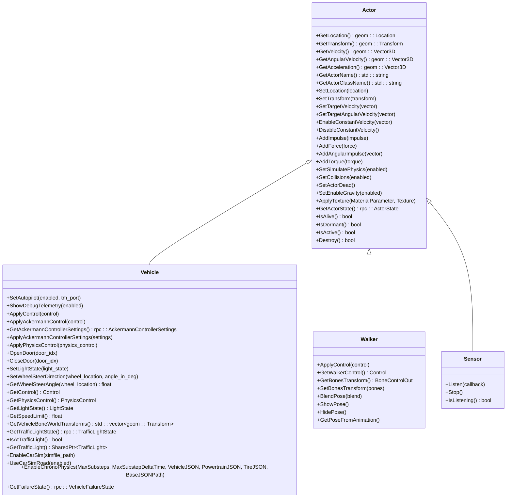

**图源**  
- [Actor.h](https://github.com/carla-simulator/carla/blob/ue5-dev/LibCarla/source/carla/client/Actor.h)
- [Vehicle.h](https://github.com/carla-simulator/carla/blob/ue5-dev/LibCarla/source/carla/client/Vehicle.h)
- [Walker.h](https://github.com/carla-simulator/carla/blob/ue5-dev/LibCarla/source/carla/client/Walker.h)
- [Sensor.h](https://github.com/carla-simulator/carla/blob/ue5-dev/LibCarla/source/carla/client/Sensor.h)

**章节来源**  
- [Actor.h](https://github.com/carla-simulator/carla/blob/ue5-dev/LibCarla/source/carla/client/Actor.h#L1-L162)
- [Vehicle.h](https://github.com/carla-simulator/carla/blob/ue5-dev/LibCarla/source/carla/client/Vehicle.h#L1-L154)
- [Walker.h](https://github.com/carla-simulator/carla/blob/ue5-dev/LibCarla/source/carla/client/Walker.h#L1-L49)
- [Sensor.h](https://github.com/carla-simulator/carla/blob/ue5-dev/LibCarla/source/carla/client/Sensor.h#L1-L37)

## 参与者生命周期管理
参与者的生命周期管理是CARLA仿真系统的核心功能之一，涵盖了从创建、配置到销毁的完整过程。生命周期的管理通过`World`类提供的接口实现，确保了参与者在仿真环境中的正确行为和状态同步。

### 蓝图创建与配置
参与者的创建始于蓝图（Blueprint）系统，该系统提供了预定义的参与者模板。蓝图包含了参与者的所有必要信息，包括ID、标签和属性，这些信息在参与者生成时被用来配置其初始状态。

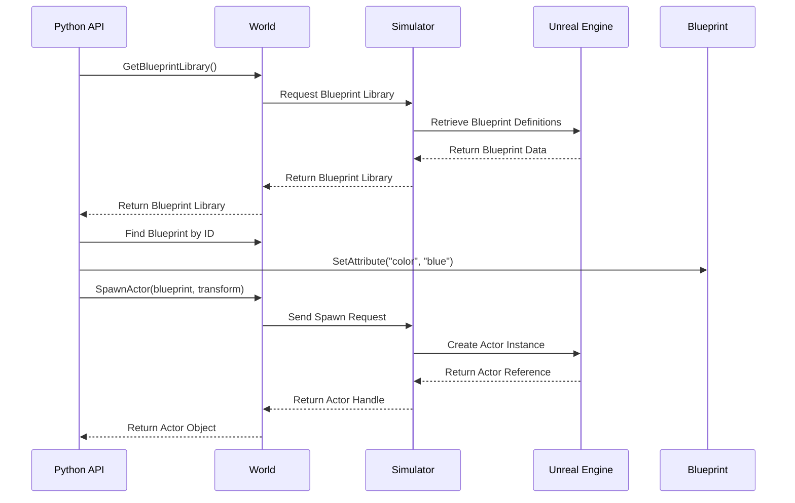

**图源**  
- [ActorBlueprint.h](https://github.com/carla-simulator/carla/blob/ue5-dev/LibCarla/source/carla/client/ActorBlueprint.h)
- [World.h](https://github.com/carla-simulator/carla/blob/ue5-dev/LibCarla/source/carla/client/World.h)

**章节来源**  
- [ActorBlueprint.h](https://github.com/carla-simulator/carla/blob/ue5-dev/LibCarla/source/carla/client/ActorBlueprint.h#L1-L125)
- [ActorBlueprint.cpp](https://github.com/carla-simulator/carla/blob/ue5-dev/LibCarla/source/carla/client/ActorBlueprint.cpp#L1-L67)
- [World.h](https://github.com/carla-simulator/carla/blob/ue5-dev/LibCarla/source/carla/client/World.h#L1-L243)
- [World.cpp](https://github.com/carla-simulator/carla/blob/ue5-dev/LibCarla/source/carla/client/World.cpp#L1-L392)

### 生成与销毁
参与者的生成和销毁是通过`World`类的`SpawnActor`和`Destroy`方法实现的。生成过程涉及将蓝图信息传递给仿真服务器，服务器在Unreal Engine中创建相应的Actor实例，并返回一个客户端可操作的句柄。销毁过程则通过`Destroy`方法通知仿真服务器移除指定的参与者。

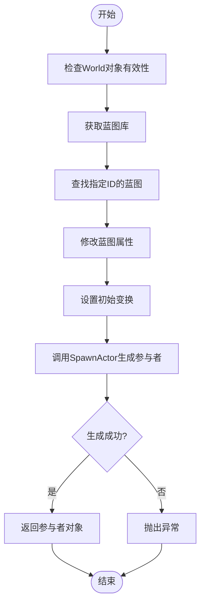

**图源**  
- [World.h](https://github.com/carla-simulator/carla/blob/ue5-dev/LibCarla/source/carla/client/World.h)
- [Actor.h](https://github.com/carla-simulator/carla/blob/ue5-dev/LibCarla/source/carla/client/Actor.h)

**章节来源**  
- [World.h](https://github.com/carla-simulator/carla/blob/ue5-dev/LibCarla/source/carla/client/World.h#L114-L127)
- [Actor.h](https://github.com/carla-simulator/carla/blob/ue5-dev/LibCarla/source/carla/client/Actor.h#L152-L153)

## 参与者属性系统
CARLA的参与者属性系统为每个参与者提供了可配置的参数，这些参数定义了参与者的外观、行为和其他特性。属性系统通过`ActorAttribute`和`ActorBlueprint`类实现，允许用户在生成参与者之前对其进行详细的配置。

### 属性类型与访问
参与者属性支持多种数据类型，包括布尔值、整数、浮点数、字符串和RGB颜色。每种属性都有一个唯一的ID，用于在蓝图中进行识别和修改。属性的访问和修改通过类型安全的接口实现，确保了数据的正确性和一致性。

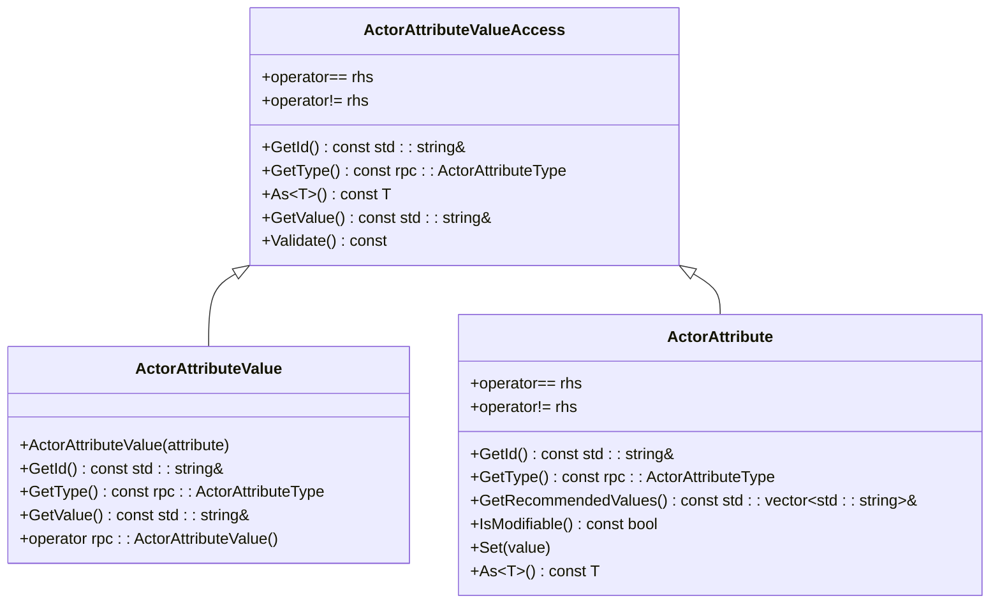

**图源**  
- [ActorAttribute.h](https://github.com/carla-simulator/carla/blob/ue5-dev/LibCarla/source/carla/client/ActorAttribute.h)

**章节来源**  
- [ActorAttribute.h](https://github.com/carla-simulator/carla/blob/ue5-dev/LibCarla/source/carla/client/ActorAttribute.h#L1-L242)
- [ActorAttribute.cpp](https://github.com/carla-simulator/carla/blob/ue5-dev/LibCarla/source/carla/client/ActorAttribute.cpp#L1-L108)

### 属性配置示例
通过蓝图系统，用户可以轻松地配置参与者的各种属性。例如，可以设置车辆的颜色、轮子的数量或传感器的频率。这些配置在参与者生成时被应用，确保了参与者在仿真环境中的正确行为。

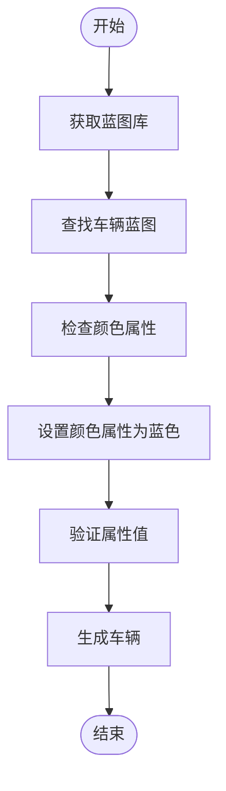

**图源**  
- [ActorBlueprint.h](https://github.com/carla-simulator/carla/blob/ue5-dev/LibCarla/source/carla/client/ActorBlueprint.h)

**章节来源**  
- [ActorBlueprint.h](https://github.com/carla-simulator/carla/blob/ue5-dev/LibCarla/source/carla/client/ActorBlueprint.h#L86-L87)

## 变换与物理控制
参与者的变换和物理控制是仿真环境中的关键功能，允许用户精确地控制参与者的运动和行为。CARLA提供了丰富的接口来实现这些控制，包括位置、旋转、速度和力的设置。

### 变换控制
变换控制允许用户直接设置参与者的空间位置和方向。这通过`SetLocation`和`SetTransform`方法实现，这些方法将参与者立即移动到指定的位置和旋转状态。

```mermaid
sequenceDiagram
participant Client as 客户端
participant World as World
participant Simulator as Simulator
participant Actor as Actor
Client->>World : SetTransform(transform)
World->>Simulator : Send Transform Command
Simulator->>Actor : Apply Transform
Actor-->>Simulator : Confirm Transform Applied
Simulator-->>World : Return Success
World-->>Client : Return Success
```

**图源**  
- [Actor.h](https://github.com/carla-simulator/carla/blob/ue5-dev/LibCarla/source/carla/client/Actor.h)
- [Actor.cpp](https://github.com/carla-simulator/carla/blob/ue5-dev/LibCarla/source/carla/client/Actor.cpp)

**章节来源**  
- [Actor.h](https://github.com/carla-simulator/carla/blob/ue5-dev/LibCarla/source/carla/client/Actor.h#L75-L79)
- [Actor.cpp](https://github.com/carla-simulator/carla/blob/ue5-dev/LibCarla/source/carla/client/Actor.cpp#L45-L51)

### 物理控制
物理控制允许用户在不直接改变参与者位置的情况下影响其运动。这包括设置目标速度、施加力和力矩等。这些控制方法在物理模拟中起作用，使参与者能够以更自然的方式移动。

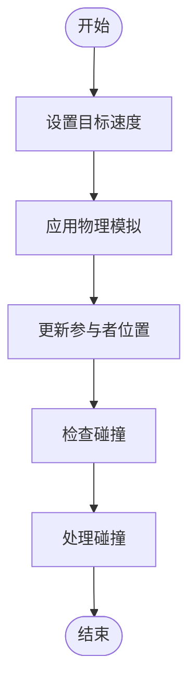

**图源**  
- [Actor.h](https://github.com/carla-simulator/carla/blob/ue5-dev/LibCarla/source/carla/client/Actor.h)

**章节来源**  
- [Actor.h](https://github.com/carla-simulator/carla/blob/ue5-dev/LibCarla/source/carla/client/Actor.h#L81-L109)

## 蓝图系统
CARLA的蓝图系统是参与者创建和配置的核心机制。蓝图（Blueprint）是一种预定义的参与者模板，包含了生成特定类型参与者所需的所有信息。蓝图系统的设计使得参与者创建过程既灵活又高效。

### 蓝图库与查找
蓝图库（Blueprint Library）是所有可用蓝图的集合，通过`World`类的`GetBlueprintLibrary`方法可以访问。用户可以通过ID或通配符模式查找特定的蓝图，然后对其进行配置和使用。

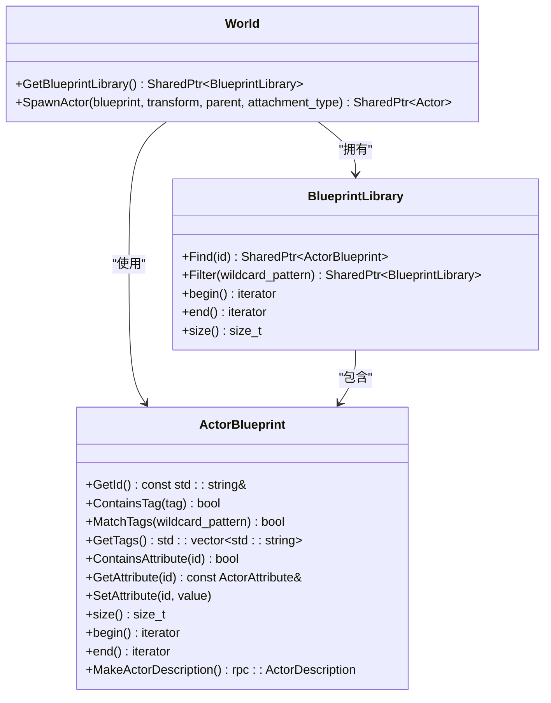

**图源**  
- [ActorBlueprint.h](https://github.com/carla-simulator/carla/blob/ue5-dev/LibCarla/source/carla/client/ActorBlueprint.h)
- [World.h](https://github.com/carla-simulator/carla/blob/ue5-dev/LibCarla/source/carla/client/World.h)

**章节来源**  
- [ActorBlueprint.h](https://github.com/carla-simulator/carla/blob/ue5-dev/LibCarla/source/carla/client/ActorBlueprint.h#L23-L125)
- [World.h](https://github.com/carla-simulator/carla/blob/ue5-dev/LibCarla/source/carla/client/World.h#L72-L73)

### 蓝图配置与生成
蓝图的配置是通过`SetAttribute`方法实现的，该方法允许用户修改蓝图的可修改属性。配置完成后，蓝图可以与变换信息一起传递给`SpawnActor`方法，从而在仿真环境中生成新的参与者实例。

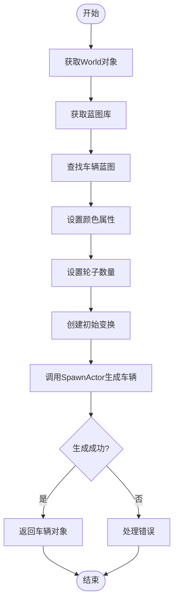

**图源**  
- [ActorBlueprint.h](https://github.com/carla-simulator/carla/blob/ue5-dev/LibCarla/source/carla/client/ActorBlueprint.h)
- [World.h](https://github.com/carla-simulator/carla/blob/ue5-dev/LibCarla/source/carla/client/World.h)

**章节来源**  
- [ActorBlueprint.h](https://github.com/carla-simulator/carla/blob/ue5-dev/LibCarla/source/carla/client/ActorBlueprint.h#L86-L87)
- [World.h](https://github.com/carla-simulator/carla/blob/ue5-dev/LibCarla/source/carla/client/World.h#L114-L127)

## 状态查询与交互
参与者的状态查询和交互是仿真过程中不可或缺的部分，允许用户获取参与者的实时信息并与之进行交互。CARLA提供了多种方法来实现这些功能，包括获取位置、速度、加速度等状态信息。

### 状态查询
状态查询方法允许用户获取参与者的当前状态，这些方法通常不会调用仿真服务器，而是返回上一个仿真周期接收到的数据。这确保了查询操作的高效性，同时保持了数据的时效性。

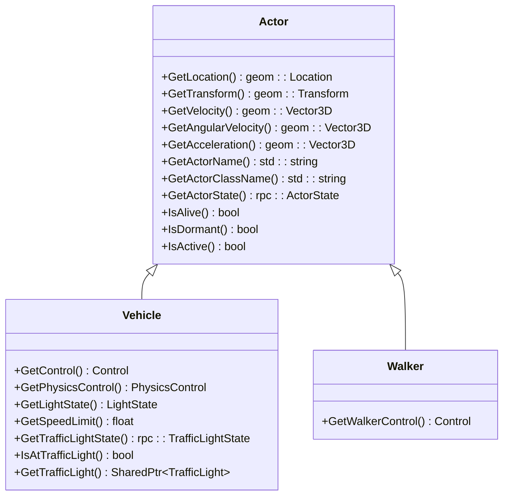

**图源**  
- [Actor.h](https://github.com/carla-simulator/carla/blob/ue5-dev/LibCarla/source/carla/client/Actor.h)
- [Vehicle.h](https://github.com/carla-simulator/carla/blob/ue5-dev/LibCarla/source/carla/client/Vehicle.h)
- [Walker.h](https://github.com/carla-simulator/carla/blob/ue5-dev/LibCarla/source/carla/client/Walker.h)

**章节来源**  
- [Actor.h](https://github.com/carla-simulator/carla/blob/ue5-dev/LibCarla/source/carla/client/Actor.h#L33-L143)
- [Vehicle.h](https://github.com/carla-simulator/carla/blob/ue5-dev/LibCarla/source/carla/client/Vehicle.h#L86-L127)
- [Walker.h](https://github.com/carla-simulator/carla/blob/ue5-dev/LibCarla/source/carla/client/Walker.h#L29-L33)

### 交互机制
参与者之间的交互通过仿真环境的物理引擎和逻辑规则实现。例如，车辆可以与交通信号灯交互，行人可以遵循导航网格移动。这些交互机制确保了仿真环境的真实性和复杂性。

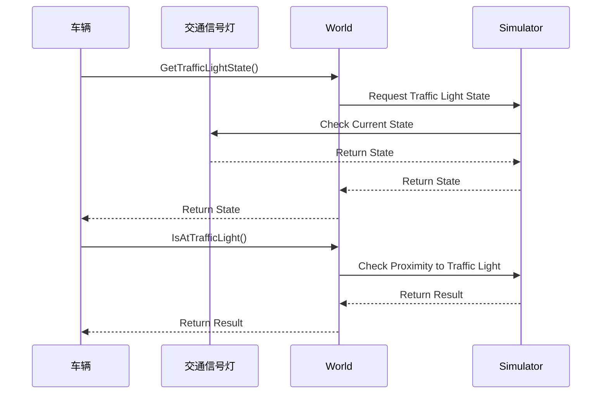

**图源**  
- [Vehicle.h](https://github.com/carla-simulator/carla/blob/ue5-dev/LibCarla/source/carla/client/Vehicle.h)
- [World.h](https://github.com/carla-simulator/carla/blob/ue5-dev/LibCarla/source/carla/client/World.h)

**章节来源**  
- [Vehicle.h](https://github.com/carla-simulator/carla/blob/ue5-dev/LibCarla/source/carla/client/Vehicle.h#L111-L127)
- [World.h](https://github.com/carla-simulator/carla/blob/ue5-dev/LibCarla/source/carla/client/World.h#L192-L196)

## 详细组件分析
本节将深入分析CARLA参与者管理系统中的几个关键组件，包括`Actor`基类、`Vehicle`类和`World`类。通过分析这些组件的实现细节，我们可以更好地理解CARLA仿真系统的内部工作原理。

### Actor基类分析
`Actor`类是所有参与者的基础，定义了通用的接口和功能。它通过多重继承实现了状态管理和性能分析功能，同时提供了丰富的控制方法。

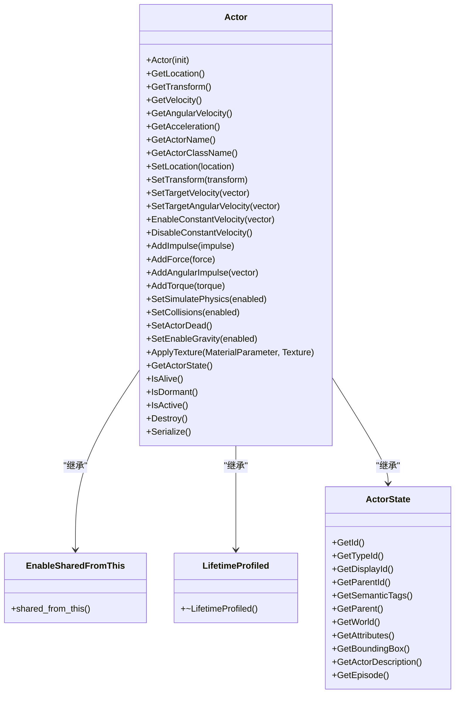

**图源**  
- [Actor.h](https://github.com/carla-simulator/carla/blob/ue5-dev/LibCarla/source/carla/client/Actor.h)
- [detail/ActorState.h](https://github.com/carla-simulator/carla/blob/ue5-dev/LibCarla/source/carla/client/detail/ActorState.h)

**章节来源**  
- [Actor.h](https://github.com/carla-simulator/carla/blob/ue5-dev/LibCarla/source/carla/client/Actor.h#L18-L158)
- [detail/ActorState.h](https://github.com/carla-simulator/carla/blob/ue5-dev/LibCarla/source/carla/client/detail/ActorState.h#L22-L87)

### Vehicle类分析
`Vehicle`类继承自`Actor`类，为车辆参与者提供了特定的功能和控制方法。它支持多种控制模式，包括常规控制和阿克曼控制，并提供了丰富的车辆状态查询接口。

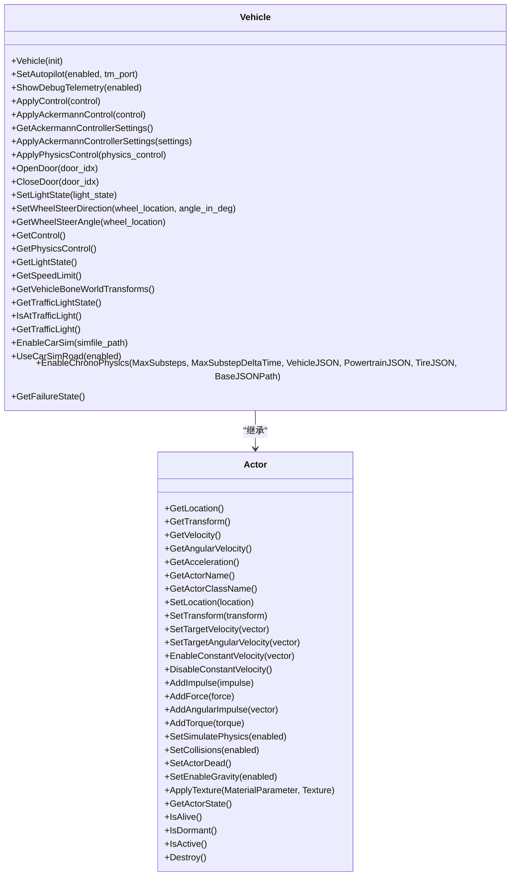

**图源**  
- [Vehicle.h](https://github.com/carla-simulator/carla/blob/ue5-dev/LibCarla/source/carla/client/Vehicle.h)

**章节来源**  
- [Vehicle.h](https://github.com/carla-simulator/carla/blob/ue5-dev/LibCarla/source/carla/client/Vehicle.h#L32-L154)

### World类分析
`World`类是参与者管理的核心，提供了创建、查询和控制参与者的接口。它还负责管理仿真环境的全局设置，如天气、时间步长和交通管理。

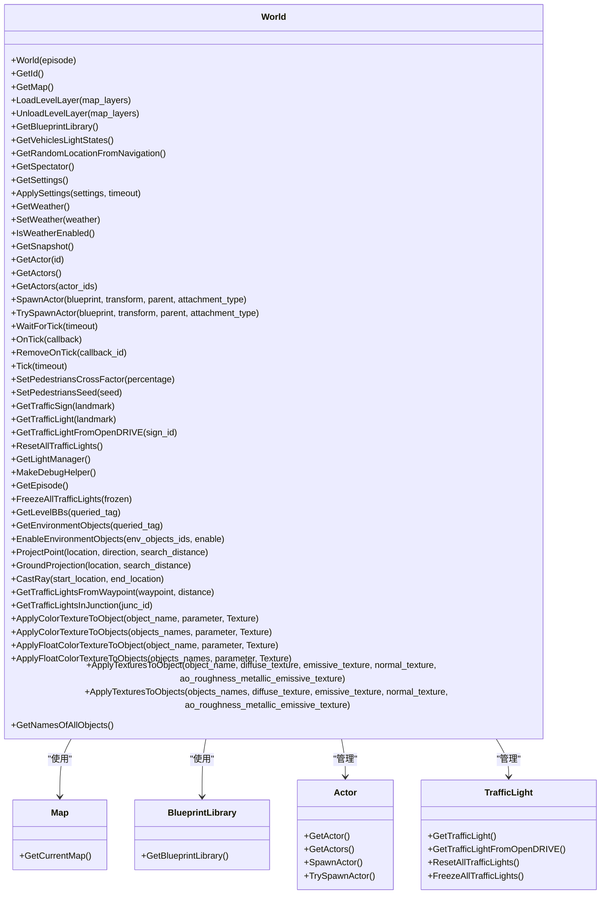

**图源**  
- [World.h](https://github.com/carla-simulator/carla/blob/ue5-dev/LibCarla/source/carla/client/World.h)

**章节来源**  
- [World.h](https://github.com/carla-simulator/carla/blob/ue5-dev/LibCarla/source/carla/client/World.h#L45-L243)
- [World.cpp](https://github.com/carla-simulator/carla/blob/ue5-dev/LibCarla/source/carla/client/World.cpp#L1-L392)

## 依赖关系分析
CARLA参与者管理系统的依赖关系复杂而精细，涉及多个组件之间的交互。通过分析这些依赖关系，我们可以更好地理解系统的整体架构和数据流。

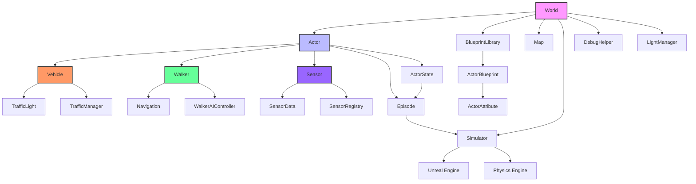

**图源**  
- [World.h](https://github.com/carla-simulator/carla/blob/ue5-dev/LibCarla/source/carla/client/World.h)
- [Actor.h](https://github.com/carla-simulator/carla/blob/ue5-dev/LibCarla/source/carla/client/Actor.h)
- [Vehicle.h](https://github.com/carla-simulator/carla/blob/ue5-dev/LibCarla/source/carla/client/Vehicle.h)
- [Walker.h](https://github.com/carla-simulator/carla/blob/ue5-dev/LibCarla/source/carla/client/Walker.h)
- [Sensor.h](https://github.com/carla-simulator/carla/blob/ue5-dev/LibCarla/source/carla/client/Sensor.h)

**章节来源**  
- [World.h](https://github.com/carla-simulator/carla/blob/ue5-dev/LibCarla/source/carla/client/World.h#L45-L243)
- [Actor.h](https://github.com/carla-simulator/carla/blob/ue5-dev/LibCarla/source/carla/client/Actor.h#L18-L158)
- [Vehicle.h](https://github.com/carla-simulator/carla/blob/ue5-dev/LibCarla/source/carla/client/Vehicle.h#L32-L154)
- [Walker.h](https://github.com/carla-simulator/carla/blob/ue5-dev/LibCarla/source/carla/client/Walker.h#L17-L49)
- [Sensor.h](https://github.com/carla-simulator/carla/blob/ue5-dev/LibCarla/source/carla/client/Sensor.h#L17-L36)