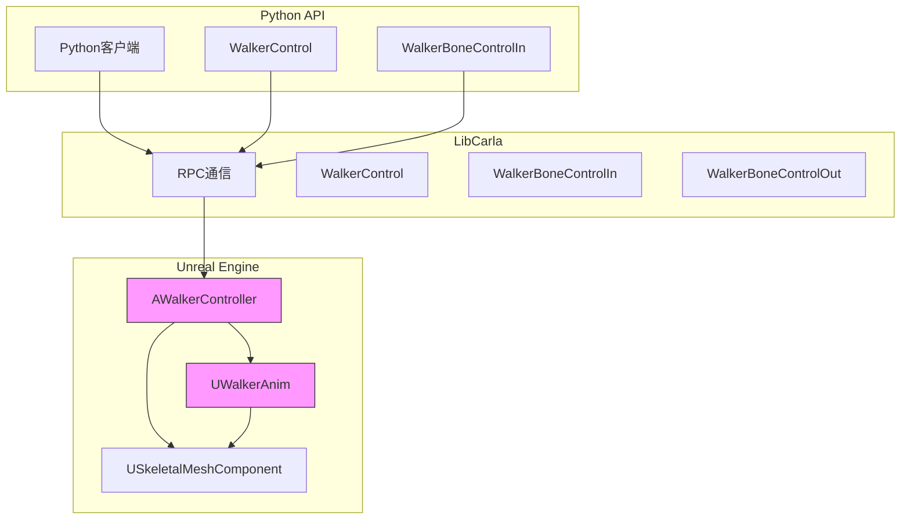
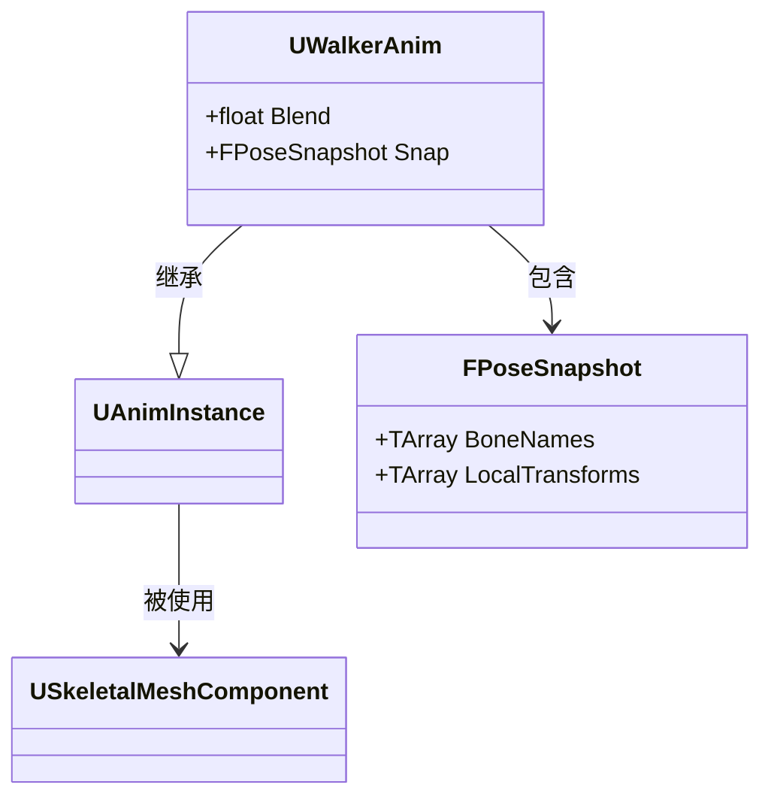
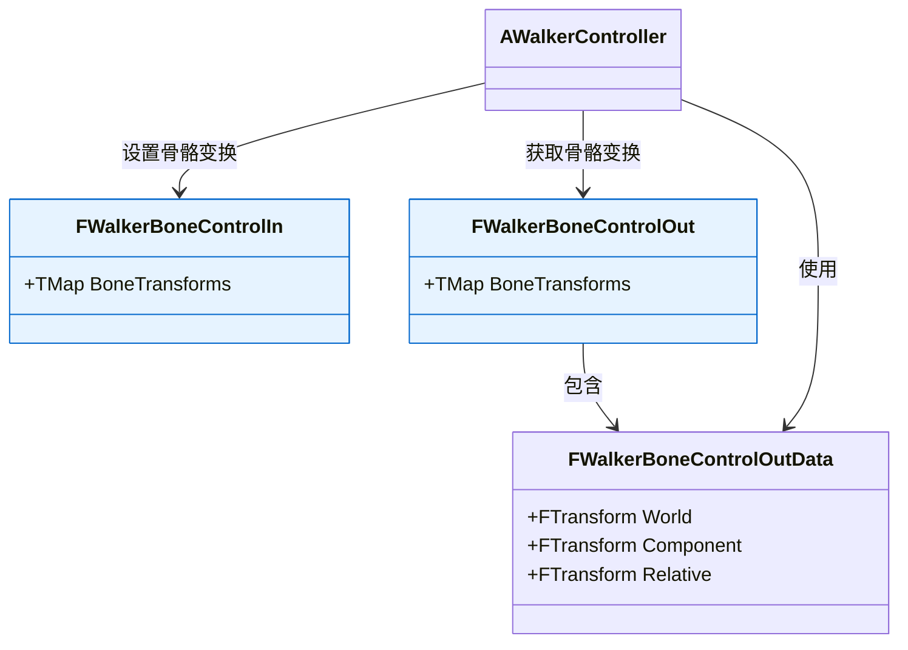
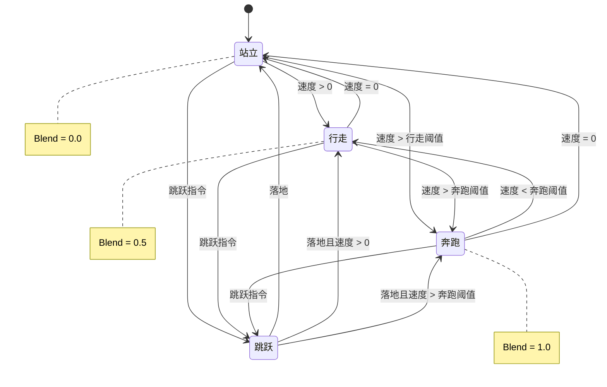
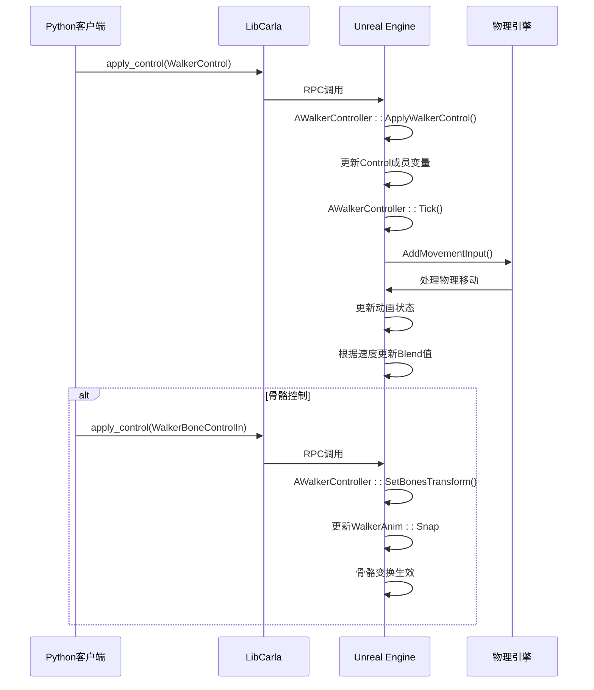
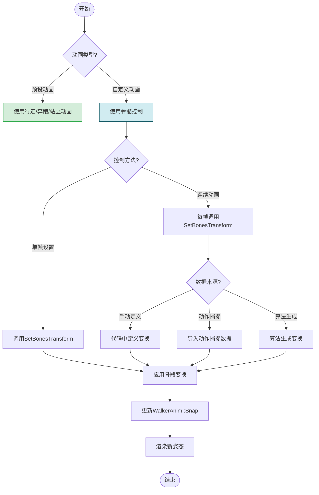
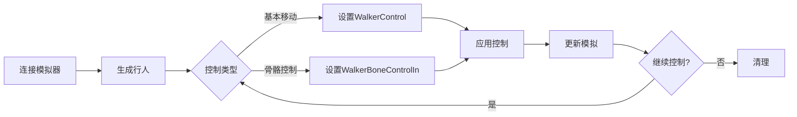
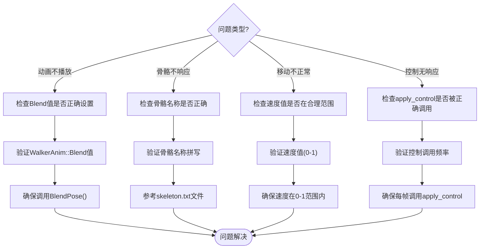

# 行人动画与骨架控制

> **引用文件**
> **本文档中引用的文件**

- [WalkerAnim.h](https://github.com/carla-simulator/carla/blob/ue5-dev/Unreal/CarlaUnreal/Plugins/Carla/Source/Carla/Walker/WalkerAnim.h)
- [WalkerAnim.cpp](https://github.com/carla-simulator/carla/blob/ue5-dev/Unreal/CarlaUnreal/Plugins/Carla/Source/Carla/Walker/WalkerAnim.cpp)
- [WalkerController.h](https://github.com/carla-simulator/carla/blob/ue5-dev/Unreal/CarlaUnreal/Plugins/Carla/Source/Carla/Walker/WalkerController.h)
- [WalkerController.cpp](https://github.com/carla-simulator/carla/blob/ue5-dev/Unreal/CarlaUnreal/Plugins/Carla/Source/Carla/Walker/WalkerController.cpp)
- [WalkerBoneControlIn.h](https://github.com/carla-simulator/carla/blob/ue5-dev/Unreal/CarlaUnreal/Plugins/Carla/Source/Carla/Walker/WalkerBoneControlIn.h)
- [WalkerBoneControlOut.h](https://github.com/carla-simulator/carla/blob/ue5-dev/Unreal/CarlaUnreal/Plugins/Carla/Source/Carla/Walker/WalkerBoneControlOut.h)
- [WalkerBoneControlIn.h](https://github.com/carla-simulator/carla/blob/ue5-dev/LibCarla/source/carla/rpc/WalkerBoneControlIn.h)
- [WalkerBoneControlOut.h](https://github.com/carla-simulator/carla/blob/ue5-dev/LibCarla/source/carla/rpc/WalkerBoneControlOut.h)
- [tuto_G_control_walker_skeletons.md](https://github.com/carla-simulator/carla/blob/ue5-dev/Docs/tuto_G_control_walker_skeletons.md)
- [tuto_G_pedestrian_bones.md](https://github.com/carla-simulator/carla/blob/ue5-dev/Docs/tuto_G_pedestrian_bones.md)

## 目录

1. [简介](#简介)
2. [行人动画系统架构](#行人动画系统架构)
3. [WalkerAnim 类详解](#walkeranim类详解)
4. [骨架控制接口](#骨架控制接口)
5. [动画状态管理](#动画状态管理)
6. [动画与物理模拟协调](#动画与物理模拟协调)
7. [高级动画技术](#高级动画技术)
8. [代码示例与使用方法](#代码示例与使用方法)
9. [故障排除指南](#故障排除指南)
10. [结论](#结论)

## 简介

本文档详细介绍了 CARLA 仿真平台中的行人动画与骨架控制系统。系统基于 Unreal Engine 的动画系统实现，提供了对行人角色的精细控制能力，包括基本动画状态管理和精确的骨骼变换控制。文档将深入解析 WalkerAnim 类如何实现行人的动画播放和过渡，以及如何通过 WalkerBoneControlIn/Out 结构体实现对行人骨骼的精确控制。

## 行人动画系统架构

**图示来源**

- <a href="https://github.com/carla-simulator/carla/blob/ue5-dev/Unreal/CarlaUnreal/Plugins/Carla/Source/Carla/Walker/WalkerController.h#L24-L68" target="_blank">WalkerController.h</a>
- <a href="https://github.com/carla-simulator/carla/blob/ue5-dev/Unreal/CarlaUnreal/Plugins/Carla/Source/Carla/Walker/WalkerAnim.h#L15-L27" target="_blank">WalkerAnim.h</a>
- <a href="https://github.com/carla-simulator/carla/blob/ue5-dev/Unreal/CarlaUnreal/Plugins/Carla/Source/Carla/Walker/WalkerBoneControlIn.h#L11-L18" target="_blank">WalkerBoneControlIn.h</a>
- <a href="https://github.com/carla-simulator/carla/blob/ue5-dev/Unreal/CarlaUnreal/Plugins/Carla/Source/Carla/Walker/WalkerBoneControlOut.h#L11-L27" target="_blank">WalkerBoneControlOut.h</a>

**本节来源**

- <a href="https://github.com/carla-simulator/carla/blob/ue5-dev/Unreal/CarlaUnreal/Plugins/Carla/Source/Carla/Walker/WalkerController.h#L1-L69" target="_blank">WalkerController.h</a>
- <a href="https://github.com/carla-simulator/carla/blob/ue5-dev/Unreal/CarlaUnreal/Plugins/Carla/Source/Carla/Walker/WalkerAnim.h#L1-L29" target="_blank">WalkerAnim.h</a>

## WalkerAnim 类详解

**图示来源**

- <a href="https://github.com/carla-simulator/carla/blob/ue5-dev/Unreal/CarlaUnreal/Plugins/Carla/Source/Carla/Walker/WalkerAnim.h#L15-L27" target="_blank">WalkerAnim.h</a>
- <a href="https://github.com/carla-simulator/carla/blob/ue5-dev/Unreal/CarlaUnreal/Plugins/Carla/Source/Carla/Walker/WalkerController.cpp#L72-L73" target="_blank">WalkerController.cpp</a>

**本节来源**

- <a href="https://github.com/carla-simulator/carla/blob/ue5-dev/Unreal/CarlaUnreal/Plugins/Carla/Source/Carla/Walker/WalkerAnim.h#L1-L29" target="_blank">WalkerAnim.h</a>
- <a href="https://github.com/carla-simulator/carla/blob/ue5-dev/Unreal/CarlaUnreal/Plugins/Carla/Source/Carla/Walker/WalkerAnim.cpp#L1-L8" target="_blank">WalkerAnim.cpp</a>

## 骨架控制接口

**图示来源**

- <a href="https://github.com/carla-simulator/carla/blob/ue5-dev/Unreal/CarlaUnreal/Plugins/Carla/Source/Carla/Walker/WalkerBoneControlIn.h#L11-L18" target="_blank">WalkerBoneControlIn.h</a>
- <a href="https://github.com/carla-simulator/carla/blob/ue5-dev/Unreal/CarlaUnreal/Plugins/Carla/Source/Carla/Walker/WalkerBoneControlOut.h#L11-L27" target="_blank">WalkerBoneControlOut.h</a>
- <a href="https://github.com/carla-simulator/carla/blob/ue5-dev/Unreal/CarlaUnreal/Plugins/Carla/Source/Carla/Walker/WalkerController.h#L54-L57" target="_blank">WalkerController.h</a>

**本节来源**

- <a href="https://github.com/carla-simulator/carla/blob/ue5-dev/Unreal/CarlaUnreal/Plugins/Carla/Source/Carla/Walker/WalkerBoneControlIn.h#L1-L20" target="_blank">WalkerBoneControlIn.h</a>
- <a href="https://github.com/carla-simulator/carla/blob/ue5-dev/Unreal/CarlaUnreal/Plugins/Carla/Source/Carla/Walker/WalkerBoneControlOut.h#L1-L29" target="_blank">WalkerBoneControlOut.h</a>
- <a href="https://github.com/carla-simulator/carla/blob/ue5-dev/Unreal/CarlaUnreal/Plugins/Carla/Source/Carla/Walker/WalkerController.cpp#L55-L87" target="_blank">WalkerController.cpp</a>

## 动画状态管理

**图示来源**

- <a href="https://github.com/carla-simulator/carla/blob/ue5-dev/Unreal/CarlaUnreal/Plugins/Carla/Source/Carla/Walker/WalkerController.h#L60" target="_blank">WalkerController.h</a>
- <a href="https://github.com/carla-simulator/carla/blob/ue5-dev/Unreal/CarlaUnreal/Plugins/Carla/Source/Carla/Walker/WalkerAnim.h#L24" target="_blank">WalkerAnim.h</a>
- <a href="https://github.com/carla-simulator/carla/blob/ue5-dev/Unreal/CarlaUnreal/Plugins/Carla/Source/Carla/Walker/WalkerController.cpp#L131-L149" target="_blank">WalkerController.cpp</a>

**本节来源**

- <a href="https://github.com/carla-simulator/carla/blob/ue5-dev/Unreal/CarlaUnreal/Plugins/Carla/Source/Carla/Walker/WalkerController.cpp#L131-L149" target="_blank">WalkerController.cpp</a>
- <a href="https://github.com/carla-simulator/carla/blob/ue5-dev/Unreal/CarlaUnreal/Plugins/Carla/Source/Carla/Walker/WalkerAnim.h#L24" target="_blank">WalkerAnim.h</a>

## 动画与物理模拟协调

**图示来源**

- <a href="https://github.com/carla-simulator/carla/blob/ue5-dev/Unreal/CarlaUnreal/Plugins/Carla/Source/Carla/Walker/WalkerController.cpp#L50-L53" target="_blank">WalkerController.cpp</a>
- <a href="https://github.com/carla-simulator/carla/blob/ue5-dev/Unreal/CarlaUnreal/Plugins/Carla/Source/Carla/Walker/WalkerController.cpp#L179-L184" target="_blank">WalkerController.cpp</a>
- <a href="https://github.com/carla-simulator/carla/blob/ue5-dev/Unreal/CarlaUnreal/Plugins/Carla/Source/Carla/Walker/WalkerController.cpp#L90-L129" target="_blank">WalkerController.cpp</a>

**本节来源**

- <a href="https://github.com/carla-simulator/carla/blob/ue5-dev/Unreal/CarlaUnreal/Plugins/Carla/Source/Carla/Walker/WalkerController.cpp#L50-L186" target="_blank">WalkerController.cpp</a>
- <a href="https://github.com/carla-simulator/carla/blob/ue5-dev/Unreal/CarlaUnreal/Plugins/Carla/Source/Carla/Walker/WalkerAnim.h#L24" target="_blank">WalkerAnim.h</a>

## 高级动画技术

**图示来源**

- <a href="https://github.com/carla-simulator/carla/blob/ue5-dev/Unreal/CarlaUnreal/Plugins/Carla/Source/Carla/Walker/WalkerController.cpp#L90-L129" target="_blank">WalkerController.cpp</a>
- <a href="https://github.com/carla-simulator/carla/blob/ue5-dev/Docs/tuto_G_control_walker_skeletons.md#L129-L137" target="_blank">tuto_G_control_walker_skeletons.md</a>
- <a href="https://github.com/carla-simulator/carla/blob/ue5-dev/Unreal/CarlaUnreal/Plugins/Carla/Source/Carla/Walker/WalkerAnim.h#L27" target="_blank">WalkerAnim.h</a>

**本节来源**

- <a href="https://github.com/carla-simulator/carla/blob/ue5-dev/Docs/tuto_G_control_walker_skeletons.md#L1-L149" target="_blank">tuto_G_control_walker_skeletons.md</a>
- <a href="https://github.com/carla-simulator/carla/blob/ue5-dev/Unreal/CarlaUnreal/Plugins/Carla/Source/Carla/Walker/WalkerController.cpp#L90-L129" target="_blank">WalkerController.cpp</a>

## 代码示例与使用方法

**图示来源**

- <a href="https://github.com/carla-simulator/carla/blob/ue5-dev/Docs/tuto_G_control_walker_skeletons.md#L10-L12" target="_blank">tuto_G_control_walker_skeletons.md</a>
- <a href="https://github.com/carla-simulator/carla/blob/ue5-dev/Unreal/CarlaUnreal/Plugins/Carla/Source/Carla/Walker/WalkerController.h#L45" target="_blank">WalkerController.h</a>
- <a href="https://github.com/carla-simulator/carla/blob/ue5-dev/Unreal/CarlaUnreal/Plugins/Carla/Source/Carla/Walker/WalkerController.h#L57" target="_blank">WalkerController.h</a>

**本节来源**

- <a href="https://github.com/carla-simulator/carla/blob/ue5-dev/Docs/tuto_G_control_walker_skeletons.md#L1-L149" target="_blank">tuto_G_control_walker_skeletons.md</a>
- <a href="https://github.com/carla-simulator/carla/blob/ue5-dev/Docs/tuto_G_pedestrian_bones.md#L148-L152" target="_blank">tuto_G_pedestrian_bones.md</a>

## 故障排除指南

**图示来源**

- <a href="https://github.com/carla-simulator/carla/blob/ue5-dev/Unreal/CarlaUnreal/Plugins/Carla/Source/Carla/Walker/WalkerController.cpp#L131-L149" target="_blank">WalkerController.cpp</a>
- <a href="https://github.com/carla-simulator/carla/blob/ue5-dev/Unreal/CarlaUnreal/Plugins/Carla/Source/Carla/Walker/WalkerController.cpp#L90-L129" target="_blank">WalkerController.cpp</a>
- <a href="https://github.com/carla-simulator/carla/blob/ue5-dev/Docs/tuto_G_pedestrian_bones.md#L150" target="_blank">tuto_G_pedestrian_bones.md</a>

**本节来源**

- <a href="https://github.com/carla-simulator/carla/blob/ue5-dev/Docs/tuto_G_control_walker_skeletons.md#L1-L149" target="_blank">tuto_G_control_walker_skeletons.md</a>
- <a href="https://github.com/carla-simulator/carla/blob/ue5-dev/Docs/tuto_G_pedestrian_bones.md#L1-L152" target="_blank">tuto_G_pedestrian_bones.md</a>

## 结论

CARLA 的行人动画与骨架控制系统提供了一套完整的解决方案，用于创建高保真的行人行为模拟。通过 WalkerAnim 类和相关的控制接口，用户可以精确控制行人的动画状态和骨骼姿态。系统设计充分考虑了动画与物理模拟的协调，确保了行人行为的自然性和真实性。对于初学者，系统提供了简单的动画状态管理；对于高级用户，则支持复杂的骨骼控制和自定义动画，满足不同层次的需求。
