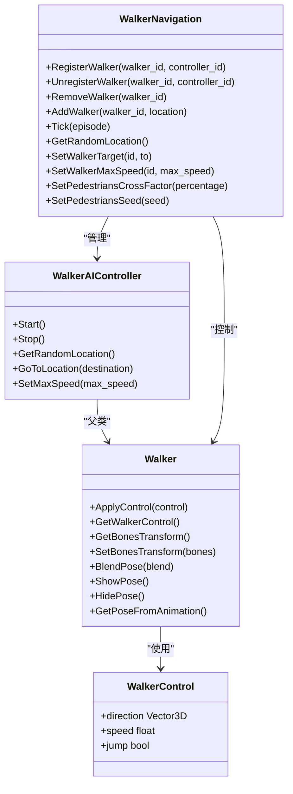
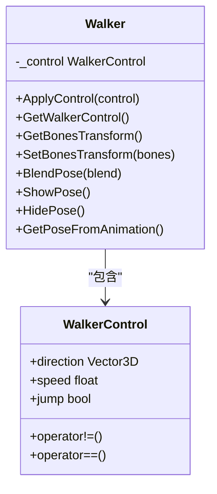
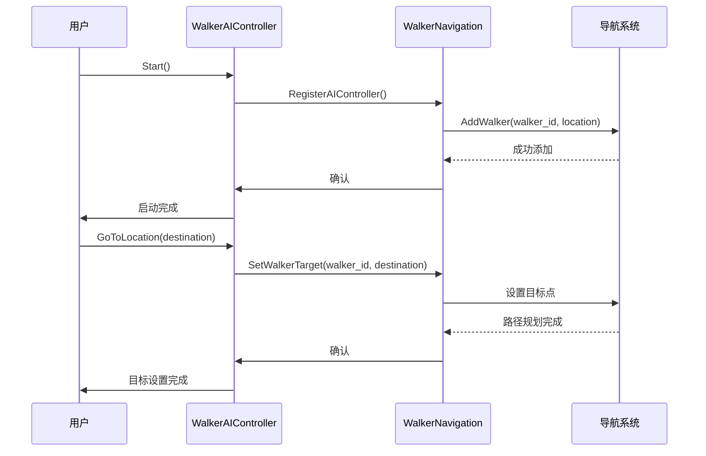
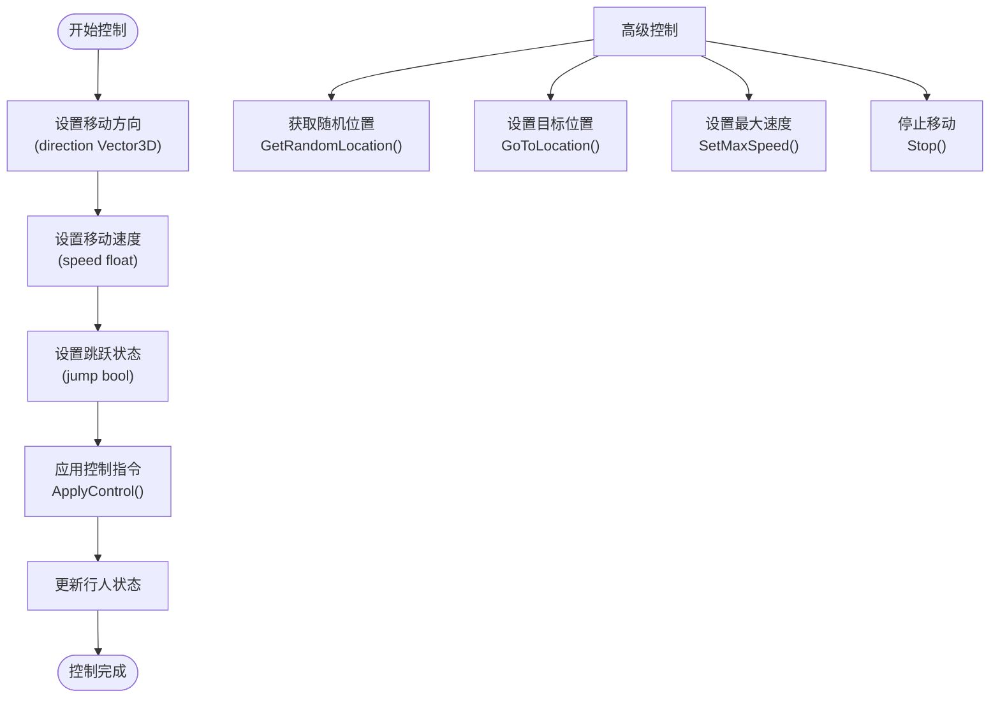
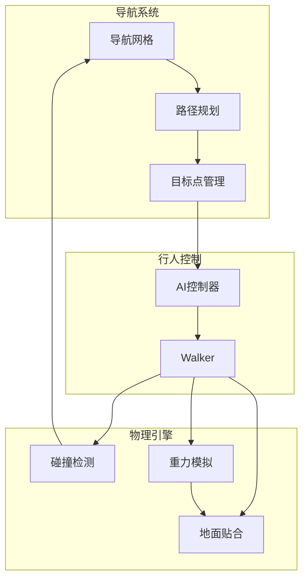
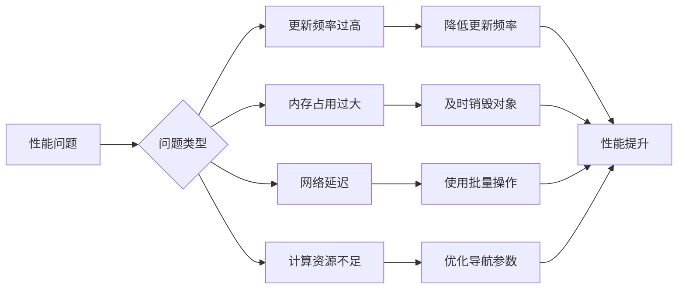

# 行人基础控制


**本文档中引用的文件**  
- [Walker.h](https://github.com/carla-simulator/carla/blob/ue5-dev/LibCarla/source/carla/client/Walker.h)
- [Walker.cpp](https://github.com/carla-simulator/carla/blob/ue5-dev/LibCarla/source/carla/client/Walker.cpp)
- [WalkerAIController.h](https://github.com/carla-simulator/carla/blob/ue5-dev/LibCarla/source/carla/client/WalkerAIController.h)
- [WalkerAIController.cpp](https://github.com/carla-simulator/carla/blob/ue5-dev/LibCarla/source/carla/client/WalkerAIController.cpp)
- [WalkerNavigation.h](https://github.com/carla-simulator/carla/blob/ue5-dev/LibCarla/source/carla/client/detail/WalkerNavigation.h)
- [WalkerNavigation.cpp](https://github.com/carla-simulator/carla/blob/ue5-dev/LibCarla/source/carla/client/detail/WalkerNavigation.cpp)
- [WalkerControl.h](https://github.com/carla-simulator/carla/blob/ue5-dev/LibCarla/source/carla/rpc/WalkerControl.h)
- [WalkerBoneControlIn.h](https://github.com/carla-simulator/carla/blob/ue5-dev/LibCarla/source/carla/rpc/WalkerBoneControlIn.h)
- [WalkerBoneControlOut.h](https://github.com/carla-simulator/carla/blob/ue5-dev/LibCarla/source/carla/rpc/WalkerBoneControlOut.h)
- [python_api.md](https://github.com/carla-simulator/carla/blob/ue5-dev/Docs/python_api.md)


## 目录
1. [简介](#简介)
2. [核心组件分析](#核心组件分析)
3. [Walker类详解](#walker类详解)
4. [WalkerAIController类详解](#walkercontroller类详解)
5. [行人控制接口](#行人控制接口)
6. [Python API使用示例](#python-api使用示例)
7. [行人与物理引擎交互](#行人与物理引擎交互)
8. [性能优化建议](#性能优化建议)
9. [结论](#结论)

## 简介
CARLA模拟器提供了完整的行人控制功能，允许用户创建、控制和管理虚拟行人。本文档详细介绍了行人基础控制的核心机制和接口，重点讲解Walker类作为可移动行人实体的实现，以及WalkerAIController如何处理行人运动指令。文档涵盖了行人生成、位置设置、速度控制和基本移动命令，并深入探讨了行人与物理引擎的交互机制。

## 核心组件分析

CARLA的行人控制系统由多个核心组件构成，主要包括Walker类、WalkerAIController类和WalkerNavigation系统。这些组件协同工作，实现了行人的生成、移动和控制功能。



**图源**
- [Walker.h](https://github.com/carla-simulator/carla/blob/ue5-dev/LibCarla/source/carla/client/Walker.h)
- [WalkerAIController.h](https://github.com/carla-simulator/carla/blob/ue5-dev/LibCarla/source/carla/client/WalkerAIController.h)
- [WalkerNavigation.h](https://github.com/carla-simulator/carla/blob/ue5-dev/LibCarla/source/carla/client/detail/WalkerNavigation.h)
- [WalkerControl.h](https://github.com/carla-simulator/carla/blob/ue5-dev/LibCarla/source/carla/rpc/WalkerControl.h)

**本节来源**
- [Walker.h](https://github.com/carla-simulator/carla/blob/ue5-dev/LibCarla/source/carla/client/Walker.h#L17-L45)
- [WalkerAIController.h](https://github.com/carla-simulator/carla/blob/ue5-dev/LibCarla/source/carla/client/WalkerAIController.h#L17-L31)
- [WalkerNavigation.h](https://github.com/carla-simulator/carla/blob/ue5-dev/LibCarla/source/carla/client/detail/WalkerNavigation.h#L25-L110)

## Walker类详解

Walker类是CARLA中表示可移动行人实体的核心实现，继承自Actor类。它提供了控制行人移动的基本接口，包括应用控制指令、获取当前控制状态和骨骼变换等功能。

Walker类的主要功能通过WalkerControl结构体实现，该结构体包含三个关键属性：direction（方向向量）、speed（速度）和jump（跳跃状态）。这些属性共同定义了行人的运动状态。



**图源**
- [Walker.h](https://github.com/carla-simulator/carla/blob/ue5-dev/LibCarla/source/carla/client/Walker.h#L17-L45)
- [WalkerControl.h](https://github.com/carla-simulator/carla/blob/ue5-dev/LibCarla/source/carla/rpc/WalkerControl.h#L20-L64)

**本节来源**
- [Walker.h](https://github.com/carla-simulator/carla/blob/ue5-dev/LibCarla/source/carla/client/Walker.h#L17-L45)
- [Walker.cpp](https://github.com/carla-simulator/carla/blob/ue5-dev/LibCarla/source/carla/client/Walker.cpp#L14-L39)
- [WalkerControl.h](https://github.com/carla-simulator/carla/blob/ue5-dev/LibCarla/source/carla/rpc/WalkerControl.h#L20-L64)

## WalkerController类详解

WalkerAIController类负责处理行人的高级运动指令，如行走、奔跑和停止等。它通过与WalkerNavigation系统交互来实现路径规划和移动控制。

当调用Start()方法时，WalkerAIController会将行人注册到导航系统中，并在Recast & Detour导航网格中添加行人。同时，系统会禁用行人物体的物理模拟和碰撞检测，以确保导航系统的精确控制。



**图源**
- [WalkerAIController.h](https://github.com/carla-simulator/carla/blob/ue5-dev/LibCarla/source/carla/client/WalkerAIController.h#L17-L31)
- [WalkerAIController.cpp](https://github.com/carla-simulator/carla/blob/ue5-dev/LibCarla/source/carla/client/WalkerAIController.cpp#L18-L67)
- [WalkerNavigation.h](https://github.com/carla-simulator/carla/blob/ue5-dev/LibCarla/source/carla/client/detail/WalkerNavigation.h#L73-L75)

**本节来源**
- [WalkerAIController.h](https://github.com/carla-simulator/carla/blob/ue5-dev/LibCarla/source/carla/client/WalkerAIController.h#L17-L31)
- [WalkerAIController.cpp](https://github.com/carla-simulator/carla/blob/ue5-dev/LibCarla/source/carla/client/WalkerAIController.cpp#L18-L81)
- [WalkerNavigation.h](https://github.com/carla-simulator/carla/blob/ue5-dev/LibCarla/source/carla/client/detail/WalkerNavigation.h#L73-L75)

## 行人控制接口

CARLA提供了丰富的行人控制接口，允许用户精确控制行人的移动行为。主要控制接口包括：

- **基本移动控制**：通过WalkerControl结构体控制行人的方向、速度和跳跃状态
- **路径导航控制**：通过WalkerAIController实现行人的自动导航和路径跟踪
- **骨骼动画控制**：通过WalkerBoneControlIn和WalkerBoneControlOut实现行人的骨骼变换控制

行人控制的核心是WalkerControl结构体，它包含三个主要属性：
- **direction**：三维方向向量，定义行人的移动方向
- **speed**：浮点数，定义行人的移动速度（单位：m/s）
- **jump**：布尔值，定义行人是否执行跳跃动作



**图源**
- [WalkerControl.h](https://github.com/carla-simulator/carla/blob/ue5-dev/LibCarla/source/carla/rpc/WalkerControl.h#L20-L64)
- [WalkerAIController.h](https://github.com/carla-simulator/carla/blob/ue5-dev/LibCarla/source/carla/client/WalkerAIController.h#L22-L30)
- [Walker.h](https://github.com/carla-simulator/carla/blob/ue5-dev/LibCarla/source/carla/client/Walker.h#L27-L30)

**本节来源**
- [WalkerControl.h](https://github.com/carla-simulator/carla/blob/ue5-dev/LibCarla/source/carla/rpc/WalkerControl.h#L20-L64)
- [WalkerAIController.h](https://github.com/carla-simulator/carla/blob/ue5-dev/LibCarla/source/carla/client/WalkerAIController.h#L22-L30)
- [Walker.h](https://github.com/carla-simulator/carla/blob/ue5-dev/LibCarla/source/carla/client/Walker.h#L27-L30)

## Python API使用示例

CARLA的Python API提供了创建和控制行人的便捷接口。以下是一些常用的代码示例：

```python
# 创建客户端并获取世界对象
client = carla.Client('localhost', 2000)
world = client.get_world()

# 获取行人蓝图
blueprint_library = world.get_blueprint_library()
walker_bp = blueprint_library.find('walker.pedestrian.0001')

# 设置行人属性
if walker_bp.has_attribute('is_invincible'):
    walker_bp.set_attribute('is_invincible', 'false')

# 生成行人
spawn_point = carla.Transform(carla.Location(x=0.0, y=0.0, z=0.0))
walker = world.spawn_actor(walker_bp, spawn_point)

# 创建行人控制器
controller_bp = blueprint_library.find('controller.ai.walker')
controller = world.spawn_actor(controller_bp, carla.Transform(), walker)

# 启动控制器
controller.start()

# 设置行人移动目标
destination = carla.Location(x=10.0, y=10.0, z=0.0)
controller.go_to_location(destination)

# 设置行人最大速度
controller.set_max_speed(1.5)  # m/s

# 应用自定义控制
control = carla.WalkerControl()
control.direction = carla.Vector3D(x=1.0, y=0.0, z=0.0)
control.speed = 1.2
control.jump = False
walker.apply_control(control)
```

**本节来源**
- [python_api.md](https://github.com/carla-simulator/carla/blob/ue5-dev/Docs/python_api.md#carla.Actor)
- [python_api.md](https://github.com/carla-simulator/carla/blob/ue5-dev/Docs/python_api.md#carla.BlueprintLibrary)
- [python_api.md](https://github.com/carla-simulator/carla/blob/ue5-dev/Docs/python_api.md#carla.World)

## 行人与物理引擎交互

行人在CARLA中的移动涉及与物理引擎的复杂交互。系统通过导航网格（Navigation Mesh）和物理引擎的协同工作来实现逼真的行人行为。

当行人被创建时，系统会将其添加到导航网格中，使用Recast & Detour算法进行路径规划。同时，系统会管理行人物体的物理属性，包括碰撞检测和地面贴合。



**图源**
- [WalkerNavigation.cpp](https://github.com/carla-simulator/carla/blob/ue5-dev/LibCarla/source/carla/client/detail/WalkerNavigation.cpp#L24-L31)
- [WalkerAIController.cpp](https://github.com/carla-simulator/carla/blob/ue5-dev/LibCarla/source/carla/client/WalkerAIController.cpp#L27-L29)
- [WalkerNavigation.cpp](https://github.com/carla-simulator/carla/blob/ue5-dev/LibCarla/source/carla/client/detail/WalkerNavigation.cpp#L49-L62)

**本节来源**
- [WalkerNavigation.cpp](https://github.com/carla-simulator/carla/blob/ue5-dev/LibCarla/source/carla/client/detail/WalkerNavigation.cpp#L24-L31)
- [WalkerAIController.cpp](https://github.com/carla-simulator/carla/blob/ue5-dev/LibCarla/source/carla/client/WalkerAIController.cpp#L27-L29)
- [WalkerNavigation.cpp](https://github.com/carla-simulator/carla/blob/ue5-dev/LibCarla/source/carla/client/detail/WalkerNavigation.cpp#L49-L62)

## 性能优化建议

为了确保行人控制系统的高效运行，以下是一些性能优化建议：

1. **批量操作**：使用apply_batch或apply_batch_sync方法批量处理多个行人的控制指令，减少网络通信开销
2. **合理设置更新频率**：根据场景需求调整行人的更新频率，避免不必要的计算
3. **优化导航网格**：合理设置行人穿越道路的概率因子，使用SetPedestriansCrossFactor方法
4. **内存管理**：及时销毁不再需要的行人和控制器，释放系统资源
5. **种子设置**：为行人系统设置随机种子，确保结果的可重现性



**图源**
- [WalkerNavigation.h](https://github.com/carla-simulator/carla/blob/ue5-dev/LibCarla/source/carla/client/detail/WalkerNavigation.h#L82-L89)
- [Client.h](https://github.com/carla-simulator/carla/blob/ue5-dev/LibCarla/source/carla/client/detail/Client.h#L465-L474)
- [WalkerNavigation.cpp](https://github.com/carla-simulator/carla/blob/ue5-dev/LibCarla/source/carla/client/detail/WalkerNavigation.cpp#L62-L63)

**本节来源**
- [WalkerNavigation.h](https://github.com/carla-simulator/carla/blob/ue5-dev/LibCarla/source/carla/client/detail/WalkerNavigation.h#L82-L89)
- [Client.h](https://github.com/carla-simulator/carla/blob/ue5-dev/LibCarla/source/carla/client/detail/Client.h#L465-L474)

## 结论
CARLA的行人基础控制系统提供了完整的行人生成、控制和管理功能。通过Walker类和WalkerAIController类的协同工作，用户可以精确控制行人的移动行为，包括基本的行走、奔跑和停止等动作。系统通过导航网格和物理引擎的集成，实现了逼真的行人行为模拟。对于初学者，建议从基本的行人生成和控制开始；对于高级用户，可以深入研究导航参数配置和性能优化技巧，以满足复杂场景的需求。