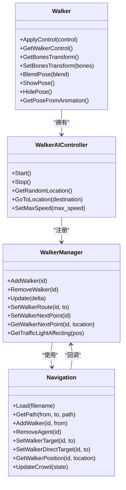
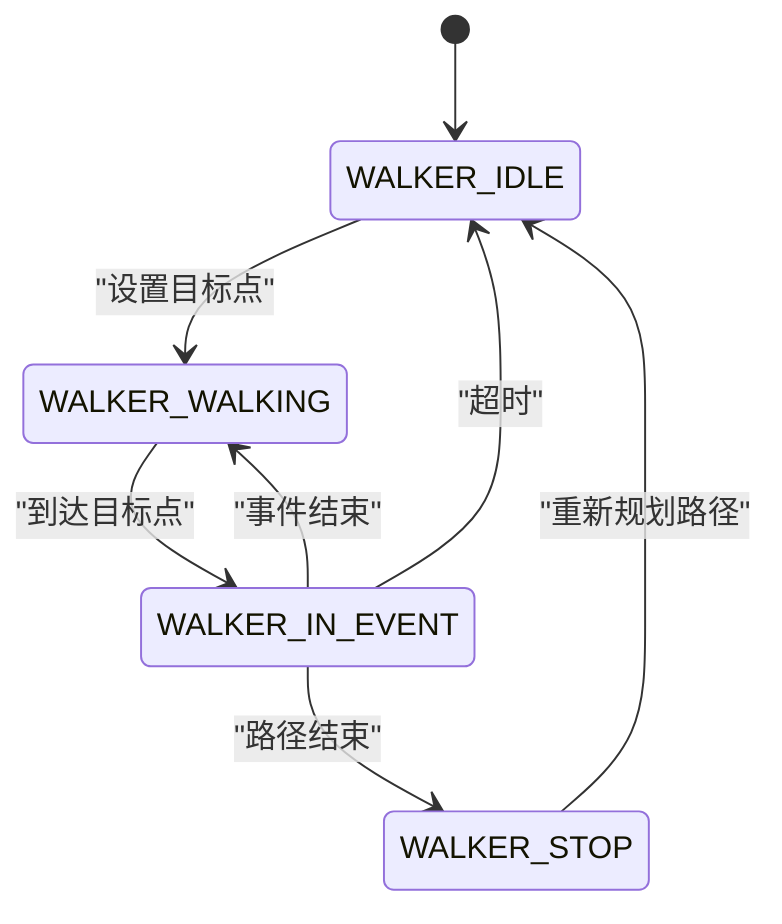
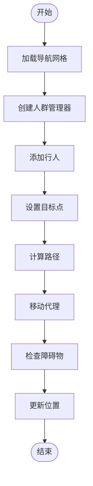
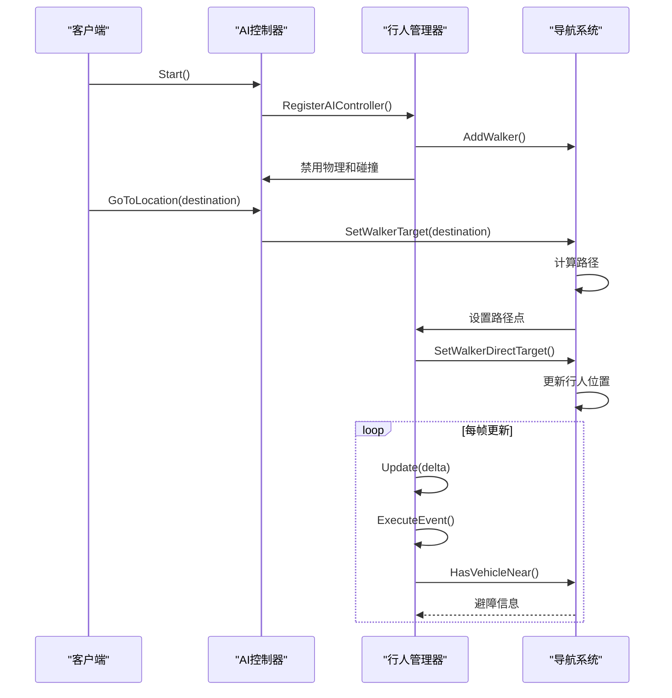
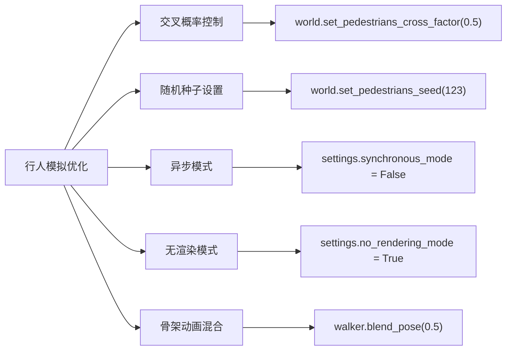

# 行人模拟


**本文档中引用的文件**  
- [Walker.h](https://github.com/carla-simulator/carla/blob/ue5-dev/LibCarla/source/carla/client/Walker.h)
- [Walker.cpp](https://github.com/carla-simulator/carla/blob/ue5-dev/LibCarla/source/carla/client/Walker.cpp)
- [WalkerAIController.h](https://github.com/carla-simulator/carla/blob/ue5-dev/LibCarla/source/carla/client/WalkerAIController.h)
- [WalkerAIController.cpp](https://github.com/carla-simulator/carla/blob/ue5-dev/LibCarla/source/carla/client/WalkerAIController.cpp)
- [WalkerManager.h](https://github.com/carla-simulator/carla/blob/ue5-dev/LibCarla/source/carla/nav/WalkerManager.h)
- [WalkerManager.cpp](https://github.com/carla-simulator/carla/blob/ue5-dev/LibCarla/source/carla/nav/WalkerManager.cpp)
- [WalkerEvent.h](https://github.com/carla-simulator/carla/blob/ue5-dev/LibCarla/source/carla/nav/WalkerEvent.h)
- [WalkerEvent.cpp](https://github.com/carla-simulator/carla/blob/ue5-dev/LibCarla/source/carla/nav/WalkerEvent.cpp)
- [Navigation.h](https://github.com/carla-simulator/carla/blob/ue5-dev/LibCarla/source/carla/nav/Navigation.h)
- [Navigation.cpp](https://github.com/carla-simulator/carla/blob/ue5-dev/LibCarla/source/carla/nav/Navigation.cpp)
- [WalkerController.cpp](https://github.com/carla-simulator/carla/blob/ue5-dev/Unreal/CarlaUnreal/Plugins/Carla/Source/Carla/Walker/WalkerController.cpp)
- [generate_traffic.py](https://github.com/carla-simulator/carla/blob/ue5-dev/PythonAPI/examples/generate_traffic.py)
- [draw_skeleton.py](https://github.com/carla-simulator/carla/blob/ue5-dev/PythonAPI/examples/draw_skeleton.py)
- [catalogue_pedestrians.md](https://github.com/carla-simulator/carla/blob/ue5-dev/Docs/catalogue_pedestrians.md)
- [tuto_G_control_walker_skeletons.md](https://github.com/carla-simulator/carla/blob/ue5-dev/Docs/tuto_G_control_walker_skeletons.md)
- [tuto_G_pedestrian_bones.md](https://github.com/carla-simulator/carla/blob/ue5-dev/Docs/tuto_G_pedestrian_bones.md)


## 目录
1. [简介](#简介)
2. [核心组件分析](#核心组件分析)
3. [行人行为建模](#行人行为建模)
4. [行人运动控制机制](#行人运动控制机制)
5. [行人AI控制器工作原理](#行人ai控制器工作原理)
6. [行人与环境交互](#行人与环境交互)
7. [代码示例与使用方法](#代码示例与使用方法)
8. [高级功能与优化技术](#高级功能与优化技术)
9. [结论](#结论)

## 简介
CARLA模拟器提供了一套完整的行人模拟系统，用于创建逼真的行人行为和运动。该系统基于Recast & Detour导航库，实现了复杂的路径规划、障碍物避让和行为决策功能。行人实体通过Walker类实现，支持行走、奔跑、停止等基本动作的控制。系统还提供了AI控制器来管理行人的自主行为，包括路径规划、交通信号遵守和与车辆的互动。本文档将详细介绍行人模拟系统的各个组成部分，从基础的行人控制到高级的行为树和动画状态机。

## 核心组件分析

CARLA行人模拟系统由多个核心组件构成，这些组件协同工作以实现逼真的行人行为。主要组件包括Walker类、WalkerAIController类、WalkerManager类和Navigation类。Walker类作为可移动的行人实体，负责处理行人的基本属性和控制。WalkerAIController类作为AI控制器，管理行人的自主行为。WalkerManager类负责管理所有行人的路径规划和状态转换。Navigation类则基于Recast & Detour库，提供底层的导航和路径查找功能。



**图源**
- [Walker.h](https://github.com/carla-simulator/carla/blob/ue5-dev/LibCarla/source/carla/client/Walker.h)
- [WalkerAIController.h](https://github.com/carla-simulator/carla/blob/ue5-dev/LibCarla/source/carla/client/WalkerAIController.h)
- [WalkerManager.h](https://github.com/carla-simulator/carla/blob/ue5-dev/LibCarla/source/carla/nav/WalkerManager.h)
- [Navigation.h](https://github.com/carla-simulator/carla/blob/ue5-dev/LibCarla/source/carla/nav/Navigation.h)

**节源**
- [Walker.h](https://github.com/carla-simulator/carla/blob/ue5-dev/LibCarla/source/carla/client/Walker.h)
- [WalkerAIController.h](https://github.com/carla-simulator/carla/blob/ue5-dev/LibCarla/source/carla/client/WalkerAIController.h)
- [WalkerManager.h](https://github.com/carla-simulator/carla/blob/ue5-dev/LibCarla/source/carla/nav/WalkerManager.h)
- [Navigation.h](https://github.com/carla-simulator/carla/blob/ue5-dev/LibCarla/source/carla/nav/Navigation.h)

## 行人行为建模

CARLA行人模拟系统通过分层的状态机和事件系统来建模复杂的行人行为。系统将行人的行为分解为多个状态和事件，通过状态转换来实现自然的行人运动。主要状态包括空闲(WALKER_IDLE)、行走(WALKER_WALKING)、事件中(WALKER_IN_EVENT)和停止(WALKER_STOP)。每个状态对应不同的行为模式，如空闲状态表示行人静止，行走状态表示行人正在移动。

系统使用事件驱动的机制来处理复杂的行人行为。当行人到达路径中的特定点时，会触发相应的事件。事件类型包括忽略事件(WalkerEventIgnore)、等待事件(WalkerEventWait)和停止检查事件(WalkerEventStopAndCheck)。这些事件通过std::variant类型实现，允许在运行时动态选择不同的行为模式。



**图源**
- [WalkerManager.h](https://github.com/carla-simulator/carla/blob/ue5-dev/LibCarla/source/carla/nav/WalkerManager.h)
- [WalkerEvent.h](https://github.com/carla-simulator/carla/blob/ue5-dev/LibCarla/source/carla/nav/WalkerEvent.h)

**节源**
- [WalkerManager.h](https://github.com/carla-simulator/carla/blob/ue5-dev/LibCarla/source/carla/nav/WalkerManager.h)
- [WalkerEvent.h](https://github.com/carla-simulator/carla/blob/ue5-dev/LibCarla/source/carla/nav/WalkerEvent.h)

## 行人运动控制机制

行人运动控制机制基于Recast & Detour导航库实现，该库提供了高效的路径查找和人群模拟功能。系统使用导航网格(NavMesh)来表示可行走区域，并通过A*算法在网格上查找最优路径。导航网格被划分为不同类型的区域，包括人行道(CARLA_AREA_SIDEWALK)、道路(CARLA_AREA_ROAD)、斑马线(CARLA_AREA_CROSSWALK)和草地(CARLA_AREA_GRASS)。

行人的运动控制通过dtCrowd类实现，该类管理多个行人的移动和避障。每个行人被表示为一个代理(agent)，具有半径、高度、最大速度等属性。系统使用局部避障算法来处理行人之间的碰撞避免，确保自然的群体行为。行人的目标点通过SetWalkerDirectTarget方法设置，系统会自动计算最优路径并引导行人移动。



**图源**
- [Navigation.h](https://github.com/carla-simulator/carla/blob/ue5-dev/LibCarla/source/carla/nav/Navigation.h)
- [Navigation.cpp](https://github.com/carla-simulator/carla/blob/ue5-dev/LibCarla/source/carla/nav/Navigation.cpp)

**节源**
- [Navigation.h](https://github.com/carla-simulator/carla/blob/ue5-dev/LibCarla/source/carla/nav/Navigation.h)
- [Navigation.cpp](https://github.com/carla-simulator/carla/blob/ue5-dev/LibCarla/source/carla/nav/Navigation.cpp)

## 行人AI控制器工作原理

行人AI控制器是管理行人自主行为的核心组件，它通过WalkerAIController类实现。控制器的主要功能包括启动和停止行人行为、设置目标位置、获取随机位置和设置最大速度。当控制器启动时，它会将行人注册到导航系统中，并禁用行人的物理模拟和碰撞检测，以便由导航系统完全控制行人的移动。

控制器的工作流程如下：首先调用Start方法启动控制器，然后通过GoToLocation方法设置目标位置。系统会自动规划从当前位置到目标位置的路径，并引导行人移动。在移动过程中，控制器会根据环境条件动态调整行人的行为，如在斑马线处等待交通信号或避让车辆。



**图源**
- [WalkerAIController.h](https://github.com/carla-simulator/carla/blob/ue5-dev/LibCarla/source/carla/client/WalkerAIController.h)
- [WalkerAIController.cpp](https://github.com/carla-simulator/carla/blob/ue5-dev/LibCarla/source/carla/client/WalkerAIController.cpp)
- [WalkerManager.cpp](https://github.com/carla-simulator/carla/blob/ue5-dev/LibCarla/source/carla/nav/WalkerManager.cpp)

**节源**
- [WalkerAIController.h](https://github.com/carla-simulator/carla/blob/ue5-dev/LibCarla/source/carla/client/WalkerAIController.h)
- [WalkerAIController.cpp](https://github.com/carla-simulator/carla/blob/ue5-dev/LibCarla/source/carla/client/WalkerAIController.cpp)
- [WalkerManager.cpp](https://github.com/carla-simulator/carla/blob/ue5-dev/LibCarla/source/carla/nav/WalkerManager.cpp)

## 行人与环境交互

行人与环境的交互是实现逼真模拟的关键，CARLA系统通过多种机制处理这种交互。首先，系统实现了交通信号遵守功能，行人会检测附近的交通信号灯状态，并在红灯时停止在斑马线处。这是通过GetTrafficLightAffecting方法实现的，该方法会查找影响特定位置的交通信号灯。

其次，系统实现了车辆避让功能，行人会检测附近的车辆并根据情况调整行为。在斑马线处，行人会检查是否有车辆接近，如果有则会等待。这是通过HasVehicleNear方法实现的，该方法会检查指定方向和距离内的车辆。

最后，系统还处理了与其他行人的交互，通过人群模拟算法实现自然的避障行为。每个行人被视为一个代理，系统会计算代理之间的相对位置和速度，以预测潜在的碰撞并提前调整路径。

```mermaid
erDiagram
WALKER ||--o{ ROUTE : "有"
WALKER ||--|| TRAFFIC_LIGHT : "响应"
WALKER ||--o{ VEHICLE : "避让"
WALKER ||--o{ WALKER : "避让"
ROUTE }o--|| WAYPOINT : "包含"
WAYPOINT ||--|| EVENT : "触发"
EVENT ||--|| BEHAVIOR : "定义"
class WALKER {
id: ActorId
state: WalkerState
speed: float
position: Location
}
class ROUTE {
points: Location[]
events: WalkerEvent[]
}
class WAYPOINT {
location: Location
areaType: unsigned char
}
class EVENT {
type: enum
duration: float
}
class TRAFFIC_LIGHT {
state: TrafficLightState
stopWaypoints: Waypoint[]
}
class VEHICLE {
id: ActorId
transform: Transform
boundingBox: BoundingBox
}
```

**图源**
- [WalkerManager.h](https://github.com/carla-simulator/carla/blob/ue5-dev/LibCarla/source/carla/nav/WalkerManager.h)
- [WalkerManager.cpp](https://github.com/carla-simulator/carla/blob/ue5-dev/LibCarla/source/carla/nav/WalkerManager.cpp)
- [Navigation.h](https://github.com/carla-simulator/carla/blob/ue5-dev/LibCarla/source/carla/nav/Navigation.h)

**节源**
- [WalkerManager.h](https://github.com/carla-simulator/carla/blob/ue5-dev/LibCarla/source/carla/nav/WalkerManager.h)
- [WalkerManager.cpp](https://github.com/carla-simulator/carla/blob/ue5-dev/LibCarla/source/carla/nav/WalkerManager.cpp)
- [Navigation.h](https://github.com/carla-simulator/carla/blob/ue5-dev/LibCarla/source/carla/nav/Navigation.h)

## 代码示例与使用方法

以下是一些常用的代码示例，展示如何使用CARLA的行人模拟系统。首先是如何生成行人并设置AI控制器：

```python
# 生成行人并设置AI控制器
walker_bp = random.choice(world.get_blueprint_library().filter("walker.pedestrian.*"))
transform = carla.Transform(carla.Location(x=0, y=0, z=1))
walker = world.spawn_actor(walker_bp, transform)

# 创建AI控制器
controller_bp = world.get_blueprint_library().find('controller.ai.walker')
controller = world.spawn_actor(controller_bp, carla.Transform(), walker)

# 启动控制器并设置目标
controller.start()
controller.go_to_location(world.get_random_location_from_navigation())
controller.set_max_speed(1.7)
```

以下是控制行人骨架动画的示例：

```python
# 控制行人骨架动画
control = carla.WalkerBoneControl()
right_hand = ('crl_hand__R', carla.Transform(rotation=carla.Rotation(roll=90)))
left_hand = ('crl_hand__L', carla.Transform(rotation=carla.Rotation(roll=90)))
control.bone_transforms = [right_hand, left_hand]
walker.apply_control(control)
```

以下是实现复杂群体行为的示例：

```python
# 生成多个行人并设置不同的行为
for i in range(10):
    # 生成行人
    walker_bp = random.choice(world.get_blueprint_library().filter("walker.pedestrian.*"))
    transform = carla.Transform(world.get_random_location_from_navigation())
    walker = world.spawn_actor(walker_bp, transform)
    
    # 创建控制器
    controller_bp = world.get_blueprint_library().find('controller.ai.walker')
    controller = world.spawn_actor(controller_bp, carla.Transform(), walker)
    
    # 设置不同的最大速度
    speed = 1.0 + random.random() * 1.5
    controller.start()
    controller.go_to_location(world.get_random_location_from_navigation())
    controller.set_max_speed(speed)
```

**节源**
- [generate_traffic.py](https://github.com/carla-simulator/carla/blob/ue5-dev/PythonAPI/examples/generate_traffic.py)
- [draw_skeleton.py](https://github.com/carla-simulator/carla/blob/ue5-dev/PythonAPI/examples/draw_skeleton.py)
- [tuto_G_control_walker_skeletons.md](https://github.com/carla-simulator/carla/blob/ue5-dev/Docs/tuto_G_control_walker_skeletons.md)

## 高级功能与优化技术

CARLA行人模拟系统提供了一系列高级功能和优化技术，以支持大规模和复杂的模拟场景。首先是行人交叉概率设置，通过SetPedestriansCrossFactor方法可以控制行人穿越道路的概率，这对于模拟不同文化背景下的行人行为很有用。

其次是随机种子设置，通过SetPedestriansSeed方法可以设置随机数种子，确保模拟的可重复性。这对于测试和验证自动驾驶系统非常重要。

系统还提供了性能优化技术，如异步模式执行和无渲染模式。异步模式可以提高模拟速度，而无渲染模式可以显著降低计算资源消耗，适合大规模行人仿真。

此外，系统支持行人骨架动画的混合控制，通过BlendPose方法可以在动画姿势和自定义姿势之间进行平滑过渡。这对于创建特定的手势或动作很有用。



**图源**
- [Navigation.h](https://github.com/carla-simulator/carla/blob/ue5-dev/LibCarla/source/carla/nav/Navigation.h)
- [Walker.h](https://github.com/carla-simulator/carla/blob/ue5-dev/LibCarla/source/carla/client/Walker.h)

**节源**
- [Navigation.h](https://github.com/carla-simulator/carla/blob/ue5-dev/LibCarla/source/carla/nav/Navigation.h)
- [Walker.h](https://github.com/carla-simulator/carla/blob/ue5-dev/LibCarla/source/carla/client/Walker.h)

## 结论
CARLA的行人模拟系统提供了一套完整且灵活的框架，用于创建逼真的行人行为和运动。通过Walker类和WalkerAIController类的组合，系统能够实现从简单行走到复杂群体行为的各种行人动作。基于Recast & Detour的导航系统确保了高效的路径规划和自然的避障行为。事件驱动的状态机机制使得行人能够响应环境变化，如交通信号和车辆接近。骨架动画控制功能为创建特定的手势和动作提供了可能。这些功能的组合使得CARLA成为开发和测试自动驾驶系统的重要工具，特别是在行人检测和行为预测方面。