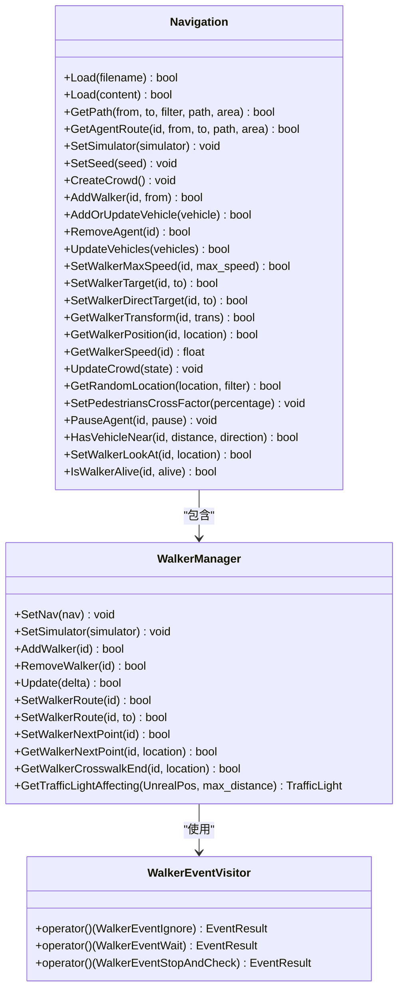
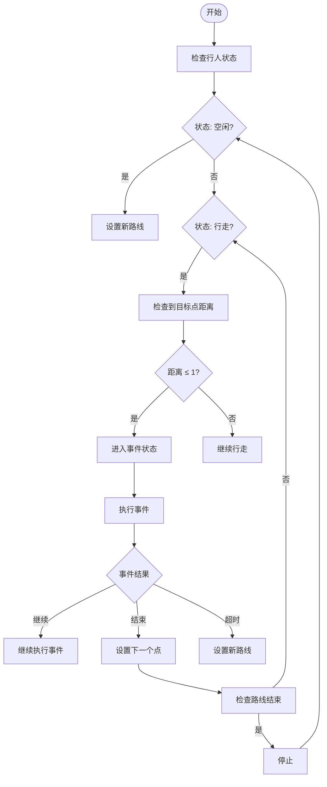
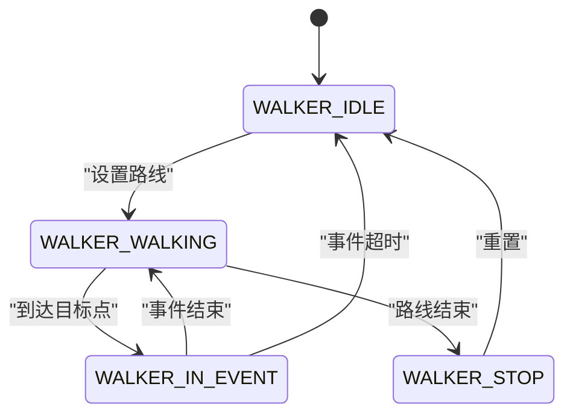
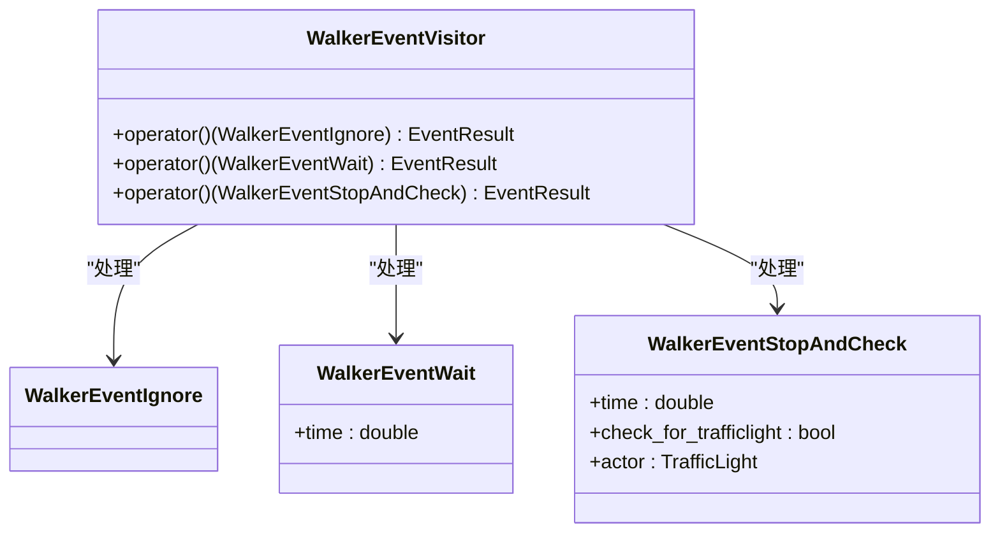
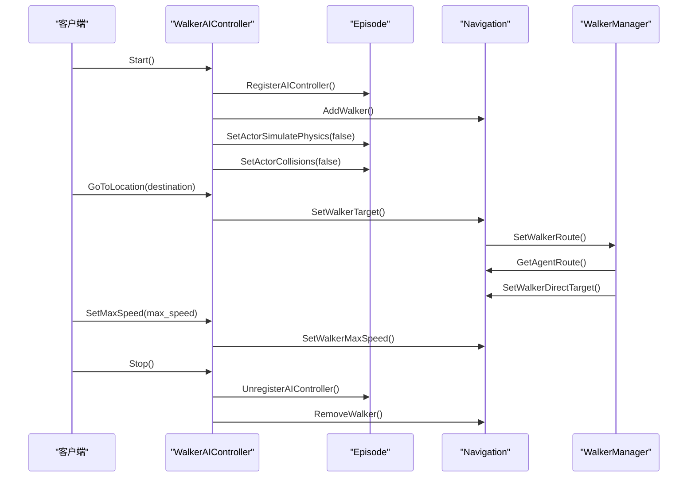
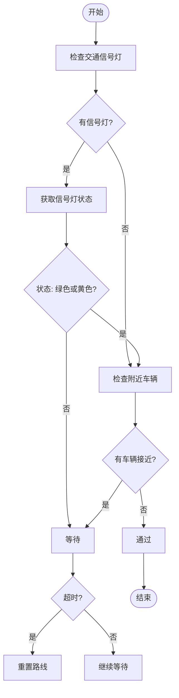
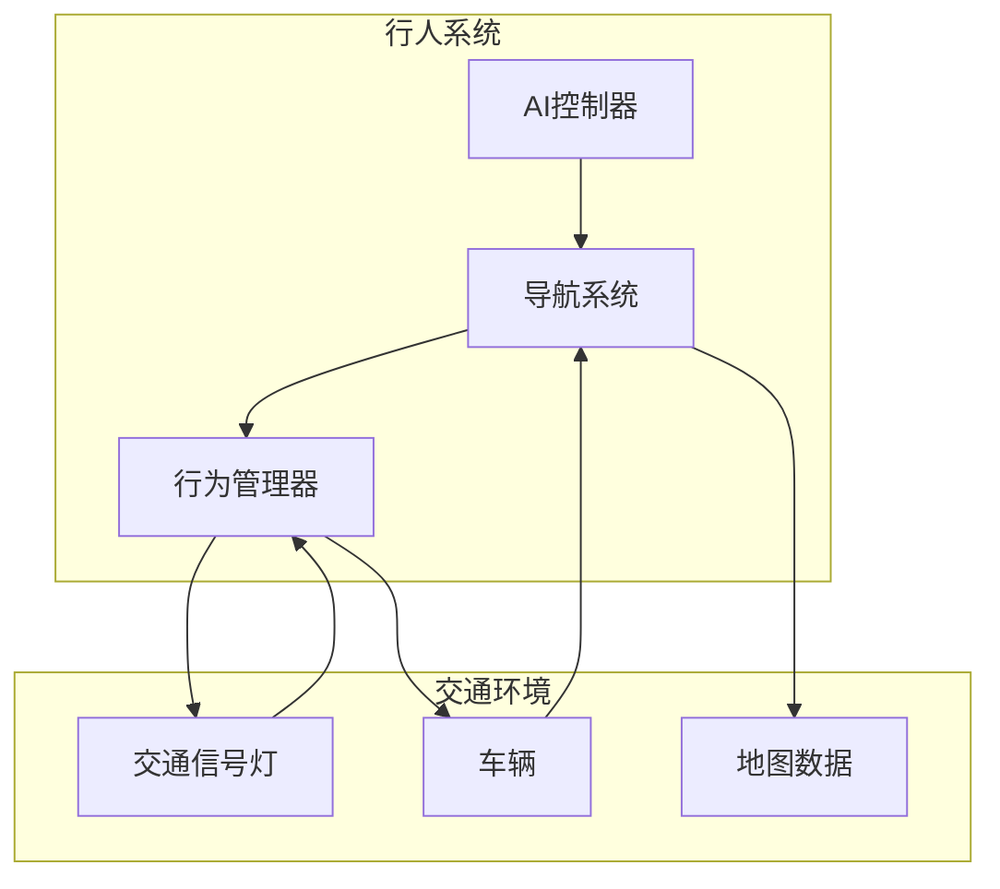
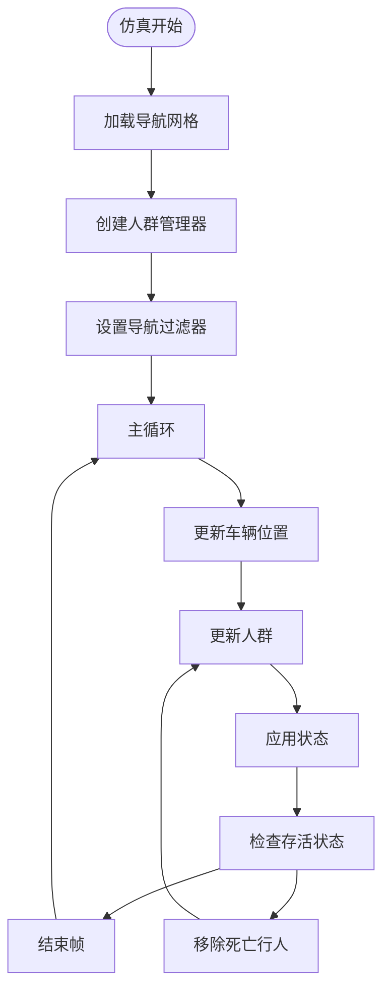
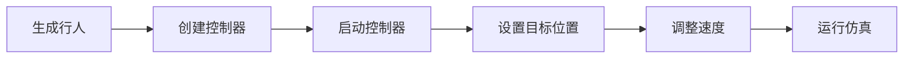
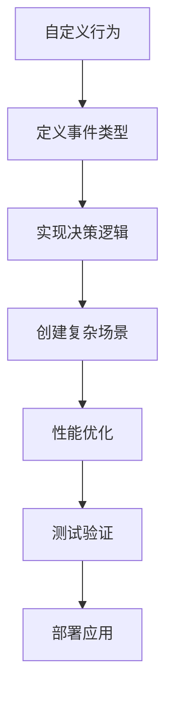

# 行人行为管理


**本文档中引用的文件**   
- [WalkerAIController.h](https://github.com/carla-simulator/carla/blob/ue5-dev/LibCarla/source/carla/client/WalkerAIController.h)
- [WalkerAIController.cpp](https://github.com/carla-simulator/carla/blob/ue5-dev/LibCarla/source/carla/client/WalkerAIController.cpp)
- [WalkerManager.h](https://github.com/carla-simulator/carla/blob/ue5-dev/LibCarla/source/carla/nav/WalkerManager.h)
- [WalkerManager.cpp](https://github.com/carla-simulator/carla/blob/ue5-dev/LibCarla/source/carla/nav/WalkerManager.cpp)
- [WalkerEvent.h](https://github.com/carla-simulator/carla/blob/ue5-dev/LibCarla/source/carla/nav/WalkerEvent.h)
- [WalkerEvent.cpp](https://github.com/carla-simulator/carla/blob/ue5-dev/LibCarla/source/carla/nav/WalkerEvent.cpp)
- [Navigation.h](https://github.com/carla-simulator/carla/blob/ue5-dev/LibCarla/source/carla/nav/Navigation.h)
- [Navigation.cpp](https://github.com/carla-simulator/carla/blob/ue5-dev/LibCarla/source/carla/nav/Navigation.cpp)
- [WalkerNavigation.h](https://github.com/carla-simulator/carla/blob/ue5-dev/LibCarla/source/carla/client/detail/WalkerNavigation.h)
- [WalkerNavigation.cpp](https://github.com/carla-simulator/carla/blob/ue5-dev/LibCarla/source/carla/client/detail/WalkerNavigation.cpp)
- [generate_traffic.py](https://github.com/carla-simulator/carla/blob/ue5-dev/PythonAPI/examples/generate_traffic.py)
- [tuto_G_pedestrian_bones.md](https://github.com/carla-simulator/carla/blob/ue5-dev/Docs/tuto_G_pedestrian_bones.md)


## 目录
1. [引言](#引言)
2. [核心组件](#核心组件)
3. [行人AI决策系统](#行人ai决策系统)
4. [行为树结构与决策逻辑](#行为树结构与决策逻辑)
5. [行人行为控制机制](#行人行为控制机制)
6. [交通管理系统集成](#交通管理系统集成)
7. [性能优化策略](#性能优化策略)
8. [基础与高级应用](#基础与高级应用)
9. [结论](#结论)

## 引言
CARLA仿真器提供了一套完整的行人行为管理系统，用于模拟真实世界中行人的智能行为。该系统通过WalkerAIController实现行人的路径规划、障碍物避让、交通信号遵守以及与其他交通参与者的互动。本文档将深入探讨行人AI决策系统和行为控制机制，详细解释行人行为树的结构和决策逻辑，并提供配置行人行为参数的具体方法。

## 核心组件

行人行为管理系统由多个核心组件构成，包括WalkerAIController、Navigation、WalkerManager和WalkerEvent等。这些组件协同工作，实现了行人的智能行为模拟。

**Section sources**
- [WalkerAIController.h](https://github.com/carla-simulator/carla/blob/ue5-dev/LibCarla/source/carla/client/WalkerAIController.h#L17-L34)
- [Navigation.h](https://github.com/carla-simulator/carla/blob/ue5-dev/LibCarla/source/carla/nav/Navigation.h#L57-L156)
- [WalkerManager.h](https://github.com/carla-simulator/carla/blob/ue5-dev/LibCarla/source/carla/nav/WalkerManager.h#L45-L96)

## 行人AI决策系统

行人AI决策系统基于Recast & Detour导航库实现，通过Navigation类管理行人的路径规划和运动控制。系统首先加载地图的导航数据，然后为每个行人创建导航代理，并设置目标点进行路径规划。



**Diagram sources **
- [Navigation.h](https://github.com/carla-simulator/carla/blob/ue5-dev/LibCarla/source/carla/nav/Navigation.h#L57-L156)
- [WalkerManager.h](https://github.com/carla-simulator/carla/blob/ue5-dev/LibCarla/source/carla/nav/WalkerManager.h#L45-L96)
- [WalkerEvent.h](https://github.com/carla-simulator/carla/blob/ue5-dev/LibCarla/source/carla/nav/WalkerEvent.h#L58-L67)

**Section sources**
- [Navigation.h](https://github.com/carla-simulator/carla/blob/ue5-dev/LibCarla/source/carla/nav/Navigation.h#L57-L156)
- [WalkerManager.h](https://github.com/carla-simulator/carla/blob/ue5-dev/LibCarla/source/carla/nav/WalkerManager.h#L45-L96)
- [WalkerEvent.h](https://github.com/carla-simulator/carla/blob/ue5-dev/LibCarla/source/carla/nav/WalkerEvent.h#L58-L67)

## 行为树结构与决策逻辑

行人行为树通过WalkerManager和WalkerEvent实现复杂的决策逻辑。系统将行人的路径分解为一系列带有事件的路由点，每个事件代表特定的行为模式。



**Diagram sources **
- [WalkerManager.cpp](https://github.com/carla-simulator/carla/blob/ue5-dev/LibCarla/source/carla/nav/WalkerManager.cpp#L60-L110)
- [WalkerEvent.cpp](https://github.com/carla-simulator/carla/blob/ue5-dev/LibCarla/source/carla/nav/WalkerEvent.cpp#L15-L63)

**Section sources**
- [WalkerManager.cpp](https://github.com/carla-simulator/carla/blob/ue5-dev/LibCarla/source/carla/nav/WalkerManager.cpp#L60-L110)
- [WalkerEvent.cpp](https://github.com/carla-simulator/carla/blob/ue5-dev/LibCarla/source/carla/nav/WalkerEvent.cpp#L15-L63)

### 行人状态管理

行人状态由WalkerState枚举定义，包括空闲、行走、事件中和停止四种状态。系统根据当前状态执行相应的逻辑。



**Diagram sources **
- [WalkerManager.h](https://github.com/carla-simulator/carla/blob/ue5-dev/LibCarla/source/carla/nav/WalkerManager.h#L23-L28)

### 事件类型与处理

行人行为系统支持多种事件类型，包括忽略、等待和停止检查。这些事件通过std::variant实现多态行为。



**Diagram sources **
- [WalkerEvent.h](https://github.com/carla-simulator/carla/blob/ue5-dev/LibCarla/source/carla/nav/WalkerEvent.h#L34-L55)
- [WalkerEvent.cpp](https://github.com/carla-simulator/carla/blob/ue5-dev/LibCarla/source/carla/nav/WalkerEvent.cpp#L15-L63)

## 行人行为控制机制

行人行为控制机制通过WalkerAIController实现，提供了启动、停止、设置目标位置和最大速度等接口。



**Diagram sources **
- [WalkerAIController.cpp](https://github.com/carla-simulator/carla/blob/ue5-dev/LibCarla/source/carla/client/WalkerAIController.cpp#L18-L67)
- [WalkerManager.cpp](https://github.com/carla-simulator/carla/blob/ue5-dev/LibCarla/source/carla/nav/WalkerManager.cpp#L114-L181)

**Section sources**
- [WalkerAIController.cpp](https://github.com/carla-simulator/carla/blob/ue5-dev/LibCarla/source/carla/client/WalkerAIController.cpp#L18-L67)
- [WalkerManager.cpp](https://github.com/carla-simulator/carla/blob/ue5-dev/LibCarla/source/carla/nav/WalkerManager.cpp#L114-L181)

### 路径规划与区域类型

系统根据不同的区域类型（人行道、道路、斑马线等）规划路径，并在不同区域执行相应的行为。

```mermaid
erDiagram
NAV_AREAS {
int CARLA_AREA_BLOCK PK
int CARLA_AREA_SIDEWALK
int CARLA_AREA_CROSSWALK
int CARLA_AREA_ROAD
int CARLA_AREA_GRASS
}
SAMPLE_POLY_FLAGS {
int CARLA_TYPE_NONE PK
int CARLA_TYPE_SIDEWALK
int CARLA_TYPE_CROSSWALK
int CARLA_TYPE_ROAD
int CARLA_TYPE_GRASS
int CARLA_TYPE_ALL
int CARLA_TYPE_WALKABLE
}
WALKER_ROUTE_POINT {
WalkerEvent event PK
Location location
unsigned char areaType
}
NAV_AREAS ||--o{ WALKER_ROUTE_POINT : "定义"
SAMPLE_POLY_FLAGS ||--o{ WALKER_ROUTE_POINT : "过滤"
```

**Diagram sources **
- [Navigation.h](https://github.com/carla-simulator/carla/blob/ue5-dev/LibCarla/source/carla/nav/Navigation.h#L26-L44)
- [WalkerManager.cpp](https://github.com/carla-simulator/carla/blob/ue5-dev/LibCarla/source/carla/nav/WalkerManager.cpp#L158-L174)

### 交通信号遵守

行人系统能够检测并遵守交通信号灯，确保在红灯时停止，在绿灯或黄灯时通过。



**Diagram sources **
- [WalkerEvent.cpp](https://github.com/carla-simulator/carla/blob/ue5-dev/LibCarla/source/carla/nav/WalkerEvent.cpp#L28-L62)
- [WalkerManager.cpp](https://github.com/carla-simulator/carla/blob/ue5-dev/LibCarla/source/carla/nav/WalkerManager.cpp#L304-L324)

## 交通管理系统集成

行人行为管理系统与交通管理系统紧密集成，能够响应交通信号灯、避让车辆，并在复杂交通环境中安全移动。



**Diagram sources **
- [WalkerManager.cpp](https://github.com/carla-simulator/carla/blob/ue5-dev/LibCarla/source/carla/nav/WalkerManager.cpp#L277-L324)
- [Navigation.cpp](https://github.com/carla-simulator/carla/blob/ue5-dev/LibCarla/source/carla/nav/Navigation.cpp#L708-L731)

**Section sources**
- [WalkerManager.cpp](https://github.com/carla-simulator/carla/blob/ue5-dev/LibCarla/source/carla/nav/WalkerManager.cpp#L277-L324)
- [Navigation.cpp](https://github.com/carla-simulator/carla/blob/ue5-dev/LibCarla/source/carla/nav/Navigation.cpp#L708-L731)

## 性能优化策略

系统采用多种性能优化策略，包括异步更新、批量处理和智能资源管理，以支持大规模行人仿真。



**Diagram sources **
- [Navigation.cpp](https://github.com/carla-simulator/carla/blob/ue5-dev/LibCarla/source/carla/nav/Navigation.cpp#L201-L264)
- [WalkerNavigation.cpp](https://github.com/carla-simulator/carla/blob/ue5-dev/LibCarla/source/carla/client/detail/WalkerNavigation.cpp#L33-L81)

**Section sources**
- [Navigation.cpp](https://github.com/carla-simulator/carla/blob/ue5-dev/LibCarla/source/carla/nav/Navigation.cpp#L201-L264)
- [WalkerNavigation.cpp](https://github.com/carla-simulator/carla/blob/ue5-dev/LibCarla/source/carla/client/detail/WalkerNavigation.cpp#L33-L81)

## 基础与高级应用

### 基础应用

对于初学者，系统提供了简单的API来控制行人行为：



**Section sources**
- [generate_traffic.py](https://github.com/carla-simulator/carla/blob/ue5-dev/PythonAPI/examples/generate_traffic.py#L277-L286)

### 高级应用

对于高级用户，可以自定义行为树和复杂场景：



**Section sources**
- [tuto_G_pedestrian_bones.md](https://github.com/carla-simulator/carla/blob/ue5-dev/Docs/tuto_G_pedestrian_bones.md#L95-L120)

## 结论
CARLA的行人行为管理系统提供了一套完整的解决方案，用于模拟真实世界中行人的智能行为。通过WalkerAIController、Navigation、WalkerManager和WalkerEvent等组件的协同工作，系统能够实现复杂的路径规划、障碍物避让、交通信号遵守和群体行走等行为模式。该系统不仅为自动驾驶研究提供了逼真的行人仿真环境，还为计算机视觉、机器人等领域的应用提供了强大的支持。