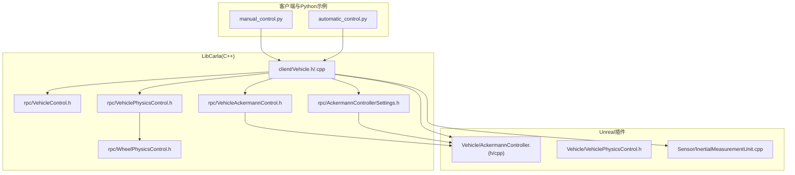
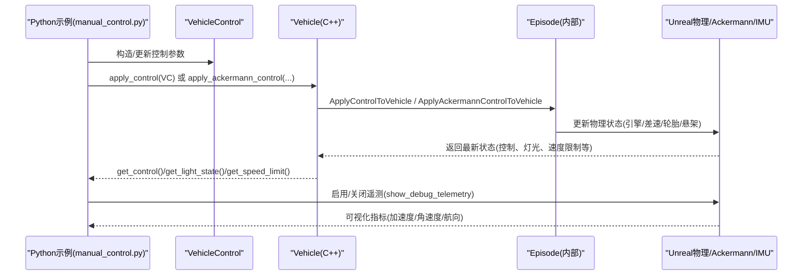
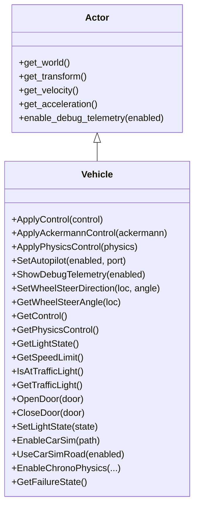
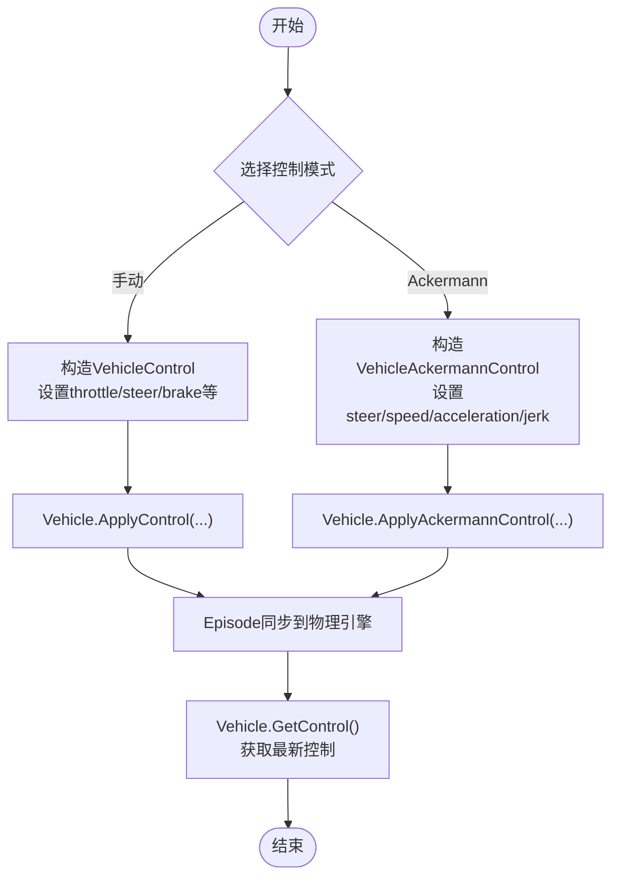
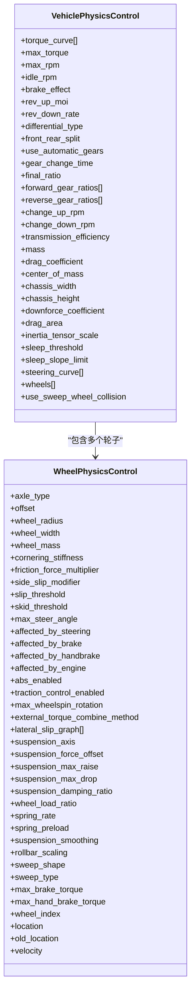
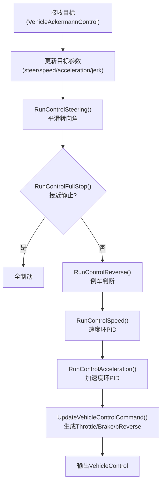
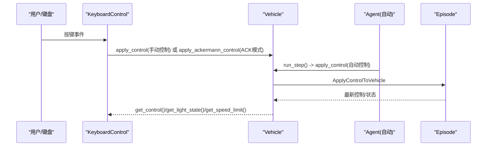
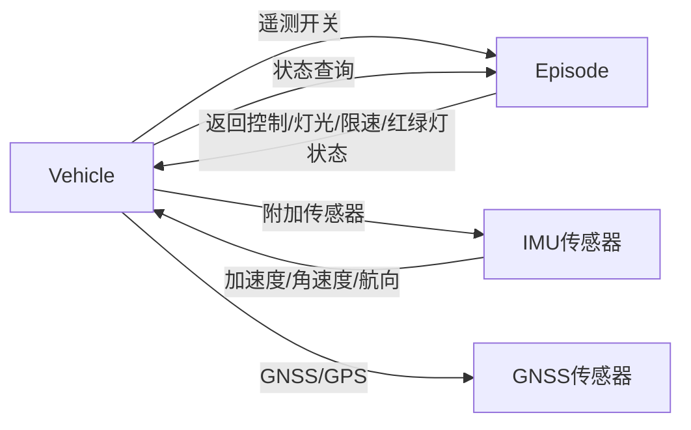
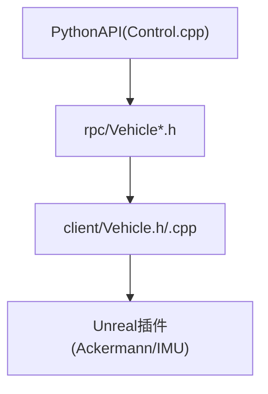

# 车辆控制

**本文引用的文件**
- [LibCarla/source/carla/client/Vehicle.h](https://github.com/carla-simulator/carla/blob/ue5-dev/LibCarla/source/carla/client/Vehicle.h)
- [LibCarla/source/carla/client/Vehicle.cpp](https://github.com/carla-simulator/carla/blob/ue5-dev/LibCarla/source/carla/client/Vehicle.cpp)
- [LibCarla/source/carla/rpc/VehicleControl.h](https://github.com/carla-simulator/carla/blob/ue5-dev/LibCarla/source/carla/rpc/VehicleControl.h)
- [LibCarla/source/carla/rpc/VehiclePhysicsControl.h](https://github.com/carla-simulator/carla/blob/ue5-dev/LibCarla/source/carla/rpc/VehiclePhysicsControl.h)
- [LibCarla/source/carla/rpc/VehicleAckermannControl.h](https://github.com/carla-simulator/carla/blob/ue5-dev/LibCarla/source/carla/rpc/VehicleAckermannControl.h)
- [LibCarla/source/carla/rpc/AckermannControllerSettings.h](https://github.com/carla-simulator/carla/blob/ue5-dev/LibCarla/source/carla/rpc/AckermannControllerSettings.h)
- [LibCarla/source/carla/rpc/WheelPhysicsControl.h](https://github.com/carla-simulator/carla/blob/ue5-dev/LibCarla/source/carla/rpc/WheelPhysicsControl.h)
- [PythonAPI/examples/manual_control.py](https://github.com/carla-simulator/carla/blob/ue5-dev/PythonAPI/examples/manual_control.py)
- [PythonAPI/examples/automatic_control.py](https://github.com/carla-simulator/carla/blob/ue5-dev/PythonAPI/examples/automatic_control.py)
- [PythonAPI/carla/src/Control.cpp](https://github.com/carla-simulator/carla/blob/ue5-dev/PythonAPI/carla/src/Control.cpp)
- [PythonAPI/carla/src/Actor.cpp](https://github.com/carla-simulator/carla/blob/ue5-dev/PythonAPI/carla/src/Actor.cpp)
- [Docs/tuto_G_control_vehicle_physics.md](https://github.com/carla-simulator/carla/blob/ue5-dev/Docs/tuto_G_control_vehicle_physics.md)
- [Unreal/CarlaUnreal/Plugins/Carla/Source/Carla/Vehicle/AckermannController.h](https://github.com/carla-simulator/carla/blob/ue5-dev/Unreal/CarlaUnreal/Plugins/Carla/Source/Carla/Vehicle/AckermannController.h)
- [Unreal/CarlaUnreal/Plugins/Carla/Source/Carla/Vehicle/AckermannController.cpp](https://github.com/carla-simulator/carla/blob/ue5-dev/Unreal/CarlaUnreal/Plugins/Carla/Source/Carla/Vehicle/AckermannController.cpp)
- [Unreal/CarlaUnreal/Plugins/Carla/Source/Carla/Vehicle/VehiclePhysicsControl.h](https://github.com/carla-simulator/carla/blob/ue5-dev/Unreal/CarlaUnreal/Plugins/Carla/Source/Carla/Vehicle/VehiclePhysicsControl.h)
- [Unreal/CarlaUnreal/Plugins/Carla/Source/Carla/Sensor/InertialMeasurementUnit.cpp](https://github.com/carla-simulator/carla/blob/ue5-dev/Unreal/CarlaUnreal/Plugins/Carla/Source/Carla/Sensor/InertialMeasurementUnit.cpp)

## 目录
1. [简介](#简介)
2. [项目结构](#项目结构)
3. [核心组件](#核心组件)
4. [架构总览](#架构总览)
5. [详细组件分析](#详细组件分析)
6. [依赖关系分析](#依赖关系分析)
7. [性能考量](#性能考量)
8. [故障排查指南](#故障排查指南)
9. [结论](#结论)
10. [附录](#附录)

## 简介
本文件围绕CARLA的车辆控制与动力学仿真，系统性阐述Vehicle类作为Actor子类的实现机制，覆盖油门、刹车、转向、档位等控制参数配置；详解车辆物理属性（质量、轮胎摩擦、空气阻力等）的调整方式及对驾驶行为的影响；给出通过Python/C++ API实现车辆精确控制的方法，包括手动与自动驾驶模式切换；深入解析车辆传感器（速度计、陀螺仪）与状态反馈机制，并提供从入门到进阶的实践路径与可视化图示。

## 项目结构
- 客户端API与C++实现位于LibCarla，包含Vehicle类、RPC控制数据结构与物理控制对象。
- Python示例位于PythonAPI/examples，演示手动控制与自动控制两种模式。
- 文档位于Docs，提供物理参数调优与遥测可视化的指导。
- Unreal插件中包含Ackermann控制器与IMU传感器的底层实现，支撑真实物理仿真。

图表来源
- [LibCarla/source/carla/client/Vehicle.h](https://github.com/carla-simulator/carla/blob/ue5-dev/LibCarla/source/carla/client/Vehicle.h#L1-L154)
- [LibCarla/source/carla/client/Vehicle.cpp](https://github.com/carla-simulator/carla/blob/ue5-dev/LibCarla/source/carla/client/Vehicle.cpp#L1-L157)
- [LibCarla/source/carla/rpc/VehicleControl.h](https://github.com/carla-simulator/carla/blob/ue5-dev/LibCarla/source/carla/rpc/VehicleControl.h#L1-L101)
- [LibCarla/source/carla/rpc/VehiclePhysicsControl.h](https://github.com/carla-simulator/carla/blob/ue5-dev/LibCarla/source/carla/rpc/VehiclePhysicsControl.h#L1-L246)
- [LibCarla/source/carla/rpc/WheelPhysicsControl.h](https://github.com/carla-simulator/carla/blob/ue5-dev/LibCarla/source/carla/rpc/WheelPhysicsControl.h#L1-L261)
- [LibCarla/source/carla/rpc/VehicleAckermannControl.h](https://github.com/carla-simulator/carla/blob/ue5-dev/LibCarla/source/carla/rpc/VehicleAckermannControl.h#L1-L85)
- [LibCarla/source/carla/rpc/AckermannControllerSettings.h](https://github.com/carla-simulator/carla/blob/ue5-dev/LibCarla/source/carla/rpc/AckermannControllerSettings.h#L1-L93)
- [Unreal/CarlaUnreal/Plugins/Carla/Source/Carla/Vehicle/AckermannController.cpp](https://github.com/carla-simulator/carla/blob/ue5-dev/Unreal/CarlaUnreal/Plugins/Carla/Source/Carla/Vehicle/AckermannController.cpp#L1-L219)
- [Unreal/CarlaUnreal/Plugins/Carla/Source/Carla/Sensor/InertialMeasurementUnit.cpp](https://github.com/carla-simulator/carla/blob/ue5-dev/Unreal/CarlaUnreal/Plugins/Carla/Source/Carla/Sensor/InertialMeasurementUnit.cpp#L140-L176)

章节来源
- [LibCarla/source/carla/client/Vehicle.h](https://github.com/carla-simulator/carla/blob/ue5-dev/LibCarla/source/carla/client/Vehicle.h#L1-L154)
- [LibCarla/source/carla/client/Vehicle.cpp](https://github.com/carla-simulator/carla/blob/ue5-dev/LibCarla/source/carla/client/Vehicle.cpp#L1-L157)
- [PythonAPI/examples/manual_control.py](https://github.com/carla-simulator/carla/blob/ue5-dev/PythonAPI/examples/manual_control.py#L1-L1387)
- [PythonAPI/examples/automatic_control.py](https://github.com/carla-simulator/carla/blob/ue5-dev/PythonAPI/examples/automatic_control.py#L1-L849)

## 核心组件
- Vehicle类：继承自Actor，提供控制接口（ApplyControl、ApplyAckermannControl）、物理控制（ApplyPhysicsControl）、灯光与车门管理、遥测开关、车轮转向方向设置与读取、失败状态查询等。
- 控制数据结构：
  - VehicleControl：包含throttle、steer、brake、hand_brake、reverse、manual_gear_shift、gear等字段。
  - VehicleAckermannControl：包含steer、steer_speed、speed、acceleration、jerk等字段。
  - AckermannControllerSettings：包含速度与加速度PID参数。
  - VehiclePhysicsControl：包含引擎曲线、最大扭矩、最大转速、差速器类型、前后配重、档位比、传动效率、质量、风阻系数、质心、下压力系数、惯量缩放、睡眠阈值、转向曲线、车轮数组等。
  - WheelPhysicsControl：包含轴类型、偏移、半径、宽度、质量、侧向刚度、摩擦力倍率、侧滑阈值、悬架参数、制动/手刹扭矩上限、是否受各力影响等。
- Python绑定：在Control.cpp中导出VehicleControl、VehicleAckermannControl、VehiclePhysicsControl等对象，便于Python侧直接使用。
- Unreal插件：AckermannController实现纵向/横向控制闭环，VehiclePhysicsControl蓝图结构用于编辑器配置；IMU传感器输出加速度、角速度与航向。

章节来源
- [LibCarla/source/carla/client/Vehicle.h](https://github.com/carla-simulator/carla/blob/ue5-dev/LibCarla/source/carla/client/Vehicle.h#L32-L151)
- [LibCarla/source/carla/client/Vehicle.cpp](https://github.com/carla-simulator/carla/blob/ue5-dev/LibCarla/source/carla/client/Vehicle.cpp#L34-L153)
- [LibCarla/source/carla/rpc/VehicleControl.h](https://github.com/carla-simulator/carla/blob/ue5-dev/LibCarla/source/carla/rpc/VehicleControl.h#L20-L101)
- [LibCarla/source/carla/rpc/VehicleAckermannControl.h](https://github.com/carla-simulator/carla/blob/ue5-dev/LibCarla/source/carla/rpc/VehicleAckermannControl.h#L18-L85)
- [LibCarla/source/carla/rpc/AckermannControllerSettings.h](https://github.com/carla-simulator/carla/blob/ue5-dev/LibCarla/source/carla/rpc/AckermannControllerSettings.h#L18-L93)
- [LibCarla/source/carla/rpc/VehiclePhysicsControl.h](https://github.com/carla-simulator/carla/blob/ue5-dev/LibCarla/source/carla/rpc/VehiclePhysicsControl.h#L20-L246)
- [LibCarla/source/carla/rpc/WheelPhysicsControl.h](https://github.com/carla-simulator/carla/blob/ue5-dev/LibCarla/source/carla/rpc/WheelPhysicsControl.h#L19-L261)
- [PythonAPI/carla/src/Control.cpp](https://github.com/carla-simulator/carla/blob/ue5-dev/PythonAPI/carla/src/Control.cpp#L308-L323)
- [PythonAPI/carla/src/Control.cpp](https://github.com/carla-simulator/carla/blob/ue5-dev/PythonAPI/carla/src/Control.cpp#L472-L491)
- [PythonAPI/carla/src/Actor.cpp](https://github.com/carla-simulator/carla/blob/ue5-dev/PythonAPI/carla/src/Actor.cpp#L201-L212)
- [Unreal/CarlaUnreal/Plugins/Carla/Source/Carla/Vehicle/AckermannController.cpp](https://github.com/carla-simulator/carla/blob/ue5-dev/Unreal/CarlaUnreal/Plugins/Carla/Source/Carla/Vehicle/AckermannController.cpp#L1-L219)
- [Unreal/CarlaUnreal/Plugins/Carla/Source/Carla/Vehicle/VehiclePhysicsControl.h](https://github.com/carla-simulator/carla/blob/ue5-dev/Unreal/CarlaUnreal/Plugins/Carla/Source/Carla/Vehicle/VehiclePhysicsControl.h#L1-L45)
- [Unreal/CarlaUnreal/Plugins/Carla/Source/Carla/Sensor/InertialMeasurementUnit.cpp](https://github.com/carla-simulator/carla/blob/ue5-dev/Unreal/CarlaUnreal/Plugins/Carla/Source/Carla/Sensor/InertialMeasurementUnit.cpp#L140-L176)

## 架构总览
下图展示了从Python示例到C++ Vehicle接口，再到Unreal物理与传感器的完整链路。

图表来源
- [LibCarla/source/carla/client/Vehicle.cpp](https://github.com/carla-simulator/carla/blob/ue5-dev/LibCarla/source/carla/client/Vehicle.cpp#L51-L108)
- [LibCarla/source/carla/client/Vehicle.h](https://github.com/carla-simulator/carla/blob/ue5-dev/LibCarla/source/carla/client/Vehicle.h#L52-L120)
- [PythonAPI/examples/manual_control.py](https://github.com/carla-simulator/carla/blob/ue5-dev/PythonAPI/examples/manual_control.py#L581-L610)
- [Unreal/CarlaUnreal/Plugins/Carla/Source/Carla/Vehicle/AckermannController.cpp](https://github.com/carla-simulator/carla/blob/ue5-dev/Unreal/CarlaUnreal/Plugins/Carla/Source/Carla/Vehicle/AckermannController.cpp#L80-L115)
- [Unreal/CarlaUnreal/Plugins/Carla/Source/Carla/Sensor/InertialMeasurementUnit.cpp](https://github.com/carla-simulator/carla/blob/ue5-dev/Unreal/CarlaUnreal/Plugins/Carla/Source/Carla/Sensor/InertialMeasurementUnit.cpp#L140-L176)

## 详细组件分析

### Vehicle类与Actor子类关系
- 继承关系：Vehicle继承自Actor，复用Actor的生命周期与快照机制，同时扩展车辆专属控制与状态查询。
- 关键能力：
  - 控制下发：ApplyControl、ApplyAckermannControl、ApplyPhysicsControl。
  - 状态查询：GetControl、GetPhysicsControl、GetLightState、GetSpeedLimit、IsAtTrafficLight、GetTrafficLight等。
  - 遥测：ShowDebugTelemetry。
  - 车轮：SetWheelSteerDirection、GetWheelSteerAngle。
  - 其他：OpenDoor/CloseDoor、SetLightState、EnableCarSim、UseCarSimRoad、EnableChronoPhysics、GetFailureState。

图表来源
- [LibCarla/source/carla/client/Vehicle.h](https://github.com/carla-simulator/carla/blob/ue5-dev/LibCarla/source/carla/client/Vehicle.h#L32-L151)
- [LibCarla/source/carla/client/Vehicle.cpp](https://github.com/carla-simulator/carla/blob/ue5-dev/LibCarla/source/carla/client/Vehicle.cpp#L34-L153)

章节来源
- [LibCarla/source/carla/client/Vehicle.h](https://github.com/carla-simulator/carla/blob/ue5-dev/LibCarla/source/carla/client/Vehicle.h#L32-L151)
- [LibCarla/source/carla/client/Vehicle.cpp](https://github.com/carla-simulator/carla/blob/ue5-dev/LibCarla/source/carla/client/Vehicle.cpp#L34-L153)

### 控制参数与接口
- VehicleControl字段含义：
  - throttle：油门比例(0~1)。
  - steer：前轮转向角(弧度，经Get/SetWheelSteerAngle映射)。
  - brake：制动比例(0~1)。
  - hand_brake：手刹。
  - reverse：倒车档。
  - manual_gear_shift：手动换挡。
  - gear：当前档位(-1为倒车，0为空挡，正数为前进档)。
- ApplyControl与ApplyAckermannControl：
  - ApplyControl直接下发给物理引擎。
  - ApplyAckermannControl以目标速度/加速度/转向速率等进行闭环控制，适合自动驾驶或更平滑的人工驾驶体验。
- AckermannControllerSettings：
  - 包含速度与加速度的PID参数，用于调节响应速度与稳定性。

图表来源
- [LibCarla/source/carla/rpc/VehicleControl.h](https://github.com/carla-simulator/carla/blob/ue5-dev/LibCarla/source/carla/rpc/VehicleControl.h#L20-L101)
- [LibCarla/source/carla/rpc/VehicleAckermannControl.h](https://github.com/carla-simulator/carla/blob/ue5-dev/LibCarla/source/carla/rpc/VehicleAckermannControl.h#L18-L85)
- [LibCarla/source/carla/client/Vehicle.cpp](https://github.com/carla-simulator/carla/blob/ue5-dev/LibCarla/source/carla/client/Vehicle.cpp#L51-L68)
- [PythonAPI/carla/src/Control.cpp](https://github.com/carla-simulator/carla/blob/ue5-dev/PythonAPI/carla/src/Control.cpp#L308-L323)

章节来源
- [LibCarla/source/carla/rpc/VehicleControl.h](https://github.com/carla-simulator/carla/blob/ue5-dev/LibCarla/source/carla/rpc/VehicleControl.h#L20-L101)
- [LibCarla/source/carla/rpc/VehicleAckermannControl.h](https://github.com/carla-simulator/carla/blob/ue5-dev/LibCarla/source/carla/rpc/VehicleAckermannControl.h#L18-L85)
- [LibCarla/source/carla/client/Vehicle.cpp](https://github.com/carla-simulator/carla/blob/ue5-dev/LibCarla/source/carla/client/Vehicle.cpp#L51-L68)
- [PythonAPI/carla/src/Control.cpp](https://github.com/carla-simulator/carla/blob/ue5-dev/PythonAPI/carla/src/Control.cpp#L308-L323)

### 车辆物理属性与调参
- VehiclePhysicsControl关键项：
  - 引擎：torque_curve、max_torque、max_rpm、idle_rpm、brake_effect、rev_up_moi、rev_down_rate。
  - 传动：differential_type、front_rear_split、use_automatic_gears、gear_change_time、final_ratio、forward_gear_ratios、reverse_gear_ratios、change_up_rpm、change_down_rpm、transmission_efficiency。
  - 车身：mass、drag_coefficient、center_of_mass、chassis_width、chassis_height、downforce_coefficient、drag_area、inertia_tensor_scale、sleep_threshold、sleep_slope_limit。
  - 转向：steering_curve。
  - 轮子：wheels（每个轮子独立配置）。
  - 悬架与碰撞：use_sweep_wheel_collision。
- WheelPhysicsControl关键项：
  - 几何与质量：offset、wheel_radius、wheel_width、wheel_mass。
  - 摩擦与侧向：cornering_stiffness、friction_force_multiplier、side_slip_modifier、slip_threshold、skid_threshold。
  - 动力学：max_steer_angle、max_brake_torque、max_hand_brake_torque、spring_rate、spring_preload、suspension_*、rollbar_scaling等。
  - 影响因素：是否受转向/制动/手刹/引擎影响、ABS与牵引力控制开关等。
- 调参建议：
  - 质量与风阻：增大质量与风阻会降低加速度但提升高速稳定性；减小可提升加速性能。
  - 轮胎摩擦：提高friction_force_multiplier可增强抓地力，但可能引发更明显的轮胎侧滑与转向不足/过度。
  - 悬架：提高弹簧刚度与阻尼可减少车身俯仰，但可能牺牲舒适性。
  - 差速器与档位：合理设置前后配重与档位比，有助于改善起步与弯道表现。

图表来源
- [LibCarla/source/carla/rpc/VehiclePhysicsControl.h](https://github.com/carla-simulator/carla/blob/ue5-dev/LibCarla/source/carla/rpc/VehiclePhysicsControl.h#L20-L246)
- [LibCarla/source/carla/rpc/WheelPhysicsControl.h](https://github.com/carla-simulator/carla/blob/ue5-dev/LibCarla/source/carla/rpc/WheelPhysicsControl.h#L19-L261)

章节来源
- [LibCarla/source/carla/rpc/VehiclePhysicsControl.h](https://github.com/carla-simulator/carla/blob/ue5-dev/LibCarla/source/carla/rpc/VehiclePhysicsControl.h#L20-L246)
- [LibCarla/source/carla/rpc/WheelPhysicsControl.h](https://github.com/carla-simulator/carla/blob/ue5-dev/LibCarla/source/carla/rpc/WheelPhysicsControl.h#L19-L261)
- [Docs/tuto_G_control_vehicle_physics.md](https://github.com/carla-simulator/carla/blob/ue5-dev/Docs/tuto_G_control_vehicle_physics.md#L1-L72)
- [PythonAPI/carla/src/Control.cpp](https://github.com/carla-simulator/carla/blob/ue5-dev/PythonAPI/carla/src/Control.cpp#L472-L491)

### Ackermann转向模型与控制器
- Ackermann控制目标：
  - 通过目标转向角、转向速率、目标速度、加速度与加加速度(jerk)实现更接近真实车辆的运动学。
- 控制流程要点：
  - 转向控制：根据目标转向角与转向速率，平滑逼近当前转向角。
  - 速度/加速度控制：速度环与加速度环分别PID调节，输出油门/制动。
  - 倒车与驻车：在低速时优先全制动，避免抖动。
  - 输出：将计算得到的Steer、Throttle、Brake、bReverse写入VehicleControl。

图表来源
- [LibCarla/source/carla/rpc/VehicleAckermannControl.h](https://github.com/carla-simulator/carla/blob/ue5-dev/LibCarla/source/carla/rpc/VehicleAckermannControl.h#L18-L85)
- [LibCarla/source/carla/rpc/AckermannControllerSettings.h](https://github.com/carla-simulator/carla/blob/ue5-dev/LibCarla/source/carla/rpc/AckermannControllerSettings.h#L18-L93)
- [Unreal/CarlaUnreal/Plugins/Carla/Source/Carla/Vehicle/AckermannController.cpp](https://github.com/carla-simulator/carla/blob/ue5-dev/Unreal/CarlaUnreal/Plugins/Carla/Source/Carla/Vehicle/AckermannController.cpp#L80-L115)
- [Unreal/CarlaUnreal/Plugins/Carla/Source/Carla/Vehicle/AckermannController.cpp](https://github.com/carla-simulator/carla/blob/ue5-dev/Unreal/CarlaUnreal/Plugins/Carla/Source/Carla/Vehicle/AckermannController.cpp#L169-L199)
- [Unreal/CarlaUnreal/Plugins/Carla/Source/Carla/Vehicle/AckermannController.cpp](https://github.com/carla-simulator/carla/blob/ue5-dev/Unreal/CarlaUnreal/Plugins/Carla/Source/Carla/Vehicle/AckermannController.cpp#L200-L219)

章节来源
- [Unreal/CarlaUnreal/Plugins/Carla/Source/Carla/Vehicle/AckermannController.cpp](https://github.com/carla-simulator/carla/blob/ue5-dev/Unreal/CarlaUnreal/Plugins/Carla/Source/Carla/Vehicle/AckermannController.cpp#L1-L219)
- [LibCarla/source/carla/rpc/VehicleAckermannControl.h](https://github.com/carla-simulator/carla/blob/ue5-dev/LibCarla/source/carla/rpc/VehicleAckermannControl.h#L18-L85)
- [LibCarla/source/carla/rpc/AckermannControllerSettings.h](https://github.com/carla-simulator/carla/blob/ue5-dev/LibCarla/source/carla/rpc/AckermannControllerSettings.h#L18-L93)

### 手动控制与自动驾驶模式切换
- 手动控制：
  - 使用键盘事件更新VehicleControl，支持油门/刹车/转向/手刹/倒车/手动档位。
  - 支持切换Ackermann控制器，以目标速度/加速度/转向速率进行平滑控制。
- 自动驾驶模式：
  - 示例中通过BasicAgent/ConstantVelocityAgent/BehaviorAgent生成控制指令，再apply_control下发。
  - 可结合同步模式与交通管理器实现稳定仿真。

图表来源
- [PythonAPI/examples/manual_control.py](https://github.com/carla-simulator/carla/blob/ue5-dev/PythonAPI/examples/manual_control.py#L581-L610)
- [PythonAPI/examples/automatic_control.py](https://github.com/carla-simulator/carla/blob/ue5-dev/PythonAPI/examples/automatic_control.py#L745-L770)
- [LibCarla/source/carla/client/Vehicle.cpp](https://github.com/carla-simulator/carla/blob/ue5-dev/LibCarla/source/carla/client/Vehicle.cpp#L51-L68)

章节来源
- [PythonAPI/examples/manual_control.py](https://github.com/carla-simulator/carla/blob/ue5-dev/PythonAPI/examples/manual_control.py#L581-L610)
- [PythonAPI/examples/automatic_control.py](https://github.com/carla-simulator/carla/blob/ue5-dev/PythonAPI/examples/automatic_control.py#L745-L770)
- [LibCarla/source/carla/client/Vehicle.cpp](https://github.com/carla-simulator/carla/blob/ue5-dev/LibCarla/source/carla/client/Vehicle.cpp#L51-L68)

### 传感器集成与状态反馈
- IMU传感器：
  - 提供加速度、角速度与航向，用于姿态与动态监测。
  - Unreal端IMU计算加速度与角速度并应用噪声模型，输出标准化数据。
- GNSS/GPS：
  - 提供经纬度信息，辅助定位。
- 车辆遥测：
  - 通过Vehicle.ShowDebugTelemetry开启，可在服务器窗口查看多维指标与参考点。
- Python侧状态读取：
  - 通过Vehicle.GetControl、GetLightState、GetSpeedLimit、IsAtTrafficLight等接口获取最新状态。

图表来源
- [LibCarla/source/carla/client/Vehicle.cpp](https://github.com/carla-simulator/carla/blob/ue5-dev/LibCarla/source/carla/client/Vehicle.cpp#L94-L125)
- [PythonAPI/examples/manual_control.py](https://github.com/carla-simulator/carla/blob/ue5-dev/PythonAPI/examples/manual_control.py#L990-L1021)
- [Unreal/CarlaUnreal/Plugins/Carla/Source/Carla/Sensor/InertialMeasurementUnit.cpp](https://github.com/carla-simulator/carla/blob/ue5-dev/Unreal/CarlaUnreal/Plugins/Carla/Source/Carla/Sensor/InertialMeasurementUnit.cpp#L140-L176)
- [PythonAPI/carla/src/Actor.cpp](https://github.com/carla-simulator/carla/blob/ue5-dev/PythonAPI/carla/src/Actor.cpp#L201-L212)

章节来源
- [PythonAPI/examples/manual_control.py](https://github.com/carla-simulator/carla/blob/ue5-dev/PythonAPI/examples/manual_control.py#L990-L1021)
- [Unreal/CarlaUnreal/Plugins/Carla/Source/Carla/Sensor/InertialMeasurementUnit.cpp](https://github.com/carla-simulator/carla/blob/ue5-dev/Unreal/CarlaUnreal/Plugins/Carla/Source/Carla/Sensor/InertialMeasurementUnit.cpp#L140-L176)
- [LibCarla/source/carla/client/Vehicle.cpp](https://github.com/carla-simulator/carla/blob/ue5-dev/LibCarla/source/carla/client/Vehicle.cpp#L94-L125)
- [PythonAPI/carla/src/Actor.cpp](https://github.com/carla-simulator/carla/blob/ue5-dev/PythonAPI/carla/src/Actor.cpp#L201-L212)

## 依赖关系分析
- Vehicle对RPC数据结构的依赖：Vehicle的所有控制与查询均基于rpc命名空间的数据结构。
- Python绑定对C++实现的依赖：Control.cpp导出VehicleControl、VehicleAckermannControl、VehiclePhysicsControl等，使Python侧可直接实例化与使用。
- Unreal插件对Vehicle与传感器的依赖：AckermannController依赖ACarlaWheeledVehicle的状态与物理参数；IMU传感器依赖UE物理世界提供的加速度与角速度。

图表来源
- [PythonAPI/carla/src/Control.cpp](https://github.com/carla-simulator/carla/blob/ue5-dev/PythonAPI/carla/src/Control.cpp#L308-L323)
- [PythonAPI/carla/src/Control.cpp](https://github.com/carla-simulator/carla/blob/ue5-dev/PythonAPI/carla/src/Control.cpp#L472-L491)
- [LibCarla/source/carla/client/Vehicle.h](https://github.com/carla-simulator/carla/blob/ue5-dev/LibCarla/source/carla/client/Vehicle.h#L32-L151)
- [LibCarla/source/carla/client/Vehicle.cpp](https://github.com/carla-simulator/carla/blob/ue5-dev/LibCarla/source/carla/client/Vehicle.cpp#L34-L153)
- [Unreal/CarlaUnreal/Plugins/Carla/Source/Carla/Vehicle/AckermannController.cpp](https://github.com/carla-simulator/carla/blob/ue5-dev/Unreal/CarlaUnreal/Plugins/Carla/Source/Carla/Vehicle/AckermannController.cpp#L1-L219)
- [Unreal/CarlaUnreal/Plugins/Carla/Source/Carla/Sensor/InertialMeasurementUnit.cpp](https://github.com/carla-simulator/carla/blob/ue5-dev/Unreal/CarlaUnreal/Plugins/Carla/Source/Carla/Sensor/InertialMeasurementUnit.cpp#L140-L176)

章节来源
- [PythonAPI/carla/src/Control.cpp](https://github.com/carla-simulator/carla/blob/ue5-dev/PythonAPI/carla/src/Control.cpp#L308-L323)
- [PythonAPI/carla/src/Control.cpp](https://github.com/carla-simulator/carla/blob/ue5-dev/PythonAPI/carla/src/Control.cpp#L472-L491)
- [LibCarla/source/carla/client/Vehicle.h](https://github.com/carla-simulator/carla/blob/ue5-dev/LibCarla/source/carla/client/Vehicle.h#L32-L151)
- [LibCarla/source/carla/client/Vehicle.cpp](https://github.com/carla-simulator/carla/blob/ue5-dev/LibCarla/source/carla/client/Vehicle.cpp#L34-L153)

## 性能考量
- 控制频率与同步模式：
  - 在同步模式下，固定步长时间(fixed_delta_seconds)可提升控制一致性与可重复性，但CPU占用更高。
- 物理复杂度：
  - 增加轮胎数量、启用use_sweep_wheel_collision、复杂转向曲线与档位切换都会增加计算开销。
- 传感器数量与分辨率：
  - 提高相机/激光雷达分辨率或增加传感器数量会显著提升渲染与处理负载。
- 调参建议：
  - 对于实时交互，优先简化物理参数；对于离线仿真或研究，可逐步增加复杂度以逼近真实。

## 故障排查指南
- 控制未生效：
  - 检查是否处于异步模式且tick未正确推进；确认ApplyControl/ApplyAckermannControl调用成功。
- 车辆不动或抖动：
  - 检查手刹/驻车制动是否开启；核对摩擦力与悬架参数；适当降低转向速率与加加速度。
- 转向不自然：
  - 调整Ackermann控制器的PID参数；检查最大转向角与转向曲线。
- 遥测无显示：
  - 确认已调用ShowDebugTelemetry(true)，并确保服务器窗口可见。
- 传感器数据异常：
  - 检查IMU/GNSS传感器挂载位置与朝向；确认监听回调正常触发。

章节来源
- [LibCarla/source/carla/client/Vehicle.cpp](https://github.com/carla-simulator/carla/blob/ue5-dev/LibCarla/source/carla/client/Vehicle.cpp#L47-L56)
- [PythonAPI/examples/manual_control.py](https://github.com/carla-simulator/carla/blob/ue5-dev/PythonAPI/examples/manual_control.py#L468-L479)
- [Unreal/CarlaUnreal/Plugins/Carla/Source/Carla/Sensor/InertialMeasurementUnit.cpp](https://github.com/carla-simulator/carla/blob/ue5-dev/Unreal/CarlaUnreal/Plugins/Carla/Source/Carla/Sensor/InertialMeasurementUnit.cpp#L140-L176)

## 结论
CARLA的车辆控制体系以Vehicle为核心，通过VehicleControl与VehicleAckermannControl实现灵活的人工与自动驾驶控制；借助VehiclePhysicsControl与WheelPhysicsControl，用户可以精细调参以匹配不同场景需求。配合IMU/GNSS等传感器与遥测功能，可构建完整的感知-控制-反馈闭环。建议从简单参数入手，逐步引入Ackermann控制与复杂物理特性，在保证稳定性的同时探索更真实的驾驶行为。

## 附录
- 快速上手步骤（Python）：
  - 连接客户端，获取世界与车辆。
  - 修改VehiclePhysicsControl并apply_physics_control。
  - 在手动模式下按键更新VehicleControl，或切换至Ackermann模式。
  - 开启遥测观察指标，接入IMU/GNSS传感器进行状态反馈。
- 参考示例路径：
  - 手动控制：[manual_control.py](https://github.com/carla-simulator/carla/blob/ue5-dev/PythonAPI/examples/manual_control.py#L581-L610)
  - 自动控制：[automatic_control.py](https://github.com/carla-simulator/carla/blob/ue5-dev/PythonAPI/examples/automatic_control.py#L745-L770)
  - 物理调参示例：[tuto_G_control_vehicle_physics.md](https://github.com/carla-simulator/carla/blob/ue5-dev/Docs/tuto_G_control_vehicle_physics.md#L1-L72)