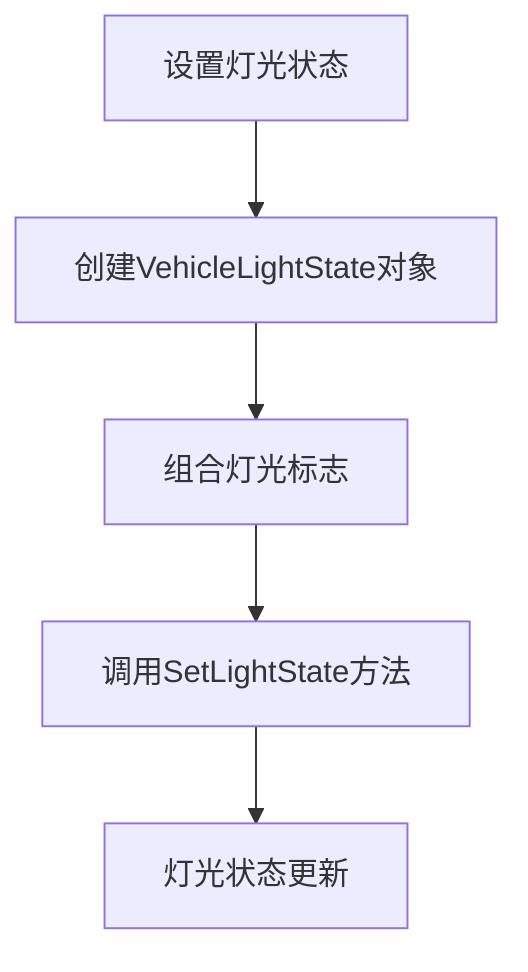
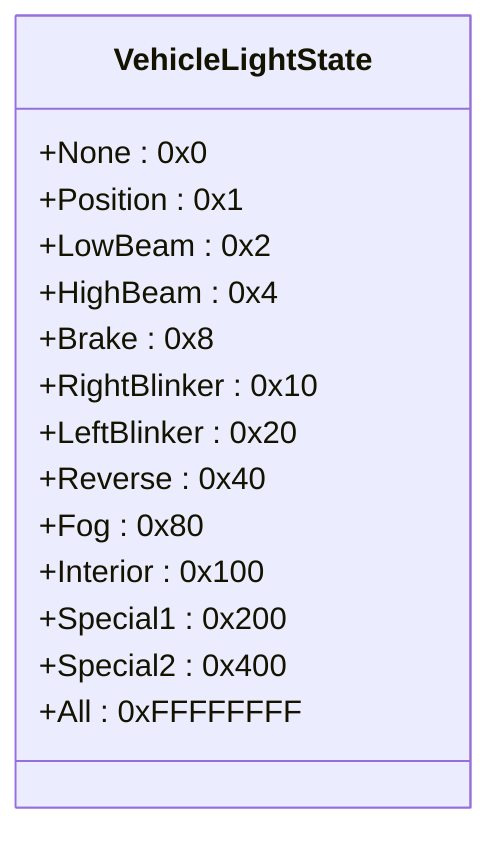
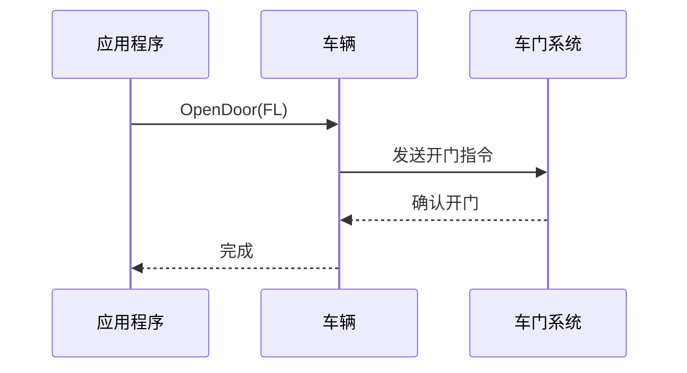
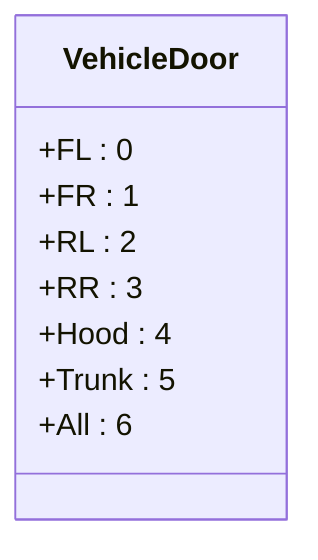

# 车辆灯光与部件控制


**本文档引用的文件**  
- [Vehicle.h](https://github.com/carla-simulator/carla/blob/ue5-dev/LibCarla/source/carla/client/Vehicle.h)
- [VehicleLightState.h](https://github.com/carla-simulator/carla/blob/ue5-dev/LibCarla/source/carla/rpc/VehicleLightState.h)
- [VehicleDoor.h](https://github.com/carla-simulator/carla/blob/ue5-dev/LibCarla/source/carla/rpc/VehicleDoor.h)
- [LightManager.h](https://github.com/carla-simulator/carla/blob/ue5-dev/LibCarla/source/carla/client/LightManager.h)
- [Light.h](https://github.com/carla-simulator/carla/blob/ue5-dev/LibCarla/source/carla/client/Light.h)
- [vehicle_lights_demo.py](https://github.com/carla-simulator/carla/blob/ue5-dev/PythonAPI/examples/vehicle_lights_demo.py)
- [vehicle_doors_demo.py](https://github.com/carla-simulator/carla/blob/ue5-dev/PythonAPI/examples/vehicle_doors_demo.py)
- [Actor.cpp](https://github.com/carla-simulator/carla/blob/ue5-dev/PythonAPI/carla/src/Actor.cpp)
- [Simulator.h](https://github.com/carla-simulator/carla/blob/ue5-dev/LibCarla/source/carla/client/detail/Simulator.h)


## 目录
1. [简介](#简介)
2. [车辆灯光控制接口](#车辆灯光控制接口)
3. [VehicleLightState枚举类型详解](#vehiclelightstate枚举类型详解)
4. [车辆灯光动态控制示例](#车辆灯光动态控制示例)
5. [可动部件控制](#可动部件控制)
6. [API参考](#api参考)
7. [渲染表现与性能影响](#渲染表现与性能影响)
8. [结论](#结论)

## 简介

CARLA仿真平台提供了全面的车辆附加组件控制接口，允许开发者精确控制车辆的灯光状态和可动部件。本文档详细介绍了如何通过`set_light_state()`方法控制车辆的主灯、刹车灯、转向灯和雾灯等灯光系统，以及如何通过`set_door_state`方法控制车门开关。文档涵盖了`VehicleLightState`枚举类型的组合方式和使用场景，提供了代码示例展示真实驾驶中的灯光操作，并为开发者提供了完整的API参考。

**Section sources**
- [Vehicle.h](https://github.com/carla-simulator/carla/blob/ue5-dev/LibCarla/source/carla/client/Vehicle.h#L38-L40)
- [VehicleLightState.h](https://github.com/carla-simulator/carla/blob/ue5-dev/LibCarla/source/carla/rpc/VehicleLightState.h#L32-L45)

## 车辆灯光控制接口

CARLA通过`Vehicle`类提供的`SetLightState`方法实现车辆灯光的控制。该方法接受一个`VehicleLightState`类型的参数，用于设置车辆的灯光状态。灯光状态通过位标志（bit flags）的方式组合，允许同时控制多个灯光组件。



**Diagram sources**
- [Vehicle.h](https://github.com/carla-simulator/carla/blob/ue5-dev/LibCarla/source/carla/client/Vehicle.h#L76)
- [Vehicle.cpp](https://github.com/carla-simulator/carla/blob/ue5-dev/LibCarla/source/carla/client/Vehicle.cpp#L82-L84)

## VehicleLightState枚举类型详解

`VehicleLightState`枚举类型定义了车辆所有可控制的灯光模式，通过位标志的方式实现组合控制。每个灯光模式对应一个特定的位值，可以通过按位或操作组合多个灯光状态。



**Diagram sources**
- [VehicleLightState.h](https://github.com/carla-simulator/carla/blob/ue5-dev/LibCarla/source/carla/rpc/VehicleLightState.h#L32-L45)

### 灯光模式说明

- **Position（位置灯）**: 车辆的示宽灯，用于夜间或低能见度条件下显示车辆轮廓
- **LowBeam（近光灯）**: 夜间行车的主要照明灯光，照射距离较短但不会影响对向车辆
- **HighBeam（远光灯）**: 夜间行车的远距离照明灯光，照射距离长但会干扰对向车辆
- **Brake（刹车灯）**: 车辆制动时亮起的红色灯光，提醒后方车辆
- **RightBlinker/LeftBlinker（右/左转向灯）**: 车辆转向时闪烁的灯光，指示转向意图
- **Reverse（倒车灯）**: 车辆挂入倒挡时亮起的白色灯光
- **Fog（雾灯）**: 恶劣天气条件下使用的辅助照明灯光
- **Interior（车内灯）**: 车辆内部照明灯光
- **Special1/Special2（特殊灯）**: 特殊用途灯光，如警车的警灯

**Section sources**
- [VehicleLightState.h](https://github.com/carla-simulator/carla/blob/ue5-dev/LibCarla/source/carla/rpc/VehicleLightState.h#L32-L45)

## 车辆灯光动态控制示例

以下代码示例展示了如何实现车辆灯光的动态控制，模拟真实驾驶中的灯光操作：

```python
# 获取当前灯光状态
current_lights = vehicle.get_light_state()

# 开启近光灯和位置灯
current_lights |= carla.VehicleLightState.LowBeam
current_lights |= carla.VehicleLightState.Position

# 设置新的灯光状态
vehicle.set_light_state(carla.VehicleLightState(current_lights))

# 模拟刹车时亮起刹车灯
current_lights |= carla.VehicleLightState.Brake
vehicle.set_light_state(carla.VehicleLightState(current_lights))

# 模拟左转时开启左转向灯
current_lights |= carla.VehicleLightState.LeftBlinker
vehicle.set_light_state(carla.VehicleLightState(current_lights))
```

**Section sources**
- [vehicle_lights_demo.py](https://github.com/carla-simulator/carla/blob/ue5-dev/PythonAPI/examples/vehicle_lights_demo.py#L65-L102)

## 可动部件控制

除了灯光控制，CARLA还提供了车辆其他可动部件的控制接口，主要包括车门和车窗的控制。

### 车门控制

车门控制通过`OpenDoor`和`CloseDoor`方法实现，支持控制车辆的各个车门。



**Diagram sources**
- [Vehicle.h](https://github.com/carla-simulator/carla/blob/ue5-dev/LibCarla/source/carla/client/Vehicle.h#L70-L73)
- [Vehicle.cpp](https://github.com/carla-simulator/carla/blob/ue5-dev/LibCarla/source/carla/client/Vehicle.cpp#L74-L79)

### VehicleDoor枚举类型



**Diagram sources**
- [VehicleDoor.h](https://github.com/carla-simulator/carla/blob/ue5-dev/LibCarla/source/carla/rpc/VehicleDoor.h#L16-L24)

**Section sources**
- [vehicle_doors_demo.py](https://github.com/carla-simulator/carla/blob/ue5-dev/PythonAPI/examples/vehicle_doors_demo.py#L76-L96)

## API参考

### 车辆灯光控制API

| 方法 | 参数 | 描述 |
|------|------|------|
| `SetLightState` | `const LightState &light_state` | 设置车辆的灯光状态 |
| `GetLightState` | 无 | 获取当前车辆的灯光状态 |
| `GetLightStateEnum` | 无 | 获取灯光状态的枚举值 |
| `GetLightStateAsValue` | 无 | 获取灯光状态的数值表示 |

### 车门控制API

| 方法 | 参数 | 描述 |
|------|------|------|
| `OpenDoor` | `const VehicleDoor door_idx` | 打开指定车门 |
| `CloseDoor` | `const VehicleDoor door_idx` | 关闭指定车门 |

### 状态查询方法

- `GetLightState()`: 获取当前车辆的灯光状态
- `IsActive()`: 检查特定灯光是否开启
- `GetColor()`: 获取灯光颜色
- `GetIntensity()`: 获取灯光强度

**Section sources**
- [Vehicle.h](https://github.com/carla-simulator/carla/blob/ue5-dev/LibCarla/source/carla/client/Vehicle.h#L76-L101)
- [Actor.cpp](https://github.com/carla-simulator/carla/blob/ue5-dev/PythonAPI/carla/src/Actor.cpp#L190-L195)

## 渲染表现与性能影响

车辆灯光和部件控制在仿真环境中的渲染表现受到多种因素影响：

### 渲染表现

- **灯光效果**: CARLA使用基于物理的渲染（PBR）技术，灯光效果逼真，包括光照衰减、阴影投射等
- **材质交互**: 灯光与车辆表面材质相互作用，产生真实的反射和散射效果
- **环境光照**: 车辆灯光与环境光照系统集成，影响场景的整体照明

### 性能影响

- **GPU负载**: 复杂的灯光效果会增加GPU的渲染负载
- **内存使用**: 动态灯光和部件动画需要额外的内存资源
- **帧率影响**: 高密度的车辆灯光和部件控制可能影响仿真帧率

优化建议：
- 合理使用灯光，避免不必要的灯光组合
- 在不需要高精度仿真的场景中，可以降低灯光质量设置
- 批量处理灯光状态更新，减少API调用频率

**Section sources**
- [CarlaSettingsDelegate.cpp](https://github.com/carla-simulator/carla/blob/ue5-dev/Unreal/CarlaUnreal/Plugins/Carla/Source/Carla/Settings/CarlaSettingsDelegate.cpp#L405-L457)
- [USDImporterWidget.cpp](https://github.com/carla-simulator/carla/blob/ue5-dev/Unreal/CarlaUnreal/Plugins/CarlaTools/Source/CarlaTools/Private/USDImporterWidget.cpp#L506-L557)

## 结论

CARLA提供了全面且灵活的车辆灯光和可动部件控制接口，使开发者能够精确模拟真实驾驶场景中的各种灯光操作和部件运动。通过`VehicleLightState`枚举类型和位标志组合，可以实现复杂的灯光控制逻辑。车门控制接口则允许模拟车辆的进出操作。这些功能对于自动驾驶算法的测试和验证至关重要，能够创建更加真实和多样化的仿真场景。