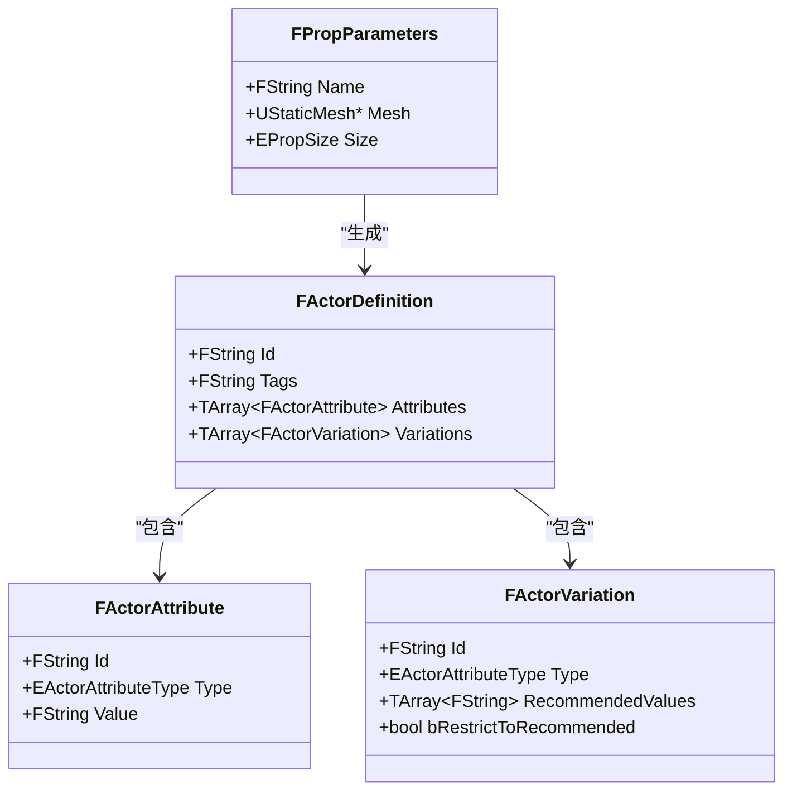
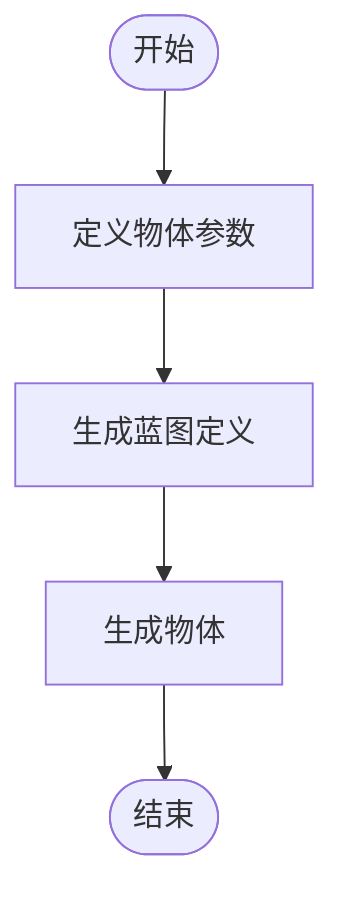
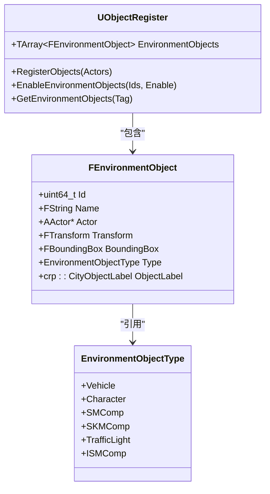
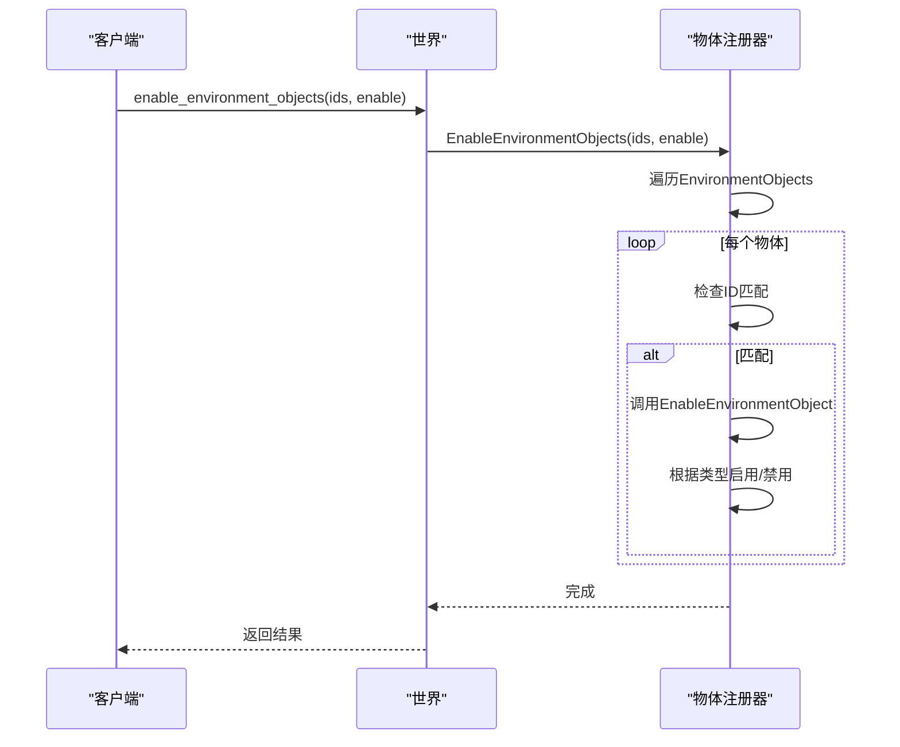
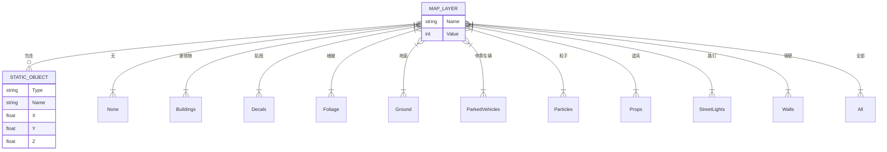
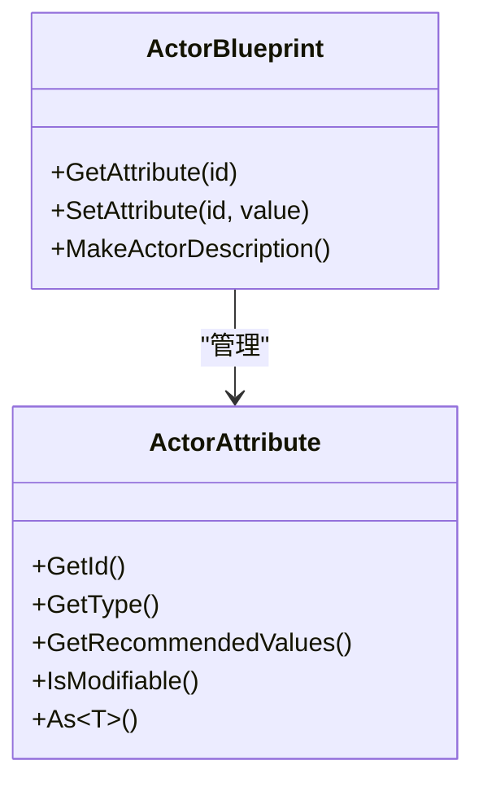
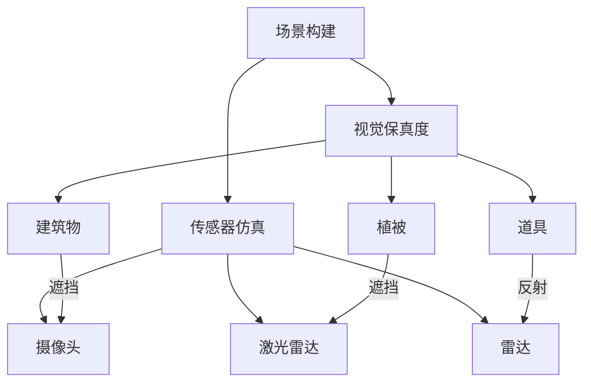

# 静态物体管理


**本文档引用的文件**  
- [ActorBlueprintFunctionLibrary.cpp](https://github.com/carla-simulator/carla/blob/ue5-dev/Unreal/CarlaUnreal/Plugins/Carla/Source/Carla/Actor/ActorBlueprintFunctionLibrary.cpp)
- [ObjectRegister.cpp](https://github.com/carla-simulator/carla/blob/ue5-dev/Unreal/CarlaUnreal/Plugins/Carla/Source/Carla/Util/ObjectRegister.cpp)
- [PropActorFactory.cpp](https://github.com/carla-simulator/carla/blob/ue5-dev/Unreal/CarlaUnreal/Plugins/Carla/Source/Carla/Actor/Factory/PropActorFactory.cpp)
- [PropParameters.h](https://github.com/carla-simulator/carla/blob/ue5-dev/Unreal/CarlaUnreal/Plugins/Carla/Source/Carla/Actor/PropParameters.h)
- [CarlaGameModeBase.cpp](https://github.com/carla-simulator/carla/blob/ue5-dev/Unreal/CarlaUnreal/Plugins/Carla/Source/Carla/Game/CarlaGameModeBase.cpp)
- [MapLayer.cpp](https://github.com/carla-simulator/carla/blob/ue5-dev/LibCarla/source/carla/rpc/MapLayer.cpp)
- [Blueprint.cpp](https://github.com/carla-simulator/carla/blob/ue5-dev/PythonAPI/carla/src/Blueprint.cpp)
- [bp_library.md](https://github.com/carla-simulator/carla/blob/ue5-dev/Docs/bp_library.md)
- [carla.World.load_map_layer.py](https://github.com/carla-simulator/carla/blob/ue5-dev/PythonAPI/docs/snipets/carla.World.load_map_layer.py)
- [change_map_layer.py](https://github.com/carla-simulator/carla/blob/ue5-dev/PythonAPI/util/change_map_layer.py)
- [manage_environment_objects.py](https://github.com/carla-simulator/carla/blob/ue5-dev/PythonAPI/util/manage_environment_objects.py)


## 目录
1. [简介](#简介)
2. [静态物体创建与配置](#静态物体创建与配置)
3. [环境物体管理](#环境物体管理)
4. [地图层级管理](#地图层级管理)
5. [属性配置与批量操作](#属性配置与批量操作)
6. [场景构建与传感器仿真](#场景构建与传感器仿真)
7. [初学者教程](#初学者教程)
8. [高级应用](#高级应用)
9. [结论](#结论)

## 简介

CARLA仿真平台提供了强大的静态物体管理系统，允许用户创建和管理各种环境物体，如交通标志、路灯、建筑和其他环境装饰物。本文档详细介绍了如何使用Actor蓝图系统生成静态物体，配置其属性，以及管理大规模场景中的物体。通过理解这些机制，用户可以有效地构建复杂的仿真环境，满足自动驾驶测试和研究的需求。

**Section sources**
- [ActorBlueprintFunctionLibrary.cpp](https://github.com/carla-simulator/carla/blob/ue5-dev/Unreal/CarlaUnreal/Plugins/Carla/Source/Carla/Actor/ActorBlueprintFunctionLibrary.cpp#L283-L301)
- [bp_library.md](https://github.com/carla-simulator/carla/blob/ue5-dev/Docs/bp_library.md#L260-L652)

## 静态物体创建与配置

在CARLA中，静态物体通过Actor蓝图系统进行创建和配置。每个静态物体都有一个唯一的蓝图定义，包含其ID、标签、属性和变体。这些定义在`ActorBlueprintFunctionLibrary`中通过`MakePropDefinition`函数生成。



**Diagram sources**
- [ActorBlueprintFunctionLibrary.cpp](https://github.com/carla-simulator/carla/blob/ue5-dev/Unreal/CarlaUnreal/Plugins/Carla/Source/Carla/Actor/ActorBlueprintFunctionLibrary.cpp#L1058-L1102)
- [PropParameters.h](https://github.com/carla-simulator/carla/blob/ue5-dev/Unreal/CarlaUnreal/Plugins/Carla/Source/Carla/Actor/PropParameters.h#L29-L42)

静态物体的创建过程涉及以下几个步骤：
1. 定义物体参数，包括名称、网格和大小。
2. 使用`MakePropDefinition`函数生成蓝图定义。
3. 通过`SpawnActor`方法在指定位置生成物体。



**Diagram sources**
- [PropActorFactory.cpp](https://github.com/carla-simulator/carla/blob/ue5-dev/Unreal/CarlaUnreal/Plugins/Carla/Source/Carla/Actor/Factory/PropActorFactory.cpp#L30-L113)
- [ActorBlueprintFunctionLibrary.cpp](https://github.com/carla-simulator/carla/blob/ue5-dev/Unreal/CarlaUnreal/Plugins/Carla/Source/Carla/Actor/ActorBlueprintFunctionLibrary.cpp#L1058-L1102)

## 环境物体管理

CARLA使用`ObjectRegister`类来管理环境中的所有物体。这个类负责注册、启用和禁用环境物体，并维护一个包含所有物体信息的数组。



**Diagram sources**
- [ObjectRegister.cpp](https://github.com/carla-simulator/carla/blob/ue5-dev/Unreal/CarlaUnreal/Plugins/Carla/Source/Carla/Util/ObjectRegister.cpp#L23-L128)
- [ObjectRegister.h](https://github.com/carla-simulator/carla/blob/ue5-dev/Unreal/CarlaUnreal/Plugins/Carla/Source/Carla/Util/ObjectRegister.h#L20-L69)

环境物体的管理主要包括以下功能：
- **注册物体**：将场景中的物体添加到管理器中。
- **启用/禁用物体**：通过`EnableEnvironmentObjects`方法控制物体的可见性和交互性。
- **查询物体**：根据标签或类型获取特定的物体集合。



**Diagram sources**
- [CarlaGameModeBase.cpp](https://github.com/carla-simulator/carla/blob/ue5-dev/Unreal/CarlaUnreal/Plugins/Carla/Source/Carla/Game/CarlaGameModeBase.cpp#L648-L653)
- [ObjectRegister.cpp](https://github.com/carla-simulator/carla/blob/ue5-dev/Unreal/CarlaUnreal/Plugins/Carla/Source/Carla/Util/ObjectRegister.cpp#L108-L127)

## 地图层级管理

CARLA支持通过地图层级（Map Layer）来组织和管理大规模场景中的物体。不同的地图层级包含不同类型的物体，如建筑物、植被、停靠车辆等。



**Diagram sources**
- [MapLayer.cpp](https://github.com/carla-simulator/carla/blob/ue5-dev/LibCarla/source/carla/rpc/MapLayer.cpp#L12-L33)
- [CarlaGameModeBase.cpp](https://github.com/carla-simulator/carla/blob/ue5-dev/Unreal/CarlaUnreal/Plugins/Carla/Source/Carla/Game/CarlaGameModeBase.cpp#L655-L703)

地图层级的管理通过以下方法实现：
- **加载层级**：使用`load_map_layer`方法加载指定的层级。
- **卸载层级**：使用`unload_map_layer`方法卸载指定的层级。

```python
# 加载建筑物层级
world.load_map_layer(carla.MapLayer.Buildings)

# 加载植被层级
world.load_map_layer(carla.MapLayer.Foliage)

# 加载停靠车辆层级
world.load_map_layer(carla.MapLayer.ParkedVehicles)
```

**Section sources**
- [carla.World.load_map_layer.py](https://github.com/carla-simulator/carla/blob/ue5-dev/PythonAPI/docs/snipets/carla.World.load_map_layer.py#L1-L13)
- [change_map_layer.py](https://github.com/carla-simulator/carla/blob/ue5-dev/PythonAPI/util/change_map_layer.py#L54-L59)

## 属性配置与批量操作

静态物体的属性配置是通过蓝图系统的属性和变体来实现的。每个物体可以有多个属性，如大小、颜色、质量等，这些属性可以在运行时动态修改。



**Diagram sources**
- [Blueprint.cpp](https://github.com/carla-simulator/carla/blob/ue5-dev/PythonAPI/carla/src/Blueprint.cpp#L88-L98)
- [ActorBlueprint.cpp](https://github.com/carla-simulator/carla/blob/ue5-dev/LibCarla/source/carla/client/ActorBlueprint.cpp#L17-L67)

批量操作允许用户同时创建和配置多个静态物体，提高场景构建的效率。这通常通过以下步骤实现：
1. 创建蓝图库并过滤出所需的物体类型。
2. 批量设置属性。
3. 使用`apply_batch_sync`方法同步生成所有物体。

```python
# 批量生成静态物体
blueprints = world.get_blueprint_library().filter('static.prop.*')
for bp in blueprints:
    bp.set_attribute('size', 'medium')

batch = []
for i in range(100):
    transform = carla.Transform(carla.Location(x=i*10, y=0, z=0))
    blueprint = random.choice(blueprints)
    batch.append(carla.command.SpawnActor(blueprint, transform))

results = client.apply_batch_sync(batch)
```

**Section sources**
- [Blueprint.cpp](https://github.com/carla-simulator/carla/blob/ue5-dev/PythonAPI/carla/src/Blueprint.cpp#L101-L113)
- [manage_environment_objects.py](https://github.com/carla-simulator/carla/blob/ue5-dev/PythonAPI/util/manage_environment_objects.py#L109-L141)

## 场景构建与传感器仿真

静态物体在场景构建中起着至关重要的作用，不仅影响视觉保真度，还对传感器仿真产生重要影响。例如，建筑物和植被可以造成遮挡效果，影响摄像头和激光雷达的感知。



**Diagram sources**
- [bp_library.md](https://github.com/carla-simulator/carla/blob/ue5-dev/Docs/bp_library.md#L260-L652)
- [CarlaGameModeBase.cpp](https://github.com/carla-simulator/carla/blob/ue5-dev/Unreal/CarlaUnreal/Plugins/Carla/Source/Carla/Game/CarlaGameModeBase.cpp#L775-L779)

为了优化传感器仿真，用户可以：
- 调整物体的材质属性，以模拟不同的反射特性。
- 使用碰撞属性来控制物体与传感器的交互。
- 动态修改物体的位置和状态，以测试不同场景下的传感器性能。

## 初学者教程

对于初学者，以下是一个简单的教程，介绍如何在CARLA中添加一个静态物体：

1. **连接到CARLA服务器**：
   ```python
   client = carla.Client('localhost', 2000)
   world = client.get_world()
   ```

2. **获取蓝图库并选择物体**：
   ```python
   blueprint_library = world.get_blueprint_library()
   prop_bp = blueprint_library.find('static.prop.bench01')
   ```

3. **设置物体属性**：
   ```python
   prop_bp.set_attribute('size', 'medium')
   ```

4. **定义生成位置**：
   ```python
   transform = carla.Transform(carla.Location(x=100, y=0, z=0))
   ```

5. **生成物体**：
   ```python
   prop = world.spawn_actor(prop_bp, transform)
   ```

6. **验证生成结果**：
   ```python
   print(f'生成物体: {prop.id}')
   ```

**Section sources**
- [carla.World.load_map_layer.py](https://github.com/carla-simulator/carla/blob/ue5-dev/PythonAPI/docs/snipets/carla.World.load_map_layer.py#L1-L13)
- [Blueprint.cpp](https://github.com/carla-simulator/carla/blob/ue5-dev/PythonAPI/carla/src/Blueprint.cpp#L88-L98)

## 高级应用

对于高级用户，CARLA提供了更复杂的场景管理和优化技术：

1. **物体层级管理**：通过自定义蓝图和层级系统，组织大规模场景中的物体。
2. **大规模场景优化**：使用流式加载和卸载技术，管理内存和性能。
3. **自定义静态物体资源**：集成自定义的3D模型和材质，扩展CARLA的物体库。

```python
# 自定义静态物体资源
def add_custom_prop(static_mesh_path, name, size):
    # 加载自定义网格
    mesh = load_object(UStaticMesh, static_mesh_path)
    
    # 创建物体参数
    prop_params = FPropParameters()
    prop_params.Name = name
    prop_params.Mesh = mesh
    prop_params.Size = str_to_size(size)
    
    # 保存到配置文件
    save_prop_parameters_array([prop_params], 'CustomProps.json')
```

**Section sources**
- [PropActorFactory.cpp](https://github.com/carla-simulator/carla/blob/ue5-dev/Unreal/CarlaUnreal/Plugins/Carla/Source/Carla/Actor/Factory/PropActorFactory.cpp#L172-L187)
- [add_prop_to_prop_factory.py](https://github.com/carla-simulator/carla/blob/ue5-dev/Unreal/CarlaUnreal/Plugins/CarlaTools/Content/Python/add_prop_to_prop_factory.py#L1-L58)

## 结论

CARLA的静态物体管理系统为用户提供了强大的工具来创建和管理复杂的仿真环境。通过理解蓝图系统、环境物体管理和地图层级机制，用户可以有效地构建高保真的场景，满足各种自动驾驶测试和研究需求。无论是初学者还是高级用户，都可以利用这些功能来提升仿真质量和效率。