# OpenDRIVE 集成

> **引用文件**
> **本文档中引用的文件**

- [OpenDriveParser.h](https://github.com/carla-simulator/carla/blob/ue5-dev/LibCarla/source/carla/opendrive/OpenDriveParser.h)
- [OpenDriveParser.cpp](https://github.com/carla-simulator/carla/blob/ue5-dev/LibCarla/source/carla/opendrive/OpenDriveParser.cpp)
- [Map.h](https://github.com/carla-simulator/carla/blob/ue5-dev/LibCarla/source/carla/road/Map.h)
- [Map.cpp](https://github.com/carla-simulator/carla/blob/ue5-dev/LibCarla/source/carla/road/Map.cpp)
- [MapBuilder.h](https://github.com/carla-simulator/carla/blob/ue5-dev/LibCarla/source/carla/road/MapBuilder.h)
- [MapBuilder.cpp](https://github.com/carla-simulator/carla/blob/ue5-dev/LibCarla/source/carla/road/MapBuilder.cpp)
- [GeoReferenceParser.h](https://github.com/carla-simulator/carla/blob/ue5-dev/LibCarla/source/carla/opendrive/parser/GeoReferenceParser.h)
- [RoadParser.h](https://github.com/carla-simulator/carla/blob/ue5-dev/LibCarla/source/carla/opendrive/parser/RoadParser.h)
- [LaneParser.h](https://github.com/carla-simulator/carla/blob/ue5-dev/LibCarla/source/carla/opendrive/parser/LaneParser.h)
- [Map.cpp](https://github.com/carla-simulator/carla/blob/ue5-dev/PythonAPI/carla/src/Map.cpp)
- [OpenDrive.cpp](https://github.com/carla-simulator/carla/blob/ue5-dev/LibCarla/source/test/client/OpenDrive.cpp)
- [OpenDrive.h](https://github.com/carla-simulator/carla/blob/ue5-dev/Unreal/CarlaUnreal/Plugins/Carla/Source/Carla/OpenDrive/OpenDrive.h)
- [OpenDriveToMap.h](https://github.com/carla-simulator/carla/blob/ue5-dev/Unreal/CarlaUnreal/Plugins/CarlaTools/Source/CarlaTools/Public/OpenDriveToMap.h)

## 目录

1. [简介](#简介)
2. [OpenDRIVE 解析器工作流程](#opendrive解析器工作流程)
3. [核心数据结构](#核心数据结构)
4. [OpenDRIVE 标准支持](#opendrive标准支持)
5. [代码示例](#代码示例)
6. [文件结构与坐标系](#文件结构与坐标系)
7. [Unreal Engine 中的可视化](#unreal-engine中的可视化)
8. [性能优化与扩展](#性能优化与扩展)
9. [错误处理](#错误处理)
10. [结论](#结论)

## 简介

CARLA 模拟器通过 OpenDRIVE 集成实现了对标准道路网络文件的解析和内部地图表示的转换。OpenDRIVE 是一种用于描述道路网络的开放标准，CARLA 利用该标准来创建高精度的虚拟环境。本文档详细介绍了 OpenDRIVE 解析器的工作流程、支持的关键元素以及如何在 CARLA 中使用自定义 OpenDRIVE 地图。

**Section sources**

- <a href="https://github.com/carla-simulator/carla/blob/ue5-dev/LibCarla/source/carla/opendrive/OpenDriveParser.h#L1-L26" target="_blank">OpenDriveParser.h</a>
- <a href="https://github.com/carla-simulator/carla/blob/ue5-dev/LibCarla/source/carla/opendrive/OpenDriveParser.cpp#L1-L54" target="_blank">OpenDriveParser.cpp</a>

## OpenDRIVE 解析器工作流程

OpenDRIVE 解析器的核心是`OpenDriveParser`类，它负责将 OpenDRIVE XML 文件解析为 CARLA 内部的地图表示。解析过程遵循一系列有序的步骤，确保所有道路元素被正确处理。

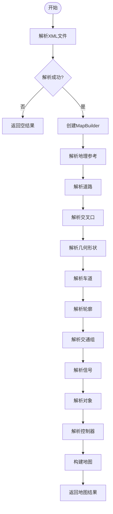

**Diagram sources**

- <a href="https://github.com/carla-simulator/carla/blob/ue5-dev/LibCarla/source/carla/opendrive/OpenDriveParser.cpp#L27-L50" target="_blank">OpenDriveParser.cpp</a>

**Section sources**

- <a href="https://github.com/carla-simulator/carla/blob/ue5-dev/LibCarla/source/carla/opendrive/OpenDriveParser.cpp#L27-L50" target="_blank">OpenDriveParser.cpp</a>

## 核心数据结构

CARLA 使用一系列核心数据结构来表示 OpenDRIVE 地图。`Map`类是主要的数据容器，它通过`MapBuilder`在解析过程中逐步构建。

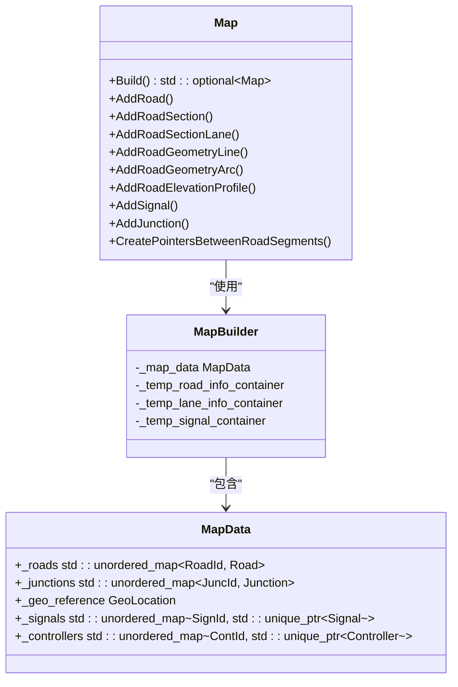

**Diagram sources**

- <a href="https://github.com/carla-simulator/carla/blob/ue5-dev/LibCarla/source/carla/road/MapBuilder.h#L20-L433" target="_blank">MapBuilder.h</a>
- <a href="https://github.com/carla-simulator/carla/blob/ue5-dev/LibCarla/source/carla/road/MapBuilder.cpp#L38-L800" target="_blank">MapBuilder.cpp</a>

**Section sources**

- <a href="https://github.com/carla-simulator/carla/blob/ue5-dev/LibCarla/source/carla/road/MapBuilder.h#L20-L433" target="_blank">MapBuilder.h</a>
- <a href="https://github.com/carla-simulator/carla/blob/ue5-dev/LibCarla/source/carla/road/MapBuilder.cpp#L38-L800" target="_blank">MapBuilder.cpp</a>

## OpenDRIVE 标准支持

CARLA 支持 OpenDRIVE 标准中的多种关键元素，包括道路几何、车道定义、交通标志和信号灯、交叉口以及路面标记。

### 道路几何支持

CARLA 支持 OpenDRIVE 中定义的各种道路几何类型，包括直线、圆弧、螺旋线和多项式曲线。

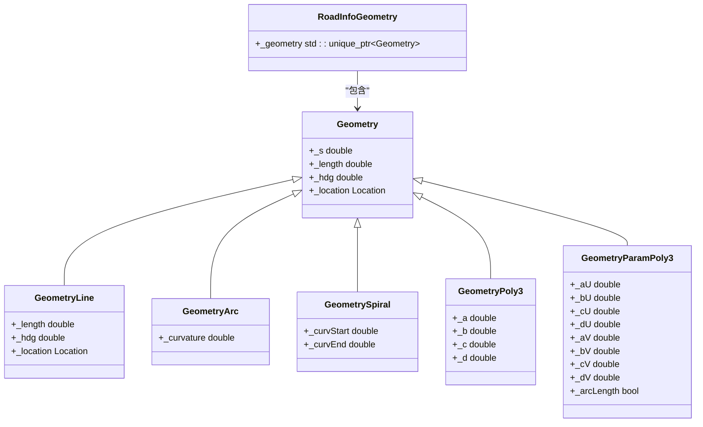

**Diagram sources**

- <a href="https://github.com/carla-simulator/carla/blob/ue5-dev/LibCarla/source/carla/road/MapBuilder.cpp#L414-L567" target="_blank">MapBuilder.cpp</a>

### 车道定义支持

CARLA 完整支持 OpenDRIVE 中的车道定义，包括车道类型、宽度、边界和材料属性。

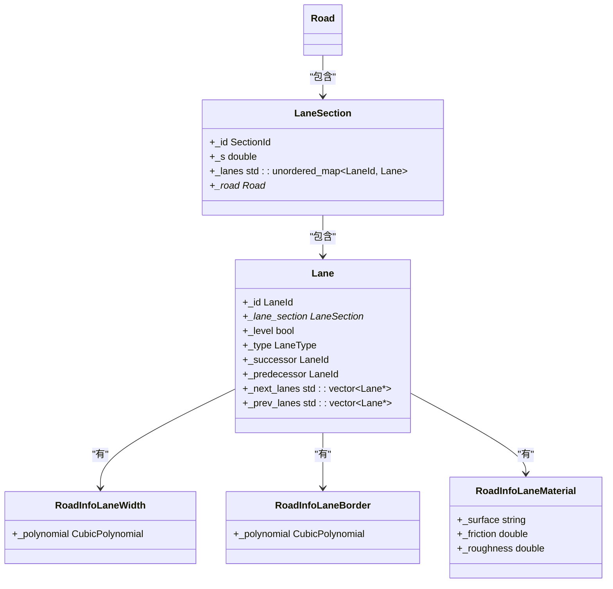

**Diagram sources**

- <a href="https://github.com/carla-simulator/carla/blob/ue5-dev/LibCarla/source/carla/road/MapBuilder.h#L40-L47" target="_blank">MapBuilder.h</a>
- <a href="https://github.com/carla-simulator/carla/blob/ue5-dev/LibCarla/source/carla/road/MapBuilder.cpp#L391-L412" target="_blank">MapBuilder.cpp</a>

### 交通标志和信号灯支持

CARLA 支持 OpenDRIVE 中的交通标志和信号灯定义，包括位置、类型、方向和有效性。

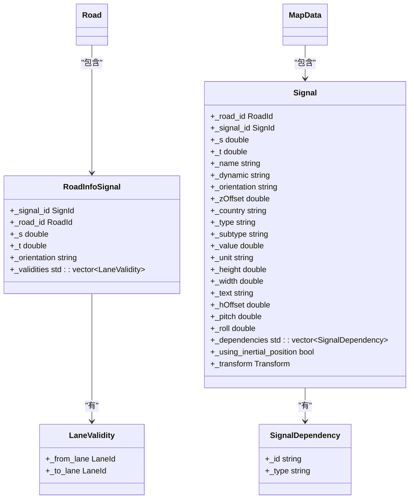

**Diagram sources**

- <a href="https://github.com/carla-simulator/carla/blob/ue5-dev/LibCarla/source/carla/road/MapBuilder.h#L155-L211" target="_blank">MapBuilder.h</a>
- <a href="https://github.com/carla-simulator/carla/blob/ue5-dev/LibCarla/source/carla/road/MapBuilder.cpp#L239-L352" target="_blank">MapBuilder.cpp</a>

### 交叉口支持

CARLA 支持 OpenDRIVE 中的交叉口定义，包括连接、车道链接和控制器。

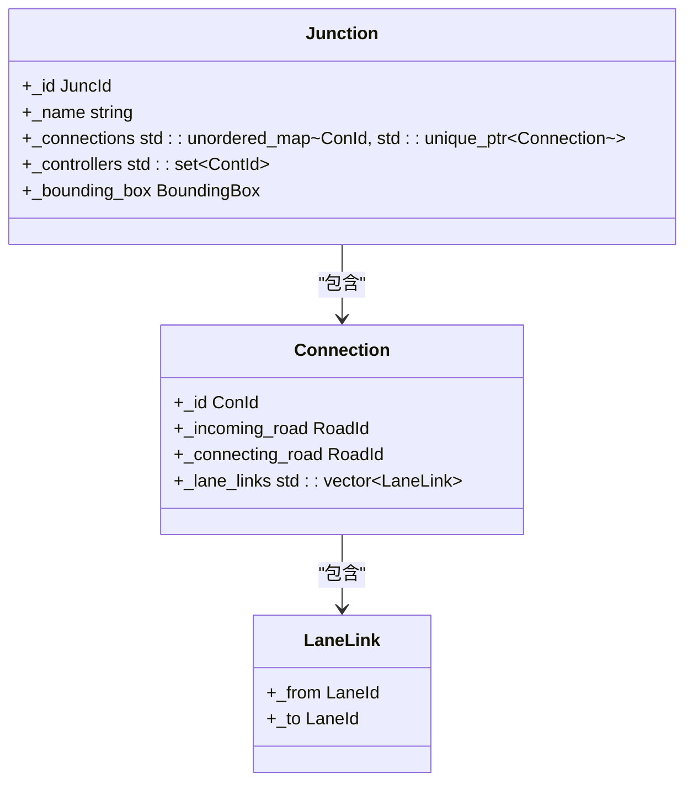

**Diagram sources**

- <a href="https://github.com/carla-simulator/carla/blob/ue5-dev/LibCarla/source/carla/road/MapBuilder.h#L213-L232" target="_blank">MapBuilder.h</a>
- <a href="https://github.com/carla-simulator/carla/blob/ue5-dev/LibCarla/source/carla/road/MapBuilder.cpp#L569-L597" target="_blank">MapBuilder.cpp</a>

**Section sources**

- <a href="https://github.com/carla-simulator/carla/blob/ue5-dev/LibCarla/source/carla/road/MapBuilder.h#L213-L232" target="_blank">MapBuilder.h</a>
- <a href="https://github.com/carla-simulator/carla/blob/ue5-dev/LibCarla/source/carla/road/MapBuilder.cpp#L569-L597" target="_blank">MapBuilder.cpp</a>

## 代码示例

以下代码示例展示了如何在 CARLA 中加载和使用 OpenDRIVE 地图。

### C++ API 示例

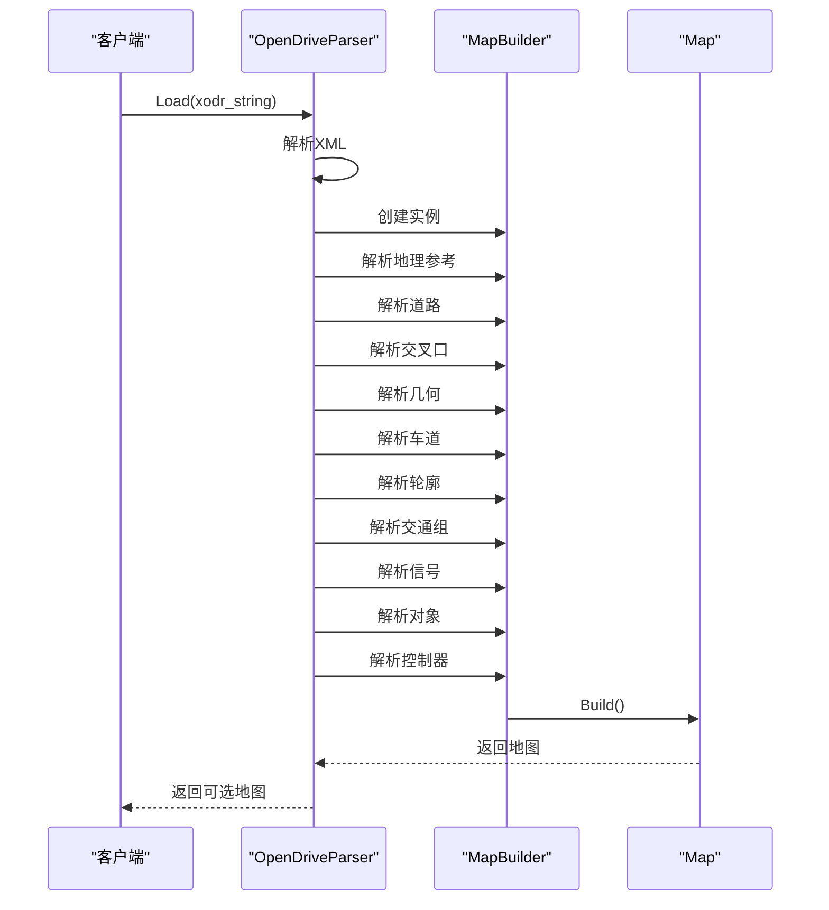

**Diagram sources**

- <a href="https://github.com/carla-simulator/carla/blob/ue5-dev/LibCarla/source/carla/opendrive/OpenDriveParser.cpp#L27-L50" target="_blank">OpenDriveParser.cpp</a>

### Python API 示例

```python
import carla

# 创建客户端
client = carla.Client('localhost', 2000)
client.set_timeout(10.0)

# 读取OpenDRIVE文件
with open('custom_map.xodr', 'r') as f:
    xodr_content = f.read()

# 生成地图
road_option = carla.OpendriveGenerationParameters()
road_option.vertex_distance = 2.0
road_option.max_road_length = 50.0
road_option.wall_height = 1.0
road_option.extra_width = 0.6
road_option.asynchronous = False
road_option.lane_width = 5.0

# 加载OpenDRIVE地图
world = client.generate_opendrive_world(xodr_content, road_option)

# 获取地图对象
map = world.get_map()

# 获取路点
waypoint = map.get_waypoint(carla.Location(x=0, y=0, z=0))

# 获取信号
signals = map.get_all_landmarks_of_type('1000001')
```

**Section sources**

- <a href="https://github.com/carla-simulator/carla/blob/ue5-dev/PythonAPI/carla/src/Map.cpp#L132-L147" target="_blank">Map.cpp</a>

## 文件结构与坐标系

### OpenDRIVE 文件结构要求

OpenDRIVE 文件必须遵循特定的 XML 结构，包含地理参考、道路、交叉口等元素。CARLA 支持 OpenDRIVE 1.4 和 1.5 版本的标准。

### 坐标系转换

CARLA 在地理坐标和 Unreal Engine 坐标之间进行转换。地理坐标使用 WGS84 坐标系，而 Unreal Engine 使用左手坐标系。

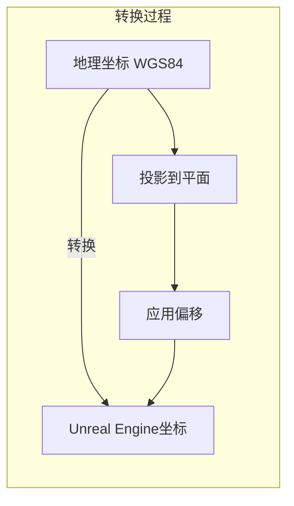

**Section sources**

- <a href="https://github.com/carla-simulator/carla/blob/ue5-dev/LibCarla/source/carla/road/MapBuilder.cpp#L363-L365" target="_blank">MapBuilder.cpp</a>
- <a href="https://github.com/carla-simulator/carla/blob/ue5-dev/PythonAPI/carla/src/Map.cpp#L49-L53" target="_blank">Map.cpp</a>

## Unreal Engine 中的可视化

CARLA 在 Unreal Engine 中提供了 OpenDRIVE 地图的可视化功能，允许用户在编辑器中查看和编辑地图。

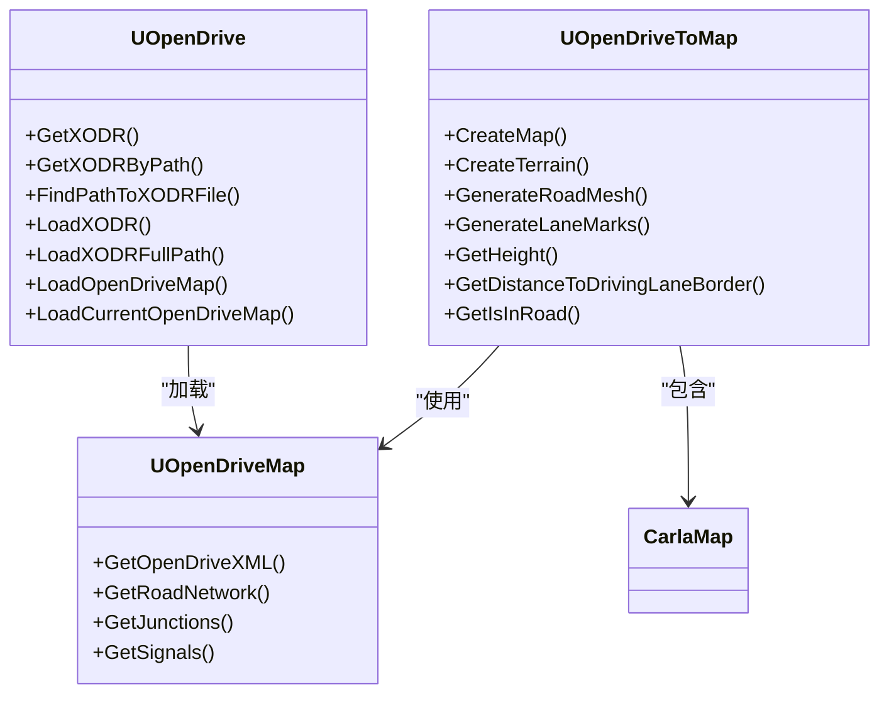

**Diagram sources**

- <a href="https://github.com/carla-simulator/carla/blob/ue5-dev/Unreal/CarlaUnreal/Plugins/Carla/Source/Carla/OpenDrive/OpenDrive.h#L17-L53" target="_blank">OpenDrive.h</a>
- <a href="https://github.com/carla-simulator/carla/blob/ue5-dev/Unreal/CarlaUnreal/Plugins/CarlaTools/Source/CarlaTools/Public/OpenDriveToMap.h#L31-L227" target="_blank">OpenDriveToMap.h</a>

**Section sources**

- <a href="https://github.com/carla-simulator/carla/blob/ue5-dev/Unreal/CarlaUnreal/Plugins/Carla/Source/Carla/OpenDrive/OpenDrive.h#L17-L53" target="_blank">OpenDrive.h</a>
- <a href="https://github.com/carla-simulator/carla/blob/ue5-dev/Unreal/CarlaUnreal/Plugins/CarlaTools/Source/CarlaTools/Public/OpenDriveToMap.h#L31-L227" target="_blank">OpenDriveToMap.h</a>

## 性能优化与扩展

### 内存管理

CARLA 的 OpenDRIVE 解析器采用高效的内存管理策略，使用临时容器存储解析过程中的数据，最后统一构建最终的地图结构。

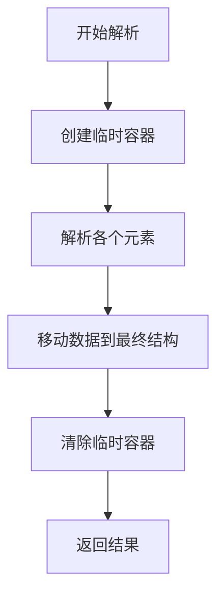

**Section sources**

- <a href="https://github.com/carla-simulator/carla/blob/ue5-dev/LibCarla/source/carla/road/MapBuilder.cpp#L38-L71" target="_blank">MapBuilder.cpp</a>

### 多线程支持

CARLA 支持多线程处理道路生成，提高大型地图的处理效率。

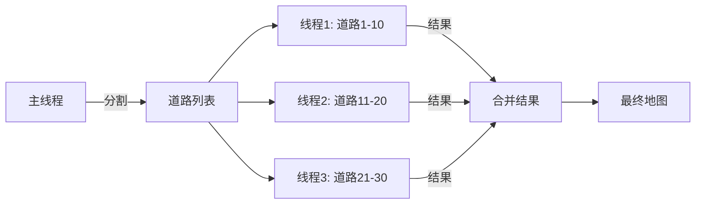

**Section sources**

- <a href="https://github.com/carla-simulator/carla/blob/ue5-dev/LibCarla/source/carla/road/Map.h#L231-L235" target="_blank">Map.h</a>

## 错误处理

OpenDRIVE 解析器实现了全面的错误处理机制，确保在解析失败时能够提供有用的反馈信息。

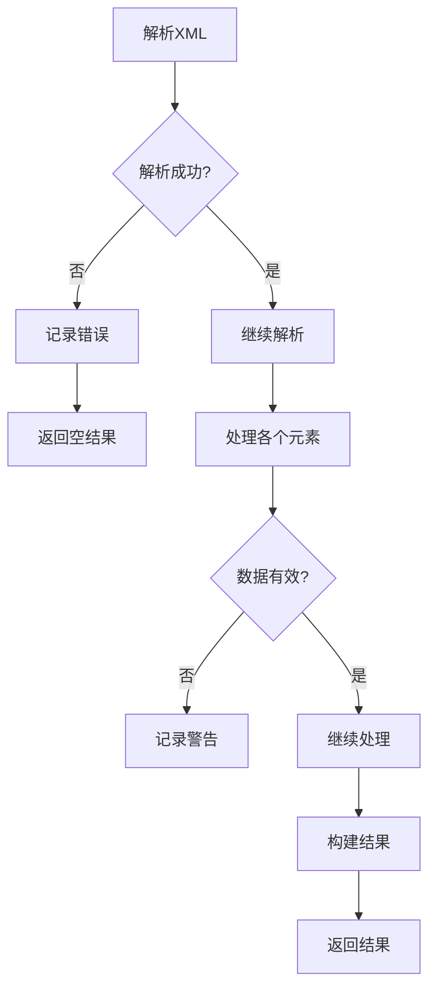

**Diagram sources**

- <a href="https://github.com/carla-simulator/carla/blob/ue5-dev/LibCarla/source/carla/opendrive/OpenDriveParser.cpp#L31-L34" target="_blank">OpenDriveParser.cpp</a>

**Section sources**

- <a href="https://github.com/carla-simulator/carla/blob/ue5-dev/LibCarla/source/carla/opendrive/OpenDriveParser.cpp#L31-L34" target="_blank">OpenDriveParser.cpp</a>

## 结论

CARLA 的 OpenDRIVE 集成提供了一个强大而灵活的框架，用于将标准 OpenDRIVE 文件转换为内部地图表示。通过模块化的解析器设计、全面的标准支持和高效的内存管理，CARLA 能够处理复杂的道路网络，为自动驾驶仿真提供高精度的虚拟环境。开发者可以利用提供的 API 轻松加载自定义地图，访问地图元素，并在 Unreal Engine 中进行可视化和编辑。
