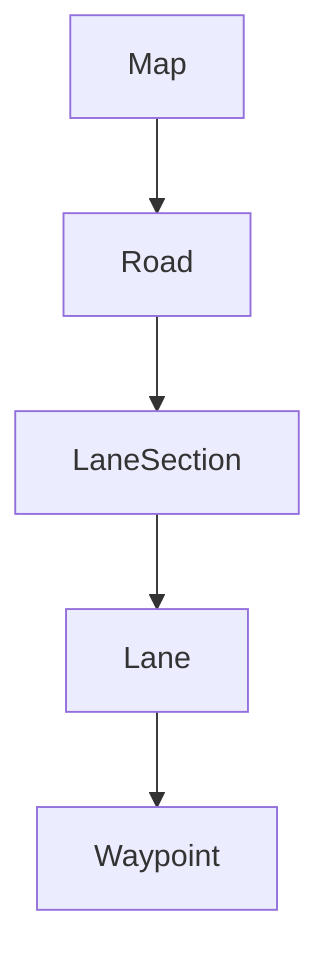
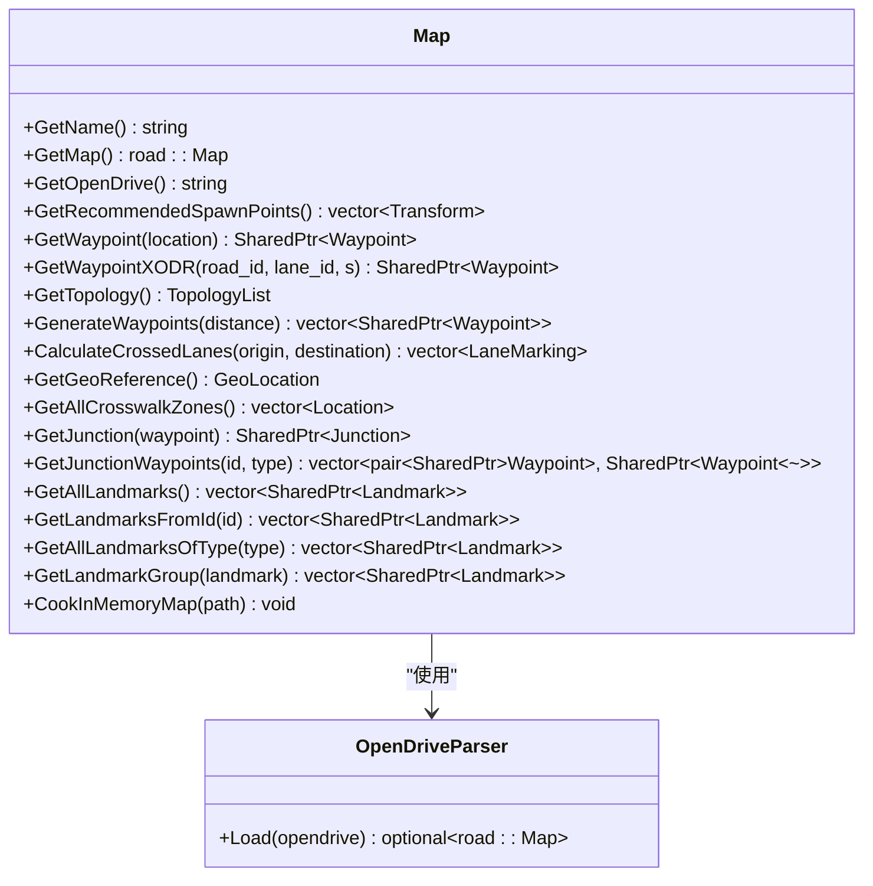
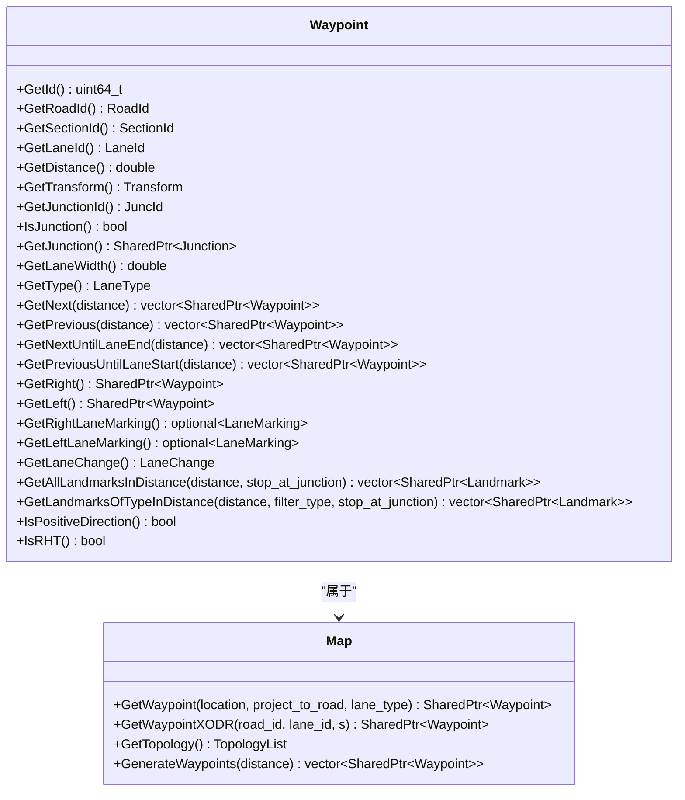
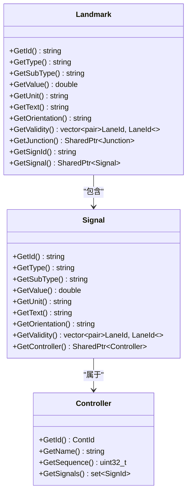
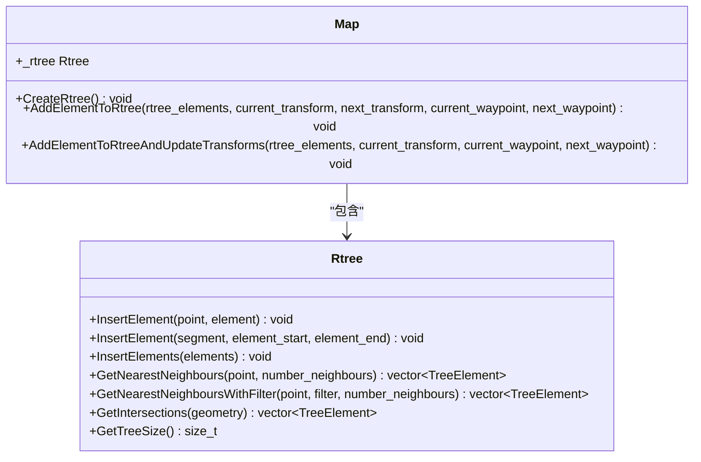
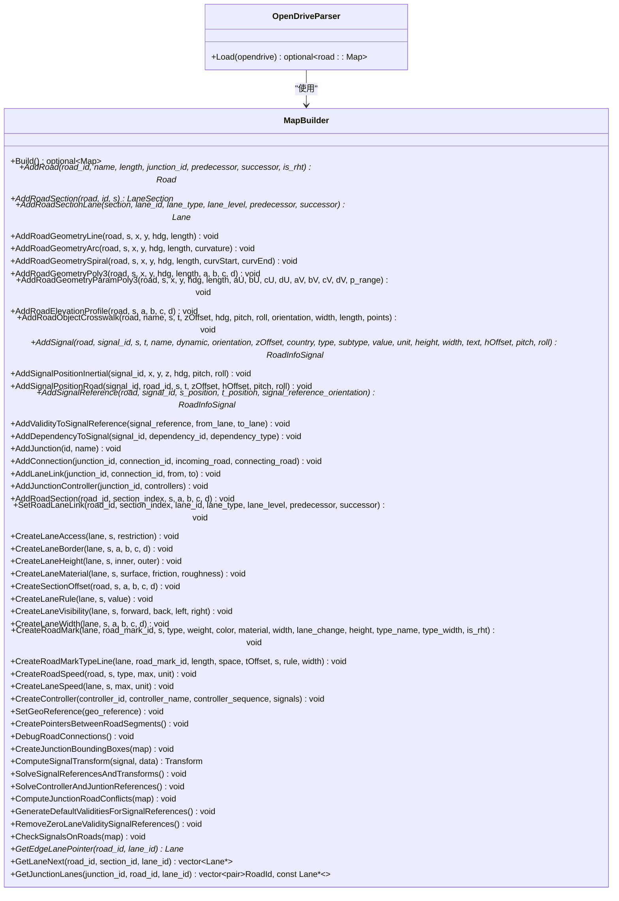
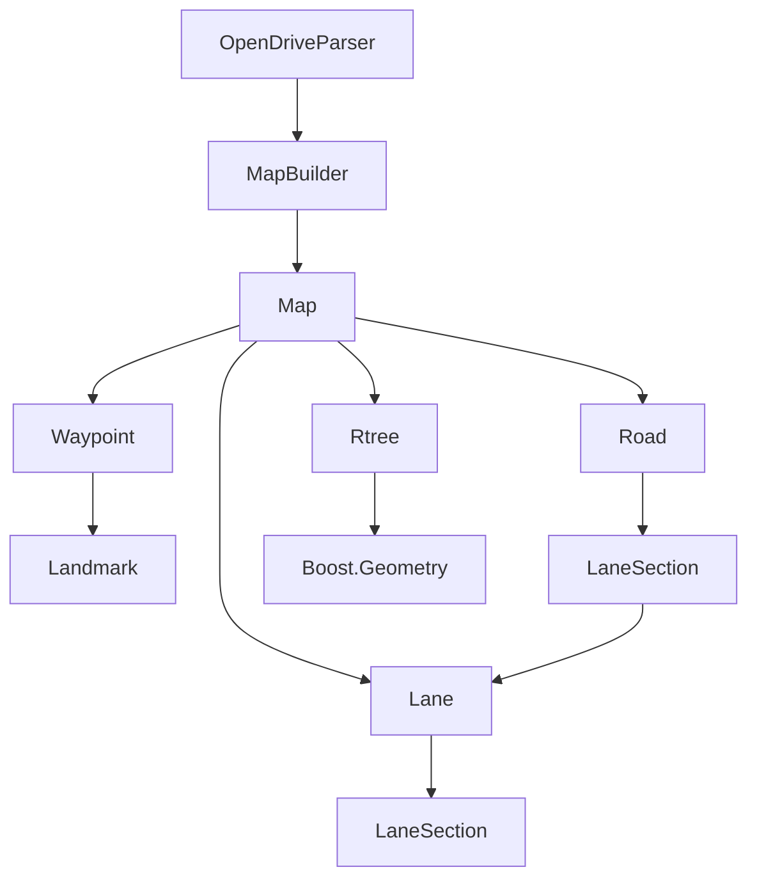

# 地图系统

> **引用文件**
> **本文档中引用的文件**

- [Map.h](https://github.com/carla-simulator/carla/blob/ue5-dev/LibCarla/source/carla/client/Map.h)
- [Map.cpp](https://github.com/carla-simulator/carla/blob/ue5-dev/LibCarla/source/carla/client/Map.cpp)
- [Waypoint.h](https://github.com/carla-simulator/carla/blob/ue5-dev/LibCarla/source/carla/client/Waypoint.h)
- [Waypoint.cpp](https://github.com/carla-simulator/carla/blob/ue5-dev/LibCarla/source/carla/client/Waypoint.cpp)
- [Map.h](https://github.com/carla-simulator/carla/blob/ue5-dev/LibCarla/source/carla/road/Map.h)
- [MapData.h](https://github.com/carla-simulator/carla/blob/ue5-dev/LibCarla/source/carla/road/MapData.h)
- [MapData.cpp](https://github.com/carla-simulator/carla/blob/ue5-dev/LibCarla/source/carla/road/MapData.cpp)
- [OpenDriveParser.h](https://github.com/carla-simulator/carla/blob/ue5-dev/LibCarla/source/carla/opendrive/OpenDriveParser.h)
- [OpenDriveParser.cpp](https://github.com/carla-simulator/carla/blob/ue5-dev/LibCarla/source/carla/opendrive/OpenDriveParser.cpp)
- [MapBuilder.h](https://github.com/carla-simulator/carla/blob/ue5-dev/LibCarla/source/carla/road/MapBuilder.h)
- [Road.h](https://github.com/carla-simulator/carla/blob/ue5-dev/LibCarla/source/carla/road/Road.h)
- [Lane.h](https://github.com/carla-simulator/carla/blob/ue5-dev/LibCarla/source/carla/road/Lane.h)
- [Rtree.h](https://github.com/carla-simulator/carla/blob/ue5-dev/LibCarla/source/carla/geom/Rtree.h)
- [SignalType.cpp](https://github.com/carla-simulator/carla/blob/ue5-dev/LibCarla/source/carla/road/SignalType.cpp)
- [TrafficLightStage.h](https://github.com/carla-simulator/carla/blob/ue5-dev/LibCarla/source/carla/trafficmanager/TrafficLightStage.h)
- [TrafficLightStage.cpp](https://github.com/carla-simulator/carla/blob/ue5-dev/LibCarla/source/carla/trafficmanager/TrafficLightStage.cpp)

## 目录

1. [简介](#简介)
2. [地图数据层次结构](#地图数据层次结构)
3. [Map 类与 OpenDRIVE 标准](#map类与opendrive标准)
4. [路点系统与路径规划](#路点系统与路径规划)
5. [交通标志与信号灯管理](#交通标志与信号灯管理)
6. [性能优化技术](#性能优化技术)
7. [核心组件分析](#核心组件分析)
8. [依赖关系分析](#依赖关系分析)

## 简介

CARLA 地图系统是一个基于 OpenDRIVE 标准的高精度城市道路网络表示和管理系统。该系统通过复杂的层次化数据结构精确建模道路、车道、交叉口、交通标志和信号灯等元素。地图系统的核心是 Map 类，它负责解析 OpenDRIVE 格式的地图文件，构建道路拓扑结构，并提供各种查询和导航功能。系统采用 R-tree 空间索引进行性能优化，支持高效的路点查询和空间搜索。通过 Waypoint 系统，用户可以进行路径规划和导航，同时系统提供了丰富的 API 来查询车道信息、检测交叉口和获取交通标志数据。

## 地图数据层次结构

CARLA 地图系统采用层次化的数据结构来组织道路网络信息，从宏观到微观依次为 Road（道路）、LaneSection（车道段）和 Lane（车道）。

**图源**

- <a href="https://github.com/carla-simulator/carla/blob/ue5-dev/LibCarla/source/carla/road/Road.h#L32" target="_blank">Road.h</a>
- <a href="https://github.com/carla-simulator/carla/blob/ue5-dev/LibCarla/source/carla/road/Lane.h#L25" target="_blank">Lane.h</a>

**本节来源**

- <a href="https://github.com/carla-simulator/carla/blob/ue5-dev/LibCarla/source/carla/road/Road.h#L32-L216" target="_blank">Road.h</a>
- <a href="https://github.com/carla-simulator/carla/blob/ue5-dev/LibCarla/source/carla/road/Lane.h#L25-L149" target="_blank">Lane.h</a>
- <a href="https://github.com/carla-simulator/carla/blob/ue5-dev/LibCarla/source/carla/road/MapData.h#L29-L105" target="_blank">MapData.h</a>

## Map 类与 OpenDRIVE 标准

Map 类是 CARLA 地图系统的核心，它基于 OpenDRIVE 标准构建复杂的道路拓扑结构。Map 类通过 OpenDriveParser 解析器读取 OpenDRIVE 格式的地图文件，将其转换为内部数据结构。

**图源**

- <a href="https://github.com/carla-simulator/carla/blob/ue5-dev/LibCarla/source/carla/client/Map.h#L27-L107" target="_blank">Map.h</a>
- <a href="https://github.com/carla-simulator/carla/blob/ue5-dev/LibCarla/source/carla/opendrive/OpenDriveParser.h#L18-L22" target="_blank">OpenDriveParser.h</a>

**本节来源**

- <a href="https://github.com/carla-simulator/carla/blob/ue5-dev/LibCarla/source/carla/client/Map.h#L27-L107" target="_blank">Map.h</a>
- <a href="https://github.com/carla-simulator/carla/blob/ue5-dev/LibCarla/source/carla/client/Map.cpp#L30-L193" target="_blank">Map.cpp</a>
- <a href="https://github.com/carla-simulator/carla/blob/ue5-dev/LibCarla/source/carla/opendrive/OpenDriveParser.h#L18-L22" target="_blank">OpenDriveParser.h</a>
- <a href="https://github.com/carla-simulator/carla/blob/ue5-dev/LibCarla/source/carla/opendrive/OpenDriveParser.cpp#L27-L50" target="_blank">OpenDriveParser.cpp</a>

## 路点系统与路径规划

路点系统是 CARLA 地图系统中用于路径规划和导航的核心组件。Waypoint 类表示道路上的特定位置，包含道路 ID、车道 ID、路段 ID 和距离等信息。

**图源**

- <a href="https://github.com/carla-simulator/carla/blob/ue5-dev/LibCarla/source/carla/client/Waypoint.h#L27-L127" target="_blank">Waypoint.h</a>
- <a href="https://github.com/carla-simulator/carla/blob/ue5-dev/LibCarla/source/carla/client/Waypoint.cpp#L18-L271" target="_blank">Waypoint.cpp</a>
- <a href="https://github.com/carla-simulator/carla/blob/ue5-dev/LibCarla/source/carla/client/Map.h#L54-L68" target="_blank">Map.h</a>

**本节来源**

- <a href="https://github.com/carla-simulator/carla/blob/ue5-dev/LibCarla/source/carla/client/Waypoint.h#L27-L127" target="_blank">Waypoint.h</a>
- <a href="https://github.com/carla-simulator/carla/blob/ue5-dev/LibCarla/source/carla/client/Waypoint.cpp#L18-L271" target="_blank">Waypoint.cpp</a>
- <a href="https://github.com/carla-simulator/carla/blob/ue5-dev/LibCarla/source/carla/client/Map.h#L54-L68" target="_blank">Map.h</a>
- <a href="https://github.com/carla-simulator/carla/blob/ue5-dev/LibCarla/source/carla/client/Map.cpp#L44-L103" target="_blank">Map.cpp</a>

## 交通标志与信号灯管理

CARLA 地图系统提供了完善的交通标志和信号灯管理功能。系统通过 Landmark 类表示各种交通标志，并通过 Signal 类管理交通信号灯。

**图源**

- <a href="https://github.com/carla-simulator/carla/blob/ue5-dev/LibCarla/source/carla/road/SignalType.cpp#L15-L100" target="_blank">SignalType.cpp</a>
- <a href="https://github.com/carla-simulator/carla/blob/ue5-dev/LibCarla/source/carla/trafficmanager/TrafficLightStage.h#L15-L64" target="_blank">TrafficLightStage.h</a>
- <a href="https://github.com/carla-simulator/carla/blob/ue5-dev/LibCarla/source/carla/trafficmanager/TrafficLightStage.cpp#L15-L171" target="_blank">TrafficLightStage.cpp</a>

**本节来源**

- <a href="https://github.com/carla-simulator/carla/blob/ue5-dev/LibCarla/source/carla/road/SignalType.cpp#L15-L100" target="_blank">SignalType.cpp</a>
- <a href="https://github.com/carla-simulator/carla/blob/ue5-dev/LibCarla/source/carla/trafficmanager/TrafficLightStage.h#L15-L64" target="_blank">TrafficLightStage.h</a>
- <a href="https://github.com/carla-simulator/carla/blob/ue5-dev/LibCarla/source/carla/trafficmanager/TrafficLightStage.cpp#L15-L171" target="_blank">TrafficLightStage.cpp</a>
- <a href="https://github.com/carla-simulator/carla/blob/ue5-dev/LibCarla/source/carla/client/Map.h#L85-L96" target="_blank">Map.h</a>

## 性能优化技术

CARLA 地图系统采用了多种性能优化技术，其中最重要的是 R-tree 空间索引的使用。R-tree 用于加速空间查询操作，如最近邻搜索和范围查询。

**图源**

- <a href="https://github.com/carla-simulator/carla/blob/ue5-dev/LibCarla/source/carla/geom/Rtree.h#L30-L155" target="_blank">Rtree.h</a>
- <a href="https://github.com/carla-simulator/carla/blob/ue5-dev/LibCarla/source/carla/road/Map.h#L209-L211" target="_blank">Map.h</a>

**本节来源**

- <a href="https://github.com/carla-simulator/carla/blob/ue5-dev/LibCarla/source/carla/geom/Rtree.h#L30-L155" target="_blank">Rtree.h</a>
- <a href="https://github.com/carla-simulator/carla/blob/ue5-dev/LibCarla/source/carla/road/Map.h#L209-L211" target="_blank">Map.h</a>
- <a href="https://github.com/carla-simulator/carla/blob/ue5-dev/LibCarla/source/carla/road/Map.cpp#L212-L227" target="_blank">Map.cpp</a>

## 核心组件分析

### MapBuilder 组件分析

MapBuilder 组件负责从 OpenDRIVE 文件构建地图数据结构。它解析 OpenDRIVE 文件的各个部分，并将其转换为内部数据结构。

**图源**

- <a href="https://github.com/carla-simulator/carla/blob/ue5-dev/LibCarla/source/carla/road/MapBuilder.h#L20-L433" target="_blank">MapBuilder.h</a>
- <a href="https://github.com/carla-simulator/carla/blob/ue5-dev/LibCarla/source/carla/opendrive/OpenDriveParser.cpp#L36-L49" target="_blank">OpenDriveParser.cpp</a>

**本节来源**

- <a href="https://github.com/carla-simulator/carla/blob/ue5-dev/LibCarla/source/carla/road/MapBuilder.h#L20-L433" target="_blank">MapBuilder.h</a>
- <a href="https://github.com/carla-simulator/carla/blob/ue5-dev/LibCarla/source/carla/opendrive/OpenDriveParser.cpp#L36-L49" target="_blank">OpenDriveParser.cpp</a>

## 依赖关系分析

CARLA 地图系统的各个组件之间存在复杂的依赖关系。Map 类依赖于 OpenDriveParser 来解析地图文件，而 OpenDriveParser 又依赖于 MapBuilder 来构建地图数据结构。

**图源**

- <a href="https://github.com/carla-simulator/carla/blob/ue5-dev/LibCarla/source/carla/opendrive/OpenDriveParser.cpp#L36-L49" target="_blank">OpenDriveParser.cpp</a>
- <a href="https://github.com/carla-simulator/carla/blob/ue5-dev/LibCarla/source/carla/client/Map.h#L27-L107" target="_blank">Map.h</a>
- <a href="https://github.com/carla-simulator/carla/blob/ue5-dev/LibCarla/source/carla/geom/Rtree.h#L30-L155" target="_blank">Rtree.h</a>

**本节来源**

- <a href="https://github.com/carla-simulator/carla/blob/ue5-dev/LibCarla/source/carla/opendrive/OpenDriveParser.cpp#L36-L49" target="_blank">OpenDriveParser.cpp</a>
- <a href="https://github.com/carla-simulator/carla/blob/ue5-dev/LibCarla/source/carla/client/Map.h#L27-L107" target="_blank">Map.h</a>
- <a href="https://github.com/carla-simulator/carla/blob/ue5-dev/LibCarla/source/carla/road/MapBuilder.h#L20-L433" target="_blank">MapBuilder.h</a>
- <a href="https://github.com/carla-simulator/carla/blob/ue5-dev/LibCarla/source/carla/geom/Rtree.h#L30-L155" target="_blank">Rtree.h</a>
