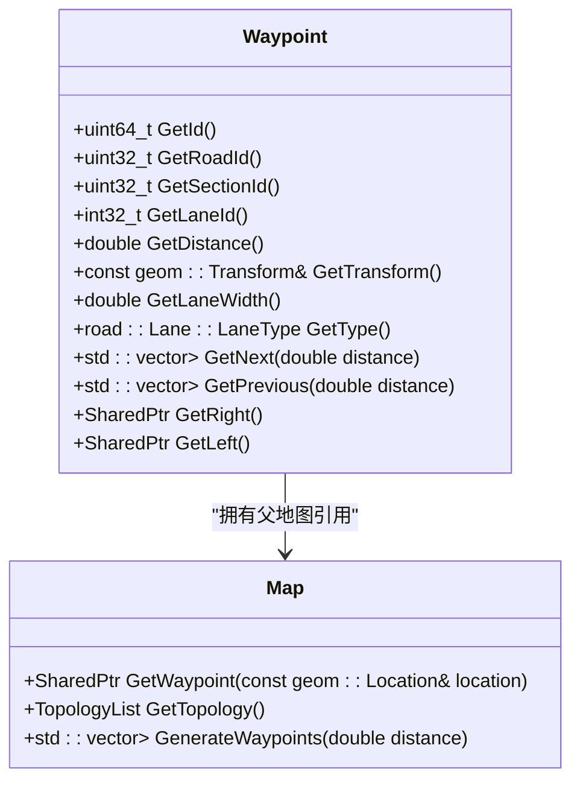
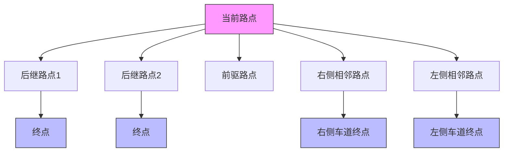
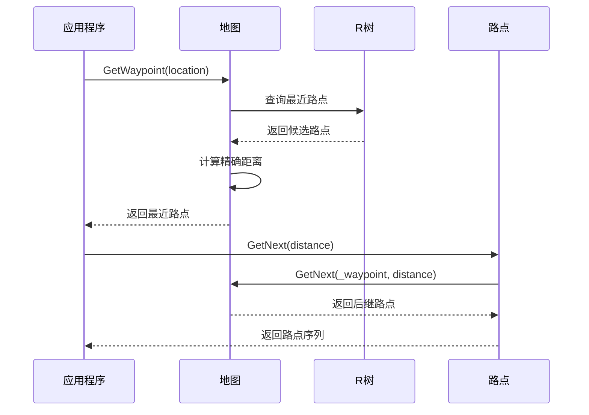
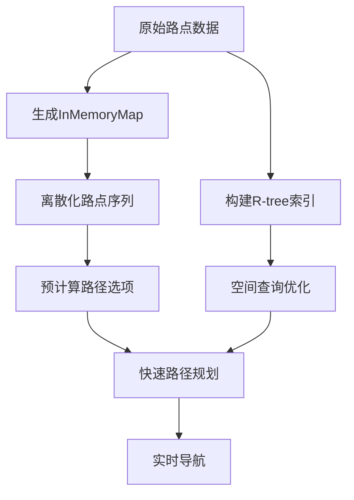

# 路点导航

**本文档引用的文件**   
- [Waypoint.h](https://github.com/carla-simulator/carla/blob/ue5-dev/LibCarla/source/carla/client/Waypoint.h)
- [Waypoint.cpp](https://github.com/carla-simulator/carla/blob/ue5-dev/LibCarla/source/carla/client/Waypoint.cpp)
- [Map.h](https://github.com/carla-simulator/carla/blob/ue5-dev/LibCarla/source/carla/client/Map.h)
- [Map.cpp](https://github.com/carla-simulator/carla/blob/ue5-dev/LibCarla/source/carla/road/Map.cpp)
- [Rtree.h](https://github.com/carla-simulator/carla/blob/ue5-dev/LibCarla/source/carla/geom/Rtree.h)
- [SimpleWaypoint.h](https://github.com/carla-simulator/carla/blob/ue5-dev/LibCarla/source/carla/trafficmanager/SimpleWaypoint.h)
- [InMemoryMap.h](https://github.com/carla-simulator/carla/blob/ue5-dev/LibCarla/source/carla/trafficmanager/InMemoryMap.h)
- [basic_agent.py](https://github.com/carla-simulator/carla/blob/ue5-dev/PythonAPI/carla/agents/navigation/basic_agent.py)
- [controller.py](https://github.com/carla-simulator/carla/blob/ue5-dev/PythonAPI/carla/agents/navigation/controller.py)

## 目录
1. [引言](#引言)
2. [路点数据结构](#路点数据结构)
3. [路点网络拓扑关系](#路点网络拓扑关系)
4. [路点获取与路径搜索](#路点获取与路径搜索)
5. [路点属性查询](#路点属性查询)
6. [性能优化机制](#性能优化机制)
7. [实际应用示例](#实际应用示例)
8. [复杂场景处理](#复杂场景处理)
9. [结论](#结论)

## 引言

CARLA模拟器中的路点导航系统是自动驾驶车辆路径规划和导航的核心组件。路点（Waypoint）作为地图上的离散采样点，不仅包含了精确的位置和旋转信息，还承载了丰富的道路语义信息。本系统基于OpenDRIVE标准构建，通过路点网络为自动驾驶车辆提供连续的路径跟踪能力。路点系统不仅支持基本的路径规划，还能处理复杂的交通场景，如交叉口、变道和交通信号灯交互。该系统通过高效的R-tree空间索引和缓存机制，确保了在大规模城市环境中的实时性能。

**Section sources**
- [Waypoint.h](https://github.com/carla-simulator/carla/blob/ue5-dev/LibCarla/source/carla/client/Waypoint.h#L1-L127)
- [Map.h](https://github.com/carla-simulator/carla/blob/ue5-dev/LibCarla/source/carla/client/Map.h#L1-L111)

## 路点数据结构

路点类（Waypoint）是CARLA导航系统的核心数据结构，它封装了道路网络中的关键信息。每个路点由其在OpenDRIVE地图中的道路ID（road_id）、车道段ID（section_id）、车道ID（lane_id）以及沿道路的s距离（s）唯一确定。路点的ID通过哈希函数生成，确保了半厘米精度的唯一性。路点包含一个变换（Transform）对象，该对象定义了路点在世界坐标系中的位置和旋转。此外，路点还存储了指向其父地图的共享指针，实现了与地图数据的紧密耦合。

**Diagram sources **
- [Waypoint.h](https://github.com/carla-simulator/carla/blob/ue5-dev/LibCarla/source/carla/client/Waypoint.h#L27-L127)
- [Map.h](https://github.com/carla-simulator/carla/blob/ue5-dev/LibCarla/source/carla/client/Map.h#L27-L111)

**Section sources**
- [Waypoint.h](https://github.com/carla-simulator/carla/blob/ue5-dev/LibCarla/source/carla/client/Waypoint.h#L18-L127)
- [Waypoint.cpp](https://github.com/carla-simulator/carla/blob/ue5-dev/LibCarla/source/carla/client/Waypoint.cpp#L18-L271)

## 路点网络拓扑关系

路点之间通过复杂的拓扑关系连接，形成了一个有向图网络。每个路点可以有多个后继（GetNext）和前驱（GetPrevious）路点，这取决于道路的分叉和合并情况。对于变道操作，路点提供了GetRight和GetLeft方法，用于获取相邻车道的对应路点。这些方法返回一个可选的路点，当相邻车道不存在时返回空值。路点的车道变更属性（GetLaneChange）通过位运算确定，支持左变道、右变道或双向变道。这种拓扑结构使得路径规划算法能够灵活地处理各种道路配置，包括多车道高速公路和复杂的交叉路口。

**Diagram sources **
- [Waypoint.h](https://github.com/carla-simulator/carla/blob/ue5-dev/LibCarla/source/carla/client/Waypoint.h#L72-L87)
- [Waypoint.cpp](https://github.com/carla-simulator/carla/blob/ue5-dev/LibCarla/source/carla/client/Waypoint.cpp#L50-L68)
- [Map.cpp](https://github.com/carla-simulator/carla/blob/ue5-dev/LibCarla/source/carla/road/Map.cpp#L519-L553)

**Section sources**
- [Waypoint.h](https://github.com/carla-simulator/carla/blob/ue5-dev/LibCarla/source/carla/client/Waypoint.h#L72-L93)
- [Waypoint.cpp](https://github.com/carla-simulator/carla/blob/ue5-dev/LibCarla/source/carla/client/Waypoint.cpp#L50-L68)

## 路点获取与路径搜索

获取路点的主要方法是通过地图的GetWaypoint函数，该函数接收一个世界坐标位置，并返回距离该位置最近的路点。此过程涉及空间搜索，系统首先使用R-tree索引快速定位候选路点，然后计算精确距离以确定最近路点。路径搜索通常从一个起始路点开始，通过递归调用GetNext方法生成连续的路点序列。对于长距离路径规划，系统会结合全局路径规划器（GlobalRoutePlanner）计算最短路径，然后将其离散化为一系列路点。GetNextUntilLaneEnd方法可以生成从当前路点到车道末端的所有路点，这对于车道级导航非常有用。

**Diagram sources **
- [Map.h](https://github.com/carla-simulator/carla/blob/ue5-dev/LibCarla/source/carla/client/Map.h#L54-L63)
- [Map.cpp](https://github.com/carla-simulator/carla/blob/ue5-dev/LibCarla/source/carla/road/Map.cpp#L212-L231)
- [Waypoint.cpp](https://github.com/carla-simulator/carla/blob/ue5-dev/LibCarla/source/carla/client/Waypoint.cpp#L50-L58)

**Section sources**
- [Map.h](https://github.com/carla-simulator/carla/blob/ue5-dev/LibCarla/source/carla/client/Map.h#L54-L69)
- [Map.cpp](https://github.com/carla-simulator/carla/blob/ue5-dev/LibCarla/source/carla/road/Map.cpp#L212-L231)

## 路点属性查询

路点提供了丰富的属性查询接口，使开发者能够获取详细的道路信息。通过GetLaneWidth方法可以查询当前车道的宽度，这对于车辆定位和路径规划至关重要。GetType方法返回车道类型（如驾驶车道、停车车道等），帮助车辆理解其所在车道的功能。IsJunction方法判断路点是否位于交叉口内，这对于处理交通信号灯和交叉口行为至关重要。此外，路点还支持查询车道标线（GetLeftLaneMarking、GetRightLaneMarking），这些信息对于车道保持和变道决策非常有用。所有这些属性都直接从底层OpenDRIVE数据模型中获取，确保了信息的准确性和一致性。

**Section sources**
- [Waypoint.h](https://github.com/carla-simulator/carla/blob/ue5-dev/LibCarla/source/carla/client/Waypoint.h#L68-L93)
- [Waypoint.cpp](https://github.com/carla-simulator/carla/blob/ue5-dev/LibCarla/source/carla/client/Waypoint.cpp#L41-L49)

## 性能优化机制

为了在大规模城市环境中实现高效的路点查询，CARLA采用了多种性能优化技术。核心是R-tree空间索引，它将3D空间中的路点组织成层次结构，使得最近邻搜索的时间复杂度从O(n)降低到O(log n)。InMemoryMap类在初始化时构建一个离散化的路点缓存，包含所有可能的路径选项和连接关系。CachedSimpleWaypoint结构体将复杂的路点对象序列化为紧凑的二进制格式，减少了内存占用和序列化开销。SimpleWaypoint类作为轻量级包装器，缓存了常用的计算结果，避免了重复的几何计算。这些优化技术共同确保了即使在包含数万个路点的复杂城市地图中，路径规划和导航也能实时进行。

**Diagram sources **
- [Rtree.h](https://github.com/carla-simulator/carla/blob/ue5-dev/LibCarla/source/carla/geom/Rtree.h#L26-L80)
- [InMemoryMap.h](https://github.com/carla-simulator/carla/blob/ue5-dev/LibCarla/source/carla/trafficmanager/InMemoryMap.h#L63-L126)
- [CachedSimpleWaypoint.h](https://github.com/carla-simulator/carla/blob/ue5-dev/LibCarla/source/carla/trafficmanager/CachedSimpleWaypoint.h#L18-L59)

**Section sources**
- [Rtree.h](https://github.com/carla-simulator/carla/blob/ue5-dev/LibCarla/source/carla/geom/Rtree.h#L26-L80)
- [InMemoryMap.h](https://github.com/carla-simulator/carla/blob/ue5-dev/LibCarla/source/carla/trafficmanager/InMemoryMap.h#L63-L126)

## 实际应用示例

在Python API中，路点系统被广泛应用于自动驾驶代理的实现。BasicAgent类使用全局路径规划器计算从起点到终点的最短路径，然后将路径转换为一系列[路点, 路径选项]对，并传递给局部规划器。局部规划器使用PID控制器跟踪这些路点，实现平滑的车辆运动。lane_change方法展示了如何生成变道路径：首先沿当前车道前进一段距离，然后执行变道操作，最后在新车道上继续行驶。这种基于路点的控制架构使得开发者能够轻松实现复杂的驾驶行为，如跟车、超车和交叉口通行。

**Diagram sources **
- [basic_agent.py](https://github.com/carla-simulator/carla/blob/ue5-dev/PythonAPI/carla/agents/navigation/basic_agent.py#L141-L163)
- [controller.py](https://github.com/carla-simulator/carla/blob/ue5-dev/PythonAPI/carla/agents/navigation/controller.py#L54-L92)

**Section sources**
- [basic_agent.py](https://github.com/carla-simulator/carla/blob/ue5-dev/PythonAPI/carla/agents/navigation/basic_agent.py#L141-L163)
- [controller.py](https://github.com/carla-simulator/carla/blob/ue5-dev/PythonAPI/carla/agents/navigation/controller.py#L54-L92)

## 复杂场景处理

路点系统能够有效处理复杂的交通场景。在交叉口，路点通过Landmark系统与交通信号灯关联，车辆可以通过GetAllLandmarksInDistance方法检测前方的交通信号灯。InMemoryMap在构建时会为每个路点分配RoadOption（直行、左转、右转等），这为路径选择提供了语义信息。对于死胡同道路，系统会检测到空的后继路点列表，并相应地调整行为。在处理多车道道路时，系统会检查GetLaneChange属性，确保变道操作的合法性。这些机制共同确保了自动驾驶车辆能够在各种复杂的现实交通环境中安全、可靠地导航。

**Section sources**
- [Waypoint.cpp](https://github.com/carla-simulator/carla/blob/ue5-dev/LibCarla/source/carla/client/Waypoint.cpp#L224-L259)
- [InMemoryMap.cpp](https://github.com/carla-simulator/carla/blob/ue5-dev/LibCarla/source/carla/trafficmanager/InMemoryMap.cpp#L394-L451)

## 结论

CARLA的路点导航系统是一个功能强大且高效的路径规划框架。通过精心设计的路点数据结构和拓扑网络，系统为自动驾驶车辆提供了精确的定位和导航能力。R-tree索引和InMemoryMap缓存机制确保了系统在大规模环境中的实时性能。丰富的属性查询接口和对复杂交通场景的支持，使得开发者能够构建出行为逼真的自动驾驶代理。该系统不仅适用于简单的路径跟踪，还能支持高级的驾驶策略和决策算法，是CARLA模拟器中不可或缺的核心组件。