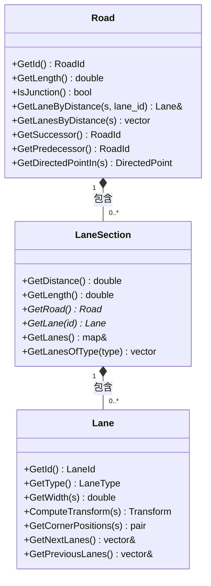
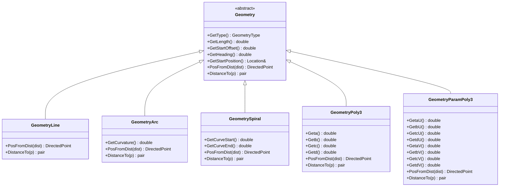
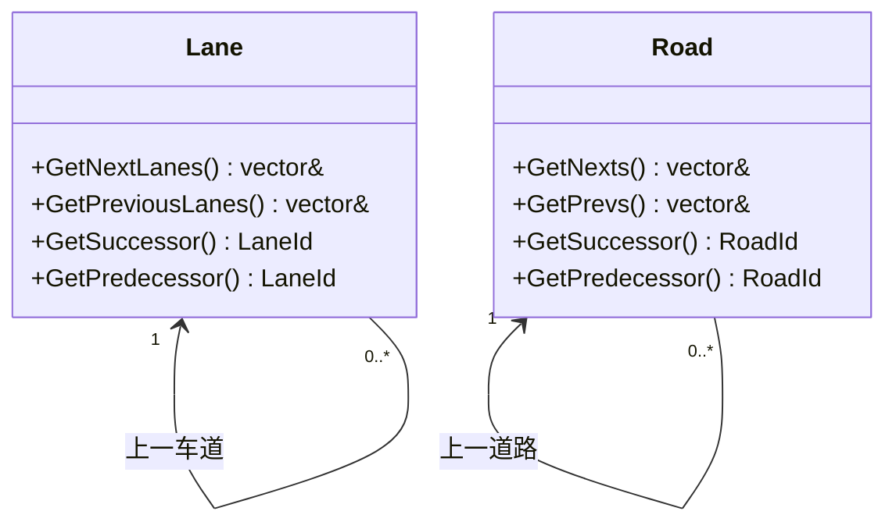
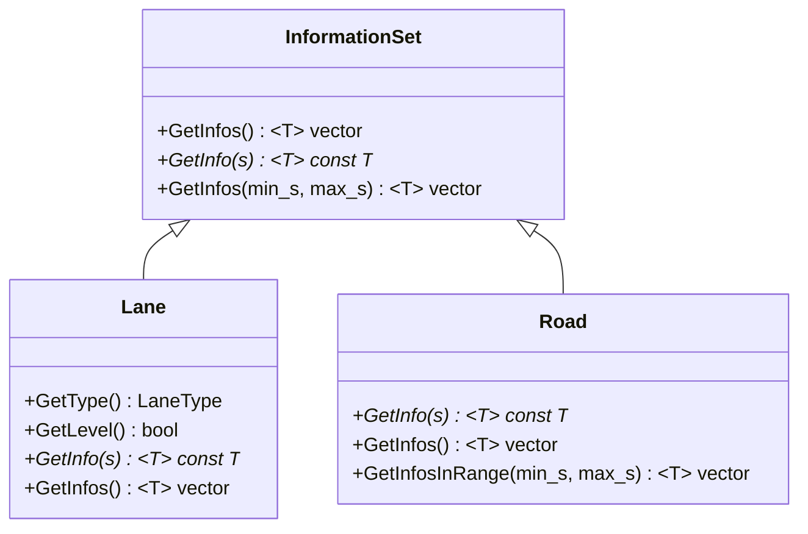
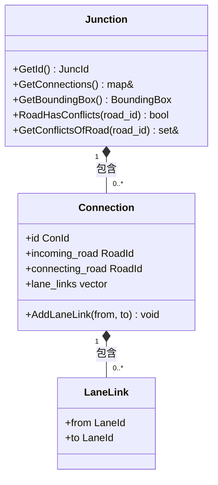
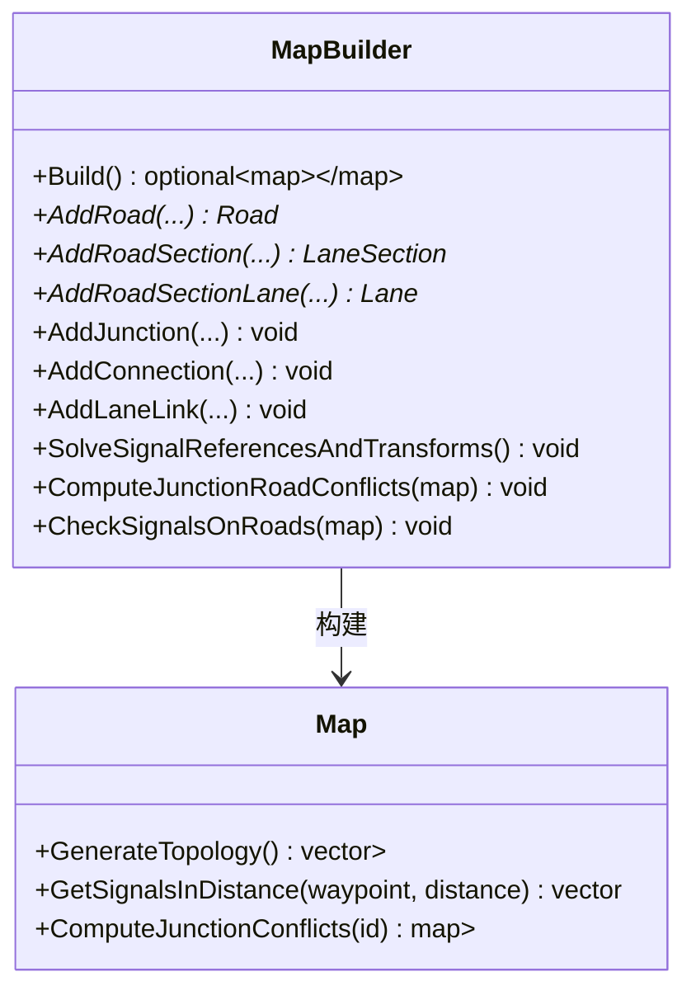
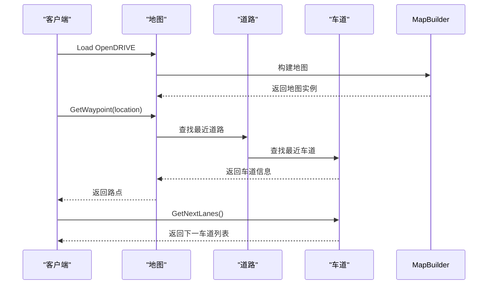
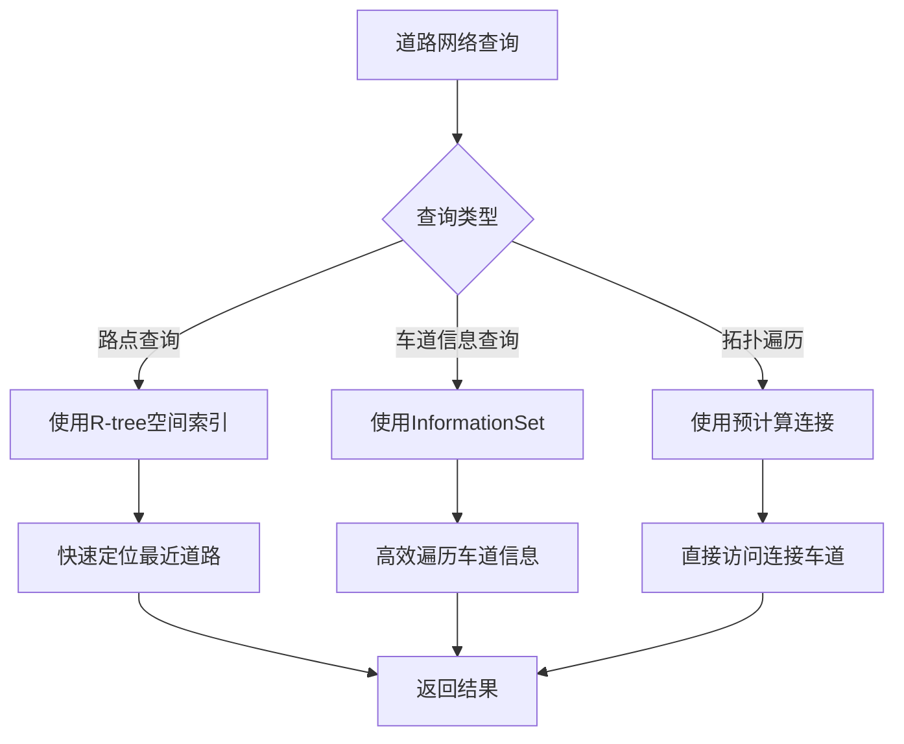

# 道路拓扑

> **引用文件**
> **本文档引用的文件**

- [Road.h](https://github.com/carla-simulator/carla/blob/ue5-dev/LibCarla/source/carla/road/Road.h)
- [LaneSection.h](https://github.com/carla-simulator/carla/blob/ue5-dev/LibCarla/source/carla/road/LaneSection.h)
- [Lane.h](https://github.com/carla-simulator/carla/blob/ue5-dev/LibCarla/source/carla/road/Lane.h)
- [Map.h](https://github.com/carla-simulator/carla/blob/ue5-dev/LibCarla/source/carla/road/Map.h)
- [MapData.h](https://github.com/carla-simulator/carla/blob/ue5-dev/LibCarla/source/carla/road/MapData.h)
- [Geometry.h](https://github.com/carla-simulator/carla/blob/ue5-dev/LibCarla/source/carla/road/element/Geometry.h)
- [OpenDriveParser.h](https://github.com/carla-simulator/carla/blob/ue5-dev/LibCarla/source/carla/opendrive/OpenDriveParser.h)
- [InformationSet.h](https://github.com/carla-simulator/carla/blob/ue5-dev/LibCarla/source/carla/road/InformationSet.h)
- [Junction.h](https://github.com/carla-simulator/carla/blob/ue5-dev/LibCarla/source/carla/road/Junction.h)
- [MapBuilder.h](https://github.com/carla-simulator/carla/blob/ue5-dev/LibCarla/source/carla/road/MapBuilder.h)
- [test_opendrive.cpp](https://github.com/carla-simulator/carla/blob/ue5-dev/LibCarla/source/test/client/test_opendrive.cpp)
- [show_topology.py](https://github.com/carla-simulator/carla/blob/ue5-dev/PythonAPI/util/show_topology.py)

## 目录

1. [引言](#引言)
2. [核心组件层次结构](#核心组件层次结构)
3. [道路几何表示](#道路几何表示)
4. [车道连接与拓扑关系](#车道连接与拓扑关系)
5. [车道级属性与信息](#车道级属性与信息)
6. [道路交叉口建模](#道路交叉口建模)
7. [高级特性与动态行为](#高级特性与动态行为)
8. [代码示例与使用方法](#代码示例与使用方法)
9. [性能优化策略](#性能优化策略)
10. [结论](#结论)

## 引言

CARLA 模拟器中的道路拓扑系统基于 OpenDRIVE 标准构建，提供了一个精确且复杂的道路网络模型。该系统通过 Road、LaneSection 和 Lane 三个核心类的层次结构来表示道路网络，支持从简单的直线道路到复杂的交叉口和匝道系统的建模。道路网络不仅包含几何信息，还包括车道类型、速度限制、交通规则等丰富的语义信息，为自动驾驶仿真提供了坚实的基础。

**本节不分析具体源文件，因此不提供源码引用**

## 核心组件层次结构

CARLA 的道路拓扑系统采用分层设计，由 Road、LaneSection 和 Lane 三个核心类构成。这种层次结构允许系统高效地表示复杂的道路网络，同时保持良好的查询性能。

**图源**

- <a href="https://github.com/carla-simulator/carla/blob/ue5-dev/LibCarla/source/carla/road/Road.h#L32-L212" target="_blank">Road.h</a>
- <a href="https://github.com/carla-simulator/carla/blob/ue5-dev/LibCarla/source/carla/road/LaneSection.h#L24-L63" target="_blank">LaneSection.h</a>
- <a href="https://github.com/carla-simulator/carla/blob/ue5-dev/LibCarla/source/carla/road/Lane.h#L25-L144" target="_blank">Lane.h</a>

**本节源码**

- <a href="https://github.com/carla-simulator/carla/blob/ue5-dev/LibCarla/source/carla/road/Road.h#L32-L212" target="_blank">Road.h</a>
- <a href="https://github.com/carla-simulator/carla/blob/ue5-dev/LibCarla/source/carla/road/LaneSection.h#L24-L63" target="_blank">LaneSection.h</a>
- <a href="https://github.com/carla-simulator/carla/blob/ue5-dev/LibCarla/source/carla/road/Lane.h#L25-L144" target="_blank">Lane.h</a>

## 道路几何表示

道路的几何形状通过多种几何元素来表示，包括直线、圆弧、螺旋线和多项式曲线。这些几何元素共同构成了道路的中心线，为车道的生成提供了基础。

**图源**

- <a href="https://github.com/carla-simulator/carla/blob/ue5-dev/LibCarla/source/carla/road/element/Geometry.h#L49-L341" target="_blank">Geometry.h</a>

**本节源码**

- <a href="https://github.com/carla-simulator/carla/blob/ue5-dev/LibCarla/source/carla/road/element/Geometry.h#L49-L341" target="_blank">Geometry.h</a>

## 车道连接与拓扑关系

车道之间的连接关系是道路拓扑的核心，决定了车辆在道路上的行驶路径。系统通过前后车道的指针连接来表示这种拓扑关系，支持复杂的车道合并、分叉和交叉口场景。

**图源**

- <a href="https://github.com/carla-simulator/carla/blob/ue5-dev/LibCarla/source/carla/road/Lane.h#L90-L104" target="_blank">Lane.h</a>
- <a href="https://github.com/carla-simulator/carla/blob/ue5-dev/LibCarla/source/carla/road/Road.h#L78-L81" target="_blank">Road.h</a>

**本节源码**

- <a href="https://github.com/carla-simulator/carla/blob/ue5-dev/LibCarla/source/carla/road/Lane.h#L90-L104" target="_blank">Lane.h</a>
- <a href="https://github.com/carla-simulator/carla/blob/ue5-dev/LibCarla/source/carla/road/Road.h#L78-L81" target="_blank">Road.h</a>

## 车道级属性与信息

每个车道都包含丰富的属性信息，包括车道类型、速度限制、交通规则等。这些信息通过 InformationSet 类进行管理，支持高效的查询和遍历。

**图源**

- <a href="https://github.com/carla-simulator/carla/blob/ue5-dev/LibCarla/source/carla/road/InformationSet.h#L20-L70" target="_blank">InformationSet.h</a>
- <a href="https://github.com/carla-simulator/carla/blob/ue5-dev/LibCarla/source/carla/road/Lane.h#L78-L88" target="_blank">Lane.h</a>
- <a href="https://github.com/carla-simulator/carla/blob/ue5-dev/LibCarla/source/carla/road/Road.h#L114-L127" target="_blank">Road.h</a>

**本节源码**

- <a href="https://github.com/carla-simulator/carla/blob/ue5-dev/LibCarla/source/carla/road/InformationSet.h#L20-L70" target="_blank">InformationSet.h</a>
- <a href="https://github.com/carla-simulator/carla/blob/ue5-dev/LibCarla/source/carla/road/Lane.h#L78-L88" target="_blank">Lane.h</a>
- <a href="https://github.com/carla-simulator/carla/blob/ue5-dev/LibCarla/source/carla/road/Road.h#L114-L127" target="_blank">Road.h</a>

## 道路交叉口建模

道路交叉口通过 Junction 类进行建模，支持复杂的交通流控制和冲突检测。交叉口包含多个连接（Connection），每个连接定义了从一条道路到另一条道路的路径。

**图源**

- <a href="https://github.com/carla-simulator/carla/blob/ue5-dev/LibCarla/source/carla/road/Junction.h#L23-L104" target="_blank">Junction.h</a>

**本节源码**

- <a href="https://github.com/carla-simulator/carla/blob/ue5-dev/LibCarla/source/carla/road/Junction.h#L23-L104" target="_blank">Junction.h</a>

## 高级特性与动态行为

CARLA 的道路拓扑系统支持多种高级特性，包括动态车道变化、交通信号控制和道路冲突检测。这些特性通过 MapBuilder 类在地图构建过程中实现，确保了道路网络的完整性和一致性。

**图源**

- <a href="https://github.com/carla-simulator/carla/blob/ue5-dev/LibCarla/source/carla/road/MapBuilder.h#L20-L432" target="_blank">MapBuilder.h</a>
- <a href="https://github.com/carla-simulator/carla/blob/ue5-dev/LibCarla/source/carla/road/Map.h#L143-L153" target="_blank">Map.h</a>

**本节源码**

- <a href="https://github.com/carla-simulator/carla/blob/ue5-dev/LibCarla/source/carla/road/MapBuilder.h#L20-L432" target="_blank">MapBuilder.h</a>
- <a href="https://github.com/carla-simulator/carla/blob/ue5-dev/LibCarla/source/carla/road/Map.h#L143-L153" target="_blank">Map.h</a>

## 代码示例与使用方法

以下示例展示了如何使用 CARLA 的道路拓扑 API 进行常见的操作，如加载地图、查询车道信息和遍历道路网络。

**图源**

- <a href="https://github.com/carla-simulator/carla/blob/ue5-dev/LibCarla/source/carla/opendrive/OpenDriveParser.h#L18-L21" target="_blank">OpenDriveParser.h</a>
- <a href="https://github.com/carla-simulator/carla/blob/ue5-dev/LibCarla/source/carla/road/Map.h#L54-L65" target="_blank">Map.h</a>
- <a href="https://github.com/carla-simulator/carla/blob/ue5-dev/LibCarla/source/carla/road/Lane.h#L90-L96" target="_blank">Lane.h</a>

**本节源码**

- <a href="https://github.com/carla-simulator/carla/blob/ue5-dev/LibCarla/source/carla/opendrive/OpenDriveParser.h#L18-L21" target="_blank">OpenDriveParser.h</a>
- <a href="https://github.com/carla-simulator/carla/blob/ue5-dev/LibCarla/source/carla/road/Map.h#L54-L65" target="_blank">Map.h</a>
- <a href="https://github.com/carla-simulator/carla/blob/ue5-dev/LibCarla/source/carla/road/Lane.h#L90-L96" target="_blank">Lane.h</a>

## 性能优化策略

为了提高道路拓扑查询的性能，CARLA 采用了多种优化策略，包括 R-tree 空间索引、信息集优化和多线程处理。这些策略确保了在大规模道路网络中的高效查询。

**图源**

- <a href="https://github.com/carla-simulator/carla/blob/ue5-dev/LibCarla/source/carla/road/Map.h#L209-L211" target="_blank">Map.h</a>
- <a href="https://github.com/carla-simulator/carla/blob/ue5-dev/LibCarla/source/carla/road/InformationSet.h#L20-L70" target="_blank">InformationSet.h</a>
- <a href="https://github.com/carla-simulator/carla/blob/ue5-dev/LibCarla/source/carla/road/MapBuilder.h#L372-L375" target="_blank">MapBuilder.h</a>

**本节源码**

- <a href="https://github.com/carla-simulator/carla/blob/ue5-dev/LibCarla/source/carla/road/Map.h#L209-L211" target="_blank">Map.h</a>
- <a href="https://github.com/carla-simulator/carla/blob/ue5-dev/LibCarla/source/carla/road/InformationSet.h#L20-L70" target="_blank">InformationSet.h</a>
- <a href="https://github.com/carla-simulator/carla/blob/ue5-dev/LibCarla/source/carla/road/MapBuilder.h#L372-L375" target="_blank">MapBuilder.h</a>

## 结论

CARLA 的道路拓扑系统通过精心设计的层次结构和高效的实现，为自动驾驶仿真提供了强大的道路网络建模能力。系统基于 OpenDRIVE 标准，支持复杂的道路几何、丰富的车道属性和精确的交通规则。通过 Road、LaneSection 和 Lane 三个核心类的协同工作，系统能够表示从简单道路到复杂交叉口的各种场景。高级特性如动态车道变化、交通信号控制和道路冲突检测进一步增强了系统的仿真能力。对于开发者而言，直观的 API 设计和丰富的查询功能使得道路拓扑的使用变得简单高效。性能优化策略确保了在大规模场景中的实时响应，为自动驾驶算法的开发和测试提供了可靠的基础。

**本节不分析具体源文件，因此不提供源码引用**
